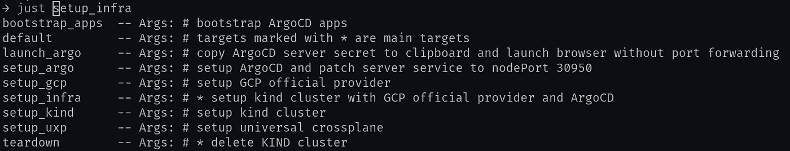

# 盒子里的 Kubernetes

> 原文：<https://itnext.io/kubernetes-in-a-box-7a146ba9f681?source=collection_archive---------1----------------------->


照片由[米娅·戈利奇](https://unsplash.com/@miagolic?utm_source=medium&utm_medium=referral)在 [Unsplash](https://unsplash.com?utm_source=medium&utm_medium=referral) 拍摄

本文将对任何有兴趣以一种可重复且简单的方式建立本地 Kubernetes 开发/测试环境的人有所帮助。这个博客的源代码可以在这个[配套资源库](https://github.com/Piotr1215/kubernetes-box)中找到。

相同的内容发布到我的网页上，在那里你可以找到博客、文档和云原生相关的练习:cloudrumble.net

本地 Kubernetes 环境有用的原因有几个:

*   云原生应用开发，包括共享
*   在部署到产品之前检查新的舵图
*   测试基础设施变更和配置
*   测试新的 Kubernetes 版本

当然，这个清单还不止这些。

鉴于本地或测试 Kubernetes 环境非常有用，它的创建应该完全自动化。让我们学习如何做它。


莱尼·屈尼在 Unsplash 的照片

# 选择什么设置

运行本地 Kubernetes 实例有很多选择，但我们将重点关注 KIND。KIND 非常容易维护，设置起来也很快。第二好的 IMO 是`k3s`。

*   [Minikube](https://minikube.sigs.k8s.io/docs/)
*   [MicroK8s](https://microk8s.io/)
*   **→** [种类](https://kind.sigs.k8s.io/)在 Docker 中 Kubernetes
*   [流浪汉](https://www.vagrantup.com/)和 [VirtualBox](https://www.virtualbox.org/)
*   [Docker 桌面](https://www.docker.com/products/docker-desktop)
*   [牧场主桌面](https://rancherdesktop.io/)
*   [k3s](https://github.com/k3s-io/k3s) 也带有 [k3d](https://k3d.io/v5.4.6/) 包装

# 命令式 vs 陈述式

在我们开始设置之前，让我们先讨论一下*声明式* vs *命令式*方法。在 devo PS/云原生世界中，任何*命令*通常都是不被认可的。我认为这两种方法都有道理，取决于具体情况。

> *每当谈到* ***某物 vs 别的什么*** *的时候，确实是在讲什么时候用* ***某物*** *和什么时候用* ***别的什么*** *。*

有了这个启发，我们将根据需求和我们想要达到的目标使用这两种方法。

# 这就像一个 Makefile，只是更好

建立一个本地或测试 Kubernetes 环境意味着编排一堆命令，包括脚本、YAML 文件、舵图等。在*命令式*范例中，这通常通过`Makefile`或`bash scripts`来完成。

`make`的问题在于，它被设计成*构建 C 源代码的工具，它可以*运行命令，但这不是它的目的。这意味着当使用`Makefile`时，我们承担了构建部分所有不必要的负担。

`Bash scripts`稍微好一点，但是过了一会儿它们就变得过于啰嗦和沉重了。当使用`defensive coding`实践创建设置时尤其如此。

有一种工具结合了两者的优点；[只是](https://github.com/casey/just)与`make`类似，但侧重于命令编排。

> *你会在后面的动作示例部分看到一个* `*justfile*` *。*

# 声明式方法仍然是我们的朋友

`Justfile`包含快速创建和销毁本地集群所需的所有命令性逻辑。它暴露了各种旋钮和按钮，供我们与之交互或更改设置。

现在来看集群应用。安装舵图、操作符或简单的 YAML 文件可以使用 GitOps 进程声明性地完成。这可以通过`Flux`或`ArgoCD`完成。对于快速的本地设置， [ArgoCD](https://argo-cd.readthedocs.io/en/stable/getting_started/) 由于其强大的网络客户端而更加用户友好。在这里，我们利用`app of apps`模式引导来自单一来源的额外应用。[这篇文章](https://kubito.dev/posts/automated-argocd-app-of-apps-installation/)很好地描述了这个模式。

> 我们只是触及了 ArgoCD 或 GitOps 的皮毛。你可以在 [*这里*](/gitops-with-kubernetes-740f37ea015b) *和* [*这里*](/gitopsify-cloud-infrastructure-with-crossplane-and-flux-d605d3043452) *阅读更多关于 GitOps 的内容。*

# 合作


照片由 [krakenimages](https://unsplash.com/@krakenimages?utm_source=medium&utm_medium=referral) 在 [Unsplash](https://unsplash.com?utm_source=medium&utm_medium=referral) 上拍摄

本地设置不排除协作。我们可以通过两种主要方式按需协作。

*   使用 **ngrok** 在互联网上显示本地端口并共享我们的 Kubernetes 应用程序
*   接受 PRs 到我们的 ArgoCD 库，让其他人在我们的集群上安装基础设施/应用程序

> [*点击此处了解更多关于使用 ngrok 在互联网上共享本地 Kubernetes 服务的信息。*](/expose-local-kubernetes-service-on-internet-using-ngrok-2888a1118b5b)

# 示例设置

我使用类似的设置来测试[通用交叉平面](https://github.com/upbound/universal-crossplane) (uxp)，它是[交叉平面](https://crossplane.io/)的上游分支。

输入`just<TAB>`将显示所有可用的公正目标。



只有参数

```
set export
set shell := ["bash", "-uc"]yaml    := justfile_directory() + "/yaml"
scripts := justfile_directory() + "/scripts"browse      := if os() == "linux" { "xdg-open "} else { "open" }
copy        := if os() == "linux" { "xsel -ib"} else { "pbcopy" }argocd_port  := "30950"
cluster_name := "control-plane"export gcp_provider_version     := "v0.15.0"# this list of available targets
# targets marked with * are main targets
default:
  @just --list --unsorted# * setup kind cluster with GCP official provider and ArgoCD
setup_infra: setup_kind setup_uxp setup_gcp setup_argo# setup kind cluster
setup_kind:
  #!/usr/bin/env bash
  set -euo pipefail echo "Creating kind cluster - {{cluster_name}}"
  envsubst < kind-config.yaml | kind create cluster --config - --wait 3m
  kind get kubeconfig --name {{cluster_name}}
  kubectl config use-context kind-{{cluster_name}}# setup Universal Crossplane
setup_uxp:
  echo "Installing UXP"
  kubectl create namespace upbound-system
  helm repo add upbound-stable https://charts.upbound.io/stable && helm repo update
  helm install uxp --namespace upbound-system upbound-stable/universal-crossplane --devel
  kubectl wait --for condition=Available=True --timeout=300s deployment/xgql --namespace upbound-system# setup GCP Crossplane provider
setup_gcp:
  @echo "Setting up GCP Crossplane provider"
  @kubectl config use-context kind-control-plane
  @envsubst < {{yaml}}/gcp-provider.yaml | kubectl apply -f -
  @kubectl wait --for condition=healthy --timeout=300s provider/provider-gcp# setup ArgoCD and patch server service to nodePort 30950
setup_argo:
  @echo "Installing ArgoCD"
  @kubectl create namespace argocd
  @kubectl apply -n argocd -f https://raw.githubusercontent.com/argoproj/argo-cd/stable/manifests/install.yaml
  @kubectl wait --for condition=Available=True --timeout=300s deployment/argocd-server --namespace argocd
  @kubectl patch svc argocd-server -n argocd -p '{"spec": {"type": "NodePort"}}'
  @kubectl patch svc argocd-server -n argocd --type merge --type='json' -p='[{"op": "replace", "path": "/spec/ports/0/nodePort", "value": {{argocd_port}}}]'# copy ArgoCD server secret to clipboard and launch browser without port forwarding
launch_argo:
  @kubectl -n argocd get secret argocd-initial-admin-secret -o jsonpath="{.data.password}" | base64 -d | {{copy}}
  @nohup {{browse}} http://localhost:{{argocd_port}} >/dev/null 2>&1 &# bootstrap ArgoCD apps
bootstrap_apps:
  @kubectl apply -f bootstrap.yaml# * delete KIND cluster
teardown:
  @echo "Delete KIND cluster"
  @kind delete clusters control-plane
```

# YAML 文件中的替代变量

有时我们需要用自定义值来修补 YAML 文件。

有几种方法可以模仿 YAML。我们可以用[头盔图](https://helm.sh/docs/topics/charts/)包装，用 [ytt](https://carvel.dev/ytt/) ， [jsonnet](http://localhost:8098/page/jsonnet) ， [yq](https://mikefarah.gitbook.io/yq/) ， [kustomize](https://github.com/kubernetes-sigs/kustomize) 或者其他很多。这些都是有效的方法，但是对于本地环境，有一个更简单的方法。

我们将使用`envsubst`来代替。它是 [GNU gettext 实用程序](https://www.gnu.org/software/gettext/manual/gettext.html)的一部分，应该已经安装在您的系统上了。这个工具使我们能够动态地修补环境变量。

# 创建集群

这将创建一个安装了 ArgoCD 和 UXP 的本地类集群。

> 这个设置应该可以在 Linux 和 Mac 上运行，但是我只在 Linux 上测试过

从`root`文件夹运行

```
just setup_infra
```

一旦一切都设置好了，启动 ArgoCD 并登录

```
just launch_argo
```

*   用户名:**管理员**
*   密码:**应该在你的剪贴板**里，所以把它粘贴到`password`文本框里就行了。如果这不起作用，您可以运行`@kubectl -n argocd get secret argocd-initial-admin-secret -o jsonpath="{.data.password}" | base64 -d`来获取密码。

## 安装更多内容

ArgoCD 的引导应用程序一旦部署，就会观察`apps`目录的任何变化。

```
just bootstrap_apps
```

目录中已经有 2 个示例应用程序。

```
apiVersion: argoproj.io/v1alpha1
kind: Application
metadata:
  name: bootstrap
  namespace: argocd
spec:
  destination:
    namespace: argocd
    server: https://kubernetes.default.svc
  project: default
  source:
    path: apps
    repoURL: https://github.com/Piotr1215/kubernetes-box
    targetRevision: HEAD
  syncPolicy:
    automated:
      selfHeal: true
    syncOptions:
    - CreateNamespace=true
```

这将通过 ArgoCD 将所有应用程序从`apps`文件夹部署到集群中。

# 摧毁集群

```
just teardown
```

# 摘要

部署本地/测试 Kubernetes 实例可以而且应该完全自动化。我们已经看到了如何使用*声明性*和*命令性*技术帮助我们创建一个功能齐全的集群，能够公开 Kubernetes 服务并与任何愿意贡献内容的人协作。

这种设置可以很容易地过渡到生产集群。然而，在这种情况下，安装的*命令性*组件应该转换为*声明性*方法，以帮助长期维护。

我用这个设置来测试[通用交叉平面](https://docs.upbound.io/uxp/)及其提供者。你会用它做什么？你认为你会改进，改变部分设置吗？请在评论中告诉我。