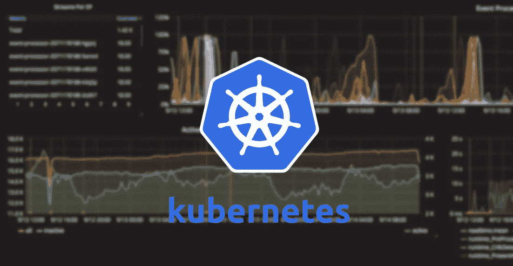

# 生产中的 Kubernetes 生产中断预算

> 原文：<https://itnext.io/kubernetes-in-production-poddisruptionbudget-1380009aaede?source=collection_archive---------1----------------------->

如何管理 Kubernetes 中的中断？设置适当的滚动更新策略规范只能解决一种类型的中断。

其他中断呢？



我的宝贝着火了[来源:谷歌图片]

# 自愿和非自愿中断

pod 不会消失，直到有人(一个人或一个控制者)破坏它们，或者出现不可避免的硬件或系统软件错误。

我们将这些不可避免的情况称为对应用程序的非自愿中断。例如:

*   支持节点的物理机的硬件故障
*   集群管理员误删除了虚拟机(实例)
*   云提供商或虚拟机管理程序故障导致虚拟机消失
*   严重的恐慌
*   由于群集网络分区，节点从群集中消失
*   由于节点[资源不足](https://kubernetes.io/docs/tasks/administer-cluster/out-of-resource/)而驱逐 pod。

除了资源不足的情况，大多数用户应该熟悉所有这些情况；它们不是 Kubernetes 特有的。

我们称其他情况为*自愿中断*。这些操作包括由应用程序所有者发起的操作和由集群管理员发起的操作。典型的应用程序所有者操作包括:

*   删除管理 pod 的部署或其他控制器
*   更新部署的 pod 模板导致重新启动
*   直接删除 pod(例如意外删除)

集群管理员操作包括:

*   [排空节点](https://kubernetes.io/docs/tasks/administer-cluster/safely-drain-node/)进行维修或升级。
*   从集群中排出一个节点以缩小集群(了解[集群自动缩放](https://kubernetes.io/docs/tasks/administer-cluster/cluster-management/#cluster-autoscaler))。
*   从一个节点上移除一个 pod 以允许在该节点上安装其他东西。

# 处理中断

以下是一些减轻非自愿中断的方法:

*   确保你的 pod [请求它需要的资源](https://kubernetes.io/docs/tasks/configure-pod-container/assign-cpu-ram-container)。
*   如果您需要更高的可用性，请复制您的应用程序。(了解如何运行复制的[无状态](https://kubernetes.io/docs/tasks/run-application/run-stateless-application-deployment/)和[有状态](https://kubernetes.io/docs/tasks/run-application/run-replicated-stateful-application/)应用程序。)
*   为了在运行复制的应用程序时获得更高的可用性，可以跨机架(使用[反亲缘](https://kubernetes.io/docs/user-guide/node-selection/#inter-pod-affinity-and-anti-affinity-beta-feature))或跨区域(如果使用[多区域集群](https://kubernetes.io/docs/setup/multiple-zones))分布应用程序。)

# PodDisruptionBudget

应用程序所有者可以为每个应用程序创建一个`**PodDisruptionBudget**`对象(PDB)。PDB 限制了因自愿中断而同时停机的复制应用程序的数量。例如，基于仲裁的应用程序希望确保运行的副本数量永远不会低于仲裁所需的数量。web 前端可能希望确保为负载提供服务的副本数量永远不会低于总数的某个百分比。

集群管理器和托管提供商应该使用考虑 Pod 中断预算的工具，通过调用[驱逐 API](https://kubernetes.io/docs/tasks/administer-cluster/safely-drain-node/#the-eviction-api) 而不是直接删除 Pod。例如`**kubectl drain**`命令和 Kubernetes-on-GCE 集群升级脚本(`**cluster/gce/upgrade.sh**`)。

当集群管理员想要清空一个节点时，他们使用`**kubectl drain**`命令。该工具试图驱逐机器上的所有 pod。驱逐请求可以被暂时拒绝，并且该工具周期性地重试所有失败的请求，直到所有 pod 被终止，或者直到达到可配置的超时。

使用 minAvailable 的 PDB 示例:

```
**apiVersion: policy/v1beta1
kind: PodDisruptionBudget
metadata:
  name: zk-pdb
spec:
  minAvailable: 2
  selector:
    matchLabels:
      app: zookeeper**
```

使用 maxUnavailable 的 PDB 示例(Kubernetes 1.7 或更高版本):

```
**apiVersion: policy/v1beta1
kind: PodDisruptionBudget
metadata:
  name: zk-pdb
spec:
  maxUnavailable: 1
  selector:
    matchLabels:
      app: zookeeper**
```

# 舵

在你的图表中使用这个！

templates/pdb.yaml:

```
**{{- if .Values.budget.minAvailable -}}**
apiVersion: policy/v1beta1
kind: PodDisruptionBudget
metadata:
  name: {{ template "app.fullname" . }}
  namespace: {{ .Values.namespace }}
  labels:
    app: {{ template "app.name" . }}
    chart: {{ .Chart.Name }}-{{ .Chart.Version | replace "+" "_" }}
    release: {{ .Release.Name }}
    heritage: {{ .Release.Service }}
spec:
  selector:
    matchLabels:
      app: {{ template "app.name" . }}
      env: {{ .Values.env.name }}
  minAvailable: **{{ .Values.budget.minAvailable }}**
**{{- end -}}**
```

假设您有一个包含 2 个副本的服务，即使在节点升级和其他操作任务期间，您也需要至少 1 个副本可用。

安装/升级您的版本:

```
helm upgrade --install --debug "$RELEASE_NAME" -f helm/values.yaml \ **--set replicas=2,budget.minAvailable=1** myrepo/mychart
```

kubectl 描述 pdb "$RELEASE_NAME "

```
Name: mysvc-prod
Namespace: prod
Min available: 1
Selector: app=myservice,env=prod
Status:
 **Allowed disruptions: 1
 Current: 2
 Desired: 1
 Total: 2**
Events: <none>
```

在一个 pod 运行的情况下排空一个节点:

```
kubectl drain --delete-local-data --force --ignore-daemonsets gke-mycluster-prod-pool-2fca4c85-k6g5node "gke-mycluster-prod-pool-2fca4c85-k6g5" already cordoned
WARNING: Deleting pods with local storage: sqlproxy-67f695889d-t778w; Ignoring DaemonSet-managed pods: fluentd-gcp-v3.0.0-llp5s; Deleting pods not managed by ReplicationController, ReplicaSet, Job, DaemonSet or StatefulSet: kube-proxy-gke-testing-dev-pool-2fca4c85-k6g5
pod "tiller-deploy-7b7b795779-rcvkd" evicted
**pod "mysvc-prod-6856d59f9b-lzrtf" evicted**
node "gke-mycluster-prod-pool-2fca4c85-k6g5" drained
```

再次:kubectl 描述 pdb "$RELEASE_NAME "

```
Name: mysvc-prod
Namespace: prod
Min available: 1
Selector: app=myservice,env=prod
Status:
 **Allowed disruptions: 0
 Current: 1
 Desired: 1
 Total: 2**
Events: <none>
```

Tadaaa！我们在没有任何服务中断的情况下清空了一个节点。

# 只有一个副本的 PDB？

如果我们只有一个副本，那么 [**kubectl 漏极将会阻塞**](https://github.com/kubernetes/kubernetes/issues/48307) **总是**。节点消耗/升级需要手动解决。

您可能会期望驱逐 API 会尝试增加一个副本以符合 minAvailable 条件，但结果是排水管堵塞了，您有责任自己解决这种情况。是 **bug 还是特性**？Kubernetes 社区说，如果你想要 HA，你根本不应该在生产中使用 1 个副本，这是公平的:)

尽管如此，它还是做了预期的事情。

如果您不希望您的 kubectl 排出被阻塞，您可能希望使用 PDB 来部署多个副本。

编辑您的模板/pdb.yaml:

```
{{- if .Values.budget.minAvailable -}}
**{{- if gt .Values.replicaCount 1 -}}**
apiVersion: policy/v1beta1
kind: PodDisruptionBudget
metadata:
...
**{{- end -}}**
{{- end -}}
```

# 如何在集群上执行破坏性操作

如果您是集群管理员，并且需要在集群中的所有节点上执行中断性操作，例如节点或系统软件升级，以下是一些选项:

## 接受升级期间的停机时间。

## 故障转移到另一个完整的副本群集。

*   没有停机时间，但对于复制的节点和协调切换的人工工作来说，成本可能很高。

## 编写容许中断的应用程序并使用 pdb。

*   没有停机时间。
*   最小的资源重复。
*   允许更自动化的集群管理。
*   编写容许中断的应用程序是棘手的，但是容许自愿中断的工作与支持自动伸缩和容许非自愿中断的工作有很大的重叠。

来源:
文档[https://kubernetes . io/docs/concepts/workloads/pods/disruptions/](https://kubernetes.io/docs/concepts/workloads/pods/disruptions/)
魔法