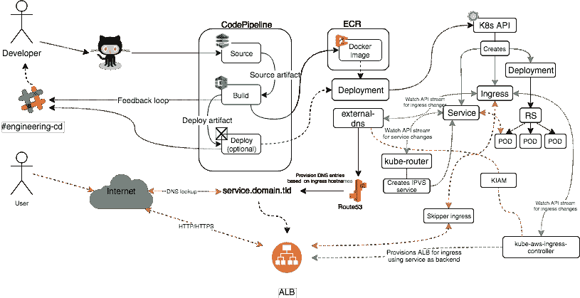

# 生产中的 kubernetes @ shop gun

> 原文：<https://itnext.io/kubernetes-in-production-shopgun-2c280f0c0923?source=collection_archive---------2----------------------->

—建造、装箱、运输

> 与旧的基于 CodeDeploy 的设置相比，通过访问 Kubernetes，我们将运行实例的数量减少了大约 50%,并将每月 EC2 运行成本降低了 40%

当我开始在我现在的雇主 [ShopGun](https://shopgun.com/about) 工作时，我的目的是将当前的 AWS 平台集装箱化，并将所有东西都转移到 Kubernetes

你这么说听起来很简单，不是吗？😃

经过大约 9 个月的紧张工作，最后一个软件项目被转移到我们的生产 Kubernetes 集群。为 devops 团队树立里程碑

我们不仅大幅降低了 EC2 的运营成本。我们在收购我们在挪威最大的竞争对手 [Mattilbud](https://mattilbud.com) 时做到了这一点，将他们的整个基础设施纳入我们的羽翼之下，大大增加了整个平台的用户群

# 背景

当我开始的时候，平台的大部分都配备了 terraform 或云形成代码，为每个项目和环境创建一个实例。总共大约 70 个不同的实例和一堆 ELB，大约三分之一是暂存环境

有一个 Jenkins 实例构建代码，我们主要使用 CodeDeploy 将项目发布到实例中

这是一个坚实的，但不是很划算的设置

因此，我要处理的是大约 20 个不同形状、大小和形式的软件项目，每个环境都运行在一个 EC2 实例上。
大部分都是用 Erlang、Python、Nodejs、PHP 或者 Go 写的

所有的都必须放进容器里

# **新管道诞生**

> 手头有一个用 Erlang 编写的 hello-world 项目，我在一个周五的傍晚开始了我的探索之旅。它在周六早上的某个时候结束了，基础已经奠定，我现在拥有了继续前进所需的一切

要克服的早期障碍之一是我们如何在新的堆栈中构建我们的软件

詹金斯是詹金斯，它偶尔会放弃，需要一脚踢。有些项目需要相当奇怪和笨拙的部署脚本才能在 AWS 上按预期工作。人们渴望更容易交互、更透明、最重要的是更精简的东西

经过一些测试和观察，我决定用 CodePipeline、code build & Elastic Container Registry 来创建我的 Docker 图像

最后，我用 Python 编写了自己的 lambda 函数，它作为每个项目代码管道中的一个步骤触发，将代码部署到不同的 Kubernetes 集群

清单在 Github repo 中存储为 Jinja2 模板化的 Kubernetes YAML 资源

pod 的运行时配置主要是通过环境变量来完成的，并且作为秘密存储在 Kubernetes 中，在创建 pod 时使用

最后，从概念的角度来看，这就是它看起来的样子

*   开发人员向 Github 提交代码
*   CodePipeline 获取代码并将其发送给 CodeBuild
*   CodeBuild 构建 docker 文件并将其推送到 ECR
*   CodePipeline 触发构建的 docker 映像的部署
*   部署者从安全存储中创建 k8s 中的秘密
*   部署人员呈现 Github repo 提供的 YAML 文件，并创建任何已定义的资源，如部署、有状态集、服务、入口规则等

上面的所有步骤都会在我们的工程频道上发布反馈，同时还提供了一个小的一行程序，开发人员可以在世界上任何地方的终端上实时跟踪构建输出

一旦管道运行，我们有一些 Docker 图像建设项目可以继续进行

# 建立 Kubernetes 集群

手动配置 Kubernetes 集群可能会非常痛苦，因为有很多按钮和旋钮可以转动，也有很多地方可能会出错

> 您实际上需要一个在后端完全运行的 ETCD 集群，大多数集群安装程序很少或根本没有注意到如何操作或在出现问题时如何恢复

我以前在裸机上配置过 Kubernetes 集群，这里有一些例子[关于如何用 CoreOS 实现这一点](https://github.com/roffe/eznetes)(*警告内容现在相当旧，没有维护*

现在我在云中工作，为了我自己和任何将要使用这个堆栈的人，我需要找到一个更好的方法来做这件事

开始时，考虑了一系列工具和方法:

*   kubeadm
*   [kops](https://github.com/kubernetes/kops)
*   [kube-aws](https://github.com/kubernetes-incubator/kube-aws)
*   [kubespray](https://github.com/kubernetes-sigs/kubespray)
*   [Zalando 的 kuberentes-on-aws](https://github.com/zalando-incubator/kubernetes-on-aws)

最终它落在了 kops 上，因为当时它看起来像是一个维护良好的项目，并且我用它做的测试产生了良好的结果。它还提供了 terraform 输出，可以很容易地在 Github 中进行检查

对于网络 CNI [来说，kube-router](https://www.kube-router.io/) 被使用，因为我在为它写了大部分的[指标](https://github.com/cloudnativelabs/kube-router/blob/master/docs/metrics.md)之后成为了它的维护者之一。我也认为养狗是一种美德。

# 管道反击了

*   快速地为每个构建一遍又一遍地做同样的事情变得令人厌倦，而且浪费时间。为运行时和构建构建一组基本映像，您可以在多阶段 Docker 构建中使用这些映像来加速构建
*   注意你的形象。映像越大，部署所需的时间就越长。如果你要制作 [Dockerfiles](https://docs.docker.com/develop/develop-images/dockerfile_best-practices/) 一定要在添加图层之前完全理解它们是如何工作的，不要考虑最终结果。否则，你的微型服务可能最终只有一个完整安装的操作系统那么大。
*   将 git commit ref 添加到 docker 图像标签中，这样可以非常容易地找到它们是由什么代码构建的
*   将使用的公共图像镜像到您的 ECR 帐户或创建本地图像缓存。Docker hub 在历史上曾多次停机，您不希望由于新节点无法下载您正在使用的公共映像而导致集群停机

# 反向代理的返回(入口)

Kubernetes 集群的一个常见问题是如何让外界的流量进入集群。在云上，与裸机相比，这非常方便，但如果要分解幕后发生的事情，这仍然不是一项简单的任务

在我们的设置中，流量在外部边缘由一组 ALB 终止，这些 ALB 也处理 HTTPS 终止。

这些又有 Skipper 作为后端。Skipper 监听我们集群中一组节点上的特定端口，并将充当反向代理，将流量进一步路由到集群中，并提供影子流量、速率限制、断路器、报头重写等功能

我测试了多种解决方案，包括(无特定顺序):

*   Nginx 入口控制器(均为[贡献](https://github.com/kubernetes/ingress-nginx) & [官方 NGINX one](https://github.com/nginxinc/kubernetes-ingress) )
*   [haproxy 入口控制器](https://github.com/jcmoraisjr/haproxy-ingress)
*   [ALB-入口控制器](https://github.com/kubernetes-sigs/aws-alb-ingress-controller)
*   [traefik](https://traefik.io/)
*   Zalando 的 skipper Ingres ss+kube-ingress-AWS-控制器

Nginx 控制器在裸机时间为我提供了很好的服务，但有一些缺陷，需要我在它前面设置所有的网络+控制器归结为编写 Nginx 配置文件并在更改时重新加载这些文件

在这种可能以或多或少的恒定速率发生的情况下，这不是很理想。我觉得我们需要更适合这个目的的东西

我在 CoreOS/Ticketmaster 的 alb-ingress 控制器上取得了一些成功，它允许用户自动为 ingress 资源提供 alb。

[来自 Zalando 的 Skipper](https://github.com/zalando/skipper/) 在我的测试中表现非常好，并与[kube-ingress-AWS-controller](https://github.com/zalando-incubator/kube-ingress-aws-controller)配合使用，从外部通过 ingress 无缝访问我的服务。如果设置正确，该设置还会自动处理 HTTPS 证书从 AWS ACM 到新提供的 ALB 的映射。

> Skipper 是一个 HTTP 路由器和服务组合的反向代理。它旨在处理超过 300k 的 HTTP 路由定义和详细的查找条件，并通过过滤器灵活地扩充请求流。它可以开箱即用，也可以通过自定义查找、过滤逻辑和配置源进行扩展。

它有一个非常丰富的功能集,如果发现任何错误，开发者总是能快速做出反应🙏(大声呼喊 sszuecs，感谢他们在我有问题的时候出现)

# 存储威胁

AWS 中的存储简单、可靠，EBS & EFS 有很多选项。如果这些不能满足您的需要，还有对各种文件系统的支持。GlusterFS & Ceph 就是其中之一

EFS 位于 NFS。我不打算长篇大论地解释为什么，但我通常倾向于避免这种存储，除非特定的用例可以使用它

EBS 是连接到本地实例的块存储。在大多数情况下，它非常适合任何需要持久存储的东西，但是它有一个缺点。EBS 卷绑定到创建它们的 AZ

AWS 上一个典型的高可用性 Kubernetes 集群将跨越一个区域中的多个可用性区域，以便能够在其中一个区域发生故障时存活下来

如果您有需要持久存储的单片系统，并且它们可以在 NFS 文件系统上工作。EFS 在这里是完美的，它允许应用程序在 Kubernetes 集群中的任何 AZ 上运行。

efs-provisioner 是一个可以在 Kubernetes 集群中运行的服务，允许在 pods 中提供和使用 efs 支持的文件系统

对于一个 EFS 文件系统，你的 IO 信用是不同的，默认情况下，你只有一个特定的预算，根据文件系统的使用情况，你可能会得到[节流](https://docs.aws.amazon.com/efs/latest/ug/performance.html)

为了让 EBS 卷在 Kubernetes 中可靠地工作，我建议从一开始就将您的计算节点分成绑定到特定 AZ 的实例组，并且每个 AZ 中至少有 1 个节点。

如果您有跨 IG/ASG 的多 AZ，风险在于当一个新节点开始运行以覆盖一个出现故障的旧节点时，它可能会出现在错误的 AZ 中，现在您的 pod 无法启动，因为它的永久存储不可用

# IAM 凭证攻击

后来出现的一个问题是 IAM 的证书。在旧的堆栈中，每个实例都有自己的权限集，但是现在有了 Kubernetes，几个具有不同权限要求的软件必须在同一个节点上运行

给计算节点分配广泛的权限似乎不是最佳解决方案。在挖了一些之后，我找到了 kube2iam

我测试了 kube2iam，但它有几个竞争条件，iam 凭证在 pod start 上不可用，这迫使我在有长睡眠的容器中使用奇怪的 init 脚本。不太符合 Kubernetes pod 生命周期管理

我找到了 [KIAM](https://github.com/uswitch/kiam) ,加上一些我在部署时注入的 [ENV 变量](https://github.com/uswitch/kiam/issues/47#issuecomment-413876312),到目前为止它工作得很好

我甚至最终为这个项目制作了一个 [Grafana 仪表盘](https://github.com/uswitch/kiam/blob/master/docs/METRICS.md)

# api 访问的复仇

整个基础设施建立在一个私有的 VPC 上，通过 ssh 端口转发访问 Kubernetes 的 api 相当笨拙，这需要维护和凭证

kubectl 是上帝赐予的礼物，我希望我们的开发人员能够充分享受它，在集群中与他们的服务进行交互

为了避开跳转主机 ssh-tunnel 历史，我创建了一个 lambda 函数，它也作为 CloudWatch 触发的 cronjob 来执行清理。它的主要功能是由开发人员调用，将连接到 LB 的 SG 中的 IP 列入白名单，使他们能够与各自的集群 api 服务器对话

# 开发者觉醒了

随着管道和集群的运行，开发人员开始了解并需要与新的世界秩序对接

一开始，令牌是分发出去的，但它需要每个用户一个秘密的配置文件，以及用私有 ssh 密钥保护的笨重的反向 ssh 隧道。

有了 lambda 函数，现在每个用户只有一个令牌

# 最后一个访问令牌

[aws-iam-authenticator](http://aws-iam-authenticator) 允许您的用户仅使用他们的 aws 凭证针对您的集群进行身份验证

这是缺失的拼图。现在，我们的开发人员需要访问我们的 Kubernetes 集群:

*   aws cli 工具(pip 安装)
*   非机密 kubectl 配置文件(在内部文档中可用)
*   一个 bash 登录脚本，调用白名单 lambda(每个人都应该下载的工具包的一部分)
*   认证器软件(一行安装程序)
*   AWS 凭证(发给每个开发人员，以便他们可以使用系统)
*   kubectl 二进制

有了这个，他们现在可以调试和监控他们的项目，就像他们可以直接访问旧设置中的实例一样

软件构建、测试、部署和运行集成测试只需要 git 提交

我们的 Erlang 开发人员可以在世界任何地方，通过几个按键，安全地将一个实时远程控制台直接放入他们的应用程序中

# 一些问题

请务必仔细阅读[dock file](https://docs.docker.com/engine/reference/builder/)和 layers 如何工作。在结构合理的图像上，您可以节省数百兆字节，有时甚至是数十亿字节

为 DNS 做好计划！这是 Kubernetes 的失踪儿童，已经在雷达下飞行了相当一段时间。要深入了解这个问题，请前往

> [Kubernetes pods/etc/resolv . conf ndots:5 选项以及为什么它会对您的应用程序性能产生负面影响](https://pracucci.com/kubernetes-dns-resolution-ndots-options-and-why-it-may-affect-application-performances.html)

Kubernetes 官方对此的处理方式似乎是[https://github . com/kubernetes/kubernetes/blob/master/cluster/addons/DNS/nodelocaldns/readme . MD](https://github.com/kubernetes/kubernetes/blob/master/cluster/addons/dns/nodelocaldns/README.md)

Zalando 有一个他们如何做的例子[在这里](https://github.com/zalando-incubator/kubernetes-on-aws/blob/dev/cluster/manifests/kube-dns/node-local-daemonset.yaml)

了解内存和 cpu 在容器中是如何工作的。Docker 使用 CGROUPS 来限制容器的资源。这意味着当内存限制在 200mb 时，您的容器可能会看到所有节点都利用了内存，并且当内存超过分配给它的 200mb 时，不会看到终止

一些关于容器和 java 内存处理的好读物可以在@ [Java inside docker:你必须知道的不会失败的事情](https://developers.redhat.com/blog/2017/03/14/java-inside-docker/)中找到

养成在容器中使用轻量级初始化系统的习惯，比如[哑初始化](https://github.com/Yelp/dumb-init)

> 我在节点上遇到过几次 PID 饥饿的问题，因为容器缺少一个僵尸收割 PID 1，容器中的某个循环丢弃了孩子，就像罗布·祖姆比电影中那样

**运送神器而不是建造环境！**

# **(著名)遗言**

有些事情我在这篇文章中没有提到。监控设置可能会同样充满所有东西是如何联系在一起的([普罗米修斯操作者](https://github.com/coreos/prometheus-operator)和 Grafana 一直很好地为我们服务)

最后。如果你想和其他 Kubernauts 聊天或寻找大多数特殊兴趣小组(SIG ),一定要注册 http://slack.k8s.io/官方 Kubernetes Slack @

## 感谢阅读，我希望你对我的文章感兴趣！

# 词典

AZ —可用性区域
ALB —应用负载均衡器
ASG —自动扩展组
EBS —弹性块存储服务
ECR —弹性容器注册表
EFS —弹性文件系统
ELB —弹性负载均衡
IG —实例组