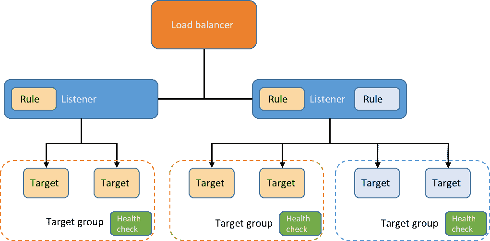
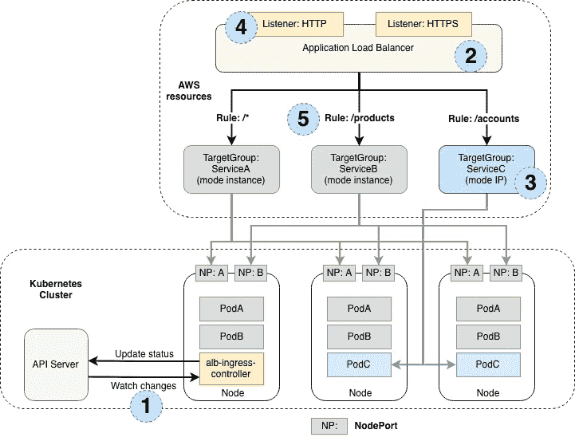

# Kubernetes 入口控制器:如何选择正确的控制器:第 1 部分

> 原文：<https://itnext.io/kubernetes-ingress-controllers-how-to-choose-the-right-one-part-1-41d3554978d2?source=collection_archive---------0----------------------->

在本文中，我将分享我使用 3 种主要 Kubernetes ingress 解决方案的经验。让我们来看看它们的优缺点，找出哪一个适合你的需求。

# **Nginx 入口控制器**

## 它在幕后是如何工作的？

首先，让我们部署一个 hello-world 服务，其中有 2 个 Pods 运行在 demo 名称空间中。接下来，我们应用 hello-world 入口资源文件，如下所示。

```
apiVersion: extensions/v1beta1
kind: Ingress
metadata:
  name: hello-world
spec:
  rules:
  - http:
      paths:
      - path: /api/hello-world
        backend:
          serviceName: hello-world
          servicePort: 80
```

我们来看看当一个 ingress 资源被部署时，Ingress 控制器是如何将其翻译成 Nginx 配置的？
对于 API 路径`/api/hello-world,`,通过下面的[上游](http://nginx.org/en/docs/http/ngx_http_upstream_module.html#upstream)指令，它会将传入流量路由到服务`hello-world`,该服务在名称空间`demo`中的容器端口 8080 上有 2 个目的地 Pod IPs。很简单，对吧？它与我们的 [iptables 或 ipvs 路由表](https://medium.com/@ericyuliu/kubernetes-network-deep-dive-7492341e0ab5)非常相似。

## **Nginx Ingress 依靠传统的负载均衡器(ELB)**

Nginx ingress 控制器可以部署在任何地方，在 AWS 中初始化时，会创建一个经典的 ELB，将 Nginx Ingress 控制器暴露在一个`Type=LoadBalancer`的服务后面。对于一些人来说，这可能是一个问题，因为 ELB 被认为是一项遗留技术，AWS 建议将现有的 ELB 迁移到网络负载平衡器(NLB)。但是，在正常的交通量下，这对于我们来说从来都不是问题。
如果 NLB 是您的集群中的首选，好消息是:从 1.10.0 版开始，它就作为 ALPHA 特性受到支持，如下所示。

```
annotations:    
  # by default the type is elb
  service.beta.kubernetes.io/aws-load-balancer-type: nlb
```

## **支持分布式入口变化**

在微服务环境中，应用程序一直在创建或停用。包含所有入口规则、主机和路径的集中式路由文件变得更难由所有微服务团队共享和维护。我们听说优步在 KubeCon 2018 的一个会议上有 4000 个微服务。想象一下，对于每一个环境，你都必须使用一个巨大的配置文件来管理数以千计的入口规则。对于需要协作的团队来说，这听起来像是一场噩梦。

不仅需要专用管道来保持它们在所有环境中的部署和同步。竞争条件可能是另一个潜在的问题。此外，我们(DevOps)不希望与这些单片路由配置斗争，成为开发团队频繁变更的瓶颈。每个微服务开发团队最好拥有自己的入口，并能够根据自己的喜好进行更改。因此，对于每个应用程序舵图，我们在 templates 文件夹下添加一个 ingress.yaml，这些路由规则可以与应用程序代码一起部署或推广到不同的环境，无需任何干预。

我们认为可能发生的一个潜在问题是，不同的应用程序入口规则可能在 API 名称空间上相互冲突。然而，在真实的开发周期中，人们总是检查所有现有 API 的 [swagger](https://swagger.io/tools/) ，进行代码审查和编写测试自动化。这种潜在的 API 冲突永远不会成为真正的问题。

## **不要使用没有定义范围的 Nginx 入口**

开始时，人们倾向于创建一个带有默认值的入口控制器，并开始尝试一些东西，例如部署仪表板或迁移一些应用程序。这很常见，我们也是这么做的。一开始，一切都很顺利，我们不断向我们的 Kubernetes 集群添加新的环境。直到突然，我们遇到了第一个路由问题。在这个 onboarding environments 过程中，Nginx 配置迅速增长到 20 万行，并开始出现配置重载问题。
我们仔细查看了 [Nginx 入口控制器舵图](https://github.com/helm/charts/tree/master/stable/nginx-ingress)，它有以下设置:

*   `controller.scope.enabled`:默认为 false，监视所有名称空间
*   `controller.scope.namespace`监视入口的名称空间，默认为空

这意味着，默认情况下，每个入口控制器将侦听来自所有名称空间的所有入口事件，并将相应的指令和规则添加到 Nginx 配置文件中。

让我们再看一下入口控制器的部署，如下所示。注意，当图表被部署时，这些设置被转换成一个名为`--watch-namespace.`的容器参数，这可能会派上用场，并在调试过程中为您节省一些时间。(一致的命名约定很难。)

```
kgd demo-nginx-ingress-controller -o yaml
# Less Typing?  [Cuz I pimp my k8s shell!](/pimp-my-kubernetes-shell-f144710232a0)...
containers:
      - args:
        - /nginx-ingress-controller
        - --election-id=ingress-controller-leader
        - --ingress-class=nginx
        - --configmap=demo/demo-nginx-ingress-controller
        - --watch-namespace=demo
```

## **多个环境不共享 Nginx 入口**

在 30 多个环境中滥用共享入口控制器后，Nginx 配置文件变得非常庞大，重新加载非常缓慢。POD IPs 变得陈旧，我们开始看到 5xx 个错误。继续扩大相同的入口控制器部署似乎无法解决问题。
从那时起，我们开始为每个环境使用专用的入口控制器。此外，该解决方案还有额外的优势:

*   对每个 Nginx 入口服务的粒度访问控制，定制的 AWS 安全组可以应用于每个入口 ELB。
*   为特殊环境调整配置，例如混沌测试和性能测试。这些设置管理起来更灵活，也更便于我们尝试。

## **调整工作进程和内存设置**

Nginx 有一个默认设置`**worker_processes** **auto**`，这意味着
工作进程号与主机 VM 上的 CPU 内核数量相同。
注意到我提到了主机虚拟机而不是容器资源吗？这是因为 Nginx 不支持 CPU-cgroup，入口控制器将忽略以下两个约束:

*   `**spec.containers[].resources.limits.cpu**`
*   `**spec.containers[].resources.requests.cpu**`

当我们将集群虚拟机节点从 M4 . XL large(4 个 vCPU 核心)升级到 C5.4xlarge(16 个 vCPU 核心)时，在持续的入口更改过程中，我们的入口控制器 pod 突然开始出现故障。登录 pod 并检查`/etc/nginx/nginx.conf`后，我们发现每个入口控制器 pod 有 16 个工作进程，而不是 4 个。当频繁的入口变化发生时，nginx 会不断地重新加载所有 16 个工作进程的配置，很快它就会消耗掉我们为 pod 分配的所有内存，并使它们 OOM-killed。
然而，有几个解决这个问题的方法:

*   为 pod 中的 Nginx 容器分配更多内存。
*   使用 Pod Affinity 将入口控制器部署到 CPU 内核较少的虚拟机。
*   通过[舵图配置](https://github.com/helm/charts/blob/master/stable/nginx-ingress/values.yaml#L13)调整 worker_process 号

对于第一个解决方案，在我们的负载测试中，当部署在具有 16 个 CPU 核心的 C5.4xlarge 上时，Nginx 容器启动了 16 个工作进程。凭借 1G 内存(从 500M 增加)，它可以无故障地处理负载。

# **AWS ALB 入口控制器**

AWS 应用负载平衡器(ALB)是一种流行且成熟的服务，用于对应用层(L7)上的流量进行负载平衡。支持基于路径和基于主机的路由规则。自从 AWS 服务推出以来，我们一直在利用它。在 Kubernetes Ingress 控制器的早期评估阶段， [AWS ALB Ingress 控制器](https://github.com/kubernetes-sigs/aws-alb-ingress-controller)是我的首选。然而，在那个时候，这个开源项目还没有捐赠给 Kubernetes SIG-AWS，也没有得到 AWS 的官方支持。我们的需求缺少一些关键功能。最近，我们决定再试一次，发现一些功能非常有前途。

## **使用原生支持 L7 路由**的 AWS ALB

AWS ALB 本地支持应用层路由，每个*目标组*代表一个 Kubernetes 服务，并以 IP 模式将传入的请求路由到该服务的 pod 所在的工作节点(我将在后面详细解释)。
这将所有运营维护以及可扩展性和可用性问题转移给了 AWS，因为它是一项完全托管的服务。此外，没有必要钻研 Nginx，成为专家来解决所有问题。



除了 ALB 的原生 L7 路由之外，AWS 还不断为该服务添加新功能，有几个功能对我们非常有益:

*   [AWS Web 应用防火墙(WAF)](https://aws.amazon.com/waf/) 集成支持(WAF 太棒了，少了一个需要维护的主要基础设施，耶！)
*   本机将不安全的 HTTP 请求重定向到 HTTPS 请求(我知道，对吗？)
*   支持不转发到应用程序的固定响应(不是花哨的 404 页面，但很接近！)
*   [ALB 上的认证](https://aws.amazon.com/blogs/aws/built-in-authentication-in-alb/) : OIDC、脸书、Google Auth、AWS Cognito

当您开始在您的环境中保护和生产 Kubernetes Ingress 控制器时，这些功能会非常方便。

## **要求在一个地方定义所有入口资源**

在[当前版本](https://github.com/kubernetes-sigs/aws-alb-ingress-controller)中，当 ALB 入口控制器从 yaml 文件中接收到新的入口资源时，它不会通过添加新的入口规则来更新现有的 ALB。相反，它会完全覆盖并只应用最新文件中的规则。

如果所有入口规则都是静态的，并在一个中心文件中预定义，这可能根本不是问题。然而，在某些情况下，正如在*章节中提到的，Nginx ingress 支持分布式的 ingress 变更，*我们在不同的时间有来自不同团队的 ingress 变更。我们更喜欢自助和自动化的解决方案。

幸运的是，社区听到了我们的请求，并积极致力于这个[创建选项，以重用现有的 ALB](https://github.com/kubernetes-sigs/aws-alb-ingress-controller/issues/298) 功能。我非常兴奋，迫不及待地想尝试一下。

## **带 AWS CNI 插件的 IP 模式下的 ALB 入口**

AWS ALB 入口控制器支持两种流量模式:实例模式和 IP 模式。

> 实例模式:入口流量从 ALB 开始，到达为您的服务打开的[节点端口](https://kubernetes.io/docs/concepts/services-networking/service/#nodeport)。然后，流量被路由到集群内的集装箱箱。在这种模式下，数据包到达目的地的跳数总是 2。
> 
> ip 模式:入口流量从 ALB 开始，直接到达集群内的容器箱。为了使用这种模式，Kubernetes 集群的网络插件必须使用 ENI 上的辅助 IP 地址作为 pod IP，也就是用于 Kubernetes 的 [AWS CNI 插件](https://github.com/aws/amazon-vpc-cni-k8s)。**在此模式下，数据包到达目的地的跳数始终为 1。**



每当创建入口资源时，入口控制器将:

*   如果 ALB 和侦听器(80/443)尚不存在，则创建它们
*   在 ALB 上为每个 K8S 服务创建一个目标组。
*   更新每个目标组上的路径和主机入口配置
*   仅将运行后端 pod 的虚拟机(而不是所有虚拟机)添加到目标组。

是的，每个目标组只在运行 pods 的极少数节点上进行负载平衡，而不是在集群中的所有工作节点上设置负载平衡器。与 ALB 入口控制器(实例模式)或 Nginx 入口控制器相比，这是非常独特的。

请注意，这也大大减少了负载平衡器将流量路由到不相关的虚拟机，然后依靠本地 Kube 代理和网络代理(即 calico-node)来找到 pod 真正运行的目标虚拟机的机会。

此外，我们还要考虑一个网络复杂性。当使用流行的 K8S 网络插件(如 Calico 或法兰绒)时，覆盖网络在同一子网内是可选的，但对于跨子网流量是必需的。这是静态内部数据中心的预期情况。然而，当部署在诸如 AWS 之类的云中时，增加了一个额外的 EC2-VPC 结构层。我们的网络堆栈将变得更加复杂。

因此，为了获得简单高效的网络堆栈，这种 AWS ALB 入口控制器(IP 模式)解决方案看起来非常有前途，原因如下:

*   第一次，**一个负载均衡器可以被** **pod 位置感知**。
*   数据包到达目的地的跳数是**总是一个**。
*   **与直接在云中使用网络插件(Calico，法兰绒)相比，没有额外的覆盖网络(AWS，GCP，Azure)**

目前，AWS CNI 插件的最新版本是 1.3.0，你可以从[这里](https://github.com/aws/amazon-vpc-cni-k8s/releases)获得并试用它。

这是我的“Kubernetes 入口控制器:如何选择正确的一个”的第 1 部分。在下一节课中，我将分享我在第三类产品**基于 Envoy 的入口控制器方面的经验。**我们将深入探讨这一流行选项，并讨论其利弊。

# 参考

*   [https://AWS . Amazon . com/blogs/open source/kubernetes-ingress-AWS-ALB-ingress-controller/](https://aws.amazon.com/blogs/opensource/kubernetes-ingress-aws-alb-ingress-controller/)
*   [https://medium . com/@ ericyuliu/kubernetes-network-deep-dive-7492341 E0 ab 5](https://medium.com/@ericyuliu/kubernetes-network-deep-dive-7492341e0ab5)
*   [https://github . com/AWS/Amazon-VPC-CNI-k8s/blob/master/docs/CNI-proposal . MD](https://github.com/aws/amazon-vpc-cni-k8s/blob/master/docs/cni-proposal.md)
*   [https://github . com/kubernetes-sigs/AWS-ALB-ingress-controller](https://github.com/kubernetes-sigs/aws-alb-ingress-controller)
*   [https://danielfm.me/posts/painless-nginx-ingress.html](https://danielfm.me/posts/painless-nginx-ingress.html)
*   [https://github . com/helm/charts/tree/master/stable/nginx-ingress](https://github.com/helm/charts/tree/master/stable/nginx-ingress)