# Kubernetes 入口和示例

> 原文：<https://itnext.io/kubernetes-ingress-examples-f71ac22e9cfe?source=collection_archive---------1----------------------->

## 在 Azure Kubernetes 服务上设置 NGINX

在本文中，我们将探索 Kubernetes (K8S)中的 Ingress 对象，并通过一些示例来了解如何使用它。然后，我们将一步一步地通过 Azure Kubernetes 服务(AKS)设置 NGINX 入口控制器。

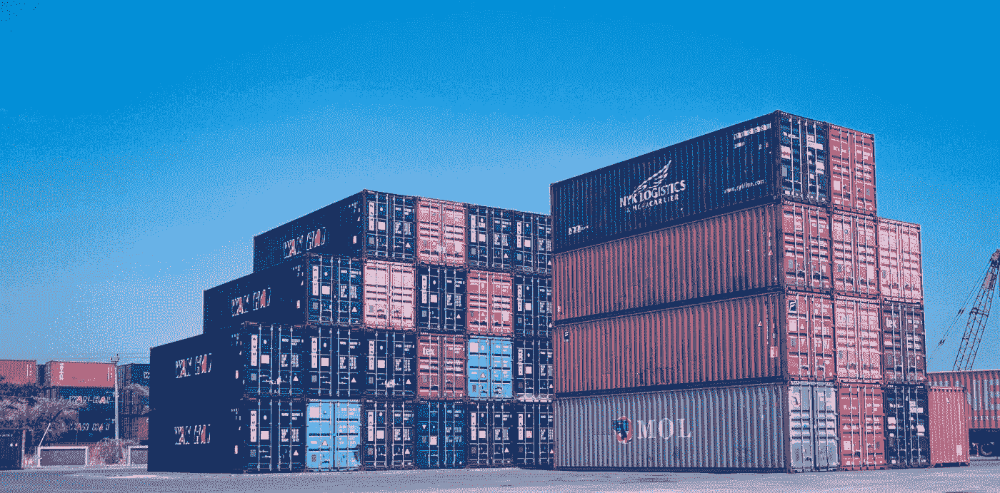

在 [Unsplash](https://unsplash.com/s/photos/containers?utm_source=unsplash&utm_medium=referral&utm_content=creditCopyText) 上由 [Tri Eptaroka Mardiana](https://unsplash.com/@inidianaa?utm_source=unsplash&utm_medium=referral&utm_content=creditCopyText) 拍摄的照片

## Kubernetes 中的 Ingress 是什么？

K8S 中的 Ingress 是一个允许从集群外部访问集群中的服务的对象。

kubernetes.io 上的官方文档描述了 Ingress:

> 管理对群集中服务的外部访问的 API 对象，通常是 HTTP。Ingress 可以提供负载平衡、SSL 终止和基于名称的虚拟主机。

流量路由由入口资源上指定的规则定义。

入口对象是指允许 HTTP 或 HTTPS 流量通过您的集群服务。它们不会向外界公开其他端口或协议。为此，应该使用负载平衡器或节点端口的服务类型。

服务是一组逻辑单元的外部接口。服务使用群集本地的“虚拟 IP 地址”,如果没有入口，外部服务将无法访问这些 IP 地址。

## 入口、负载平衡器和节点端口

入口、负载平衡器和节点端口都是公开 K8S 集群中的服务以供外部使用的方式。

NodePort 和 LoadBalancer 允许您通过在服务类型中指定值来公开服务。

通过一个**节点端口**，K8S 在每个节点上为指定的服务分配一个特定的端口。集群在端口上收到的任何请求都会被转发给服务。

使用**负载平衡器**，需要在 K8S 集群之外有一个外部服务来提供公共 IP 地址。在 Azure 中，这将是 Azure Kubernetes 服务(AKS)集群前面的 Azure 应用程序网关。在 AWS 中，这将是你的弹性 Kubernetes 服务(EKS)前面的应用负载平衡器(ALB ),而在 Google cloud 中，这将是你的 Google Kubernetes 引擎(GKE)集群前面的网络负载平衡器。每次公开新服务时，都需要创建一个新的负载均衡器来获取公共 IP 地址。方便的是，由于云提供商对 Kubernetes 的插件方式，负载平衡器的供应会自动发生，因此不必单独完成。

入口是一个完全独立于服务的资源。除了能够将路由规则整合到一个地方(入口对象)之外，它还具有作为一个独立的、分离的实体的优势，可以独立于任何服务来创建和销毁。

## 入口控制器

要在 K8S 中设置 Ingress，需要配置一个 Ingress 控制器。这些不是群集的默认设置，必须安装。入口控制器通常是集群中的反向 web 代理服务器实现。

有许多可用的入口控制器，它们都有不同的特性。官方文档列出了可用的入口控制器。一些常用的方法包括:

*   [AKS 应用网关入口控制器](https://docs.microsoft.com/azure/application-gateway/tutorial-ingress-controller-add-on-existing?toc=https%3A%2F%2Fdocs.microsoft.com%2Fen-us%2Fazure%2Faks%2Ftoc.json&bc=https%3A%2F%2Fdocs.microsoft.com%2Fen-us%2Fazure%2Fbread%2Ftoc.json)是配置 [Azure 应用网关](https://docs.microsoft.com/azure/application-gateway/overview)的入口控制器。
*   [用于谷歌云的 GKE 入口控制器](https://github.com/kubernetes/ingress-gce)
*   [AWS 应用负载平衡器入口控制器](https://docs.aws.amazon.com/eks/latest/userguide/alb-ingress.html)
*   [HAProxy 入口](https://haproxy-ingress.github.io/)是 [HAProxy](https://www.haproxy.org/#desc) 的入口控制器。
*   [Istio 入口](https://istio.io/latest/docs/tasks/traffic-management/ingress/kubernetes-ingress/)是基于 [Istio](https://istio.io/) 的入口控制器。
*   用于 Kubernetes 的 [NGINX 入口控制器与](https://www.nginx.com/products/nginx-ingress-controller/)[NGINX](https://www.nginx.com/resources/glossary/nginx/)web 服务器(作为代理)一起工作。
*   [Traefik Kubernetes 入口提供者](https://doc.traefik.io/traefik/providers/kubernetes-ingress/)是 [Traefik](https://traefik.io/traefik/) 代理的入口控制器。

[](https://kubernetes.io/docs/concepts/services-networking/ingress-controllers/) [## 入口控制器

### 为了让入口资源工作，群集必须运行入口控制器。不同于其他类型的…

kubernetes.io](https://kubernetes.io/docs/concepts/services-networking/ingress-controllers/) 

如果您愿意，您可以将一个集群中的多个入口控制器映射到多个负载平衡器！

Learnk8s 有一个奇妙的功能[比较所有可用的入口控制器](https://docs.google.com/spreadsheets/d/191WWNpjJ2za6-nbG4ZoUMXMpUK8KlCIosvQB0f-oq3k/edit#gid=907731238)来帮助您做出选择。请注意 Azure 应用程序网关入口控制器的局限性。目前，NGINX 入口控制器似乎是一个更好的选择…

## 使用 NGINX 设置入口

NGINX 是一个广泛使用的入口控制器，我们将通过 Azure Kubernetes 服务运行如何设置它。我们将建立两个简单的 web 服务，并使用 NGINX 入口相应地路由流量。

1.  启动 AKS 集群并连接到它。为此，浏览 Azure 门户中的 AKS 集群资源并单击 connect，将显示使用 Azure CLI 通过您的 shell 进行连接所需的命令。
2.  安装 NGINX 入口控制器。它将在`ingress-nginx`名称空间中安装控制器，如果该名称空间不存在，则创建该名称空间。

```
kubectl apply -f https://raw.githubusercontent.com/kubernetes/ingress-nginx/controller-v1.3.0/deploy/static/provider/cloud/deploy.yaml
```

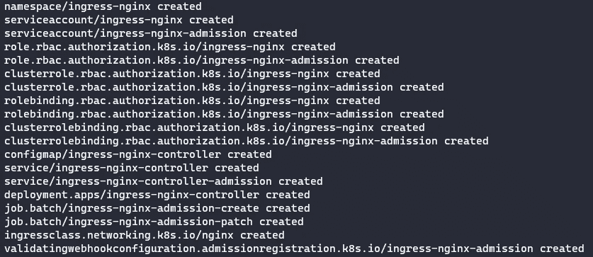

注意:如果您已经安装了 Helm，也可以使用它来安装(如果您已经使用前面的命令安装了 Helm，则不需要运行它):

```
helm upgrade --install ingress-nginx ingress-nginx --repo https://kubernetes.github.io/ingress-nginx --namespace ingress-nginx --create-namespace
```

3.检查入口控制器盒是否正在运行:

```
kubectl get pods --namespace ingress-nginx
```

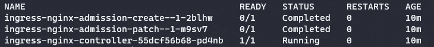

4.检查 NGINX 入口控制器是否分配了公共 Ip 地址:

```
kubectl get service ingress-nginx-controller --namespace=ingress-nginx
```

注意服务类型是负载平衡器:

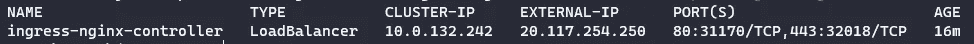

浏览这个 IP 地址会显示 NGINX 404 页面，这是因为我们还没有为我们的服务设置任何路由规则。

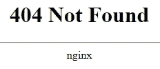

5.我们将设置一个基本的 web 应用程序来测试我们的新入口控制器。首先，我们需要设置一个 DNS 记录，指向我们在上一步中发现的外部 IP 地址。设置完成后，运行以下命令来设置演示(用您的记录替换[DNS_NAME]，例如 www.jackwesleyroper.io)。请注意，您必须设置 DNS 记录，此步骤不适用于 IP 地址。这个命令来自 NGINX 文档，我们将在本文后面讨论声明性方法。

```
kubectl create ingress demo --class=nginx --rule [DNS_NAME]/=demo:80
```

6.浏览到网址。你会看到“成功了！”显示，确认入口控制器正确地将流量路由到演示应用。

7.现在，我们将设置另外两个 web 应用程序，并使用 NGINX 在它们之间路由流量。

我们将使用官方 Azure 文档中的演示应用程序创建 2 个 YAML 文件。

*aks-helloworld-one.yaml*

```
apiVersion: apps/v1
kind: Deployment
metadata:
  name: aks-helloworld-one  
spec:
  replicas: 1
  selector:
    matchLabels:
      app: aks-helloworld-one
  template:
    metadata:
      labels:
        app: aks-helloworld-one
    spec:
      containers:
      - name: aks-helloworld-one
        image: mcr.microsoft.com/azuredocs/aks-helloworld:v1
        ports:
        - containerPort: 80
        env:
        - name: TITLE
          value: "Welcome to Azure Kubernetes Service (AKS)"
---
apiVersion: v1
kind: Service
metadata:
  name: aks-helloworld-one  
spec:
  type: ClusterIP
  ports:
  - port: 80
  selector:
    app: aks-helloworld-one
```

*aks-helloworld-two.yaml*

```
apiVersion: apps/v1
kind: Deployment
metadata:
  name: aks-helloworld-two  
spec:
  replicas: 1
  selector:
    matchLabels:
      app: aks-helloworld-two
  template:
    metadata:
      labels:
        app: aks-helloworld-two
    spec:
      containers:
      - name: aks-helloworld-two
        image: mcr.microsoft.com/azuredocs/aks-helloworld:v1
        ports:
        - containerPort: 80
        env:
        - name: TITLE
          value: "AKS Ingress Demo"
---
apiVersion: v1
kind: Service
metadata:
  name: aks-helloworld-two  
spec:
  type: ClusterIP
  ports:
  - port: 80
  selector:
    app: aks-helloworld-two
```

应用 2 个配置文件来设置应用程序:

```
kubectl apply -f aks-helloworld-one.yaml --namespace ingress-nginx
kubectl apply -f aks-helloworld-two.yaml --namespace ingress-nginx
```

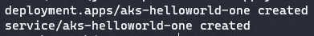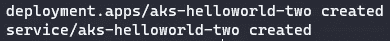

检查新的 pod 是否正在运行(您应该看到 2 个“aks-hello world”pod 正在运行) :

```
kubectl get pods --namespace ingress-nginx
```

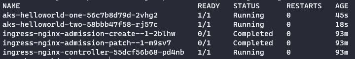

8.设置入口以在两个应用程序之间路由流量。

我们将设置基于路径的路由，根据用户输入的 URL 将流量导向适当的 web 应用。*EXTERNAL _ IP/hello-world-one*被路由到名为`aks-helloworld-one`的服务。到*EXTERNAL _ IP/hello-world-two*的流量被路由到`aks-helloworld-two`服务。在用户没有指定路径的情况下(*外部 IP/)，流量被路由到`aks-helloworld-one.`*

创建一个名为*hello-world-ingress . YAML*的文件

```
apiVersion: networking.k8s.io/v1
kind: Ingress
metadata:
  name: hello-world-ingress
  annotations:
    nginx.ingress.kubernetes.io/ssl-redirect: "false"
    nginx.ingress.kubernetes.io/use-regex: "true"
    nginx.ingress.kubernetes.io/rewrite-target: /$2
spec:
  ingressClassName: nginx
  rules:
  - http:
      paths:
      - path: /hello-world-one(/|$)(.*)
        pathType: Prefix
        backend:
          service:
            name: aks-helloworld-one
            port:
              number: 80
      - path: /hello-world-two(/|$)(.*)
        pathType: Prefix
        backend:
          service:
            name: aks-helloworld-two
            port:
              number: 80
      - path: /(.*)
        pathType: Prefix
        backend:
          service:
            name: aks-helloworld-one
            port:
              number: 80
```

创建入口

```
kubectl apply -f hello-world-ingress.yaml --namespace ingress-nginx
```

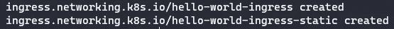

9.浏览到*外部 IP/hello-world-one:*

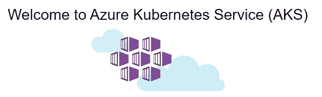

和*外部 _IP/hello-world-two:*

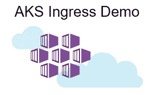

## 摘要

K8S 中的入口是将 K8S 集群中的服务暴露给外界的一种健壮的方式。它允许您将路由规则整合到一个位置。有许多可用的入口控制器可供使用，在本文中，我们在 AKS 上配置了一个 NGINX 入口，并使用它在 2 个演示应用程序之间路由流量。

有关 Kubernetes Ingress 的更多信息，请查看以下链接:

[](https://kubernetes.io/docs/concepts/services-networking/ingress/) [## 进入

### 特性状态:Kubernetes v1.19 [stable]一个 API 对象，管理对集群中服务的外部访问…

kubernetes.io](https://kubernetes.io/docs/concepts/services-networking/ingress/) [](https://kubernetes.github.io/ingress-nginx/deploy/) [## 安装指南— NGINX 入口控制器

### 安装 NGINX ingress 控制器有多种方式:用 Helm，用项目库图；与……

kubernetes.github.io](https://kubernetes.github.io/ingress-nginx/deploy/) [](https://docs.microsoft.com/en-us/azure/aks/ingress-basic?tabs=azure-cli#create-an-ingress-controller) [## 在 Azure Kubernetes 服务(AKS)中创建入口控制器— Azure Kubernetes 服务

### 入口控制器是一个软件，它提供反向代理、可配置的流量路由和 TLS…

docs.microsoft.com](https://docs.microsoft.com/en-us/azure/aks/ingress-basic?tabs=azure-cli#create-an-ingress-controller) 

想要更多 Kubernetes 内容？查看我在 K8S 上的其他文章！

[](https://jackwesleyroper.medium.com/kubernetes-k8s-related-articles-index-54718769e390) [## Kubernetes (K8S)相关文章索引

### 这是我在博客上发表的所有 Kubernetes 相关文章的列表！我会随时更新这个页面…

jackwesleyroper.medium.com](https://jackwesleyroper.medium.com/kubernetes-k8s-related-articles-index-54718769e390) 

干杯！🍻

[](https://www.buymeacoffee.com/jackwesleyroper) [## Jack Roper 正在 Azure、Azure DevOps、Terraform、Kubernetes 和 Cloud tech 上写博客！

### 希望我的博客能帮到你，你会喜欢它的内容！我真的很喜欢写技术内容和分享…

www.buymeacoffee.com](https://www.buymeacoffee.com/jackwesleyroper) 

*最初发表于*[*space lift . io*](https://spacelift.io/)*。*