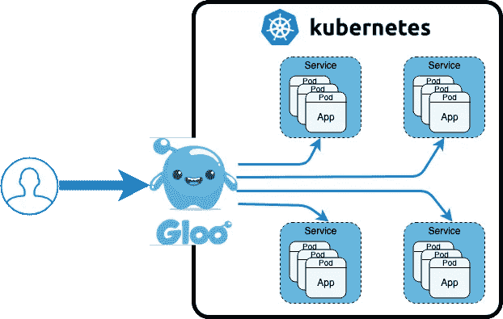
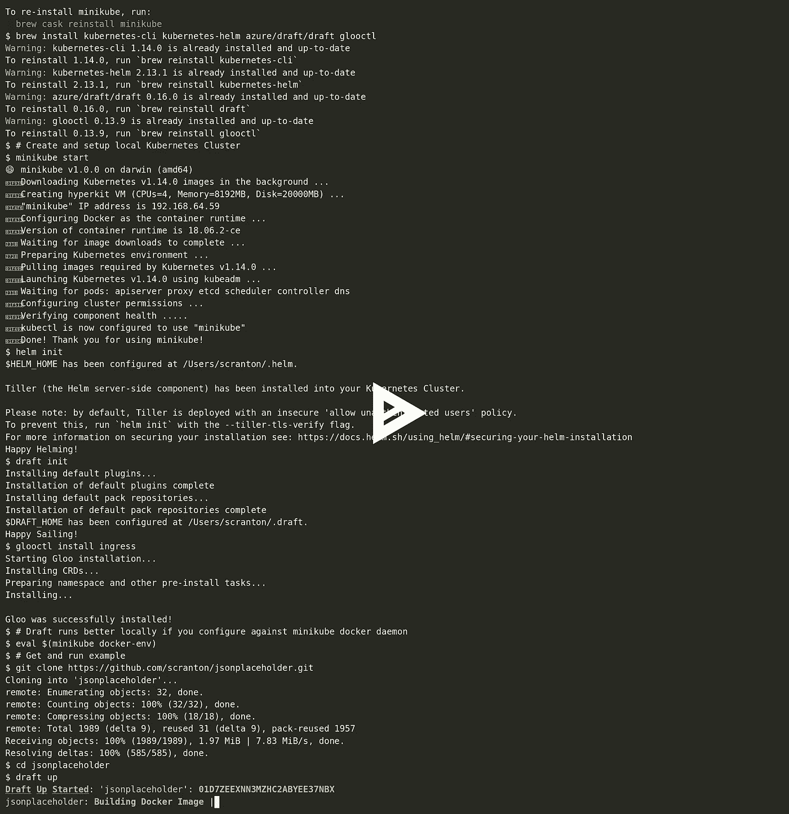

# 库伯内特入口过去、现在和未来

> 原文：<https://itnext.io/kubernetes-ingress-past-present-and-future-f614f11ea924?source=collection_archive---------3----------------------->

这篇文章的灵感来自于听 2019 年 2 月 19 日， [Kubernetes 播客](https://kubernetespodcast.com/)，[“入口，蒂姆·霍金。”](https://kubernetespodcast.com/episode/041-ingress/)Kubernetes 播客被证明是一个非常好的播客，非常值得一听。在 Ingress 一集中，播客们采访了 Tim Hockin，他是 Kubernetes 的原始联合创始人之一，是 Kubernetes 前身 Borg/Omega 的团队领导，在 Kubernetes 社区中仍然非常活跃，例如主持目前拥有 Ingress 资源规范的 [Kubernetes 网络特别兴趣小组](https://github.com/kubernetes/community/tree/master/sig-network)。Tim 在播客中讲述了 Kubernetes Ingress 的历史、Ingress 的当前发展以及未来发展。这次谈话启发我思考入口控制器(实现入口清单的实现)和入口概念(允许 Kubernetes 集群之外的客户端访问 Kubernetes 集群中运行的服务)。

# 那么什么是 Kubernetes 入口？

根据 [Kubernetes Ingress](https://kubernetes.io/docs/concepts/services-networking/ingress/#what-is-ingress) 文档的解释，Ingress 是一个 L7 网络服务，它公开了从 Kubernetes 集群外部到内部的 HTTP(S)路由。Kubernetes 集群可以运行一个或多个[入口控制器](https://kubernetes.io/docs/concepts/services-networking/ingress-controllers/)，每个控制器管理服务可达性、负载平衡、TLS/SSL 终止以及该控制器相关路由的其他服务。

每个入口清单包括指示哪个入口控制器应该管理该入口资源的注释。例如，要让 [Solo.io](https://solo.io/) [Gloo](https://gloo.solo.io/) 管理一个特定的入口资源，可以指定如下内容。注意包含的注释`kubernetes.io/ingress.class: gloo`。

# 入口挑战

自 Kubernetes 1.1 以来，Ingress 一直是一个测试版扩展，它被证明是一个最小公分母的 API。例如，NGNIX 社区入口控制器在生产中被许多人使用，但是 NGNIX 入口控制器需要使用许多 [NGNIX 特定入口注释](https://kubernetes.github.io/ingress-nginx/user-guide/nginx-configuration/annotations/)用于除了最简单的用例之外的所有情况。当前的 Kubernetes 入口资源规范有许多限制，例如所有引用的服务和秘密必须与入口在同一个名称空间中，即没有跨名称空间引用。关于如何确切地解释`path`属性已经有了很长时间的争论；它是像文档中暗示的正则表达式，还是像 NGNIX 实现的一些控制器那样的路径前缀。这些挑战使得在实践中很难有一个跨实现可移植的入口清单。目前的入口清单还被证明难以与[客户资源(CRD)](https://kubernetes.io/docs/concepts/extend-kubernetes/api-extension/custom-resources/) 进行往返同步，这很不幸，因为 CRD 被证明是扩展 Kubernetes 的一种有益方式。

# Ingress 的下一步是什么？

在播客中，Tim Hockin 表示，鉴于有多少人在生产中使用当前的 beta Ingress 规范，有一种推动将现有的 Ingress 规范转移到 GA 状态，然后开始制定下一代规范，要么是 Ingress v2，要么是跨多个 CRD 分解 Ingress。Tim 提到了 Kubernetes 社区如何看待几个基于 [Envoy](https://www.envoyproxy.io/) 的 Ingress 实现，以获得下一代 Ingress 的灵感。例如， [Heptio Contour](https://github.com/heptio/contour) 创建了一个非常有趣的、实现中性的 CRD，称为[入口路线](https://github.com/heptio/contour/blob/master/docs/ingressroute.md)。入口路由旨在解决入口的治理挑战，例如，如果一家公司想要公开一条`/eng`路由路径，那么当前的入口模型会面临许多挑战，因为您可能会有与路由`/eng`相冲突的入口清单。入口路由提供了一种创建治理和委托的方式，例如集群管理员可以定义一个虚拟主机`/eng`并将实施明确委托给`eng`命名空间，这样可以防止其他人覆盖该路由路径。

Istio 社区也基于 Envoy，如 Heptio Contour，他们也定义了入口 CRD。

在不太遥远的将来，看看 Ingress 是如何发展的将会非常有趣。

相关阅读: [API 网关正在经历一场身份危机](https://medium.com/solo-io/api-gateways-are-going-through-an-identity-crisis-d1d833a313d7)。

# 演示时间

我发现看到一些有助于使概念更加真实的工作代码是很有帮助的，所以让我们来看几个 Ingress 和 beyond 的例子。

对于这个例子，我将使用从[https://jsonplaceholder.typicode.com/](https://jsonplaceholder.typicode.com/)创建的 Kubernetes 服务，它提供了一组快速的 REST APIs，这些 API 提供了不同的 JSON 输出，可以帮助测试。它基于 node . js[JSON-server](https://github.com/typicode/json-server)——非常酷，值得独立看。我派生出最初的 GitHub [jsonplaceholder 存储库](https://github.com/typicode/jsonplaceholder)，在项目上运行`[draft create](https://draft.sh/)`，并对生成的 [Helm](https://helm.sh/) 图表做了一些调整。Draft 是一种将现有代码引导到 Kubernetes 的超级快速简单的方法。我使用 [minikube](https://kubernetes.io/docs/setup/minikube/) 在本地运行这个例子。

jsonplaceholder 服务附带了六个公共资源，每个资源返回几个 JSON 对象。对于这个例子，我们将在`/users/1`获得第一个用户资源。

*   `/posts` 100 个帖子
*   `/comments` 500 条评论
*   `/albums` 100 张专辑
*   `/photos` 5000 张照片
*   `/todos` 200 托多
*   `/users` 10 个用户

下面是您自己尝试这个例子的脚本，还有一个[asci NEMA](https://asciinema.org/)回放，这样您可以看到它在我的机器上运行的样子。我们将解开回放后发生的事情。

# 发生了什么事？

我们安装了本地工具(您可以查看各自的网站了解完整的安装细节)。

*   [minikube](https://kubernetes.io/docs/setup/minikube/)
*   [库贝克特尔](https://kubernetes.io/docs/tasks/tools/install-kubectl/)
*   [舵](https://helm.sh/)
*   [草稿](https://draft.sh/)
*   [glooctl](https://gloo.solo.io/)

然后，我们启动了一个本地 Kubernetes 集群(minikube ),并初始化了 Helm 和 Draft。我们还在本地集群中安装了 [Gloo ingress](https://gloo.solo.io/user_guides/basic_ingress/) 。

然后我们`git clone`我们的例子，并使用`draft up`来构建和部署它到我们的集群。让我们花一分钟来看看这一步发生了什么。我最初分叉了`jsonplaceholder` GitHub 库，并对其代码运行了`draft create`。Draft 自动检测源代码语言，在本例中是 Node.js，并创建一个`Dockerfile`,将我们的示例应用程序构建到一个图像容器中，并创建一个默认的 Helm chart。然后我对舵图做了一些小的调整，以使它能够进入。让我们看看入境旅客名单。主要的变化是增加了`ingress.class: gloo`注释来为 Gloo 的入口控制器标记这个入口。并且主机设置为`gloo.example.com`，这也是我们 curl 语句设置`curl --header "Host: gloo.example.com"`的原因。

图表/模板/ingress.yaml

更多使用 Gloo 作为基本入口控制器的例子，你可以查看使用 Gloo 的 Kubernetes 入口控制。

您可能还注意到了 curl 命令中对`$(glooctl proxy url --name ingress-proxy)`的调用。当您在 minikube 这样的本地环境中运行并且需要获得 Gloo 代理服务器的主机 IP 和端口时，这是必需的。当 Gloo 部署到 Google 或 AWS 等云提供商时，这些环境将关联一个静态 IP 并允许使用端口 80(或 HTTPS 的端口 443)，该静态 IP 将注册到 DNS 服务器，即当 Gloo 部署到云管理的 Kubernetes 时，您可以做`curl [http://gloo.example.com/users/1](http://gloo.example.com/users/1.)` [。](http://gloo.example.com/users/1.)

# 入口示例挑战

假设我们想将现有的`/users/1`重新映射到`/people/1`，因为用户也是人。由于我们可以为`/people`设置第二个规则，这对于入口清单来说变得很棘手，但是我们需要在发送到我们的服务之前重写到`/users`的路径，因为它不知道如何处理对`/people`的请求。如果您使用的是 NGNIX ingress，您可以添加另一个注释`nginx.ingress.kubernetes.io/rewrite-target: /`，但是现在我们添加了特定于实现的注释，也就是说，nginx 注释不会被其他 ingress 控制器识别。注释是一个平面的名称空间，所以添加大量的注释会变得非常混乱，这也是为什么[定制资源(CRD)](https://kubernetes.io/docs/concepts/extend-kubernetes/api-extension/custom-resources/) 被创建的部分原因。让我们看看原始路线，以及我们的路径重写路线，在基于 CRD 的 Ingress: Gloo 中会是什么样子。

# Solo.io Gloo 虚拟服务

Gloo 使用了一个叫做[虚拟服务](https://gloo.solo.io/introduction/concepts#virtual-services)的概念，这个概念来源于 Istio 和 Envoy 中的类似概念，在概念上相当于一个入口资源。最简单的方法是向您展示我们到目前为止在 Gloo 虚拟服务中创建的示例入口的等价物。

您会注意到，它看起来与我们之前创建的入口非常相似，只是做了一些细微的更改。路径说明符是`prefix: /`，这通常是人们想要的，也就是说，如果请求消息路径的开头与路由路径说明符匹配，那么就应用路由操作。如果我们想精确匹配之前的入口，我们可以使用`regex: /.*`来代替。虚拟服务允许您通过前缀、精确和正则表达式来指定路径。您还可以看到，虚拟服务有一个`routeAction`委托给一个`single` `upstream`，而不是有`serviceName`和`servicePort`的`backend:`。Gloo 上游是自动发现的，可以引用 Kubernetes 服务和 REST/gRPC 函数、像 AWS Lambda 和 Google 函数这样的云函数以及 Kubernetes 服务的其他外部函数。

有关 Solo.io Gloo 的更多详细信息，请访问:

*   [带 Solo.io Gloo 功能网关的路由](https://medium.com/solo-io/routing-with-gloo-function-gateway-301765bb103e)
*   [solo . io Gloo 的 5 分钟——虚拟服务的剖析](https://medium.com/solo-io/5-minutes-with-gloo-the-anatomy-of-a-virtualservice-4deb4cfc558e)

让我们回到我们的例子，更新我们的虚拟服务来做我们想要的路径重写，即`/people` = > `/users.`

我们添加了第二个路由匹配器，就像在入口中添加第二个路由路径并指定`prefix: /people`。这将匹配所有以`/people`开始的请求，所有其他对`gloo.example.com`域的调用将由另一个路由匹配器处理。我们还添加了一个`routePlugins`部分，它将重写到`/users`的请求路径，这样我们的服务现在将正确地处理我们的请求。[路由插件](https://gloo.solo.io/user_guides/advanced_route_plugins/)允许你对上游服务的请求和从上游服务返回的响应执行许多操作。最好用一个例子来展示，所以对于我们新的`/people`路由，让我们也转换响应，添加一个新的头`x-test-phone`和来自响应体的值，让我们转换响应体以返回几个字段:名称、地址/街道和地址/城市。

让我们看看那是什么样子。我的示例 GitHub 存储库已经包含了我们刚刚检查过的完整的 Gloo 虚拟服务。我们需要为`gateway`配置 Gloo，这意味着除了入口资源之外，还要添加另一个代理来处理虚拟服务。我们将使用`draft up`来确保我们的示例被完全部署，包括完整的虚拟服务，然后我们将调用`/users/1`和`/people/1`来查看差异。

好吧，如果你使用过其他 L7 网络产品或做过其他集成工作，这并不令人惊讶，但相对于标准的入口对象来说仍然很酷。Gloo 使用 Inja 模板来处理 JSON 响应体。更多细节请见 [Gloo 文档](https://gloo.solo.io/user_guides/advanced_route_plugins#transformation_template)。

# 摘要

在本文中，我们谈到了现有 Kubernetes 入口资源的一些历史和困难。尽管基于注释的扩展面临许多挑战，但是入口资源仍然在 Kubernetes 部署中发挥着作用。Kubernetes Custom Resources (CRDs)的创建就是为了解决其中的一些扩展挑战，它可以提供一种更简洁的方式来扩展 Kubernetes，正如您在 Gloo 入口和网关示例中看到的那样。正如 Istio 和 Contour 社区中的其他人一样，我非常相信基于 Envoy 的解决方案的潜力，看到 Kubernetes 社区在最终将现有资源规范转移到 GA 状态后如何决定发展 Ingress 将是令人兴奋的。

*原载于*[*scott.cranton.com*](https://scott.cranton.com/ingress_and_beyond.html)*。*