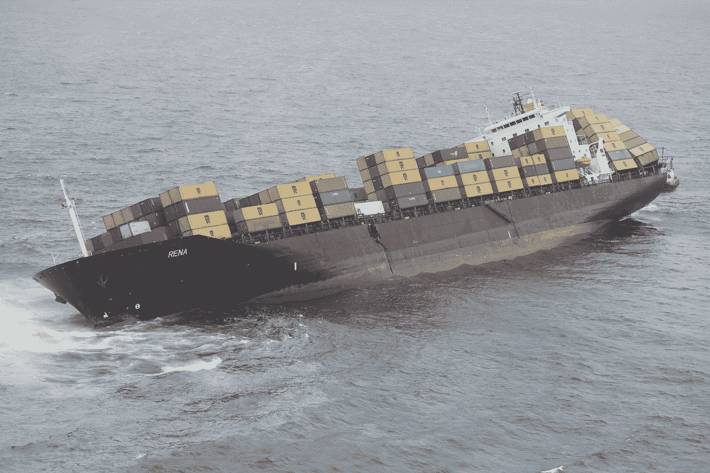

# Kubernetes 很难！

> 原文：<https://itnext.io/kubernetes-is-hard-190f1d0c6d36?source=collection_archive---------2----------------------->

但是，有 Kubernetes，就有办法！

# **Kubernetes——云之王——原生丛林**

谷歌的 [Kubernetes](https://kubernetes.io/) (K8s)，一个开源的容器编排系统，已经成为云原生应用程序以及它们的架构、组合、部署和管理方式的事实上的标准——和关键推动者。企业正在使用 Kubernetes 创建由微服务和无服务器功能组成的现代架构，这些架构可以无缝地进行大规模扩展。

Kubernetes 处于 [Gartner 炒作周期](https://www.gartner.com/en/research/methodologies/gartner-hype-cycle)的顶峰，每个人都想要它，但很少有人真正理解它。在未来几年，相当多的公司将不得不认识到 Kubernetes 不是银弹，并找出如何正确和有效地使用它。

# Kubernetes 太受欢迎了

Kubernetes 解决企业的实际问题。Kubernetes 提供了您需要的整个工具生态系统；网络、计算和内存分配、负载平衡、对象存储和调度等。

*   ***基础设施为数据:***

使用 YAML 文件，所需的资源可以毫不费力地在 Kubernetes 中表示出来。将所有东西都定义在 YAML 文件中，可以选择在版本控制下管理它们，比如 GIT。此外，从可伸缩性的角度来看也很容易，因为在 YAML 文件中，一切都可以很容易地更改和更新。

*   ***扩展性:***

有大量的现有资源，比如 statefulset、configmap、secrets、cron jobs 等等。用户可以根据需要添加更多类型。

*   ***创新:***

在过去的几年里，每年都有 3 到 4 个主要的版本，有很多新的特性和变化，而且看起来，速度不会慢下来。

*   ***社区:***

Kubernetes 以其强大的社区而闻名，并得到 CNCF 的支持。KubeCon 是世界上有史以来最大的开源活动，吸引了如此多的开源爱好者。从 2019 年开始的年度 [GitHub 调查](https://octoverse.github.com/#top-and-trending-projects)显示，Kubernetes 是贡献者评选的十大开源项目之一。根据 StackOverFlow 所做的年度调查，在过去的两年中，Kubernetes 与 Linux 和 Docker 一起成为开发人员喜爱的平台之一。

# 为什么选择 Kubernetes？

*   ***运行环境的需要，总是:***

开发人员和生产人员都需要高速创建日常工作环境。这是使用 Kubernetes 可以很容易达到的。

*   ***分公司与其他产品分公司的集成环境:***

例如， [Artifactory](https://jfrog.com/artifactory/) 开发人员想要建立一个环境，用其他应用程序的版本来测试他的分支。过去，他们必须设置虚拟机、安装和设置网络配置等。，这需要很多时间。这个东西，你用 Kubernetes 就能轻松搞定。

*   ***开发和生产的资源利用率更高:***

在 Kubernetes 中，一个应用程序可以从少量的 CPU 和内存开始，并根据消耗增加到特定的限制。这使得管理员可以轻松管理资源并节省大量成本。

*   ***生产集装箱化产品:***

开发环境必须尽可能类似于生产环境。在 Docker 上运行一个应用程序是很好的，但是我们需要的远不止这些，这也是像 Kubernetes 这样的完整解决方案平台所能提供的。

*   ***尽可能与供应商无关—相同的 API:***

由于我们必须能够在主要的云供应商上部署我们的所有产品，我们最好有一个 API，Kubernetes 通过一个 API 在供应商之上提供了一个抽象。

*   ***自动缩放和自动修复的应用:***

Kubernetes 的最大特点之一就是能够根据具体情况进行相应的扩展和修复。

## **Kubernetes 黑暗的秘密**

在生产中运行容器不是一件轻松有趣的事情。它需要大量的努力和计算；它要求你解决容错、弹性伸缩、滚动部署、服务发现等问题。这就是为什么需要库伯内特这样的管弦乐手的原因。还有其他编排平台，但 Kubernetes 获得了巨大的吸引力和主要云提供商的支持。

Kubernetes、集装箱化和微服务趋势带来了新的安全挑战。事实上，Kubernetes pods 可以很容易地跨所有基础设施类别运行，默认情况下会导致 pods 之间更多的内部流量。这也意味着安全问题，Kubernetes 的攻击面通常更大。此外，Kubernetes 的高度动态和短暂的环境不能很好地与遗留安全工具融合。

Capital One 的云专家 Bernard Golden 说:“虽然基于 Kubernetes 的应用程序可能很容易运行，但 Kubernetes 本身并不容易操作。”

# **你猜怎么着:Kubernetes 在生产中很难！**

不同的公司可能面临不同的挑战，但这里有一个 JFrog 的经典例子。让我们看看 JFrog 是如何使用 Kubernetes 的。

此外， **Tsofia Tsuriel，**JFrog 的 DevOps 工程师，描述了 Kubernetes 在 JFrog 的旅程。

用她自己的话来说，“在过去的两年里，我们在三大公共云上的 Kubernetes 中部署和管理 JFrog SaaS 应用程序——AWS、GCP 和 Azure。在此期间，我们获得了许多有益和重要的教训。“有些——艰难的道路……在这个环节，我想和你们分享一些我们旅途中的故事和(有时是艰难的)教训。”

为了方便管理 Kubernetes 上的[应用程序部署，JFrog 使用了 Helm。Helm 是一个管理 Kubernetes 软件包的工具，叫做 charts。Helm charts 帮助定义、安装和升级 Kubernetes 应用程序。JFrog 在 Helm Hub 中发布和维护其所有产品的官方 Helm 图表，以供其客户、社区和 SAAS 解决方案使用。](https://jfrog.com/integration/kubernetes-docker-registry/)

## 那么，JFrog 是如何将 Kubernetes 用于他们的内部环境的呢？

出于开发目的，他们有一个在 Kubernetes 上安装 [JFrog](https://jfrog.com/) 产品的 CI/CD 流程。根据需要，开发人员可以启动此过程，并指定要安装的分支版本，而无需应用程序主版本或分支版本。部署过程使用 JFrog 官方导航图，结果是一个隔离的 Kubernetes 名称空间，上面安装了所有应用程序。

出于试运行和预生产的目的，他们有几个托管集群，每个云供应商至少有一个 pf，并且他们正在运行 JFrog 产品安装的完整 [CI/CD 流程](https://jfrog.com/pipelines/)以及 Kubernetes 基础架构和工具，以便在升级其生产环境之前运行测试并发现错误。

三年前，JFrog 研究了在 AWS、GCP 和 Azure 上自我管理 Kubernetes 集群的各种选择。他们发现，对他们来说，最简单、最直接的方法是使用云供应商 EKS、GKE 和 AKS 提供的托管 Kubernetes 解决方案。

他们明白，自己管理集群需要大量的资源和技能，而他们并不具备这些资源和技能，因此他们可以更好地专注于自己真正擅长的事情。在过去的十年里，他们的生产环境在 EKS、GKE 和不同地区的 AK 上运行，使用的是相同的 API。

如今，JFrog 的新客户部署是一个自助服务和完全自动化的过程，不需要 DevOps 工程师的干预。该环境在几分钟内即可在任何受支持的云区域上使用。

在生产中使用 Kubernetes——JFrog 只使用一两个命令，一切都在它的位置上运行。你有应用程序自动愈合和自动缩放，所以现在你可以自由地航行到日落更好的一杯红酒在你的手中。

但是 JFrog 也极力主张事实并非如此，它并不像你在理论上看到的那么平滑。在生产中使用 Kubernetes 时，使船只坚固并抵抗大风浪是一个重要且必须的过程。

# **JFrog 团队在使用 Kubernetes 后的经验教训**

## **1。能见度**

由于 Kubernetes 的复杂性，了解系统中发生了什么是很重要的。不要再对服务器使用 SSH，并“给我日志。”开发人员应该不需要 kubectl access 来调试他们的应用程序。

## **2。Dev = Staging = Production**

开发和生产环境、功能和性能问题之间的差异只在生产中出现。为了最大限度地减少环境之间的差异，最好创建类似生产的环境，以降低生产中断风险。确保在所有环境中使用相同的舵图也很重要。

## **3。了解你的极限**

您需要学习和了解您的应用程序在资源使用、内存、CPU、数据库等方面是如何工作的。，以及您的应用程序以最小的力高效执行和运行所需的任何东西。

## **4。Pod 优先级和 pod 服务质量**

Kubernetes 在调度和驱逐集群上的工作负载时使用了一些数据。当您未能正确设置这些参数时，可能会出现性能问题、工作负载停机以及重大的总体集群健康问题。[资源请求和限制](https://kubernetes.io/docs/concepts/configuration/manage-compute-resources-container/)是这些需要考虑的设置中最明显的。此外，必须彻底考虑 pod 的生命周期。

***要考虑的事情:***

*   您的应用程序是 CPU 密集型还是内存密集型？
*   您的应用程序在另一个节点上运行的难易程度如何？

**选项:**

1.  重要应用程序的 pod 优先级更高

2.服务质量

*   保证(请求=限制)
*   可突发(一些资源集)
*   最大努力(无资源集)

## **5。零停机升级**

我们应该致力于最大限度地减少因任何原因导致的服务停机时间。应用程序版本升级是我们应该能够随时运行的。让应用程序以高可用性模式运行，并配备几个负载平衡的单元，可以消除升级环境时停机的风险。使用 Kubernetes，您可以选择滚动更新，因此，在特定时间，只有一个 pod 进行升级，而其他 pod 仍在运行，它们将依次升级。

## **6。安全**

JFrog 相信吃他们自己的狗粮。他们在日常工作中使用一些自己的工具。他们认为管理他们的[码头工人图像](https://jfrog.com/knowledge-base/a-beginners-guide-to-understanding-and-building-docker-images/)和舵图表的最好方法是使用 Artifactory。他们使用内部 Artifactory 服务器作为 Docker repo 和 Helm repo。在部署过程中，部署所需的一切都是从 Artifactory 获取的，因此他们可以完全控制其开发和生产 Kubernetes 集群中运行的内容。除此之外，X 射线会运行并扫描该工厂中存储的所有第三方 Docker 图像。因此，只有经过扫描和批准的图像才能进入 Kubernetes 集群。

## **7。持续学习**

学习是一个很大的过程，而且是一个永无止境的过程。Kubernetes 作为技术对每个人来说几乎都是新的。开发人员和运营团队必须了解它的工作原理和使用方法，了解互联网上的最佳实践和建议。

您应该始终继续优化您的基础设施、应用程序及其行为。您需要检查应用程序在一段时间内的行为。

这是一份白皮书，讲述了 Kubernetes 将容器带到生产现场的最佳实践。这让您更深入地了解在生产中使用 Kubernetes 时应该考虑的实践。

## **结论**

有太多关于 Kubernetes 的炒作，但现在很明显，它是许多东西的未来。但在完全采用 Kubernetes 之前，这些公司也应该仔细考虑自己的情况。当然，Kubernetes 不是银弹，不要幻想使用 Kubernetes 就能解决你所有的问题。仔细分析你想要实现的目标后，如果有意义，就去实现它。仅仅因为它是炒作，看起来很酷，或者仅仅因为你的竞争对手在使用它而使用它，这些事情并没有达到目的，相反，它们可能会在许多方面适得其反。到目前为止，Kubernetes 肯定是丛林之王，但谁知道呢，明天其他一些云原生 DevOps 工具可能会出现并摧毁它。让我们快速部署，向云原生丛林之王“库伯内特”致敬