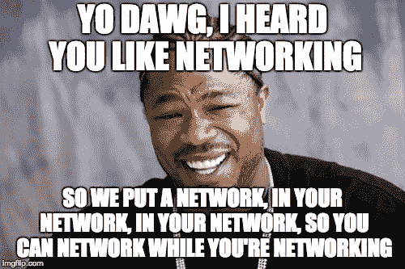
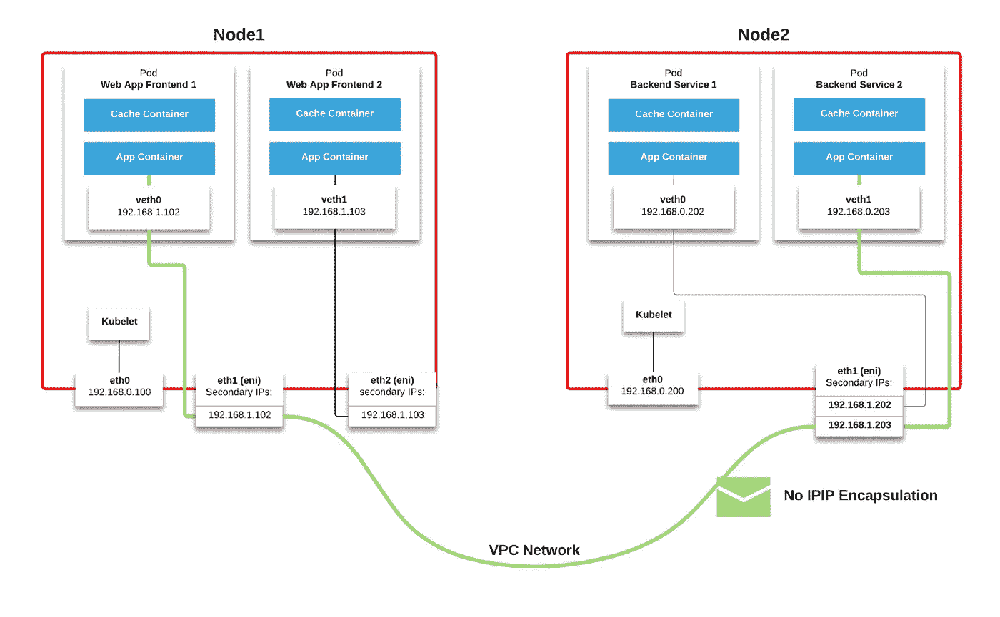
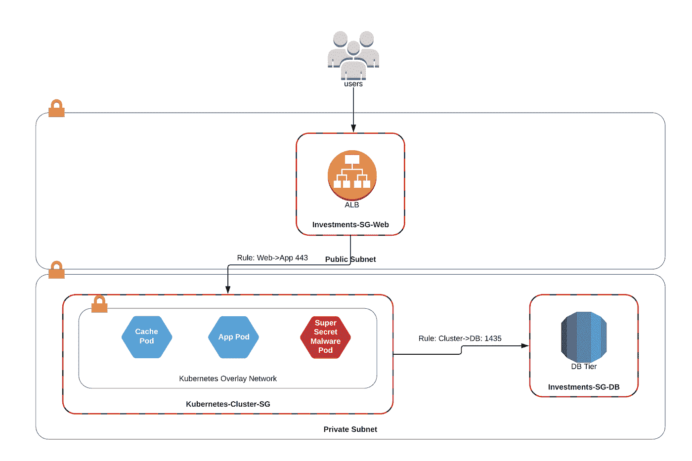
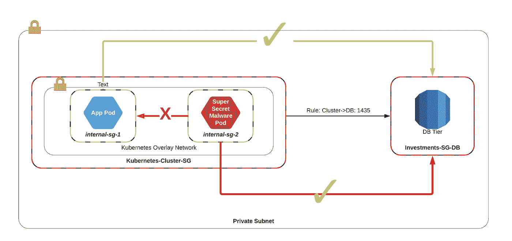
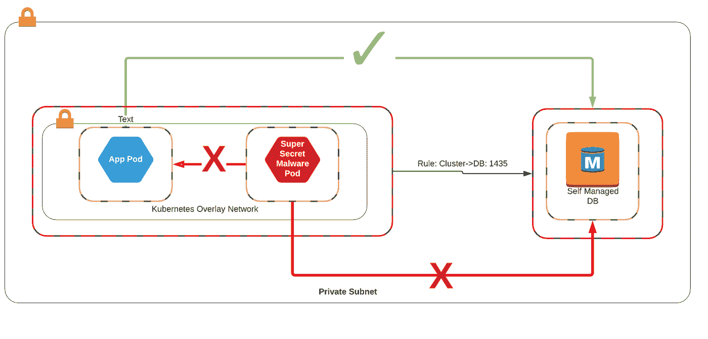
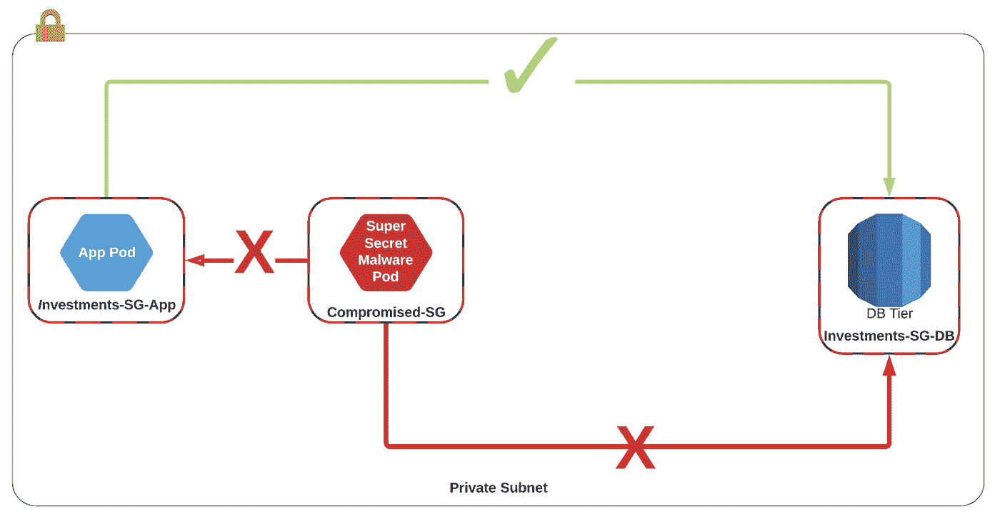

# Kubernetes 很难:为什么 EKS 让网络和安全架构师更容易

> 原文：<https://itnext.io/kubernetes-is-hard-why-eks-makes-it-easier-for-network-and-security-architects-ea6d8b2ca965?source=collection_archive---------0----------------------->

《打结的绳子》由[蒂姆·布特](https://unsplash.com/@toboote?utm_source=medium&utm_medium=referral)在 [Unsplash](https://unsplash.com?utm_source=medium&utm_medium=referral) 上演唱

如今运行 Kubernetes 集群非常困难…您首先需要决定将它部署到哪个云(或数据中心),然后仔细选择合适的网络、存储、用户和日志集成。

如果您的需求超出了正常范围，那么祝您好运，找到一个工具来为您解决这个问题！

如果你在 Google Cloud 上运行，你在 GKE 已经有了一个久经考验的、生产就绪的 Kubernetes 服务，但是根据 Cloud Native Computing Foundation， [63%的 Kubernetes 工作负载目前位于 AWS](https://www.cncf.io/announcement/2017/08/09/amazon-web-services-joins-cloud-native-computing-foundation-platinum-member/) 上。作为回应，AWS 已经宣布计划向 EKS 提供 Kubernetes 托管服务。如果你想了解更多关于 EKS 和法盖特的声明，请点击这里查看卡洛斯的博客文章[。](https://www.contino.io/insights/what-do-amazon-ecs-kubernetes-service-and-fargate-mean-for-you)

今天，我们将了解为什么 Kubernetes 网络堆栈过于复杂，AWS 的 VPC 容器网络接口(CNI)如何简化堆栈，以及它如何实现跨安全组的微分段。

## 当心:Kubernetes 网络堆栈！

构建 Kubernetes 集群最有争议的一点是网络堆栈。有大量的提供商可以使用，如果你以前从未部署过 K8s，这可能会令人望而生畏！

Kubernetes 使用一种不同于正常的“Docker 方式”的方式来处理网络。Docker 使用虚拟桥接网络从主机向底层容器进行端口转发。这意味着跨多个设备协调端口是一件很难大规模实现的事情，并且会使用户面临他们无法控制的集群级问题。

另一方面，Kubernetes 对其网络实施提出了以下要求:

*   所有的容器都应该有自己的 IP 地址，容器应该能够看到自己和其他人看到的是同一个 IP
*   所有容器无需 NAT 就可以相互通信
*   所有节点都可以在没有 NAT 的情况下与所有容器通信(反之亦然)

Kubernetes 提供了一个名为[容器网络接口(CNI)](https://kubernetes.io/docs/concepts/cluster-administration/networking/) 的插件规范，将平台与底层网络基础设施集成在一起。只要满足上述要求，供应商就可以根据需要自由实施网络堆栈，并且通常使用覆盖网络来支持**多子网**、**多 az** 集群。

## 什么是覆盖网络？

覆盖网络是一种网络类型，管理员通过它在物理基础架构之上创建多个原子和离散的虚拟化网络层。它利用封装技术(如 NVGRE 或 VXLan)将一个数据包封装在另一个数据包中，从而将网络服务与底层基础设施分离开来。

覆盖网络的一个常见例子是 AWS 虚拟私有云，它允许亚马逊在数百万台设备上运行数千个私有的原子网络，跨越多个站点和地区。

在 Kubernetes 的环境中，覆盖网络允许 Kubernetes 集群中的 pod 通过独立 IP 范围内的多个集群与底层 VPC 进行通信。

在下面的例子中，我们可以看到如何通过使用一种叫做[法兰绒](https://github.com/coreos/flannel)的流行 CNI 来实现覆盖网络。假设位于**节点 1** 的 Pod **Web App 前端 1** 想要与位于**节点 2 的 pod **后端服务 2** 进行对话。**

带法兰绒的 Kubernetes 中的典型叠加网络流

**Web App 前端 1** 用**创建一个 IP 包来源:10.1.15.2 - >目的地:10.1.20.3** 。该数据包将离开连接到该 pod 的虚拟适配器(veth0 ),并前往 **docker0** 桥。Docker0 随后将查阅其路由表，在那里它看到 **10.1.15.0/24** 之外的所有端点都位于*其他*主机上，并相应地将其转发给 **flannel0** 端点。

在 ETCD 的 Kubernetes KV 商店中, **flannel0** 桥与 flanneld 进程一起管理主机到网络区域的映射。在这种情况下，它知道 **10.1.20.3 位于主机 **192.168.0.200** 的**中，并将该数据包封装在*另一个*数据包中，该数据包带有**源:192.168.0.100 - >目的地 192.168.0.200。**

然后，数据包将通过 VPC 网络到达目的主机，并到达目的地 flanneld。从那里，它逆转上述过程，并前往目的地吊舱。

现在请记住，VPC 也是封装数据包的覆盖层。那就是三个网络层！

这太复杂了！

现在请记住，VPC 也是一个覆盖层，用于封装数据包。**那是 3 个网络层！**

## 在 AWS 中运行覆盖图很糟糕…

**VPC 流日志不起作用:**底层 VPC 没有运行于其上的封装覆盖网络的上下文。VPC 流量日志将仅显示 Kubernetes 集群中主机之间的流量，这使得对任何网络相关问题进行故障排除变得非常困难。

**安全组不起作用:**由于 VPC 没有覆盖网络的上下文，它无法将安全策略应用到单个 pod，而只能将它们应用到 Kubernetes 集群本身。这意味着您需要运行、管理和维护两套网络策略控制。

**我还有另一个可以打破的东西:**通过实现一个覆盖网络，我为我的应用程序堆栈创建了另一个容错域。我需要担心的故障域越多，我就越有可能在凌晨 3 点被影响集群中每个应用程序的问题吵醒。

**我不想再管理这些东西了:**我们转向云的原因是将责任从我身上转移到一家能够比我想象的更大、更好、更快、更高效地扩展这些服务的公司。通过创建另一个网络堆栈供我管理，我感觉自己又回到了本地网络的黑暗时代。

**不过不用担心！AWS 来救援了！**

AWS 没有利用现有的提供商，而是构建自己的… *并且结果相当不错。*

## AWS VPC CNI

AWS 同意覆盖网络并不是管理 AWS EKS 网络的最理想方式，而是建立了他们自己的 CNI 接口，并且[已经将其开源。](https://github.com/aws/amazon-vpc-cni-k8s)虽然仍然**在 Alpha** 中，我们可以看到该实现试图解决一些我们在覆盖网络中看到的非常令人沮丧的问题。

它希望实现以下目标:

*   Pod 网络连接性能必须类似于 AWS VPC 网络。即低延迟、最小抖动、高吞吐量和高可用性
*   用户必须能够表达和实施精细的网络策略和隔离，与本地 EC2 网络和安全组可实现的策略和隔离相媲美
*   网络操作必须简单安全。用户必须能够应用现有的 AWS VPC 网络和安全最佳实践，在 AWS VPC 上构建 Kubernetes 集群
*   VPC 流量测井必须工作
*   VPC 路由策略必须奏效
*   数秒内完成 Pod 网络设置
*   豆荚必须能够在几秒钟内连接到网络
*   集群应该能够扩展到大约 2000 个节点。

为了实现这一结果，AWS *滥用*其将多个弹性网络接口(ENIs 或 vNICs)连接到虚拟机的能力，并将多个辅助 IP 地址与每个 ENI 相关联。然后，每个 pod 能够选择一个空闲的辅助 IP 地址，将其分配给 pod，并允许它通过该接口进行入站/出站通信。

CNI 网络流量

如果我们使用与之前相同的图表，我们可以看到，要从 A->B 路由，我们不再需要担心 Kubernetes 封装数据包，因为所有通信都可以使用 VPC 中的 IP 地址进行。

网络架构师可以松一口气了:*这大大简化了堆栈！*

> Lyft 已经使用了与 AWS CNI 几乎相同的方法。你可以在这里找到更多信息[。](https://github.com/lyft/cni-ipvlan-vpc-k8s)

## 安全架构师和微分段

现在来看看这对我们的安全架构师意味着什么！

AWS VPC CNI 意味着我们可能很快就会看到使用 AWS 安全组的*本机微分段*！

微分段是将网络安全策略应用于虚拟机的能力，是通过应用应用上下文网络策略来降低数据中心中东/西入侵可能性的关键控制措施，而不是像过去的网络设计那样，简单地在 DMZ、应用和数据库区域的边缘安装防火墙。 [SDXCentral 有一篇很好的文章进一步解释了微分段。](https://www.sdxcentral.com/sdn/network-virtualization/definitions/how-does-micro-segmentation-help-security-explanation/)

如果你已经在 AWS、谷歌或 NSX 运行了一段时间，你会非常熟悉微分段的概念，即使你没有意识到这一点！

**下面是 AWS 中微分段的一个相当典型的例子。**

典型 AWS 微分段示例

在本例中，我们可以看到一个极其简单的投资应用程序，它分为三层:AWS ALB 前端的负载平衡层、EC2 上运行的应用程序层和数据库层 RDS。这些层中的每一层都有自己的安全组，该组明确允许各层之间的流量流动，并隐式拒绝所有其他流量。

在另一个工作负载受到损害的情况下，我们有一个适当的控制，使工作负载不可能东/西升级到同一子网中的其他服务。

但是当你把 Kubernetes 引入这个组合时会发生什么呢？

添加 Kubernetes 时的 AWS 安全组

在印花布/织物/法兰绒的旧世界，VPC 没有容器的上下文，只能对运行容器的主机应用安全组。实际上，这意味着任何 Pod 都可以路由到已经暴露给集群的任何服务。如果其中一个豆荚受到损害，它可能会升级到它可以访问的数据库。

**但我以为 Kubernetes 有纳米分割？**

有点…有很多工具可以用来解决集群中的网络分段问题。它们通常是通过混合使用操作系统包、容器端 cars 或 docker 守护进程集来实现的，但是这些*给你的部署栈*又增加了一层复杂性！

同样的，但现在有一个覆盖安全结构

在大多数情况下，这些分段工具没有集群外部的环境，这意味着它们可以阻止集群内的东/西攻击，但无法阻止到数据库等支持服务的出站连接。在某些情况下，他们可能有针对 pod 的黑名单/白名单功能，但是在两个位置维护这些规则是乏味且无效的。

**但是我听说过这个工具在集群内外都管用？**

有些工具允许您在群集内外应用策略，但它们是通过在群集外的虚拟机上安装代理来工作的。这意味着您不能将您的细分策略应用于 RDS 等服务，因为这些服务不允许您访问底层主机，而是必须运行您自己的… *这首先就违背了在云中存在的意义。*

安全组，但带有基于代理的防火墙

那么 EKS 呢？

AWS CNI 的目标之一是能够像其他 VPC 资源一样将安全组应用于 pod。在发布时，我们应该能够在集群内部*和集群外部*应用安全组进行微分段！

EKS 会让我们做什么

编辑:发布已经一个月了。正如我们所见，集群内部和外部的微分段目标没有实现。但愿他们能在 ENI 的未来版本中解决这个问题。

## 我什么时候不会使用 CNI 开发的 AWS？

AWS 中的虚拟机对任何时候可以连接到任何单个虚拟机的弹性网络接口的数量有最大限制。该数量因[实例类型](https://docs.aws.amazon.com/AWSEC2/latest/UserGuide/using-eni.html#AvailableIpPerENI)而异。这可以通过以下方式计算:

**每个 ENI 的 ENIs x 辅助 IP =每个节点的最大 pod 数**

如果您正在构建的应用程序需要极高密度的 pods 到节点，您最好使用其他 CNI 解决方案，如 Calico 或 Weave，或者 Hashicorp 的 Nomad，该解决方案已被证明可在 5k 主机上扩展到一百万个容器。

AWS CNI 的另一个问题是它对 IP 地址的低效使用。为了尽快将 IP 地址连接到 Pod，CNI 会将大量 IP 地址预加载到节点上。如果集群部署在一个特别小的 VPC 中，您可能会用完地址，即使它们没有被真正的工作负载使用。

## 最后的想法

为了让 EKS 在 AWS 中获得成功，它需要与应用程序生态系统的其余部分进行适当的集成。通过简化网络堆栈，Kubernetes 降低了令人望而生畏的准入门槛，使新受众更容易访问它，高级受众更安全，需要它的人性能更好。

就我而言，我真的很兴奋地看到这如何扩展到 EKS·法盖特，以及当容器成为像 EC2 这样的真正的计算原语时会发生什么！

> 为了更深入地了解法兰绒网络后台程序，请阅读韩笑的博客[点击这里](https://blog.laputa.io/kubernetes-flannel-networking-6a1cb1f8ec7c)。