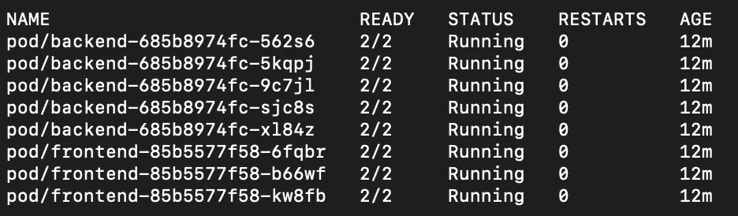
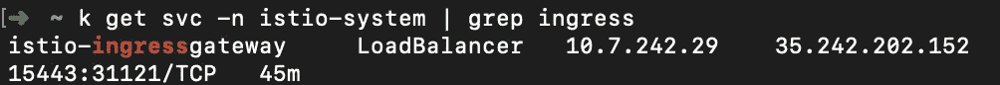
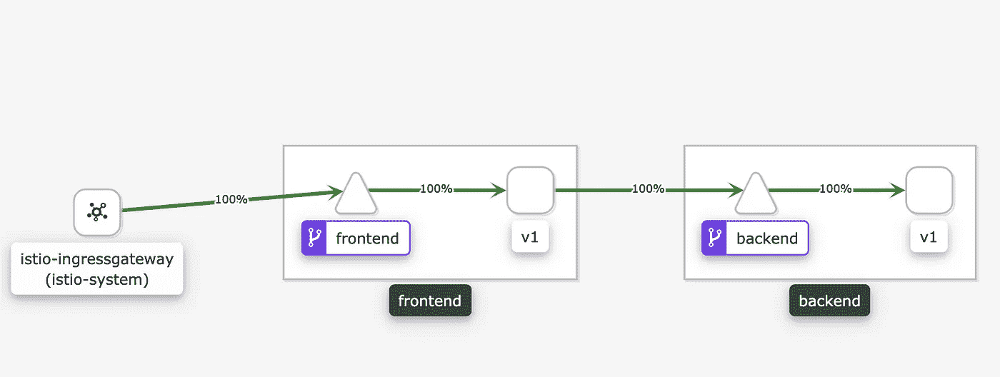
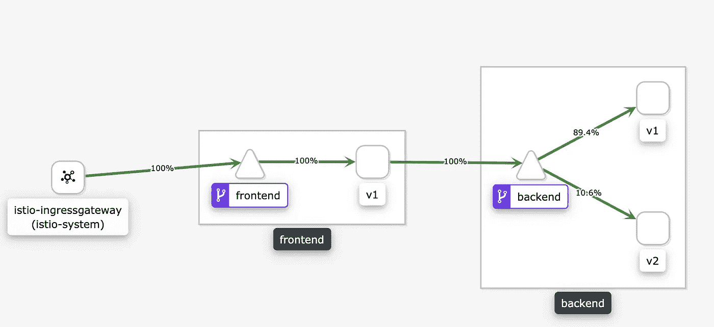
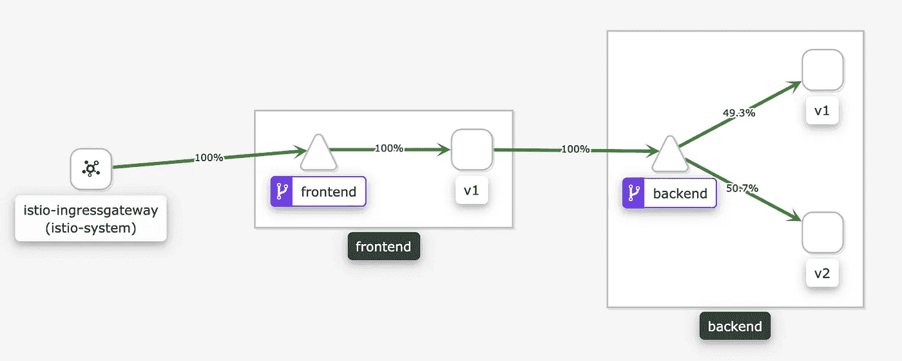
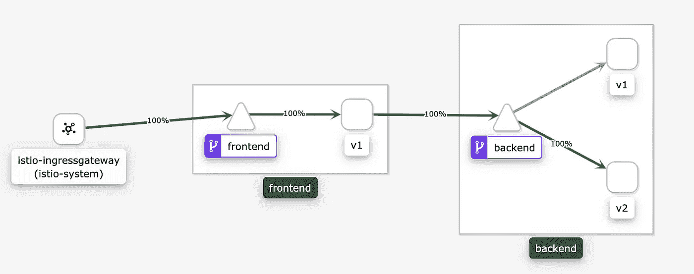
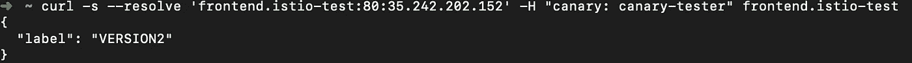
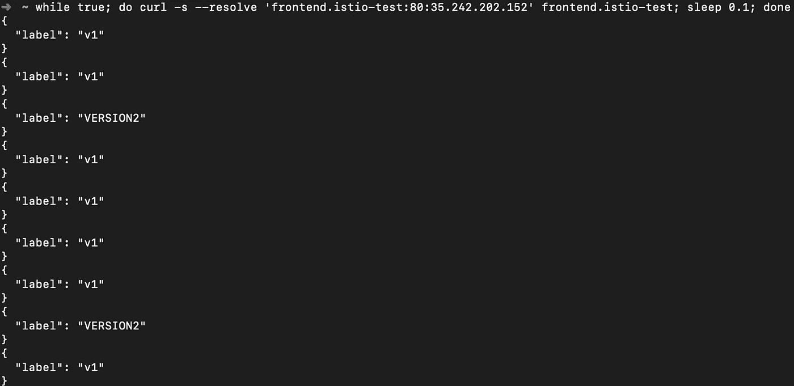
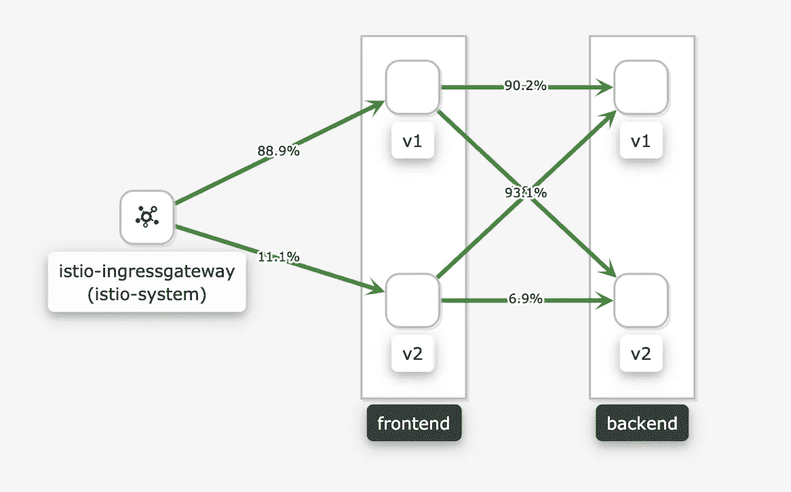

# Kubernetes Istio Canary 部署

> 原文：<https://itnext.io/kubernetes-istio-canary-deployment-5ecfd7920e1c?source=collection_archive---------1----------------------->

## 我们使用 Istio+Kiali 来执行和可视化金丝雀部署


[https://unsplash.com/photos/V41PulGL1z0](https://unsplash.com/photos/V41PulGL1z0)

## 部件

1.  [利用 git labci+git ops/人工进近展开金丝雀](https://medium.com/@wuestkamp/kubernetes-canary-deployment-1-gitlab-ci-518f9fdaa7ed?)
2.  [金丝雀部署和 Argo 部署](https://codeburst.io/kubernetes-canary-deployment-2-argo-rollouts-5e68e99b4fa3?source=friends_link&sk=58557d4fa81ff77382e59e1258c06d61)
3.  (本文)
4.  [使用 Jenkins-X Istio Flagger 部署金丝雀](https://medium.com/@wuestkamp/jenkins-x-istio-flagger-canary-deployment-9d5e187c2334?source=friends_link&sk=fa0cf82c7051958b0a98e205375cba86)

# 金丝雀部署

请务必阅读第 1 部分，在那里我们简要解释了什么是金丝雀部署。在那里，我们还展示了如何使用普通的 Kubernetes 资源来实现它们。

# 伊斯迪奥

本文假设您已经知道 Istio 是什么。如果你还不知道，你可以[看看这个](/kubernetes-istio-simply-visually-explained-58a7d158b83f?source=friends_link&sk=378ed718d2d6cfd09e6d23c7616cba81)。

# 简单的测试应用


每个 pod 都有两个容器，应用程序和 istio-proxy

我们使用一个简单的测试应用程序，包含前端 nginx 和后端 python pods。nginx pods 只是将每个请求重定向到后端 pod，并充当代理。有关详细信息，请查看 yamls:

*   [frontend.yaml](https://gitlab.com/wuestkamp/k8s-deployment-example-istio-canary-infrastructure/blob/master/i/k8s/frontend.yaml)
*   [backend.yaml](https://gitlab.com/wuestkamp/k8s-deployment-example-istio-canary-infrastructure/blob/master/i/k8s/backend.yaml)
*   [istio.yaml](https://gitlab.com/wuestkamp/k8s-deployment-example-istio-canary-infrastructure/blob/master/i/k8s/istio.yaml)

## 自己部署测试应用程序

如果你想继续下去，自己尝试一下示例应用程序，请查看项目的自述文件。

# 初始部署

我们看到我们的应用程序盒都有 2 个容器，这表明 Istio 边车被注入:



我们还在`istio-system`名称空间中看到了 Istio 网关负载平衡器:



## 创造流量

我们使用该 IP 来激发一些流量，这些流量将到达前端设备，进而重定向到后端设备:

```
while true; do curl -s --resolve 'frontend.istio-test:80:35.242.202.152' frontend.istio-test; sleep 0.1; done
```

我们还可以将`frontend.istio-test`添加到我们的 hosts 文件中。

## 使用 Kiali 查看网格

我们安装了测试应用程序和 Istio 以及 Tracing、Grafana、Prometheus 和 Kiali(更多信息见[项目的自述文件](https://gitlab.com/wuestkamp/k8s-deployment-example-istio-canary-infrastructure/blob/master/README.md))。因此，我们可以将 Kiali 用于:

```
istioctl dashboard kiali # admin:admin
```



Kiali 将网格中的实际流量可视化

我们看到 100%的流量到达前端服务，然后是标签为 v1 的前端服务包。这些是简单的 nginx 代理，将请求转发给后端服务，后者指向标签为 v1 的后端 pod。

Kiali 与 Istio 配合得非常好，并提供了开箱即用的网格可视化。太美了。

# 金丝雀部署

我们的后端已经有两个 k8s 部署，一个用于 v1，一个用于 v2。现在我们只需要告诉 Istio 将一定比例的请求重定向到 v2。

## 第一步:10%

我们所要做的就是在 [istio.yaml](https://gitlab.com/wuestkamp/k8s-deployment-example-istio-canary-infrastructure/blob/master/i/k8s/istio.yaml) 中调整虚拟服务权重:

```
apiVersion: networking.istio.io/v1alpha3
kind: VirtualService
metadata:
  name: backend
  namespace: default
spec:
  gateways: []
  hosts:
  - "backend.default.svc.cluster.local"
  http:
  - match:
    - {}
    route:
    - destination:
        host: backend.default.svc.cluster.local
        subset: v1
        port:
          number: 80
 **weight: 90**    - destination:
        host: backend.default.svc.cluster.local
        subset: v2
        port:
          number: 80
 **weight: 10**
```



我们看到 10%的请求被重定向到 v2。

## 第二步:50%

将这一比例提高到 50%非常简单:

```
apiVersion: networking.istio.io/v1alpha3
kind: VirtualService
metadata:
  name: backend
  namespace: default
spec:
...
    - destination:
        host: backend.default.svc.cluster.local
        subset: v1
        port:
          number: 80
 **weight: 50**    - destination:
        host: backend.default.svc.cluster.local
        subset: v2
        port:
          number: 80
 **weight: 50**
```



## 第三步:100%

现在可以认为 Canary 部署已经完成，所有流量都被重定向到 v2:



# 手动金丝雀测试

假设我们目前将后端 v2 暴露给 10%的请求。如果我们也想自己手动测试 v2，以确认一切正常，该怎么办？

我们可以基于 HTTP 头添加特定的匹配规则:

```
apiVersion: networking.istio.io/v1alpha3
kind: VirtualService
metadata:
  name: backend
  namespace: default
spec:
  gateways: []
  hosts:
  - "backend.default.svc.cluster.local"
  http:
 **- match:
    - headers:
        canary:
          exact: "canary-tester"
    route:
    - destination:
        host: backend.default.svc.cluster.local
        subset: v2
        port:
          number: 80
      weight: 100**
  - match:
    - {}
    route:
    - destination:
        host: backend.default.svc.cluster.local
        subset: v1
        port:
          number: 80
      weight: 90
    - destination:
        host: backend.default.svc.cluster.local
        subset: v2
        port:
          number: 80
      weight: 10
```

使用 curl，我们现在可以通过发送头来强制请求 v2:



没有标题的请求仍将以 1/10 的比率处理:



# 两个相关服务版本的金丝雀

现在我们来看一下前端和后端版本 v2。对于这两者，我们指定 10%的流量应该流向 v2:



没有服务节点的 Kiali 图

我们看到前端 v1 和 v2 都以 1/10 的比率将流量重定向到后端 v1 和 v2。

如果我们只希望 frontend-v2 连接到 backend-v2，因为它与 v1 不兼容，该怎么办？为了实现这一点，我们将只为前端指定 1/10 的金丝雀比率，然后使用`sourceLabels`匹配器控制哪些流量到达后端 v2:

```
apiVersion: networking.istio.io/v1alpha3
kind: VirtualService
metadata:
  name: backend
  namespace: default
spec:
  gateways: []
  hosts:
  - "backend.default.svc.cluster.local"
  http:
...
  - match:
 **- sourceLabels:
        app: frontend
        version: v2**
    route:
    - destination:
        host: backend.default.svc.cluster.local
 **subset: v2**        port:
          number: 80
      weight: 100
```

这导致了我们想要的结果:


没有服务节点的 Kiali 图

# 与手动金丝雀的区别

在第 1 部分中，我们手动执行了一个 Canary 部署，也使用了两个 k8 部署。在这里，我们通过控制副本数量来调整请求比率。它可以工作，但是有很大的缺点。

使用 Istio，可以独立于副本数量来定义请求比率。这意味着，例如，我们可以使用现有的 HPA(水平吊舱自动缩放器),而不必根据当前的金丝雀状态来调整它们。

# 概述

Istio 运行良好，与 Kiali 的组合非常强大。我感兴趣的下一个列表是 Spinnaker 与 Istio 的结合，用于自动化和金丝雀分析。

# 成为 Kubernetes 认证

[](https://killer.sh)

[https://killer.sh](https://killer.sh)