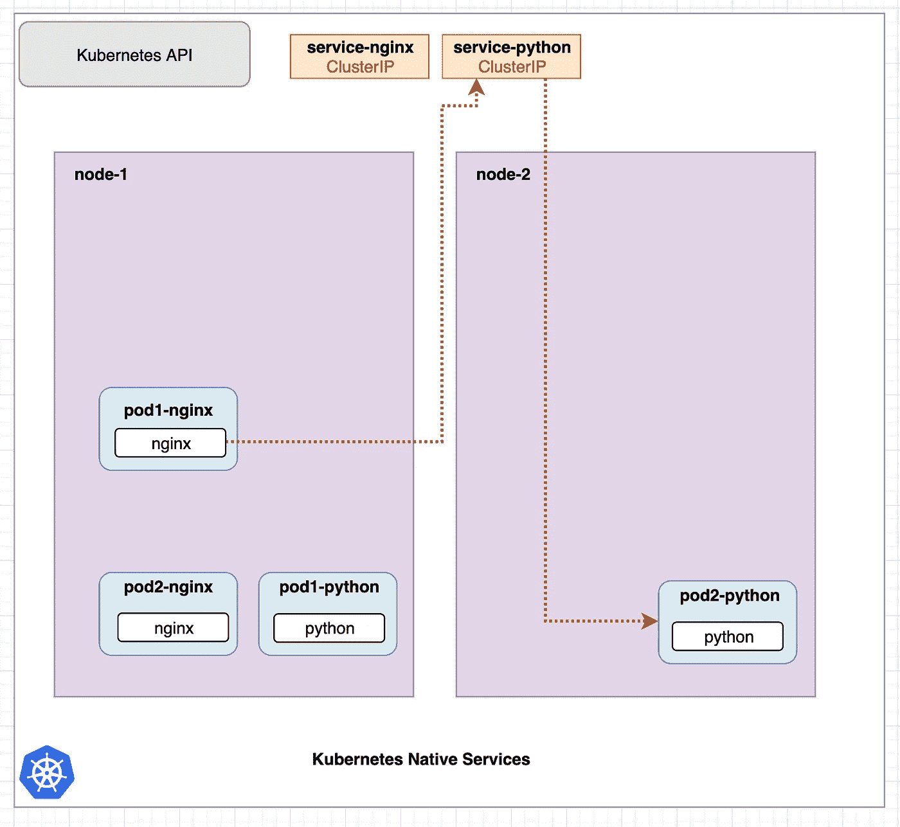
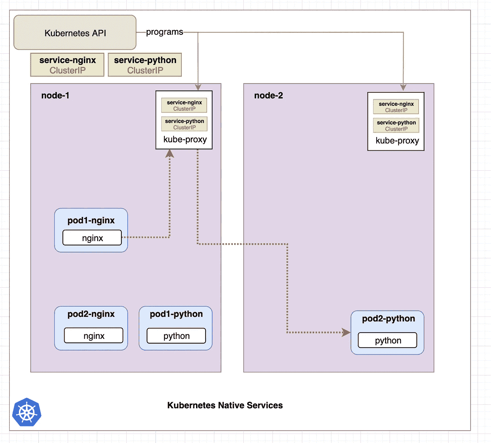
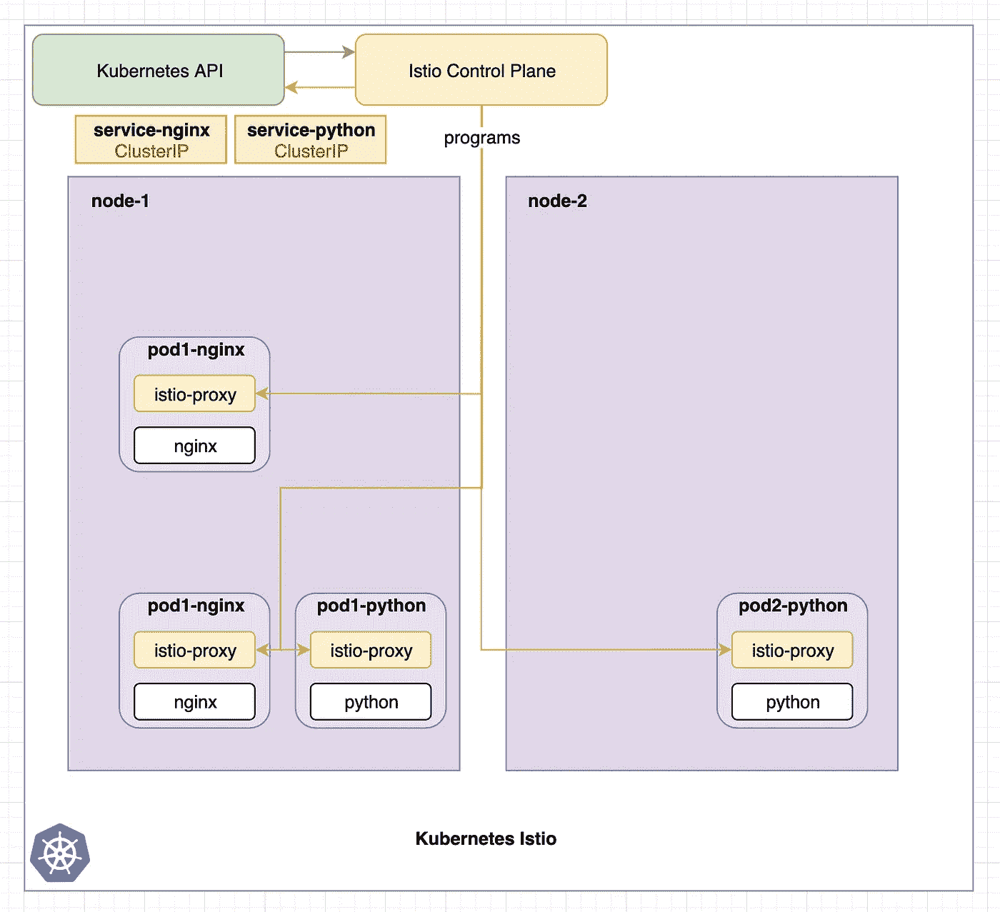
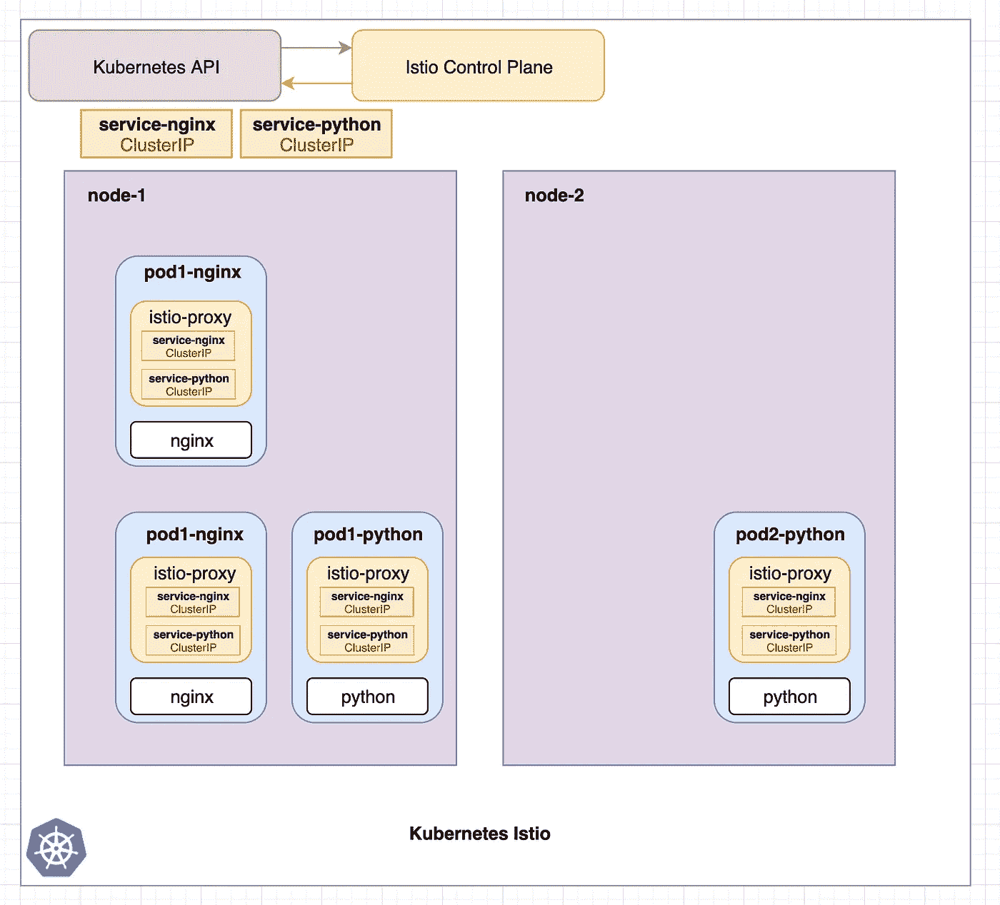
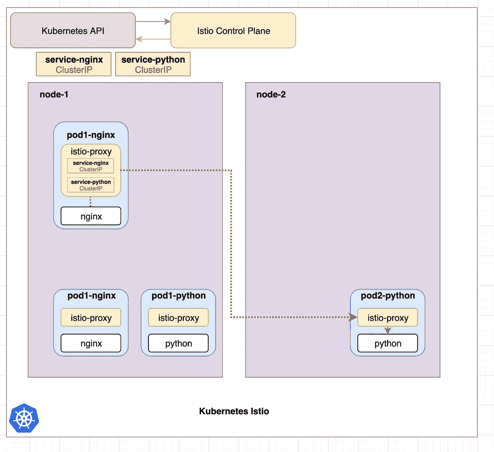
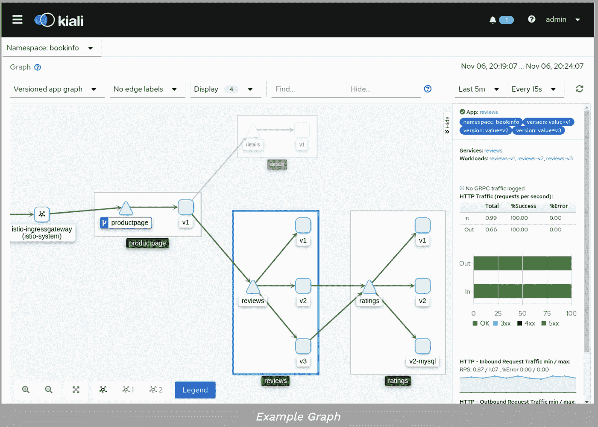
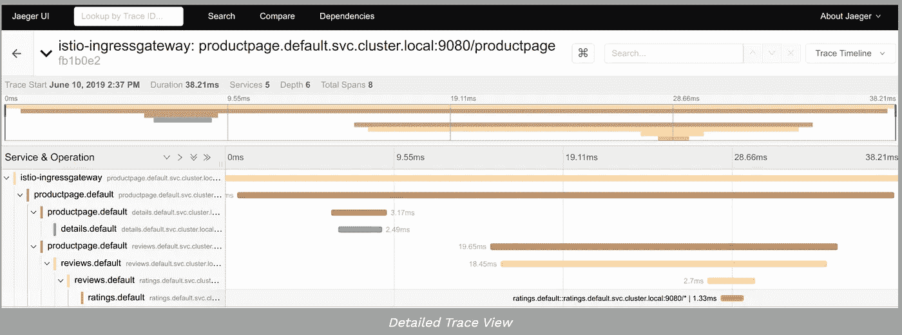
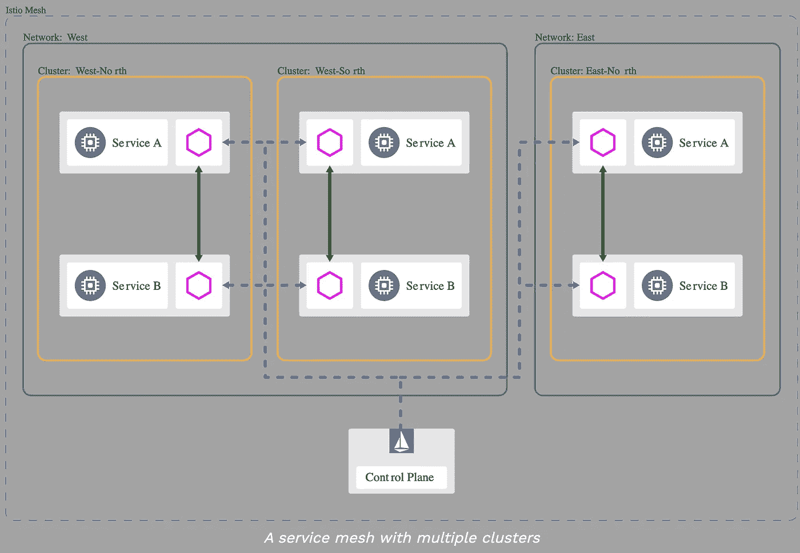
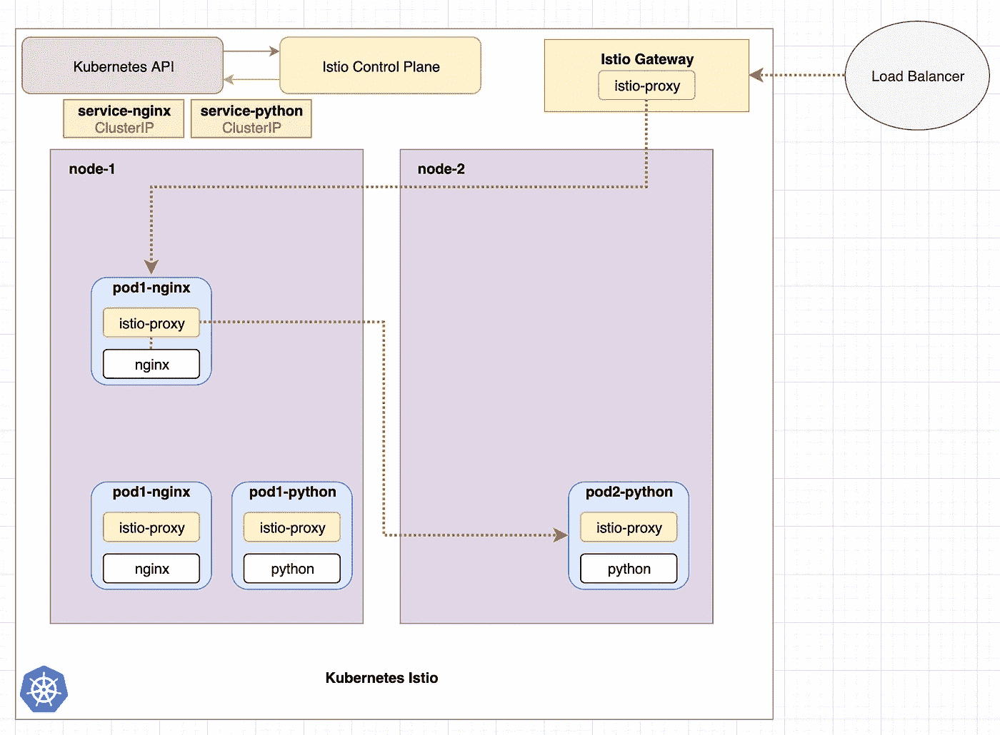

# Kubernetes Istio 简单直观地解释了

> 原文：<https://itnext.io/kubernetes-istio-simply-visually-explained-58a7d158b83f?source=collection_archive---------1----------------------->

## 那么大家都在谈论的这个 Istio 是什么呢？

**确保您理解了第 1 部分中的 Kubernetes 服务:**

*   第 1 部分: [Kubernetes 服务简单直观地解释了](https://medium.com/swlh/kubernetes-services-simply-visually-explained-2d84e58d70e5?source=friends_link&sk=49a5e832662a689111a6087e1fe1232a)
*   第 2 部分: [Kubernetes Ingress 简单直观地解释了](https://codeburst.io/kubernetes-ingress-simply-visually-explained-d9cad44e4419?source=friends_link&sk=e8ca596700f5b58c7ab0d85d4dab6386)
*   第三部分:(本文)
*   第 4 部分: [Kubernetes 无服务器简单直观讲解](https://medium.com/@wuestkamp/kubernetes-serverless-simply-visually-explained-ccf7be05a689?sk=142c4725e110bcd9ad67f93bd2b37ede)

# TL；博士/什么是 Istio？

Istio 是一个服务网格，它允许集群中的 pod 和服务之间进行更详细、复杂和可观察的通信。

它通过用 CRDs 扩展 Kubernetes API 来管理这个问题。它将代理容器注入到所有 pod 中，然后这些 pod 控制集群中的流量。

# Kubernetes 服务

从这里开始，你应该已经了解了 Kubernetes 服务，你可以阅读本系列的第 1 部分。我们现在将很快深入 Kubernetes 服务是如何实现的。我认为这有助于理解 Istio 如何做相同和不同的事情。

图 1: Kubernetes 本地服务请求

图 1 显示了一个 Kubernetes 集群，它有两个节点和 4 个 pod，每个 pod 有一个容器。有指向 nginx pods 的服务`service-nginx`和指向 python pods 的服务`service-python`。红线显示了从`pod1-nginx`的 nginx 容器向`service-python`服务发出的请求，服务将请求重定向到`pod2-python`。

默认情况下，ClusterIP 服务执行简单的随机或循环分发。Kubernetes 中的服务不存在于特定的节点上，而是存在于整个集群中。我们可以在图 2 中看到更多细节:

图 2:使用 kube-proxy 的 Kubernetes 本地服务请求

图 2 显示了与图 1 相同的示例，只是更加详细。Kubernetes 中的服务是由运行在每个节点上的`kube-proxy`组件实现的。该组件创建 iptables 规则，将请求重定向到 pod。因此服务就是 iptables 规则。(还有其他不使用 iptables 的代理模式，但是过程是一样的。)

在图 2 中，我们看到 Kubernetes API 程序每个都是`kube-proxy`。每当服务配置或服务窗格发生变化时，都会发生这种情况。通过这种方式，Kubernetes API(以及整个主节点或控制平面)可以关闭，但服务仍然可以工作。

# Kubernetes Istio

我们现在来看配置了 Istio 的同一个示例:

图 3: Istio 控制平面程序 istio-proxy

图 3 显示了安装的 Istio，它带有 Istio 控制面板。同样常见的是，每个 pod 都有第二个名为`istio-proxy`的容器，它在创建过程中自动注入到 pod 中。

Istio 最流行的代理是 [Envoy](https://www.envoyproxy.io/) ，它拥有惊人的能力。尽管有可能使用其他代理([比如 Nginx](https://www.nginx.com/blog/nginmesh-nginx-as-a-proxy-in-an-istio-service-mesh/) )，这就是为什么从现在开始我们只将代理称为`istio-proxy`。

我们可以看到`kube-proxy`组件不再显示，这样做是为了保持图像干净。这些仍然存在，但拥有`istio-proxy`的吊舱将不再使用`kube-proxy`组件。

每当配置或服务舱发生变化时，Istio 控制平面对所有`istio-proxy`边车进行编程。类似于图 2 中 Kubernetes API 对所有`kube-proxy`组件的编程。Istio 控制平面使用现有的 Kubernetes 服务来接收每个服务指向的所有 pod。Istio 使用 pod IP 地址实现自己的路由。

在 Istio 控制平面对所有`istio-proxy`边车进行编程后，它可能看起来像这样:

图 4: Istio 控制平面对所有 Istio 代理编程

在图 4 中，我们看到 Istio 控制平面如何将当前配置应用到集群中的所有`istio-proxy`容器。为简单起见，这些还包括“ClusterIP”声明。虽然 ClusterIP 是 Kubernetes 的内部服务类型。Istio 将把 Kubernetes 服务声明转换成自己的路由声明。但是想象一下图片中显示的情况会有所帮助。

让我们看看如何使用 Istio 发出请求:

图 Istio 发出的请求

在图 5 中，所有的`istio-proxy`容器已经由 Istio 控制平面编程，并包含所有必要的路由信息，如图 3/4 所示。来自`pod1-nginx`的 nginx 容器请求服务`service-python`。

请求被`pod1-nginx`的`istio-proxy`容器拦截，并被重定向到一个 python pod 的`istio-proxy`容器，该容器随后将其重定向到 python 容器。

# 这里发生了什么？

图 1-5 显示了带有 nginx 和 python pods 的相同示例 Kubernetes 应用程序。我们已经看到了使用默认的 Kubernetes 服务然后使用 Istio 的请求是如何发生的。

**重要的事情**:无论使用什么方法，结果都是一样的，应用程序本身不需要改变，只需要改变基础设施代码。

# 为什么所有这些，为什么使用 Istio？

如果使用 Istio 时没有任何变化(nginx pods 仍然可以像以前一样连接到 python pods ),那么为什么首先要使用 Istio 呢？

**惊人的优势在于**现在所有流量都通过每个 pod 中的`istio-proxy`容器进行路由。每当一个`istio-proxy`接收并重定向一个请求时，它也向 Istio 控制平面提交关于它的信息。

因此，Istio 控制平面确切地知道请求来自哪个 pod，存在哪些 HTTP 报头，请求从一个`istio-proxy`到另一个需要多长时间等等。在有许多服务相互通信的集群中，这允许对所有流量进行更多的观察和更好的控制。

## 高级路由

Kubernetes 内部服务只能将服务请求循环或随机分配给 pod。有了 Istio，更复杂的方法成为可能。比如根据请求头重定向，如果发生错误或者重定向到最少使用的服务。

## 部署

它允许将特定百分比的流量路由到特定的服务版本，因此允许绿色/蓝色和淡黄色部署。

## 加密

从`istio-proxy`到`istio-proxy`之间的集群内部流量可以加密。

## 监控/图形生成

Istio 连接到像普罗米修斯这样的监控工具。它还可以很好地与 Kiali 一起显示所有服务及其开箱即用的流量。

[https://istio.io/docs/tasks/observability/kiali](https://istio.io/docs/tasks/observability/kiali/)

## 描摹

因为 Istio 控制平面有大量关于请求的数据，所以可以使用 Jaeger 等工具进行跟踪和检查。

[https://istio . io/docs/tasks/observability/distributed-tracing/jaeger](https://istio.io/docs/tasks/observability/distributed-tracing/jaeger/)

## 多簇网格

Istio 有一个内部服务注册中心，可以使用现有的 Kubernetes 服务。尽管也可以从集群外部添加资源，甚至将不同的集群连接到一个网格中。

[https://istio . io/docs/ops/deployment/deployment-models/# multi-clusters](https://istio.io/docs/ops/deployment/deployment-models/#multiple-clusters)

# 边车喷射

为了让 Istio 工作，应该是网格一部分的每个 pod 都需要注射`istio-proxy`边车。这可以在 pod 创建期间为整个名称空间自动完成(通过[准入控制器钩子](https://kubernetes.io/docs/reference/access-authn-authz/admission-controllers/))或者手动完成。

# Istio 会取代 Kubernetes 的服务吗？

没有。当我开始使用 Istio 时，我问自己的一个问题是，它是否会取代现有的 Kubernetes 服务。答案是否定的。Istio 使用现有的 Kubernetes 服务来获取所有端点/pod IP 地址。

# Istio 是否取代 Kubernetes Ingress？

(可能在本系列的[第 2 部分中读到入口)](https://codeburst.io/kubernetes-ingress-simply-visually-explained-d9cad44e4419?source=friends_link&sk=e8ca596700f5b58c7ab0d85d4dab6386)

是的。Istio 提供了新的资源，比如 Gateway 和 VirtualService，甚至还附带了 ingress 转换器`istioctl convert-ingress`。一个很好的来源是 https://istio.io/docs/concepts/traffic-management 的

图 6 显示了 Istio 网关如何处理入口流量。网关本身也是一个`istio-proxy`组件。

图 6: Istio 网关

# 控制平面组件

Istio 控制面板由几个较小的组件组成，如飞行员、调音台、城堡和厨房。如果你喜欢潜得更深，我建议去 https://istio.io/docs/ops/deployment/architecture

# 如果 Istio 控制平面关闭会发生什么？

因为所有的`istio-proxy`边车都已经被编程，Istio 控制平面可以下降，交通像以前一样工作。但是不会应用配置更新或创建的新 pod。

虽然对于高级路由，如将流量发送到最少使用的 pod，或策略(【https://istio.io/docs/tasks/policy-enforcement】)来说，所有`istio-proxys`之间需要通过 Istio 控制平面进行通信。然后，在允许请求之前，每个`istio-proxy`都必须检查回 Istio 控制平面。

为了让这些配置正常工作，我认为控制平面必须随时可用。如果你有这方面的链接，请在评论中添加。

# 接下来你会做什么？

我写了一篇关于 [Istio Canray 部署](https://medium.com/@wuestkamp/kubernetes-istio-canary-deployment-5ecfd7920e1c?source=friends_link&sk=2be48393ac175a2199bf5d486cb91acf)的示例文章和 Github 报告。

Istio 提供了一个很好的带有一些微服务的示例应用程序。如果你喜欢一头扎进 Istio，这是一个不错的开始:[https://istio.io/docs/setup/getting-started](https://istio.io/docs/setup/getting-started/)

如果你喜欢潜得更深，这个视频也很棒。

# 概述

这是一个简单的介绍和广泛的概述，我希望能帮助人们开始。Istio 无疑在 Kubernetes 之上又增加了一层复杂性。尽管对于现代微服务架构，它实际上提供了一种比在应用程序代码本身中实现跟踪或可观察性更简单的方法。

# 成为 Kubernetes 认证

[https://killer.sh](https://killer.sh)