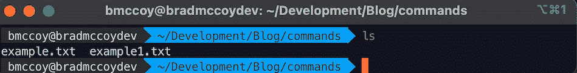
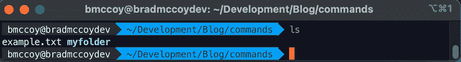
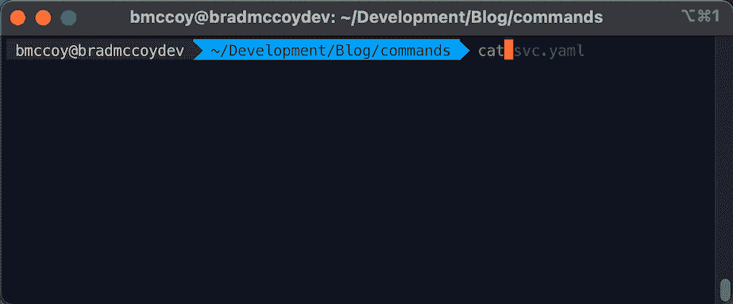
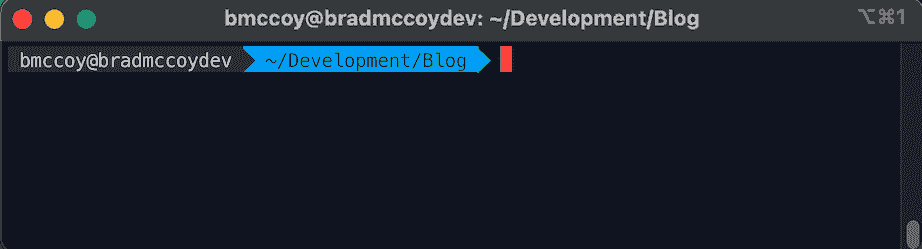
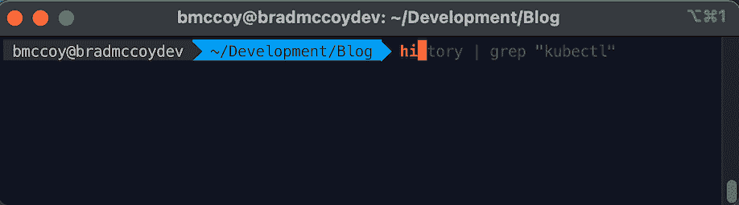
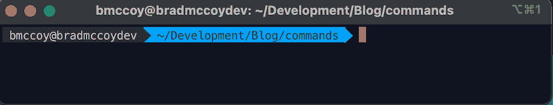
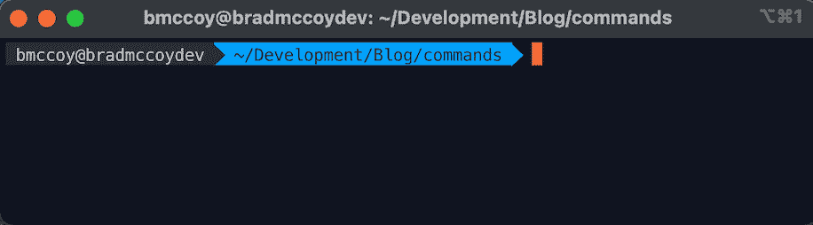
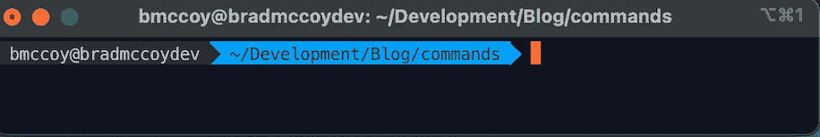
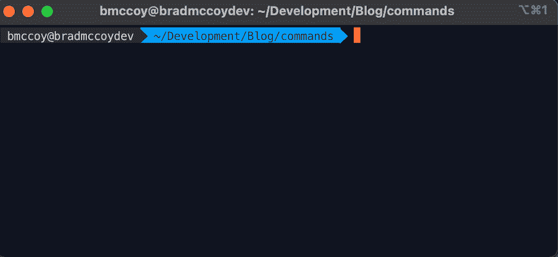

# Kubernetes 之旅——您应该知道的基本 Linux 命令

> 原文：<https://itnext.io/kubernetes-journey-basic-linux-commands-you-should-know-da4f95ceca5?source=collection_archive---------3----------------------->

如果您刚开始接触 Kubernetes，还不知道基本的 Linux 命令，那么您可能应该先学会如何走路，然后才能跑。接受我的建议，阅读这篇博客，直到你学会这些命令，它会加速你的学习。

这个博客将会很简短，让我们直接进入它。

# 限位开关（Limit Switch）

限位开关（Limit Switch）

**ls** 命令用于查看目录内容。默认情况下，该命令将显示当前工作目录的内容。

如果你想看到其他目录的内容，输入 **ls** ，然后输入目录的路径。比如输入**ls**/my folder 查看 **myfolder** 的内容。

*   **ls -R** 也会列出子目录中的所有文件
*   **ls -a** 将显示隐藏的文件
*   ls -al 将列出文件和目录的详细信息，如权限、大小、所有者等。

# 清楚的

清楚的

clear 命令可以用来清除你的终端屏幕，给你一个空白页。

# 显示当前工作目录

显示当前工作目录

使用 **pwd** 命令找出当前工作目录的路径。该命令将返回一个绝对(完整)路径，它基本上是所有目录的路径，以正斜杠 **(/)** 开头。绝对路径的一个例子是 **/users/bmccoy** 。

# mkdir

mkdir

使用 **mkdir** 命令创建一个新目录——如果您键入 **mkdir commands** ，它将创建一个名为 **commands** 的目录。

*   要在另一个目录中生成一个新目录，使用这个 Linux 基本命令**mkdir kubernetes/new file**

# 激光唱片

cd && cd..

要浏览 Linux 文件和目录，请使用 **cd** 命令。它需要目录的完整路径或名称，这取决于您所在的当前工作目录。

假设你在**/users/BMC coy/Development**中，你想去 **Blog** ，一个 **Development** 的子目录。为此，只需键入以下命令: **cd** **Blog** 。

有一些快捷方式可以帮助您快速导航:

*   **光盘..**上移一个目录
*   **cd** 直接转到主文件夹

# 触控

触控

**touch** 命令允许你通过 Linux 命令行创建一个空白的新文件。例如，输入 **touch example.txt** 创建一个 txt 文件。这可以是任何文件，例如 deployment.yaml

# 丙酸纤维素

丙酸纤维素

使用 **cp** 命令将文件从当前目录复制到不同的目录。例如，命令**CP example . txt example1.txt**会创建一个 **example.txt** 的副本，并将其重命名为 example 1 . txt

# 平均变化

mv example.txt 命令

**mv** 命令的主要用途是移动文件，尽管它也可以用来重命名文件。

mv 中的参数类似于 cp 命令。您需要键入 **mv** 、文件名和目标目录。例如: **mv example.txt 命令**

要重命名文件，可以做**mv example . txt new example . txt**

# 空间

rm 示例. txt

**rm** 命令用于删除文件和目录。如果您只想删除目录——作为 rmdir 的替代方法——使用 **rm -r** 。

# 猫

cat svc.yaml

**cat**(concatenate 的缩写)用于在标准输出(sdout)上列出文件内容。要运行这个命令，键入 **cat** ，后跟文件的名称和扩展名。比如: **cat svc.yaml** 。

以下是使用**卡特彼勒**命令的其他方法:

*   **猫>文件名**创建一个新文件
*   **cat filename 1 filename 2>filename 3**连接两个文件(1 和 2)并将它们的输出存储在一个新文件(3)中

# 发现

查找名称 svc.yaml

类似于**定位**命令，使用**查找**也搜索文件和目录。不同之处在于，您使用 **find** 命令来定位给定目录中的文件。

例如，find**/home/-name SVC . YAML**命令将在主目录及其子目录中搜索名为 **svc.yaml** 的文件。

# 历史

历史| grep "kubectl "

当您使用 Linux 一段时间后，您会很快注意到每天可以运行数百个命令。因此，如果你想回顾你之前输入的命令，运行**历史**命令特别有用。

# 可做文件内的字符串查找

grep kind svc.yaml

另一个对日常使用毫无疑问有帮助的基本 Linux 命令是 **grep** 。它可以让你搜索给定文件中的所有文本。

举例来说， **grep king svc.yaml** 将在 svc 文件中搜索单词 kind。包含搜索单词的行将被完整显示。

# 回声

echo hello > name.txt

该命令用于将一些数据移入文件。例如，如果您想将文本“你好，我的名字是布拉德”添加到名为 name.txt 的文件中，您可以键入 **echo Hello，我的名字是布拉德** **> > name.txt**

# 须藤

是“**超级用户 Do** 的缩写，该命令使您能够执行需要管理权限或根权限的任务。但是，不建议在日常使用中使用该命令，因为如果您做错了什么，很容易出现错误。

# 砰

平 google.com

使用 **ping** 命令检查您与服务器的连接状态。例如，只需输入**ping google.com**，该命令将检查您是否能够连接到谷歌，并测量响应时间。

# **六**

vi svc.yaml

使用 **vi** 命令打开 vi 编辑器。要退出，请按 esc 键，键入:wq！要保存并退出还是 q！辞职。我会为此写一篇独立的博客。

# 结论

在学习 Kubernetes 之前学习这些基本命令会使学习变得容易得多。他们也会帮助你提高速度，比如 CKA，CKAD 和 CKS。更多博客和视频，你可以在 twitter 上关注我[这里](https://twitter.com/bradmccoydev)。