# Kubernetes 之旅— CKA / CKAD 考试提示

> 原文：<https://itnext.io/kubernetes-journey-cka-ckad-exam-tips-ff73e4672833?source=collection_archive---------1----------------------->

我最近通过了 CKAD 和 CKA 考试，并且热衷于辅导工程师，所以想分享一些通过考试的技巧和秘方。我会尽量保持博客的互动性，因为我在寻找信息时发现，我必须浏览视频才能找到我想要的解决方案，这非常耗时。你也可以在这里找到这个博客的视频版本。

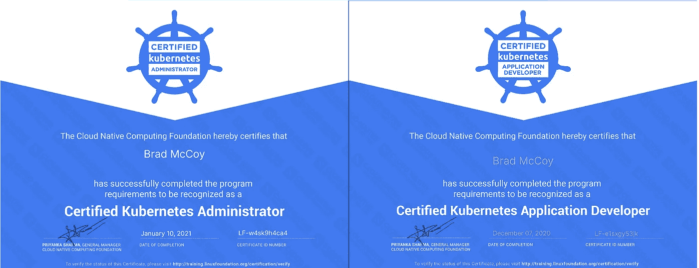

这个博客将重点关注关于如何准备考试的提示，以及当你在考试时的提示。我想表达的主要观点是不要逞英雄，首先要确保你理解基本的 Linux 命令、VI 编辑器和 docker。这个考试是 100%实用的，所以你需要熟悉所有这些，因为你会发现 2 个小时会很快用完，所以你一定不要害怕先学习基础知识。

# 内容

1.  预约考试
2.  为考试而训练
3.  CKA 和 CKAD 的提示
4.  给 CKA 的建议
5.  CKAD 提示
6.  考试技巧
7.  加入 CNCF 社区学习小组
8.  结论

**预约考试日期**

提前预订考试日期很重要，这将使你的学习保持正轨，如果你发现你没有准备好，你可以提前 24 小时免费重新安排。

获得认证需要一定的费用，每门考试的费用为 300 美元，每门课程的费用约为 100 美元。当我不得不为这些考试付费时，我从不担心价格，因为这是对你职业生涯的巨大投资，总是等待折扣出现，去年我参加了 KubeCon，两个证书都有 50%的折扣。如果你在工作，你的公司应该支付这笔费用，如果你需要帮助说服你的老板，告诉他们读一读我以前写的关于在 Kubernetes [这里](https://www.alldaydevops.com/blog/kubernetes-journey-how-to-upskill-your-team)提升团队技能的博客，这应该有助于获得认同。

每次考试都有免费的重考。当我考试时，我使用了快速失败，快速失败的方法，我第一次考试都失败了，因为我还没有完全准备好，但我利用第一个机会来看看我离目标有多远，这为我节省了很多学习不重要的东西的时间，也给了我在考试环境中练习的机会，因为它与实验室有点不同。

点击这里预订考试: [CKA](https://www.cncf.io/certification/cka/) ， [CKAD](https://www.cncf.io/certification/ckad/)

**考试培训**

如果你是 Kubernetes 的新手，我建议你从入门课程开始，那里有很多很棒的课程，我参加了[EDX Kubernetes 入门](https://www.edx.org/course/introduction-to-kubernetes)课程，进入学习和考试模式很棒。

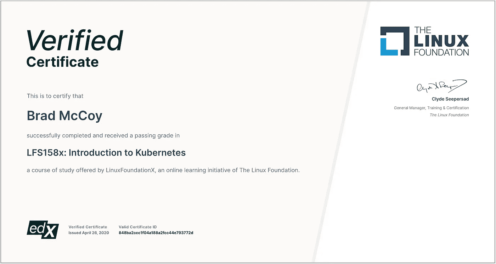

在我的学习中，我使用了玛姆沙德·曼南贝斯的 Udemy 课程，他是一个训练中的巫师，他让理解困难的事情变得非常容易。课程可以在这里找到: [CKA](https://www.udemy.com/course/certified-kubernetes-administrator-with-practice-tests/) 、 [CKAD](https://www.udemy.com/course/certified-kubernetes-application-developer/) 。它们附带了一系列视频和动手实验，这对通过这些考试至关重要。现在是秘制酱料。因为这是一次 100%的实践考试。所有视频我只看了一遍。我以 1.5x 的速度看着他们，确保我理解了他们。然后，我把所有时间都花在了动手实验上。你可以在考试中参考 Kubernetes 文档，所以我真的利用了这一点。每次我需要知道如何在实验室中做些什么时，我都会参考 [Kubernetes 文档](https://kubernetes.io/docs/)并将其标记为书签，因为考试中允许使用书签和两个屏幕，所以我建立了一个索引以供考试参考，这帮助我通过了考试，所以继续练习实验室和模拟考试并参考您的书签。我本打算在这个博客里列出我的书签，但重要的是你要自己制作它们，这样你就能习惯于快速找到信息，因为你需要尽可能多的时间。

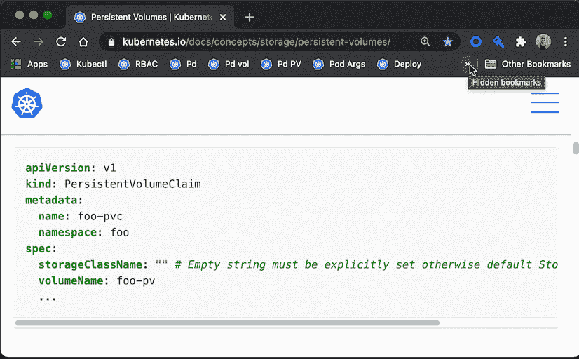

# **针对 CKA 和 CKAD 的提示**

1.  请记住，每个问题的百分比都是重量百分比
2.  跳过难的问题，然后再回来，因为时间很宝贵
3.  始终使用试题中的复制按钮，而不是键入名称空间等，以避免错误，例如 ***-n BM1543x***
4.  使用命令式命令创建 yaml 为了节省时间，可以参考考试中的 kubectl 参考文档。

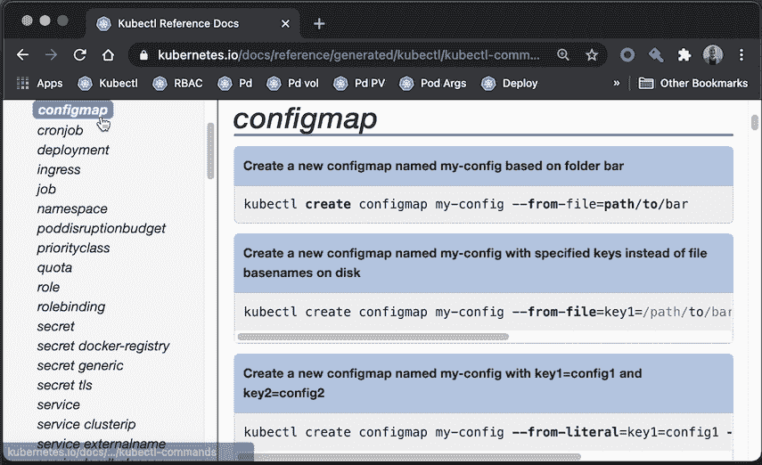

1.  确保您位于问题中指定的正确的集群和正确的名称空间中，以避免在使用 YAML 创建资源时部署到错误的名称空间。请在元数据中指定名称空间，以防您忘记。

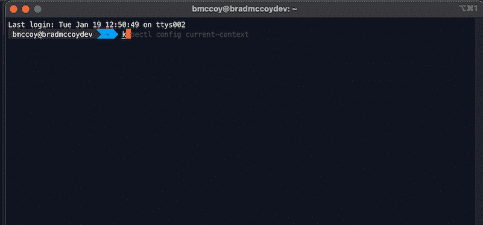

1.  Linux 命令: **cd，ls，grep，cat，cp，mv，mkdir，rm，以及 rmdir，systemctl**

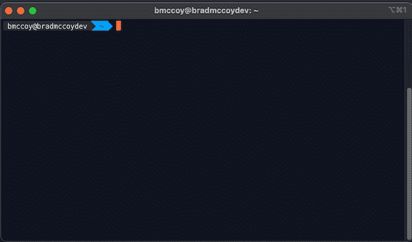

1.  **Ctrl + r** :反向搜索，节省输入之前命令的时间

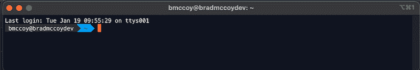

3.使用 **watch** 命令检查部署是否有效等，它会每 2 秒执行一次命令，直到你**ctrl+c**eg watch ku bectl get pods

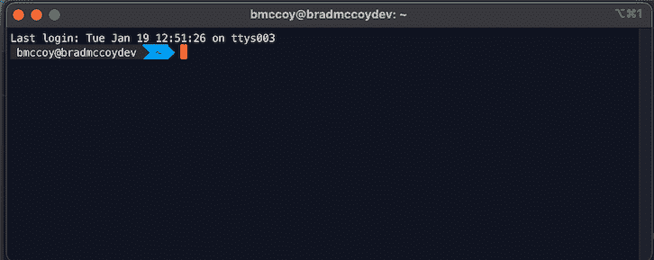

1.  **kubectl api-resources** 获取名称/简称*例如，kubectl 获取 svc*

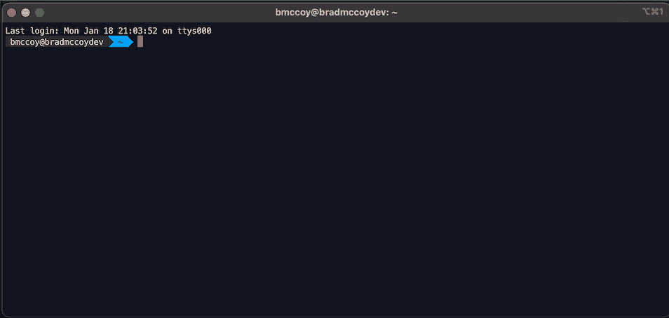

1.  **kubectl run -h** 获得使用运行命令的帮助*例如 kube CTL run test—image = bradmaccoydev/test:latest—dry-run-client*

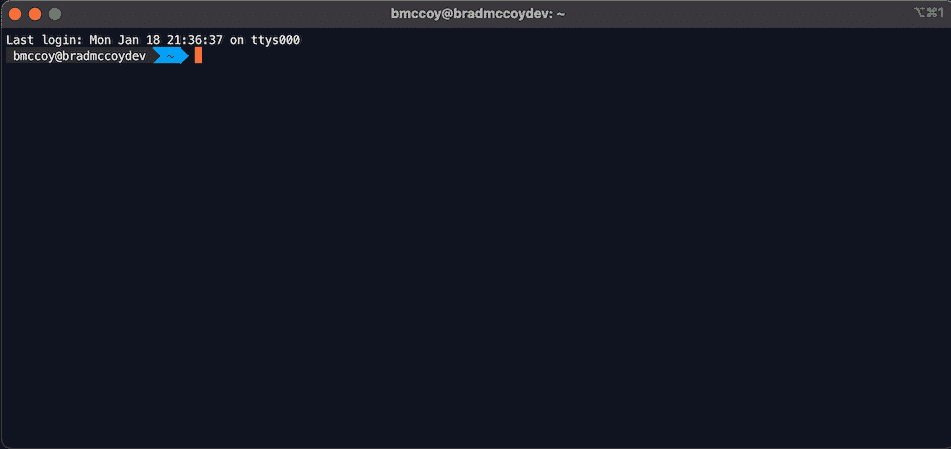

1.  2.yaml 用问题编号对你创建的 yaml 文件进行编号，例如**kubectl run test bradmcoydev/test:latest—dry-run = client—o YAML>2 . YAML**

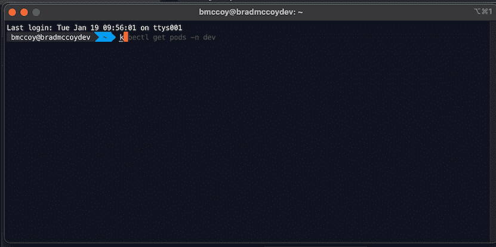

1.  用 VIM，不知道的话，**学起来！**

```
# There are two modes, for writing/deleting txt press i, then esc for edit mode# To Exit press esc then type :q! to exit (no save) and :wq! to exit (save)# Delete a Line
dd# Delete 2 Lines (for 5 put 5dd)
2dd# Undo
u# Search for word eg image in deployment.yaml
(esc) /image (enter)# Jump to the End of the line
$# Goto line 5
5gg
```

# **CKA 提示**

1.  学习 [JSONPath 表达式](https://kodekloud.com/p/json-path-quiz)。
2.  试试 GCP 的凯尔西高塔的“Kubernetes the hard way”或者穆姆沙德的 VirtualBox 设置。
3.  为命令使用别名时要小心，比如 alias k=kubectl ,因为你必须一直 ssh 到不同的节点，有时当你忘记将别名设置为 k 时会花费更多的时间
4.  用 [kubeadm](https://kubernetes.io/docs/tasks/administer-cluster/kubeadm/kubeadm-upgrade/) 练习升级

```
# If you cant remember the etcdctl arguments type the following**ETCDCTL_API=3 etcdctl snapshot save -h
ETCDCTL_API=3 etcdctl snapshot restore -h**# For the questions regarding troubleshooting the kubelet, try simple things like restarting first before you get carried away**systemctl daemon-reload && systemctl restart kubelet**
```

# **CKAD 提示**

1.  为 kubectl 使用一个别名，这样你就不必一直输入它了

```
# Remember the Metrics server for some easy points**kubectl top node
kubectl top pod** # Check Logs for the pod**kubectl logs <pod-name> [-c <container-name>]
kubectl exec -it <pod-name> [-c <container-name>] -- sh** # Search in all namespaces**kubectl get pods -A
kubectl get all -A**# Create a ConfigMap**kubectl create cm --from-literal=<key>=<value>** # Create a Secret**kubectl create secret generic --from-literal=<key>=<value>** # Create a pod with limits**kubectl run <pod-name> --image=<image> --env="<key>=<value>" --labels="<key>=<value>" --requests='cpu=100m,memory=256Mi'--limits='cpu=200m,memory=512Mi'** # Delete a resource without waiting**kubectl delete pod <pod-name> --wait=false** # Show labels for pod selector patterns**kubectl get pod --show-labels** # Scale the replicas**kubectl scale deployment <deployment name> --replicas=3** # Change the image on a deployment**kubectl set image deploy/<deployment-name> <container-name>=<new-image-name:tag>**
```

# **考试提示**

1.  您可以在预定时间前 15 分钟开始考试，这是与监考人交谈所需的时间。
2.  确保你的房间在考试当天是干净的，他们会让你带着相机在房间里走来走去
3.  立即使用 **sudo -i** 来承担更高的权限以使事情变得更容易。要想抽身式退出还是**苏的学生**
4.  使用“ **ssh <节点名>** ”进入节点，记住你在哪个节点，这样你就不会搞混了

# **CNCF 社区组**

我们也有一个 CNCF 社区小组，在那里我们每周举行一次聚会，帮助人们准备他们的考试，你可以加入这里:[https://community.cncf.io/manly](https://community.cncf.io/manly)和 slack 频道在 [slack.cncf.io](http://slack.cncf.io) 上，叫做: *cncf-community-manly*

# **结论:**

我希望你喜欢阅读这个博客，如果你需要任何帮助或有任何问题，请通过中链接的[联系我。做这些考试最难的部分是等待考试结果的 36 个小时，通常他们会在 24-30 个小时左右到来，所以不要担心每十分钟检查一次电子邮件，不要担心你失败了，把它当作一次练习考试。现在是我的下一个里程碑，完成 CKS 考试，和更多的生产经验。期待我的下一篇博客吧！](https://www.linkedin.com/in/bradmccoy3/)

如果你喜欢它，请给它一个掌声作为反馈！

# 重要链接:

```
[https://www.alldaydevops.com/blog/kubernetes-journey-how-to-upskill-your-team](https://www.alldaydevops.com/blog/kubernetes-journey-how-to-upskill-your-team)[https://www.edx.org/course/introduction-to-kubernetes](https://www.edx.org/course/introduction-to-kubernetes)[https://www.cncf.io/certification/cka/](https://www.cncf.io/certification/cka/)[https://www.cncf.io/certification/ckad/](https://www.cncf.io/certification/cka/)[https://training.linuxfoundation.org/wp-content/uploads/2020/01/Important-Tips-CKA-CKAD-01.28.2020.pdf](https://training.linuxfoundation.org/wp-content/uploads/2020/01/Important-Tips-CKA-CKAD-01.28.2020.pdf)[https://www.udemy.com/course/certified-kubernetes-application-developer/](https://www.udemy.com/course/certified-kubernetes-application-developer/)[https://www.udemy.com/course/certified-kubernetes-administrator-with-practice-tests/](https://www.udemy.com/course/certified-kubernetes-administrator-with-practice-tests/) [https://vim.rtorr.com/](https://vim.rtorr.com/)[https://www.youtube.com/watch?v=yGuPm9D8W_4](https://www.youtube.com/watch?v=yGuPm9D8W_4)
```

# 我的验证证书:

```
[https://courses.edx.org/certificates/848ba2ccc1f04a188a2fcc44e793772d](https://courses.edx.org/certificates/848ba2ccc1f04a188a2fcc44e793772d)[https://ti-user-certificates.s3.amazonaws.com/e0df7fbf-a057-42af-8a1f-590912be5460/ec10b2de-789b-440c-a203-9dfc12d6cf10-brad-mccoy-certified-kubernetes-application-developer-ckad-certificate.pdf](https://ti-user-certificates.s3.amazonaws.com/e0df7fbf-a057-42af-8a1f-590912be5460/ec10b2de-789b-440c-a203-9dfc12d6cf10-brad-mccoy-certified-kubernetes-application-developer-ckad-certificate.pdf)[https://ti-user-certificates.s3.amazonaws.com/e0df7fbf-a057-42af-8a1f-590912be5460/ec10b2de-789b-440c-a203-9dfc12d6cf10-brad-mccoy-certified-kubernetes-administrator-cka-certificate.pdf](https://ti-user-certificates.s3.amazonaws.com/e0df7fbf-a057-42af-8a1f-590912be5460/ec10b2de-789b-440c-a203-9dfc12d6cf10-brad-mccoy-certified-kubernetes-administrator-cka-certificate.pdf)
```