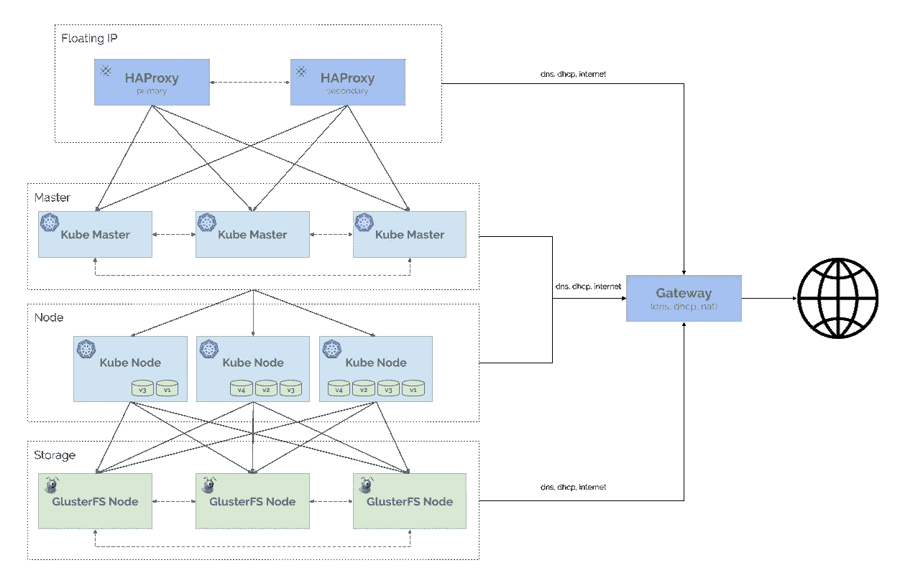
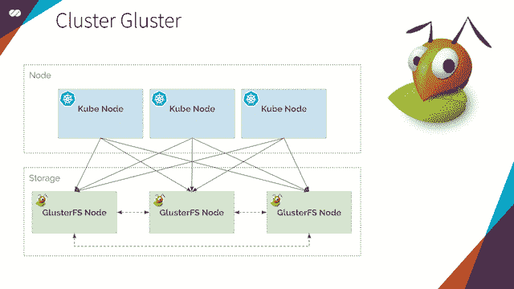
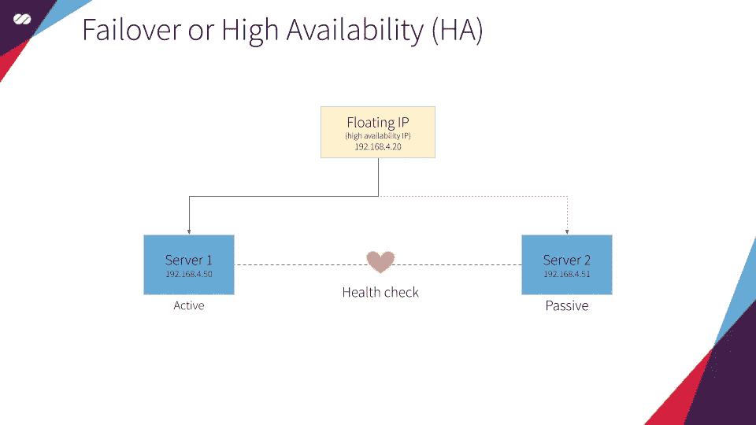
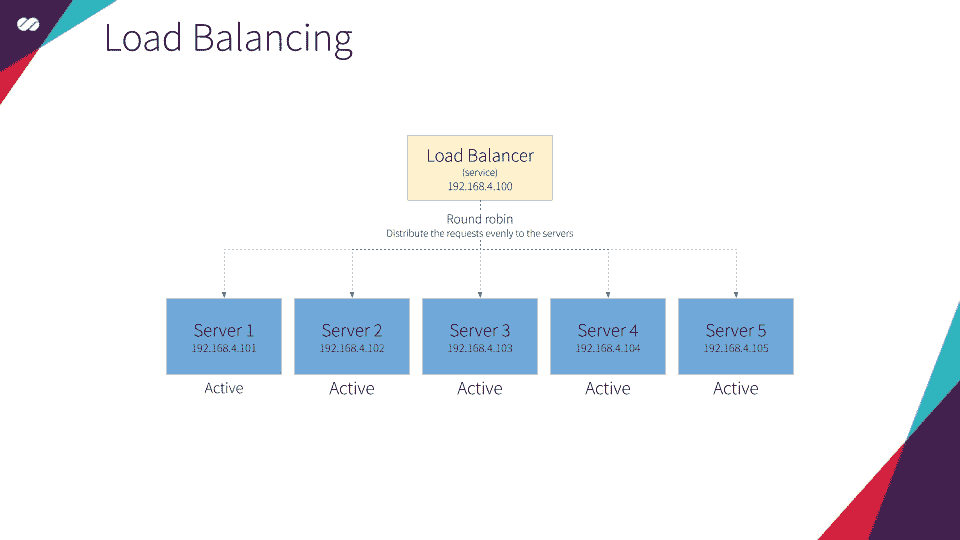
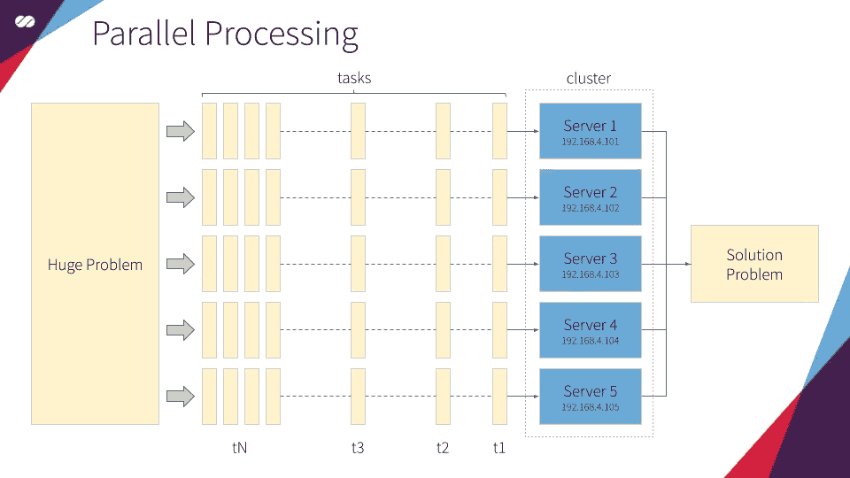

# Kubernetes 之旅—启动并运行云计算—架构概述

> 原文：<https://itnext.io/kubernetes-journey-up-and-running-out-of-the-cloud-architecture-overview-e75763b54922?source=collection_archive---------4----------------------->

迪伦·诺尔特在 [Unsplash](https://unsplash.com/search/photos/computers?utm_source=unsplash&utm_medium=referral&utm_content=creditCopyText) 上的照片

在本文中，我们将定义集群的架构。我们还将看到行业中使用的不同类型的集群，并确定 Kubernetes 属于哪个类别。

在[的上一篇文章](https://medium.com/@mtvallim/kubernetes-journey-up-and-running-out-of-the-cloud-introduction-f04a811c92a5)中，我们谈到了应用程序开发的演变，并设置了我们旅程所基于的背景(在云之外设置一个 Kubernetes 集群)。

这些文章是我们 [Kubernetes 之旅](https://medium.com/@mtvallim/kubernetes-journey-up-and-running-out-of-the-cloud-introduction-f04a811c92a5)的一部分。我希望您对深入研究如何从云中安装和配置 Kubernetes 感到兴奋！

如果你不想等到所有的文章都发表了，又想马上动手，可以随意克隆项目的 Github repo。它完全实用，文档也在不断改进:

 [## 罩下的姆瓦利姆/库伯内特斯

### 本教程是有人计划安装一个 Kubernetes 集群，并希望了解一切如何配合在一起…

github.com](https://github.com/mvallim/kubernetes-under-the-hood) 

# 架构图

# 单羟基团簇

由**浮动 IP** 和[Corosync](https://clusterlabs.org/corosync.html)/[Pacemaker](https://clusterlabs.org/pacemaker/)集群堆栈支持的高可用性 HAProxy 负载平衡器。

浮动 IP 也称为“共享”或“虚拟”IP 地址。浮动 IP 是分配给最终可能出现故障的节点的正常 IP 地址。对于故障转移，具有相似特征(被动)的节点与主(主动)节点一起以主动/被动模式运行。如果发生故障，这个浮动 IP 将自动透明地分配给被动节点，使其成为主动节点，从而避免停机。

每个 HAProxy 负载平衡器将被配置为在后端应用服务器之间分割流量。如果主负载平衡器关闭，浮动 IP 将自动移动到第二个负载平衡器，允许它继续服务而不停机。

# 库伯内特星团

[**Kubernetes**](https://kubernetes.io/docs/tutorials/kubernetes-basics/create-cluster/cluster-intro/) **协调连接在一起作为一个单元工作的高可用性计算机集群。**Kubernetes 中的抽象允许您将容器化的应用程序部署到集群中，而不需要将它们专门绑定到单独的机器上。为了利用这种新的部署模式，应用程序需要以一种与单个主机分离的方式打包:它们需要容器化。与过去的部署模型相比，容器化的应用程序更加灵活和可用，在过去的部署模型中，应用程序被直接安装到特定的机器上，作为深度集成到主机中的包。 **Kubernetes 以一种更有效的方式自动化了应用容器在集群中的分发和调度。**

Kubernetes 是一个开源平台，可以投入生产。

# 格鲁斯特

[GlusterFS](https://docs.gluster.org/en/latest/Administrator%20Guide/GlusterFS%20Introduction/) 是一个可扩展的网络文件系统，适用于云存储和媒体流等数据密集型任务。GlusterFS 是免费的开源软件，可以利用常见的现成硬件。Gluster 的主要目的是为 Kubernetes Pods 提供容量。它将像 Kubernetes 中的任何其他应用程序一样被管理和协调。这是释放 Kubernetes 中动态提供的持久 GlusterFS 卷的能力的一种便捷方式。

# 聚类定义

Cluster 是一个英文术语，意思是“凝聚”或“凝聚”，可以应用在各种上下文中。在计算环境中，该术语定义了能够将几台计算机组合在一起工作的系统架构。

每个工作站被称为一个“节点”,组合在一起形成集群。在某些情况下，可能会看到相同场景的“超级计算机”或“集群计算”等参考，代表所使用的硬件或专门开发的软件，以便能够组合这些设备。

> 参考:[https://en.wikipedia.org/wiki/Computer_cluster](https://en.wikipedia.org/wiki/Computer_cluster)

# 集群是如何形成的？

将多台计算机聚合在一起执行任务似乎非常简单，但事实并非如此。1960 年，IBM 开始致力于有效地构建这种用途，并且一直在不断发展。目标始终是提高融合的效率，即优化充分利用所有节点的资源，动态地进化集群。

# 所有的集群都一样吗？

不会。有不同类型的集群专注于合并的不同好处，因此更适合某些任务和市场。参见下面四种主要类型的集群:

## 故障转移或高可用性(HA)

顾名思义，开发这种类型的集群的目的是让应用程序始终保持活动和响应。不管每个节点上发生了什么，系统保持在线是非常重要的。为此，几个节点在用户不可见的冗余模式上工作。为了说明这个概念，想象一场篮球比赛，其中一名替补球员与首发球员具有完全相同的特征——实际上是原版的克隆——总是热情地站在球场边缘。如果首发球员因为任何原因需要离场，替补球员立即采取行动，裁判、公众和队友都没有意识到。这是一种常用于电子邮件等服务的群集类型，在这些服务中，停止服务是完全不可接受的。

## 负载平衡

在这种类型的架构中，所有节点负责执行任务。无论是响应传入的流量请求还是提供资源，任务总是被分配给组成系统的机器。这实际上是一种“人人为我”的方法。从最简单到最复杂的任务都是利用所有可用资源的联合所产生的计算能力来执行的。在这个模型中，性能是优先考虑的因素，如果任何一个节点出现故障，它将从系统中删除，任务将在剩余的节点中重新分配。

## 并行处理

在这种类型的集群中，大型任务被划分到不太复杂的活动中，由系统分配，并由组成集群的各个节点并行执行。因此，这种类型的集群非常适合非常复杂的计算任务。粗略地说，这就像在十个朋友之间分割五千块拼图，让每个朋友负责组装包含五百块的拼图。在每个朋友完成自己的部分后，这些组块被组合起来解决主要的难题(有人知道吗？)

## 组合模型

在某些情况下，不可能将性能置于稳定性之上，反之亦然。例如，MTA 服务器或电子邮件服务器需要这两种功能具有相同的优先级。因此，这些公司使用能够结合负载平衡和高可用性的集群。这导致系统能够组合不同机器的功率，同时具有冗余节点的内部网络以避免中断。

## Kubernetes 属于哪一类？

Kubernetes 采用了一种综合的方法。故障转移和高可用性，因此 it 部门能够(重新)安排 PODs 在不同的节点上运行，即使一个(或多个)PODs 出现故障，也能保持应用程序正常运行。和负载平衡，因此它能够将请求分发到在不同节点上运行的 pod，避免特定节点成为热点并最终影响应用程序的性能。

我希望你喜欢这篇文章以及这个系列的其他文章。在下一篇文章中，我们将讨论我们的技术堆栈，解释每个组件如何适应我们的架构。

不要忘记在下面的评论中留下你的反馈。不断完善这一系列的内容非常重要。

我再次强烈推荐您关注我的 Medium，这样您就不会错过本系列中发表的任何新文章。如果你错过了第一篇文章，你可以查看这里的。

回头见！！

再见。