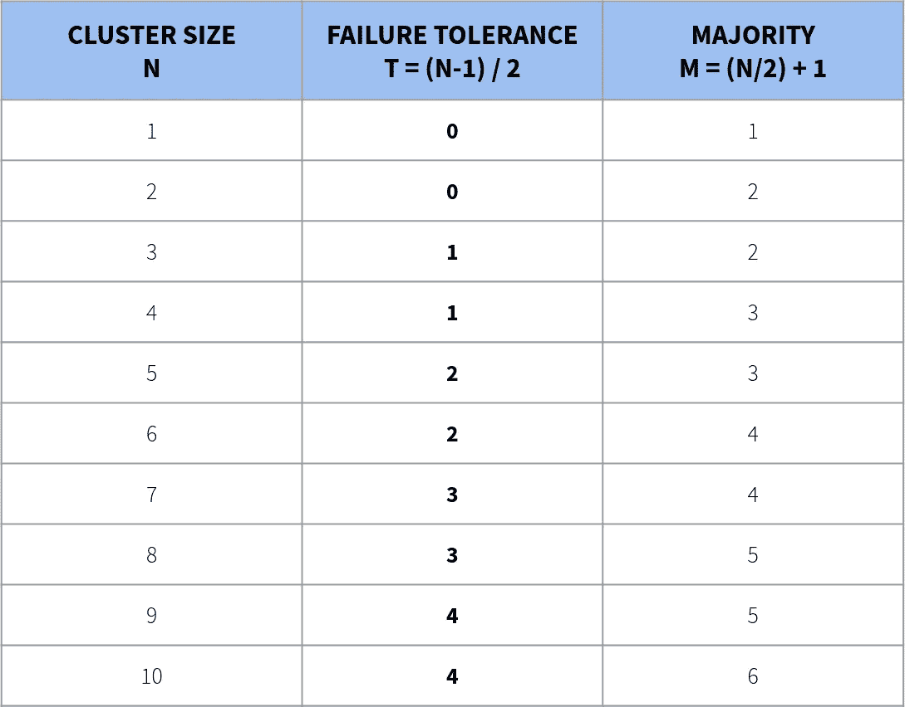
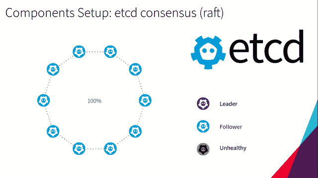

# Kubernetes 之旅—启动并运行云计算— etcd

> 原文：<https://itnext.io/kubernetes-journey-up-and-running-out-of-the-cloud-etcd-b332d1be474c?source=collection_archive---------2----------------------->

由 [Margarida CSilva](https://unsplash.com/@marg_cs?utm_source=unsplash&utm_medium=referral&utm_content=creditCopyText) 在 [Unsplash](https://unsplash.com/search/photos/circle?utm_source=unsplash&utm_medium=referral&utm_content=creditCopyText) 上拍摄的照片

在本文中，我们将介绍一些关于 **etcd** 的细节，以及它在 **Kubernetes 集群**中扮演的角色。我强烈建议您通过参考链接更好地理解 **etcd** 的工作原理。

在[上一篇文章](/kubernetes-journey-up-and-running-out-of-the-cloud-master-and-worker-6328775b347f)中，我们介绍了 **Masters** 和 **Workers** ，并简要概述了它们的主要组成部分。

这些文章是我们 [Kubernetes 之旅](https://medium.com/@mtvallim/kubernetes-journey-up-and-running-out-of-the-cloud-introduction-f04a811c92a5)的一部分。我希望您对深入研究如何从云中安装和配置 Kubernetes 感到兴奋！

如果你不想等到所有的文章都发表了，又想马上动手，可以随意克隆项目的 Github repo。它完全实用，文档也在不断改进:

 [## 罩下的姆瓦利姆/库伯内特斯

### 本教程是有人计划安装一个 Kubernetes 集群，并希望了解一切如何配合在一起…

github.com](https://github.com/mvallim/kubernetes-under-the-hood) 

> ***etcd*** *是一个分布式键值存储，它提供了一种可靠的方式来存储跨机器集群的数据。它是开源的，可以在 GitHub 上获得。etcd 在网络分区期间优雅地处理领导者选举，并且将容忍机器故障，包括领导者。*

> 参考:[https://coreos.com/etcd/docs/latest/](https://coreos.com/etcd/docs/latest/)

它是一个在集群中所有服务器上运行的守护程序，提供动态配置记录，并允许以简单的方式在集群成员之间共享多个配置数据。

因为数据以键值形式存储在 **etcd** 中，所以它被自动分配和复制(自动选择 **leader** )。对存储数据的所有更改都会反映在整个集群中。

**etcd** 还提供了一个发现服务，允许“已部署”的应用程序向所有集群节点通告它们提供的服务。

与 **etcd** 的通信是通过 API 调用完成的，使用 HTTP 上的 JSON。该 API 可以直接使用(例如通过 curl 或 wget)，或者通过 **etcdctl** 间接使用。

> 参考:【https://etcd.io/ 

## **故障容差**

> *建议集群中的成员数量为奇数。奇数的集群大小不会改变多数所需的数量，但是通过添加额外的成员，您可以获得更高的失败容忍度。在实践中，当比较偶数和奇数大小的集群时，您可以看到这一点*

> 参考:[https://coreos.com/etcd/docs/latest/v2/admin_guide.html](https://coreos.com/etcd/docs/latest/v2/admin_guide.html)

## **复制**

> 在计算机科学中，**状态机复制**或**状态机方法**是一种通过复制服务器和协调客户端与服务器副本的交互来实现容错服务的通用方法。该方法还为理解和设计复制管理协议提供了一个框架。

> 参考:[https://en.wikipedia.org/wiki/State_machine_replication](https://en.wikipedia.org/wiki/State_machine_replication)

*   **主动复制**
*   **被动复制**‣领导节点负责将状态复制到其他副本；

## **共识(筏)**

> *Raft 是一种共识算法，旨在易于理解。它在容错和性能方面与 Paxos 相当。不同之处在于，它被分解成相对独立的子问题，并且它清楚地解决了实际系统所需的所有主要部分。我们希望 Raft 能够让更多的人使用共识，并且这些人能够开发出比现在更高质量的基于共识的系统。*

> 参考:[https://raft.github.io/](https://raft.github.io/)

**什么是分布式共识算法？**

*   允许一组进程就一个值达成一致的算法；
*   它允许协调分布式过程；
*   它们出现在复制状态机的环境中；
*   这种算法在构建大规模、可靠的分布式系统中起着至关重要的作用；

**为了更好地理解这个概念，打个比方**

> 从前，有一个王国，由国王统治的**聚居地**。这位国王非常民主，由 9 位非常聪明、忠诚的顾问组成的团队支持他。
> 
> 每次他的臣民向国王提出请求，国王都会先和他的谋士商量，然后决定是否同意。如果大多数顾问投赞成票，请求将被批准。否则，它将被拒绝。

这是 Raft 算法中事务如何提交到日志的一个非常基本的类比。所有请求都由领导者(国王)处理，只有在大多数顾问(集群中的其他节点)接受请求后才会提交。

> 一天，在与一条可怕的龙搏斗时，国王死了。没有等待任何哀悼期，顾问们决定他们中的一个应该被选为新的执政国王。九个谋士中有两个(2)(姑且称他们为谋士 5 和 7)申请成为新王。经过快速选举，4 名辅导员投票给辅导员 5，而其中 3 人投票给辅导员 7。现在谋士 5 是新的国王，并开始遵循与前任统治者相同的政策。

这大致说明了在 Raft 算法中领导者选举是如何发生的。

> 过了一段时间，由于对新统治者治理王国的方式不满，一些谋士发动了叛乱，最终将这片土地分成了两个王国:北部的**聚居地**——由谋士 5 统治——和南部的**聚居地**——由谋士 7 统治——每个都有自己的国王和谋士。人们现在生活在其中一个王国里，总是直接向他们各自的国王提出要求。即使这些王国现在已经分离，它们仍然以同样的方式被统治着(请求被提交给国王们，国王们向他们各自的顾问咨询)。
> 
> 几年后，两位国王达成协议，决定重新统一王国。**集群地**又是一个王国，又是谋士 5 统治。不幸的是，在分裂期间，每个王国都制定了相互冲突的法律。为了解决这个问题，顾问们同意，每一个法律冲突都将通过遵循最近颁布的相应法律来解决。

例如，故事的这一部分描述了一个网络划分的场景。在这种情况下，集群被拆分，每个新集群现在都有自己的领导者和节点。冲突的请求可能由不同的集群在不同的时间处理，并且当集群合并在一起时，需要一种解决冲突值的方法。Raft 中用来处理这个的一个东西是**术语**。

*(故事演职员表:* [***伊瓦姆卢兹***](https://medium.com/@ivam.santos) *)*

**何时使用？**

*   当过程需要共享一系列操作/事件的一致的、原子的和有序的视图时；
    ‣高可用性(容错)；
    ‣性能(在数千个客户端之间分配负载)；

# etcd 如何融入 Kubernetes 集群？

**etcd** 存储 **Kubernetes** 的设置、状态和元数据。因为 Kubernetes 是一个分布式系统，所以使用分布式数据库是非常有意义的。 **etcd** 如前所述，是一个具有高可用性和可伸缩性的分布式数据库。

*“理想的婚礼为理想的方案在* ***丛地*** *。”*

我希望你喜欢这篇文章以及这个系列的其他文章。在下一篇文章中，我们将更深入地了解 Kubernetes 网络的细节，描述组成它的各个部分，以及它们如何相互交互。

不要忘记在下面的评论中留下你的反馈。不断完善这一系列的内容非常重要。

我再次强烈推荐您关注我的 Medium，这样您就不会错过本系列中发表的任何新文章。如果你错过了这个系列的第一篇文章，可以在这里查看[。](https://medium.com/@mtvallim/kubernetes-journey-up-and-running-out-of-the-cloud-introduction-f04a811c92a5)

回头见！！

再见