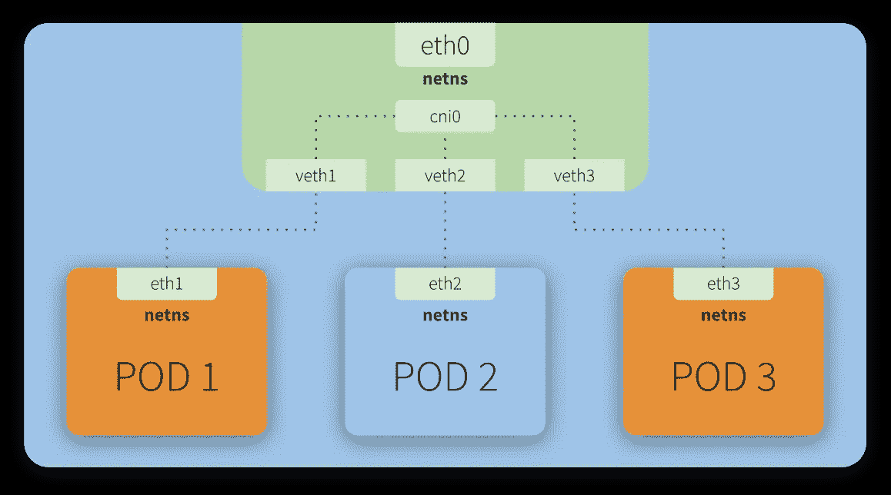
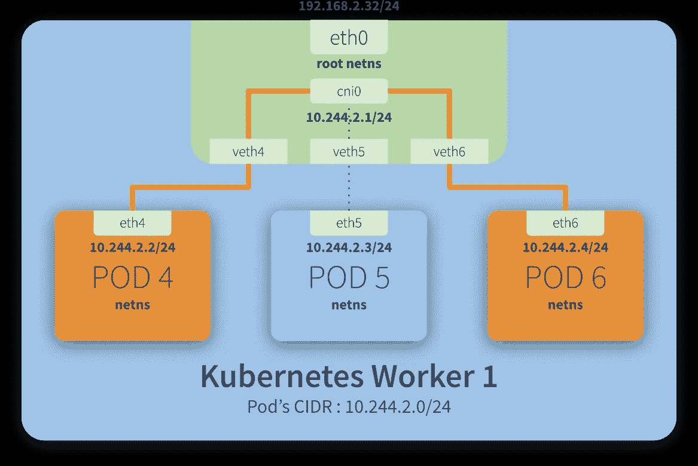
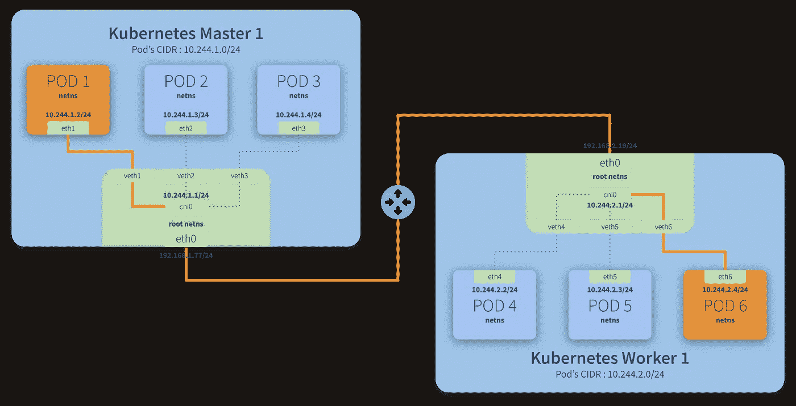
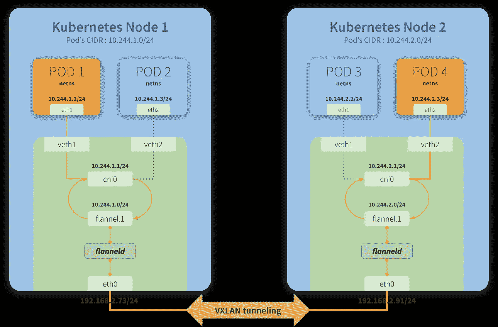

# Kubernetes 之旅——在云外奔跑——法兰绒

> 原文：<https://itnext.io/kubernetes-journey-up-and-running-out-of-the-cloud-flannel-c01283308f0e?source=collection_archive---------4----------------------->


艾莉娜·格鲁布尼亚克在 [Unsplash](https://unsplash.com/search/photos/network?utm_source=unsplash&utm_medium=referral&utm_content=creditCopyText) 上的照片

在本文中，我们将介绍一些关于**法兰绒**的细节，以及它在 **Kubernetes 网络**中扮演的角色。我强烈建议您通过参考链接更好地理解**绒布**的工作原理。

在[上一篇文章](/kubernetes-journey-up-and-running-out-of-the-cloud-etcd-b332d1be474c)中，我们介绍了 **etcd** 并对其进行了简要概述。

这些文章是我们 [Kubernetes 之旅](https://medium.com/@mtvallim/kubernetes-journey-up-and-running-out-of-the-cloud-introduction-f04a811c92a5)的一部分。我希望您对深入研究如何从云中安装和配置 Kubernetes 感到兴奋！

如果你不想等到所有的文章都发表了，又想马上动手，可以随意克隆项目的 Github repo。它完全实用，文档也在不断改进:

[](https://github.com/mvallim/kubernetes-under-the-hood) [## 罩下的姆瓦利姆/库伯内特斯

### 本教程是有人计划安装一个 Kubernetes 集群，并希望了解一切如何配合在一起…

github.com](https://github.com/mvallim/kubernetes-under-the-hood) 

# 集群网络

> *“网络是 Kubernetes 的核心部分，但要准确理解它是如何工作的却是一个挑战。”*

> 参考:[https://kubernetes . io/docs/concepts/cluster-administration/networking/](https://kubernetes.io/docs/concepts/cluster-administration/networking/)

在我们谈论法兰绒以及它如何适合这里之前，理解集群的网络特征是很重要的。

在本节中，我们将主要关注理解 **Pod-to-Pod** 通信是如何工作的。

Kubernetes 网络模型遵循一些基本假设。官方文件称 **Kubernetes 网络模型**要求:

*   *无需使用网络地址转换(NAT ),所有 pod 都能够相互通信。*
*   *节点——运行 Kubernetes 集群的机器。这些可以是虚拟机或物理机，或者实际上是能够运行 Kubernetes 的任何东西——也能够与所有的 pod 通信，而不需要 NAT。*
*   *每个 Pod 会看到自己拥有与其他 Pod 相同的 IP。*

# Kubernetes 网络**型号**



每个 Kubernetes 节点(主节点或工作节点)都是一台 Linux 机器(VM 或裸机)，它有一个网络名称空间— **netns** —有一个网络接口作为它的主接口。这在上图中显示为 **eth0** 。

仔细观察，我们可以看到每个 Pod 也有自己的 **eth** 接口，这意味着每个 Pod 都有自己的网络配置(IP、路由等)。这也意味着每个 Pod 都有自己的 **netns** ，因此我们有一个由网络接口分隔的网络名称空间。

为了说明这一点，想象你和你的同事去拉斯维加斯参加一个会议。您的公司将赞助您参加此次会议，因此您将住在同一家酒店(Kubernetes 节点)。这家酒店的每个房间都配备了客房电话(网络接口)。

你使用客房电话与不在酒店的家人联系。没有免费的午餐，所以酒店显然会对你使用客房电话拨打的任何外线电话收费。要做到这一点，所有的外部呼叫都要通过一个中心(即 **eth0** )进行注册，然后将呼叫重定向到外部世界。客房电话和这个中心之间的链接类似于虚拟接口在网络中扮演的角色。

> *“veth 设备是虚拟以太网设备。它们可以充当网络命名空间之间的隧道，以创建到另一个命名空间中的物理网络设备的桥，但也可以用作独立的网络设备。*
> 
> *veth 设备总是成对互连。”*

> *参考:*[*http://man7.org/linux/man-pages/man4/veth.4.html*](http://man7.org/linux/man-pages/man4/veth.4.html)

例如，现在你和你的同事想让对方知道你什么时候去参加会议或吃晚饭。你想节省一些钱，所以你决定用客房电话交谈，而不是用手机。当你在酒店登记入住时，礼宾员解释说，你可以在房间之间互相打电话，只需输入 **# <房间号>** 。有一个内部中枢允许这种交流发生。这类似于 **cni0** (如上图所示)所扮演的角色，作为一个允许 Pod 到 Pod 通信的桥梁。

碰巧这家酒店有多栋建筑，而你的一些同事被安排在第二栋建筑里。尽管如此，门房解释说没有任何问题。和他们交流，你只需要在房间号前面加上楼号: **# <楼> <房号>** 。内部中心( **cni** )将注意到该地址不在它自己的大楼内部，将呼叫重定向到中心( **eth0** )，中心将再次将呼叫重定向到另一个大楼(另一个 Kubernetes 节点)中心(类似于 **eth0** )，中心又将呼叫传递到它自己的内部中心，使呼叫最终与目标房间完成。有关此场景的更多技术解释，请查看下面的**跨不同主机路由流量**部分。

在 Kubernetes 上，所有这些配置和管理都是通过一个 **CNI** (容器网络接口)插件完成的。

# **什么是 CNI？**

**CNI** 是**容器网络接口**的简称，它基本上是一个外部软件(模块)，实现由规范良好定义的[接口，允许 **Kubernetes** 执行动作以提供网络功能。](https://github.com/containernetworking/cni/blob/master/SPEC.md#container-network-interface-specification)

> *"每个****CNI****插件必须实现为由容器管理系统调用的可执行文件(例如 rkt 或 Kubernetes)。*
> 
> *一个***插件负责将一个网络接口插入到容器网络名称空间(例如* ***veth*** *对的一端)并在主机上进行任何必要的更改(例如将****veth****的另一端附加到一个* ***桥*** *然后，它应该将 IP 分配给接口，并通过调用适当的 IPAM 插件来设置与 IP 地址管理部分一致的路由。”**

> *参考:[https://github . com/container networking/CNI/blob/master/spec . MD # CNI-plugin](https://github.com/containernetworking/cni/blob/master/SPEC.md#cni-plugin)*

# *Kubernetes 交通路线*

*我们将在两个场景中更详细地解释流量如何在 pod 之间路由。*

## *在同一台主机上路由流量*

**

*从**盒 4** 到**盒 6** 的逐步通信:*

1.  **包叶子****Pod 4 netns****通过****et H4****接口到达* ***根 netns*** *通过虚拟接口**vet H4**；**
2.  **包叶子****vet H4****并到达****CNI 0****，寻找****Pod 6****的地址；**
3.  **包叶子****CNI 0****并被重定向到****veth 6****；**
4.  **包叶子* ***根 netns*** *通过****veth 6****并到达****Pod 6*****根 netns*** *通过*****

## ****跨不同主机路由流量****

********

****从**盒 1** 到**盒 6** 的逐步通信:****

1.  *****包叶子****Pod 1 netns****通过* ***eth1*** *接口到达* ***根 netns*** *通过虚拟接口****vet h1****；*****
2.  *****包叶子****vet h1****并到达****CNI 0****，寻找****Pod 6****的* *地址；*****
3.  *****包叶子****CNI 0****并被重定向到****eth 0****；*****
4.  *****包叶子****eth 0****从* ***主 1*** *到达* ***网关****；*****
5.  *****包叶子* ***网关*** *和到达* ***根网*** *通过****eth 0****接口上的* ***工人 1****；*****
6.  *****包叶子****eth 0****并到达****CNI 0****，寻找****Pod 6****的***地址；******
7.  ******包叶子****CNI 0****并被重定向到****veth 6****虚拟界面；******
8.  ******包叶子* ***根 netns*** *通过****veth 6****并到达****Pod 6 netns****通过****eth 6********

**********

******“法兰绒是配置专为 Kubernetes 设计的第 3 层网络结构的一种简单易行的方式。******

******绒布在每台主机上运行一个名为* ***绒布*** *的小型单二进制代理，负责从一个较大的预配置地址空间中为每台主机分配子网租约。法兰绒直接使用 Kubernetes API 或* ***etcd*** *来存储网络配置、分配的子网和任何辅助数据(如主机的公共 IP)。数据包使用几种后端机制中的一种进行转发，包括 VXLAN 和各种云集成。”******

> *****参考:[https://github.com/coreos/flannel](https://github.com/coreos/flannel)*****

# *****后端*****

> *********法兰绒*** *可以搭配几种不同的后端。* ***一旦设置，后台在运行时不应更改*** *。*******
> 
> *****[***VX LAN***](https://github.com/coreos/flannel/blob/master/Documentation/backends.md#vxlan)*是推荐选择。*[***host-GW***](https://github.com/coreos/flannel/blob/master/Documentation/backends.md#host-gw)*推荐给更有经验的用户，他们希望性能有所提高，并且他们的基础设施支持它(通常不能在云环境中使用)。*[***UDP***](https://github.com/coreos/flannel/blob/master/Documentation/backends.md#udp)*建议仅用于调试或者用于不支持****VXLAN****的非常老的内核。”******

> *****参考:[https://github . com/coreos/法兰绒/blob/master/Documentation/backends . MD](https://github.com/coreos/flannel/blob/master/Documentation/backends.md#backends)*****

*****在本文中，我们将讨论一下我们将在解决方案中使用的 **VXLAN** 模式的内部机制。*****

**********

# *****法兰绒网络空间*****

*****默认情况下，法兰绒使用 CIDR **10.244.0.0/16** 为每个节点分配带有 **10.244.X.0/24** 掩码的较小子网，而 pod 将使用分配给给给定节点的这些子网之一的 IP 地址。*****

*****简而言之，这意味着每个节点可以有多达 254 个活动 Pod，其中每个 Pod 都将拥有来自该分配子网的不同 IP。*****

*****你可以在**kube-法兰绒. yml** manifest 中看到这个规范，在 **net-conf.json** 的定义中。(官方法兰绒库在下面的链接)*****

```
***kind: ConfigMap
apiVersion: v1
metadata:
  name: kube-flannel-cfg
  namespace: kube-system
  labels:
    tier: node
    app: flannel
data:
  cni-conf.json: |
    {
      "name": "cbr0",
      "plugins": [
        {
          "type": "flannel",
          "delegate": {
            "hairpinMode": true,
            "isDefaultGateway": true
          }
        },
        {
          "type": "portmap",
          "capabilities": {
            "portMappings": true
          }
        }
      ]
    }
  **net-conf.json**: |
    {
      "Network": "**10.244.0.0/16**",
      "Backend": {
        "Type": "**vxlan**"
      }
    }***
```

*****[](https://github.com/coreos/flannel/blob/master/Documentation/kube-flannel.yml) [## coreos/法兰绒

### 法兰绒是一种用于容器的网状织物，专为 Kubernetes-coreos/法兰绒设计

github.com](https://github.com/coreos/flannel/blob/master/Documentation/kube-flannel.yml)***** 

# *****虚拟以太网设备— veth*****

> ******“veth 设备是虚拟以太网设备。它们可以充当网络命名空间之间的隧道，以创建到另一个命名空间中的物理网络设备的桥，但也可以用作独立的网络设备。”******

> ******参考:*[*http://man7.org/linux/man-pages/man4/veth.4.html*](http://man7.org/linux/man-pages/man4/veth.4.html)*****

# *****桥梁— cni0*****

*******cni0** 是一个 Linux 网桥设备，所有 **veth** 设备都将连接到这个网桥，因此同一个节点上的所有 pod 都可以相互通信，如 **Kubernetes 网络模型**和上面的酒店类比中所述。*****

# *****VXLAN 设备—法兰绒。*****

> *********虚拟可扩展局域网****(****VXLAN****)是一种* [*网络虚拟化*](https://en.wikipedia.org/wiki/Network_virtualization) *技术，试图解决*[](https://en.wikipedia.org/wiki/Scalability)**与大型* [*云计算*](https://en.wikipedia.org/wiki/Cloud_computing) *部署相关的问题。它采用了一种*[*【VLAN】*](https://en.wikipedia.org/wiki/VLAN)[*OSI*](https://en.wikipedia.org/wiki/OSI_model)*[*第二层*](https://en.wikipedia.org/wiki/Layer_2) [*以太帧*](https://en.wikipedia.org/wiki/Ethernet_frame)[*第四层*](https://en.wikipedia.org/wiki/Layer_4)*[内*的封装技术终止 VXLAN 隧道的 VXLAN 端点，可以是虚拟或物理的*](https://en.wikipedia.org/wiki/User_Datagram_Protocol) [*交换机端口*](https://en.wikipedia.org/wiki/Switch_port) *，称为* ***VXLAN 隧道端点****(****VTEPs****)。”**********

> *****参考:[https://en.wikipedia.org/wiki/Virtual_Extensible_LAN](https://en.wikipedia.org/wiki/Virtual_Extensible_LAN)*****

*****此接口的主要功能(在我们的图中为法兰绒 1)是通过第 2 层的覆盖来保证 Pod 与其网络之间通信的前提之一(记住，每个节点都有一个子网，每个 Pod 都有该子网的 IP)。*****

*****使用 VXLAN，可以连接两个或多个网络，就像它们连接在同一个网络中一样，也就是说，每个网络都是自己网络的一部分，但都在同一个域中。*****

*****在之前使用的类比中，VXLAN 将是连接一个建筑到另一个建筑的(物理)电话线，允许您所在建筑(节点 1)的一个房间(Pod 1)与您的一些同事所在的另一个建筑(节点 2)的房间(Pod 4)进行通信。*****

# *****法兰绒*****

*****flanneld 是一个守护进程，负责保持节点(及其包含的 pod)之间的路由是最新的。*****

*****在我们上面的类比中，这就像是每次有新房间可用时(例如，如果酒店建造了一个有房间的新建筑)或当房间变得不可用时(例如，如果它们正在维修)，酒店的一名员工负责更新中心。*****

******感谢* [*Ivam Luz*](https://medium.com/@ivam.santos) *，杰出的价值生成器。******

*****我希望您喜欢这篇文章以及本系列中的其他文章。在下一篇文章中，我们将(**最终**，我知道:) )动手开始在云中设置我们的 Kubernetes 集群！。*****

*****不要忘记在下面的评论中留下你的反馈。不断完善这一系列的内容非常重要。*****

*****我再次强烈推荐您关注我的 Medium，这样您就不会错过本系列中发表的任何新文章。如果你错过了本系列的第一篇文章，你可以在这里查看。*****

*****回头见！！*****

*****再见*****