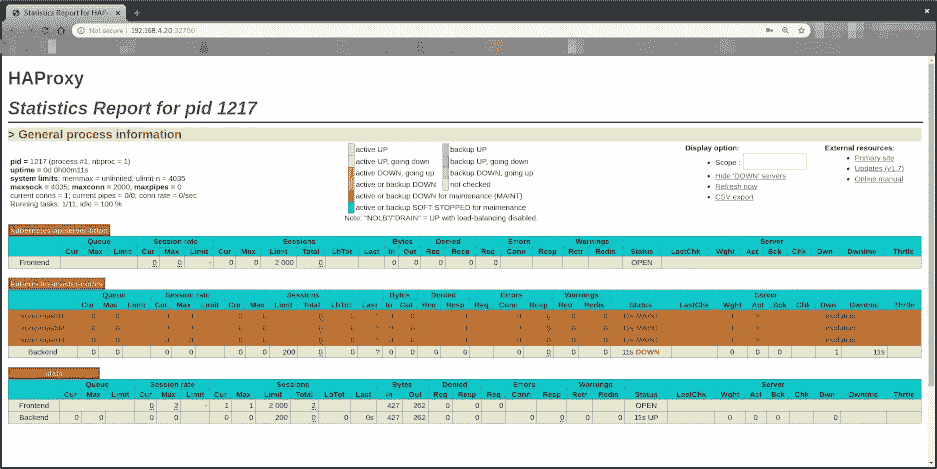

# Kubernetes 之旅—启动并运行云—如何设置具有高可用性的 HAProxy 集群

> 原文：<https://itnext.io/kubernetes-journey-up-and-running-out-of-the-cloud-how-to-setup-the-haproxy-cluster-with-high-ee5eb9a7f2e1?source=collection_archive---------1----------------------->


Denys Nevozhai 在 [Unsplash](https://unsplash.com/search/photos/high-avaibility?utm_source=unsplash&utm_medium=referral&utm_content=creditCopyText) 上拍摄的照片

你好。我们终于回到了我们的 **Kubernetes 之旅——从云中跑出来**。现在，我们终于开始着手进行一些实际的编码和配置，我希望保持良好的速度，发布下一篇文章来完成这一旅程。

在最后一篇文章的[中，我们已经开始执行将构成我们的解决方案的组件的实际配置。我们已经配置了我们的**网关**实例以及一个 **BusyBox** 实例，这将允许我们连接到组成我们的解决方案的所有实例，这些实例驻留在与我们的主机不同的网络中。](/kubernetes-journey-up-and-running-out-of-the-cloud-starting-the-actual-setup-737c0f3e0fb1)

在本文中，我们将深入探讨如何借助 **Corosync** 和 **Pacemaker** 为 **kube-apiserver** 配置具有高可用性的 **HAProxy 集群**。在我们的[技术堆栈文章](/kubernetes-journey-up-and-running-out-of-the-cloud-technology-stack-9c472aafac4e)中，我们已经谈论了很多关于这些组件的内容。请参考它刷新。

说够了。让我们玩得开心！

本节展示了如何设置由浮动 IP 和[**Corosync**](https://clusterlabs.org/corosync.html)/[**定拍器**](https://clusterlabs.org/pacemaker/) 集群堆栈支持的高可用性 **HAProxy 负载平衡器**。

浮动 IP 也称为“共享”或“虚拟”IP 地址。浮动 IP 是分配给最终可能出现故障的节点的正常 IP 地址。对于故障转移，具有相似特征(被动)的节点与主(主动)节点一起以主动/被动模式运行。如果发生故障，这个浮动 IP 将自动透明地分配给被动节点，使其成为主动节点，避免停机。

每个 **HAProxy** 负载平衡器将被配置为在 **kube-apiserver** 之间分割流量。如果主负载均衡器关闭，**浮动 IP** 将自动移动到第二个负载均衡器，允许它继续服务而不停机。


如果你不想等到所有的文章都发表了，又想马上动手，可以随意克隆项目的 Github repo。它完全实用，文档也在不断改进。

[](https://github.com/mvallim/kubernetes-under-the-hood) [## 罩下的姆瓦利姆/库伯内特斯

### 它甚至还包括一张幻灯片，解释了它吸引目标受众的原因…

github.com](https://github.com/mvallim/kubernetes-under-the-hood) 

# HAProxy

*“ha proxy 是一个免费的、非常快速和可靠的解决方案，为基于 TCP 和 HTTP 的应用程序提供高可用性、负载平衡和代理。它特别适用于高流量的网站，并为世界上许多访问量最大的网站提供支持。多年来，它已经成为事实上的标准开源负载平衡器，现在与大多数主流 Linux 发行版一起提供，并且通常默认部署在云平台中。因为它不做广告，我们只知道它在管理员报告时被使用:-)"*

> 参考:[http://www.haproxy.org/](http://www.haproxy.org/)
> *完整解释在我们的* [*技术栈*](/kubernetes-journey-up-and-running-out-of-the-cloud-technology-stack-9c472aafac4e) *中。*

# 科罗 sync

Corosync 集群引擎是一个组通信系统，具有在应用程序中实现高可用性的附加功能。该项目提供了四个 C 应用程序编程接口特性:

*   用于创建复制状态机的具有扩展虚拟同步保证的封闭进程组通信模型。
*   一个简单的可用性管理器，它在应用程序失败时重新启动应用程序进程。
*   一个配置和统计内存数据库，提供设置、检索和接收信息更改通知的能力。
*   当达到或失去仲裁时通知应用程序的仲裁系统。

> *完整解释在我们的* [*技术栈*](/kubernetes-journey-up-and-running-out-of-the-cloud-technology-stack-9c472aafac4e) *中。*

# 起搏器

Pacemaker 是一个高级的、可伸缩的高可用性集群资源管理器。

它支持“N 节点”集群，具有管理资源和依赖关系的强大功能。

它将在初始化时、机器启动或关闭时、相关资源出现故障时运行脚本，并且可以配置为定期检查资源健康状况。

> *完整解释在我们的* [*技术栈*](/kubernetes-journey-up-and-running-out-of-the-cloud-technology-stack-9c472aafac4e) *中。*

## 资源代理

资源代理是允许 Pacemaker 管理它一无所知的服务的抽象。它们包含当集群希望启动、停止或检查服务的健康状况时该做什么的逻辑。

`**ocf:heartbeat:IPaddr2**`

这个特定于 Linux 的资源管理 IP 别名 IP 地址。它可以添加或删除一个 IP 别名。此外，如果作为克隆资源调用，它还可以实现群集别名 IP 功能。

> *更多信息*[*http://linux-ha.org/doc/man-pages/re-ra-IPaddr2.html*](http://linux-ha.org/doc/man-pages/re-ra-IPaddr2.html)

`**ocf:heartbeat:haproxy**`

在高可用性设置中将 haproxy 守护程序作为 OCF 资源进行管理。

> *更多信息*[*https://raw . githubusercontent . com/russki/cluster-agents/master/ha proxy*](https://raw.githubusercontent.com/russki/cluster-agents/master/haproxy)

# 创建虚拟机

```
~/kubernetes-under-the-hood$ for instance in hapx-node01 hapx-node02; do \
./create-image.sh \
   -k ~/.ssh/id_rsa.pub \
   -u hapx/user-data \
   -n hapx/network-config \
   -i hapx/post-config-interfaces \
   -r hapx/post-config-resources \
   -o ${instance} \
   -l debian \
   -b debian-base-image done
```

# 因素

*   `**-k**`用于将**公钥**从您的主机复制到新创建的虚拟机。
*   `**-u**`用于指定**用户数据**文件，该文件将作为参数传递给创建我们之前提到的 cloud-init ISO 文件的命令(查看脚本的源代码以更好地理解它的用法)。默认为'**/数据/用户数据**'。
*   `**-m**`用于指定**元数据**文件，该文件将作为参数传递给创建我们之前提到的 cloud-init ISO 文件的命令(查看脚本的源代码以更好地理解它的用法)。默认为“**/数据/元数据**”。
*   `**-n**`用于传递配置文件，cloud-init 将使用该文件为实例配置**网络**。
*   `**-i**`用于传递一个配置文件，我们的脚本将使用该文件修改由 **VirtualBox** 管理的**网络接口**，该接口连接到将从该映像创建的实例。
*   `**-r**`用于传递一个配置文件，我们的脚本将使用该文件来配置由 **VirtualBox** 分配给我们实例的**数量的处理器和**数量的内存。
*   `**-o**`用于传递将分配给我们实例的**主机名**。这也将是 **VirtualBox** 用来引用我们的实例的名称。
*   `**-l**`用于通知我们要使用哪个 Linux 发行版( **debian** 或 **ubuntu** )配置文件(注意这是用来指定[数据](https://github.com/mvallim/kubernetes-under-the-hood/blob/master/data)下的哪个文件夹被引用)。默认为' **debian** '。
*   `**-b**`用于指定应该使用哪个**基础图像**。这是我们执行上一篇文章中的安装步骤时，在 **VirtualBox** 上创建的映像名称。
*   `**-s**`用于传递一个配置文件，我们的脚本将使用该文件在 **VirtualBox** 上配置**虚拟磁盘**。你会注意到这仅用于 **Gluster** 配置步骤。
*   `**-a**`我们的实例**创建后是否应该初始化**。默认为**真**。

**预期输出:**

```
Total translation table size: 0
Total rockridge attributes bytes: 417
Total directory bytes: 0
Path table size(bytes): 10
Max brk space used 0
187 extents written (0 MB)
0%...10%...20%...30%...40%...50%...60%...70%...80%...90%...100%
Machine has been successfully cloned as "hapx-node01"
Waiting for VM "hapx-node01" to power on...
VM "hapx-node01" has been successfully started.
Total translation table size: 0
Total rockridge attributes bytes: 417
Total directory bytes: 0
Path table size(bytes): 10
Max brk space used 0
187 extents written (0 MB)
0%...10%...20%...30%...40%...50%...60%...70%...80%...90%...100%
Machine has been successfully cloned as "hapx-node02"
Waiting for VM "hapx-node02" to power on...
VM "hapx-node02" has been successfully started.
```

## 配置您的本地路由

您需要在本地计算机上添加一个路由来访问 Virtualbox 内部网络。

```
sudo ip route add 192.168.4.0/27 via 192.168.4.30 dev vboxnet0

sudo ip route add 192.168.4.32/27 via 192.168.4.62 dev vboxnet0
```

## 访问 BusyBox

我们需要让 BusyBox IP 通过 ssh 访问它:

```
vboxmanage guestproperty get busybox "/VirtualBox/GuestInfo/Net/0/V4/IP"
```

预期产出:

```
Value: 192.168.4.57
```

使用返回值通过 ssh 访问虚拟机:

```
~$ ssh debian@192.168.4.57
```

预期产出:

```
Linux busybox 4.9.0-11-amd64 #1 SMP Debian 4.9.189-3+deb9u2 (2019-11-11) x86_64

The programs included with the Debian GNU/Linux system are free software;
the exact distribution terms for each program are described in the
individual files in /usr/share/doc/*/copyright.

Debian GNU/Linux comes with ABSOLUTELY NO WARRANTY, to the extent
permitted by applicable law.
```

# **访问 HAProxy 节点**

访问 BusyBox 并进入 ssh 会话后，只需按名称访问实例，在我们的例子中，我们希望访问 hapx-node01。

```
debian@busybox:~$ ssh hapx-node01
```

# 配置起搏器

在进行起搏器配置之前，有必要进行一些观察。

***1*** —让我们检查 IP 配置，使用`ip addr`:

```
debian@hapx-node01:~$ ip addr show enp0s3.41

3: enp0s3.41@enp0s3: <BROADCAST,MULTICAST,UP,LOWER_UP> mtu 1500 qdisc noqueue state UP group default qlen 1000
    link/ether 08:00:27:a4:ce:07 brd ff:ff:ff:ff:ff:ff
    inet6 fe80::a00:27ff:fea4:ce07/64 scope link
      valid_lft forever preferred_lft forever
```

如您所见，我们仍然没有在任何网络接口上配置集群的 IP ( `192.168.4.20`)。

***2*** —让我们使用`crm status`检查起搏器配置

```
debian@hapx-node01:~$ sudo crm status

Stack: corosync
Current DC: hapx-node02 (version 1.1.16-94ff4df) - partition with quorum
Last updated: Sun Feb  2 19:53:25 2020
Last change: Sun Feb  2 19:51:43 2020 by hacluster via crmd on hapx-node02

2 nodes configured
0 resources configured

Online: [ hapx-node01 hapx-node02 ]

No resources
```

这里我们注意到我们只有两个活动的和已配置的节点(`hapx-node01`和`hapx-node02`)，但是没有资源来组成我们的集群(`virtual-ip-resource`和`haproxy-resource`)。

***3*** —让我们使用`crm configure`配置起搏器上的资源

这里我们将虚拟 IP 定义为`192.168.4.20`。这将是我们的 K8S 群集(控制平面端点)的 IP 地址。

此时，我们将使用 [crmsh](https://crmsh.github.io/) 工具配置我们的 **HAProxy 集群**的特性。crmsh 是 Pacemaker 高可用性堆栈的集群管理外壳。

以下步骤可以在任何节点上运行，因为现在 Corosync 应该保持集群配置同步。

> **注**:下面每一行代表一个命令，应该在命令行单独输入。

```
debian@hapx-node01:~$ cat <<EOF | sudo crm configure
property stonith-enabled=no
property no-quorum-policy=ignore
property default-resource-stickiness=100
primitive virtual-ip-resource ocf:heartbeat:IPaddr2 params ip="192.168.4.20" broadcast=192.168.4.31 nic=enp0s3.41 cidr_netmask=27 meta migration-threshold=2 op monitor interval=20 timeout=60 on-fail=restart
primitive haproxy-resource ocf:heartbeat:haproxy op monitor interval=20 timeout=60 on-fail=restart
colocation loc inf: virtual-ip-resource haproxy-resource
order ord inf: virtual-ip-resource haproxy-resource
commit
bye
EOF
```

***4*** —让我们使用`ip addr`再次检查我们的 IP 配置:

```
debian@hapx-node01:~$ ip addr show enp0s3.413: enp0s3.41@enp0s3: <BROADCAST,MULTICAST,UP,LOWER_UP> mtu 1500 qdisc noqueue state UP group default qlen 1000
    link/ether 08:00:27:a4:ce:07 brd ff:ff:ff:ff:ff:ff
    inet 192.168.4.20/27 brd 192.168.4.31 scope global enp0s3.41
      valid_lft forever preferred_lft forever
    inet6 fe80::a00:27ff:fea4:ce07/64 scope link
      valid_lft forever preferred_lft forever
```

瞧啊。现在，我们的集群的 IP 已经在`enp0s3.41`界面中正确配置和管理了。

***5*** —让我们使用`crm status`从我们的集群中获得更多信息:

```
debian@hapx-node01:~$ sudo crm statusStack: corosync
Current DC: hapx-node01 (version 1.1.16-94ff4df) - partition with quorum
Last updated: Sun Feb  2 19:19:16 2020
Last change: Sun Feb  2 19:04:37 2020 by root via cibadmin on hapx-node012 nodes configured
2 resources configuredOnline: [ hapx-node01 hapx-node02 ]Full list of resources:virtual-ip-resource    (ocf::heartbeat:IPaddr2):       Started hapx-node01
haproxy-resource       (ocf::heartbeat:haproxy):       Started hapx-node01
```

在这里，我们可以看到节点和资源都处于活动状态并已配置好。

仔细观察，我们可以看到`hapx-node01`节点就是分配了这两个资源(`virtual-ip-resource`和`haproxy-resource`)的节点。这非常合理，因为我们将这些资源配置为总是在同一个节点上分配。

**起搏器参数解释(TL；博士):**

*   `property stonith-enabled=no`

`STONITH`具有保护您的数据免受损坏和应用程序因多个节点同时无意访问而不可用的功能。例如，仅仅因为一个节点没有响应，并不意味着它已经停止访问其数据。100%确保您的数据安全的唯一方法是，在允许另一个节点访问数据之前，确保该节点确实处于离线状态。
`STONITH`也在服务无法停止的情况下发挥作用。在这种情况下，集群使用`STONITH`强制节点离线，从而可以安全地在其他地方启动服务。

`STONITH`是“射中对方头部”的缩写，是最流行的数据保护机制。
为确保您数据的完整性，默认情况下会激活`STONITH`。
在我们的例子中，由于我们既不访问数据库也不访问文件等数据，保持`STONITH`活动没有意义。为此，我们将其设置为`stonith-enabled=no`

*   `property no-quorum-policy=ignore`

`no-quorum-policy`参数决定了当没有足够的节点组成集群时集群的行为。为了避免出现[裂脑](https://en.wikipedia.org/wiki/Split-brain_(computing))情况，集群将仅在达到法定人数时才做出响应。举例来说，假设一个集群有五个节点，由于网络故障，创建了两个独立的组:一个组有三个节点，另一个组有两个节点。在这种情况下，只有具有三个节点的组能够获得多数票。因此，只有包含三个节点的组才能利用群集资源。这种配置非常重要，因为如果只有两个节点的组也能够使用它们，就会有资源损坏的风险。`no-quorum-policy`参数的默认值是`stop`。

在我们的示例中，我们只有两个节点。因此，如果其中一个由于任何原因离线，我们的整个集群将由于缺少法定人数(> 50%)而停止运行。为了避免这种情况，我们将策略配置为`ignore`，不需要做任何其他事情。在生产场景中，最好至少有 3 个节点，以确保更高的可用性。

*   `property default-resource-stickiness=100`

`default-resource-stickiness`决定了集群资源将被分配到哪里。默认行为是将资源放回它们被分配到的原始节点。这意味着，出现故障后，资源将被分配到集群中的另一个节点，当原始节点恢复正常状态时，资源将被移回该节点。这并不理想，因为用户将两次面临不一致的场景。为了避免这种情况，您可以为`default-resource-stickiness`参数设置一个权重(在-1.000.000 和 1.000.000 之间):`0`意味着资源将被移回其原始节点；正值表示资源应该保留在原来的位置。

在我们的例子中，我们任意将其设置为`100`。

*   `primitive virtual-ip-resource ocf:heartbeat:IPaddr2 params ip="192.168.4.20" broadcast=192.168.4.31 nic=enp0s3.41 cidr_netmask=27 meta migration-threshold=2 op monitor interval=20 timeout=60 on-fail=restart`

`primitive` -表示应该作为单个实例存在于整个集群中的资源。例如，一个 IP 可以被配置为一个原始资源，并且在任何给定的时间集群中应该只有一个该资源的实例。

`virtual-ip-resource` -我们给我们的资源起的一个独特的名字。

`ocf:heartbeat:IPaddr2`-OCF 集群资源代理。

`meta migration-threshold` -创建资源时，您可以将其配置为在给定数量的故障发生后移动到不同的节点。该参数用于此目的。达到限制后，当前节点将无法拥有资源，直到发生以下情况之一

管理员重置资源的`failcount`值。
○达到资源的`failure-timeout`值。
○默认`migration-threshold`为`INFINITY`。在内部，这被定义为一个非常高但有限的值。将此项设置为 0 将禁用给定资源的阈值行为。

*   `params` -资源代理的参数:

`ip`-IP v4 地址以四点符号配置，例如“192.168.1.1”。(必需，字符串，无默认值)

`nic`-IP 地址将在其上联机的基本网络接口。如果留空，脚本将尝试从路由表中确定这一点。不要在此处以`eth0:1`或任何形式指定别名接口；相反，请仅指定基接口。前提条件:必须至少有一个静态 IP 地址分配给网络接口，该地址不由群集管理。如果您不能在接口上分配任何静态 IP 地址，请修改这个内核参数:`sysctl -w net.ipv4.conf.all.promote_secondaries=1`(或每设备)。(可选，字符串，默认 eth0)

`cidr_netmask`-CIDR 格式接口的网络掩码(例如 24 而不是 255.255.255.0)。如果未指定，脚本也将尝试从路由表中确定这一点。(可选，字符串，无默认值)

`broadcast` -与 IP 相关的广播地址。如果留空，脚本将根据网络掩码来确定。(可选，字符串，无默认值)

*   `op` -配置监控操作:

`monitor` -要执行的动作。常用值:`monitor`、`start`、`stop`

`interval` -如果设置为非零值，则创建一个循环操作，以该频率(秒)重复。非零值只有在动作名称设置为 monitor 时才有意义。资源启动完成后，将立即执行重复的监视操作，后续的监视操作将被安排在前一个监视操作完成时开始。例如，如果在 01:00:00 执行带有`interval=20s`的监控动作，下一个监控动作不会在 01:00:20 发生，而是在第一个监控动作完成后 20 秒发生。

如果设置为零(默认值)，则此参数允许您提供用于集群创建的操作的值。例如，如果间隔设置为零，操作的名称设置为 start，超时值设置为 40，那么 Pacemaker 在启动该资源时将使用 40 秒的超时。具有零间隔的监视操作允许您设置探头的超时/失败/启用值，Pacemaker 在启动时获取所有资源的当前状态，而不需要默认值。

`timeout` -如果操作没有在该参数设定的时间内完成，则操作被中止并视为失败。如果使用 pcs 资源操作默认值命令设置，默认值为超时值；如果未设置，默认值为 20 秒。如果您发现系统中包含的资源需要的时间超过了系统允许的执行时间(如启动、停止或监视)，请调查原因，如果预计执行时间会很长，您可以增加该值。

超时值不是任何类型的延迟，如果操作在超时期限结束前返回，群集也不会等待整个超时期限。

`on-fail` -此操作失败时要采取的操作。

允许的值:
○ `ignore` -假设资源没有失败。
○ `block` -不要对资源执行任何进一步的操作。
○ `stop` -停止资源，不要在其他地方启动它。
○ `restart` -停止资源并再次启动它(可能在不同的节点上)。
○ `fence` - STONITH 资源出现故障的节点。
○ `standby` -将所有资源从资源出现故障的节点上移走。

> 参考:[http://www.linux-ha.org/doc/man-pages/re-ra-IPaddr2.html](http://www.linux-ha.org/doc/man-pages/re-ra-IPaddr2.html)
> 参考:[https://access . red hat . com/documentation/en-us/red _ hat _ enterprise _ Linux/7/html/high _ avail ability _ add-on _ Reference/S1-resource operate-Haar](https://access.redhat.com/documentation/en-us/red_hat_enterprise_linux/7/html/high_availability_add-on_reference/s1-resourceoperate-haar)

*   `primitive haproxy-resource ocf:heartbeat:haproxy op monitor interval=20 timeout=60 on-fail=restart` 解释同上。
*   `colocation loc inf: virtual-ip-resource haproxy-resource`

`colocation`限制允许您告诉集群资源如何相互依赖。它有一个重要的副作用:它会影响资源分配给节点的顺序。

仔细想想:集群不能将`A`和`B`共存，除非它知道`B`在哪里。因此，在设置`colocation`限制时，考虑`A`是否需要与`B`同地办公或者`B`是否需要与`A`同地办公是非常重要的。

在我们的情况下，由于`haproxy-resource`应该与`virtual-ip-resource`位于同一位置，因此`haproxy-resource`将被分配到与`virtual-ip-resource`相同的节点上。

*   `order ord inf: virtual-ip-resource haproxy-resource`

`order`约束告诉集群资源的分配顺序。在这种情况下，我们通知`virtual-ip-resource`应该总是在`haproxy-resource`之前分配。
排序约束只影响资源的创建顺序。它们不会导致资源位于同一节点上。

## 理解用户数据文件(TL；灾难恢复)

云初始化 **HAProxy** 配置文件可以在这里找到。这为 **Kube 主节点**建立了负载平衡。

下面您可以找到相同的文件注释，以便于理解:

# 查看 HAProxy 统计页面

现在一切都设置好了，您可以通过我们刚刚配置的**虚拟 IP** 访问 HAProxy 统计数据。

在[打开浏览器，http://192.168.4.20:32700](http://192.168.4.20:32700/)

*用户:* `*admin*` *密码:* `*admin*`

它将显示:



请注意所有控制平面端点均为 ***向下***

*   kube-mast01:6443
*   kube-mast02:6443
*   kube-mast03:6443

一旦我们设置了 Kubernetes 主节点，这个问题就会解决。

# 测试高可用性

关闭两个虚拟机中的一个(`hapx-node01`或`hapx-node02`)，并在打开 **HAProxy** 统计的浏览器中按`F5`。不应注意到任何差异或错误。:)

# **结论**

在本文中，我们深入探讨了配置一个由 **Corosync** 和 **Pacemaker** 支持的具有高可用性的 **HAProxy 集群**。我们单独配置了每个组件，还配置了一个弹性 IP，允许 **HAProxy 集群**在其任何节点出现故障时透明地进行故障转移。

我希望您在配置集群的过程中获得了乐趣，并学到了一些有用的东西。

在下一篇文章中，我们将看到如何配置具有高可用性的 **Kubernetes 主**实例。敬请期待！

如果你认为这是有帮助的，请留下你的👏以及下面的反馈。不断完善这个系列的内容非常重要。

我再次强烈推荐您关注我的 Medium，这样您就不会错过本系列中发表的任何新文章。如果你错过了本系列的第一篇文章，你可以在这里查看。

回头见！！

再见。