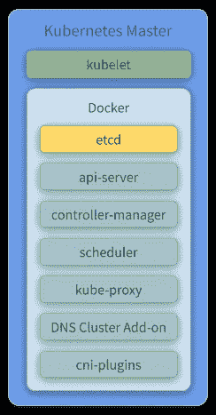
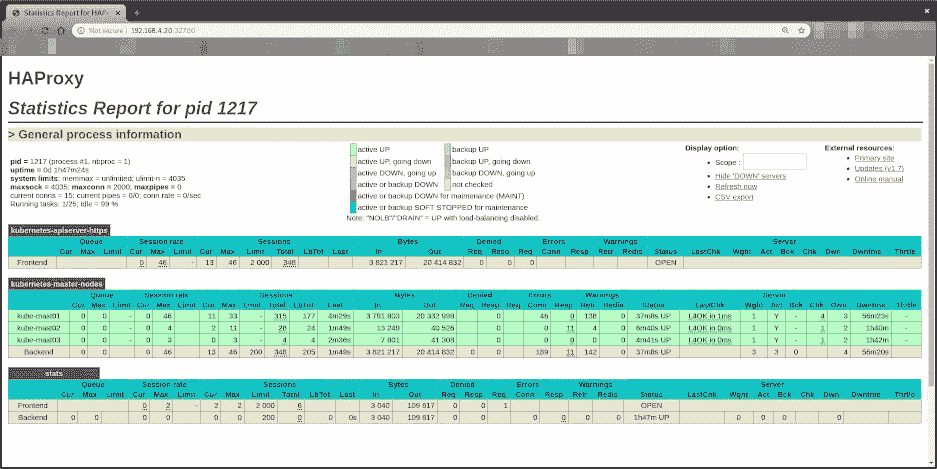

# Kubernetes 之旅——启动并运行云计算——如何使用 kubeadm bootstrap 设置主机

> 原文：<https://itnext.io/kubernetes-journey-up-and-running-out-of-the-cloud-how-to-setup-the-masters-using-kubeadm-9a496a14fbc1?source=collection_archive---------2----------------------->


在 [Unsplash](https://unsplash.com/s/photos/conductor-music?utm_source=unsplash&utm_medium=referral&utm_content=creditCopyText) 上[Manuel n Geli](https://unsplash.com/@gwundrig?utm_source=unsplash&utm_medium=referral&utm_content=creditCopyText)拍摄的照片

你好。我们回到了我们的 Kubernetes 之旅——启动并运行云。在前两篇文章中，我们已经经历了配置我们的**网关和 Busybox** 组件([链接](/kubernetes-journey-up-and-running-out-of-the-cloud-starting-the-actual-setup-737c0f3e0fb1))以及 **HA 代理集群** ( [链接](/kubernetes-journey-up-and-running-out-of-the-cloud-how-to-setup-the-haproxy-cluster-with-high-ee5eb9a7f2e1))的过程。

在本文中，我们将深入探讨配置具有高可用性的 **Kubernetes 主**实例的过程。为此，我们将看到如何利用 **kubeadm** bootstrap 来设置和加入 **3 个主实例**作为我们集群的成员。

在本文的最后，我们还将看到如何检查集群的状态。

让我们找点乐子！

如果你不想等到所有的文章都发表了，又想马上动手，可以随意克隆项目的 Github repo。它完全实用，文档也在不断改进。

[](https://github.com/mvallim/kubernetes-under-the-hood) [## 罩下的姆瓦利姆/库伯内特斯

### 它甚至还包括一张幻灯片，解释了它吸引目标受众的原因…

github.com](https://github.com/mvallim/kubernetes-under-the-hood) 

# Kubernestes 主组件



堆叠控制平面和 etcd 节点

*   `**Kubelet**` — Kubelet 从 API 服务器获取 pod 的配置，并确保所描述的容器已启动并正在运行。
*   `**Docker**` —负责下载图像和启动容器。
*   `**etcd**` —可靠地存储 Kubernetes 集群的配置数据，表示任意给定时间点的集群状态(集群中存在哪些节点，应该运行哪些 pod，它们运行在哪些节点上，等等)。
    要了解更多信息，请查看我们之前关于 [etcd](/kubernetes-journey-up-and-running-out-of-the-cloud-etcd-b332d1be474c) 的文章。
*   `**API Server**` —验证和配置 API 对象的数据，包括 pod、服务、复制控制器等。API 服务器服务 REST 操作，并提供集群共享状态的前端，所有其他组件通过它进行交互。
*   `**Controller Manager**` —通过 API 服务器监视功能监视集群的状态，并在收到通知时对集群进行必要的更改，尝试将当前状态移向所需状态。
*   `**Scheduler**` —监视未调度的 pod，并根据所请求资源的可用性、服务质量要求、相似性和反相似性规范以及其他约束，通过绑定 pod 子资源 API 将它们绑定到节点。一旦为 pod 分配了一个节点，就会触发 Kubelet 的常规行为，并创建 pod 及其容器。
*   `**Kube Proxy**` —在单个工作节点上充当服务的网络代理和负载平衡器。它负责 TCP 和 UDP 数据包的网络路由。
*   `**Flannel**` —为 Kubernetes 设计的第 3 层网络结构。查看我们之前关于法兰绒的[话题](https://github.com/mvallim/kubernetes-under-the-hood/blob/improve-docs/documentation/kube-flannel.md)了解更多信息。
*   `**CoreDNS**`**—Kubernetes 集群的 DNS 服务器。有关更多信息，请查看 [CoreDNS 官方知识库](https://github.com/coredns/coredns)。**

**在这里，像以前一样，我们利用 [create-image.sh](https://github.com/mvallim/kubernetes-under-the-hood/blob/master/create-image.sh) 脚本来创建将托管我们的主实例的虚拟箱虚拟机。**

# **说够了。给我看看代码！**

## **创建虚拟机**

```
~/kubernetes-under-the-hood$ for instance in kube-mast01 kube-mast02 kube-mast03; do \
./create-image.sh \
   -k ~/.ssh/id_rsa.pub \
   -u kube/user-data \
   -n kube-mast/network-config \
   -i kube-mast/post-config-interfaces \
   -r kube-mast/post-config-resources \
   -o ${instance} \
   -l debian \
   -b debian-base-image done
```

****预期产出:****

```
Total translation table size: 0
Total rockridge attributes bytes: 417
Total directory bytes: 0
Path table size(bytes): 10
Max brk space used 0
186 extents written (0 MB)
0%...10%...20%...30%...40%...50%...60%...70%...80%...90%...100%
Machine has been successfully cloned as "kube-mast01"
Waiting for VM "kube-mast01" to power on...
VM "kube-mast01" has been successfully started.
Total translation table size: 0
Total rockridge attributes bytes: 417
Total directory bytes: 0
Path table size(bytes): 10
Max brk space used 0
186 extents written (0 MB)
0%...10%...20%...30%...40%...50%...60%...70%...80%...90%...100%
Machine has been successfully cloned as "kube-mast02"
Waiting for VM "kube-mast02" to power on...
VM "kube-mast02" has been successfully started.
Total translation table size: 0
Total rockridge attributes bytes: 417
Total directory bytes: 0
Path table size(bytes): 10
Max brk space used 0
186 extents written (0 MB)
0%...10%...20%...30%...40%...50%...60%...70%...80%...90%...100%
Machine has been successfully cloned as "kube-mast03"
Waiting for VM "kube-mast03" to power on...
VM "kube-mast03" has been successfully started.
```

# **因素**

*   **`**-k**`用于将**公钥**从您的主机复制到新创建的虚拟机。**
*   **`**-u**`用于指定**用户数据**文件，该文件将作为参数传递给创建我们之前提到的 cloud-init ISO 文件的命令(查看脚本的源代码以更好地理解如何使用它)。默认为'**/数据/用户数据**'。**
*   **`**-m**`用于指定**元数据**文件，该文件将作为参数传递给创建我们之前提到的 cloud-init ISO 文件的命令(查看脚本的源代码以更好地理解它的用法)。默认为'**/数据/元数据**'。**
*   **`**-n**`用于传递一个配置文件，cloud-init 将使用该文件为实例配置**网络**。**
*   **`**-i**`用于传递一个配置文件，我们的脚本将使用该文件修改由 **VirtualBox** 管理的**网络接口**，该接口附加到将从该映像创建的实例。**
*   **`**-r**`用于传递一个配置文件，我们的脚本将使用该文件来配置**数量的处理器和**数量的内存，这些内存由 **VirtualBox** 分配给我们的实例。**
*   **`**-o**`用于传递将分配给我们实例的**主机名**。这也将是 **VirtualBox** 用来引用我们的实例的名称。**
*   **`**-l**`用于通知我们要使用哪个 Linux 发行版( **debian** 或 **ubuntu** )配置文件(注意这是用来指定[数据](https://github.com/mvallim/kubernetes-under-the-hood/blob/master/data)下的哪个文件夹被引用)。默认为' **debian** '。**
*   **`**-b**`用于指定应该使用哪个**基础图像**。这是我们执行[上一篇文章](/kubernetes-journey-up-and-running-out-of-the-cloud-linux-image-c51953e50d0e)中的安装步骤时，在 **VirtualBox** 上创建的镜像名称。**
*   **`**-s**`用于传递一个配置文件，我们的脚本将使用该文件在 **VirtualBox** 上配置**虚拟磁盘**。您会注意到这仅用于 **Gluster** 配置步骤。**
*   **`**-a**`我们的实例**在创建后是否应该初始化**。默认为**真**。**

# **理解用户数据文件**

**cloud-init kube-master 配置文件可以在这里找到[。这将配置和安装 Docker 和 Kubernetes 二进制文件(kubeadm、kubectl、kublet)。](https://github.com/mvallim/kubernetes-under-the-hood/blob/improve-docs/data/debian/kube/user-data)**

**为了更好地理解，您可以在下面找到相同的文件注释:**

## **配置您的本地路由**

**您需要在本地计算机上添加一个路由来访问 Virtualbox 内部网络。**

```
sudo ip route add 192.168.4.0/27 via 192.168.4.30 dev vboxnet0sudo ip route add 192.168.4.32/27 via 192.168.4.62 dev vboxnet0
```

## **访问 BusyBox**

**我们需要获得 BusyBox(如果您还没有设置它，请查看我们的[上一篇文章以获得如何通过 ssh 访问它的方法](/kubernetes-journey-up-and-running-out-of-the-cloud-starting-the-actual-setup-737c0f3e0fb1) ) IP:**

```
vboxmanage guestproperty get busybox "/VirtualBox/GuestInfo/Net/0/V4/IP"
```

****预期产出:****

```
Value: 192.168.4.57
```

**使用返回值通过 ssh 访问虚拟机:**

```
~$ ssh debian@192.168.4.57
```

****预期产出:****

```
Linux busybox 4.9.0-11-amd64 #1 SMP Debian 4.9.189-3+deb9u2 (2019-11-11) x86_64The programs included with the Debian GNU/Linux system are free software;
the exact distribution terms for each program are described in the
individual files in /usr/share/doc/*/copyright.Debian GNU/Linux comes with ABSOLUTELY NO WARRANTY, to the extent
permitted by applicable law.
```

# **配置集群**

## **`kubeadm-config`**

**此时，我们需要用它的初始配置来设置我们的 K8S 集群。**

**需要 **SAN** 、**平面控制端点**和 **POD 子网**信息。**

*   ****控制平面端点**地址是在 **HAProxy 集群** (192.168.4.20)中定义的(查看我们之前的文章[此处](/kubernetes-journey-up-and-running-out-of-the-cloud-how-to-setup-the-haproxy-cluster-with-high-ee5eb9a7f2e1))。**
*   ****SAN 地址**将与控制平面端点相同。**
*   **吊舱的 CIDR 将是法兰绒配置推荐的范围(此处搜索`net-conf.json`)。**

**基于以上信息，我们将有一个看起来像这样的`[kubeadm-config.yml](https://github.com/mvallim/kubernetes-under-the-hood/blob/master/master/kubeadm-config.yaml)`:**

## **`kubeadm init`**

**如果您需要，kubeadm 工具是不错的选择:**

*   **一个简单的方法让你尝试 Kubernetes，可能是第一次。**
*   **现有用户自动设置集群并测试其应用程序的一种方式。**
*   **范围更大的其他生态系统和/或安装工具中的构建块。**

> ***参考:*[*https://kubernetes . io/docs/setup/production-environment/tools/kube ADM/create-cluster-kube ADM/*](https://kubernetes.io/docs/setup/production-environment/tools/kubeadm/create-cluster-kubeadm/)**

**这种方法需要较少的基础设施。 [etcd](/kubernetes-journey-up-and-running-out-of-the-cloud-etcd-b332d1be474c) 成员和控制平面节点位于同一位置。**

***1 —运行以下命令初始化主节点:***

```
debian@busybox:~$ ssh kube-mast01debian@kube-mast01:~$ curl --progress-bar [https://raw.githubusercontent.com/mvallim/kubernetes-under-the-hood/master/master/kubeadm-config.yaml](https://raw.githubusercontent.com/mvallim/kubernetes-under-the-hood/master/master/kubeadm-config.yaml) -o kubeadm-config.yamldebian@kube-mast01:~$ sudo kubeadm init --config=kubeadm-config.yaml --upload-certs
```

****预期产出:****

```
[init] Using Kubernetes version: v1.15.9
[preflight] Running pre-flight checks
[preflight] Pulling images required for setting up a Kubernetes cluster
[preflight] This might take a minute or two, depending on the speed of your internet connection
[preflight] You can also perform this action in beforehand using 'kubeadm config images pull'
[kubelet-start] Writing kubelet environment file with flags to file "/var/lib/kubelet/kubeadm-flags.env"
[kubelet-start] Writing kubelet configuration to file "/var/lib/kubelet/config.yaml"
[kubelet-start] Activating the kubelet service
[certs] Using certificateDir folder "/etc/kubernetes/pki"
[certs] Generating "ca" certificate and key
[certs] Generating "apiserver-kubelet-client" certificate and key
[certs] Generating "apiserver" certificate and key
[certs] apiserver serving cert is signed for DNS names [kube-mast01 kubernetes kubernetes.default kubernetes.default.svc kubernetes.default.svc.cluster.local] and IPs [10.96.0.1 192.168.1.82 192.168.4.20 192.168.4.20]
[certs] Generating "front-proxy-ca" certificate and key
[certs] Generating "front-proxy-client" certificate and key
[certs] Generating "etcd/ca" certificate and key
[certs] Generating "etcd/server" certificate and key
[certs] etcd/server serving cert is signed for DNS names [kube-mast01 localhost] and IPs [192.168.1.82 127.0.0.1 ::1]
[certs] Generating "apiserver-etcd-client" certificate and key
[certs] Generating "etcd/peer" certificate and key
[certs] etcd/peer serving cert is signed for DNS names [kube-mast01 localhost] and IPs [192.168.1.82 127.0.0.1 ::1]
[certs] Generating "etcd/healthcheck-client" certificate and key
[certs] Generating "sa" key and public key
[kubeconfig] Using kubeconfig folder "/etc/kubernetes"
[kubeconfig] Writing "admin.conf" kubeconfig file
[kubeconfig] Writing "kubelet.conf" kubeconfig file
[kubeconfig] Writing "controller-manager.conf" kubeconfig file
[kubeconfig] Writing "scheduler.conf" kubeconfig file
[control-plane] Using manifest folder "/etc/kubernetes/manifests"
[control-plane] Creating static Pod manifest for "kube-apiserver"
[control-plane] Creating static Pod manifest for "kube-controller-manager"
[control-plane] Creating static Pod manifest for "kube-scheduler"
[etcd] Creating static Pod manifest for local etcd in "/etc/kubernetes/manifests"
[wait-control-plane] Waiting for the kubelet to boot up the control plane as static Pods from directory "/etc/kubernetes/manifests". This can take up to 4m0s
[apiclient] All control plane components are healthy after 25.521661 seconds
[upload-config] Storing the configuration used in ConfigMap "kubeadm-config" in the "kube-system" Namespace
[kubelet] Creating a ConfigMap "kubelet-config-1.15" in namespace kube-system with the configuration for the kubelets in the cluster
[upload-certs] Storing the certificates in Secret "kubeadm-certs" in the "kube-system" Namespace
[upload-certs] Using certificate key:
039bae4efd18d7692139f1101fedc877f68c1b4f3a7aa247d4703a764cc98131
[mark-control-plane] Marking the node kube-mast01 as control-plane by adding the label "node-role.kubernetes.io/master=''"
[mark-control-plane] Marking the node kube-mast01 as control-plane by adding the taints [node-role.kubernetes.io/master:NoSchedule]
[bootstrap-token] Using token: 5e7aaq.ejvnu55qqxst7czz
[bootstrap-token] Configuring bootstrap tokens, cluster-info ConfigMap, RBAC Roles
[bootstrap-token] configured RBAC rules to allow Node Bootstrap tokens to post CSRs in order for nodes to get long term certificate credentials
[bootstrap-token] configured RBAC rules to allow the csrapprover controller automatically approve CSRs from a Node Bootstrap Token
[bootstrap-token] configured RBAC rules to allow certificate rotation for all node client certificates in the cluster
[bootstrap-token] Creating the "cluster-info" ConfigMap in the "kube-public" namespace
[addons] Applied essential addon: CoreDNS
[addons] Applied essential addon: kube-proxyYour Kubernetes control-plane has initialized successfully!To start using your cluster, you need to run the following as a regular user: mkdir -p $HOME/.kube
  sudo cp -i /etc/kubernetes/admin.conf $HOME/.kube/config
  sudo chown $(id -u):$(id -g) $HOME/.kube/configYou should now deploy a pod network to the cluster.
Run "kubectl apply -f [podnetwork].yaml" with one of the options listed at:
  [https://kubernetes.io/docs/concepts/cluster-administration/addons/](https://kubernetes.io/docs/concepts/cluster-administration/addons/)You can now join any number of the control-plane node running the following command on each as root: kubeadm join 192.168.4.20:6443 --token 5e7aaq.ejvnu55qqxst7czz \
    --discovery-token-ca-cert-hash sha256:457f6e849077f9c0a6ed8ad6517c91bfa4f48080c141dda34c3650fc3b1a99fd \
    --control-plane --certificate-key 039bae4efd18d7692139f1101fedc877f68c1b4f3a7aa247d4703a764cc98131Please note that the certificate-key gives access to cluster sensitive data, keep it secret!
As a safeguard, uploaded-certs will be deleted in two hours; If necessary, you can use
 "kubeadm init phase upload-certs --upload-certs" to reload certs afterward.Then you can join any number of worker nodes by running the following on each as root:kubeadm join 192.168.4.20:6443 --token 5e7aaq.ejvnu55qqxst7czz \
    --discovery-token-ca-cert-hash sha256:457f6e849077f9c0a6ed8ad6517c91bfa4f48080c141dda34c3650fc3b1a99fd
```

***2 —完成集群配置，查询节点和 pod 状态***

```
debian@kube-mast01:~$ mkdir -p $HOME/.kubedebian@kube-mast01:~$ sudo cp -i /etc/kubernetes/admin.conf $HOME/.kube/configdebian@kube-mast01:~$ sudo chown $(id -u):$(id -g) $HOME/.kube/configdebian@kube-mast01:~$ kubectl get nodes -o widedebian@kube-mast01:~$ kubectl get pods -o wide --all-namespaces
```

****预期产出:****

```
NAME          STATUS     ROLES    AGE   VERSION   INTERNAL-IP    EXTERNAL-IP   OS-IMAGE                       KERNEL-VERSION   CONTAINER-RUNTIME
kube-mast01   NotReady   master   53s   v1.15.6   192.168.1.72   <none>        Debian GNU/Linux 9 (stretch)NAMESPACE     NAME                                  READY   STATUS    RESTARTS   AGE   IP             NODE          NOMINATED NODE   READINESS GATES
kube-system   coredns-86c58d9df4-6gzrk              0/1     Pending   0          89s   <none>         <none>        <none>           <none>
kube-system   coredns-86c58d9df4-fxj5r              0/1     Pending   0          89s   <none>         <none>        <none>           <none>
kube-system   etcd-kube-mast01                      1/1     Running   0          46s   192.168.1.72   kube-mast01   <none>           <none>
kube-system   kube-apiserver-kube-mast01            1/1     Running   0          43s   192.168.1.72   kube-mast01   <none>           <none>
kube-system   kube-controller-manager-kube-mast01   1/1     Running   0          44s   192.168.1.72   kube-mast01   <none>           <none>
kube-system   kube-proxy-8kb86                      1/1     Running   0          89s   192.168.1.72   kube-mast01   <none>           <none>
kube-system   kube-scheduler-kube-mast01            1/1     Running   0          27s   192.168.1.72   kube-mast01   <none>           <none>
```

> ***如果您查看* `*kube-mast01*` *节点上的状态，它表示尚未就绪，而* `*coredns*` *窗格处于待定状态。这是因为，到目前为止，我们还没有在 K8S 集群中配置网络组件。记住，之前解释过，* [*法兰绒*](/kubernetes-journey-up-and-running-out-of-the-cloud-flannel-c01283308f0e) *将用于此事。***

# **加入主副本**

**现在，我们需要将其他节点加入 K8S 集群。为此，我们需要在前面的步骤中生成的证书。**

## **打印证书密钥**

1.  **运行以下命令将证书复制到主副本:**

```
debian@kube-mast01:~$ sudo kubeadm init phase upload-certs --upload-certs
```

**预期产出:**

```
I0126 20:48:17.259139 5983 version.go:248] remote version is much newer: v1.17.2; falling back to: stable-1.15 [upload-certs] Storing the certificates in Secret "kubeadm-certs" in the "kube-system" Namespace [upload-certs] Using certificate key: f385dc122fcaefb52a2c9c748b399b502026ac1c8134cb9b9aa79144d004d95c
```

**现在我们将使用证书密钥`f385dc122fcaefb52a2c9c748b399b502026ac1c8134cb9b9aa79144d004d95c`**

## **打印`Join`命令**

1.  **运行以下命令来打印`join`命令。这将用于将其他主副本加入群集:**

```
debian@kube-mast01:~$ sudo kubeadm token create --print-join-command
```

**预期产出:**

```
kubeadm join 192.168.4.20:6443 --token uziz9q.5n9r0rbempgyupvg --discovery-token-ca-cert-hash sha256:457f6e849077f9c0a6ed8ad6517c91bfa4f48080c141dda34c3650fc3b1a99fd
```

> **output 命令将命令打印到您加入集群上的节点。您将使用此命令加入集群中的其他主服务器**

## **加入第二个 Kube 大师**

1.  **运行以下命令，使用上一节中打印的 join 命令加入集群中的第二个主副本:**

```
debian@busybox:~$ ssh kube-mast02debian@kube-mast02:~$ sudo kubeadm join 192.168.4.20:6443 \
  --token uziz9q.5n9r0rbempgyupvg \
  --discovery-token-ca-cert-hash sha256:457f6e849077f9c0a6ed8ad6517c91bfa4f48080c141dda34c3650fc3b1a99fd \
  --certificate-key f385dc122fcaefb52a2c9c748b399b502026ac1c8134cb9b9aa79144d004d95c \
  --control-plane
```

## **加入第三库贝大师**

1.  **运行以下命令，使用上一节中打印的 join 命令将第三个主副本加入集群:**

```
debian@busybox:~$ ssh kube-mast03debian@kube-mast02:~$ sudo kubeadm join 192.168.4.20:6443 \
  --token uziz9q.5n9r0rbempgyupvg \
  --discovery-token-ca-cert-hash sha256:457f6e849077f9c0a6ed8ad6517c91bfa4f48080c141dda34c3650fc3b1a99fd \
  --certificate-key f385dc122fcaefb52a2c9c748b399b502026ac1c8134cb9b9aa79144d004d95c \
  --control-plane
```

# **检查 etcd 状态**

1.  **查询 etcd 状态**

**此时，当我们初始化`master-node`时，我们将通过`etcdctl` cli 使用`etcd`映像(如果您还没有创建它们，请查看我们的[上一篇文章](/kubernetes-journey-up-and-running-out-of-the-cloud-etcd-b332d1be474c))。**

**命令**

*   **`**cluster-health**`检查 etcd 集群的健康状况**
*   **`**member**`成员`**add**`、`**remove**`和`**list**`子命令**

1.  **本地选项
    `**--endpoints**`群集中以逗号分隔的机器地址列表(默认:“127.0.0.1:4001，127 . 0 . 0 . 1:2379”)
    `**--cert-file**`使用 SSL 证书文件识别 HTTPS 客户端
    `**--key-file**`使用 SSL 密钥文件识别 HTTPS 客户端
    `**--ca-file**`使用 CA 捆绑包验证支持 HTTPS 的服务器的证书**

> **有关`etcdctl`参数的更多详情，请参见:http://manpages.org/etcdctl**

```
debian@busybox:~$ ssh kube-mast01debian@kube-mast01:~$ sudo docker run - rm -it \
  --net host \
  -v /etc/kubernetes:/etc/kubernetes quay.io/coreos/etcd:v3.2.24 etcdctl \
  --cert-file /etc/kubernetes/pki/etcd/peer.crt \
  --key-file /etc/kubernetes/pki/etcd/peer.key \
  --ca-file /etc/kubernetes/pki/etcd/ca.crt \
  --endpoints [https://127.0.0.1:2379](https://127.0.0.1:2379) cluster-healthdebian@kube-mast01:~$ sudo docker run - rm -it \
  --net host \
  -v /etc/kubernetes:/etc/kubernetes quay.io/coreos/etcd:v3.2.24 etcdctl \
  --cert-file /etc/kubernetes/pki/etcd/peer.crt \
  --key-file /etc/kubernetes/pki/etcd/peer.key \
  --ca-file /etc/kubernetes/pki/etcd/ca.crt \
  --endpoints [https://127.0.0.1:2379](https://127.0.0.1:2379) member list
```

**预期产出:**

```
member 5c81b5ea448e2eb is healthy: got healthy result from [https://192.168.1.72:2379](https://192.168.1.72:2379)
member 1d7ec3729980eebe is healthy: got healthy result from [https://192.168.1.68:2379](https://192.168.1.68:2379)
member ea93a1a33cffaceb is healthy: got healthy result from [https://192.168.1.81:2379](https://192.168.1.81:2379)
```

```
5c81b5ea448e2eb: name=kube-mast01 peerURLs=[https://192.168.1.72:2380](https://192.168.1.72:2380) clientURLs=[https://192.168.1.72:2379](https://192.168.1.72:2379) isLeader=false
1d7ec3729980eebe: name=kube-mast02 peerURLs=[https://192.168.1.68:2380](https://192.168.1.68:2380) clientURLs=[https://192.168.1.68:2379](https://192.168.1.68:2379) isLeader=true
ea93a1a33cffaceb: name=kube-mast03 peerURLs=[https://192.168.1.81:2380](https://192.168.1.81:2380) clientURLs=[https://192.168.1.81:2379](https://192.168.1.81:2379)
```

# **检查 K8S 集群统计信息**

1.  **查询节点和窗格的状态**

```
debian@busybox:~$ ssh kube-mast01debian@kube-mast01:~$ kubectl get nodes -o widedebian@kube-mast01:~$ kubectl get pods -o wide --all-namespaces
```

**预期产出:**

```
NAME STATUS ROLES AGE VERSION INTERNAL-IP EXTERNAL-IP OS-IMAGE KERNEL-VERSION CONTAINER-RUNTIME
kube-mast01 Ready master 34m v1.15.6 192.168.1.72 <none> Debian GNU/Linux 9 (stretch) 4.9.0–11-amd64 docker://18.6.0
kube-mast02 Ready master 4m34s v1.15.6 192.168.1.68 <none> Debian GNU/Linux 9 (stretch) 4.9.0–11-amd64 docker://18.6.0
kube-mast03 Ready master 2m54s v1.15.6 192.168.1.81 <none> Debian GNU/Linux 9 (stretch) 4.9.0–11-amd64 docker://18.6.0
```

> **所有主节点现在都应该处于就绪状态:**

```
NAMESPACE NAME READY STATUS RESTARTS AGE IP NODE NOMINATED NODE READINESS GATES
kube-system coredns-86c58d9df4–6gzrk 1/1 Running 0 34m 10.244.0.4 kube-mast01 <none> <none> 
kube-system coredns-86c58d9df4-fxj5r 1/1 Running 0 34m 10.244.0.5 kube-mast01 <none> <none>
kube-system etcd-kube-mast01 1/1 Running 0 34m 192.168.1.72 kube-mast01 <none> <none>
kube-system etcd-kube-mast02 1/1 Running 0 5m20s 192.168.1.68 kube-mast02 <none> <none>
kube-system etcd-kube-mast03 1/1 Running 0 3m40s 192.168.1.81 kube-mast03 <none> <none>
kube-system kube-apiserver-kube-mast01 1/1 Running 0 34m 192.168.1.72 kube-mast01 <none> <none>
kube-system kube-apiserver-kube-mast02 1/1 Running 1 5m22s 192.168.1.68 kube-mast02 <none> <none>
kube-system kube-apiserver-kube-mast03 1/1 Running 0 2m57s 192.168.1.81 kube-mast03 <none> <none>
kube-system kube-controller-manager-kube-mast01 1/1 Running 1 34m 192.168.1.72 kube-mast01 <none> <none>
kube-system kube-controller-manager-kube-mast02 1/1 Running 0 5m22s 192.168.1.68 kube-mast02 <none> <none>
kube-system kube-controller-manager-kube-mast03 1/1 Running 0 3m42s 192.168.1.81 kube-mast03 <none> <none>
kube-system kube-flannel-ds-amd64–545vl 1/1 Running 0 29m 192.168.1.72 kube-mast01 <none> <none>
kube-system kube-flannel-ds-amd64-gnngz 1/1 Running 0 3m42s 192.168.1.81 kube-mast03 <none> <none>
kube-system kube-flannel-ds-amd64-trxc2 1/1 Running 0 5m22s 192.168.1.68 kube-mast02 <none> <none>
kube-system kube-proxy-8kb86 1/1 Running 0 34m 192.168.1.72 kube-mast01 <none> <none>
kube-system kube-proxy-cpspc 1/1 Running 0 3m42s 192.168.1.81 kube-mast03 <none> <none>
kube-system kube-proxy-j6sch 1/1 Running 0 5m22s 192.168.1.68 kube-mast02 <none> <none>
kube-system kube-scheduler-kube-mast01 1/1 Running 1 33m 192.168.1.72 kube-mast01 <none> <none>
kube-system kube-scheduler-kube-mast02 1/1 Running 0 5m22s 192.168.1.68 kube-mast02 <none> <none>
kube-system kube-scheduler-kube-mast03 1/1 Running 0 3m42s 192.168.1.81 kube-mast03 <none> <none>
```

> **所有主舱都在运行**

# **检查 HAProxy 集群统计数据**

**在[http://192 . 168 . 4 . 20:32700](http://192.168.4.20:32700/)打开您的浏览器**

> **[我们谈谈浮动 IP 配置。](/kubernetes-journey-up-and-running-out-of-the-cloud-network-5341831ed712)**

**用户:`admin`
密码:`admin`**

**它将显示:**

****

**请注意，所有控制平面端点现在都是*向上***

*   **`kube-mast01:6443`**
*   **`kube-mast02:6443`**
*   **`kube-mast03:6443`**

# **结论**

**在本文中，我们回顾了 Kubernetes 主组件(关于主组件和工作组件的完整解释，请查阅[上一篇文章](/kubernetes-journey-up-and-running-out-of-the-cloud-master-and-worker-6328775b347f))。**

**我们还完成了配置具有高可用性的 **Kubernetes Master** 实例的过程，并使用 **kubeadm** bootstrap 设置了 3 个主实例，展示了如何将这些实例加入集群。**

**在下一篇文章中，我们将看到如何配置具有高可用性的 **Kubernetes Workers** 实例。敬请期待！**

**如果你认为这是有帮助的，请留下你的👏以及下面的反馈。不断完善这个系列的内容非常重要。**

**我再次强烈推荐您关注我的 Medium，这样您就不会错过本系列中发表的任何新文章。如果你错过了这个系列的第一篇文章，你可以在这里查看。**

**回头见！！**

**再见。**