# Kubernetes 之旅—启动并运行云计算— Kubernetes 概述

> 原文：<https://itnext.io/kubernetes-journey-up-and-running-out-of-the-cloud-kubernetes-overview-5012994b8955?source=collection_archive---------2----------------------->

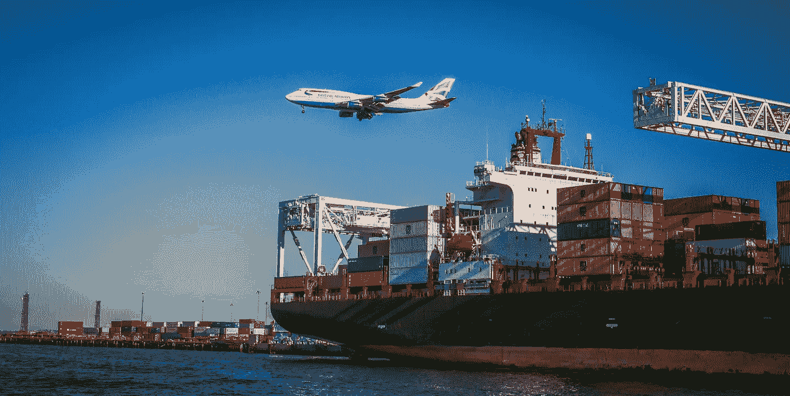

在 [Unsplash](https://unsplash.com/search/photos/container?utm_source=unsplash&utm_medium=referral&utm_content=creditCopyText) 上由 [VanveenJF](https://unsplash.com/photos/FrUsD5obrHA?utm_source=unsplash&utm_medium=referral&utm_content=creditCopyText) 拍摄的照片

> “千里之行，始于足下”——中国谚语
> 
> [https://en . Wikipedia . org/wiki/A _ journey _ of _ A _ milles _ begins _ with _ A _ single _ step](https://en.wikipedia.org/wiki/A_journey_of_a_thousand_miles_begins_with_a_single_step)

在这段旅程中，我们已经走了很长的路。在[第一篇文章](/kubernetes-journey-up-and-running-out-of-the-cloud-introduction-f04a811c92a5)中，我们简要描述了 IT 行业是如何发展到我们现在这个地步的。接下来，在第[篇文章](/kubernetes-journey-up-and-running-out-of-the-cloud-architecture-overview-e75763b54922)中，我们定义了我们的解决方案的架构将会是什么样子。然后，我们开始更深入地研究第三篇文章中构成我们解决方案一部分的技术组件，并最终深入到支持我们解决方案的网络架构[的细节。](/kubernetes-journey-up-and-running-out-of-the-cloud-network-5341831ed712)

《勇敢的心》(1995)中的梅尔·吉布森

我希望你能沿着这条路学到一些东西(为什么不呢？)和我一样开心！

我知道您可能急于开始接触实际代码，但我认为为构建我们的解决方案所需的所有概念打下良好的基础非常重要。这样，当我们开始做实际工作时，你会清楚地知道为什么需要每一个步骤。

在这篇文章中，我们将最终开始讨论 **Kubernetes** 。我们将简要介绍其体系结构和主要对象( **Pods** 、 **services** 、**volume**、**命名空间、**等)。为避免长篇大论，我们将在后续文章中对其他需要深入阐释的重要问题【如**师傅**和**工人**、 **etcd** 和**k8s**网络)进行详细阐述。

如果你不想等到所有的文章都发表了，又想马上把你的脏手弄脏，那么你可以随意克隆该项目的 Github 回购。它功能齐全，文档也不断得到改进:

 [## mvallim/kubernetes 引擎盖下

### 本教程是有人计划安装一个 Kubernetes 集群，并希望了解如何一切都适合在一起…

github.com](https://github.com/mvallim/kubernetes-under-the-hood) 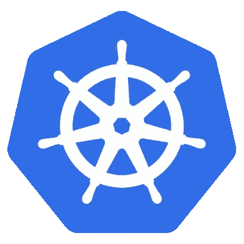

# Kubernetes

*“Kubernetes 是一个可移植、可扩展的开源平台，用于管理容器化的工作负载和服务，它同时支持声明式配置和自动化。它有一个庞大的、快速增长的生态系统。Kubernetes 提供广泛的服务、支持和工具。”*

*“谷歌在 2014 年开源了 Kubernetes 项目。Kubernetes 基于谷歌在大规模运行生产工作负载方面 15 年的经验，结合了来自社区的最佳想法和实践。*

> 参考:https://kubernetes . io/docs/concepts/overview/is-kubernetes/

**库柏属**优势包括:

*   **敏捷应用程序开发和部署:**与使用虚拟机映像相比，提高了容器映像创建的便利性和效率。
*   **持续开发、集成和部署**:通过快速轻松的回滚(由于映像不变性)，提供可靠且频繁的容器映像构建和部署。
*   **开发和运营关注点分离**:在构建/发布时而不是部署时创建应用程序容器映像，从而将应用程序与基础架构分离。
*   **可观察性:**不仅显示操作系统级别的信息和指标，还显示应用程序运行状况和其他信号。
*   **开发、测试和生产过程中的环境一致性**:在笔记本电脑上运行与在云中运行相同的程序。
*   **云和操作系统分发可移植性**:运行在 Debian、Ubuntu、CoreOS、on-prem、Google Kubernetes Engine、亚马逊弹性容器服务等平台上。
*   **以应用为中心的管理**:将抽象层次从在虚拟硬件上运行操作系统提升到使用逻辑资源在操作系统上运行应用。
*   **松散耦合、分布式、弹性、自由** [**微服务**](https://martinfowler.com/articles/microservices.html) :应用程序被分解成更小的独立部分，可以动态部署和管理——而不是运行在大型专用机器上的整体堆栈。
*   **资源隔离**:可预测的应用性能。
*   **资源利用**:高效率、高密度。

> 参考:[https://kubernetes . io/docs/concepts/overview/what-is-kubernetes/](https://kubernetes.io/docs/concepts/overview/what-is-kubernetes/)

为了让 **Kubernetes** 发挥其全部能力，它依赖并利用其他开源工具。其中我们可以包括:

*   **注册表**，如[Docker 注册表**T21**。](https://docs.docker.com/registry/)
*   **网络**，如 [**法兰绒**](https://github.com/coreos/flannel)[**印花布**](https://docs.projectcalico.org/v3.7/getting-started/kubernetes/)[**金属布**](https://metallb.universe.tf/)[**CoreDNS**](https://github.com/coredns/coredns)等。
*   **遥测**，如 [**普罗米修斯**](https://prometheus.io/)[**Sysdig**](https://sysdig.com/products/monitor/)和 [**Istio**](https://istio.io/docs/concepts/policies-and-telemetry/) 。
*   **安全**，如 [**LDAP**](https://en.wikipedia.org/wiki/Lightweight_Directory_Access_Protocol) ， [**SELinux**](https://en.wikipedia.org/wiki/Security-Enhanced_Linux) ， [**RBAC**](https://kubernetes.io/docs/reference/glossary/?security=true#term-rbac) 和 [**OAuth**](https://oauth.net/) 多层。
*   **服务**，由流行的应用程序模式先前创建的各种内容目录提供。

# Kubernetes 一览

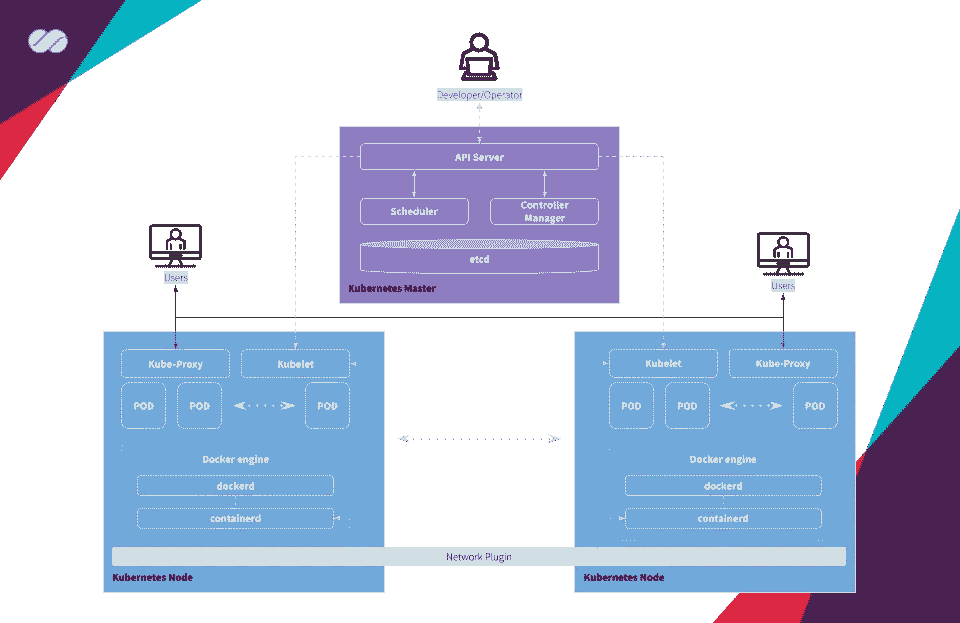

Kubernetes 架构图

由 **Kubernetes** 管理的集群基本上有两个大的操作单元:**主节点**和**工作节点**。

*   主节点(Master):是负责编排与运行在工作节点上的容器相关的所有活动的元素。它负责调度和部署集群应用程序，并获取关于工作节点和 pod 的信息，以及许多其他活动。
*   **Worker** :由 **Kubernetes** 管理的容器所在的机器(节点，可以是物理的，也可以是虚拟机)是否有效运行。为了让工作节点由 **Kubernetes** 管理，它们必须安装来自 **Kubernetes** 的 **Kubelet** 代理。所有与主服务器的通信都是通过这个代理执行的，因此，集群操作也是通过这个代理执行的。

**Kubernetes master** 接收来自开发者/操作员(DevOps)的命令，并将指令传递给工人节点。这些指令由一组服务进行处理和转发，这些服务自动决定哪个工作节点最适合处理所请求的任务。然后，资源被分配和指派给所选择的工作者节点，以满足所请求的语句。

容器管理发生在更高和更精细的层次上，不需要有人主动地对容器和工作节点进行微观管理。

## 主组件和工作组件

*   **容器网络接口(CNI)** :这个插件是一种遵循 appc/CNI 规范的网络插件。这使得能够连接在不同节点上运行的 pod，并且能够灵活地集成不同种类的网络解决方案(覆盖、纯 L3 等)。
    ‣关于 Kubernetes 和 CNI 的信息请参考 [**本**](https://kubernetes.io/docs/concepts/extend-kubernetes/compute-storage-net/network-plugins/#cni) 。
    ‣有关 Kubernetes 和 CNI 的信息，请参见“ [**网络插件**](https://kubernetes.io/docs/concepts/extend-kubernetes/compute-storage-net/network-plugins/#cni) ”。
*   **etcd** :一致且高度可用的键值存储，用作 Kubernetes 所有集群数据的后备存储。如果您的 **Kubernetes** 集群使用 **etcd** 作为其后备存储，请确保您有这些数据的备份计划。
*   **API 服务器**:主服务器上公开 Kubernetes API 的组件。它是 Kubernetes 控制平面的前端。它被设计为水平扩展—也就是说，它通过部署更多实例来扩展。
*   **控制平面**:容器编排层，公开 API 和接口来定义、部署和管理容器的生命周期。
*   **调度器**:主节点上的组件，监视新创建的没有分配工作节点的 pod，并为它们选择一个工作节点。为调度决策考虑的因素包括个体和集体资源需求、硬件/软件/策略约束、相似性和反相似性规范、数据局部性、工作负载间干扰和截止时间。
*   **控制器管理器**:运行控制器的主机上的组件。从逻辑上讲，每个控制器都是一个独立的进程，但是为了降低复杂性，它们都被编译成一个二进制文件并在一个进程中运行。
*   kubelet :在 worker 节点上运行的服务，它读取 Pod 清单并确保其定义的容器已经启动并正在运行。
*   **containerd:** 强调简单性、健壮性和可移植性的容器运行时 **containerd** 是一个在 Linux 或 Windows 上作为守护进程运行的容器运行时。 **containerd** 负责获取和存储容器映像、执行容器、提供网络访问等等。(在我们的解决方案中，我们将使用 **Docker** 来实现此目的)
*   **Kube Proxy** :它是一个网络代理，运行在集群中的每个工作节点上。Kube-proxy 负责请求转发。 **kube-proxy** 允许 TCP 和 UDP 流转发或跨一组后端功能的循环 TCP 和 UDP 转发。

> 参考:【https://kubernetes.io/docs/reference/glossary/? 基本面=真

## 库贝特尔

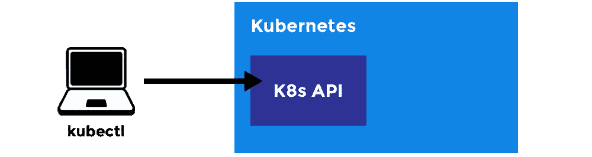

来自[上升堆栈](https://blog.risingstack.com/content/images/2018/05/kubernetes-kubectl.png)的图像

**kubectl** 是一个命令行工具，用于与 **Kubernetes API** 服务器通信。您可以使用 **kubectl** 来创建、检查、更新和删除 **Kubernetes** 对象。

## Docker 呢？

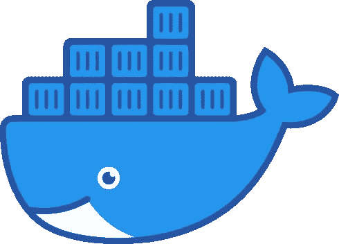

**Docker** 保持原有功能。有所改变的是，当 **Kubernetes** 配置一个 Pod 时，它向所选 worker 节点的 **kubelet** 发送指令，指示 Docker 启动(或停止)一个给定规格的容器。 **kubelet** 反过来继续从 **Docker** 及其 **containers** 中收集信息，并将所有这些信息汇总到主服务器中。这里最大的不同是，所有这一切都是以自动化的方式发生的，不需要管理员手动进行所有这些配置和信息收集。

# Kubernetes 的主要对象

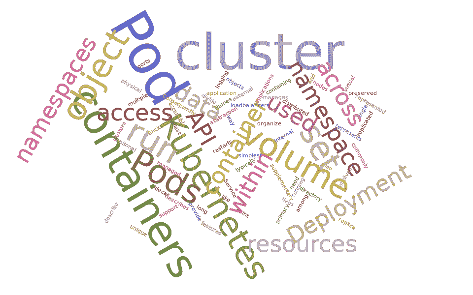

下面是 Kubernetes 管理的每个主要对象的简要定义。我们将在本系列的下一篇文章中更详细地介绍它们:

*   **Pod** :最小最简单的 Kubernetes 天体。一个 Pod 代表您的集群上一组正在运行的 [**容器**](https://kubernetes.io/docs/concepts/overview/what-is-kubernetes/#why-containers) 。Pod 通常设置为运行单个主容器。它还可以运行可选的 sidecar 容器，这些容器增加了日志记录等附加功能。pod 通常由**部署**管理。

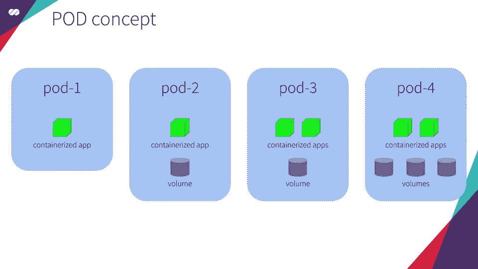

*   **部署**:管理复制应用的 API 对象。每个副本由一个 Pod 表示，Pod 分布在集群的工作节点中。

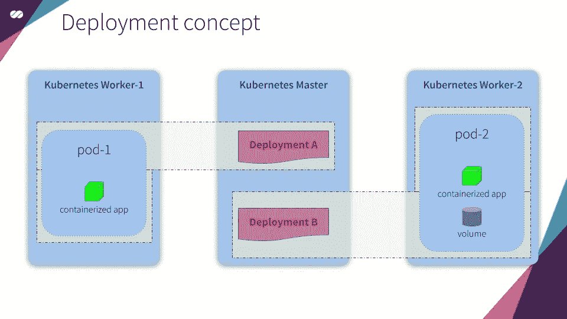

*   **Service** :描述如何访问应用的 API 对象，比如一组 [**Pods**](https://kubernetes.io/docs/concepts/workloads/pods/pod-overview/) ，可以描述端口和负载均衡器。接入点可以在群集内部或外部。

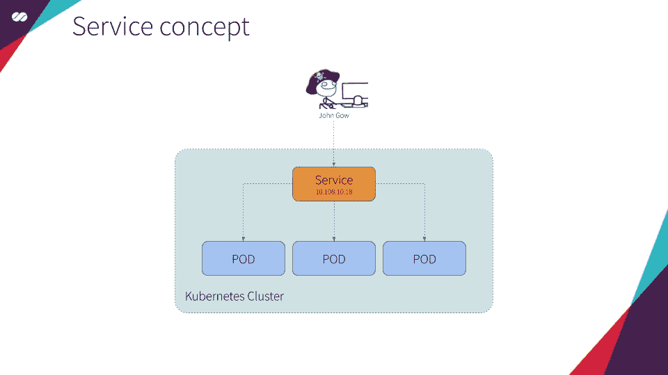

*   **卷**:包含数据的目录，可由 Pod 中的容器访问。Kubernetes 卷的寿命与包裹它的豆荚一样长。因此，卷的寿命比 Pod 中运行的任何容器都长，并且数据会在容器重新启动后保留。‣
    文件系统:在 Kubernetes 中，每个容器都可以在自己的文件系统中读写。但是当重启或移除容器时，写入该文件系统的数据会被破坏。
    ‣ **卷** : Kubernetes 有卷。只要机架存在，机架中的卷就会存在。卷可以在相同的 Pod 容器之间共享。当 Pod 重新启动或删除时，卷将被销毁。
    ‣ **持久卷**:库伯内特人有持久卷。持久卷是 Kubernetes 集群中的长期存储。持久卷超越了容器、pod 和工作节点，只要 Kubernetes 集群存在，它们就存在。一个 Pod 声明使用一个持久卷来读或写或者读和写。

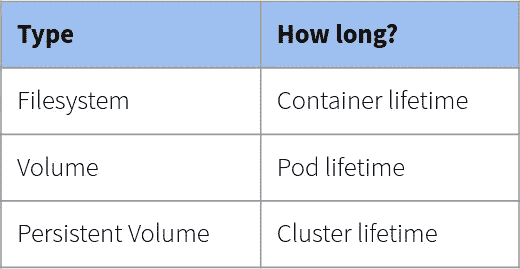

*   **名称空间**:Kubernetes 用来支持同一个物理集群上的多个虚拟集群的抽象。命名空间用于组织集群中的对象，并提供一种划分集群资源的方式。资源名称在一个名称空间内需要是唯一的，但在不同的名称空间之间不需要。

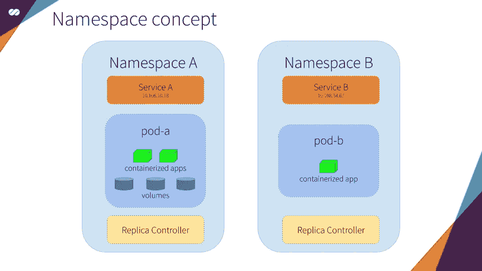

> 参考:[https://kubernetes.io/docs/reference/glossary/?基本面=真](https://kubernetes.io/docs/reference/glossary/?fundamental=true)

我希望你喜欢这篇文章以及[系列的其他文章。在下一篇文章中，我们将更深入地了解 Kubernetes Masters 和 Workers 的细节，描述组成它们的各个部分，以及它们如何相互交互。](https://medium.com/@mtvallim/kubernetes-journey-up-and-running-out-of-the-cloud-introduction-f04a811c92a5)

不要忘记在下面的评论中留下你的反馈。不断完善这一系列的内容非常重要。

我再次强烈推荐您关注我的 Medium，这样您就不会错过本系列中发表的任何新文章。如果你错过了这个系列的第一篇文章，可以在这里查看[。](https://medium.com/@mtvallim/kubernetes-journey-up-and-running-out-of-the-cloud-introduction-f04a811c92a5)

回头见！！

再见