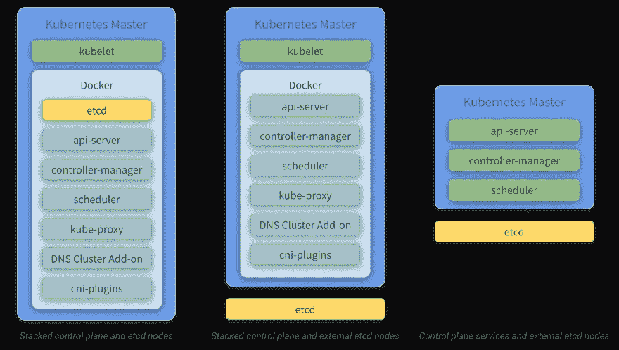
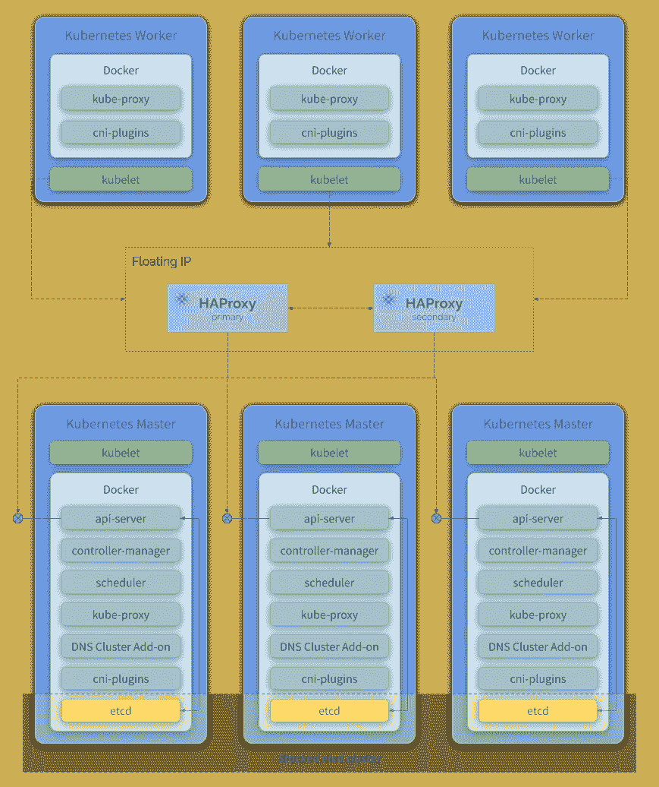
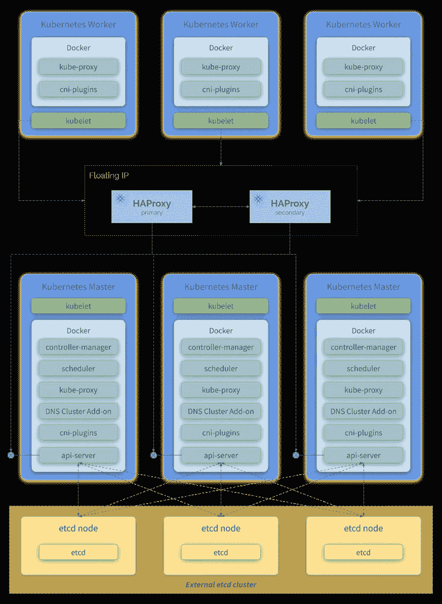
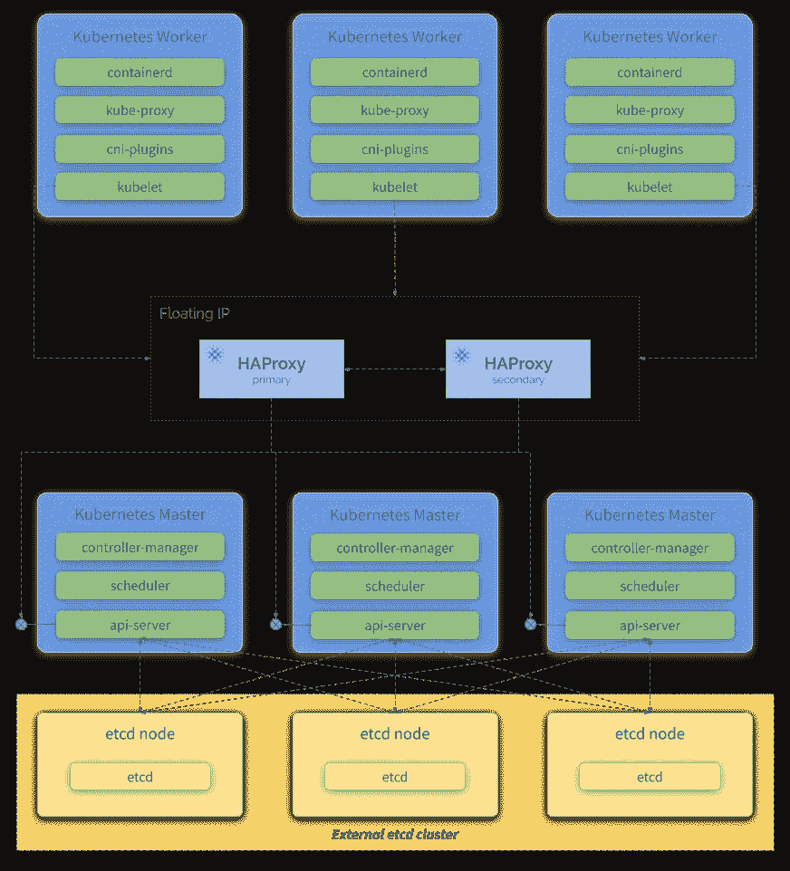
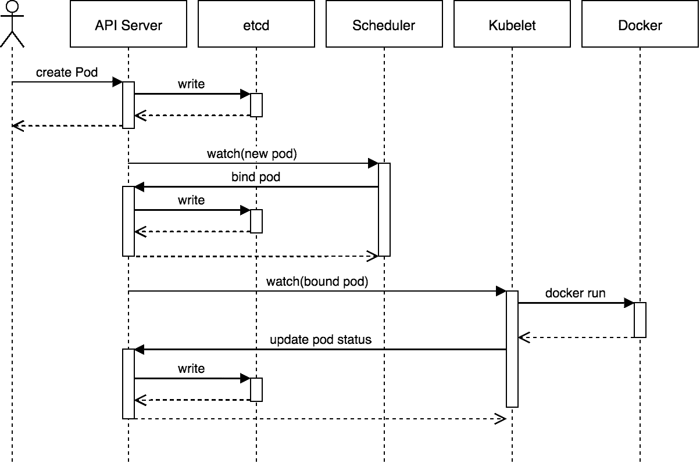
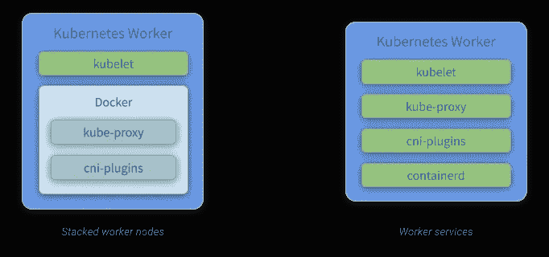

# Kubernetes 之旅——启动和运行云计算——主人和工人

> 原文：<https://itnext.io/kubernetes-journey-up-and-running-out-of-the-cloud-master-and-worker-6328775b347f?source=collection_archive---------4----------------------->

弗拉德·沙波奇尼科夫在 [Unsplash](https://unsplash.com/search/photos/twin-build?utm_source=unsplash&utm_medium=referral&utm_content=creditCopyText) 上拍摄的照片

在本文中，我们将介绍构成 **Kubernetes 主**和**工人** ( **控制器管理器**、 **API 服务器**、 **etcd** 、**调度器、Kubelet、**等)组件的每一项。我强烈建议您阅读参考链接，以便更好地理解每个组件的作用，以及它们如何适应一个 **Kubernetes 集群**。

在[上一篇文章](/kubernetes-journey-up-and-running-out-of-the-cloud-kubernetes-overview-5012994b8955)中，我们介绍了 **Kubernetes** ，并提供了其主要组件的简要概述。

这些文章是我们 Kubernetes 之旅的一部分。我希望您对深入研究如何从云中安装和配置 Kubernetes 感到兴奋！

如果你不想等到所有的文章都发表了，又想马上动手，可以随意克隆项目的 Github repo。它完全实用，文档也在不断改进:

 [## 罩下的姆瓦利姆/库伯内特斯

### 本教程是有人计划安装一个 Kubernetes 集群，并希望了解一切如何配合在一起…

github.com](https://github.com/mvallim/kubernetes-under-the-hood) 

# 掌握

主节点负责编排与运行在工作节点上的容器相关的所有活动。它负责调度和部署集群应用程序，收集关于工作节点和单元的信息，以及许多其他活动。

## 配置主节点的一些方法

## 堆叠控制平面和 etcd 节点

> 在这种方法中，服务作为容器运行，并由 kubeadm 自动设置。

堆叠式 HA 集群是一种拓扑结构(见下图)，其中 etcd 提供的分布式数据存储集群堆叠在由运行控制平面组件的 **kubeadm** 管理的节点形成的集群之上。

每个控制平面节点运行一个**API-服务器**、**调度器**和**控制器-管理器**的实例。使用负载平衡器将 **api-server** 暴露给工作节点(在我们的解决方案中，我们将使用 HA 代理)。它还创建一个本地 etcd 成员，该 etcd 成员仅与运行在同一节点上的 **api-server** 通信。这同样适用于本地**控制器管理器**和**调度器**实例。

这种拓扑将控制平面和 etcd 成员耦合在它们运行的同一节点上。与带有外部 etcd 节点的集群相比，它的设置更简单，管理复制也更简单。

然而，堆叠集群会遇到耦合失败的风险。如果一个节点出现故障，etcd 成员和控制平面实例都会丢失，冗余性也会受到影响。您可以通过添加更多控制平面节点来降低这种风险。

因此，您应该为一个 HA 群集运行至少三个堆叠控制平面节点。

**kubeadm** HA 拓扑—堆叠式 etcd

> 参考:[https://kubernetes . io/docs/setup/production-environment/tools/kube ADM/ha-topology/](https://kubernetes.io/docs/setup/production-environment/tools/kubeadm/ha-topology/)

## 堆叠控制平面和外部 etcd 节点

> 在这种方法中，服务作为容器运行，并由 kubeadm 进行部分配置。

具有外部 etcd 节点的 HA 集群是一种拓扑结构(见下图),其中 etcd 提供的分布式数据存储集群位于运行控制面板组件的节点形成的集群外部。

像在堆叠 etcd 拓扑中一样，外部 etcd 拓扑中的每个控制平面节点运行**API-服务器**、**调度器**和**控制器-管理器**的一个实例。并且使用负载平衡器将 **api-server** 暴露给工作节点。然而，etcd 成员在单独的主机上运行，并且每个 etcd 主机与每个控制平面节点的 **api-server** 通信。

这种拓扑结构将控制平面和 etcd 成员分离。因此，它提供了一种高可用性设置，其中丢失控制平面实例或 etcd 成员的影响较小，并且不会像堆叠高可用性拓扑那样影响集群冗余。

但是，这种拓扑需要的主机数量是堆叠式 HA 拓扑的两倍。对于采用此拓扑的 HA 集群，至少需要三台主机用于控制面板节点，三台主机用于 etcd 节点。

**kubeadm** HA 拓扑—外部 etcd

> 参考:[https://kubernetes . io/docs/setup/production-environment/tools/kube ADM/ha-topology/](https://kubernetes.io/docs/setup/production-environment/tools/kubeadm/ha-topology/)

## 控制平面服务和外部 etcd 节点

> 在这种方法中，服务作为独立的进程运行，应该手动配置，而不使用 **kubeadm** 。它提供了更多的灵活性，但也要求设置集群的人做更多的工作。

具有外部 etcd 节点的 HA 集群控制平面是一种拓扑结构(见下图),其中 etcd 提供的分布式数据存储集群位于运行控制平面组件的节点所形成的集群外部。

像在堆叠控制平面和外部 etcd 节点拓扑中一样，外部 etcd 拓扑中的每个控制平面节点运行一个**API-服务器**、**调度器**和**控制器-管理器**的实例。并且使用负载平衡器将 **api-server** 暴露给工作节点。 **etcd** 成员运行在单独的主机上，每个 etcd 主机与控制平面节点的所有 **api-server** 通信。

这种拓扑在同一个节点上运行 **api-server** 、**控制器-管理器**和**调度器**作为**独立服务**，而 **etcd** 运行在自己的节点上。因此，它提供了一种高可用性设置，在这种设置中，失去控制平面实例或 etcd 成员的影响较小，并且不会像在堆叠高可用性拓扑中那样影响群集冗余。

但是，这种拓扑需要的主机数量是堆叠式 HA 拓扑的两倍。对于采用此拓扑的 HA 集群，至少需要三台主机用于控制面板节点，三台主机用于 etcd 节点。另外，你必须一个接一个地安装和配置服务。

Kubernetes 控制平面服务外部 etcd

## 我们将使用哪一个？

***堆叠控制平面和 etcd 节点*** *，因为这样做将需要我们做更少的配置，需要使用更少的实例。*

## 成分

*   **kubeadm:** 一个工具，用于提供 **kubeadm init** 和 **kubeadm join** 作为创建 Kubernetes 集群的最佳实践“快速路径”。
    **kubeadm** 执行必要的操作，使最小可行集群启动并运行。按照设计，它只关心引导，而不关心机器的供应。同样，安装各种有用的插件，如 Kubernetes 仪表板、监控解决方案和特定于云的插件，也不在范围之内。
    使用 **kubeadm** 作为所有部署的基础将更容易创建一致的集群。
*   **kubelet** :在 worker 节点上运行的服务，它读取 Pod 清单并确保它们定义的容器已经启动并正在运行。
*   **etcd** :一致且高度可用的键值存储，用作 Kubernetes 所有集群数据的后备存储。如果你的 **Kubernetes** 集群使用 **etcd** 作为它的后备存储器，[确保你有一个这些数据的备份计划](https://kubernetes.io/docs/tasks/administer-cluster/configure-upgrade-etcd/#backing-up-an-etcd-cluster)。
*   一个强调简单性、健壮性和可移植性的容器运行时。containerd 是一个容器运行时，在 Linux 或 Windows 上作为守护进程运行。containerd 负责获取和存储容器映像、执行容器、提供网络访问等等。(在我们的解决方案中，我们将使用 **Docker** 来实现这个目的)
*   **api-server** :主服务器上公开 Kubernetes API 的组件。它是 Kubernetes 控制平面的前端。它被设计为水平扩展—也就是说，它通过部署更多实例来扩展。
*   **控制器管理器**:运行控制器的主机上的组件。从逻辑上讲，每个控制器都是一个独立的进程，但是为了降低复杂性，它们都被编译成一个二进制文件并在一个进程中运行。
*   **调度器**:主节点上的组件，监视新创建的没有分配工作节点的 pod，并为它们选择一个工作节点。为调度决策考虑的因素包括个体和集体资源需求、硬件/软件/策略约束、相似性和反相似性规范、数据局部性、工作负载间干扰和截止时间。

Pod 创建流程([**heptio.com**](http://heptio.com))

*   kube-proxy :它是一个网络代理，运行在集群中的每个工作节点上。 **kube-proxy** 负责请求转发。 **kube-proxy** 允许 TCP 和 UDP 流转发或跨一组后端功能的循环 TCP 和 UDP 转发。
*   **DNS cluster add-on**:Kubernetes DNS 在集群上调度一个 DNS Pod 和服务，并配置 kubelets 来告诉各个容器使用 DNS 服务的 IP 来解析 DNS 名称。
    集群中定义的每个服务(包括 DNS 服务器本身)都被分配了一个 DNS 名称。默认情况下，客户端 Pod 的 DNS 搜索列表将包括 Pod 自己的名称空间和群集的默认域。下面的例子很好地说明了这一点:
    假设在 Kubernetes 名称空间**栏**中有一个名为 **foo** 的服务。在名称空间 **bar** 中运行的 Pod 可以通过简单地对 **foo** 进行 DNS 查询来查找这个服务。在名称空间 **quux** 中运行的 Pod 可以通过对 **foo.bar** 进行 DNS 查询来查找这个服务。
*   cni 插件:这个插件是一种网络插件，符合 appc/CNI 规范。这使得能够连接在不同节点上运行的 pod，并且能够灵活地集成不同种类的网络解决方案(覆盖、纯 L3 等)。
    ‣关于 Kubernetes 和 CNI 的信息参见 [**本**](https://kubernetes.io/docs/concepts/extend-kubernetes/compute-storage-net/network-plugins/#cni) 。
    ‣有关 Kubernetes 和 CNI 的信息，请参见“ [**网络插件**](https://kubernetes.io/docs/concepts/extend-kubernetes/compute-storage-net/network-plugins/#cni) ”。

> 参考资料 https://kubernetes.io/docs/reference/glossary/?
> ‣[https://kubernetes . io/docs/reference/setup-tools/kube ADM/kube ADM/](https://kubernetes.io/docs/reference/setup-tools/kubeadm/kubeadm/)t37】‣[基本面=真](https://kubernetes.io/docs/reference/glossary/?fundamental=true)
> ‣[https://kubernetes . io/docs/concepts/services-networking/DNS-pod-service/#简介](https://kubernetes.io/docs/concepts/services-networking/dns-pod-service/#introduction)

# 工人

Workers 是机器(节点，可以是物理的或虚拟机),由 **Kubernetes** 管理的容器在其中有效地运行。为了让工人节点由 **Kubernetes** 管理，它们必须安装 **Kubelet** 代理。所有与主服务器的通信都是通过这个代理进行的，因此集群操作也是通过这个代理执行的。

## 配置工作节点的一些方法

## 堆叠的工作节点

> 在这种方法中，服务作为容器运行，并由 kubeadm 自动设置。

堆叠工人是一种拓扑结构(见上图)，其中每个节点运行一个 **kubelet** 、 **kube-proxy** 、 **cni-plugins** 和 **containerd** 的实例。
在这种拓扑中配置一个工作器更简单。只需安装 **kubeadm** 、 **kubelet** 和 **containerd** 即可。其他组件( **kube-proxy** 和 **cni-plugins** )将在执行 **kubeadm join** 命令时，当工人加入集群时被初始化。

这种方法将 kube-proxy 和 cni-plugins 作为容器运行。

## 沃克服务公司

> 在这种方法中，服务作为独立的进程运行，应该手动配置，而不使用 kubeadm。它提供了更多的灵活性，但也要求设置集群的人做更多的工作。

工作者服务是一个拓扑(见上图)，其中每个节点运行一个 **kubelet** 、 **kube-proxy** 、 **cni-plugins** 和 **containerd 的实例。此外，您必须逐个安装和配置服务。**

这种方法将 kube-proxy 和 cni-plugins 作为独立的服务运行。

## 我们将使用哪一个？

***堆叠工作者节点*** *，因为这样做会要求我们做较少的配置。*

## 成分

组件 **kubelet** 、 **kube-proxy** 、 **cni-plugins** 和 **containerd** 在主节点和工作节点上工作相同。检查它们的定义。

我希望你喜欢这篇文章以及这个系列的其他文章。在下一篇文章中，我们将更深入地了解 **etcd** 的细节，描述组成它的各个部分，以及它们如何相互交互。

别担心。我们几乎完成了所有这些的理论基础(可能在接下来的 2 或 3 篇文章中),并将很快开始接触真正酷的东西！

不要忘记在下面的评论中留下你的反馈。不断完善这一系列的内容非常重要。

我再次强烈推荐您关注我的 Medium，这样您就不会错过本系列中发表的任何新文章。如果你错过了这个系列的第一篇文章，你可以在这里查看。

回头见！！

再见