# Kubernetes 之旅——启动并运行云网络

> 原文：<https://itnext.io/kubernetes-journey-up-and-running-out-of-the-cloud-network-5341831ed712?source=collection_archive---------7----------------------->

托马斯·詹森在 [Unsplash](https://unsplash.com/search/photos/network?utm_source=unsplash&utm_medium=referral&utm_content=creditCopyText) 上的照片

在本文中，我们将介绍构成我们网络的每个组件，并简要概述**IP**、**子网**、 **DHCP** 、 **DNS** 等。我强烈建议您通过参考链接更好地理解每个组件的作用以及它们如何适应我们的架构。如果你对这里介绍的概念还有疑问，请在下面留下你的评论，我会非常乐意帮助你。

在[上一篇文章](https://medium.com/@mtvallim/kubernetes-journey-up-and-running-out-of-the-cloud-technology-stack-9c472aafac4e)中，我们查看了我们的技术堆栈，并了解了将帮助我们构建解决方案的软件。

这些文章是我们 [Kubernetes 之旅](https://medium.com/@mtvallim/kubernetes-journey-up-and-running-out-of-the-cloud-introduction-f04a811c92a5)的一部分。我希望您对深入研究如何从云中安装和配置 Kubernetes 感到兴奋！

如果你不想等到所有的文章都发表了，又想马上动手，可以随意克隆项目的 Github repo。它完全实用，文档也在不断改进:

 [## 罩下的姆瓦利姆/库伯内特斯

### 本教程是有人计划安装一个 Kubernetes 集群，并希望了解一切如何配合在一起…

github.com](https://github.com/mvallim/kubernetes-under-the-hood) 

# 域名服务器(Domain Name Server)

*“一个互联网资源，比如一个网站，可以用两种方式识别:通过它的域名，比如“kubernetes.io”或者通过托管它的主机的 IP 地址(比如 45.54.44.102 是与 kubernetes.io 域相关联的 IP)。网络层使用 IP 地址来确定设备的物理和虚拟位置。然而，域名对用户和企业来说更容易记忆。然后，我们需要一种机制来将域名解析为 IP 地址。这是 DNS 的主要功能。*

*有时，人们认为 DNS 仅用于将互联网主机名映射到数据(TXT、MX 等)以及将地址映射到主机名。然而，DNS 可以存储各种各样的数据类型，用于几乎任何目的。”*

> 参考:[https://www.cloudflare.com/learning/dns/what-is-dns/](https://www.cloudflare.com/learning/dns/what-is-dns/)

为了简化这个概念，想象一个教室，老师叫学生的名字，他们回答说他们在班上的确切位置，提供他们座位的坐标(行和列)。例如:

*   老师说 : *“约翰·高！!"*
*   **约翰·高说** : *“我在这里:第 4 行第 10 列”*
*   **老师说** : *“好，现在我知道你的确切位置:第 4 行第 10 列”*

在上面的例子中，老师知道了 **John Gow 的确切地址。**当我们在浏览器中输入地址*“kubernetes . io”*并且 **DNS** 回复*“45 . 54 . 44 . 102”时，也会发生同样的情况。*

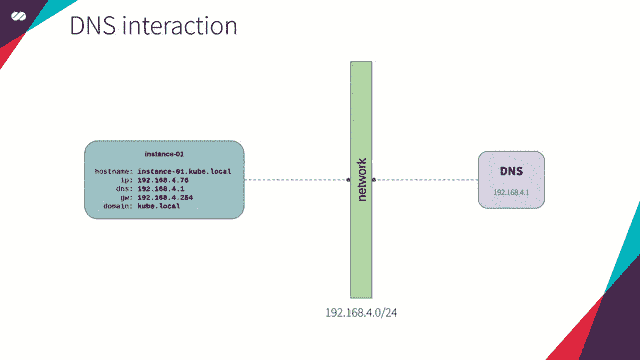

DNS 交互概念

你也可以在我们的[技术栈](https://medium.com/@mtvallim/kubernetes-journey-up-and-running-out-of-the-cloud-technology-stack-9c472aafac4e)文章中找到更多关于 **DNS** 的信息。

# 精灵

*“在计算机网络中，网络地址转换(NAT)，也称为伪装，是一种使用哈希表重写通过路由器或防火墙的数据包的源 IP 地址的技术，以使内部网络中的计算机可以访问外部或万维网(公共网络)。”*

> 参考:[https://en.wikipedia.org/wiki/Network_address_translation](https://en.wikipedia.org/wiki/Network_address_translation)

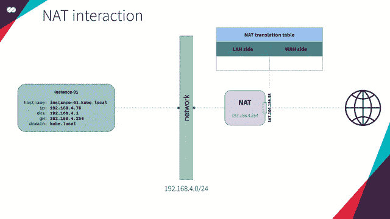

NAT 交互概念

# 动态主机配置协议

*“DHCP，即动态主机配置协议(DHCP)，是一种 TCP / IP 服务协议，为网络中的设备(虚拟机实例、笔记本、平板电脑、移动设备、IOT 传感器等)提供动态配置，如:IP 地址、子网掩码、默认网关地址、DNS 服务器的 IP 地址、DNS 搜索后缀、* [*WINS*](https://docs.microsoft.com/en-us/previous-versions//bb727015(v=technet.10)) *服务器的 IP 地址等。
该协议是*[*BOOTP*](https://en.wikipedia.org/wiki/Bootstrap_Protocol)*的后续协议，虽然更简单，但已受限于当前需求。DHCP 在 1993 年 10 月成为标准。*[*RFC 2131*](https://www.ietf.org/rfc/rfc2131.txt)*(1997)包含最新规范。IPv6 上的 DHCP 规范的最后一个标准(DHCPv6)发布为*[*RFC 3315*](https://tools.ietf.org/html/rfc3315)*(2003)。”*

> 参考:[https://en . Wikipedia . org/wiki/Dynamic _ Host _ Configuration _ Protocol](https://en.wikipedia.org/wiki/Dynamic_Host_Configuration_Protocol)

DHCP 交互概念

如果你不记得什么是 **DHCP** ，请回头参考我们的[技术栈](https://medium.com/@mtvallim/kubernetes-journey-up-and-running-out-of-the-cloud-technology-stack-9c472aafac4e)。

# 门

*“网关，也称为协议转换器，可以在任何网络层上运行。网关的职责比路由器或交换机更复杂，因为它们使用多种协议进行通信。*

*互联网用户的电脑和为用户提供页面服务的电脑是网络节点，连接两者之间网络的节点是网关。例如，控制企业网络之间流量的计算机或互联网服务提供商(ISP)用来将用户连接到互联网的计算机就是网关节点。*

*在公司网络中，充当网关节点的服务器计算机通常也充当代理服务器和防火墙服务器。网关通常与路由器相关联，路由器知道将在网关处接收到的特定数据分组定向到哪里并对其进行交换，路由器向特定接收器提供网关的实际输入和输出路径。”*

> 参考:[https://en . Wikipedia . org/wiki/Gateway _(电信)](https://en.wikipedia.org/wiki/Gateway_(telecommunications))

为了简化这个概念，**网关**是与网络外的计算机之间的接入点。根据网络的复杂性，网关可能只有一个或几个，因为它们提供了网络的出口和入口点(就像家里的门一样)。

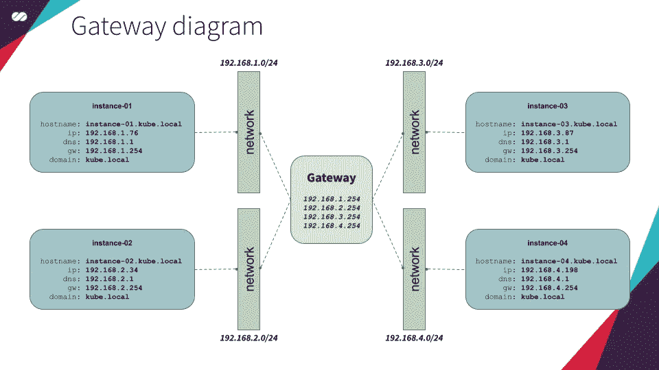

网关图概念

# IP 地址；网络地址

IP 地址的长度为 32 位，分为 4 个八位字节(8 位)。每个二进制八位数可以用十进制格式表示，用点分隔。

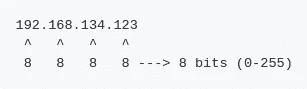

# 网络分段

计算机网络中的网络分段是将计算机网络分成子网(网段)的实践。这种做法的主要优点是提高安全性和性能。

## 利益

**交通流量减少**

*   它导致网络流量被隔离到每个网段，这意味着每个网段都有自己的流量，不会影响整个网络。

**安全**

*   广播仅限于该网段，而不是整个网络。
*   网段中的资源可能与其他网络隔离，或者从一个子网限制到另一个子网。
*   常见的攻击局限于每个子网，而不是整个网络。鉴于此，按资源类型(数据库、NFS、web 等)划分网络非常重要。

**问题的隔离**

*   一个子网中的任何网络问题都仅限于该子网，不会影响整个网络。

**访问**

*   每个子网内部和之间的访问限制(例如，**子网 a** 只能访问**子网 b** )。

> 参考:[https://en.wikipedia.org/wiki/Network_segmentation](https://en.wikipedia.org/wiki/Network_segmentation)

# 网络课程

*   **A 类** —第一个二进制八位数的值在 1–127 范围内的每个 IP 都是一个**A 类**地址。
*   **B 类** —第一个二进制八位数的值在 128–191 范围内的每个 IP 都是**B 类**地址。
*   **C 类** —第一个二进制八位数的值在 192–223 范围内的每个 IP 都是一个**C 类**地址。
*   **D 类**—第一个八位字节的值在 224–239 范围内的每个 IP 都是一个**D 类**地址。
*   **E 类** —第一个八位字节的值在 240–255 范围内的每个 IP 都是一个**E 类**地址。

# CIDR 符号

无类域间路由，或 **CIDR** ，是传统子网划分的替代方案。

IP 地址由两组位组成:最高位是网络前缀，用于标识整个网络或子网；最低位是主机标识符，用于指定该网络中主机的特定接口。这种划分被用作 IP 网络之间路由流量和地址分配策略的基础。

这里的基本思想是将最高有效位放在地址的开头。见下表。

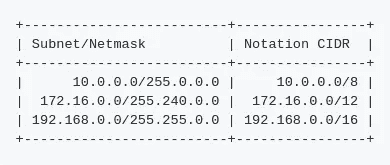

> 参考:[https://en . Wikipedia . org/wiki/Classless _ Inter-Domain _ Routing](https://en.wikipedia.org/wiki/Classless_Inter-Domain_Routing)

# 本地主机

127 . 0 . 0 . 0–127 . 255 . 255 . 255 IP 范围(或用 **CIDR** 符号表示的 127.0.0.0/8)被保留用于本地主机内的通信。发送到这些地址的任何数据包都不会离开生成它们的计算机。尽管如此，它们还是会像从网络收到的任何其他数据包一样被处理。

# 保留的私有范围

在 4，294，967，296 (0.0.0.0/0 - 2)个可用地址中，有三个范围是为专用网络保留的。包含在这些范围内的 IP 地址不能从专用网络路由出去，也不能从公共网络路由出去。

类别 **A** 、 **B、**和 **C** 被保留给网络(由 [RFC 1918](http://www.ietf.org/rfc/rfc1918.txt) 以及 RFC[3330](http://www.ietf.org/rfc/rfc3330.txt)和 [3927](http://www.ietf.org/rfc/Frfc3927.txt) 标准化)，它们被称为私有网络地址。见下表。

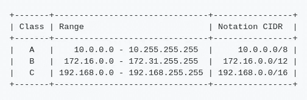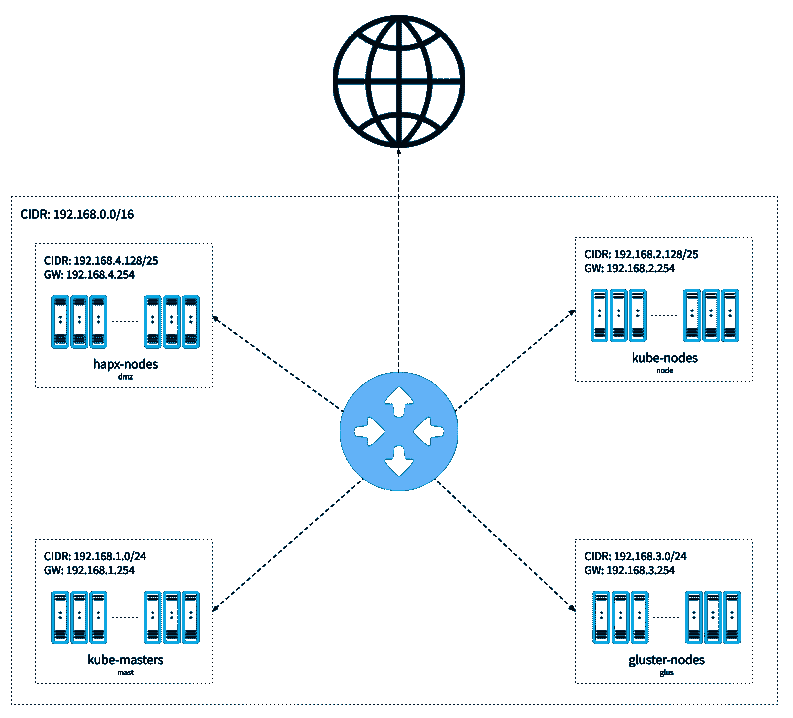

## 网络

这是我们主网络的 IP 地址范围。它为我们提供了多达 65534 个地址，允许我们将其分割成更小的、专门的块。

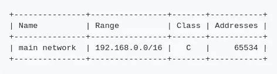

## 子网

在这里，我们定义我们的子网将如何被隔离，允许我们将每个资源类别与其他资源类别分开。主网络将是 an /16，而较小的网络将是/24 和/25。

为了简化这个概念，假设我们有一个多层的商业建筑，每一层都有一个专业领域。例如，软件开发人员住在一楼，厨师住在二楼，医生住在三楼，等等。

基本上，我们所做的是获得我们的建筑(主网络)并为每层分配一个地址，指定每层支持的专业人员(主机)的最大数量。

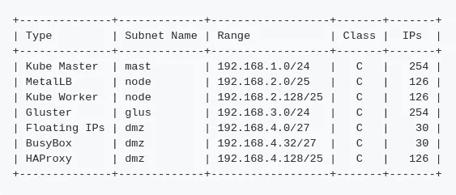

子网将被分段以容纳 254 个( */24 个*)和 126 个( */25 个*)地址，这些地址的大小足以容纳实例、负载平衡器( **MetalLB** )和**浮动 IP** ，以完成我们的 **Kubernetes** 集群的部署。

你可能会问为什么这些数字不是 256(2⁸—(32-24))和 128 (2⁷ — (32 -25))。原因是第一个和最后一个地址分别保留给网络和广播。

## **域名系统**

如上所述，通常的做法是将第一个可用地址分配给 DNS 服务器。因此:

## 动态主机配置协议

在这里，我们定义我们的 IP 分配范围应该是什么，保证上面定义的每个子网都有足够的 IP 分配给启动到它们的主机。

仔细观察，我们可以看到每个 IP 范围最多支持 252 个和 124 个 IP。如果给定网络中的主机数量超过这个数量，我们将面临 IP 耗尽的情况。这意味着试图加入子网的新主机将无法接收 IP，因此无法加入网络。

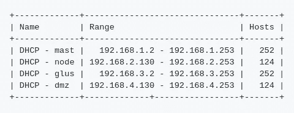

*注意，第一个地址将保留给****DNS****服务器，最后一个为* ***网关*** *。这就是我们分别引用 252(代表/24)和 124(代表/25)地址，而不是 254 和 126 地址的原因。*

如果你不记得什么是 **DHCP** ，请回头参考我们的[技术栈](https://medium.com/@mtvallim/kubernetes-journey-up-and-running-out-of-the-cloud-technology-stack-9c472aafac4e)。

## 方法

通常的做法是保留子网中的第一个或最后一个 IP 地址作为网关地址。从技术上讲，给你的网关分配一个不同的 IP 地址是可能的。请记住，这可能会使 DHCP 配置更加困难。

例如，在 CIDR 为 192.168.5.0/24 的子网中，如果我们任意将 IP 192.168.5.127 分配给我们的网关，我们的 IP 分配范围就必须定义为 192 . 168 . 5 . 1–192 . 168 . 5 . 126 或 192 . 168 . 5 . 128–192 . 168 . 5 . 254，这样就不太直观了。

为了让我们的生活更轻松，我们将使用子网的最后一个 IP 地址(注意，我们使用 254，因为 255 是为广播保留的)作为网关。

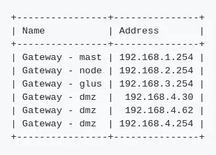

## 浮动 IP

我们的**浮动 IP** 地址可以是我们的 [DMZ](https://en.m.wikipedia.org/wiki/DMZ_(computing)) 子网 192.168.4.0/27 中的任何 IP 地址。因此，我们将使用 192.168.4.20。

如果你不记得什么是**浮动 IP** ，请回头参考我们的[架构概述](https://medium.com/@mtvallim/kubernetes-journey-up-and-running-out-of-the-cloud-architecture-overview-e75763b54922)。

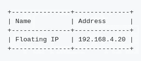

## 负载平衡器

如果你不记得什么是**负载均衡**，请参考我们的[架构概述](https://medium.com/@mtvallim/kubernetes-journey-up-and-running-out-of-the-cloud-architecture-overview-e75763b54922)。

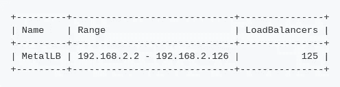

我希望你喜欢这篇文章以及这个系列的其他文章。在下一篇文章中，我们将更深入地研究 **Kubernetes 架构**，描述构成其一部分的每个组件。

不要忘记在下面的评论中留下你的反馈。不断完善这一系列的内容非常重要。

我再次强烈推荐您关注我的 Medium，这样您就不会错过本系列中发表的任何新文章。如果你错过了本系列的第一篇文章，你可以在这里查看。

回头见！！

再见