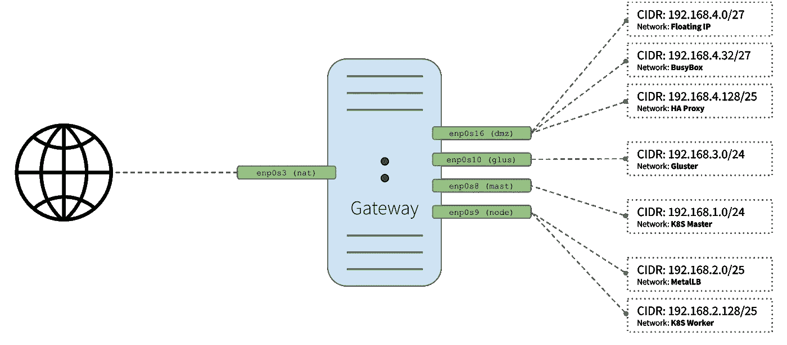

# Kubernetes 之旅——启动并运行云计算——如何设置网关和 Busybox 组件

> 原文：<https://itnext.io/kubernetes-journey-up-and-running-out-of-the-cloud-starting-the-actual-setup-737c0f3e0fb1?source=collection_archive---------3----------------------->


安娜斯塔西娅·杜尔吉尔在 [Unsplash](https://unsplash.com/s/photos/network?utm_source=unsplash&utm_medium=referral&utm_content=creditCopyText) 上的照片

你好。欢迎回到我们的 [Kubernetes 之旅——启动并运行云](/kubernetes-journey-up-and-running-out-of-the-cloud-introduction-f04a811c92a5)。在上一篇文章中，我们为 Ubuntu 和 Debian 创建了基础映像，我们将使用它为解决方案的以下组件创建特定映像:

*   **网关** ( **一个**实例)
*   **Busybox** ( **一个**实例)
*   **HA 代理** ( **两个**实例)
*   **Kubernetes 大师** ( **三**实例)
*   **Kubernetes Worker** ( **三个**实例)
*   **Gluster 节点** ( **三个**实例)

查看我们的[架构概述](/kubernetes-journey-up-and-running-out-of-the-cloud-architecture-overview-e75763b54922)文章，更好地理解这些组件如何相互作用。

为了避免太长，在本文中，我们将重点关注**网关**和 **Busybox** 组件的配置。

正如我们在[网络文章](/kubernetes-journey-up-and-running-out-of-the-cloud-network-5341831ed712)中看到的，网关实例将提供以下服务: **DNS、NAT、DHCP 和网关**。有关每个组件负责什么的更多信息，请参考它。

为了配置我们的实例，我们将利用 cloud-init 以及一个定制的参数化 shell 脚本，该脚本将帮助我们使用我们在上一篇文章中创建的基本定制映像来创建每个定制映像。

如果你不想等到所有的文章都发表了，又想马上动手，可以随意克隆项目的 Github repo。它很实用，文档也在不断改进:

[](https://github.com/mvallim/kubernetes-under-the-hood) [## 罩下的姆瓦利姆/库伯内特斯

### 它甚至还包括一张幻灯片，解释了它吸引目标受众的原因…

github.com](https://github.com/mvallim/kubernetes-under-the-hood) 

> *“cloud-init 是在 GPLv3 开源许可证和 Apache 许可证版本 2.0 下作为自由软件开发和发布的。它最初是为 Amazon EC2 中 Linux 的 Ubuntu 发行版设计的，但现在在每个主流云中的许多 Linux 和 UNIX 发行版上都支持它。”*

> 参考:【https://cloud-init.io/ 

## 概观

cloud-init 是一个实例初始化工具。它允许在初始化实例时自动配置实例，在几秒钟内将一个通用的 Linux 映像转换成一个配置好的服务器，既快速又方便。

最新 Linux 发行版中提供的 cloud-init 程序能够运行服务、创建用户以及安装和配置软件包。[用户数据](https://cloudinit.readthedocs.io/en/latest/topics/examples.html)脚本最流行的格式之一是[云配置](https://cloudinit.readthedocs.io/en/latest/topics/examples.html)文件格式。

云配置文件是专门为云初始化进程设计的特殊脚本。它们通常用于服务器首次启动时的初始设置。

## 能力

*   **运行命令**:执行命令列表并输出到控制台。
*   **配置 ssh 密钥**:为~/添加一个条目。ssh/authorized_keys 给已配置的用户。
*   **安装包**:首次启动时安装额外的包。
*   **配置网络** : upgrade /etc/hosts，主机名等。
*   **写文件**:将任意文件写到磁盘。
*   **添加仓库**:添加一个 apt 或 yum 仓库。
*   **创建用户和组**:向系统添加组和用户，并设置它们的属性。
*   **执行升级**:升级所有软件包。
*   **重启**:完成 cloud-init 后重启或关机。

> 有关 cloud-init 模块的完整列表，请参考[文档](https://cloudinit.readthedocs.io/en/latest/topics/modules.html)。

## 厨师，木偶，盐呢？

> 像**Chef**/**Puppet**/**Salt**这样的工具的一个问题是，他们需要在虚拟机上部署一个代理，然后才能开始管理这些服务器。Cloud-init 可以在这些场景中提供帮助，因为 cloud-init 中有模块可以为**Chef**/**Puppet**/**Salt**部署代理。

> 完整参考[此处](https://medium.com/cloudnativeinfra/when-to-use-which-infrastructure-as-code-tool-665af289fbde) ( [云原生基础设施](https://medium.com/cloudnativeinfra)作者 [Ramnath Nayak](https://medium.com/@ramnathn?source=post_page-----665af289fbde----------------------) )

## Seed ISO

这里使用的数据源初始化将是 [nocloud](https://cloudinit.readthedocs.io/en/latest/topics/datasources/nocloud.html) 。要以这种方式引导系统，您需要创建一个 ISO 文件，其中包含一个**元数据**文件和一个**用户数据**文件，如下所示。

文件系统卷标必须是`**cidata**`或`**CIDATA**`。

```
~$ genisoimage -input-charset utf-8 \
  -output hostname-cidata.iso \
  -volid **cidata** -joliet -rock **meta-data** **user-data**
```

当我们创建自定义映像时，上面生成的 hostname-cidata.iso 将附加到映像，并将由 cloud-init 用来配置实例。

您可以在 [create-image.sh](https://github.com/mvallim/kubernetes-under-the-hood/blob/master/create-image.sh) 脚本中观察此过程，这将在下一节中详细介绍。

# 创建-图像. sh


现在让我们使用我们创建的定制工具( [create-image.sh](https://github.com/mvallim/kubernetes-under-the-hood/blob/master/create-image.sh) )来创建映像，该工具将帮助我们克隆基础映像并添加用户数据、元数据和网络配置脚本，cloud-init 将使用这些脚本来安装必要的包和配置。

```
./create-image.sh \
    -k or -ssh-pub-keyfile **SSH_PUB_KEY_FILE** \
    -u or -user-data **USER_DATA_FILE** \
    -m or -meta-data **META_DATA_FILE** \
    -n or -network-interfaces **NETWORK_INTERFACES_FILE** \
    -i or -post-config-interfaces **POST_CONFIG_INTERFACES_FILE** \
    -s or -post-config-storages **POST_CONFIG_STORAGES_FILE** \
    -r or -post-config-resources **POST_CONFIG_RESOURCES_FILE** \
    -o or -hostname **HOSTNAME** \
    -b or -base-image **BASE_IMAGE** \
    -l or -linux-distribution **LINUX_DISTRIBUTION** \
    -a or -auto-start **AUTO_START**
```

## 因素

*   `**-k**`用于将**公钥**从您的主机复制到新创建的虚拟机。
*   `**-u**`用于指定**用户数据**文件，该文件将作为参数传递给创建我们之前提到的 cloud-init ISO 文件的命令(查看脚本的源代码以更好地理解它的用法)。默认为'**/数据/用户数据**'。
*   `**-m**`用于指定**元数据**文件，该文件将作为参数传递给创建我们之前提到的 cloud-init ISO 文件的命令(查看脚本的源代码以更好地理解它的用法)。默认为'**/数据/元数据**'。
*   `**-n**`用于传递配置文件，cloud-init 将使用该文件为实例配置**网络**。
*   `**-i**`用于传递一个配置文件，我们的脚本将使用该文件修改由 **VirtualBox** 管理的**网络接口**，该接口连接到将从该映像创建的实例。
*   `**-r**`用于传递一个配置文件，我们的脚本将使用该文件来配置**数量的处理器和**数量的内存，这些内存由 **VirtualBox** 分配给我们的实例。
*   `**-o**`用于传递将分配给我们实例的**主机名**。这也将是 **VirtualBox** 用来引用我们的实例的名字。
*   `**-l**`用于通知我们要使用哪个 Linux 发行版( **debian** 或 **ubuntu** )配置文件(注意这是用来指定[数据](https://github.com/mvallim/kubernetes-under-the-hood/blob/master/data)下的哪个文件夹被引用)。默认为' **debian** '。
*   `**-b**`用于指定应该使用哪个**基础图像**。这是我们执行[上一篇文章](/kubernetes-journey-up-and-running-out-of-the-cloud-linux-image-c51953e50d0e)中的安装步骤时，在 **VirtualBox** 上创建的映像名称。
*   `**-s**`用于传递一个配置文件，我们的脚本将使用该文件在 **VirtualBox** 上配置**虚拟磁盘**。你会注意到这仅用于 **Gluster** 配置步骤。
*   `**-a**`我们的实例**在创建后是否应该初始化**。默认为**真**。

# 网关配置



网关图

> 在我们的[网络](/kubernetes-journey-up-and-running-out-of-the-cloud-network-5341831ed712)文章中有完整的解释。

## **用户数据 TL；博士**

这是使用`**-u**`标志传递给 create-image.sh 脚本的用户数据文件。下面的特定文件是用于配置网关的用户数据文件。您可以在我们的 repo 中的`**/data/{distribution}/{component}/user-data**`下检查每个组件的配置。检查文件中的注释，以便更好地理解每个部分所代表的内容。

# BusyBox

由于我们在 **VirtualBox** 空间内创建了一个完整的特定虚拟化网络，而我们的主机在默认情况下无法访问该网络，因此我们将创建一个 **BusyBox** 实例。一个 **BusyBox** ，也称为跳转框或堡垒主机，是一个实例，它将驻留在我们的部署的同一个网络中，并为我们提供到其他实例的单一访问点。这为我们提供了连接到另一个网络中的实例的能力，只需对我们的主机进行最少的配置更改。

除了充当我们部署的访问点之外，这台机器上还安装了网络诊断工具和 kubectl，所以我们不需要弄乱我们主机上的任何现有安装。

## 用户数据 TL；速度三角形定位法(dead reckoning)

## 通知；注意

你可能会注意到我们正在使用 **SSH CA 证书**在我们的网络内部进行安全通信。

您可能还会注意到，这些键在配置文件中是硬编码的。当您设置实例时，请确保提供您自己的密钥。

更好的设置方法是使用**木偶** + **保险库**来提供和分发我们的密钥。例如，使用这些工具正确配置的设置将允许动态地提供和循环我们的密钥，增加我们部署的安全性。

这种设置安全密钥的高级设置超出了本系列的范围，但是我打算在特性中发布新的文章，展示如何应用这种设置。敬请期待！

# 运转

## 先决条件(GNU/Linux Debian/Ubuntu)

前提是你已经在本地机器上正确安装了 **Virtualbox** 。

*   **在** `vboxusers` **群**上添加您的用户

```
~$ sudo usermod -a -G vboxusers $USER
```

*   **安装**

```
~$ sudo apt-get install python3-pip~$ sudo pip3 install shyaml
```

*   **安装**

```
~$ sudo apt-get install genisoimage
```

*   **安装**

```
~$ sudo apt-get install uuid-runtime
```

*   **配置主机适配器 VirtualBox**

```
~$ vboxmanage hostonlyif create~$ vboxmanage hostonlyif ipconfig vboxnet0 --ip 192.168.254.1 --netmask 255.255.0.0
```

## **克隆存储库**

```
~$ git clone [git@github.com](mailto:git@github.com):mvallim/kubernetes-under-the-hood.gitCloning into 'kubernetes-under-the-hood'...
remote: Enumerating objects: 190, done.
remote: Counting objects: 100% (190/190), done.
remote: Compressing objects: 100% (141/141), done.
remote: Total 2527 (delta 117), reused 86 (delta 45), pack-reused 2337
Receiving objects: 100% (2527/2527), 47.89 MiB | 8.61 MiB/s, done.
Resolving deltas: 100% (1662/1662), done.~$ cd kubernetes-under-the-hood
```

## 创建虚拟机

为了使用`cloud-init`初始化和配置我们的实例，我们将使用来自我们存储库的 [data](https://github.com/mvallim/kubernetes-under-the-hood/blob/master/data) 目录中的配置文件版本。

注意:对于每一步，我们传递正在配置的组件的特定配置文件(gate、hapx、glus 等。)

**创建网关**

```
~/kubernetes-under-the-hood$ ./create-image.sh \
    -k ~/.ssh/id_rsa.pub \
    -u gate/user-data \
    -n gate/network-config \
    -i gate/post-config-interfaces \
    -r gate/post-config-resources \
    -o gate-node01 \
    -l debian \
    -b debian-base-image
```

响应应该类似于以下内容:

```
Total translation table size: 0
Total rockridge attributes bytes: 417
Total directory bytes: 0
Path table size(bytes): 10
Max brk space used 0 186 extents written (0 MB)
0%...10%...20%...30%...40%...50%...60%...70%...80%...90%...100%
Machine has been successfully cloned as "gate-node01"
Waiting for VM "gate-node01" to power on...
VM "gate-node01" has been successfully started.
```

**创建 BusyBox**

```
~/kubernetes-under-the-hood$ ./create-image.sh \
    -k ~/.ssh/id_rsa.pub \
    -u busybox/user-data \
    -n busybox/network-config \
    -i busybox/post-config-interfaces \
    -r busybox/post-config-resources \
    -o busybox \
    -l debian \
    -b debian-base-image
```

响应应该类似于以下内容:

```
Total translation table size: 0
Total rockridge attributes bytes: 417
Total directory bytes: 0
Path table size(bytes): 10
Max brk space used 0 186 extents written (0 MB)
0%...10%...20%...30%...40%...50%...60%...70%...80%...90%...100%
Machine has been successfully cloned as "busybox"
Waiting for VM "busybox" to power on...
VM "busybox" has been successfully started.
```

## 配置您的本地路由

您需要在本地机器上添加路由来访问 **Virtualbox** 的内部网络。

```
**# BusyBox network** ~$ sudo ip route add 192.168.4.32/27 via 192.168.4.62 dev vboxnet0
```

## 访问 BusyBox

我们需要让 **BusyBox** IP 通过`ssh`访问它

```
~$ vboxmanage guestproperty get busybox "/VirtualBox/GuestInfo/Net/0/V4/IP"
```

响应应该类似于以下内容:

```
Value: 192.168.4.57
```

使用返回值来访问。

```
~$ **ssh debian@192.168.4.57**
```

响应应该类似于以下内容:

```
Linux busybox 4.9.0-11-amd64 #1 SMP Debian 4.9.189-3+deb9u2 (2019-11-11) x86_64The programs included with the Debian GNU/Linux system are free software;
the exact distribution terms for each program are described in the
individual files in /usr/share/doc/*/copyright.Debian GNU/Linux comes with ABSOLUTELY NO WARRANTY, to the extent
permitted by applicable law.
```

让我们使用`**nslookup**`来检查 **DNS** 配置

```
debian@busybox:~$ **nslookup gate-node01**
```

响应应该类似于以下内容:

```
Server:         192.168.4.1
Address:        192.168.4.1#53Name:   gate-node01.kube.demo
Address: 192.168.254.254
```

让我们使用`**curl**`检查访问互联网

```
debian@busybox:~$ **curl -v google.com**
```

响应应该类似于以下内容:

```
* Rebuilt URL to: google.com/
*   Trying 172.217.29.142...
* TCP_NODELAY set
* Connected to google.com (172.217.29.142) port 80 (#0)
> GET / HTTP/1.1
> Host: google.com
> User-Agent: curl/7.52.1
> Accept: */*
> 
< HTTP/1.1 301 Moved Permanently
< Location: [http://www.google.com/](http://www.google.com/)
< Content-Type: text/html; charset=UTF-8
< Date: Sun, 24 Nov 2019 21:13:19 GMT
< Expires: Tue, 24 Dec 2019 21:13:19 GMT
< Cache-Control: public, max-age=2592000
< Server: gws
< Content-Length: 219
< X-XSS-Protection: 0
< X-Frame-Options: SAMEORIGIN
< 
<HTML><HEAD><meta http-equiv="content-type" content="text/html;charset=utf-8">
<TITLE>301 Moved</TITLE></HEAD><BODY>
<H1>301 Moved</H1>
The document has moved
<A HREF="[http://www.google.com/](http://www.google.com/)">here</A>.
</BODY></HTML>
* Curl_http_done: called premature == 0
* Connection #0 to host google.com left intact
```

让我们检查一下`**kubectl**`的版本

```
debian@busybox:~$ **kubectl version --client**
```

响应应该类似于以下内容:

```
Client Version: version.Info{Major:"1", Minor:"15", GitVersion:"v1.15.6", GitCommit:"7015f71e75f670eb9e7ebd4b5749639d42e20079", GitTreeState:"clean", BuildDate:"2019-11-13T11:20:18Z", GoVersion:"go1.12.12", Compiler:"gc", Platform:"linux/amd64"}
```

让我们检查访问`**gate-node01**`

```
debian@busybox:~$ ssh debian@gate-node01
```

响应应该类似于以下内容:

```
Linux gate-node01 4.9.0-11-amd64 #1 SMP Debian 4.9.189-3+deb9u2 (2019-11-11) x86_64The programs included with the Debian GNU/Linux system are free software;
the exact distribution terms for each program are described in the
individual files in /usr/share/doc/*/copyright.Debian GNU/Linux comes with ABSOLUTELY NO WARRANTY, to the extent
permitted by applicable law.
```

# 结论

在本文中，我们已经开始执行将构成我们的解决方案的组件的实际配置。我们已经配置了我们的**网关**实例以及一个 **BusyBox** 实例，这将允许我们连接到组成我们的解决方案的所有实例，这些实例驻留在与我们的主机不同的网络中。

在下一篇文章中，我们将配置 **HA 代理**实例。有关它在我们的解决方案中所扮演角色的更多信息，请查看我们的[技术堆栈文章](/kubernetes-journey-up-and-running-out-of-the-cloud-technology-stack-9c472aafac4e)。

如果你认为这是有帮助的，请留下你的👏以及下面的反馈。不断完善这个系列的内容非常重要。

我再次强烈推荐您关注我的 Medium，这样您就不会错过本系列中发表的任何新文章。如果你错过了这个系列的第一篇文章，可以在这里查看[。](/kubernetes-journey-up-and-running-out-of-the-cloud-introduction-f04a811c92a5)

回头见！！

再见