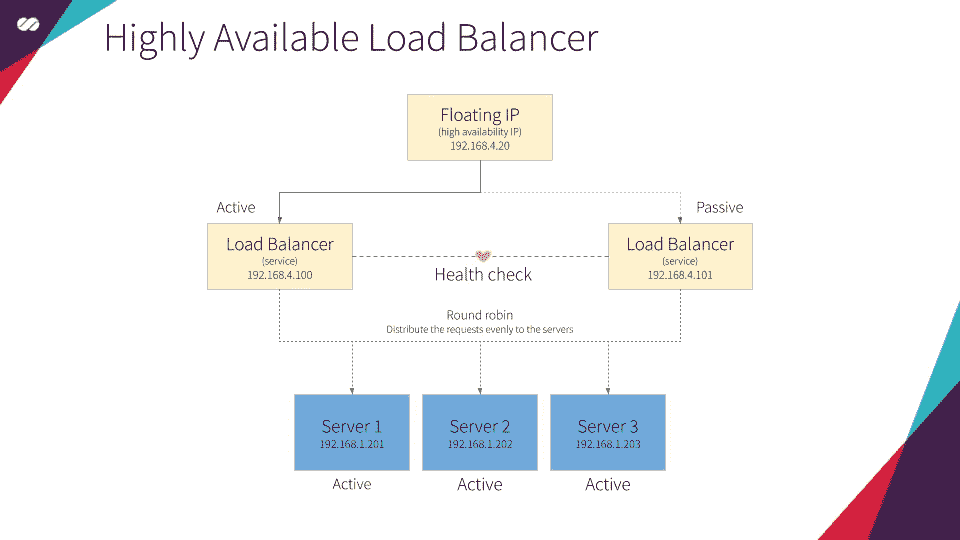
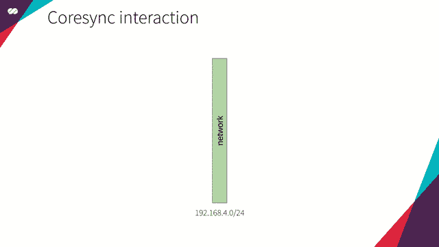
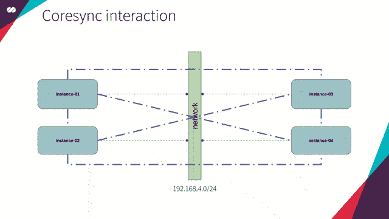
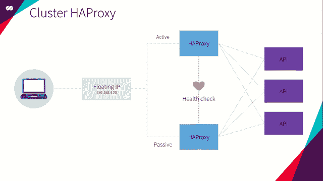
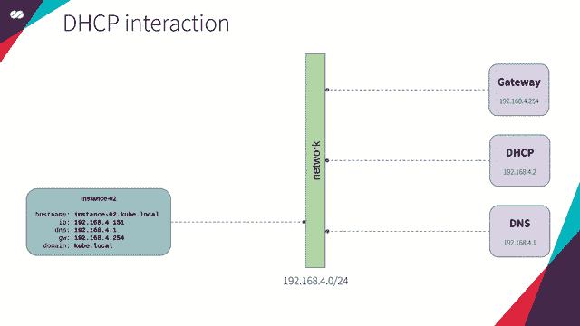
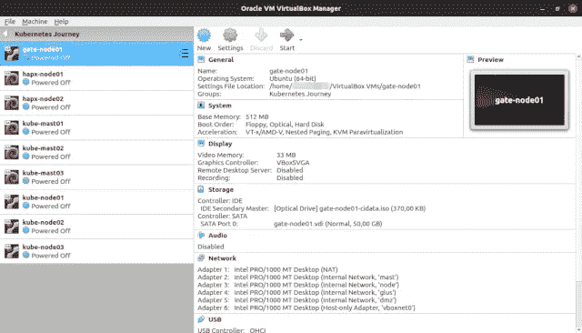
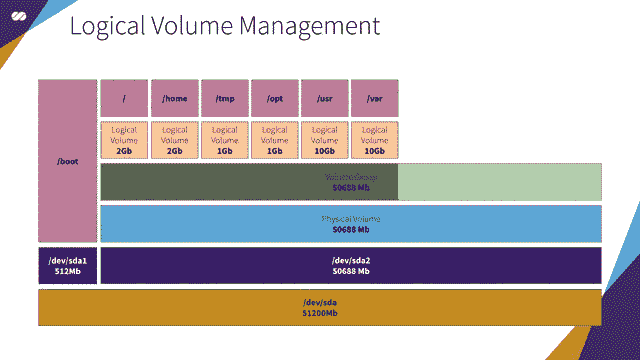
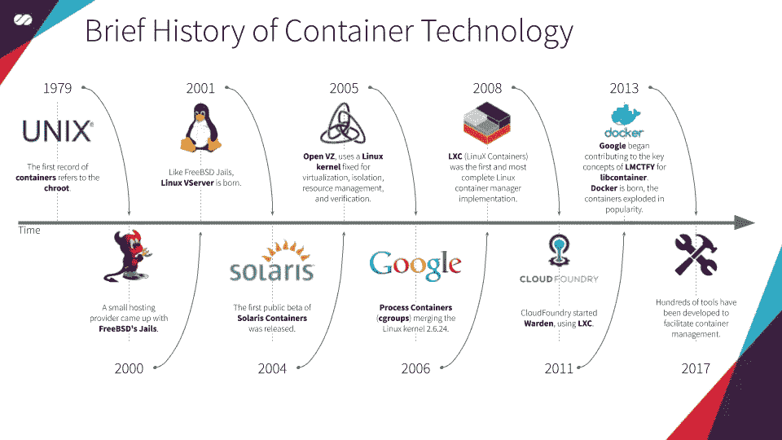
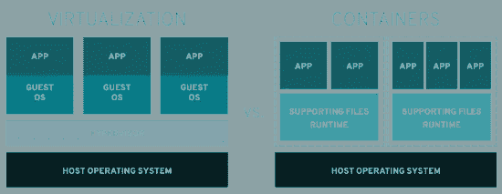

# Kubernetes 之旅—启动并运行云技术堆栈

> 原文：<https://itnext.io/kubernetes-journey-up-and-running-out-of-the-cloud-technology-stack-9c472aafac4e?source=collection_archive---------3----------------------->

凯文·Ku 在 [Unsplash](https://unsplash.com/search/photos/network-architecture?utm_source=unsplash&utm_medium=referral&utm_content=creditCopyText) 上的照片

在本文中，我们将介绍将成为我们技术堆栈一部分的每个组件。我强烈建议您通过参考链接更好地理解每个组件的作用以及它们如何适应我们的架构。

在[的上一篇文章](https://medium.com/@mtvallim/kubernetes-journey-up-and-running-out-of-the-cloud-architecture-overview-e75763b54922)中，我们看了一下我们解决方案的架构，并介绍了集群的概念及其最常见的类型。

这些文章是我们 [Kubernetes 之旅](https://medium.com/@mtvallim/kubernetes-journey-up-and-running-out-of-the-cloud-introduction-f04a811c92a5)的一部分。我希望您对深入研究如何从云中安装和配置 Kubernetes 感到兴奋！

如果你不想等到所有的文章都发表了，又想马上动手，可以随意克隆项目的 Github repo。它完全实用，文档也在不断改进:

 [## 罩下的姆瓦利姆/库伯内特斯

### 本教程是有人计划安装一个 Kubernetes 集群，并希望了解一切如何配合在一起…

github.com](https://github.com/mvallim/kubernetes-under-the-hood) 

# HAProxy

*“ha proxy 是一款免费、非常快速和可靠的解决方案，为基于 TCP 和 HTTP 的应用程序提供高可用性、负载平衡和代理。它特别适用于高流量的网站，并为世界上许多访问量最大的网站提供支持。多年来，它已经成为事实上的标准开源负载平衡器，现在与大多数主流 Linux 发行版一起提供，并且通常默认部署在云平台中。因为它不做广告，我们只知道它在管理员报告时被使用:-)"*

> 参考:[http://www.haproxy.org/](http://www.haproxy.org/)

我们将使用 **HAProxy** 为 **Kubernetes API** 创建一个**负载平衡器(LB)**——正如我们在[上一篇文章](https://medium.com/@mtvallim/kubernetes-journey-up-and-running-out-of-the-cloud-architecture-overview-e75763b54922)中提到的。

让我们想象一个场景:如果我们只有一个 **HAProxy** 实例执行负载平衡，会发生什么？我们会在我们的架构中引入单点故障( [SPOF](https://en.wikipedia.org/wiki/Single_point_of_failure) )。我的意思是，如果由于任何原因，这个单一的 **HAProxy** 失败了，我们将完全失去对 **Kubernetes API** 的访问权。当然，鉴于这个组件对我们的解决方案的重要性，这是我们希望不惜一切代价避免的情况。

为了解决这个问题， **HAProxy** 将成为由**浮动 IP** 驱动的**高可用性集群(HA)** 的一部分，并且至少配置了两个 HAProxy 服务，正如在[上一篇文章](https://medium.com/@mtvallim/kubernetes-journey-up-and-running-out-of-the-cloud-architecture-overview-e75763b54922)中已经介绍的那样。

总之，我们将为**负载平衡**创建一个**高可用性集群**。

# 科罗 sync

*“Corosync 集群引擎是一个群组通信系统，具有在应用程序中实现高可用性的附加功能。
Corosync 被 Apache Qpid 和 Pacemaker 等项目用作高可用性框架。”*

> 参考:[https://clusterlabs.org/corosync.html](https://clusterlabs.org/corosync.html)

**Corosync** 有两个主要目的:**保持集群的状态**(知道节点何时加入或离开集群)和**向所有集群成员分发消息。**

## 保持集群的状态

**节点加入集群**

要更新集群状态，集群的所有节点都应该安装有 **Corosync** ，并以相同的方式进行配置。因此，每次包含 **Corosync** 的节点启动时，想象以下对话发生:

*   新节点发送广播消息说:*“那里有 Corosync 成员吗？”*
*   网络中现有的 **Corosync** 实例接收消息并响应:*“我在这里！”*
*   新节点接收来自这些现有实例的响应，并说:*“你好！我想加入集群。这是我的证件！”*
*   现有的 **Corosync** 实例接收该请求加入消息，评估所接收的凭证(配置),并基于法定人数配置决定新实例是否应该被这个“非常特殊的俱乐部”接受。

**一个节点离开集群**

在一个节点加入这个“非常特别的俱乐部”后，它开始了解所有其他节点。同样，所有其他节点都知道新节点，就像它们已经知道所有以前的成员一样。

为了知道节点何时离开集群， **Corosync** 持续监控节点成员的健康状况。为此，想象以下场景:

*   每个节点都有一个包含所有其他节点地址的列表；
*   每个节点将与其本地列表中的节点进行交互；
*   如果由于任何原因，该节点不能与本地列表中的给定节点交互，那么它将认为该节点是不健康的；
*   然后，该节点将咨询所有其他成员，以检查他们如何看到这个潜在的不健康节点。
*   每个节点将有一个投票，从他们的角度来看，该节点是健康的还是不健康的。
*   **Corosync** 然后将根据收到的投票评估法定人数配置，以决定该节点应标记为健康还是不健康。
*   如果节点被标记为不健康，群集仍会知道它，但在它处于这种状态时不会使用它。

# 起搏器

Pacemaker 是一个开源的、高可用性的资源管理器，适用于小型和大型集群

> 参考:[https://clusterlabs.org/pacemaker/](https://clusterlabs.org/pacemaker/)

> 面向 Linux 平台的权威开源高可用性堆栈构建在 Pacemaker 集群资源管理器之上。”— LINUX 杂志

**Pacemaker** 在由 **Corosync** 创建和管理的集群中创建和配置资源。

这里**起搏器**的主要目的是使我们的**装载机平衡器**高度可用**。**为此，我们将使用 Pacemaker 声明一个**浮动 IP** 和一个 **HAProxy** 资源，这两个资源都将设置在由 **Corosync** 集群管理的节点中。

**Pacemaker** 使用声明式方法。这意味着我们将创建一个配置文件，指定每个节点上应该存在哪些资源，以及这些资源如何相互关联。在我们的例子中，这种关系是**浮动 IP** 和 **HAProxy** 资源之间的相互依赖关系。这意味着他们相互依赖。如果**h proxy**在同一个节点中处于活动状态，则**浮动 IP** 应仅在给定节点中处于活动状态，反之亦然。

简而言之，当一个节点处于主动模式时，我们希望将**浮动 IP** 和 **HAProxy** 分配给它并在其上执行，而所有其他节点将处于被动模式，直到该节点或连接到它的资源由于任何原因发生故障。当发生这种情况时，分配给主动节点的资源被“迁移”到(或在其上启动)一个被动节点，在该被动节点上可以满足所有依赖条件。一旦发生这种情况，选定的节点将成为主动节点，而之前的主动节点将转换为被动状态。查看下面的动画:

# dnsmasq

*“DNS masq 为小型网络提供网络基础设施:DNS、DHCP、路由器广告和网络引导。它被设计成轻量级的，占用空间小，适用于资源受限的路由器和防火墙。它还被广泛用于智能手机和便携式热点上的网络共享，以及支持虚拟化框架中的虚拟网络。支持的平台包括 Linux(带有 glibc 和 uclibc)、Android、*BSD 和 Mac OS X，Dnsmasq 包含在大多数 Linux 发行版以及 FreeBSD、OpenBSD 和 NetBSD 的端口系统中。Dnsmasq 提供全面的 IPv6 支持。*

> 参考:[http://thekelleys.org.uk/dnsmasq/doc.html](http://thekelleys.org.uk/dnsmasq/doc.html)

我们将使用 **dnsmasq** 为我们的主机(节点)提供 **DNS** 和 **DHCP** 功能。

*   [**DHCP**](https://en.wikipedia.org/wiki/Dynamic_Host_Configuration_Protocol) 将负责为每个加入网络的新主机(节点)分配 IP 地址和网络配置。这消除了为加入网络的每个新主机创建太多设置的需要以及手动这样做的需要。主机向网络 执行 [*广播，并且 **DHCP** 服务以所需的设置进行响应。(查看下面的动画)*](https://en.wikipedia.org/wiki/Broadcasting_(networking))
*   [**DNS**](https://en.wikipedia.org/wiki/Domain_Name_System) 负责解析我们内部网络以及公共互联网中的域名。

**DHCP** 和 **DNS** 将同步工作；也就是说，对于每个加入网络的新主机， **DHCP** 使用该主机名到其提供的 IP 的映射来更新 **DNS** 服务，因此我们可以通过其名称——而不是其 IP——来引用新主机，而不用担心其 IP 地址。

作为一个更实际的例子，考虑当我们在云平台(GCP、AWS、Azure 等)上创建一个新实例时通常会发生什么。创建的每个新实例都会立即在内部 **DNS** 中接收 IP、DNS 解析器、路由和主机名注册。说到底，是 **DHCP** ，连同 **DNS** ，谁在幕后为我们做这项工作。

# VirtualBox

*“VirtualBox 是一款功能强大的 x86 和 AMD64/Intel64 虚拟化产品，适合企业和家庭使用。VirtualBox 不仅是面向企业客户的功能极其丰富、高性能的产品，它还是唯一一个根据 GNU 通用公共许可证(GPL)第 2 版条款作为开源软件免费提供的专业解决方案。”*

> 参考:[https://www.virtualbox.org/](https://www.virtualbox.org/)

好吧，由于我们无法访问实际的裸机服务器，我们将使用 **VirtualBox** (一种开源替代产品)来模拟我们数据中心的机器和网络。

这个技术栈是我们练习这一系列文章中所展示的概念所需要的。

# 云初始化

*“cloud-init 是在 GPLv3 开源许可证和 Apache 许可证版本 2.0 下作为自由软件开发和发布的。它最初是为 Amazon EC2 中 Linux 的 Ubuntu 发行版设计的，但现在在每个主流云中的许多 Linux 和 UNIX 发行版上都支持它。”*

> *参考:*[*https://cloud-init.io/*](https://cloud-init.io/)

**cloud-init** 是用于实例初始化的实用程序。它允许在初始化实例时自动配置实例，在几秒钟内快速、轻松地将 Linux 的通用映像转换为已配置的服务器。

最新 Linux 发行版中可用的 **cloud-init** 实用程序能够执行服务、用户和包的设置。 [**用户数据**](https://cloudinit.readthedocs.io/en/latest/topics/examples.html) 脚本最流行的格式之一是**云配置**文件格式。

**云配置**文件是由**云初始化工具**处理的特殊脚本。它们通常用于在服务器第一次启动时设置服务器。

我们可以在下面看到 **cloud-init** 的动作(*提示:你可以降低视频速度来查看更多细节*):

# LVM

***“LVM****表示逻辑卷管理器。*

***什么是逻辑卷管理？*** *与传统的磁盘和分区视图相比，逻辑卷管理为计算机系统上的磁盘存储提供了更高层次的抽象。这使得系统管理员在为应用程序和用户分配存储时更加灵活。*

*在逻辑卷管理器的控制下创建的存储卷几乎可以随意调整大小和移动。”*

> 参考:[http://tldp.org/HOWTO/LVM-HOWTO/](http://tldp.org/HOWTO/LVM-HOWTO/)

假设您的公司要租用会议中心。在这些地点举办的会议规模不一，从大型活动如 Google I/O 和 AWS re:Invent 到小型活动如年度“你可以想象的任何花哨的会议”都有。

为了最大限度地利用这些空间，每个场馆基本上都是一个巨大的机库，没有任何固定的空间划分。有了这种配置，您的公司就可以将空间划分成大小不同的更小的插槽。

例如，想象一下 Google I/O。在会议期间，可以配置更大的位置来主持主题演讲，并且在这些会议结束后，可以将空间重新配置成更小的部分来举行活动的其他会议。

这基本上就是 LVM 允许我们对磁盘做的事情。LVM 允许我们配置我们的服务器，而不必事先知道它们的预期用途。我们不需要知道它们将运行什么服务，也不需要知道这些服务将产生多少数据。它还允许我们实时操作和调整音量，就像上面会议中场地空间分配的例子一样。

在我们的具体例子中，由于我们将创建一个虚拟机映像，它将成为许多其他映像(Gateway、HAProxy、Kubernetes 主/工作节点和 Gluster)的基础，每个服务都有自己的空间需求(在本例中，我们的插槽将是/var、/usr、/tmp、/opt 等)， **LVM** 将为我们提供根据需要调整分区卷大小的灵活性，而不必提前担心这些细节。

LVM 扩展概念在实践中

# 格鲁斯特

“Gluster 是一个免费的开源软件可扩展网络文件系统。”

> 参考:[https://www.gluster.org/](https://www.gluster.org/)

你可以在[上一篇](https://medium.com/@mtvallim/kubernetes-journey-up-and-running-out-of-the-cloud-architecture-overview-e75763b54922)中看到 **Gluster** 的目的。

# 码头工人

****Docker****是一组互操作的* [*软件即服务*](https://en.wikipedia.org/wiki/Software-as-a-service) *和* [*平台即服务*](https://en.wikipedia.org/wiki/Platform-as-a-service) *产品，这些产品采用* [*操作系统级虚拟化*](https://en.wikipedia.org/wiki/Operating-system-level_virtualization) *来开发和交付标准化软件包内的软件托管容器的软件被称为* ***Docker 引擎*** *。它于 2013 年首次启动，由* [*Docker，Inc.*](https://en.wikipedia.org/wiki/Docker,_Inc.) *开发，该服务有免费和高级两个等级。**

> *参考:[https://en . Wikipedia . org/wiki/Docker _(软件)](https://en.wikipedia.org/wiki/Docker_(software))
> 参考:[https://www.docker.com/](https://www.docker.com/)*

*Docker 最初是基于 [LXC](https://linuxcontainers.org/lxc/introduction/) 技术开发的，但已经独立。它提供的不仅仅是运行容器:它使创建、构建、上传和控制版本映像变得容易。*

**

*以上是摘自维基百科和[其他来源](http://pivotal.io/platform/infographic/moments-in-container-history)的容器历史的简要总结*

*这本质上是一种将软件打包成容器格式的方法。但这意味着什么呢？这意味着您的所有软件及其依赖项(如库、配置等)都包含在这个容器中，这使得移植您的应用程序更加容易，而不必担心应用程序部署到的环境中的潜在差异。*

*这种方法的一大优点是，您可以在任何其他环境或新机器中启动您的容器，而不会出现意外错误或额外的配置，因为您的应用程序需要的所有东西都打包在同一个容器中。这样，容器的管理就变得:可预测、可重复、不可改变。*

*有些人可能会说，通过虚拟化也可以实现同样的目标。这种假设是正确的，结果实际上是一样的，但这里最大的不同是我们更好地利用了我们的资源。使用容器，我们能够共享我们的操作系统资源，不再需要整个操作系统来托管我们的应用程序。为了更好地理解这个概念，请看下图:*

**

*图片作者:[https://www.redhat.com](https://www.redhat.com/)*

*所有这些听起来真的很棒，但是当我有一个运行在 **Docker** 容器上的应用生态系统时会发生什么呢？这使得我们的管理工作非常低效、乏味且容易出错。那是**库伯内特斯**加入派对的地方。Kubernetes 是一个开源的容器编排系统，用于自动化应用程序的部署、扩展和管理，能够智能和干净地管理容器。*

# *库伯内特斯*

**“Kubernetes(K8s)是一个用于自动化部署、扩展和管理容器化应用的开源系统。”**

> *参考:[https://kubernetes.io/](https://kubernetes.io/)*

*正如我们在上面看到的，Kubernetes 是一个用于自动化应用程序部署、伸缩和管理的开源容器编排系统，能够智能和干净地管理容器。*

*我们将在本系列的下一篇文章中详细介绍 **Kubernetes** 的内部原理。*

**

# *一种自由操作系统*

*Debian 是你电脑的免费操作系统。操作系统是使计算机运行的一组基本程序和实用程序*

> *参考:[https://www.debian.org/](https://www.debian.org/)*

# *人的本质*

*Ubuntu 是一个开源软件操作系统，它可以运行在桌面、云端以及所有与互联网相连的东西上*

> *参考:[https://www.ubuntu.com/](https://www.ubuntu.com/)*

*我希望你喜欢这篇文章以及这个系列的其他文章。在下一篇文章中，我们将定义我们的网络拓扑，并为后面的文章打下基础。*

*不要忘记在下面的评论中留下你的反馈。不断完善这一系列的内容非常重要。*

*我再次强烈推荐您关注我的 Medium，这样您就不会错过本系列中发表的任何新文章。如果你错过了这个系列的第一篇文章，你可以在这里查看。*

*回头见！！*

*再见*