# Kubernetes:负载测试和高负载调优—问题和解决方案

> 原文：<https://itnext.io/kubernetes-load-testing-and-high-load-tuning-problems-and-solutions-244d869a9791?source=collection_archive---------2----------------------->


实际上，这篇文章是一篇关于使用`[NodeAffinity](https://kubernetes.io/docs/concepts/scheduling-eviction/assign-pod-node/)`作为 Kubernetes Pod 的简短说明:

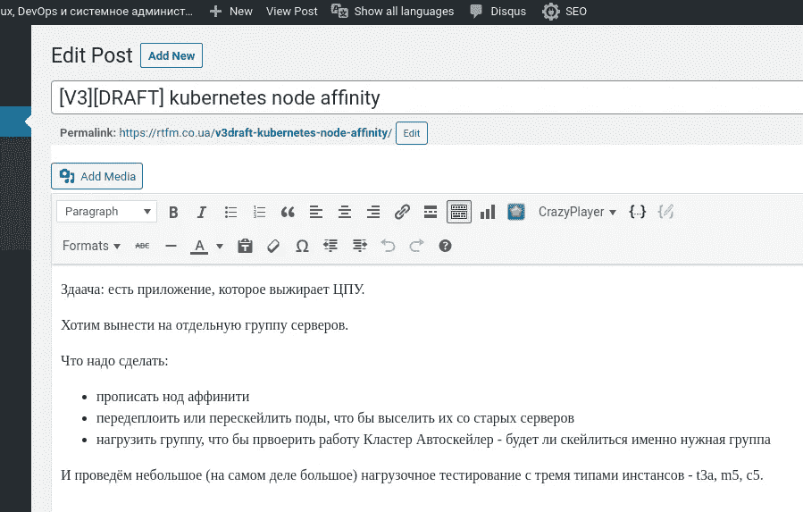

但是，就像经常发生的那样，在开始写一件事情之后，我面临着另一件事情，然后又是另一件事情，结果——我写了这篇关于 Kubernetes 负载测试的文章。

所以，我已经开始讨论 NodeAffinity，但是我想知道 Kubernetes `[cluster-autoscaler](https://github.com/kubernetes/autoscaler/tree/master/cluster-autoscaler)`将如何工作——它将在新的 WorkerNodes 创建期间考虑 NodeAffinity 设置吗？

为了检查这一点，我使用 [Apache Benchmark](https://rtfm.co.ua/apache-bench-testiruem-rabotu-veb-servera/) 进行了一个简单的负载测试，以触发[Kubernetes HorizontalPodAutoscaler](https://rtfm.co.ua/kubernetes-horizontalpodautoscaler-obzor-i-primery/)来创建新的 pod，这些新的 pod 必须触发`[cluster-autoscaler](https://github.com/kubernetes/autoscaler/tree/master/cluster-autoscaler)`来创建新的 AWS EC2 实例，这些实例将作为 WorkerNodes 附加到 Kubernetes 集群。

然后，我开始了一个更复杂的负载测试，并面临一个问题，当豆荚停止伸缩。

然后……我决定在进行负载测试时，测试各种 AWS EC2 实例类型——T3、M5、C5——可能是个好主意。当然，需要添加这个职位的结果。

在这之后——我们已经开始满负荷测试，并面临一些其他问题，显然我必须写下我是如何解决这些问题的。

最后，这篇文章是关于 Kubernetes 负载测试，EC2 实例类型，网络和 DNS，以及 Kubernetes 集群中高负载应用的一些其他内容。

**注** : `kk`此处:`alias kk="kubectl" > ~/.bashrc`

*   [任务](https://rtfm.co.ua/en/kubernetes-load-testing-and-high-load-tuning-problems-and-solutions/#The_Task)
*   [选择 EC2 类型](https://rtfm.co.ua/en/kubernetes-load-testing-and-high-load-tuning-problems-and-solutions/#Choosing_an_EC2_type)
*   [EC2 AMD 实例](https://rtfm.co.ua/en/kubernetes-load-testing-and-high-load-tuning-problems-and-solutions/#EC2_AMD_instances)
*   [EC2 引力子实例](https://rtfm.co.ua/en/kubernetes-load-testing-and-high-load-tuning-problems-and-solutions/#EC2_Graviton_instances)
*   [eksctl 和 Kubernetes 工人节点组](https://rtfm.co.ua/en/kubernetes-load-testing-and-high-load-tuning-problems-and-solutions/#eksctl_and_Kubernetes_WorkerNode_Groups)
*   [测试计划](https://rtfm.co.ua/en/kubernetes-load-testing-and-high-load-tuning-problems-and-solutions/#The_Testing_plan)
*   [Kubernetes node affinity&节点选择器](https://rtfm.co.ua/en/kubernetes-load-testing-and-high-load-tuning-problems-and-solutions/#Kubernetes_NodeAffinity_nodeSelector)
*   [部署更新](https://rtfm.co.ua/en/kubernetes-load-testing-and-high-load-tuning-problems-and-solutions/#Deployment_update)
*   [通过自定义标签选择节点](https://rtfm.co.ua/en/kubernetes-load-testing-and-high-load-tuning-problems-and-solutions/#nodeSelector_by_a_custom_label)
*   [俱吠罗标签的节点选择器](https://rtfm.co.ua/en/kubernetes-load-testing-and-high-load-tuning-problems-and-solutions/#nodeSelector_by_Kuber_label)
*   [测试 AWS EC2 t3 vs m5 vs c5](https://rtfm.co.ua/en/kubernetes-load-testing-and-high-load-tuning-problems-and-solutions/#Testing)
*   [Kubernetes node affinity vs Kubernetes cluster auto scaler](https://rtfm.co.ua/en/kubernetes-load-testing-and-high-load-tuning-problems-and-solutions/#Kubernetes_NodeAffinity_vs_Kubernetes_ClusterAutoscaler)
*   [负载测试](https://rtfm.co.ua/en/kubernetes-load-testing-and-high-load-tuning-problems-and-solutions/#Load_Testing)
*   第一天
*   [第二天](https://rtfm.co.ua/en/kubernetes-load-testing-and-high-load-tuning-problems-and-solutions/#Day_2)
*   [net/http:请求已取消(客户端。等待标题时超时)](https://rtfm.co.ua/en/kubernetes-load-testing-and-high-load-tuning-problems-and-solutions/#net/http_request_canceled_(Client_Timeout_exceeded_while_awaiting_headers))
*   [AWS RDS —“连接被拒绝”](https://rtfm.co.ua/en/kubernetes-load-testing-and-high-load-tuning-problems-and-solutions/#AWS_RDS_%E2%80%93_%E2%80%9CConnection_refused%E2%80%9D)
*   [AWS RDS 最大连接数](https://rtfm.co.ua/en/kubernetes-load-testing-and-high-load-tuning-problems-and-solutions/#AWS_RDS_max_connections)
*   [第三天](https://rtfm.co.ua/en/kubernetes-load-testing-and-high-load-tuning-problems-and-solutions/#Day_3)
*   [Kubernetes 活性和准备就绪探测器](https://rtfm.co.ua/en/kubernetes-load-testing-and-high-load-tuning-problems-and-solutions/#Kubernetes_Liveness_and_Readiness_probes)
*   [Kubernetes:Docker 的 PHP 日志](https://rtfm.co.ua/en/kubernetes-load-testing-and-high-load-tuning-problems-and-solutions/#Kubernetes_PHP_logs_from_Docker)
*   [第一次测试](https://rtfm.co.ua/en/kubernetes-load-testing-and-high-load-tuning-problems-and-solutions/#The_First_Test)
*   [PHP _ network _ get addresses:get addrinfo 失败и DNS](https://rtfm.co.ua/en/kubernetes-load-testing-and-high-load-tuning-problems-and-solutions/#phpnetworkgetaddresses_getaddrinfo_failed_%D0%B8_DNS)
*   [Kubernetes dnsPolicy](https://rtfm.co.ua/en/kubernetes-load-testing-and-high-load-tuning-problems-and-solutions/#Kubernetes_dnsPolicy)
*   [在 Kubernetes 中运行 node local DNS](https://rtfm.co.ua/en/kubernetes-load-testing-and-high-load-tuning-problems-and-solutions/#Running_a_NodeLocal_DNS_in_Kubernetes)
*   [Kubernetes Pod DNS config&&名称服务器](https://rtfm.co.ua/en/kubernetes-load-testing-and-high-load-tuning-problems-and-solutions/#Kubernetes_Pod_dnsConfig_nameservers)
*   [第二次考验](https://rtfm.co.ua/en/kubernetes-load-testing-and-high-load-tuning-problems-and-solutions/#The_Second_Test)
*   [阿帕奇 JMeter и Grafana](https://rtfm.co.ua/en/kubernetes-load-testing-and-high-load-tuning-problems-and-solutions/#Apache_JMeter_%D0%B8_Grafana)

# 任务

所以，我们有一个真正热爱 CPU 的应用。

PHP，Laravel。目前，它在数字海洋的 50 个正在运行的水滴上运行，加上 NFS 共享，Memcache，Redis 和 MySQL。

我们想要的是将此应用程序迁移到 AWS EKS 的 Kubernetes 集群，以节省一些基础架构方面的资金，因为 DigitalOcean 的当前集群花费我们大约 4.000 美元/月，而一个 AWS EKS 集群花费我们大约 500-600 美元(集群本身，加上 4 个 AWS *t3.medium* EC2 实例，用于两个独立的 AWS AvailabilityZones 中的 WorkerNodes，总共 8 个 EC2)。

使用 DigitalOcean 上的这个设置，应用程序停止在 12.000 个模拟用户上工作(每小时 48.000)。

我们希望通过自动缩放功能在我们的 AWS EKS 上保持多达 15，000 个用户(60，000/小时，1，440，000/天)。

该项目将存在于一个专用的 WorkerNodes 组中，以避免影响集群中的其他应用程序。为了只在那些 worker 节点上创建新的 pod，我们将使用`NodeAffinity`。

此外，我们将使用三种不同的 AWS Ec2 实例类型执行负载测试— **t3** 、 **m5** 、 **c5** ，以选择哪一个更适合我们的应用程序需求，并将执行另一个负载测试来检查 HorizontalPodAutoscaler 和`cluster-autoscaler`将如何工作。

# 选择 EC2 类型

我们用哪一个？

*   **т3**？可突发处理器，良好的价格/CPU/内存比，适合大多数需求:
    [T3 实例](https://aws.amazon.com/ec2/instance-types/t3/)是下一代[可突发通用实例类型](https://aws.amazon.com/ec2/instance-types/#Burstable_Performance_Instances)，提供基准级别的 CPU 性能，能够根据需要随时突发 CPU 使用。
*   **м5**？最适合内存消耗型应用—更多 RAM，更少 CPU:
    [M5 实例](https://aws.amazon.com/ec2/instance-types/m5/)是由英特尔至强白金 8175M 处理器驱动的最新一代通用实例。该系列提供了计算、内存和网络资源的平衡，是许多应用程序的良好选择。
*   **с5**？最适合 CPU 应用—与 M5 类型相比，CPU 内核更多，处理器更好，但内存更少:
    [C5 实例](https://aws.amazon.com/ec2/instance-types/c5/)针对计算密集型工作负载进行了优化，以较低的单位计算成本提供了经济高效的高性能。

先说 T3a——比常见的 T3 便宜一点。

## EC2 AMD 实例

AWS 为基于 AMD 的处理器实例(t3a、m5a、c5a)提供几乎相同的 CPU/内存/网络，它们的成本稍低，但并非在每个地区都可用，甚至不是在同一 AWS 地区的所有可用区域都可用。

例如，在 AWS 区域 *us-east-2* c5a 在 *us-east-2b* 和*us-east-2c*availability zones 中可用，但仍不能在 *us-east-2a* 中使用。由于我现在不想改变我们的自动化(可用性区域是在供应期间选择的，请参见 [AWS: CloudFormation —使用参数中的列表](https://rtfm.co.ua/en/aws-cloudformation-using-lists-in-parameters/) ) —那么我们将使用常见的 T3 类型。

## EC2 引力子实例

除此之外，AWS [引入了带有](https://aws.amazon.com/blogs/compute/improving-performance-of-php-for-arm64-and-impact-on-amazon-ec2-m6g-instances/) [AWS Graviton2 处理器](http://aws.amazon.com/ec2/graviton)的 *m6g* 和 *c6g* 实例类型，但是要使用它们，您的集群必须满足一些限制，查看文档[此处> > >](https://docs.aws.amazon.com/eks/latest/userguide/eks-optimized-ami.html#arm-ami) 。

现在，让我们继续用 t3、m5 和 c5 实例创建三个 WorkerNode 组，并检查我们的应用程序在每个实例上的 CPU 消耗。

# `eksctl`和 Kubernetes WorkerNode 组

我们的 WorkerNode 组的配置文件如下所示:

```
---
apiVersion: eksctl.io/v1alpha5
kind: ClusterConfig

metadata:
  name: "{{ eks_cluster_name }}"
  region: "{{ region }}"
  version: "{{ k8s_version }}"

nodeGroups:

  - name: "eat-test-t3-{{ item }}"
    instanceType: "t3.xlarge"
    privateNetworking: true
    labels: { role: eat-workers }
    volumeSize: 50
    volumeType: gp2
    desiredCapacity: 1
    minSize: 1
    maxSize: 1
    availabilityZones: ["{{ item }}"]
    ssh:
      publicKeyName: "bttrm-eks-nodegroup-{{ region }}"
    iam:
      withAddonPolicies:
        autoScaler: true
        cloudWatch: true
        albIngress: true
        efs: true
    securityGroups:
      withShared: true
      withLocal: true
      attachIDs: [ {{ worker_nodes_add_sg }} ]

  - name: "eat-test-m5-{{ item }}"
    instanceType: "m5.xlarge"
    privateNetworking: true
    labels: { role: eat-workers }
    volumeSize: 50
    volumeType: gp2
    desiredCapacity: 1
    minSize: 1
    maxSize: 1
    availabilityZones: ["{{ item }}"]
    ssh:
      publicKeyName: "bttrm-eks-nodegroup-{{ region }}"
    iam:
      withAddonPolicies:
        autoScaler: true
        cloudWatch: true
        albIngress: true
        efs: true
    securityGroups:
      withShared: true
      withLocal: true
      attachIDs: [ {{ worker_nodes_add_sg }} ]

  - name: "eat-test-c5-{{ item }}"
    instanceType: "c5.xlarge"
    privateNetworking: true
    labels: { role: eat-workers }
    volumeSize: 50
    volumeType: gp2
    desiredCapacity: 1
    minSize: 1
    maxSize: 1
    availabilityZones: ["{{ item }}"]
    ssh:
      publicKeyName: "bttrm-eks-nodegroup-{{ region }}"
    iam:
      withAddonPolicies:
        autoScaler: true
        cloudWatch: true
        albIngress: true
        efs: true
    securityGroups:
      withShared: true
      withLocal: true
      attachIDs: [ {{ worker_nodes_add_sg }} ]
```

这里我们有三个工作节点组，每个都有自己的 EC2 类型。

使用 Ansible 和`eksctl`描述部署，参见 [AWS 弹性 Kubernetes 服务:集群创建自动化，第 2 部分-ansi ble，eksctl](https://rtfm.co.ua/en/aws-elastic-kubernetes-service-a-cluster-creation-automation-part-2-ansible-eksctl/) 文章，在两个不同的可用性区域中。

将`minSize`和`maxSize`设置为 *1* ，这样我们的集群自动缩放器就不会开始缩放它们——在请求测试时，我希望看到一个 CPU 在一个 EC2 实例上的负载，并对 pod 和节点运行`kubectl top`。

之后，我们将选择最适合我们的 EC2 类型—将删除其他 WorkerNode 组，并将启用自动缩放。

# 测试计划

我们将测试什么以及如何测试:

*   PHP，Laravel，打包成一个 Docker 映像
*   所有服务器都有 4 个 CPU 内核和 16 GB 内存(不包括 C5–8 GB 内存)
*   在使用`[requests](https://cloud.google.com/blog/products/gcp/kubernetes-best-practices-resource-requests-and-limits)`的应用程序部署中，我们将设置每个 WorkerNode 只运行一个 pod，方法是使用一半的 CPU，因此 Kubernetes 调度程序必须将一个 pod 放在一个专用的 WorkerNode 实例上
*   通过使用`NodeAffinity`,我们将设置只在必要的工作节点上运行我们的 pod
*   pods 和集群自动扩展暂时被禁用

我们将创建三个具有不同 EC2 类型的 WorkerNode 组，并将应用程序部署到四个 Kubernetes 名称空间中——一个“默认”,每个实例类型三个。

在每一个这样的名称空间中，里面的应用程序将被配置为使用`NodeAffinity`在必要的 EC2 类型上运行。

通过这样做，我们将拥有四个带有 [AWS 负载平衡器的`Ingress`资源，](https://rtfm.co.ua/en/aws-elastic-kubernetes-service-running-alb-ingress-controller/)参见[Kubernetes:cluster IP vs node port vs 负载平衡器、服务和入口–示例概述](https://rtfm.co.ua/en/kubernetes-clusterip-vs-nodeport-vs-loadbalancer-services-and-ingress-an-overview-with-examples/)，我们将拥有四个测试端点。

# kubernetes no affinity & &`nodeSelector`

文档— [将 pod 分配给节点](https://kubernetes.io/docs/concepts/scheduling-eviction/assign-pod-node/)。

为了选择 Kubernetes 必须在哪个 WorkerNode 上运行 pod，我们可以使用两种标签类型——由我们自己创建的标签或由 Kubernetes 自己分配给 worker node 的标签。

在 WorkerNodes 的配置文件中，我们设置了这样一个标签:

```
...
labels: { role: eat-workers }
...
```

它将被附加到在这个 WorkerNode 组中创建的每个 EC2。

更新集群:


让我们检查一个实例上的所有标签:

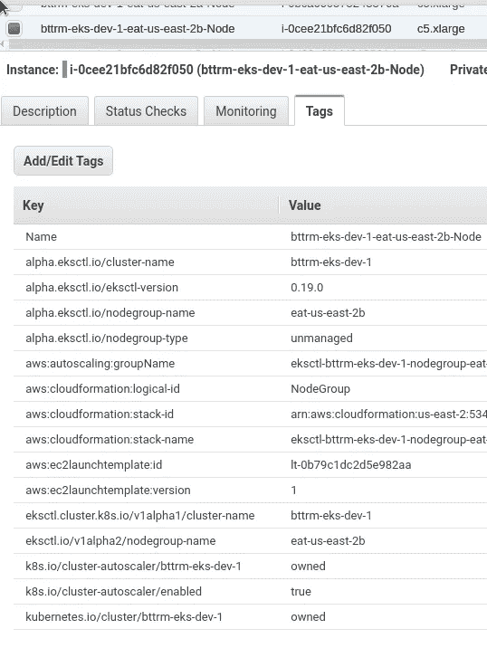

让我们检查来自`eksctl`的工作节点组:

```
$ eksctl — profile arseniy — cluster bttrm-eks-dev-1 get nodegroups
CLUSTER NODEGROUP CREATED MIN SIZE MAX SIZE DESIRED CAPACITY INSTANCE TYPE IMAGE ID
bttrm-eks-dev-1 eat-test-c5-us-east-2a 2020–08–20T09:29:28Z 1 1 1 c5.xlarge ami-0f056ad53eddfda19
bttrm-eks-dev-1 eat-test-c5-us-east-2b 2020–08–20T09:34:54Z 1 1 1 c5.xlarge ami-0f056ad53eddfda19
bttrm-eks-dev-1 eat-test-m5-us-east-2a 2020–08–20T09:29:28Z 1 1 1 m5.xlarge ami-0f056ad53eddfda19
bttrm-eks-dev-1 eat-test-m5-us-east-2b 2020–08–20T09:34:54Z 1 1 1 m5.xlarge ami-0f056ad53eddfda19
bttrm-eks-dev-1 eat-test-t3-us-east-2a 2020–08–20T09:29:27Z 1 1 1 t3.xlarge ami-0f056ad53eddfda19
bttrm-eks-dev-1 eat-test-t3-us-east-2b 2020–08–20T09:34:54Z 1 1 1 t3.xlarge ami-0f056ad53eddfda19
```

让我们用`-l`检查创建的 worker nodeес2 实例，只选择那些带有我们的自定义标签“ *role: eat-workers* ”的实例，并按照它们的 EC2 类型对它们进行排序:

```
$ kk -n eks-dev-1-eat-backend-ns get node -l role=eat-workers -o=json | jq -r ‘[.items | sort_by(.metadata.labels[“beta.kubernetes.io/instance-type”])[] | {name:.metadata.name, type:.metadata.labels[“beta.kubernetes.io/instance-type”], region:.metadata.labels[“failure-domain.beta.kubernetes.io/zone”]}]’
[
{
“name”: “ip-10–3–47–253.us-east-2.compute.internal”,
“type”: “c5.xlarge”,
“region”: “us-east-2a”
},
{
“name”: “ip-10–3–53–83.us-east-2.compute.internal”,
“type”: “c5.xlarge”,
“region”: “us-east-2b”
},
{
“name”: “ip-10–3–33–222.us-east-2.compute.internal”,
“type”: “m5.xlarge”,
“region”: “us-east-2a”
},
{
“name”: “ip-10–3–61–225.us-east-2.compute.internal”,
“type”: “m5.xlarge”,
“region”: “us-east-2b”
},
{
“name”: “ip-10–3–45–186.us-east-2.compute.internal”,
“type”: “t3.xlarge”,
“region”: “us-east-2a”
},
{
“name”: “ip-10–3–63–119.us-east-2.compute.internal”,
“type”: “t3.xlarge”,
“region”: “us-east-2b”
}
]
```

点击> > >查看更多关于`kubectl`输出的格式[。](https://gist.github.com/so0k/42313dbb3b547a0f51a547bb968696ba)

## 部署更新

## `nodeSelector`通过定制标签

首先，让我们用`labels: { role: eat-workers }`将我们的应用程序部署到所有实例中——Kubernetes 必须在 6 台服务器上创建 pods 每种 EC2 类型两个。

更新部署，添加带有*角色*标签和“*吃人*”值的`nodeSelector`:

```
apiVersion: apps/v1
kind: Deployment
metadata:
  name: {{ .Chart.Name }}
  annotations:
    reloader.stakater.com/auto: "true"
spec:
  replicas: {{ .Values.replicaCount }}
  strategy:
    type: RollingUpdate
  selector:
    matchLabels:
      application: {{ .Chart.Name }}
  template:
    metadata:
      labels:
        application: {{ .Chart.Name }}
        version: {{ .Chart.Version }}-{{ .Chart.AppVersion }}
        managed-by: {{ .Release.Service }}
    spec:
      containers:
      - name: {{ .Chart.Name }}
        image: {{ .Values.image.registry }}/{{ .Values.image.repository }}/{{ .Values.image.name }}:{{ .Values.image.tag }}
        imagePullPolicy: Always
...
        ports:
          - containerPort: {{ .Values.appConfig.port }}
        livenessProbe:
          httpGet:
            path: {{ .Values.appConfig.healthcheckPath }}
            port: {{ .Values.appConfig.port }}
          initialDelaySeconds: 10
        readinessProbe:
          httpGet:
            path: {{ .Values.appConfig.healthcheckPath }}
            port: {{ .Values.appConfig.port }}
          initialDelaySeconds: 10
        resources:
          requests:
            cpu: {{ .Values.resources.requests.cpu | quote }}
            memory: {{ .Values.resources.requests.memory | quote }}
      nodeSelector:
        role: eat-workers
      volumes:
      imagePullSecrets:
        - name: gitlab-secret
```

`replicaCount`设置为 6，按实例数。

部署它:

```
$ helm secrets upgrade --install --namespace eks-dev-1-eat-backend-ns --set image.tag=179217391 --set appConfig.appEnv=local --set appConfig.appUrl=https://dev-eks.eat.example.com/ --atomic eat-backend . -f secrets.dev.yaml --debug
```

检查:

```
$ kk -n eks-dev-1-eat-backend-ns get pod -o=custom-columns=NAME:.metadata.name,STATUS:.status.phase,NODE:.spec.nodeName,TYPE:.spec.nodeSelectorNAME STATUS NODE TYPE
eat-backend-57b7b54d98–7m27q Running ip-10–3–63–119.us-east-2.compute.internal map[role:eat-workers]
eat-backend-57b7b54d98–7tvtk Running ip-10–3–53–83.us-east-2.compute.internal map[role:eat-workers]
eat-backend-57b7b54d98–8kphq Running ip-10–3–47–253.us-east-2.compute.internal map[role:eat-workers]
eat-backend-57b7b54d98-l24wr Running ip-10–3–61–225.us-east-2.compute.internal map[role:eat-workers]
eat-backend-57b7b54d98-ns4nr Running ip-10–3–45–186.us-east-2.compute.internal map[role:eat-workers]
eat-backend-57b7b54d98-sxzk4 Running ip-10–3–33–222.us-east-2.compute.internal map[role:eat-workers]
eat-backend-memcached-0 Running ip-10–3–63–119.us-east-2.compute.internal <none>
```

很好——我们在 6 个工作节点上有 6 个吊舱。

## `nodeSelector`由俱吠罗标注

现在，让我们更新部署以使用由 Kubernetes 本身设置的标签，例如，我们可以使用*beta.kubernetes.io/instance-type*，在这里我们可以设置一个实例类型，我们希望使用它来仅在所选类型的 EC2 上部署一个 pod。

`replicaCount`现在按照相同类型的每个实例设置为 2——将有两个 pod 运行在两个 EC2 上。

删除部署:

```
$ helm --namespace eks-dev-1-eat-backend-ns uninstall eat-backend
release “eat-backend” uninstalled
```

更新清单—添加 *t3* ，这样两个条件都可以工作—T5 和 T6:

```
...
      nodeSelector:
        beta.kubernetes.io/instance-type: t3.xlarge
        role: eat-workers
...
```

让我们将它们部署到三个新的名称空间，并为 t3、m5 和 c5 各添加一个后缀，因此 t3 组的名称将是“*eks-dev-1-eat—back end-ns-****T3***”。

为舵增加`--create-namespace`:

```
$ helm secrets upgrade --install --namespace eks-dev-1-eat-backend-ns-t3 --set image.tag=180029557 --set appConfig.appEnv=local --set appConfig.appUrl=https://t3-dev-eks.eat.example.com/ --atomic eat-backend . -f secrets.dev.yaml --debug --create-namespace
```

对 m5、c5 重复同样的操作，并进行检查。

t3:

```
$ kk -n eks-dev-1-eat-backend-ns-t3 get pod -o=custom-columns=NAME:.metadata.name,STATUS:.status.phase,NODE:.spec.nodeName,TYPE:.spec.nodeSelector
NAME STATUS NODE TYPE
eat-backend-cc9b8cdbf-tv9h5 Running ip-10–3–45–186.us-east-2.compute.internal map[beta.kubernetes.io/instance-type:t3.xlarge role:eat-workers]
eat-backend-cc9b8cdbf-w7w5w Running ip-10–3–63–119.us-east-2.compute.internal map[beta.kubernetes.io/instance-type:t3.xlarge role:eat-workers]
eat-backend-memcached-0 Running ip-10–3–53–83.us-east-2.compute.internal <none>
```

m5:

```
$ kk -n eks-dev-1-eat-backend-ns-m5 get pod -o=custom-columns=NAME:.metadata.name,STATUS:.status.phase,NODE:.spec.nodeName,TYPE:.spec.nodeSelector
NAME STATUS NODE TYPE
eat-backend-7dfb56b75c-k8gt6 Running ip-10–3–61–225.us-east-2.compute.internal map[beta.kubernetes.io/instance-type:m5.xlarge role:eat-workers]
eat-backend-7dfb56b75c-wq9n2 Running ip-10–3–33–222.us-east-2.compute.internal map[beta.kubernetes.io/instance-type:m5.xlarge role:eat-workers]
eat-backend-memcached-0 Running ip-10–3–47–253.us-east-2.compute.internal <none>
```

和 c5:

```
$ kk -n eks-dev-1-eat-backend-ns-c5 get pod -o=custom-columns=NAME:.metadata.name,STATUS:.status.phase,NODE:.spec.nodeName,TYPE:.spec.nodeSelector
NAME STATUS NODE TYPE
eat-backend-7b6778c5c-9g6st Running ip-10–3–47–253.us-east-2.compute.internal map[beta.kubernetes.io/instance-type:c5.xlarge role:eat-workers]
eat-backend-7b6778c5c-sh5sn Running ip-10–3–53–83.us-east-2.compute.internal map[beta.kubernetes.io/instance-type:c5.xlarge role:eat-workers]
eat-backend-memcached-0 Running ip-10–3–47–58.us-east-2.compute.internal <none>
```

测试的一切都准备好了。

# 测试 AWS EC2 t3 与 m5 和 c5

对所有 WorkerNode 组运行相同的测试套件，并观察 pod 的 CPU 消耗。

## t3

豆荚:

```
$ kk top nod-n eks-dev-1-eat-backend-ns-t3 top pod
NAME CPU(cores) MEMORY(bytes)
eat-backend-79cfc4f9dd-q22rh 1503m 103Mi
eat-backend-79cfc4f9dd-wv5xv 1062m 106Mi
eat-backend-memcached-0 1m 2Mi
```

节点:

```
$ kk top node -l role=eat-workers,beta.kubernetes.io/instance-type=t3.xlarge
NAME CPU(cores) CPU% MEMORY(bytes) MEMORY%
ip-10–3–45–186.us-east-2.compute.internal 1034m 26% 1125Mi 8%
ip-10–3–63–119.us-east-2.compute.internal 1616m 41% 1080Mi 8%
```

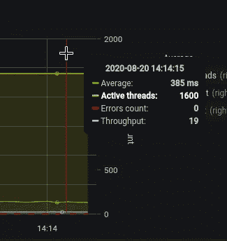

## M5

豆荚:

```
$ kk -n eks-dev-1-eat-backend-ns-m5 top pod
NAME CPU(cores) MEMORY(bytes)
eat-backend-6f5d68778d-484lk 1039m 114Mi
eat-backend-6f5d68778d-lddbw 1207m 105Mi
eat-backend-memcached-0 1m 2Mi
```

节点:

```
$ kk top node -l role=eat-workers,beta.kubernetes.io/instance-type=m5.xlarge
NAME CPU(cores) CPU% MEMORY(bytes) MEMORY%
ip-10–3–33–222.us-east-2.compute.internal 1550m 39% 1119Mi 8%
ip-10–3–61–225.us-east-2.compute.internal 891m 22% 1087Mi 8%
```

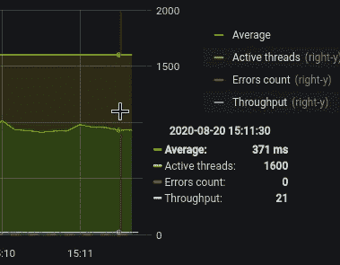

## 溴化五烃季胺

豆荚:

```
$ kk -n eks-dev-1-eat-backend-ns-c5 top pod
NAME CPU(cores) MEMORY(bytes)
eat-backend-79b947c74d-mkgm9 941m 103Mi
eat-backend-79b947c74d-x5qjd 905m 107Mi
eat-backend-memcached-0 1m 2Mi
```

节点:

```
$ kk top node -l role=eat-workers,beta.kubernetes.io/instance-type=c5.xlarge
NAME CPU(cores) CPU% MEMORY(bytes) MEMORY%
ip-10–3–47–253.us-east-2.compute.internal 704m 17% 1114Mi 19%
ip-10–3–53–83.us-east-2.compute.internal 1702m 43% 1122Mi 19%
```

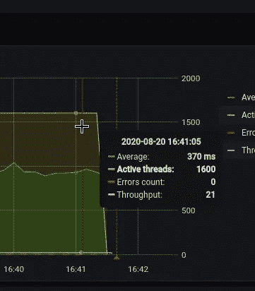

其实就这些了。

结果:

*   **T3**:1000–1500 mCPU，385 毫秒响应
*   **M5**:1000–1200 mCPU，371 毫秒响应
*   **C5**:900–1000 mCPU，370 毫秒响应

所以，让我们现在使用с5 型，因为它们似乎是 CPU 使用率最高的。

# Kubernetes NodeAffinity 与 Kubernetes ClusterAutoscaler

我一直在纠结的一个主要问题是——集群自动伸缩会尊重`NodeAffinity`吗？

展望未来，是的，会的。

我们的`HorizontalPodAutoscaler`看起来是这样的:

```
---         
apiVersion: autoscaling/v2beta2
kind: HorizontalPodAutoscaler
metadata:
  name: {{ .Chart.Name }}-hpa
spec:       
  scaleTargetRef:
    apiVersion: apps/v1
    kind: Deployment
    name: {{ .Chart.Name }}
  minReplicas: {{ .Values.hpa.minReplicas }}
  maxReplicas: {{ .Values.hpa.maxReplicas }}
  metrics:    
  - type: Resource
    resource:
      name: cpu
      target: 
        type: Utilization
        averageUtilization: {{ .Values.hpa.cpuUtilLimit }}
```

`cpuUtilLimit`被设置为 30%,所以当 PHP-FPM 将开始积极使用它的 FPM 工人时，CPU 负载将上升，30%的限制将给我们一些时间来旋转新的 pods 和 EC2 实例，而现有的 pods 将保持现有的连接。

更多详情请参见[Kubernetes:HorizontalPodAutoscaler—示例概述](https://rtfm.co.ua/en/kubernetes-horizontalpodautoscaler-an-overview-with-examples/)帖子。

现在通过使用 Helm 模板及其`values.yaml`来描述`nodeSelector`，查看 [Helm: Kubernetes 包管理器-概述，入门](https://rtfm.co.ua/en/helm-kubernetes-package-manager-an-overview-getting-started/):

```
...
      nodeSelector:
        beta.kubernetes.io/instance-type: {{ .Values.nodeSelector.instanceType | quote }}
        role: {{ .Values.nodeSelector.role | quote }}
...
```

及其`values.yaml`:

```
...
nodeSelector: 
  instanceType: "c5.xlarge"
  role: "eat-workers
...
```

重新创建一切，让我们从全负载测试开始。

在没有任何活动的情况下，接下来是资源消耗:

```
$ kk -n eks-dev-1-eat-backend-ns top pod
NAME CPU(cores) MEMORY(bytes)
eat-backend-b8b79574–8kjl4 50m 55Mi
eat-backend-b8b79574–8t2pw 39m 55Mi
eat-backend-b8b79574-bq8nw 52m 68Mi
eat-backend-b8b79574-swbvq 40m 55Mi
eat-backend-memcached-0 2m 6Mi
```

在 4-х *c5.xlarge* 服务器上(4 个内核，8 GB RAM):

```
$ kk top node -l role=eat-workers
NAME CPU(cores) CPU% MEMORY(bytes) MEMORY%
ip-10–3–34–151.us-east-2.compute.internal 105m 2% 1033Mi 18%
ip-10–3–39–132.us-east-2.compute.internal 110m 2% 1081Mi 19%
ip-10–3–54–32.us-east-2.compute.internal 166m 4% 1002Mi 17%
ip-10–3–56–98.us-east-2.compute.internal 106m 2% 1010Mi 17%
```

前面已经提到过的`HorizontalPodAutoscaler`，на 30% CPU 的请求限制:

```
$ kk -n eks-dev-1-eat-backend-ns get hpa
NAME REFERENCE TARGETS MINPODS MAXPODS REPLICAS AGE
eat-backend-hpa Deployment/eat-backend 1%/30% 4 40 4 6m27s
```

# 负载测试

## 第一天

简而言之，这是整个测试的第一天，总共花了三天时间。

该测试是在四个 *t3a.medium* 实例中执行的，每个 WorkerNode 有相同的 1 个 pod，并启用了 HPA 和集群自动缩放。

一切都很顺利，直到我们达到了 8，000 个同时用户——查看响应时间:

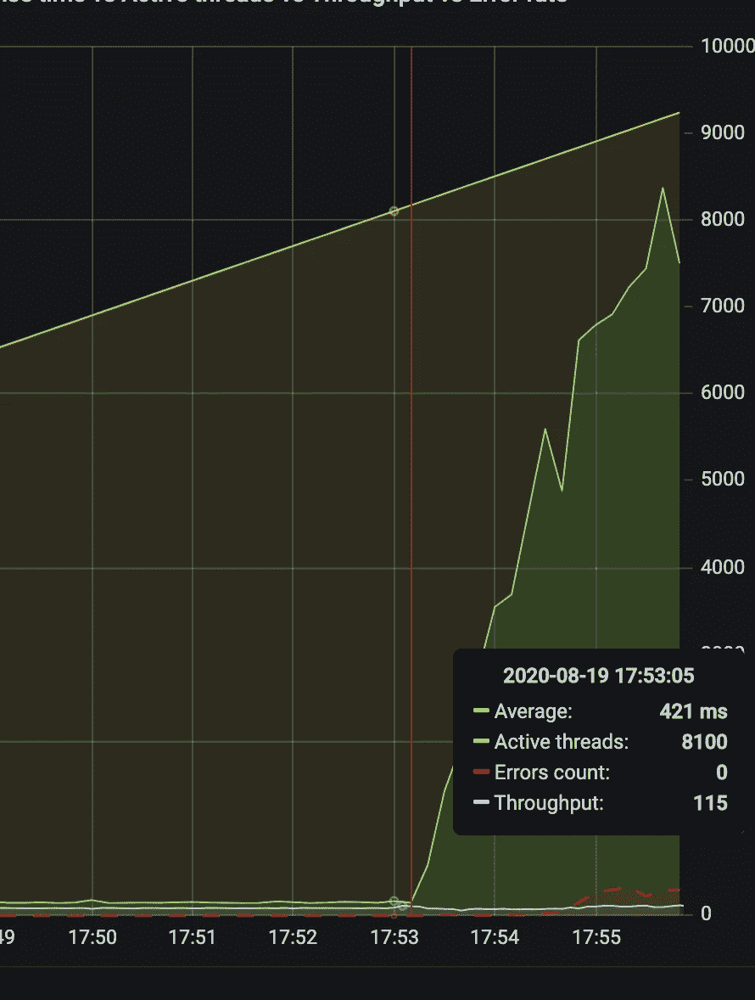

豆荚停止膨胀:

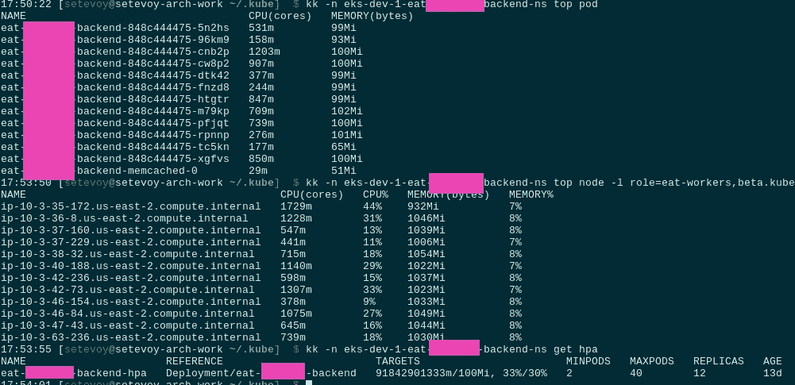

因为他们停止产生超过 30%的 CPU 负载。

我的第一个假设是正确的:PHP-FPM 被配置为最多有 5 个 FPM 工人的`OnDemand`(参见 [PHP-FPM:流程管理器——动态 vs 按需 vs 静态](https://rtfm.co.ua/php-fpm-process-manager-dynamic-vs-ondemand-vs-static/)， *Rus* )。

因此，FPM 启动了 5 个工作线程，这些工作线程无法根据部署请求在 CPU 内核上产生超过 30%的负载，HPA 停止了对它们的扩展。

第二天，我们将它改为最多有 50 名工作人员的`Dynamic`(第三天改为`Static`，以避免花费时间创建新流程),之后，他们开始一直产生 CPU 负载，因此 HPA 开始扩展我们的 pod。

虽然还有另一种解决方案，比如只为 HPA 添加一个条件，例如通过负载平衡器连接，稍后我们将这样做(参见 [Kubernetes:使用 Prometheus 操作符的集群监控](https://rtfm.co.ua/en/kubernetes-a-clusters-monitoring-with-the-prometheus-operator/))。

## 第二天

继续由 JMeter 使用昨天(和明天)相同的测试套件进行测试。

从一个用户开始，增加到 15000 个并发用户。

数字海洋上的当前基础设施最多可处理 12，000 个用户，但在 EKS 自动气象站上，我们希望能够保持多达 15，000 个用户。

我们走吧:

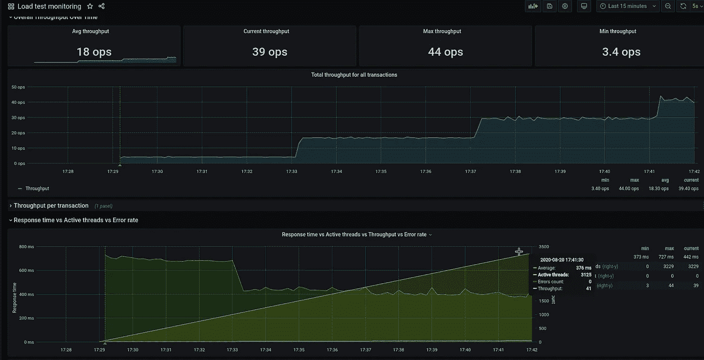

在 3300 用户上，pod 开始扩展:

```
…
0s Normal SuccessfulRescale HorizontalPodAutoscaler New size: 5; reason: cpu resource utilization (percentage of request) above target
0s Normal ScalingReplicaSet Deployment Scaled up replica set eat-backend-b8b79574 to 5
0s Normal SuccessfulCreate ReplicaSet Created pod: eat-backend-b8b79574-l68vq
0s Warning FailedScheduling Pod 0/12 nodes are available: 12 Insufficient cpu, 8 node(s) didn’t match node selector.
0s Warning FailedScheduling Pod 0/12 nodes are available: 12 Insufficient cpu, 8 node(s) didn’t match node selector.
0s Normal TriggeredScaleUp Pod pod triggered scale-up: [{eksctl-bttrm-eks-dev-1-nodegroup-eat-us-east-2b-NodeGroup-1N0QUROWQ8K2Q 2->3 (max: 20)}]
…
```

以及新的 EC2 节点:

```
$ kk -n eks-dev-1-eat-backend-ns top pod
NAME CPU(cores) MEMORY(bytes)
eat-backend-b8b79574–8kjl4 968m 85Mi
eat-backend-b8b79574–8t2pw 1386m 85Mi
eat-backend-b8b79574-bq8nw 737m 71Mi
eat-backend-b8b79574-l68vq 0m 0Mi
eat-backend-b8b79574-swbvq 573m 71Mi
eat-backend-memcached-0 20m 15Mi$ kk -n eks-dev-1-eat-backend-ns get hpa
NAME REFERENCE TARGETS MINPODS MAXPODS REPLICAS AGE
eat-backend-hpa Deployment/eat-backend 36%/30% 4 40 5 37m$ kk top node -l role=eat-workers
NAME CPU(cores) CPU% MEMORY(bytes) MEMORY%
ip-10–3–34–151.us-east-2.compute.internal 662m 16% 1051Mi 18%
ip-10–3–39–132.us-east-2.compute.internal 811m 20% 1095Mi 19%
ip-10–3–53–136.us-east-2.compute.internal 2023m 51% 567Mi 9%
ip-10–3–54–32.us-east-2.compute.internal 1115m 28% 1032Mi 18%
ip-10–3–56–98.us-east-2.compute.internal 1485m 37% 1040Mi 18%
```

5500 —目前一切正常:

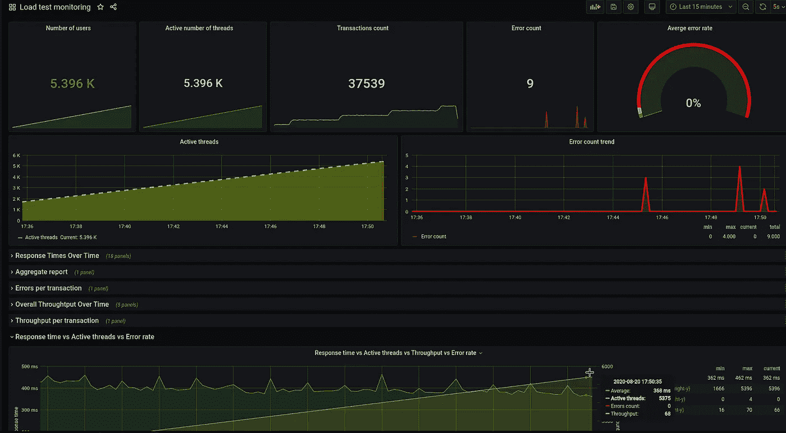

## net/http:请求已取消(客户端。等待标题时超时)

在 7.000–8.000 上，我们遇到了问题—pod 开始无法通过" ***客户端进行活性和就绪性检查。等待标题时超时*** "错误:

```
0s Warning Unhealthy Pod Liveness probe failed: Get [http://10.3.38.7:80/:](http://10.3.38.7:80/:) net/http: request canceled (Client.Timeout exceeded while awaiting headers)
1s Warning Unhealthy Pod Readiness probe failed: Get [http://10.3.44.96:80/:](http://10.3.44.96:80/:) net/http: request canceled (Client.Timeout exceeded while awaiting headers)
0s Normal MODIFY Ingress rule 1 modified with conditions [{ Field: “path-pattern”, Values: [“/*”] }]
0s Warning Unhealthy Pod Liveness probe failed: Get [http://10.3.44.34:80/:](http://10.3.44.34:80/:) net/http: request canceled (Client.Timeout exceeded while awaiting headers)
```

随着用户越来越多，情况只会越来越糟— 10.000:

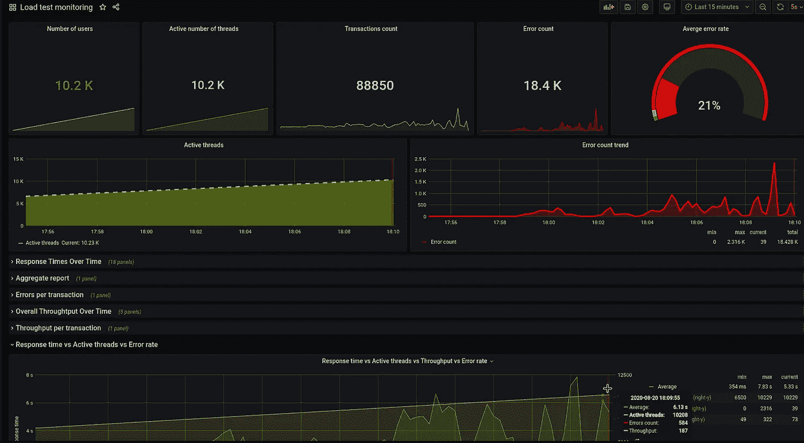

Pods 几乎总是开始失败，最糟糕的是我们甚至没有来自应用程序的日志——它继续写入容器内部的日志文件，我们直到第三天才修复它。

负载是这样的:

```
$ kk -n eks-dev-1-eat-backend-ns get hpa
NAME REFERENCE TARGETS MINPODS MAXPODS REPLICAS AGE
eat-backend-hpa Deployment/eat-backend 60%/30% 4 40 15 63m$ kk top node -l role=eat-workers
NAME CPU(cores) CPU% MEMORY(bytes) MEMORY%
ip-10–3–33–155.us-east-2.compute.internal 88m 2% 951Mi 16%
ip-10–3–34–151.us-east-2.compute.internal 1642m 41% 1196Mi 20%
ip-10–3–39–128.us-east-2.compute.internal 67m 1% 946Mi 16%
ip-10–3–39–132.us-east-2.compute.internal 73m 1% 1029Mi 18%
ip-10–3–43–76.us-east-2.compute.internal 185m 4% 1008Mi 17%
ip-10–3–47–243.us-east-2.compute.internal 71m 1% 959Mi 16%
ip-10–3–47–61.us-east-2.compute.internal 69m 1% 945Mi 16%
ip-10–3–53–124.us-east-2.compute.internal 61m 1% 955Mi 16%
ip-10–3–53–136.us-east-2.compute.internal 75m 1% 946Mi 16%
ip-10–3–53–143.us-east-2.compute.internal 1262m 32% 1110Mi 19%
ip-10–3–54–32.us-east-2.compute.internal 117m 2% 985Mi 17%
ip-10–3–55–140.us-east-2.compute.internal 992m 25% 931Mi 16%
ip-10–3–55–208.us-east-2.compute.internal 76m 1% 942Mi 16%
ip-10–3–56–98.us-east-2.compute.internal 1578m 40% 1152Mi 20%
ip-10–3–59–239.us-east-2.compute.internal 1661m 42% 1175Mi 20%$ kk -n eks-dev-1-eat-backend-ns top pod
NAME CPU(cores) MEMORY(bytes)
eat-backend-b8b79574–5d6zl 0m 0Mi
eat-backend-b8b79574–7n7pq 986m 184Mi
eat-backend-b8b79574–8t2pw 709m 135Mi
eat — backend-b8b79574-bq8nw 0m 0Mi
eat-backend-b8b79574-ds68n 0m 0Mi
eat-backend-b8b79574-f4qcm 0m 0Mi
eat-backend-b8b79574-f6wfj 0m 0Mi
eat-backend-b8b79574-g7jm7 842m 165Mi
eat-backend-b8b79574-ggrdg 0m 0Mi
eat-backend-b8b79574-hjcnh 0m 0Mi
eat-backend-b8b79574-l68vq 0m 0Mi
eat-backend-b8b79574-mlpqs 0m 0Mi
eat-backend-b8b79574-nkwjc 2882m 103Mi
eat-backend-b8b79574-swbvq 2091m 180Mi
eat-backend-memcached-0 31m 54Mi
```

豆荚无限重启:

```
$ kk -n eks-dev-1-eat-backend-ns get pod
NAME READY STATUS RESTARTS AGE
eat-backend-b8b79574–5d6zl 0/1 CrashLoopBackOff 6 17m
eat-backend-b8b79574–7n7pq 1/1 Running 5 9m13s
eat-backend-b8b79574–8kjl4 0/1 CrashLoopBackOff 7 64m
eat-backend-b8b79574–8t2pw 0/1 CrashLoopBackOff 6 64m
eat-backend-b8b79574-bq8nw 1/1 Running 6 64m
eat-backend-b8b79574-ds68n 0/1 CrashLoopBackOff 7 17m
eat-backend-b8b79574-f4qcm 1/1 Running 6 9m13s
eat-backend-b8b79574-f6wfj 0/1 Running 6 9m13s
eat-backend-b8b79574-g7jm7 0/1 CrashLoopBackOff 5 25m
eat-backend-b8b79574-ggrdg 1/1 Running 6 9m13s
eat-backend-b8b79574-hjcnh 0/1 CrashLoopBackOff 6 25m
eat-backend-b8b79574-l68vq 1/1 Running 7 29m
eat-backend-b8b79574-mlpqs 0/1 CrashLoopBackOff 6 21m
eat-backend-b8b79574-nkwjc 0/1 CrashLoopBackOff 5 9m13s
eat-backend-b8b79574-swbvq 0/1 CrashLoopBackOff 6 64m
eat-backend-memcached-0 1/1 Running 0 64m
```

在 12.000–13.000 个用户之后，我们只有一个 pod 还活着:

```
$ kk -n eks-dev-1-eat-backend-ns top pod
NAME CPU(cores) MEMORY(bytes)
eat-backend-b8b79574–7n7pq 0m 0Mi
eat-backend-b8b79574–8kjl4 0m 0Mi
eat-backend-b8b79574–8t2pw 0m 0Mi
eat — backend-b8b79574-bq8nw 0m 0Mi
eat-backend-b8b79574-ds68n 0m 0Mi
eat-backend-b8b79574-f4qcm 0m 0Mi
eat-backend-b8b79574-f6wfj 0m 0Mi
eat-backend-b8b79574-g7jm7 0m 0Mi
eat-backend-b8b79574-ggrdg 0m 0Mi
eat-backend-b8b79574-hjcnh 0m 0Mi
eat-backend-b8b79574-l68vq 0m 0Mi
eat-backend-b8b79574-mlpqs 0m 0Mi
eat-backend-b8b79574-nkwjc 3269m 129Mi
eat-backend-b8b79574-swbvq 0m 0Mi
eat-backend-memcached-0 23m 61Mi$ kk -n eks-dev-1-eat-backend-ns get pod
NAME READY STATUS RESTARTS AGE
eat-backend-b8b79574–5d6zl 1/1 Running 7 20m
eat-backend-b8b79574–7n7pq 0/1 CrashLoopBackOff 6 12m
eat-backend-b8b79574–8kjl4 0/1 CrashLoopBackOff 7 67m
eat-backend-b8b79574–8t2pw 0/1 CrashLoopBackOff 7 67m
eat-backend-b8b79574-bq8nw 0/1 CrashLoopBackOff 6 67m
eat-backend-b8b79574-ds68n 0/1 CrashLoopBackOff 8 20m
eat-backend-b8b79574-f4qcm 0/1 CrashLoopBackOff 6 12m
eat-backend-b8b79574-f6wfj 0/1 CrashLoopBackOff 6 12m
eat-backend-b8b79574-g7jm7 0/1 CrashLoopBackOff 6 28m
eat-backend-b8b79574-ggrdg 0/1 Running 7 12m
eat-backend-b8b79574-hjcnh 0/1 CrashLoopBackOff 7 28m
eat-backend-b8b79574-l68vq 0/1 CrashLoopBackOff 7 32m
eat-backend-b8b79574-mlpqs 0/1 CrashLoopBackOff 7 24m
eat-backend-b8b79574-nkwjc 1/1 Running 7 12m
eat-backend-b8b79574-swbvq 0/1 CrashLoopBackOff 7 67m
eat-backend-memcached-0 1/1 Running 0 67m
```

直到这时，我才回忆起容器中的日志文件，并检查了它们——发现我们的数据库服务器开始拒绝连接:

```
bash-4.4# cat ./new-eat-backend/storage/logs/laravel-2020–08–20.log
[2020–08–20 16:53:25] production.ERROR: SQLSTATE[HY000] [2002] Connection refused {“exception”:”[object] (Doctrine\\DBAL\\Driver\\PDOException(code: 2002): SQLSTATE[HY000] [2002] Connection refused at /var/www/new-eat-backend/vendor/doctrine/dbal/lib/Doctrine/DBAL/Driver/PDOConnection.php:31, PDOException(code: 2002): SQLSTATE[HY000] [2002] Connection refused at /var/www/new-eat-backend/vendor/doctrine/dbal/lib/Doctrine/DBAL/Driver/PDOConnection.php:27)
```

## AWS RDS —“连接被拒绝”

对于数据库，我们使用 RDS Aurora MySQL 和它自己的 Slaves 自动伸缩。

这里的问题是，首先，测试是在具有小型数据库实例的开发环境中执行的— *db.t2.medium* 具有 4 GB RAM，其次，来自应用程序的所有请求都被发送到主数据库实例，而 Aurora 的从数据库实例根本没有被使用。主服务器每秒处理大约 155 个请求。

实际上，Aurora RDS 的主要好处之一就是主/从划分——所有修改数据的请求(`UPDATE`、`CREATE`等)都必须发送给主设备，而所有的`SELECT`都必须发送给从设备。

在此期间，从属服务器可以通过自己的自动扩展策略进行扩展:

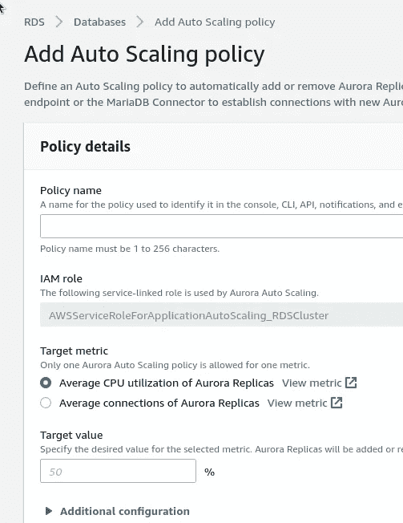

顺便说一下，我们在这里的做法是错误的——我们最好通过连接数而不是 CPU 来扩展从服务器。以后会改的。

## AWS RDS 最大连接数

实际上，根据[文档](https://docs.aws.amazon.com/AmazonRDS/latest/AuroraUserGuide/AuroraMySQL.Managing.Performance.html)——T3 . medium 的连接限制必须是同时 90 个连接，而我们在 50–60 个连接后被拒绝:

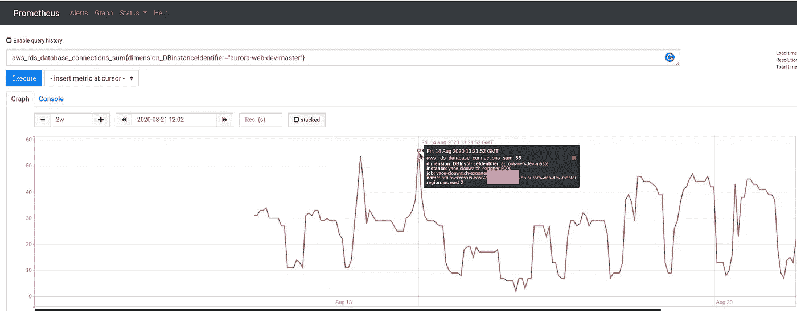

我当时与 AWS 架构进行了交谈，并询问他们关于“文档中的 90 个连接”的问题，但他们无法帮助我们回答类似“*可能是* ***到*** *90* ？”

总的来说，在测试之后，我们得到了这样一张图片:

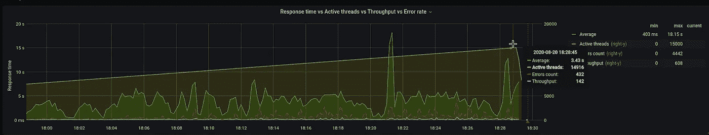

52%失败了，这显然非常糟糕:

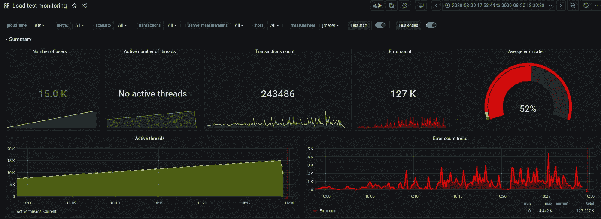

但对我来说，这里最重要的是集群本身、它的控制平面和网络都像预期的那样工作。

数据库问题将在第三天得到解决——将升级实例类型并将应用程序配置为开始与 Aurora Slaves 一起工作。

## 第三天

嗯——最有趣的一天:-)

首先，开发人员修复了 Aurora Slaves，因此应用程序现在将使用它们。

顺便说一下，我昨天和 AWS 团队谈过，他们告诉我关于 RDS 代理服务的事情——需要检查一下，看起来很有希望。

此外，需要检查 OpCache 设置，因为它可以减少 CPU 的使用，参见[PHP:кешированиеPHP-скииптов—настиоккаитюнингop cache](https://rtfm.co.ua/php-keshirovanie-php-skriptov-nastrojka-i-tyuning-opcache/)(俄语)。

当开发人员进行更改时——让我们看看我们的 Kubernetes 活跃度和就绪性探针。

## Kubernetes 活跃度和就绪性探测

发现了几个有趣的帖子——[Kubernetes 活跃度和准备度调查:如何避免搬起石头砸自己的脚](https://blog.colinbreck.com/kubernetes-liveness-and-readiness-probes-how-to-avoid-shooting-yourself-in-the-foot/) и [拉勒维尔](https://dev.to/pgoodjohn/liveness-and-readiness-probes-with-laravel-5d65)的活跃度和准备度调查。

我们的开发人员已经添加了两个新的端点:

```
...
$router->get('healthz', 'HealthController@phpCheck');
$router->get('readiness', 'HealthController@dbReadCheck');
...
```

而`HealthController`是下一个:

```
<?php

namespace App\Http\Controllers;

class HealthController extends Controller
{
    public function phpCheck()
    {
        return response('ok');
    }

    public function dbReadCheck()
    {
        try {
            $rows = \DB::select('SELECT 1 AS ok');
            if ($rows && $rows[0]->ok == 1) {
                return response('ok');
            }
        } catch (\Throwable $err) {
            // ignore
        }
        return response('err', 500);
    }
}
```

到了`/healthz` URI，我们将检查 pod 本身是否已经启动，PHP 是否正在工作。

通过`/readiness` -将检查应用程序是否已启动并准备好接受连接:

*   `livenessProbe`:如果失败——Kubernetes 将重启 pod
*   `initialDelaySeconds` : *应该比容器*的最大初始化时间长——需要多少时间？让我们把它设置为 5 秒钟
*   `failureThreshold`:三次尝试，如果都失败 pod 将重新启动
*   我记得默认值是 15 秒——随它去吧
*   `readinessProbe`:定义应用程序何时准备好服务请求。如果该检查失败，Kubernetes 将关闭该 pod 的负载平衡/服务
*   `initialDelaySeconds`:让我们用 5 秒钟的时间启动 PHP 并连接到数据库
*   `periodSeconds`:由于我们预计数据库连接会出现问题，所以我们将其设置为 5 秒
*   `failureThreshold`:也是三个，至于`livenessProbe`
*   `successThreshold`:在多少次成功尝试后，认为 pod 已准备好接受流量——让我们将其设置为 1
*   `timeoutSeconds`:默认为 1，我们使用它

参见[配置探头](https://kubernetes.io/docs/tasks/configure-pod-container/configure-liveness-readiness-startup-probes/#configure-probes)。

更新部署中的探测器:

```
...
        livenessProbe:
          httpGet:
            path: {{ .Values.appConfig.healthcheckPath }}
            port: {{ .Values.appConfig.port }}
          initialDelaySeconds: 5
          failureThreshold: 3
          periodSeconds: 15
        readinessProbe:
          httpGet: 
            path: {{ .Values.appConfig.readycheckPath }}
            port: {{ .Values.appConfig.port }}
          initialDelaySeconds: 5
          periodSeconds: 5
          failureThreshold: 3
          successThreshold: 1
          timeoutSeconds: 1
...
```

后来将它移到了`values.yaml`。

并为从属数据库服务器添加一个新变量:

```
...
        - name: DB_WRITE_HOST
          value: {{ .Values.appConfig.db.writeHost }}              
        - name: DB_READ_HOST
          value: {{ .Values.appConfig.db.readHost }}
...
```

## Kubernetes:来自 Docker 的 PHP 日志

啊，还有圆木！。

开发者允许日志被发送到`/dev/stderr`而不是写入文件，Docker 守护进程必须获取它们并发送到 Kubernetes——但是在`kubectl logs`中，我们只能看到来自 NGINX 的消息。

去检查一下 [Linux: PHP-FPM、Docker、STDOUT 和 STDERR——没有一个应用程序的错误日志](https://rtfm.co.ua/en/linux-php-fpm-docker-stdout-and-stderr-no-an-applications-error-logs/)，回忆一下它是如何工作的，然后去检查描述符。

在 pod 中找到一个主 PHP 进程 PID:

```
bash-4.4# ps aux |grep php-fpm | grep master
root 9 0.0 0.2 171220 20784 ? S 12:00 0:00 php-fpm: master process (/etc/php/7.1/php-fpm.conf)
```

并检查其描述符:

```
bash-4.4# ls -l /proc/9/fd/2
l-wx — — — 1 root root 64 Aug 21 12:04 /proc/9/fd/2 -> /var/log/php/7.1/php-fpm.logbash-4.4# ls -l /proc/9/fd/1
lrwx — — — 1 root root 64 Aug 21 12:04 /proc/9/fd/1 -> /dev/null
```

*fd/2* ，它是进程的`stderr`，它被映射到`/var/log/php/7.1/php-fpm.log`而不是`/dev/stderr`——这就是为什么我们在`kubectl logs`中看不到任何东西。

在`/etc/php/7.1`目录中递归地 grep "`/var/log/php/7.1/php-fpm.log`"字符串，并找到默认有`error_log = /var/log/php/7.1/php-fpm.log`的`php-fpm.conf`。将它固定在`/dev/stderr`上——这就完成了

再次运行测试！

从 1 个用户到 15000 个用户，持续 30 分钟。

## 第一次测试

3300 名用户—都很好:

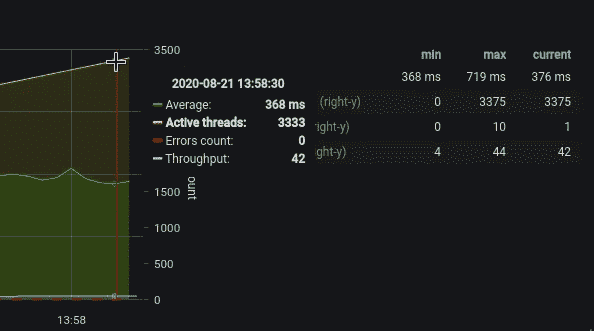

豆荚:

```
kk -n eks-dev-1-eat-backend-ns top pod
NAME CPU(cores) MEMORY(bytes)
eat-backend-867b59c4dc-742vf 856m 325Mi
eat-backend-867b59c4dc-bj74b 623m 316Mi
eat-backend-867b59c4dc-cq5gd 891m 319Mi
eat-backend-867b59c4dc-mm2ll 600m 310Mi
eat-ackend-867b59c4dc-x8b8d 679m 313Mi
eat-backend-memcached-0 19m 68Mi
```

HPA:

```
$ kk -n eks-dev-1-eat-backend-ns get hpa
NAME REFERENCE TARGETS MINPODS MAXPODS REPLICAS AGE
eat-backend-hpa Deployment/eat-backend 30%/30% 4 40 5 20h
```

在 7.000 用户上我们得到了新的错误——“***PHP _ network _ get addresses:get addrinfo failed***”——我的老“朋友”，在 AWS 上面对了几次:

```
[2020–08–21 14:14:59] local.ERROR: SQLSTATE[HY000] [2002] php_network_getaddresses: getaddrinfo failed: Try again (SQL: insert into `order_logs` (`order_id`, `action`, `data`, `updated_at`, `created_at`) values (175951, nav, “Result page: ok”, 2020–08–21 14:14:54, 2020–08–21 14:14:54)) {“exception”:”[object] (Illuminate\\Database\\QueryException(code: 2002): SQLSTATE[HY000] [2002] php_network_getaddresses: getaddrinfo failed: Try again (SQL: insert into `order_logs` (`order_id`, `action`, `data`, `updated_at`, `created_at`) values (175951, nav, \”Result page: ok\”, 2020–08–21 14:14:54, 2020–08–21 14:14:54))
```

简而言之，AWS 中的“**PHP _ network _ get addresses:get addrinfo failed**”错误有三个原因(至少我知道是这样):

*   AWS EC2 的网络接口上每秒数据包太多，参见 [EC2 每秒数据包:保证吞吐量与最佳效果](https://www.bluematador.com/blog/ec2-packets-per-second-guaranteed-throughput-vs-best-effort)
*   网络吞吐量耗尽—参见 [EC2 网络性能备忘单](https://cloudonaut.io/ec2-network-performance-cheat-sheet/)
*   许多 DNS 查询被发送到 AWS VPC DNS-它的限制是 1024/秒，见 [DNS 配额](https://docs.aws.amazon.com/vpc/latest/userguide/vpc-dns.html#vpc-dns-limits)

我们将在本帖的稍后部分讨论当前案例的原因。

在 9.000+pod 上开始重新启动:

```
$ kk -n eks-dev-1-eat-backend-ns get pod
NAME READY STATUS RESTARTS AGE
eat-backend-867b59c4dc-2m7fd 0/1 Running 2 4m17s
eat-backend-867b59c4dc-742vf 0/1 CrashLoopBackOff 5 68m
eat-backend-867b59c4dc-bj74b 1/1 Running 5 68m
…
eat-backend-867b59c4dc-w24pz 0/1 CrashLoopBackOff 5 19m
eat-backend-867b59c4dc-x8b8d 0/1 CrashLoopBackOff 5 68m
eat-backend-memcached-0 1/1 Running 0 21h
```

因为他们弯腰回复活跃度和准备度检查:

```
0s Warning Unhealthy Pod Readiness probe failed: Get [http://10.3.62.195:80/readiness:](http://10.3.62.195:80/readiness:) net/http: request canceled (Client.Timeout exceeded while awaiting headers)
0s Warning Unhealthy Pod Liveness probe failed: Get [http://10.3.56.206:80/healthz:](http://10.3.56.206:80/healthz:) net/http: request canceled (Client.Timeout exceeded while awaiting headers)
```

在 10.000 之后，我们的数据库服务器开始拒绝连接:

```
[2020–08–21 13:05:11] production.ERROR: SQLSTATE[HY000] [2002] Connection refused {“exception”:”[object] (Doctrine\\DBAL\\Driver\\PDOException(code: 2002): SQLSTATE[HY000] [2002] Connection refused at /var/www/new-eat-backend/vendor/doctrine/dbal/lib/Doctrine/DBAL/Driver/PDOConnection.php:31, PDOException(code: 2002): SQLSTATE[HY000] [2002] Connection refused
```

## PHP _ network _ get addresses:get addrinfo 失败и DNS

那么，这次我们发现了哪些问题:

*   **错误:SQLSTATE[HY000] [2002]连接被拒绝**
*   **PHP _ network _ get addresses:get addrinfo 失败**

“ ***错误:SQLSTATE[HY000] [2002]连接被拒绝*** ”是一个已知问题，我们知道如何处理它——我将把 RDS 实例从 *t3.medium* 更新为 *r5.large* ，但是 DNS 问题呢？

因为从上面提到的原因——网络接口上每秒的数据包数、网络链路吞吐量和 AWS VPC DNS——来看，最可行的似乎是 DNS 服务:每次当我们的应用程序想要连接到数据库服务器时，它都会进行 DNS 查询以确定 DB-server 的 IP，加上所有其他 DNS 记录，它们合起来可以满足每秒 1024 个请求的限制。

顺便看看[Grafana:Loki——LogQL 的类似普罗米修斯的计数器、聚合函数和 dnsmasq 的请求图](https://rtfm.co.ua/en/grafana-loki-the-logqls-prometheus-like-counters-aggregation-functions-and-dnsmasqs-requests-graphs/)帖子。

现在让我们检查一下我们的 pod 的 DNS 设置:

```
bash-4.4# cat /etc/resolv.conf
nameserver 172.20.0.10
search eks-dev-1-eat-backend-ns.svc.cluster.local svc.cluster.local cluster.local us-east-2.compute.internal
options ndots:5
```

*名称服务器 172.20.0.10* —必须是我们的`kube-dns`:

```
bash-4.4# nslookup 172.20.0.10
10.0.20.172.in-addr.arpa name = kube-dns.kube-system.svc.cluster.local.
```

是的，它是。

顺便说一下，它在 slogs 中告诉我们它不能连接到 API 服务器:

> e 0805 21:32:40.283128 1 reflector . go:283]pkg/mod/k8s . io/client-go @ v 0 . 0 . 0–2019 0620085101–78d 2 af 792 Bab/tools/cache/reflector . go:98:无法观看*v1。命名空间:Get[https://172 . 20 . 0 . 1:443/API/v1/namespaces？resource version = 23502628&time out = 9m 40s&time out seconds = 580&watch = true:](https://172.20.0.1:443/api/v1/namespaces?resourceVersion=23502628&timeout=9m40s&timeoutSeconds=580&watch=true:)拨 tcp 172.20.0.1:443: connect:连接被拒绝

那么，我们能做些什么来防止过度使用 AWS VPC 域名系统呢？

*   旋起`dnsmasq`？对于 Kubernetes 来说，这似乎有点奇怪，首先——因为 Kubernetes 已经有了自己的 DNS，其次——我肯定我们不是第一个面临这个问题的人，我怀疑他们通过运行一个带有`dnsmasq`的额外容器解决了这个问题(仍然检查[dnsmasq:AWS-“名称解析中的临时故障”，日志、调试和 dnsmasq 缓存大小](https://rtfm.co.ua/en/dnsmasq-aws-temporary-failure-in-name-resolution-logs-debug-and-dnsmasq-cache-size/))
*   另一个解决方案可以使用来自 cloud flare(*1.1.1.1*)或 Google(*8.8.8.8)*)的 DNS，这样我们将完全停止使用 VPC 的 DNS，但会增加 DNS 响应时间

**Kubernetes**

好了，让我们看看 DNS 在 Kubernetes 中一般是如何配置的:

> **注意:**您可以使用 pod 规范中的 **dnsPolicy** 字段管理您的 pod 的 DNS 配置。如果未填充该字段，则默认使用 **ClusterFirst** 和 [DNS 策略](https://kubernetes.io/docs/concepts/services-networking/dns-pod-service/#pod-s-dns-policy)。

因此，默认情况下，pod 设置了`ClusterFirst`,它:

> 任何与配置的群集域后缀不匹配的 DNS 查询，如“`www.kubernetes.io`”，都会被转发到从该节点继承的上游名称服务器。

显然，默认情况下，AWS EC2 将完全使用 AWS VPC DNS。

另请参见— [如何使用亚马逊 EKS 解决 DNS 故障？](https://aws.amazon.com/premiumsupport/knowledge-center/eks-dns-failure/)

可以使用 ClusterAutoScaler 设置配置节点 DNS:

```
$ kk -n kube-system get pod cluster-autoscaler-5dddc9c9b-fstft -o yaml
…
spec:
containers:
- command:
- ./cluster-autoscaler
- — v=4
- — stderrthreshold=info
- — cloud-provider=aws
- — skip-nodes-with-local-storage=false
- — expander=least-waste
- — node-group-auto-discovery=asg:tag=k8s.io/cluster-autoscaler/enabled,k8s.io/cluster-autoscaler/bttrm-eks-dev-1
- — balance-similar-node-groups
- — skip-nodes-with-system-pods=false
…
```

但是在我们的例子中，这里什么都没有改变，一切都保留了默认设置。

在 Kubernetes 中运行节点本地 DNS

但是关于`dnsmasq`的想法是正确的，但是对于 Kubernetes，有一个 [NodeLocal DNS](https://kubernetes.io/docs/tasks/administer-cluster/nodelocaldns/) 解决方案，它与`dnsmasq`是完全相同的缓存服务，但是它将使用`kube-dns`来获取记录，然后`kube-dns`将转到 VPC DNS。

我们需要什么来运行它:

*   *kubedns* :将由`kubectl get svc kube-dns -n kube-system -o jsonpath={.spec.clusterIP}`命令控制
*   *域*:是我们的`<cluster-domain>`， *cluster.local*
*   *本地 dns* : `<node-local-address>`，地址，本地 dns 缓存将被访问，让我们使用 *169.254.20.10*

获取`kube-dns`的服务 IP:

```
$ kubectl get svc kube-dns -n kube-system -o jsonpath={.spec.clusterIP}
172.20.0.10
```

另请参见[修复 EKS DNS](https://www.vladionescu.me/posts/eks-dns.html) 。

下载`[nodelocaldns.yaml](https://github.com/kubernetes/kubernetes/blob/master/cluster/addons/dns/nodelocaldns/nodelocaldns.yaml)`文件:

```
$ wget [https://raw.githubusercontent.com/kubernetes/kubernetes/master/cluster/addons/dns/nodelocaldns/nodelocaldns.yaml](https://raw.githubusercontent.com/kubernetes/kubernetes/master/cluster/addons/dns/nodelocaldns/nodelocaldns.yaml)
```

用`sed`更新它，并设置我们上面确定的数据:

```
$ sed -i “s/__PILLAR__LOCAL__DNS__/169.254.20.10/g; s/__PILLAR__DNS__DOMAIN__/cluster.local/g; s/__PILLAR__DNS__SERVER__/172.20.0.10/g” nodelocaldns.yaml
```

检查清单的内容——它将做什么——这里将创建一个 Kubernetes `DaemonSet`,它将使用每个 Kubernetes WorkerNode 上的 NodeLocal DNS 启动 pods:

```
...
---
apiVersion: apps/v1
kind: DaemonSet
metadata:
  name: node-local-dns
...
```

及其`ConfigMap`:

```
...
---
apiVersion: v1
kind: ConfigMap
metadata:
  name: node-local-dns
  namespace: kube-system
  labels:
    addonmanager.kubernetes.io/mode: Reconcile
data:
  Corefile: |
    cluster.local:53 {
        errors
        cache {
                success 9984 30
                denial 9984 5
        }
        reload
        loop
        bind 169.254.20.10 172.20.0.10
        forward . __PILLAR__CLUSTER__DNS__ {
                force_tcp
        }
        prometheus :9253
        health 169.254.20.10:8080
        }

...
```

部署它:

```
$ kubectl apply -f nodelocaldns.yaml
serviceaccount/node-local-dns created
service/kube-dns-upstream created
configmap/node-local-dns created
daemonset.apps/node-local-dns created
```

检查舱:

```
$ kk -n kube-system get pod | grep local-dns
node-local-dns-7cndv 1/1 Running 0 33s
node-local-dns-7hrlc 1/1 Running 0 33s
node-local-dns-c5bhm 1/1 Running 0 33s
```

其服务:

```
$ kk -n kube-system get svc | grep dns
kube-dns ClusterIP 172.20.0.10 <none> 53/UDP,53/TCP 88d
kube-dns-upstream ClusterIP 172.20.245.211 <none> 53/UDP,53/TCP 107s
```

*kube-DNS-upstream cluster IP 172 . 20 . 245 . 21*，但是从我们的 pod 内部，它必须可以被我们在`localdns`中设置的 *169.254.20.10* IP 访问。

这有用吗？从 pod 进行检查:

```
bash-4.4# dig @169.254.20.10 ya.ru +short
87.250.250.242
```

是的，有效，很好。

下一件事是重新配置我们的 pod，这样它们将使用 *169.254.20.10* 而不是`kube-dns`服务。

在`eksctl`配置文件中，这可以通过`clusterDNS`完成:

```
...
nodeGroups:
- name: mygroup
    clusterDNS: 169.254.20.10
...
```

但是接下来您需要更新(实际上是重新创建)您现有的 WorkerNode 组。

kubernetes Pod`dnsConfig`&&`nameservers`

要应用更改而不创建 WorkerNode 组，我们可以通过添加`dnsConfig`和`nameservers`在`Deployment`中指定必要的 DNS 设置:

```
...
        resources:
          requests:
            cpu: 2500m
            memory: 500m
        terminationMessagePath: /dev/termination-log
        terminationMessagePolicy: File
      dnsConfig:
        nameservers:
        - 169.254.20.10
      dnsPolicy: None
      imagePullSecrets:
      - name: gitlab-secret
      nodeSelector:
        beta.kubernetes.io/instance-type: c5.xlarge
        role: eat-workers
...
```

部署，检查:

```
$ kk -n eks-dev-1-eat-backend-ns exec -ti eat-backend-f7b49b4b7–4jtk5 cat /etc/resolv.conf
nameserver 169.254.20.10
```

好吧…

有用吗？

让我们用吊舱中的`dig`检查一下:

```
$ kk -n eks-dev-1-eat-backend-ns exec -ti eat-backend-f7b49b4b7–4jtk5 dig ya.ru +short
87.250.250.242
```

是的，都很好。

现在我们可以进行第二项测试。

第一次测试的结果如下:

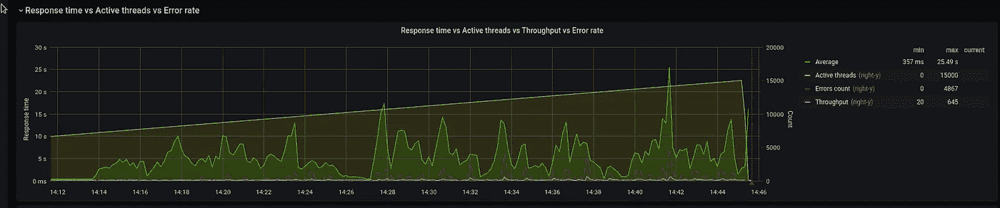

当我们在 8.000 个用户后遇到错误时。

## 第二个测试

8500 —目前一切正常:

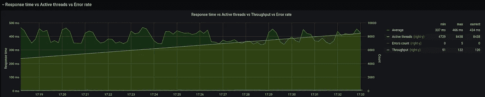

在之前的测试中，我们在 7.000 之后开始出现错误，大约有 150-200 个错误，目前只有 5 个错误。

pod 状态:

```
$ kk -n eks-dev-1-eat-backend-ns get pod
NAME READY STATUS RESTARTS AGE
eat-backend-5d8984656–2ftd6 1/1 Running 0 17m
eat-backend-5d8984656–45xvk 1/1 Running 0 9m11s
eat-backend-5d8984656–6v6zr 1/1 Running 0 5m10s
…
eat-backend-5d8984656-th2h6 1/1 Running 0 37m
eat-backend-memcached-0 1/1 Running 0 24h
```

НРА:

```
$ kk -n eks-dev-1-eat-backend-ns get hpa
NAME REFERENCE TARGETS MINPODS MAXPODS REPLICAS AGE
eat-backend-hpa Deployment/eat-backend 32%/30% 4 40 13 24h
```

10.000 —仍然有效:

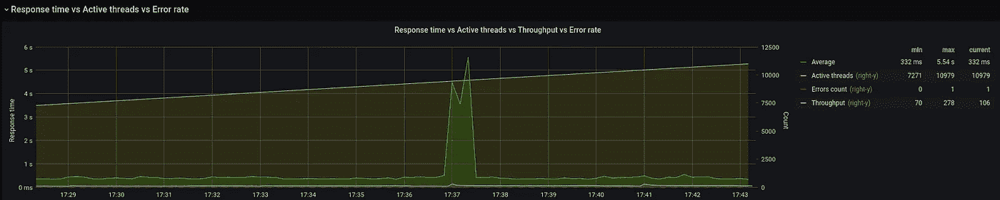

НРА:

```
$ kk -n eks-dev-1-eat-backend-ns get hpa
NAME REFERENCE TARGETS MINPODS MAXPODS REPLICAS AGE
eat-backend-hpa Deployment/eat-backend 30%/30% 4 40 15 24h
```

豆荚:

```
$ kk -n eks-dev-1-eat-backend-ns get pod
NAME READY STATUS RESTARTS AGE
eat-backend-5d8984656–2ftd6 1/1 Running 0 28m
eat — backend-5d8984656–45xvk 1/1 Running 0 20m
eat-backend-5d8984656–6v6zr 1/1 Running 0 16m
…
eat-backend-5d8984656-th2h6 1/1 Running 0 48m
eat-backend-5d8984656-z2tpp 1/1 Running 0 3m51s
eat-backend-memcached-0 1/1 Running 0 24h
```

连接到数据库服务器:

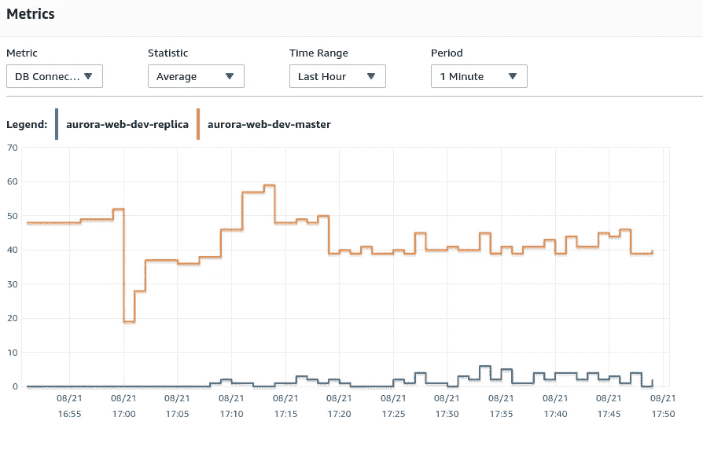

节点:

```
$ kk top node -l role=eat-workers
NAME CPU(cores) CPU% MEMORY(bytes) MEMORY%
ip-10–3–39–145.us-east-2.compute.internal 743m 18% 1418Mi 24%
ip-10–3–44–14.us-east-2.compute.internal 822m 20% 1327Mi 23%
…
ip-10–3–62–143.us-east-2.compute.internal 652m 16% 1259Mi 21%
ip-10–3–63–96.us-east-2.compute.internal 664m 16% 1266Mi 22%
ip-10–3–63–186.us-east-2.compute.internal <unknown> <unknown> <unknown> <unknown>
ip-10–3–58–180.us-east-2.compute.internal <unknown> <unknown> <unknown> <unknown>
…
ip-10–3–51–254.us-east-2.compute.internal <unknown> <unknown> <unknown> <unknown>
```

自动缩放仍然有效，一切正常:


在 17:45，有一个响应时间上升和几个错误——但随后一切正常。

没有 pod 重新启动:

```
$ kk -n eks-dev-1-eat-backend-ns get pod
NAME READY STATUS RESTARTS AGE
eat-backend-5d8984656–2ftd6 1/1 Running 0 44m
eat-backend-5d8984656–45xvk 1/1 Running 0 36m
eat-backend-5d8984656–47vp9 1/1 Running 0 6m49s
eat-backend-5d8984656–6v6zr 1/1 Running 0 32m
eat-backend-5d8984656–78tq9 1/1 Running 0 2m45s
…
eat-backend-5d8984656-th2h6 1/1 Running 0 64m
eat-backend-5d8984656-vbzhr 1/1 Running 0 6m49s
eat-backend-5d8984656-xzv6n 1/1 Running 0 6m49s
eat-backend-5d8984656-z2tpp 1/1 Running 0 20m
eat-backend-5d8984656-zfrb7 1/1 Running 0 16m
eat-backend-memcached-0 1/1 Running 0 24h
```

30 个豆荚被放大:

```
$ kk -n eks-dev-1-eat-backend-ns get hpa
NAME REFERENCE TARGETS MINPODS MAXPODS REPLICAS AGE
eat-backend-hpa Deployment/eat-backend 1%/30% 4 40 30 24h
```

0%误差:

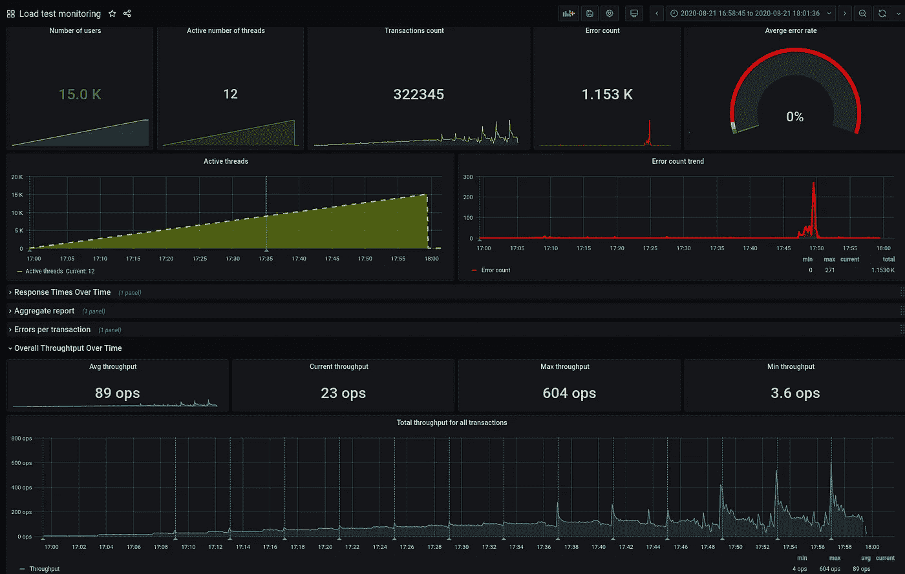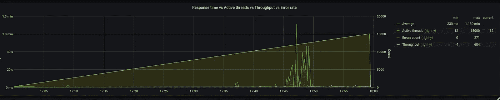

# Apache JMeter и Grafana

最后，我第一次看到这样的解决方案，它看起来真的很好——QA 团队让他们的 JMeterз将测试结果发送到 InfluxDB，然后 Grafana 用它来绘制图表:

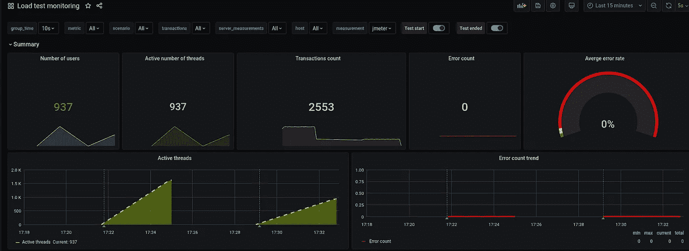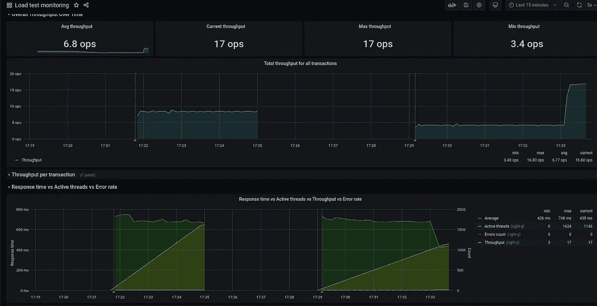

*最初发布于* [*RTFM: Linux、DevOps、系统管理*](https://rtfm.co.ua/en/kubernetes-load-testing-and-high-load-tuning-problems-and-solutions/) *。*