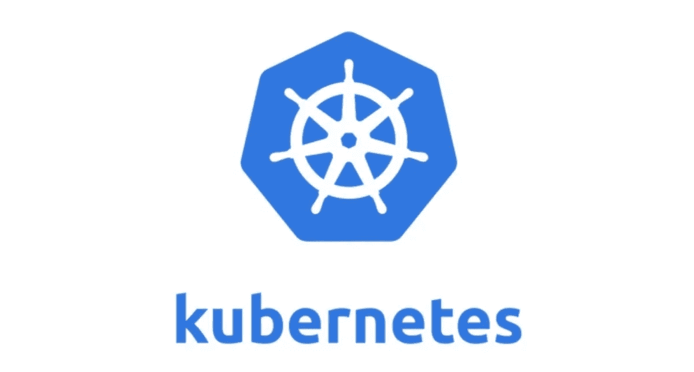

# Kubernetes 当地游乐场替代品

> 原文：<https://itnext.io/kubernetes-local-playground-alternatives-e1a590632b9f?source=collection_archive---------0----------------------->

# **简介**

在本文中，我们将探索在本地运行集群的不同替代方案，用于测试、实践或开发应用程序。

下面列出了我们将要测试的项目的源代码和/或文档:

*   [迷你库贝](https://minikube.sigs.k8s.io/docs/start/)
*   [善良](https://kind.sigs.k8s.io/docs/user/quick-start/)
*   [Kubernetes 使用流浪者的艰难方式](https://github.com/kainlite/kubernetes-the-easy-way-with-vagrant)
*   [Kubernetes 与 kubeadm 使用流浪者](https://github.com/kainlite/kubernetes-the-easy-way-with-vagrant-and-kubeadm)

还有更多类似于 [Microk8s](https://microk8s.io/) 的选择，但我将把它留给读者作为练习。

如果你想尝试每一种方法，请确保遵循他们推荐的安装方式或你的发行版/系统方式。

前两个(minikube 和 kind)我们将看到如何配置 CNI 插件，以便能够使用[网络策略](https://kubernetes.io/docs/concepts/services-networking/network-policies/)，在其他两个环境中，您可以自定义一切，这些最适合学习而不是日常使用，但是如果您有足够的 ram，您也可以这样做。

我们将使用以下 pod 和网络策略来测试其工作情况，我们将创建 3 个 pod、1 个客户端和 2 个应用后端，一个后端将在 TCP/1111 端口监听，另一个在 TCP/2222 端口监听，在我们的网络策略中，我们将只允许我们的客户端连接到 app1:

如果您想了解更多关于 netcat 和朋友的信息，请访问: [Cat 和朋友:netcat 和 socat](https://techsquad.rocks/blog/cat_and_friends_netcat_socat/)

# **迷你库贝**

Minikube 使用量很大，但有时可能会太大，无论如何，我们都会看到一个让它与网络策略一起工作的例子，好在它有很多文档，因为很多人都在使用它，而且它经常更新:

给它几分钟时间来启动，对于 minikube 的新版本，你可以这样安装它，否则你可以指定你将安装 CNI 插件，然后只安装清单。

请注意，我们添加了等待 5 秒的超时命令，因此我们不必真正等待 nc 超时，因为默认情况下没有超时，我们还测试了 nc 超时。

你可以在他们的[文档](https://docs.cilium.io/en/v1.9/gettingstarted/minikube/)上获得更多关于 minikube 使用纤毛的信息

记得打扫干净

# **善良**

kind 非常轻量级和快速，我通常使用 KIND 进行测试和开发，主要原因是几乎所有东西都像在真实集群中一样工作，但它没有开销，安装简单，易于运行，首先我们需要设置这个配置，告诉 KIND 不要使用它的默认 CNI。

然后，我们可以创建集群并安装 calico(这里有一个小问题，您需要检查 calico 节点 pod 是否启动，如果没有杀死它们，它们应该会启动，一切将开始正常工作，这是由于在部署后添加了环境变量，以便它与 KIND 一起工作):

**验证**

**再次测试**

你可以在这里查看种类[的更多配置选项](https://kind.sigs.k8s.io/docs/user/configuration/#networking)

# **Kubeadm 和流浪汉**

这是一个有趣的场景，了解如何使用 kubeadm 配置集群非常重要，还可以练习添加/删除/升级节点、备份和恢复 etcd 等。如果你想测试这个，克隆这个 repo: [Kubernetes 和 kubeadm 使用了 vacant](https://github.com/kainlite/kubernetes-the-easy-way-with-vagrant-and-kubeadm)

接下来，让我们复制 kubeconfig 并部署我们的资源，然后进行测试(这个部署使用了 weave)

**测试它**(等到 pod 处于就绪状态)有关更多信息，请参考 repo 中的自述文件和其中的脚本，应该很容易理解和复制:

**清理**

# **苦尽甘来的流浪者**

这可能是最复杂的场景，它纯粹是教育性的，你基本上可以手动生成所有的证书，并自己配置一切(如果你感兴趣，请参见原始的 repo 以了解如何在 gcloud 中这样做的说明)，如果你想测试这个 repo:[kubernets 使用流浪者](https://github.com/kainlite/kubernetes-the-easy-way-with-vagrant)的艰难方式，但要有耐心，并准备好调试如果事情不顺利。

**验证**

**安装清单并进行测试**

**清理**

**总结**

每种选择都有其使用案例，测试每一种，并选择最符合您需求的一种。

**友情提醒:**

记得清理以恢复机器中的一些资源。

# 正误表

如果您发现任何错误或有任何建议，请给我发消息，以便解决问题。

此外，您可以在这里查看源代码和[生成代码](https://github.com/kainlite/kainlite.github.io)和[源代码](https://github.com/kainlite/blog)的变化

*原载于 2020 年 11 月 27 日*[*https://tech squad . rocks*](https://techsquad.rocks/blog/kubernetes_local_playground_alternatives/)*。*