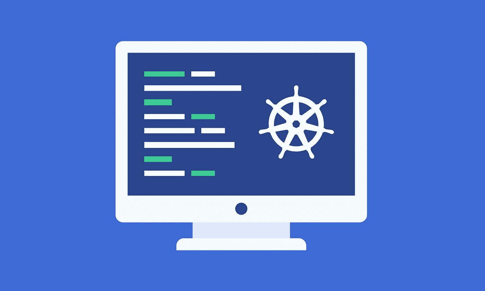
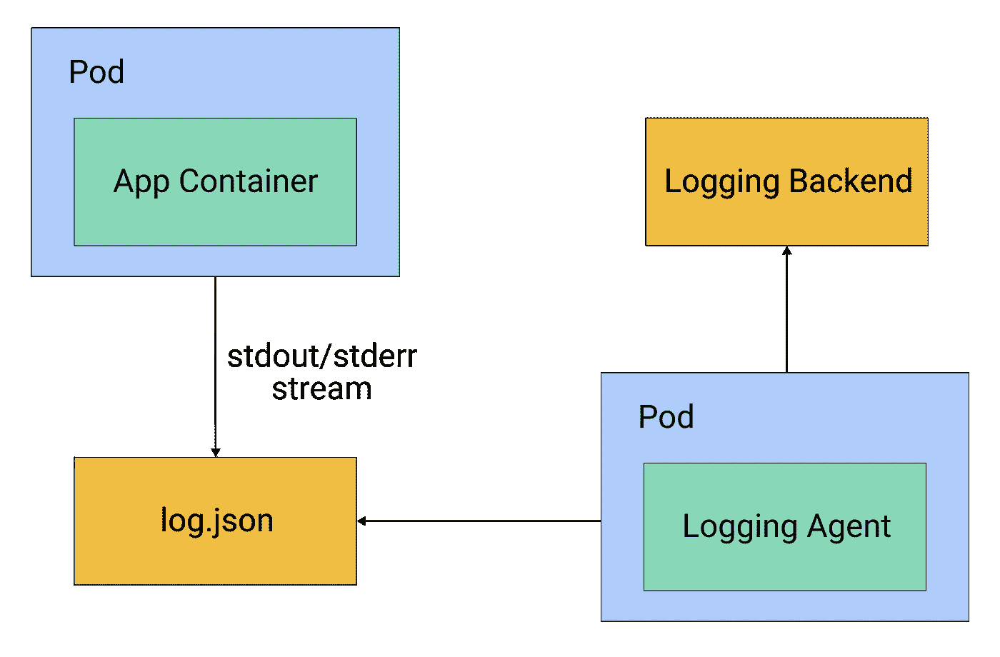
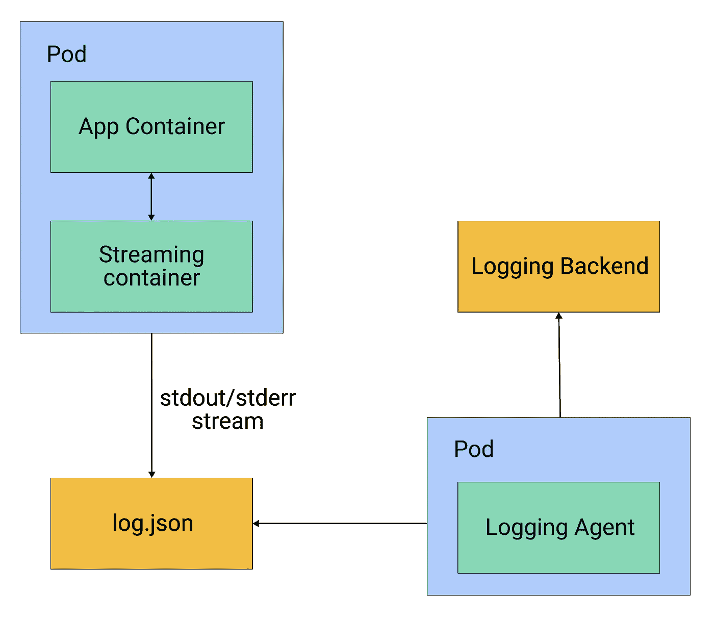
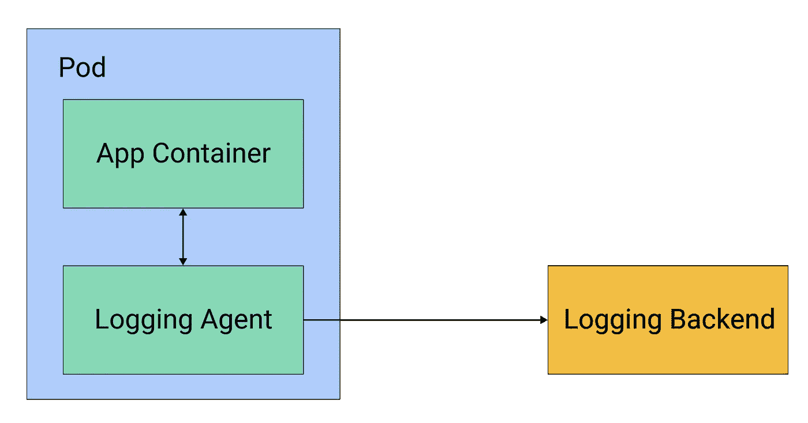

# Kubernetes 生产测井

> 原文：<https://itnext.io/kubernetes-logging-in-production-545ea88d9a4a?source=collection_archive---------2----------------------->

了解适用于您的生产 Kubernetes 集群的可伸缩日志记录模式。



过去，在整体架构中，日志直接存储在裸机或虚拟机上。他们从不离开机器磁盘，操作团队会根据需要检查每个磁盘的日志。

这在长寿的机器上有效，但是云中的机器是短暂的。随着越来越多的公司在容器上运行服务，并使用 Kubernetes 协调部署，日志不能再存储在机器上，实现日志管理策略至关重要。

日志是调试和监控应用程序的有效方法，它们需要存储在单独的后端，以便在 pod 或节点出现故障时可以查询和分析。这些独立的后端包括 Elasticsearch、GCP 的 Stackdriver 和 AWS 的 Cloudwatch 等系统。

将日志从集群存储到存储后端称为集群级日志记录。在本文中，我们将讨论如何在您自己的 Kubernetes 集群中实现这种方法。

# 日志架构

在 Kubernetes 集群中，有两个主要的日志源，您的应用程序和系统组件。

您的应用程序在 Kubernetes 集群中作为容器运行，容器运行时负责获取应用程序的日志，而 Docker 将这些日志重定向到 stdout 和 stderr 流。在 Kubernetes 集群中，这两个流都被写入集群节点上的 JSON 文件。

使用以下命令可以随时获取这些容器日志:

```
kubectl logs podname
```

日志的另一个来源是系统组件。一些系统组件(即`kube-scheduler`和`kube-proxy`)作为容器运行，并遵循与您的应用程序相同的日志原则。

其他系统组件(`kubelet`和`container runtime`本身)作为本地服务运行。如果`systemd`在机器上可用，组件在`journald`中写入日志，否则在`/var/log`目录中写入一个`.log`文件。

既然我们已经了解了应用程序和集群的哪些组件会生成日志以及它们存储在哪里，那么让我们来看看将这些日志卸载到单独的存储系统的一些常见模式。

# 记录模式

收集原木的两种最突出的模式是边车模式和 DaemonSet 模式。

# 1.达蒙塞特图案

在 DaemonSet 模式中，日志代理通过 Kubernetes 中的 DaemonSet 资源作为 pods 部署。部署 DaemonSet 可以确保集群中的每个节点都有一个运行日志代理的 pod。该日志代理被配置为从`/var/logs`目录中读取日志，并将它们发送到存储后端。您可以在图 1 中看到这种配置的示意图。



图 1:通过 DaemonSet 在每个节点上运行的日志代理

# 2.边车模式

或者，在 sidecar 模式中，一个专用容器沿着同一个 pod 中的每个应用程序容器运行。这种边车可以有两种类型，流式边车或测井代理边车。

当您运行将日志写入文件而不是 stdout/stderr 流的应用程序时，或者运行以非标准格式写入日志的应用程序时，可以使用流 sidecar。在这种情况下，您可以使用一个流 sidecar 容器将日志从文件发布到它自己的 stdout/stderr 流中，然后 Kubernetes 本身就可以获取这些日志。

通过将日志消息转换为标准的日志格式，流式边盘还可以为日志结构带来奇偶校验。您可以在图 2 中看到这种模式。



图 2:流式边车模式

另一种方法是日志代理 sidecar，sidecar 自己将日志发送到存储后端。每个 pod 都包含一个日志代理，如 Fluentd 或 Filebeat，它从应用程序容器中捕获日志，并将它们直接发送到存储后端，如图 3 所示。



图 3:日志代理边车模式

# 利弊

既然我们已经讨论了 DaemonSet 和 sidecar 两种方法，让我们熟悉一下每种方法的优缺点。

# 1.DaemonSet(节点级)

赞成的意见

*   节点级日志记录更容易实现，因为它与现有的基于文件的日志记录挂钩，并且由于每个节点上运行的容器更少，因此比 sidecar 方法占用的资源更少。
*   这些日志可以通过用于调试的 kubectl 命令获得，因为 kubelet 可以获得这些日志文件，它会返回日志文件的内容。

骗局

*   支持不同的日志结构或写入日志文件而不是流的应用程序的灵活性较低。您需要修改应用程序日志结构来实现奇偶校验，或者在您的存储后端处理差异。
*   因为它们是作为 JSON 文件存储在节点磁盘上的，所以日志不能永久保存。您需要有一个日志循环机制来回收旧的日志。如果您使用的是容器运行时接口，kubelet 会负责循环日志，不需要实现显式的解决方案。

# 2.边车

赞成的意见

*   您可以灵活地为每个应用程序容器定制 sidecars。例如，一个应用程序可能没有能力写入`stdout/stderr`，或者它可能有一些不同的日志格式。在这些情况下，边车集装箱可以为系统带来平等。
*   如果您使用不带流的日志代理 sidecar，则不需要旋转日志，因为节点磁盘上没有存储日志。

骗局

*   与节点级的 pod 相比，为每个应用程序容器运行 sidecar 是相当耗费资源的。
*   给每个部署增加一个边车会增加额外的复杂性。
*   如果你为一个把日志写到文件的应用程序使用一个流 sidecar，你将为相同的日志使用双倍的存储空间，因为你将复制条目。
*   如果您使用的是不带流的日志代理 sidecar，您将失去通过`kubectl`访问日志的能力。这是因为`kubelet`不再能够访问 JSON 日志。
*   对于日志代理 sidecar，您还需要一个节点级代理，否则您将无法收集系统组件日志。

# 将理论付诸实践

既然我们已经了解了在 Kubernetes 集群中登录的可能模式，让我们将它们付诸实践。我们将部署生成日志的虚拟容器，并创建 Kubernetes 资源来实现我们上面讨论的日志模式。

对于这个例子，我们将使用 Fluentd 作为日志代理，我们将安装 Elasticsearch 用于日志后端，安装 Kibana 用于可视化目的。我们将使用舵图将 Elasticsearch 和 Kibana 安装到同一个集群中。但是请注意，您的存储后端不应在同一个集群上，我们这样做只是为了演示。由于 Fluentd 的可插拔架构，它支持各种不同的接收器。这就是为什么 Elasticsearch 后端可以被任何云原生解决方案取代，包括 Stackdriver 或 Cloudwatch。

# 1.安装 Elasticsearch 和 Kibana

我们将使用官方的舵图部署 Elasticsearch 和 Kibana，舵图可以在这里找到( [Elasticsearch](https://github.com/elastic/helm-charts/blob/master/elasticsearch) 、 [Kibana](https://github.com/elastic/helm-charts/blob/master/kibana) )。对于通过 helm 安装，你需要一个 Helm 二进制文件，但是 Helm 的安装超出了这篇文章的范围。

让我们从添加 helm repos 开始。

```
helm repo add elastic [https://helm.elastic.co](https://helm.elastic.co)
```

接下来，我们将在集群中安装 Elasticsearch 和 Kibana 图表。

```
helm install elasticsearch elastic/elasticsearch
helm install kibana elastic/kibana
```

这将在您的集群中安装最新版本的 Elasticsearch 和 Kibana，然后可以用作您的日志的存储后端。

我们在图表中使用了默认值，但是在生产中安装时，您可以根据需要更改任何参数。

# 2.达蒙塞特

我们将把 Fluentd 部署为恶魔集。为了保持较低的详细度，我们不会创建单独的 ServiceAccount 和 ClusterRole。但是在生产环境中，Fluentd pods 应该使用一个单独的服务帐户运行，并限制访问权限。

您可以使用以下 Kubernetes 资源将 Fluentd 部署为 DaemonSet:

```
apiVersion: extensions/v1beta1
kind: DaemonSet
metadata:
  name: fluentd
  namespace: kube-system
  labels:
    k8s-app: fluentd-logger
spec:
  template:
    metadata:
      labels:
        k8s-app: fluentd-logger
    spec:
      containers:
      - name: fluentd
        image: fluent/fluentd-kubernetes-daemonset:elasticsearch
        env:
        - name:  FLUENT\_ELASTICSEARCH\_HOST
          value: "elasticsearch-master"
        - name:  FLUENT\_ELASTICSEARCH\_PORT
          value: "9200"
        volumeMounts:
        - name: varlog
          mountPath: /var/log
        - name: dockerlogs
          mountPath: /var/lib/docker/containers
          readOnly: true
      volumes:
      - name: varlog
        hostPath:
          path: /var/log
      - name: dockerlogs
        hostPath:
          path: /var/lib/docker/containers
```

在本例中，我们安装了两个卷:一个在`/var/log`处，另一个在`/var/log/docker/containers`处，系统组件和 Docker 运行时分别将日志放在这里。

我们正在使用的映像已经配置了智能默认值，可用于 DaemonSet，但您可以更改配置[。](https://hub.docker.com/r/fluent/fluentd-kubernetes-daemonset)

将上述 YAML 资源保存在名为`fluentd-ds.yaml`的文件中，并通过以下命令应用该资源:

```
kubectl apply -f fluentd-ds.yaml
```

这将在 Kubernetes 集群中的每个节点上启动一个 Fluentd pod。

现在我们将看到如何实现流和日志代理 sidecar 模式。

# 3.边车

首先，让我们看看当我们的应用程序将日志写入文件而不是流时的流 sidecar 模式。我们运行一个 sidecar 来读取这些日志，并将其写回到 stdout/stderr 流中。

```
apiVersion: v1
kind: Pod
metadata:
  name: my-app
spec:
  containers:
  - name: legacy-app
    image: busybox
    args:
    - /bin/sh
    - -c
    - >
      i=0;
      while true;
      do
        echo "$i: $(date)" >> /var/log/output.log;
        i=$((i+1));
        sleep 1;
      done      
    volumeMounts:
    - name: varlog
      mountPath: /var/log
  - name: streaming-sidecar
    image: busybox
    args: \[/bin/sh, -c, 'tail -n+1 -f /var/log/output.log'\]
    volumeMounts:
    - name: varlog
      mountPath: /var/log
  volumes:
  - name: varlog
    emptyDir: {}
```

在本例中，我们有一个虚拟容器，它将日志写入容器的`/var/log`目录中的文件。现在这些日志不能被容器运行时获取，这就是为什么我们实现了一个流 sidecar 来跟踪来自`/var/log`位置的日志，并将其重定向到`stdout`流。

这个日志流将由容器运行时获取，并作为 JSON 文件存储在节点上的`/var/log`目录中，然后由节点级日志代理获取。

现在，让我们看看日志代理 sidecar。在这个模式中，我们将把 Fluentd 部署为 sidecar，它将直接写入我们的 Elasticsearch 存储后端。

不幸的是，没有安装 Elasticsearch 插件的预构建映像，创建自定义 Docker 映像超出了本文的范围。相反，我们将使用在 DaemonSet 示例中使用的相同 Fluentd 图像。

```
apiVersion: v1
kind: Pod
metadata:
  name: my-app
spec:
  containers:
  - name: count
    image: busybox
    args:
    - /bin/sh
    - -c
    - >
      i=0;
      while true;
      do
        echo "$i: $(date)" >> /var/log/output.log;
        i=$((i+1));
        sleep 1;
      done      
    volumeMounts:
    - name: varlog
      mountPath: /var/log
  - name: logging-agent
    image: fluent/fluentd-kubernetes-daemonset:elasticsearch
     env:
      - name:  FLUENT\_ELASTICSEARCH\_HOST
        value: "elastisearch-master"
      - name:  FLUENT\_ELASTICSEARCH\_PORT
        value: "9200"
    volumeMounts:
    - name: varlog
      mountPath: /var/log
  volumes:
  - name: varlog
    emptyDir: {}
```

# 结论

鉴于 pod 和节点的短暂性，将 Kubernetes 集群中的日志存储在单独的存储后端非常重要。您可以使用多种模式来设置我们在本文中讨论的日志架构。

请注意，我们建议您的生产系统混合使用 sidecar 和节点级模式。这包括使用 DaemonSet 模式设置集群范围的节点级日志记录，并为不支持将日志写入流(`stdout/stderr`)或不以标准日志格式写入的应用程序实现流 sidecar 容器。这个流容器将自动显示要拾取的节点级代理的日志。

对于存储后端的选择，您可以选择自我托管的开源解决方案，如 Elasticsearch，或者您可以选择托管服务路线，如云托管的 Elasticsearch、Stackdriver 或 Cloudwatch。选择适合您的后端将取决于您希望用您的体系结构实现的成本、查询和日志分析要求。

有关我们的最新见解和更新，[在 LinkedIn 上关注我们](https://www.linkedin.com/company/codersociety)