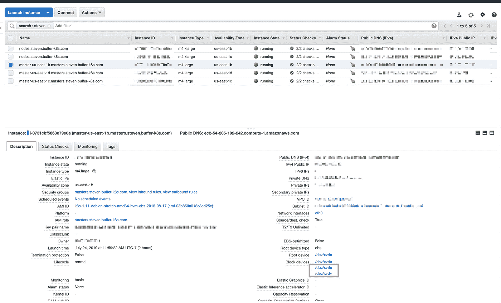
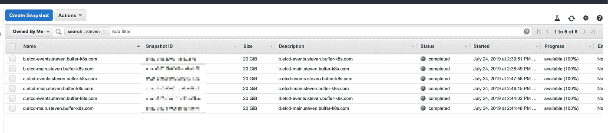
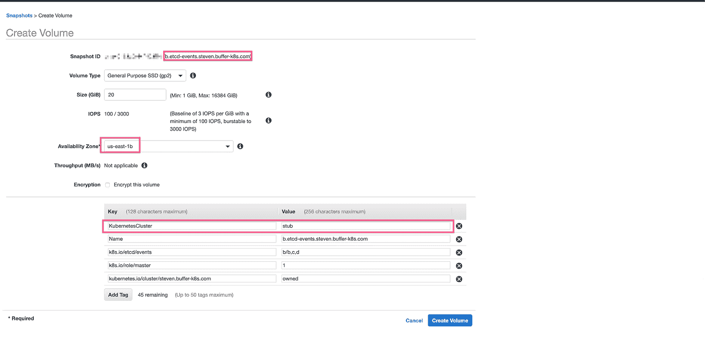
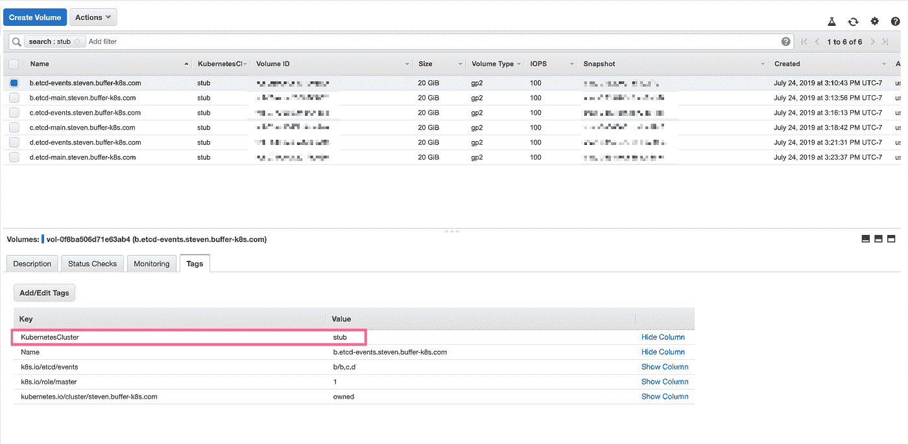
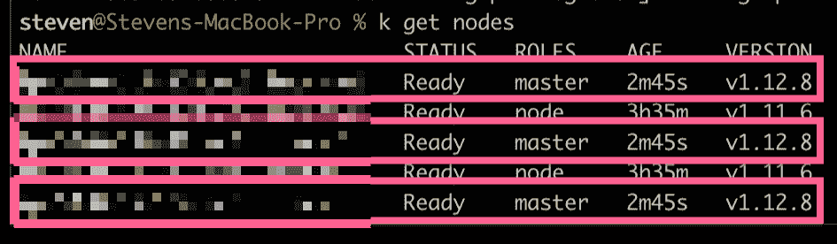
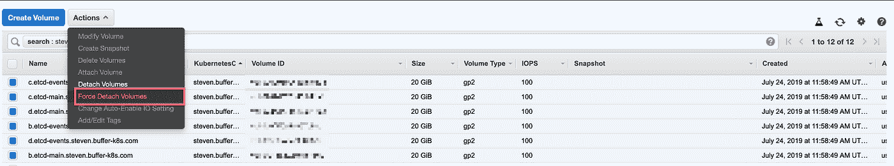
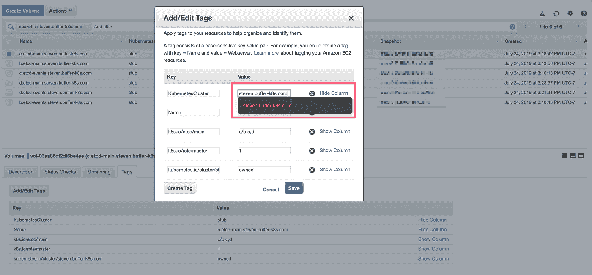
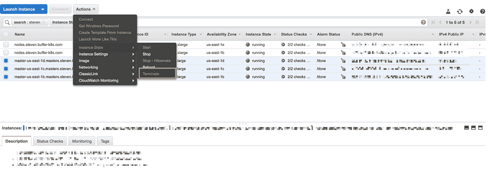
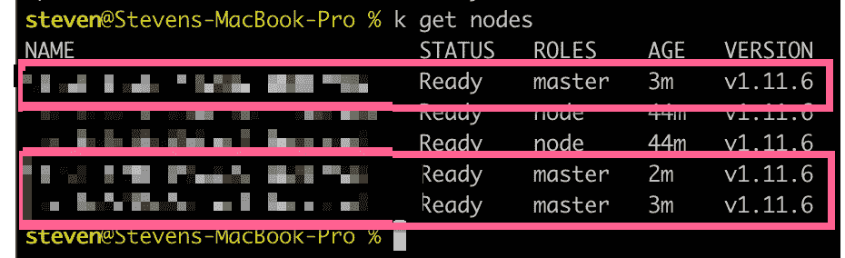

# 用于 AWS 上 Kops 的 Kubernetes 主节点备份—分步指南

> 原文：<https://itnext.io/kubernetes-master-nodes-backup-for-kops-on-aws-a-step-by-step-guide-4d73a5cd2008?source=collection_archive---------1----------------------->

([用 Kops](/upgrading-kubernetes-cluster-with-kops-and-things-to-watch-out-for-8b5e7dff71c0?source=friends_link&sk=9f326510f264e7a2a2cac97ae70410d0) 升级 Kubernetes 的相关文章)

对于那些已经使用了 [kops](https://github.com/kubernetes/kops) 一段时间的人来说，应该知道从 1.11 升级到 1.12 会带来更大的风险，因为它会[将 etcd2 升级到 etcd3](https://github.com/kubernetes/kops/blob/master/docs/etcd3-migration.md) 。

由于这种升级对控制平面(主节点)具有破坏性，尽管很短暂，但我们仍然非常重视，因为几乎所有的缓冲区生产服务都在这个集群上运行。我们认为需要一个比目前实施的 [Heptio Velero](https://github.com/heptio/velero) 更彻底的备份过程。

令我惊讶的是，我的谷歌搜索没有产生任何关于如何执行备份步骤的有用结果。公平地说，有几篇文章是专门针对备份由 [kubeadm](https://kubernetes.io/docs/setup/production-environment/tools/kubeadm/create-cluster-kubeadm/) 创建的主节点的，但没有什么太具体的针对`kops`的。我们知道我们必须自己去尝试。

我们非常愿意与社区分享我们的经验，并有可能听到每个人都需要做这个升级。现在，让我们开始吧！

# 创建备份

## 找到主节点并记下连接的设备

是啊，让我们做一些备份。但是在哪里？我们发现备份主节点最简单的方法是备份它们的 EBS 卷。这应该很容易吧？但就像科技领域的一切事物一样，总有一些更小的细节需要我们留意。像 Kubernetes + kops + AWS 这样复杂的东西毫不奇怪也不例外。为了找到正确的 EBS 卷，让我们看一下下面的屏幕截图。

需要注意的是，每个主节点有 2 个块设备，它们都很重要。一个是给`etcd-main`的，另一个是给`etcd-events`的。

## 从每个卷创建快照(3 个主机 x 2 个设备= 6 个快照)

现在，让我们尝试为每个卷创建一个快照。因为我们的 Kubernetes 集群运行在 3 个主节点上以实现高可用性。我们需要这样做 6 次！从屏幕截图中，您应该可以看到分配给每个卷的所有标签。它们很重要，因为 kop 依赖它们将卷附加回主节点。现在，让我们承认这一点。我将很快提供更多的细节。

冲洗并重复 6 次，我们应该准备好 6 张快照。

现在，让我们暂停一下，谈谈我前面提到的标签。每个卷都有正确的标签是很重要的。这里有一个表格，在创建卷时会很方便。是的，这意味着 3 个主节点设置需要 30 个(6 个卷，每个卷 5 个标签)标签。

## 创建卷

如屏幕截图所示，务必确保每个卷都创建在与预期主节点相同的可用性区域中。否则，他们就找不到对方了。现在，我们将保留一个值为`stub`,因为我们仍然附加了现有的卷。

完成这项工作后，只要我们将`stub`值换成`steven.buffer-k8s.com`，我们就应该有六个备份卷准备就绪。我们的备份到此结束。

# [可选]升级集群

这一步完全是可选的。唯一的目的是演示如何使用本文中描述的备份/恢复策略恢复错误的集群升级(从 1.11 到 1.12)。

请注意，主节点现在在 1.12 中，我们的目的是将所有内容回滚到 1.11。让我们看看我们是否能做到。

# 从备份恢复

## 分离现有卷并删除它们。这将暂时中断所有主节点

现在应该很明显，为了从备份中恢复，我们需要首先删除所有现有的附加卷。下面的截图显示了这是在哪里完成的。

## 将缺少的标记值添加到备份卷中

随着旧卷的分离和删除，先前创建的备份卷可以连接到主节点。但是首先，我们需要添加回正确的标签值，如屏幕截图所示。

我们现在正处于最后一步。坚持住！为了让主节点获得备份卷，我们需要重新创建所有备份卷。这一步就像终止节点一样简单，因为`kops`会自动启动新节点，并附加我们创建的卷。

# 利润！所有节点回到 1.11

# 结束语

感谢你在这篇涉及许多步骤的长文上对我的耐心。我相信我们现在正处于 Kubernetes 采用的一个非常有趣的阶段。虽然它在过去几年取得了惊人的进展，但生态系统仍在追赶。在很长一段时间里，Kubernetes 上的 CI/CD 是一个挑战，然后我们面临着可观察性的问题。幸运的是，像 Datadog 等人这样的供应商正在不断推出新产品来应对各种挑战。Buffer 是 Kubernetes 的早期采用者，能够见证所有这些转变，并尽我们所能为社区做出贡献，真是幸运。

如果你有任何想法，问题。请随时在[推特](https://twitter.com/stevenc81)上联系我。在那之前，我希望你和 Kubernetes 玩得开心！

*最初发表于*[*【http://github.com】*](https://gist.github.com/stevenc81/5f4ba26e311fa3ac683eed9c2504cb14)*。*