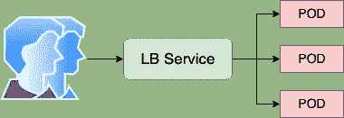

# Kubernetes + MetalLB + vlan

> 原文：<https://itnext.io/kubernetes-metallb-vlan-3e5f310a4510?source=collection_archive---------0----------------------->


使用您自己网络范围内的外部 IP 创建负载平衡器服务的简短手册。



## 要求

*   安装了 Ubuntu 18.04 LTS(我用的是 [hetzner.de](http://hetzner.de) 云解决方案)
*   已安装的 Kubernetes 集群
*   Kubernetes pod 网络应该与 MetalLB 兼容
*   金属 LB [要求](https://metallb.universe.tf/#requirements)

> MetalLB 是一个 **beta** 系统。你可以用它自担风险。

首先 **vlan** 工具应该安装在 Ubuntu 上:

```
**apt-get install vlan**
```

## Vlan 配置

*   将部分添加到**/etc/network/interfaces . d/50-cloud-init . CFG**

```
auto vlan10
iface vlan10 inet static
    address 192.168.10.1
    netmask 255.255.255.0
    vlan_raw_device eth0
```

*   在**/etc/net plan/01-net CFG . YAML**中添加一节(针对使用 netplan 的人的

```
*vlans:
    vlan10:
      id: 0
      link: ens4
      addresses: [192.168.10.0/24]*
```

> *更改后不要忘记重启网络子系统。*

## *安装金属 1b*

*安装非常简单:*

```
*# **kubectl apply -f** https://raw.githubusercontent.com/google/metallb/v0.7.3/manifests/metallb.yaml*
```

*检查扬声器和控制器是否正常工作*

```
*# **kubectl get pods** -n metallb-system*
```

## *定义 LB 的 IP 范围*

*为 MetalLB 服务分配 IP 空间区块。为此，我们将使用**192 . 168 . 10 . 240–192 . 168 . 10 . 250**。*

*准备 **ConfigMap** yaml 文件并部署到 kubermetes 集群。位于 [MetalLB GitHub](https://raw.githubusercontent.com/google/metallb/v0.7.3/manifests/example-layer2-config.yaml) 存储库中的配置图示例。*

*配置映射 yaml 文件的示例:*

```
*apiVersion: v1
kind: ConfigMap
metadata:
  namespace: metallb-system
  name: config
data:
  config: |
    address-pools:
    - name: default
      protocol: **layer2**
      addresses:
      - 192.168.10.240-192.168.10.250*
```

***这里使用的是 Layer2** 模式，但是 MetalLB 也可以配置 **BGP** 模式。参见 [BGP MetalLB 教程](https://metallb.universe.tf/tutorial/minikube/)。*

## *为测试配置 pod 和 LB 服务*

*现在，我们可以为 nginx pod 配置 MetalLB 服务(仅用于测试)*

```
*apiVersion: v1
kind: Service
metadata:
  name: nginx
spec:
  ports:
  - name: http
    port: 80
    protocol: TCP
    targetPort: 80
  selector:
    app: nginx
  type: LoadBalancer*
```

*并安装 nginx pod*

```
*apiVersion: apps/v1beta2
kind: Deployment
metadata:
  name: nginx
spec:
  selector:
    matchLabels:
      app: nginx
  template:
    metadata:
      labels:
        app: nginx
    spec:
      containers:
      - name: nginx
        image: nginx:1
        ports:
        - name: http
          containerPort: 80*
```

> *或者只执行教程 yaml 文件:*
> 
> *`*#* ***kubectl apply -f***[*https://raw.githubusercontent.com/google/metallb/v0.7.3/manifests/tutorial-2.yaml*](https://raw.githubusercontent.com/google/metallb/v0.7.3/manifests/tutorial-2.yaml)`*

## *结果*

*在结果中，我们可以看到分配给我们的负载平衡器的外部 IP*

```
*# **kubectl get services**
NAME         TYPE           CLUSTER-IP      EXTERNAL-IP      PORT(S)        AGE
kubernetes   ClusterIP      10.96.0.1       <none>           443/TCP        23h
nginx        LoadBalancer   10.107.44.239   **192.168.10.240**   80:32025/TCP   22h*
```

*让我们 ping 我们的 pod*

```
*# **ping 192.168.10.240**
PING 192.168.10.240 (192.168.10.240) 56(84) bytes of data.
From 192.168.10.1 icmp_seq=1 Destination Host Unreachable
From 192.168.10.1 icmp_seq=2 Destination Host Unreachable
From 192.168.10.1 icmp_seq=3 Destination Host Unreachable*
```

*哎呀…无法访问主机…是的，因为我们打开**端口 80** 与 nginx pod 通信。但是，如果我们执行 curl:*

```
*# **curl** [**http://192.168.10.240**](http://192.168.10.240)
<!DOCTYPE html>
<html>
<head>
<title>Welcome to nginx!</title>
<style>
    body {
        width: 35em;
        margin: 0 auto;
        font-family: Tahoma, Verdana, Arial, sans-serif;
    }
</style>
</head>
<body>
<h1>Welcome to nginx!</h1>
<p>If you see this page, the nginx web server is successfully installed and
working. Further configuration is required.</p><p>For online documentation and support please refer to
<a href="[http://nginx.org/](http://nginx.org/)">nginx.org</a>.<br/>
Commercial support is available at
<a href="[http://nginx.com/](http://nginx.com/)">nginx.com</a>.</p><p><em>Thank you for using nginx.</em></p>
</body>
</html>*
```

*我们会看到 nginx 的输出:)，这是*牛逼的*。*

***有用的链接***

*   *[金属银行](https://metallb.universe.tf/)网站*
*   *[如何在 Ubuntu 上安装 kubernetes](/kubernetes-on-ubuntu-on-virtualbox-60e8ce7c85ed)(文章版本较旧，但仍然可用)*

*附:我的 [Linkedin](https://www.linkedin.com/in/mikegavrilov/) ，如果你有什么有趣的事…..*