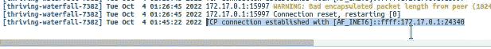

# Kubernetes: Minikube 和一个处于挂起状态的负载平衡器

> 原文：<https://itnext.io/kubernetes-minikube-and-a-loadbalancer-in-the-pending-status-c6bdea2d7bca?source=collection_archive---------10----------------------->


在 Minikube 中运行 Pritunl 后，无法连接到 VPN:

> …
> 2022–10–03 13:50:32 TCP/UDP:保留最近使用的远程地址:[AF _ INET]194 . 168 . 3 . 100:1194
> 2022–10–03 13:50:32 UDP 链接本地:(未绑定)
> 2022–10–03 13:50:32 UDP 链接远程:[AF _ INET]194.166

查看其 Kubernetes 服务:

```
$ kubectl -n pritunl-local get svc
NAME TYPE CLUSTER-IP EXTERNAL-IP PORT(S) AGE
pritunl LoadBalancer 10.102.129.25 <pending> 1194:30166/TCP 47m
…
```

类型是`LoadBalancer`，但是它的`EXTERNAL-IP`状态是*，因为 Minikube 没有 LoadBalancer 类型的服务，因为它必须在基础设施级别创建——AWS、GCE、Azure，然后 Kubernetes 从它们那里接收一个 IP 或 URL，将请求路由到这个负载平衡器。*

# *负载平衡器`<pending>`解决方案*

*对于 Minikube，有几种解决方案:*

*   *使用`[minikube tunnel](https://translate.google.com/website?sl=uk&tl=ru&hl=en&client=webapp&u=https://minikube.sigs.k8s.io/docs/handbook/accessing/%23using-minikube-tunnel)` -将在 Kubernetes 中的主机和服务之间创建一个隧道*
*   *或者`[minikube service](https://translate.google.com/website?sl=uk&tl=ru&hl=en&client=webapp&u=https://minikube.sigs.k8s.io/docs/commands/service/)`——获得一个直接的网址连接*
*   *或者设置`[externalIPs](https://translate.google.com/website?sl=uk&tl=ru&hl=en&client=webapp&u=https://kubernetes.io/docs/concepts/services-networking/service/%23external-ips)` -用于 Kubernetes 负载平衡器服务-手动配置*

*让我们尝试一切。*

## *迷你库贝隧道*

*检查主机上的路线:*

```
*$ route -n
Kernel IP routing table
Destination Gateway Genmask Flags Metric Ref Use Iface
0.0.0.0 192.168.3.1 0.0.0.0 UG 100 0 0 enp38s0
172.17.0.0 0.0.0.0 255.255.0.0 U 0 0 0 docker0
172.18.0.0 0.0.0.0 255.255.0.0 U 0 0 0 br-9c291321e71a]
192.168.3.0 0.0.0.0 255.255.255.0 U 100 0 0 enp38s0
192.168.59.0 0.0.0.0 255.255.255.0 U 0 0 0 vboxnet0*
```

*在这里可以看到我们的 VirtualBox 的路线— `192.168.59.0 0.0.0.0 255.255.255.0 U 0 0 0 vboxnet0`。*

*发射`tunnel`:*

```
*$ minikube tunnel
[sudo] password for setevoy:
Status:
machine: minikube
pid: 333552
route: 10.96.0.0/12 -> 192.168.59.107
minikube: Running
services: [pritunl]
errors:
minikube: no errors
router: no errors
loadbalancer emulator: no errors
…*
```

*现在检查路由——有一条通过 *192.168.59.107* 到网络*10 . 96 . 0 . 0*(CIDR)的新路由——这是一个运行 Minikube 本身的 VirtualBox 虚拟机:*

```
*$ route -n
Kernel IP routing table
Destination Gateway Genmask Flags Metric Ref Use Iface
0.0.0.0 192.168.3.1 0.0.0.0 UG 100 0 0 enp38s0
10.96.0.0 192.168.59.107 255.240.0.0 UG 0 0 0 vboxnet0
172.17.0.0 0.0.0.0 255.255.0.0 U 0 0 0 docker0
172.18.0.0 0.0.0.0 255.255.0.0 U 0 0 0 br-9c291321e71a
192.168.3.0 0.0.0.0 255.255.255.0 U 100 0 0 enp38s0
192.168.59.0 0.0.0.0 255.255.255.0 U 0 0 0 vboxnet0*
```

*立即检查 Kubernetes 负载平衡器:*

```
*$ kubectl -n pritunl-local get svc pritunl
NAME TYPE CLUSTER-IP EXTERNAL-IP PORT(S) AGE
pritunl LoadBalancer 10.102.129.25 10.102.129.25 1194:30166/TCP 54m*
```

**“管用！”**

## *迷你库服务*

*运行`minikube service`，指定服务的名称空间和名称——Minicube 将返回连接的 URL 给我们:*

```
*$ minikube service -n pritunl-local pritunl
| — — — — — — — -| — — — — -| — — — — — — — | — — — — — — — — — — — — — — -|
| NAMESPACE | NAME | TARGET PORT | URL |
| — — — — — — — -| — — — — -| — — — — — — — | — — — — — — — — — — — — — — -|
| pritunl-local | pritunl | openvpn/1194 | http://192.168.59.108:32350 |
| — — — — — — — -| — — — — -| — — — — — — — | — — — — — — — — — — — — — — -|
🎉 Opening service pritunl-local/pritunl in default browser…*
```

*这里， *192.168.59.108* 是我们 VirtualBox 服务器的地址， *32350* 是上面的 NodePort，运行的是 Pritunl 服务器。*

*您还可以使用`list`列出所有 Kubernetes 服务:*

```
*$ minikube service -n pritunl-local list
| — — — — — — — -| — — — — — — — — -| — — — — — — — | — — — — — — — — — — — — — — -|
| NAMESPACE | NAME | TARGET PORT | URL |
| — — — — — — — -| — — — — — — — — -| — — — — — — — | — — — — — — — — — — — — — — -|
| pritunl-local | pritunl | openvpn/1194 | http://192.168.59.108:32350 |
| pritunl-local | pritunl-mongodb | No node port |
| pritunl-local | pritunl-web | No node port |
| — — — — — — — -| — — — — — — — — -| — — — — — — — | — — — — — — — — — — — — — — -|*
```

*或者在一行而不是一个表格中获取 URL:*

```
*$ kubectl -n priminikube service -n pritunl-local pritunl — url
http://192.168.59.108:32350*
```

*尝试连接:*

```
*$ telnet 192.168.59.108 32350
Trying 192.168.59.108…
Connected to 192.168.59.108.
Escape character is ‘^]’.*
```

*Pritunl 日志:*

**

**“管用！”**

## *负载平衡器`externalIPs`*

*获取 VirtualBox 计算机的 IP:*

```
*$ minikube ip
192.168.59.108*
```

*编辑负载平衡器:*

```
*$ kubectl -n pritunl-local edit svc pritunl*
```

*设置`externalIPs`:*

```
*...
  externalIPs:
  - 192.168.59.108
...*
```

*保存，检查服务本身:*

```
*$ kubectl -n pritunl-local get svc pritunl
NAME TYPE CLUSTER-IP EXTERNAL-IP PORT(S) AGE
pritunl LoadBalancer 10.104.33.93 192.168.59.108 1194:32350/TCP 81m*
```

*并检查连接:*

```
*$ telnet 192.168.59.108 1194
Trying 192.168.59.108…
Connected to 192.168.59.108.
Escape character is ‘^]’.*
```

**“管用！”**

*完成了。*

**最初发布于* [*RTFM: Linux、DevOps、系统管理*](https://rtfm.co.ua/en/kubernetes-minikube-and-a-loadbalancer-in-the-pending-status/) *。**