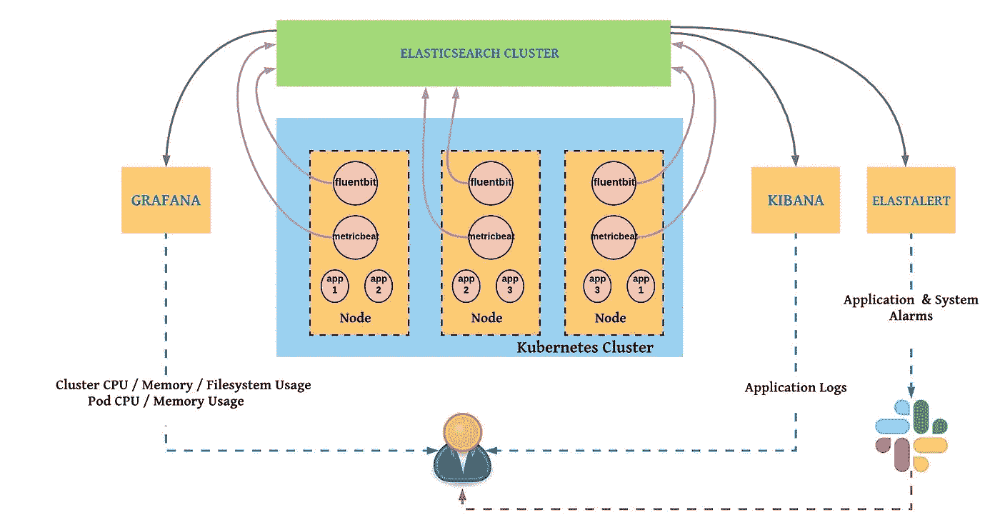
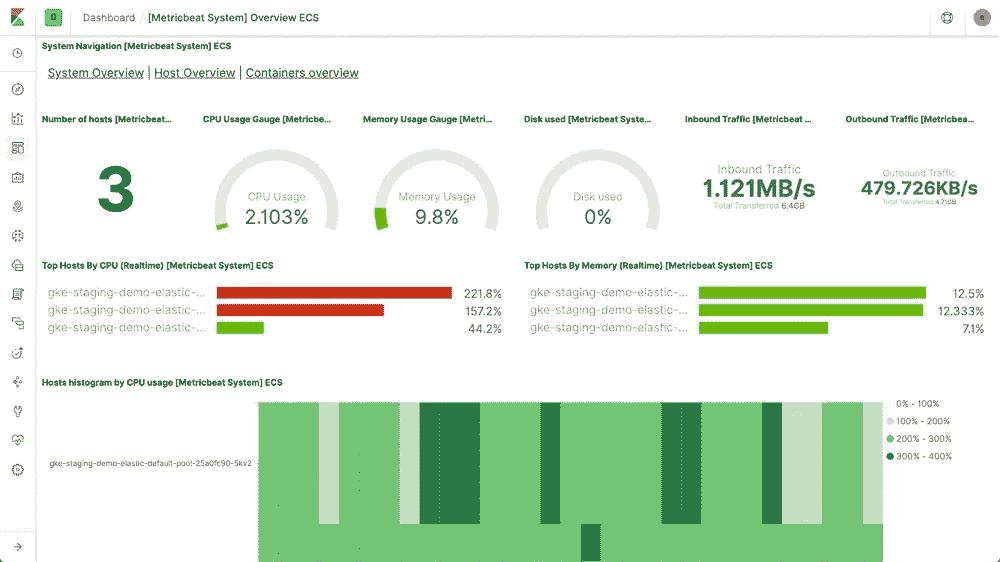
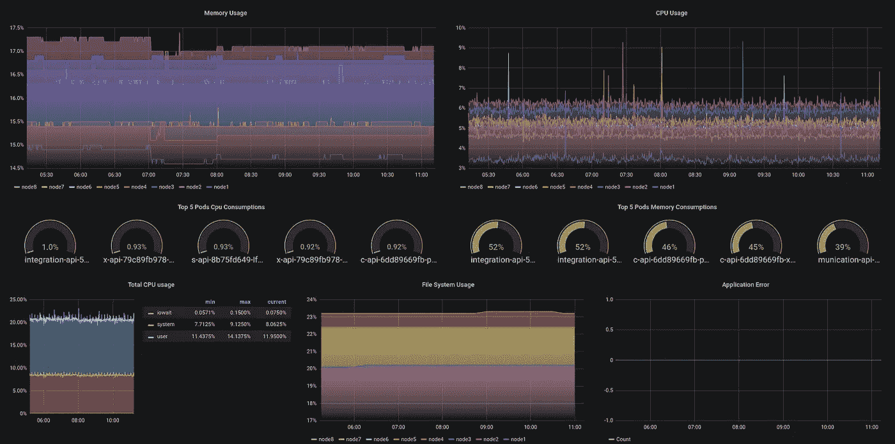

# Kubernetes 监测和记录解决方案:EMG 和 EFK 叠加(第 1 部分)

> 原文：<https://itnext.io/kubernetes-monitoring-and-logging-solution-emg-and-efk-stack-part-1-8aa58339e7a4?source=collection_archive---------4----------------------->



监控和记录系统是 DevOps 文化的重要组成部分。本文共分 3 部分，每部分分别为**监控**、**日志记录**、**报警**。在第一部分，我们将讨论如何从 Kubernetes 集群中收集度量，以及如何可视化它们。在第二部分，我们将讨论如何从运行在 Kubernetes 上的应用程序中收集日志。最后，我们将学习如何设置警报，例如，如果应用程序产生错误，或者如果内存使用率超过 80%。

**EMG STACK**

为 Kubernetes 集群设置监控允许您跟踪系统和应用程序资源使用情况。有许多用于 Kubernetes 监测的替代堆栈，如 promethius-Grafana-alert manager、Telegraf-influx db-Chronograf-Kapacitor(TICK 堆栈)等。今天，我将介绍一种使用 elastic search-metric bate-Grafana(EMG)的不同方法。

**metric bate**是一款轻质公制收集器。它通过各种模块从系统和服务中收集指标。我们可以使用系统模块轻松收集系统指标，使用 Kubernetes 模块轻松收集 Kubernetes 指标。在收集并向**弹性搜索**(参见图 1)发送度量后，我们可以使用 **Kibana** 进行可视化，因为弹性提供了默认的可视化，如下所示。



**kiba na metric bate**

我使用了基巴纳一段时间，然后我决定使用弹性搜索作为数据源在 Grafana 中构建相同的可视化，因为 Grafana 为您提供了更好的可视化选项，如下所示。(这当然是我个人的观点)



**Grafana metric bate**

您需要在 Kubernetes 群集中的每个节点上安装 metricbeat 代理，正如您在**图 1** 中看到的，这样您就可以收集度量了。使用 DaemonSet 确保在集群中的每个节点(主节点除外)上运行 metricbeat。默认情况下，DaemonSets 不在主节点上调度。为了将其安排在主菜单上，您必须在 pod 规范中添加一个容差。下面是一个示例。

```
tolerations:- key: node-role.kubernetes.io/masteroperator: Existseffect: NoSchedule- operator: "Exists"effect: "NoExecute"- operator: "Exists"effect: "NoSchedule"
```

你可以从 [Elastic](http://www.elastic.co) 提供的 [github](https://github.com/elastic/beats/tree/master/deploy/kubernetes/metricbeat) 下载官方清单文件。下载并安装 metricbeat 清单文件后，现在您可以配置您的 **Grafana** 仪表盘了。你可以从我在 grafana.com 分享的[示例仪表板](https://grafana.com/grafana/dashboards/11507)开始。metricbeat 产生了许多指标，您可以创建与我不同的仪表板。