# Kubernetes:使用 Prometheus-exporters 进行监控，服务发现及其作用

> 原文：<https://itnext.io/kubernetes-monitoring-with-prometheus-exporters-a-service-discovery-and-its-roles-ce63752e5a1?source=collection_archive---------0----------------------->


我们的 Kubernetes 集群的下一个任务是设置它对 Prometheus 的监控。

这一任务因以下事实而变得复杂，即需要监控全部资源:

*   从基础设施方面——ес2 个工作节点实例，它们的 CPU、内存、网络、磁盘等
*   Kubernetes 本身的关键服务——它的 API 服务器统计、etcd、调度程序
*   部署、pod 和容器状态
*   并且需要从集群中运行的应用程序收集一些指标

要监控所有这些，可以使用以下工具:

*   `[metrics-server](https://github.com/kubernetes-sigs/metrics-server)` -集群的 CPU、内存、文件描述符、磁盘等
*   `[cAdvisor](https://github.com/google/cadvisor)`-Docker 守护进程指标-容器监控
*   `[kube-state-metrics](https://github.com/kubernetes/kube-state-metrics)` -部署、单元、节点
*   `[node-exporter](https://github.com/prometheus/node_exporter)` : EC2 实例指标——CPU、内存、网络

**我们将在这篇文章中做些什么？**

*   会启动普罗米修斯服务器
*   启动 Redis 服务器和`redis-exporter`来获取 Redis 服务器指标
*   将为普罗米修斯号增加一个集群角色
*   将配置 Prometheus Kubernetes 服务发现以收集指标:
*   将对 Prometheus Kubernetes 服务发现角色发表看法
*   将增加更多出口商:
*   节点导出器
*   kube-状态-度量
*   метрики cAdvisor
*   和度量服务器

**这一切将如何进行？**

将使用[普罗米修斯联盟](https://rtfm.co.ua/prometehus-obzor-federation-monitoring-docker-swarm-i-nastrojki-alertmanager/#Prometheus_crossservice_federation):

*   我的项目中已经有 Prometheus-Grafana 堆栈，用于监控现有资源——这将是我们的“中央”Prometheus 服务器，它将从 Kubernetes 集群中的其他 Prometheus 服务器获取指标(我们所有的 AWS VPC 网络通过 [VPC 对等](https://rtfm.co.ua/aws-nastrojka-vpc-peering/)互连，指标将通过私有子网传输)
*   在 EKS 集群中，我们将启动额外的 Prometheus 服务器，该服务器将从集群和导出器中提取指标，然后将它们移交给“中央”Prometheus

`**helm install**`

在 99%指南中，我在一次调查中发现 Kubernetes 和 Prometheus 监控的所有安装和配置都被限制在唯一的一个"`helm install`"命令中。

[Helm](https://helm.sh/) 它当然很棒——一个模板，一个工具中的包管理器，但问题是它将在引擎盖下做很多事情，但现在我想知道那里到底发生了什么。

事实上，这是 [AWS Elastic Kubernetes 服务的以下部分:集群创建自动化，第 1 部分—云形成](https://rtfm.co.ua/en/aws-elastic-kubernetes-service-a-cluster-creation-automation-part-1-cloudformation/)(英语中的*)和 [AWS: Elastic Kubernetes 服务—автоматизациясозданиякластеиа，часть 2 — Ansible，eksctl](https://rtfm.co.ua/aws-elastic-kubernetes-service-avtomatizaciya-sozdaniya-klastera-chast-2-ansible-eksctl/) (俄语中的*仍然是*)，所以在这篇文章中会有一些答案。*

*此处使用的版本:*

*   *kubernetes:(AWS EKS):1 . 15 . 11 版*
*   *普罗米修斯:2.17.1*
*   *kubectl:1 . 18 . 0 版*

***内容***

*   *[kubectl 上下文](https://rtfm.co.ua/en/kubernetes-monitoring-with-prometheus-exporters-a-service-discovery-and-its-roles/#kubectl_context)*
*   *[配置图重新加载器](https://rtfm.co.ua/en/kubernetes-monitoring-with-prometheus-exporters-a-service-discovery-and-its-roles/#ConfigMap_Reloader)*
*   *[在 Kubernetes 中启动 Prometheus 服务器](https://rtfm.co.ua/en/kubernetes-monitoring-with-prometheus-exporters-a-service-discovery-and-its-roles/#Start_Prometheus_server_in_Kubernetes)*
*   *[命名空间](https://rtfm.co.ua/en/kubernetes-monitoring-with-prometheus-exporters-a-service-discovery-and-its-roles/#Namespace)*
*   *[普罗米修斯. yml 配置图](https://rtfm.co.ua/en/kubernetes-monitoring-with-prometheus-exporters-a-service-discovery-and-its-roles/#The_prometheus_yml_ConfigMap)*
*   *[Prometheus 部署和负载平衡器服务](https://rtfm.co.ua/en/kubernetes-monitoring-with-prometheus-exporters-a-service-discovery-and-its-roles/#Prometheus_Deployment_and_a_LoadBalancer_Service)*
*   *[监控配置](https://rtfm.co.ua/en/kubernetes-monitoring-with-prometheus-exporters-a-service-discovery-and-its-roles/#Monitoring_configuration)*
*   *[Redis&Redis _ exporter](https://rtfm.co.ua/en/kubernetes-monitoring-with-prometheus-exporters-a-service-discovery-and-its-roles/#Redis_redisexporter)*
*   *[Prometheus ClusterRole、ServiceAccount 和 ClusterRoleBinding](https://rtfm.co.ua/en/kubernetes-monitoring-with-prometheus-exporters-a-service-discovery-and-its-roles/#Prometheus_ClusterRole,_ServiceAccount,_and_ClusterRoleBinding)*
*   *[Prometheus Kubernetes 服务发现](https://rtfm.co.ua/en/kubernetes-monitoring-with-prometheus-exporters-a-service-discovery-and-its-roles/#Prometheus_Kubernetes_Service_Discovery)*
*   *[kubernetes_sd_config 角色](https://rtfm.co.ua/en/kubernetes-monitoring-with-prometheus-exporters-a-service-discovery-and-its-roles/#kubernetessdconfig_roles)*
*   *[节点角色](https://rtfm.co.ua/en/kubernetes-monitoring-with-prometheus-exporters-a-service-discovery-and-its-roles/#node_role)*
*   *[pod 角色](https://rtfm.co.ua/en/kubernetes-monitoring-with-prometheus-exporters-a-service-discovery-and-its-roles/#pod_role)*
*   *[节点-导出器指标](https://rtfm.co.ua/en/kubernetes-monitoring-with-prometheus-exporters-a-service-discovery-and-its-roles/#nodeexporter_metrics)*
*   *[kube 状态指标](https://rtfm.co.ua/en/kubernetes-monitoring-with-prometheus-exporters-a-service-discovery-and-its-roles/#kubestatemetrics)*
*   *管理员*
*   *[指标-服务器](https://rtfm.co.ua/en/kubernetes-monitoring-with-prometheus-exporters-a-service-discovery-and-its-roles/#metricsserver)*

## *`kubectl`上下文*

*首先，配置对集群的访问——为您的`kubectl`添加一个新的上下文:*

```
*$ aws --region eu-west-2 eks update-kubeconfig --name bttrm-eks-dev-2
Added new context arn:aws:eks:eu-west-2:534***385:cluster/bttrm-eks-dev-2 to /home/admin/.kube/config*
```

*或者切换到已经存在的(如果有的话):*

```
*$ kubectl config get-contexts
…
arn:aws:eks:eu-west-2:534****385:cluster/bttrm-eks-dev-1
…
kubectl config use-context arn:aws:eks:eu-west-2:534***385:cluster/bttrm-eks-dev-2
Switched to context “arn:aws:eks:eu-west-2:534***385:cluster/bttrm-eks-dev-2”.*
```

## *`ConfigMap`重装机*

*因为我们现在要对未来的普罗米修斯号的`ConfigMap`做很多改动，增加[重装器](https://rtfm.co.ua/en/kubernetes-configmaps-and-secrets-on-a-gorush-server-example/)，所以吊舱会在没有我们干预的情况下立即应用这些改动。*

*创建目录:*

```
*$ mkdir -p roles/reloader/tasks*
```

*这里只有一个任务——重装机安装。会用到`kubectl`，用 Ansible `[command](https://docs.ansible.com/ansible/latest/modules/command_module.html)`模块调用。*

*在`roles/reloader/tasks/main.yml`中添加以下内容:*

```
*- name: "Install Reloader"
  command: "kubectl apply -f https://raw.githubusercontent.com/stakater/Reloader/master/deployments/kubernetes/reloader.yaml"*
```

*现在够了——我只是没有时间去深究`[k8s](https://docs.ansible.com/ansible/latest/modules/k8s_module.html)`和它与`python-requests`进口的问题。*

*将此角色添加到行动手册中:*

```
*- hosts:
  - all
  become:
    true
  roles:
    - role: cloudformation
      tags: infra
    - role: eksctl
      tags: eks
    - role: reloader
      tags: reloader*
```

*运行:*

```
*$ ansible-playbook eks-cluster.yml --tags reloader*
```

*并检查:*

```
*$ kubectl get po
NAME READY STATUS RESTARTS AGE]
reloader-reloader-55448df76c-9l9j7 1/1 Running 0 3m20s*
```

## *在 Kubernetes 启动 Prometheus 服务器*

*首先，让我们启动集群中的普罗米修斯本身。*

*它的配置文件将被保存为一个`ConfigMap`对象。*

*集群已经创建好了，将来一切都将由 Ansible 管理，所以在这里添加它的目录结构*

```
*$ mkdir -p roles/monitoring/{tasks,templates}*
```

## *名称空间*

*所有与监控相关的资源都将保存在一个专用的 Kubernetes 名称空间中。*

*在`roles/monitoring/templates/`目录下添加一个配置文件，比如称它为`prometheus-ns.yml.j2`:*

```
*---
apiVersion: v1
kind: Namespace
metadata:
  name: monitoring*
```

*添加一个新文件`roles/monitoring/tasks/main.yml`来创建名称空间:*

```
*- name: "Create the Monitoring Namespace"
  command: "kubectl apply -f roles/monitoring/templates/prometheus-ns.yml.j2"*
```

*将角色添加到行动手册中:*

```
*- hosts:
  - all
  become:
    true
  roles:
    - role: cloudformation
      tags: infra
    - role: eksctl
      tags: eks
    - role: reloader
      tags: reloader
    - role: monitoring
      tags: monitoring*
```

*运行以测试:*

```
*$ ansible-playbook eks-cluster.yml — tags monitoring*
```

*检查:*

```
*$ kubectl get ns
NAME STATUS AGE
default Active 24m
kube-node-lease Active 25m
kube-public Active 25m
kube-system Active 25m
monitoring Active 32s*
```

## *`prometheus.yml`配置图*

*如前所述，Prometheus 配置数据将保存在`ConfigMap`中。*

*创建一个名为`roles/monitoring/templates/prometheus-configmap.yml.j2`的新文件——这是一个最小的配置:*

```
*---
apiVersion: v1
kind: ConfigMap
metadata:
  name: prometheus-config
  namespace: monitoring
data:
  prometheus.yml: |
    global:
      scrape_interval:     15s
      external_labels:
        monitor: 'eks-dev-monitor'
    scrape_configs:
      - job_name: 'prometheus'
        scrape_interval: 5s
        static_configs:
          - targets: ['localhost:9090']*
```

*将其添加到`roles/monitoring/tasks/main.yml`:*

```
*- name: "Create the Monitoring Namespace"
  command: "kubectl apply -f roles/monitoring/templates/prometheus-ns.yml.j2"

- name: "Create prometheus.yml ConfigMap"
  command: "kubectl apply -f roles/monitoring/templates/prometheus-configmap.yml.j2"*
```

*现在可以再检查一次——向上涂抹并检查`ConfigMap`内容:*

```
*$ kubectl -n monitoring get configmap prometheus-config -o yaml
apiVersion: v1
data:
prometheus.yml: |
global:
scrape_interval: 15s
external_labels:
monitor: ‘eks-dev-monitor’
scrape_configs:
- job_name: ‘prometheus’
scrape_interval: 5s
static_configs:
- targets: [‘localhost:9090’]
kind: ConfigMap
…*
```

## *Prometheus 部署和负载平衡器服务*

*现在我们可以启动普罗米修斯号了。*

*创建其部署文件— `roles/monitoring/templates/prometheus-deployment.yml.j2`:*

```
*---
apiVersion: apps/v1
kind: Deployment
metadata:
  name: prometheus-server
  labels:
    app: prometheus
  namespace: monitoring
  annotations:
    reloader.stakater.com/auto: "true"
#    service.beta.kubernetes.io/aws-load-balancer-internal: "true"  
spec:
  replicas: 2
  selector:
    matchLabels: 
      app: prometheus
  template:
    metadata:
      labels:
        app: prometheus
    spec:
      containers:
      - name: prometheus-server
        image: prom/prometheus
        volumeMounts:
          - name: prometheus-config-volume
            mountPath: /etc/prometheus/prometheus.yml
            subPath: prometheus.yml
        ports:
        - containerPort: 9090
      volumes:
        - name: prometheus-config-volume
          configMap:
            name: prometheus-config
---
kind: Service
apiVersion: v1
metadata:
  name: prometheus-server-alb
  namespace: monitoring
spec:
  selector:
    app: prometheus
  ports:
    - protocol: TCP
      port: 80
      targetPort: 9090
  type: LoadBalancer*
```

*这里:*

1.  *用普罗米修斯制造两个豆荚*
2.  *附上*Prometheus-config**
3.  *用`LoadBalancer`类型创建一个`Service`来访问 9090 端口上的 Prometheus 服务器——这将创建一个经典类型的 AWS 负载平衡器(不是应用程序 LB ),在 80 端口上有一个监听器*

*此处的注释:*

*   **reloader.stakater.com/auto:真* —用于重装服务*
*   **service.beta.kubernetes.io/aws-load-balancer-internal:真*可以评论，就目前而言，稍后`Internal`将用于配置 [VPC 对等](https://rtfm.co.ua/aws-nastrojka-vpc-peering/)和[普罗米修斯联盟](https://rtfm.co.ua/prometehus-obzor-federation-monitoring-docker-swarm-i-nastrojki-alertmanager/)，此时让我们使用面向互联网*

*添加到`tasks`:*

```
*...
- name: "Deploy Prometheus server and its LoadBalancer"
  command: "kubectl apply -f roles/monitoring/templates/prometheus-deployment.yml.j2"*
```

*运行:*

```
*$ ansible-playbook eks-cluster.yml --tags monitoring
…
TASK [monitoring : Deploy Prometheus server and its LoadBalancer] ****
changed: [localhost]
…*
```

*检查舱:*

```
*$ kubectl -n monitoring get pod
NAME READY STATUS RESTARTS AGE
prometheus-server-85989544df-pgb8c 1/1 Running 0 38s
prometheus-server-85989544df-zbrsx 1/1 Running 0 38s*
```

*负载平衡器服务:*

```
*$ kubectl -n monitoring get svc
NAME TYPE CLUSTER-IP EXTERNAL-IP PORT(S) AGE
prometheus-server-alb LoadBalancer 172.20.160.199 ac690710a9747460abc19cd999812af8–1463800400.eu-west-2.elb.amazonaws.com 80:30190/TCP 42s*
```

*或者在 AWS 仪表板中:*

*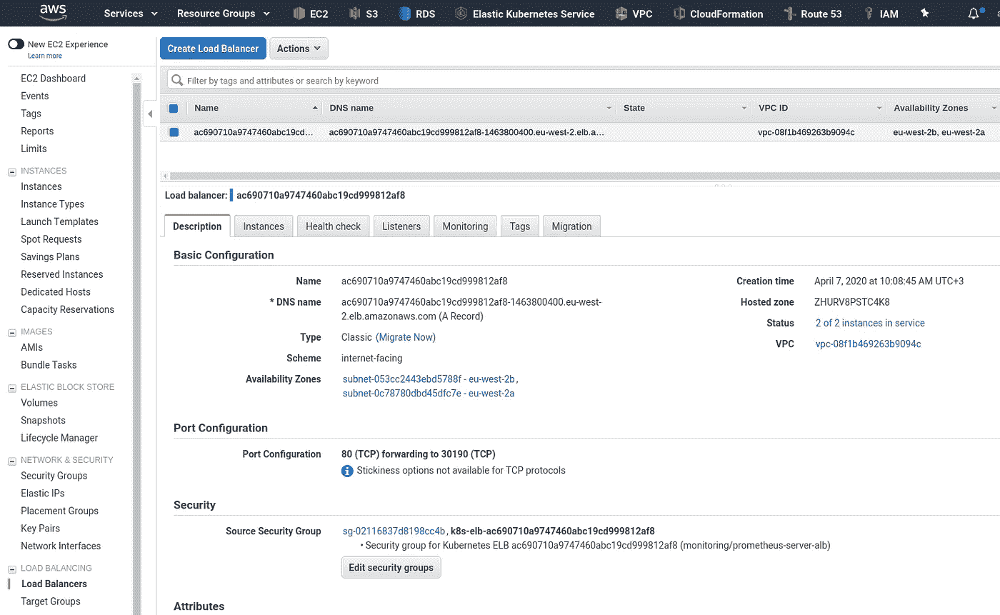*

*选中它—在浏览器中打开:*

*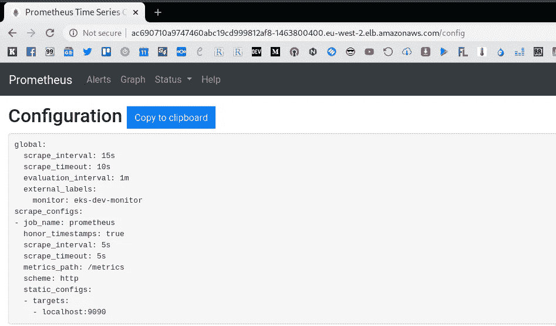*

*如果负载平衡器有任何问题，可以在这里使用端口转发:*

```
*$ kubectl -n monitoring port-forward prometheus-server-85989544df-pgb8c 9090:9090
Forwarding from 127.0.0.1:9090 -> 9090
Forwarding from [::1]:9090 -> 9090*
```

*这样，就可以使用 http://*localhost:9090*URL 访问 Prometheus。*

## *监控配置*

*好了，我们已经启动了普罗米修斯，现在我们可以收集一些指标了。*

*让我们从最简单的任务开始——启动某个服务，一个它的导出器，并配置 Prometheus 来收集它的指标。*

## *雷迪斯&& `redis_exporter`*

*为此，我们可以使用 Redis 服务器和`[redis_exporter](https://github.com/oliver006/redis_exporter)`。*

*创建一个新的部署文件`roles/monitoring/templates/tests/redis-server-and-exporter-deployment.yml.j2`:*

```
*---
apiVersion: extensions/v1beta1
kind: Deployment
metadata:
  name: redis
spec:
  replicas: 1
  template:
    metadata:
      annotations:
        prometheus.io/scrape: "true"
      labels:
        app: redis
    spec:
      containers:
      - name: redis
        image: redis
        resources:
          requests:
            cpu: 100m
            memory: 100Mi
        ports:
        - containerPort: 6379
      - name: redis-exporter
        image: oliver006/redis_exporter:latest
        resources:
          requests:
            cpu: 100m
            memory: 100Mi
        ports:
        - containerPort: 9121
---
kind: Service
apiVersion: v1
metadata:
  name: redis
spec:
  selector:
    app: redis
  ports:
  - name: redis
    protocol: TCP
    port: 6379
    targetPort: 6379
  - name: prom
    protocol: TCP
    port: 9121
    targetPort: 9121*
```

*此处的注释:*

*   **prometheus.io/scrape*—用于 pod 和服务中的过滤器，请参见本帖子更新的[角色](https://rtfm.co.ua/?p=23859#kubernetessdconfig_roles)部分*
*   **prometheus.io/port*—可在此指定非默认端口*
*   *prometheus.io/path*——出口商的指标路径可以在这里从默认的`/metrics`更改**

*参见[每舱普罗米修斯标注](https://www.weave.works/docs/cloud/latest/tasks/monitor/configuration-k8s/#per-pod-prometheus-annotations)。*

*注意，我们没有在这里设置名称空间 Redis 服务及其导出器将在默认的名称空间中创建，我们很快就会看到会发生什么。*

*手动部署它，这是一项测试任务，无需添加到 Ansible:*

```
*$ kubectl apply -f roles/monitoring/templates/tests/redis-server-and-exporter-deployment.yml.j2
deployment.extensions/redis created
service/redis created*
```

*检查一下——必须有两个容器在运行。*

*在默认命名空间中找到一个 pod:*

```
*$ kubectl get pod
NAME READY STATUS RESTARTS AGE
redis-698cd557d5-xmncv 2/2 Running 0 10s
reloader-reloader-55448df76c-9l9j7 1/1 Running 0 23m*
```

*和里面的容器:*

```
*$ kubectl get pod redis-698cd557d5-xmncv -o jsonpath=’{.spec.containers[*].name}’
redis redis-exporter*
```

*好吧。*

*现在，从该导出器添加指标集合—更新`prometheus-configmap.yml.j2`配置图—添加新目标， *redis* :*

```
*---
apiVersion: v1
kind: ConfigMap
metadata:
  name: prometheus-config
  namespace: monitoring
data:
  prometheus.yml: |

    global:
      scrape_interval:     15s
      external_labels:
        monitor: 'eks-dev-monitor'

    scrape_configs:

      - job_name: 'prometheus'
        scrape_interval: 5s
        static_configs:
          - targets: ['localhost:9090']

      - job_name: 'redis'
        static_configs:
          - targets: ['redis:9121']*
```

*展开，检查普罗米修斯的*目标*:*

*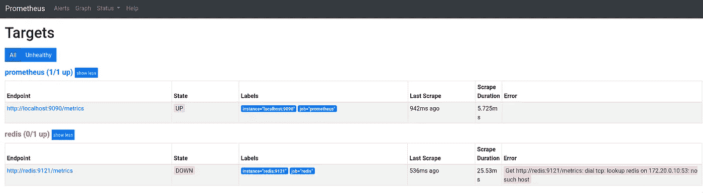*

*不错——这里出现了一个新的目标。*

*但是为什么用 ***得到*** [***却失败了呢 http://redis:9121/metrics:***](http://redis:9121/metrics:)***拨 tcp:查找 redis 上 172.20.0.10:53:没有这样的主机*** 错误？*

## *Prometheus ClusterRole、ServiceAccount 和 ClusterRoleBinding*

*我们记得，我们在*监控*名称空间中启动了我们的普罗米修斯:*

```
*$ kubectl get ns monitoring
NAME STATUS AGE
monitoring Active 25m*
```

*而在 Redis 部署中，我们没有设置名称空间，因此，它的 pod 是在默认的名称空间中创建的:*

```
*$ kubectl -n default get pod
NAME READY STATUS RESTARTS AGE
redis-698cd557d5-xmncv 2/2 Running 0 12m*
```

*或者这样:*

```
*$ kubectl get pod redis-698cd557d5-xmncv -o jsonpath=’{.metadata.namespace}’
default*
```

*要使 Prometheus 能够访问集群上的所有名称空间，需要添加一个`ClusterRole`、`ServiceAccount`和`ClusterRoleBinding`，请参见[Kubernetes:part 5——具有角色和角色绑定示例的 RBAC 授权](https://rtfm.co.ua/en/kubernetes-part-5-rbac-authorization-with-a-role-and-rolebinding-example/)帖子了解更多详细信息。*

*此外，该服务帐户将用于 [Prometheus Kubernetes 服务发现](https://rtfm.co.ua/en/kubernetes-monitoring-with-prometheus-exporters-a-service-discovery-and-its-roles/#Prometheus_Kubernetes_Service_Discovery)。*

*添加一个`roles/monitoring/templates/prometheus-rbac.yml.j2`文件:*

```
*---
apiVersion: rbac.authorization.k8s.io/v1beta1
kind: ClusterRole
metadata:
  name: prometheus
rules:
- apiGroups: [""]
  resources:
  - services
  - endpoints
  - pods
  - nodes
  - nodes/proxy
  - nodes/metrics
  verbs: ["get", "list", "watch"]
- apiGroups:
  - extensions
  resources:
  - ingresses
  verbs: ["get", "list", "watch"]
---
apiVersion: v1
kind: ServiceAccount
metadata:
  name: prometheus
  namespace: monitoring
---  
apiVersion: rbac.authorization.k8s.io/v1beta1
kind: ClusterRoleBinding
metadata:
  name: prometheus
roleRef:
  apiGroup: rbac.authorization.k8s.io
  kind: ClusterRole
  name: prometheus
subjects:
- kind: ServiceAccount
  name: prometheus
  namespace: monitoring*
```

*在创建 ConfigMap 之后和部署 Prometheus 服务器之前添加其执行:*

```
*- name: "Create the Monitoring Namespace"
  command: "kubectl apply -f roles/monitoring/templates/prometheus-ns.yml.j2"

- name: "Create prometheus.yml ConfigMap"
  command: "kubectl apply -f roles/monitoring/templates/prometheus-configmap.yml.j2"

- name: "Create Prometheus ClusterRole"
  command: "kubectl apply -f roles/monitoring/templates/prometheus-rbac.yml.j2"

- name: "Deploy Prometheus server and its LoadBalancer"
  command: "kubectl apply -f roles/monitoring/templates/prometheus-deployment.yml.j2"*
```

*更新`prometheus-deployment.yml`——在其`spec`中增加`serviceAccountName`:*

```
*...
  template:
    metadata:
      labels:
        app: prometheus
    spec:
      serviceAccountName: prometheus
      containers:
      - name: prometheus-server
        image: prom/prometheus
...*
```

*除此之外，要调用另一个名称空间中的 pod，我们需要使用指定名称空间的 FQDN，在这种情况下，访问 Redis 导出器的地址将是*Redis . default . SVC . cluster . local*，请参见服务和 pod 的[DNS](https://kubernetes.io/docs/concepts/services-networking/dns-pod-service/)。*

*更新配置映射—更改 Redis 地址:*

```
*...
    scrape_configs:

      - job_name: 'prometheus'
        scrape_interval: 5s
        static_configs:
          - targets: ['localhost:9090']

      - job_name: 'redis'
        static_configs:
          - targets: ['redis.default.svc.cluster.local:9121']*
```

*使用 Ansible 部署以更新所有内容:*

```
*$ ansible-playbook eks-cluster.yml --tags monitoring*
```

*现在检查*目标*:*

*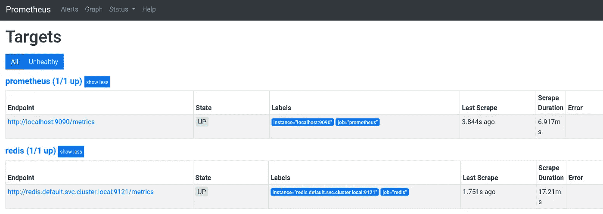*

*和指标:*

*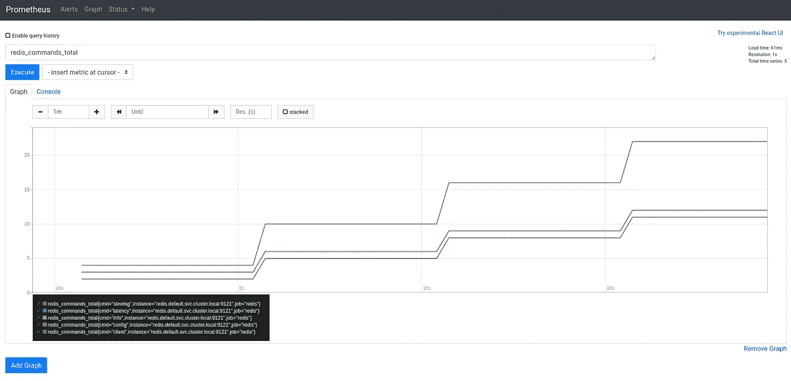*

## *Prometheus Kubernetes 服务发现*

*在 Prometheus 中是一件好事，但是如果您必须从数百个这样的服务中收集指标呢？*

*解决方案是使用`[kubernetes_sd_config](https://rtfm.co.ua/goto/https://prometheus.io/docs/prometheus/1.8/configuration/configuration/#kubernetes_sd_config)`功能。*

## *`kubernetes_sd_config`角色*

*Prometheus 中的 Kubernetes SD 有一个所谓的“角色”集合，它定义了如何收集和显示指标。*

*每个这样的角色都有自己的标签集，参见[文档](https://prometheus.io/docs/prometheus/latest/configuration/configuration/#kubernetes_sd_config):*

*   **节点*:将在每个集群的 WorkerNode кластера上通过一个目标，将收集 kubelet 的度量*
*   **服务*:查找并返回每个服务及其端口*
*   **pod* :所有的 pod 和将返回它的容器作为目标来获取度量*
*   **端点*:将从每个端点为集群中的每个服务创建目标*
*   **入口*:将为每个入口的每个路径创建目标*

*区别仅在于返回的标签，以及每个这样的目标将使用什么地址。*

*配置示例(更多信息见本文末尾):*

*   *[Prometheus/documentation/examples/Prometheus-kubernetes . yml](https://github.com/prometheus/prometheus/blob/master/documentation/examples/prometheus-kubernetes.yml)*
*   *[在 Kubernetes 上运行普罗米修斯](https://linuxacademy.com/blog/kubernetes/running-prometheus-on-kubernetes/)*

*此外，要使用 SSL/TLS 加密连接到集群的 API 服务器，需要指定服务器的中央授权证书来验证它，请参见[从 Pod 访问 API](https://kubernetes.io/docs/tasks/access-application-cluster/access-cluster/#accessing-the-api-from-a-pod)。*

*对于 API 服务器上的授权，我们将使用来自`bearer_token_file`的令牌，它是从`serviceAccountName: prometheus`挂载的，这是我们在上面的部署中设置的。*

***节点角色***

*让我们看看每个这样的角色会有什么。*

*从 n *ode* 角色开始——添加到`scrape_configs`，可以从[示例](https://github.com/prometheus/prometheus/blob/master/documentation/examples/prometheus-kubernetes.yml#L59)中复制粘贴:*

```
*...
      - job_name: 'kubernetes-nodes'
        scheme: https
        tls_config:
          ca_file: /var/run/secrets/kubernetes.io/serviceaccount/ca.crt
        bearer_token_file: /var/run/secrets/kubernetes.io/serviceaccount/token

        kubernetes_sd_configs:
        - role: node*
```

*现在不需要重新标记—只需运行并检查目标*

*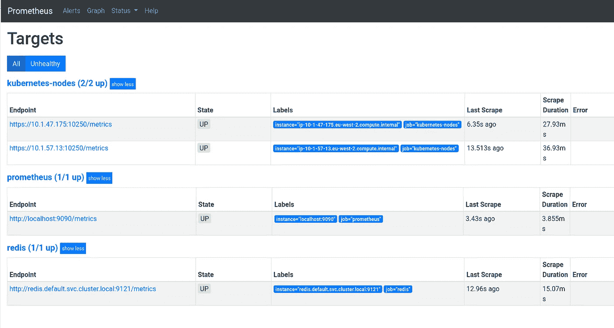*

*检查*状态>服务发现*发现的目标和标签*

*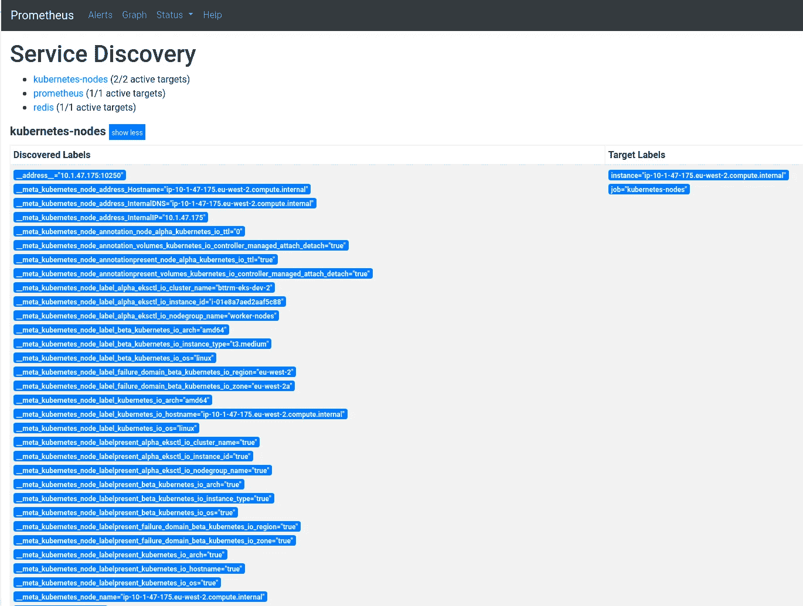*

*和 *kubelet_** 指标:*

*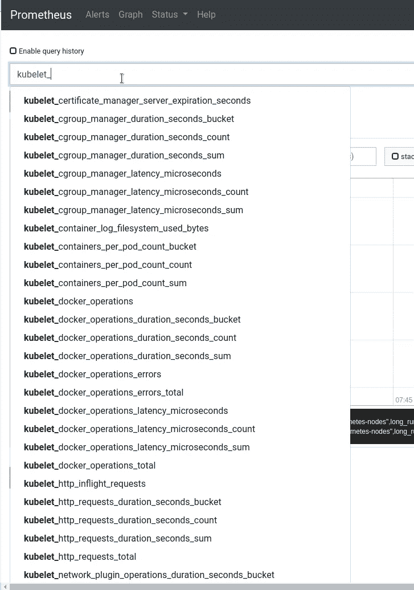*

*添加一些重新标签，参见标签的`[relabel_config](https://prometheus.io/docs/prometheus/latest/configuration/configuration/#relabel_config)`和[寿命。](https://www.robustperception.io/life-of-a-label)*

*他们在那里建议什么？*

```
*...
        relabel_configs:
        - action: labelmap
          regex: __meta_kubernetes_node_label_(.+)
        - target_label: __address__
          replacement: kubernetes.default.svc:443
        - source_labels: [__meta_kubernetes_node_name]
          regex: (.+)
          target_label: __metrics_path__
          replacement: /api/v1/nodes/${1}/proxy/metrics
...*
```

1.  *收集标签`__meta_kubernetes_node_label_alpha_eksctl_io_cluster_name`、`__meta_kubernetes_node_label_alpha_eksctl_io_nodegroup_name`等，用`(.+)`选择——会得到`alpha_eksctl_io_cluster_name`、`alpha_eksctl_io_nodegroup_name`等标签*
2.  *更新`__address__`标签——设置*kubernetes . default . SVC:443*值来创建调用目标的地址*
3.  *从`__meta_kubernetes_node_name`获取一个值并更新`__metrics_path__`标签——设置*/API/v1/nodes/_ _ meta _ kubernetes _ node _ name/proxy/metrics**

*因此，Prometheus 将向*kubernetes . default . SVC:443/API/v1/nodes/IP-10–1–57–13 . eu-west-2 . compute . internal/proxy/metrics*构造一个请求，并将从这个 WorkerNode 获取指标。*

*更新，检查:*

*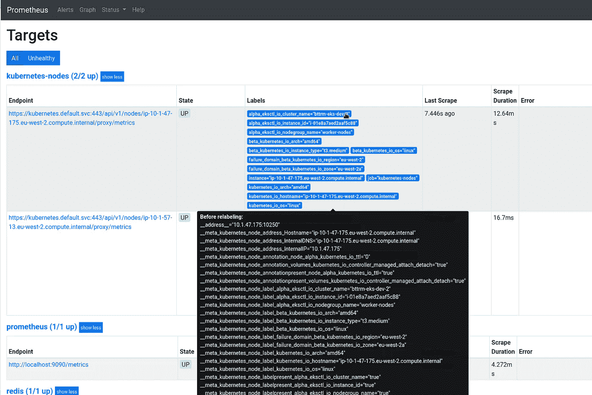*

*不错！*

***荚的作用***

*现在，让我们看看来自相同资源的 *pod* 角色示例:*

```
*...
      - job_name: 'kubernetes-pods'
        kubernetes_sd_configs:
        - role: pod

        relabel_configs:
        - action: labelmap
          regex: __meta_kubernetes_pod_label_(.+)
        - source_labels: [__meta_kubernetes_namespace]
          action: replace
          target_label: kubernetes_namespace
        - source_labels: [__meta_kubernetes_pod_name]
          action: replace
          target_label: kubernetes_pod_name*
```

*检查:*

*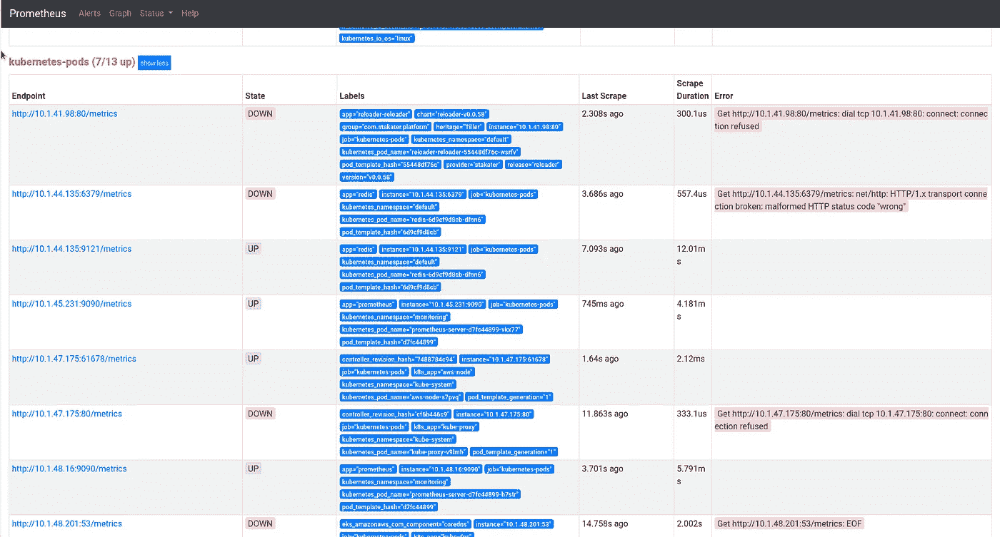*

*所有节点都找到了，但为什么这么多？*

*下面我们来补充一下*prometheus.io/scrape:的【真实】*注解检查:*

```
*...
        relabel_configs:
        - source_labels: [__meta_kubernetes_pod_annotation_prometheus_io_scrape]
          action: keep
          regex: true
...*
```

*已经添加到我们的 Redis 中，例如:*

```
*...
  template:
    metadata:
      annotations:
        prometheus.io/scrape: "true"

...*
```

*结果是:*

*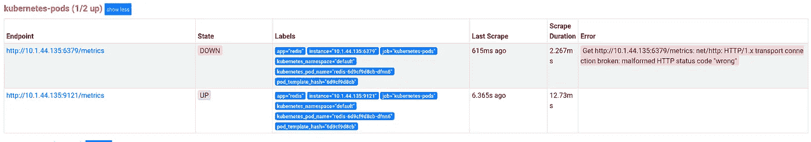*

*[*http://10 . 1 . 44 . 135:6379/metrics*](http://10.1.44.135:6379/metrics)—是没有度量的 Redis 服务器。*

*您想删除它吗？再添加一个过滤器:*

```
*...
        - source_labels: [__meta_kubernetes_pod_container_name]
          action: keep
          regex: .*-exporter
...*
```

*也就是说，我们将只收集在`__meta_kubernetes_pod_container_name`标签中带有“ *-exporter* ”字符串的指标。*

*检查:*

*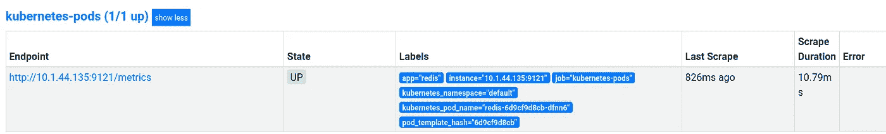*

*好的—我们已经看到了 Prometheus Kubernetes 服务发现中的角色是如何工作的。*

*我们还剩下什么？*

*   *节点导出器*
*   *kube-状态-度量*
*   *管理员*
*   *度量-服务器*

## *节点导出器指标*

*添加`[node_exporter](https://github.com/prometheus/node_exporter)`来从 EC2 实例收集指标。*

*因为需要在每个 WorkerNode 上放置一个带有 exporter 的 pod 这里使用`[DaemonSet](https://rtfm.co.ua/kubernetes-znakomstvo-chast-1-arxitektura-i-osnovnye-komponenty-obzor/#DaemonSet)`类型。*

*创建一个`roles/monitoring/templates/prometheus-node-exporter.yml.j2`文件——这将在 *monitoring* 名称空间中的每个 WorkerNode 上旋转一个 pod，并将添加一个服务，使 Prometheus 可以从端点获取指标:*

```
*---
apiVersion: extensions/v1beta1
kind: DaemonSet
metadata:
  name: node-exporter
  labels:
    name: node-exporter
  namespace: monitoring
spec:
  template:
    metadata:
      labels:
        name: node-exporter
        app: node-exporter
      annotations:
         prometheus.io/scrape: "true"
    spec:
      hostPID: true
      hostIPC: true
      hostNetwork: true
      containers:
        - ports:
            - containerPort: 9100
              protocol: TCP
          resources:
            requests:
              cpu: 0.15
          securityContext:
            privileged: true
          image: prom/node-exporter
          args:
            - --path.procfs
            - /host/proc
            - --path.sysfs
            - /host/sys
            - --collector.filesystem.ignored-mount-points
            - '"^/(sys|proc|dev|host|etc)($|/)"'
          name: node-exporter
          volumeMounts:
            - name: dev
              mountPath: /host/dev
            - name: proc
              mountPath: /host/proc
            - name: sys
              mountPath: /host/sys
            - name: rootfs
              mountPath: /rootfs
      volumes:
        - name: proc
          hostPath:
            path: /proc
        - name: dev
          hostPath:
            path: /dev
        - name: sys
          hostPath:
            path: /sys
        - name: rootfs
          hostPath:
            path: /

---
kind: Service
apiVersion: v1
metadata:
  name: node-exporter
  namespace: monitoring
spec:
  selector:
    app: node-exporter
  ports:
  - name: node-exporter
    protocol: TCP
    port: 9100
    targetPort: 9100*
```

*将其执行添加到`roles/monitoring/tasks/main.yml`文件中:*

```
*...
- name: "Deploy node-exporter to WorkerNodes"
  command: "kubectl apply -f roles/monitoring/templates/prometheus-node-exporter.yml.j2"*
```

*让我们考虑一下现在如何收集指标。*

*第一个问题是——这里使用哪个角色？我们需要指定 *9100* 端口——这样我们就不能使用`node`角色——它没有端口值:*

```
*$ kubectl -n monitoring get node
NAME STATUS ROLES AGE VERSION
ip-10–1–47–175.eu-west-2.compute.internal Ready <none> 3h36m v1.15.10-eks-bac369
ip-10–1–57–13.eu-west-2.compute.internal Ready <none> 3h37m v1.15.10-eks-bac369*
```

*服务角色呢？*

> *该地址将被设置为服务的 Kubernetes DNS 名称和相应的服务端口*

*让我们看看:*

```
*$ kubectl -n monitoring get svc
NAME TYPE CLUSTER-IP EXTERNAL-IP PORT(S) AGE
node-exporter ClusterIP 172.20.242.99 <none> 9100/TCP 37m*
```

*好的，那么`[service](https://prometheus.io/docs/prometheus/latest/configuration/configuration/#service)`角色的标签呢？一切都好，但是它没有 Worker 节点上的 pod 标签——我们需要从每个 Worker 节点上的每个`node_exporter` pod 收集指标。*

*让我们更进一步——`endpoints`角色:*

```
*$ kubectl -n monitoring get endpoints
NAME ENDPOINTS AGE
node-exporter 10.1.47.175:9100,10.1.57.13:9100 44m
prometheus-server-alb 10.1.45.231:9090,10.1.53.46:9090 3h24m*
```

*10.1.47.175:9100，10.1.57.13:9100。*

*所以——我们可以使用也有`__meta_kubernetes_endpoint_node_name`标签的`endpoints`角色。*

*试试看:*

```
*...
      - job_name: 'node-exporter'
        kubernetes_sd_configs:
          - role: endpoints
        relabel_configs:
        - source_labels: [__meta_kubernetes_endpoints_name]
          regex: 'node-exporter'
          action: keep*
```

*检查目标:*

*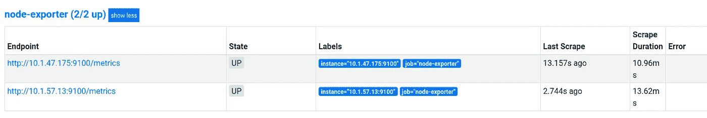*

*和指标:*

*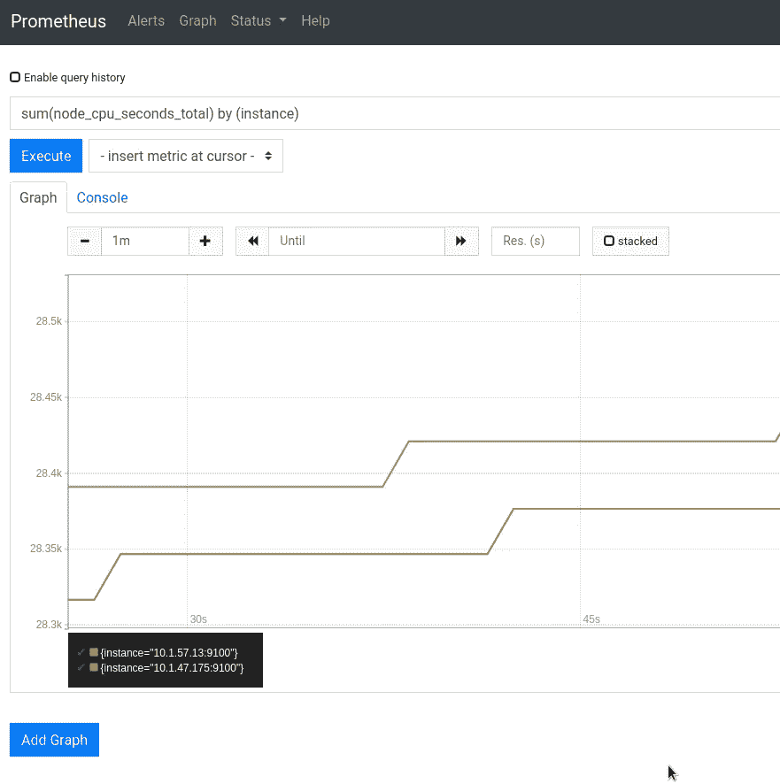*

*参见 [Grafana: создание仪表板](https://rtfm.co.ua/grafana-sozdanie-dashboard/)帖子中`node_exporter`的请求示例(俄语)。*

## *`kube-state-metrics`*

*为了收集关于 Kubernetes 资源的指标，我们可以使用`[kube-state-metrics](https://github.com/kubernetes/kube-state-metrics)`。*

*将其安装添加到`roles/monitoring/tasks/main.yml`:*

```
*...
- git:
    repo: 'https://github.com/kubernetes/kube-state-metrics.git'
    dest: /tmp/kube-state-metrics

- name: "Install kube-state-metrics"
  command: "kubectl apply -f /tmp/kube-state-metrics/examples/standard/"*
```

*部署本身可以在[https://github . com/kubernetes/kube-state-metrics/blob/master/examples/standard/deployment . YAML](https://github.com/kubernetes/kube-state-metrics/blob/master/examples/standard/deployment.yaml)文件中观察到。*

*我们可以在这里跳过服务发现，因为我们将拥有唯一的`kube-state-metrics`服务，所以使用`static_configs`:*

```
*...
      - job_name: 'kube-state-metrics'
        static_configs:
          - targets: ['kube-state-metrics.kube-system.svc.cluster.local:8080']*
```

*检查目标:*

*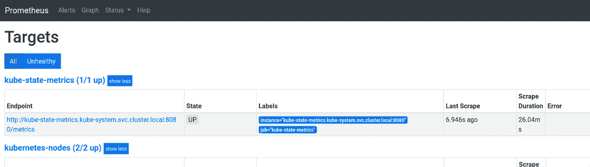*

*和指标，例如— `kube_deployment_status_replicas_available`:*

*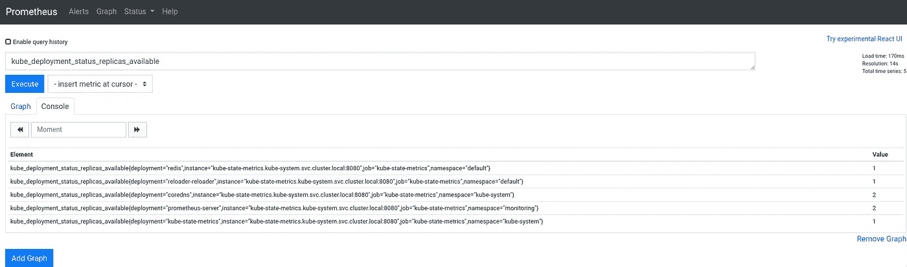*

## *管理员*

*`[cAdvisor](https://github.com/google/cadvisor)`太有名了——收集容器数据的最广泛使用的系统。*

*它已经不受 Kubernetes 的限制，所以不需要专门的记者——只需获取 tits 指标。在同一个[https://github . com/Prometheus/Prometheus/blob/master/documentation/examples/Prometheus-kubernetes . yml # L102](https://github.com/prometheus/prometheus/blob/master/documentation/examples/prometheus-kubernetes.yml#L102)文件中可以找到一个示例。*

*更新`roles/monitoring/templates/prometheus-configmap.yml.j2`:*

```
*...
      - job_name: 'cAdvisor'
        scheme: https
        tls_config:
          ca_file: /var/run/secrets/kubernetes.io/serviceaccount/ca.crt
        bearer_token_file: /var/run/secrets/kubernetes.io/serviceaccount/token
        kubernetes_sd_configs:
        - role: node

        relabel_configs:
        - action: labelmap
          regex: __meta_kubernetes_node_label_(.+)
        - target_label: __address__
          replacement: kubernetes.default.svc:443
        - source_labels: [__meta_kubernetes_node_name]
          regex: (.+)
          target_label: __metrics_path__
          replacement: /api/v1/nodes/${1}/proxy/metrics/cadvisor*
```

*部署，检查:*

*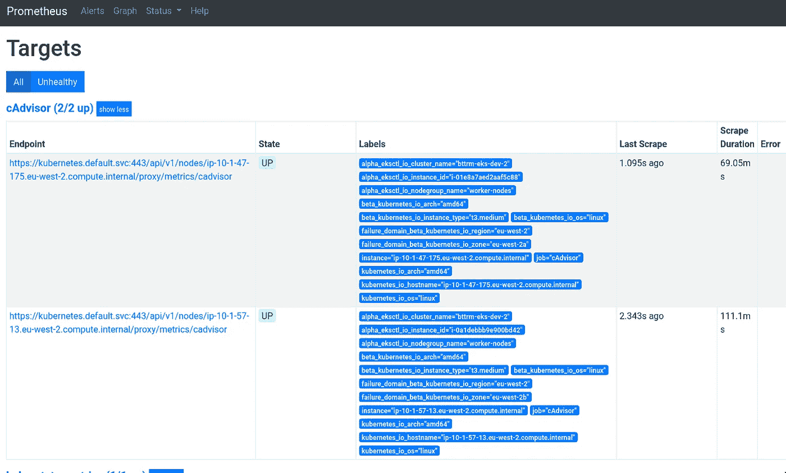*

*我们的集群中有两个 Kubernetes WorkerNode，我们可以看到这两个节点的指标——很好:*

*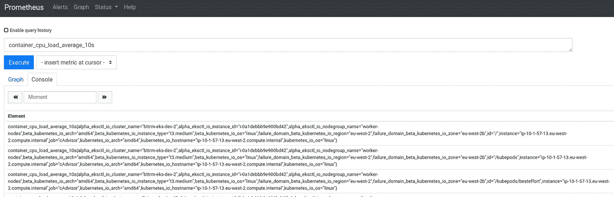*

## *`metrics-server`*

*它也有出口商，但我现在不需要他们——只需安装它使 Kubernetes 限制工作并使用`kubectl top`。*

*之前它的安装有点复杂，见 [Kubernetes:在 AWS EKS 为 Kubernetes Pod 自动缩放器运行 metrics-server](https://rtfm.co.ua/en/kubernetes-running-metrics-server-in-aws-eks-for-a-kubernetes-pod-autoscaler/)，但是现在在 EKS 上它开箱即用。*

*更新`roles/monitoring/tasks/main.yml`:*

```
*...
- git:
    repo: "https://github.com/kubernetes-sigs/metrics-server.git"
    dest: "/tmp/metrics-server"

- name: "Install metrics-server"
  command: "kubectl apply -f /tmp/metrics-server/deploy/kubernetes/"
...*
```

*部署，检查`kube-system`名称空间中的窗格:*

```
*$ kubectl -n kube-system get pod
NAME READY STATUS RESTARTS AGE
aws-node-s7pvq 1/1 Running 0 4h42m
…
kube-proxy-v9lmh 1/1 Running 0 4h42m
kube-state-metrics-6c4d4dd64–78bpb 1/1 Running 0 31m
metrics-server-7668599459-nt4pf 1/1 Running 0 44s*
```

*吊舱在这里——很好。*

*几分钟后试试`top node`:*

```
*$ kubectl top node
NAME CPU(cores) CPU% MEMORY(bytes) MEMORY%
ip-10–1–47–175.eu-west-2.compute.internal 47m 2% 536Mi 14%
ip-10–1–57–13.eu-west-2.compute.internal 58m 2% 581Mi 15%*
```

*对于吊舱:*

```
*$ kubectl top pod
NAME CPU(cores) MEMORY(bytes)
redis-6d9cf9d8cb-dfnn6 2m 5Mi
reloader-reloader-55448df76c-wsrfv 1m 7Mi*
```

*就这些了，总的来说。*

## *有用的链接*

*   *[Kubernetes 用普罗米修斯监控-终极指南](https://sysdig.com/blog/kubernetes-monitoring-prometheus/)*
*   *[使用 Prometheus 监控多个联合集群—安全的方式](https://banzaicloud.com/blog/prometheus-federation/)*
*   *[使用 Prometheus 监控您的 Kubernetes 基础设施](https://www.weave.works/blog/monitoring-kubernetes-infrastructure/)*
*   *[使用 Prometheus 在 Kubernetes 进行音量监控](https://blog.argoproj.io/volume-monitoring-in-kubernetes-with-prometheus-3a185e4c4035)*
*   *用头盔+迷你库贝尝试普罗米修斯操作者*
*   *[如何使用 Prometheus 和 Grafana 监控您的 Kubernetes 集群](https://chris-vermeulen.com/how-to-monitor-your-kubernetes-cluster-with-prometheus-and-grafana--the-whole--long--story-/)*
*   *[用内置的普罗米修斯监控 Redis】](https://kubedb.com/docs/0.12.0/guides/redis/monitoring/using-builtin-prometheus/)*
*   *[Kubernetes in Production:Prometheus 资源指标监控终极指南](https://www.replex.io/blog/kubernetes-in-production-the-ultimate-guide-to-monitoring-resource-metrics)*
*   *[如何用普罗米修斯监控库伯内特斯](https://phoenixnap.com/kb/prometheus-kubernetes-monitoring)*
*   *[使用 Prometheus + grafana +节点导出器](https://programming.vip/docs/cluster-monitoring-using-prometheus-grafana-node-exporter.html)*
*   *[在 Kubernetes 上运行普罗米修斯](https://linuxacademy.com/blog/kubernetes/running-prometheus-on-kubernetes/)*
*   *[普罗米修斯在库伯涅特斯上的自我发现](https://developer.sh/posts/prometheus-self-discovery)*
*   *[Kubernetes —端点](https://theithollow.com/2019/02/04/kubernetes-endpoints/)*

## *配置*

*   *[doks-monitoring/manifest/Prometheus-config map . YAML](https://github.com/do-community/doks-monitoring/blob/master/manifest/prometheus-configmap.yaml)*
*   *[Prometheus/documentation/examples/Prometheus-kubernetes . yml](https://github.com/prometheus/prometheus/blob/master/documentation/examples/prometheus-kubernetes.yml)*
*   *[charts/stable/Prometheus/templates/server-config map . YAML](https://github.com/helm/charts/blob/master/stable/prometheus/templates/server-configmap.yaml)*

## *混杂的*

*   *[用于 Kubernetes 的 Grafana 应用程序](https://grafana.com/grafana/plugins/grafana-kubernetes-app)*

**原发表于* [*RTFM: Linux，devo PSисистемноеадммитииииииованниое*](https://rtfm.co.ua/en/kubernetes-monitoring-with-prometheus-exporters-a-service-discovery-and-its-roles/)T30。*