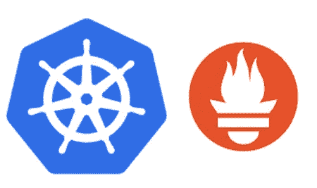
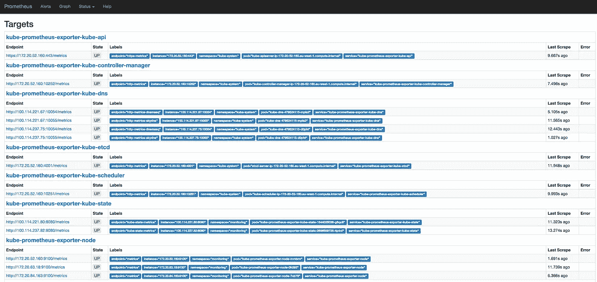
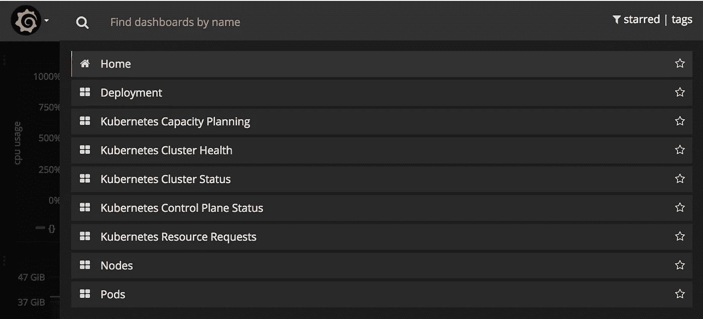
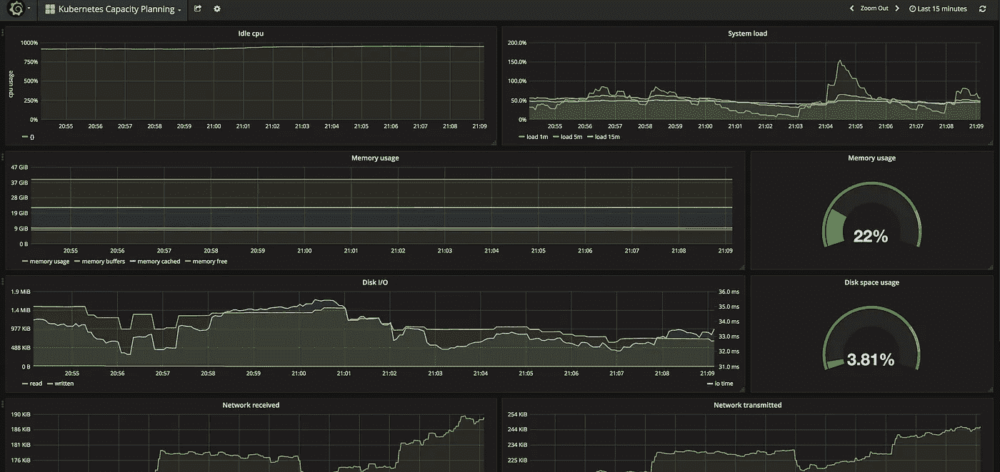

# 15 分钟后库伯内特和普罗米修斯一起监控

> 原文：<https://itnext.io/kubernetes-monitoring-with-prometheus-in-15-minutes-8e54d1de2e13?source=collection_archive---------0----------------------->



如果你没有听说过 Kubernetes(或者它的俗称 K8s)，是时候走出你的洞穴了。K8s 是一个开源的自我修复平台，用于部署、扩展和操作容器。最初由谷歌设计(灵感来自[博格](https://research.google.com/pubs/pub43438.html)，后来捐赠给 [CNCF](http://cncf.io) 。

理解 k8s 的所有组件并不容易，要完全控制这样一个复杂而强大的平台需要时间。同样重要的是，要意识到节点、应用程序或网络可能会在特定时间发生故障——就像其中的所有东西一样。因此，拥有警报、日志、指标和监控仪表板对于避免停机和其他问题至关重要。

在我的上一个项目中，从裸机服务器转移到云，我有时间研究 k8s 的主动监控。在一些基准测试和撞墙之后，我终于找到了普罗米修斯。k8s 项目已经接受了这一惊人的工具，在几乎所有的组件中公开了普罗米修斯度量标准。

监控您的 k8s 集群将帮助您的团队:

*   主动监控
*   集群可见性和容量规划
*   触发警报和通知
*   度量仪表板

在我研究 Prometheus 如何与 k8s 整合的时候，Coreos 推出了[Prometheus-Operator](http://github.com/coreos/prometheus-operator)；它完全符合我的需要，使所有的设置配置变得容易。

# Kubernetes 算子

> “我们称这种新的软件操作人员类别。操作者是特定于应用程序的控制器，它扩展了 Kubernetes API，代表 Kubernetes 用户创建、配置和管理复杂的有状态应用程序的实例。它建立在基本的 Kubernetes 资源和控制器概念的基础上，但包括领域或应用特定的知识，以自动化常见任务。”
> 
> 布兰登·飞利浦，由 [*Coreos*](https://coreos.com/blog/introducing-operators.html)

Kubernetes Operators 是由 [*Coreos*](https://coreos.com/blog/introducing-operators.html) *在* 2016 年推出的，它拥有抽象部署和配置应用的能力。就个人而言，我一直在使用大量的[弹性搜索操作符](http://github.com/upmc-enterprises/elasticsearch-operator/)和[普罗米修斯操作符](https://github.com/coreos/prometheus-operator/)。扩展 k8s 操作符并不是本文的重点，但是如果您感兴趣，您可以在这里看到其他 k8s 操作符。

# 普罗米修斯

[Prometheus](http://prometheus.io) 是一个开源的监控和警报工具包，灵感来自于 [Google Borg](https://research.google.com/pubs/pub43438.html) Monitor。它之前是由 [SoundCloud](https://soundcloud.com/) 开发的，后来捐赠给了 [CNCF](http://cncf.io) 。

Prometheus 支持多种语言的[仪器应用](https://prometheus.io/docs/instrumenting/clientlibs/)。它还提供了[导出器](https://prometheus.io/docs/instrumenting/exporters/)来连接应用程序(Postgresql、Mysql、AWS Cloudwatch、ETCD 和 K8s)，同时仍然是监控基础设施和应用程序的优秀解决方案。

# 普罗米修斯算子

> Prometheus 操作符的任务是尽可能容易地在 Kubernetes 上运行 Prometheus，同时保持可配置性并使配置成为 Kubernetes 本地的。[https://core OS . com/operators/Prometheus/docs/latest/user-guides/getting-started . html](https://coreos.com/operators/prometheus/docs/latest/user-guides/getting-started.html)

除了管理 Prometheus、Alertmanager 和 Grafana 配置之外，Prometheus 操作员还可以轻松监控 k8s 服务和部署。

## 它是如何工作的？


普罗米修斯算子体系结构。来源:[普罗米修斯-操作者](https://raw.githubusercontent.com/coreos/prometheus-operator/master/Documentation/user-guides/images/architecture.png)

当您部署新版本的应用程序时，k8s 会创建一个新的 pod(容器),在 pod 准备就绪后，k8s 会销毁旧的 pod。Prometheus 一直在监视 k8s api，当检测到变化时，它会根据服务(pod)的变化创建一个新的 Prometheus 配置。

# 服务监视器

Prometheus-operator 使用一个名为 [ServiceMonito](https://github.com/coreos/prometheus-operator/blob/master/Documentation/api.md#servicemonitorspec) r 的[定制资源定义](https://kubernetes.io/docs/concepts/api-extension/custom-resources/) (CRD)将配置抽象到目标。作为下面的例子，让我们看看如何使用 ServiceMonitor 监控 NGINX pod。ServiceMonitor 将使用[匹配标签选择器](https://github.com/coreos/prometheus-operator/blob/8384c90c455d18e02ecd26ccfe1738a0c8865407/Documentation/api.md#servicemonitorspec)选择 NGINX pod。prometheus-operator 将根据标签选择器搜索 pod，并创建一个 prometheus 目标，以便 prometheus 收集指标端点。

# 你自己试试

本教程可以在不到 15 分钟的时间内完成，因为您已经登录了:

*   Kubernetes 集群启动和运行(1.7.6 版)
*   [舵](https://github.com/kubernetes/helm/blob/master/docs/install.md)已安装并工作(2.6.1)

# **安装**

```
$ helm install stable/prometheus-operator --name prometheus-operator --namespace monitoring
```

假设一切正常，您可以运行下面的命令来列出我们将在下一节课中深入研究的应用程序。

```
$ kubectl get pods  -n monitoring
NAME                                                       READY     STATUS    RESTARTS   AGE
alertmanager-prometheus-operator-alertmanager-0                  2/2     Running   0          13hprometheus-operator-grafana-74dfcc6697-2z9bh                     3/3     Running   0          13hprometheus-operator-kube-state-metrics-76999bd456-26r55          1/1     Running   0          13hprometheus-operator-operator-69fd4db6d6-ccpb8                    1/1     Running   0          14dprometheus-operator-prometheus-node-exporter-2np5f               1/1     Running   2          14dprometheus-operator-prometheus-node-exporter-2svbj               1/1     Running   0          13hprometheus-operator-prometheus-node-exporter-jcq7z               1/1     Running   0          18dprometheus-operator-prometheus-node-exporter-jlmgw               1/1     Running   0          13hprometheus-operator-prometheus-node-exporter-k4dlh               1/1     Running   0          14hprometheus-operator-prometheus-node-exporter-rwgsw               1/1     Running   0          13hprometheus-operator-prometheus-node-exporter-t9z9x               1/1     Running   0          18dprometheus-operator-prometheus-node-exporter-vfk69               1/1     Running   0          13hprometheus-operator-prometheus-node-exporter-xldfq               1/1     Running   0          18dprometheus-prometheus-operator-prometheus-0                      3/3     Running   0          18d
```

# 普罗米修斯

将 Prometheus 服务器转发到您的机器，这样您就可以通过打开 [http://localhost:9090](http://localhost:9090/) 更好地查看仪表板

```
$ kubectl port-forward -n monitoring prometheus-prometheus-operator-prometheus-0 9090
```



在 Prometheus 仪表板中，您可以:查询度量，查看所有预定义的预警和 Prometheus 目标。

> 注意:如果某些目标因无法到达的错误而失败，请检查安全组或防火墙规则。如果您没有与上图相同的目标，请检查 k8s pods 的标签，有时您用来部署集群的工具不符合 k8s 标签模式。

# 格拉夫纳

普罗米修斯有一个[表达式浏览器](https://prometheus.io/docs/visualization/browser/)用于调试目的。为了有一个好看的仪表板，使用 Grafana，它有一个数据源可以在 Prometheus 上查询。

```
$ kubectl port-forward $(kubectl get  pods --selector=app=grafana -n  monitoring --output=jsonpath="{.items..metadata.name}") -n monitoring  3000
```

等待几秒钟，直到 grafana 加载仪表板，在 [http://localhost:3000](http://localhost:3000) 打开您的浏览器，使用密码 prom-operator 作为管理员登录，查看您全新的令人敬畏的仪表板！！！



grafana-Kubernetes 仪表板



grafana-Kubernetes 容量规划仪表板

# 警报管理器

> [警报管理器](https://prometheus.io/docs/alerting/alertmanager/)处理客户端应用程序(如 Prometheus 服务器)发送的警报。它负责重复数据删除、分组，并将其路由到正确的接收方集成，如 email、PagerDuty 或 OpsGenie。它还负责警报的静音和抑制。

我们已经安装了 Alertmanager，现在是下面的命令，将端口转发到您的机器，并在您的浏览器中打开 URL[http://localhost:9093](http://localhost:9093)

```
$ kubectl port-forward -n monitoring alertmanager-prometheus-operator-alertmanager-0 9093
```

# 后续步骤

耶！！！现在您已经监控了所有 k8s 组件！！如果你注意到我遗漏了什么，请分享组件名称和具体的 ServiceMonitor 来覆盖它——我会更新帖子。

在我的下一篇文章中，我将介绍如何使用 Alertmanager 检测应用程序并触发通知。我还建议您观看下面的视频，以便更清楚地了解普罗米修斯操作员是如何工作的。