# Kubernetes 与 Submariner 的多云和多集群连接—测试 CockroachDB 地理分布/地理复制

> 原文：<https://itnext.io/kubernetes-multi-cloud-and-multi-cluster-connectivity-with-submariner-test-cockroachdb-b79662209bd7?source=collection_archive---------1----------------------->

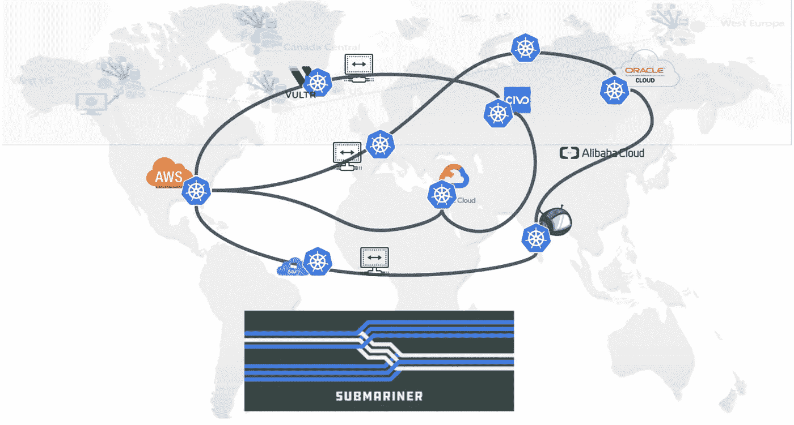

通过 IPsec 实现跨云和跨集群互连— Submariner —测试跨区域和跨云的 CockroachDB 地理复制

基于 Kubernetes 平台的最初趋势是构建大型多租户 Kubernetes 集群。现在，越来越普遍的做法是构建特定于一个区域/云甚至同一数据中心的单个集群，以实现多区域分区、可用性、全球分布、边缘功能、减少供应商依赖性、供应商特定功能的优势等。在不同的地理区域复制和分布基础架构是相对常见的，特别是在受监管的环境中，以满足具有较低延迟的内容。

无论 Kubernetes 集群是如何部署的，跨集群网络在多集群或多云部署策略的成功中起着至关重要的作用。

[Rancher 的潜艇](https://submariner.io/)可用于通过第三层网络连接集群，促进集群间的通信。Submariner 在 Kubernetes 集群之间创建必要的隧道和路线，允许直接连接，而不管它们的位置是在本地还是在云中。Submariner 不是服务网格。它仅提供第 3 层网络连接。它与 Istio 等服务网格相集成，可以提供跨集群网络，这是共享控制平面(单一网络)等特定部署模式所必需的。

# 试用配置/拓扑

下面的拓扑包含五个不同/独立的 Kubernetes 集群，跨越多个云提供商的多个区域:AWS、Oracle、Vultr、Packet、Civo，并具有不同的 pod 和服务子网。所有集群都单独安装在具有法兰绒 CNI 的虚拟机上(可以部署在具有任何 CNI 的环境中)。Submariner 可以安装在云提供商特定的 Kubernetes 服务上，如 EKS、AKS、Civo 的托管 K3s 等。唯一的要求是为标有节点的网关提供一个公共/弹性 ip。

不同公共云提供商上的 Kubernetes 集群

下面显示的是云提供商和部署上述集群的各个区域。所有群集都有可公开访问的 IP。在这种情况下，可以根据群集和连接的空间设置修改拓扑。每个集群可以有多个节点，用户可以标记特定的节点，使其成为潜艇网关，只有启用网关的节点才需要公共 IP。

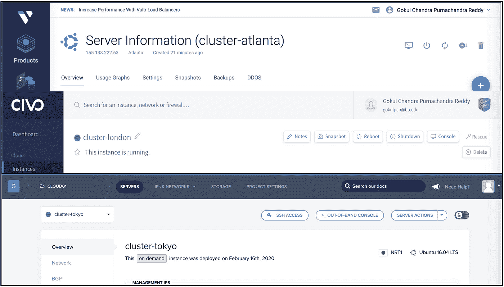

Kubernetes 集群— Vultr、Civo、Packet

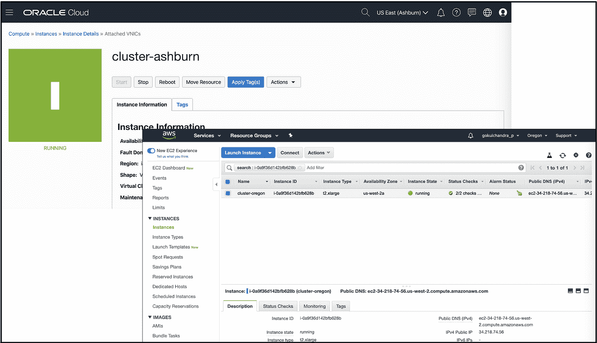

Kubernetes 集群— AWS、Oracle

每个集群都有唯一的 Pod 和服务 CIDR，并带有独特的 DNS 后缀，如下所示:

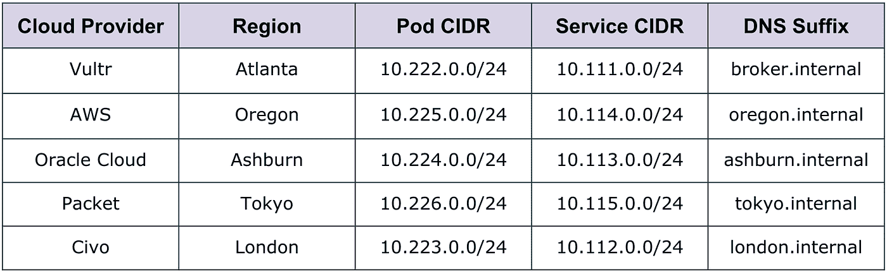

群集特定的网络信息

# 潜艇的多集群连接

Submariner 可以部署在具有任何 CNI 的环境中，并利用现成的组件(如 strongSwan/Charon)在每个 Kubernetes 集群之间建立 IPsec 隧道。Charon 是一个 IPsec IKEv2 守护程序，它可以充当发起方(发起 IKE VPN 隧道协商请求的设备)或响应方(接收建立 IKE VPN 隧道请求的设备)。默认情况下，Charon 使用正常的重新传输机制和超时来检查对等体的活性。

Submariner 可以通过 L3 网络连接集群，至少需要 3 个 Kubernetes 集群。从技术上讲，可以部署在两个集群上，其中一个集群可以被选为“代理”，但这不会弹性地扩展到两个集群之外，因为同时充当代理和网关的集群中的故障会导致网络中断。Submariner 可以部署到现有的 Kubernetes 集群中，并在不同集群中的 pod 之间添加第 3 层网络连接。

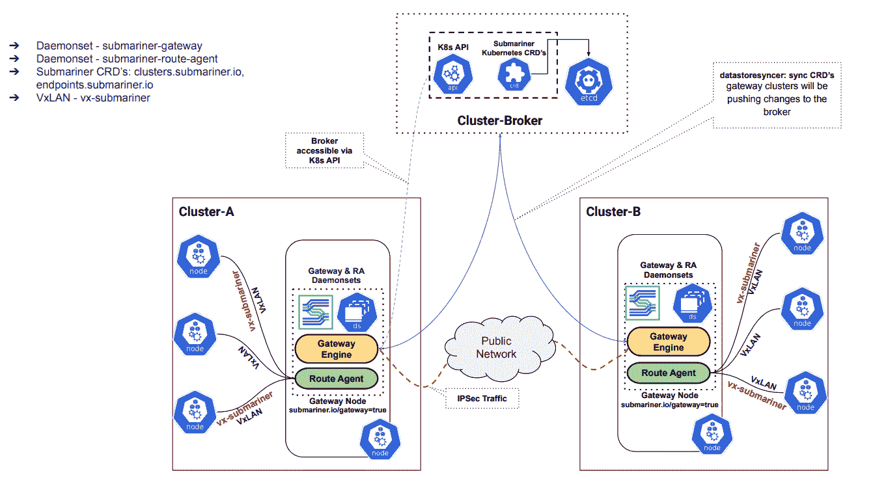

潜艇兵——建筑

组件:

# 经纪人(CRD 的)

代理是一个 Kubernetes 集群，需要 CRD 来将集群信息存储在其 etcd 中，该集群仅保存集群资源定义: *clusters.submariner.io* 和 *endpoints.submariner.io* ，后者定义了 submariner 的其他集群部分。Submariner 网关利用代理在集群之间交换连接信息的元数据信息，并将本地集群信息更新到中央代理中。

每个启用了 Submariner 的集群都使用服务帐户令牌和代理集群 API 信息加入代理。如下所示，代理集群在“submariner-k8s-broker”命名空间中存储没有其他 Submariner 组件的 CRD。

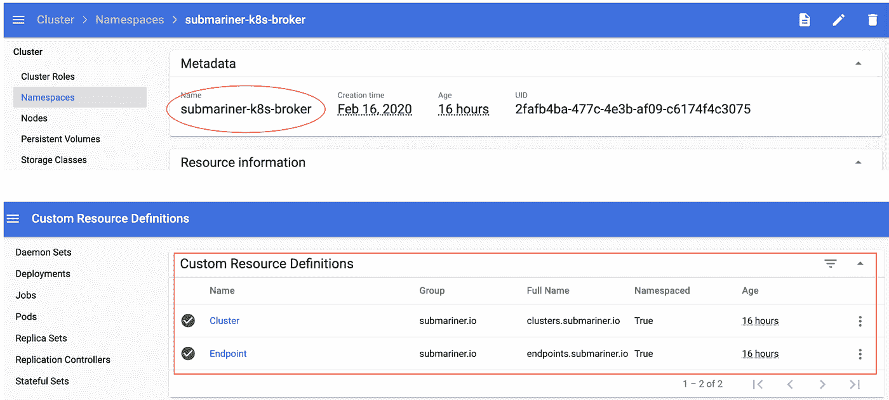

代理群集-自定义资源定义

每个对象类型“群集”包含群集特定的 Pod 和服务子网信息。在 IPsec 术语中，特定 Kubernetes 集群(在 IPsec 配置中用作左右子网)后面的 LAN 的网络地址，在本例中是由 CNI-法兰绒提供的覆盖网络。

对于上面显示的拓扑，有四个集群对象(不包括代理):

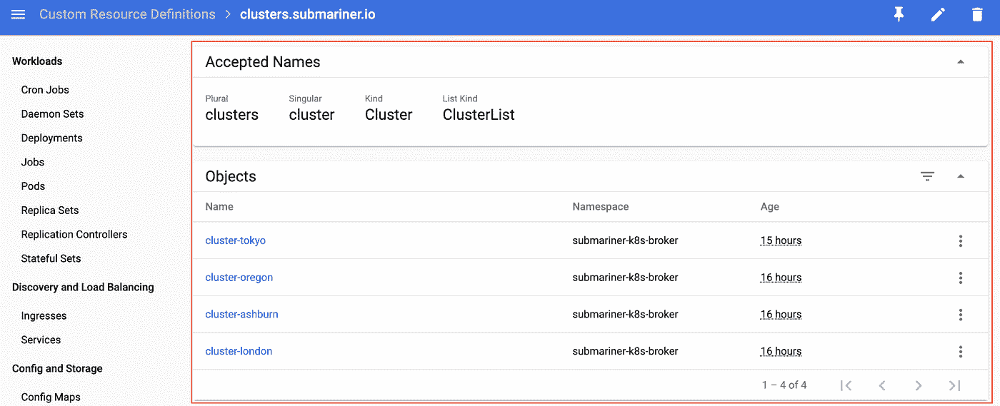

代理集群—集群对象

每个群集对象都包含有关群集网络信息(Pod 和服务子网)和 cluster_id(在 IPsec 配置中用作左 id 和右 ID)的信息:

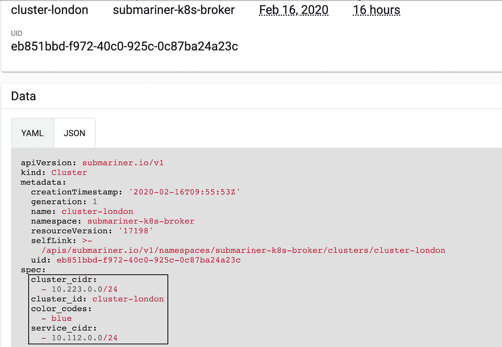

代理集群—集群配置

每个对象类型“端点”保存群集的公共地址(传统 IPsec 配置中的“左”和“右”声明)。

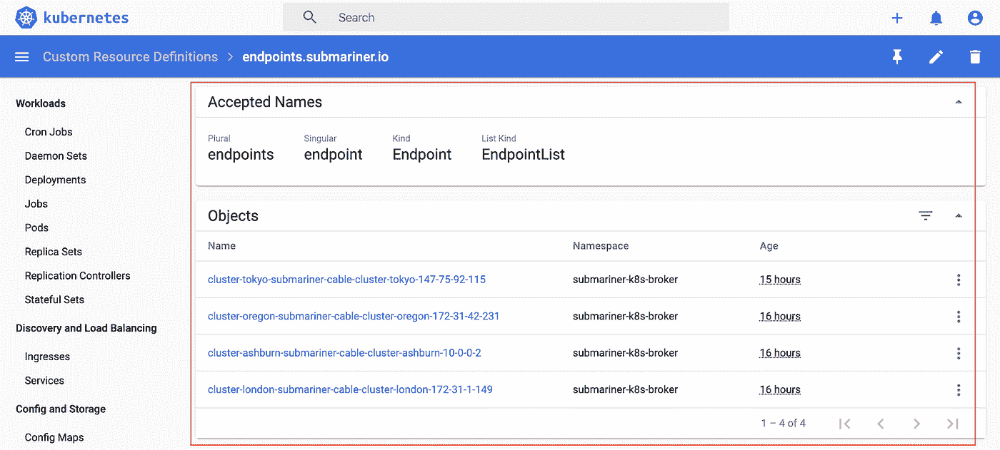

代理群集—端点对象

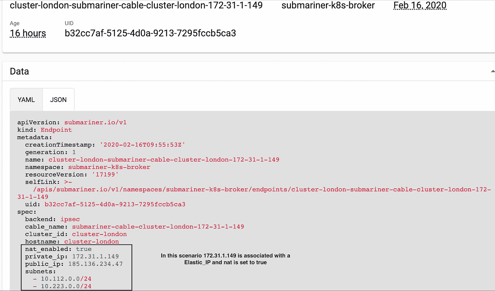

代理群集—端点配置

代理还拥有集群成员资格所需的其他秘密:

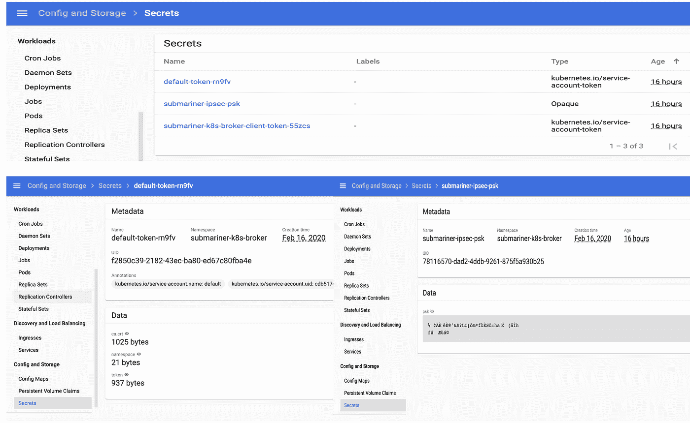

代理集群-秘密

*datastoresyncer* 作为领导者选举的 submariner pod 内的控制器运行，并负责执行数据存储和 Submariner CRDs 的本地集群之间的双向同步。 *datastoresyncer* 只会将 CRD 数据推送到本地集群的中央代理(基于集群 ID)，并在数据与本地集群不匹配时将所有数据从代理同步到本地集群(以防止循环)。

所有其他部署了潜艇的 Kubernetes 集群也拥有与代理同步的 CRD 以上版本。这些集群包含一个网关、路由代理和一个操作员(如果使用 [subctl](https://github.com/submariner-io/submariner#installation-using-operator) 部署 Submariner)。

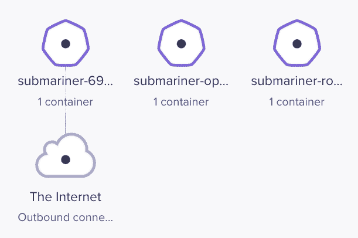

潜艇——Kubernetes 组件

# 潜艇通道(DaemonSet)

网关荚在主机网络上的所有网关标记的节点上运行，并且在多个网关标记的节点之间执行领导者选举以选举活动的 IPsec 端点。在启动和失败时，被选为领导者的 submariner-gateway pod 将执行协调过程，以确保它是该集群的唯一端点，并且远程集群将协调 IPsec 端点和新端点，并且将相应地重新建立连接。这个实体运行 charon 守护进程。

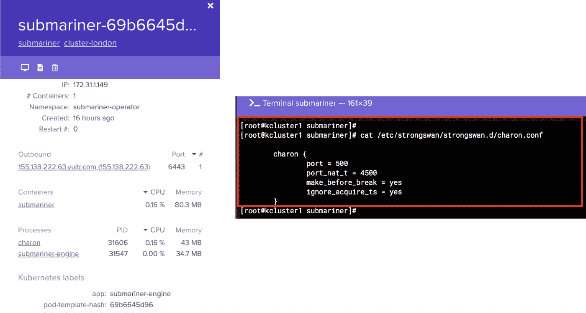

潜艇——网关引擎

网关不断从代理集群轮询存储为 CRD 的任何新集群信息(代理连接信息-在创建网关时提供 url)以配置端点(ipsec-peers):

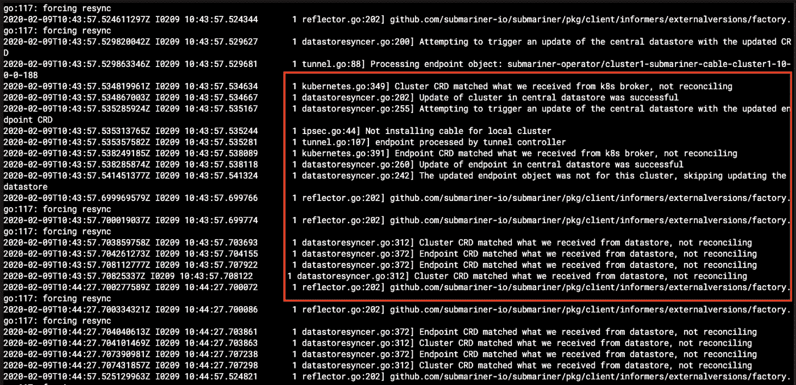

Submariner —网关引擎与代理的交互

按照规定，每个 submariner 引擎使用 API 服务器令牌加入代理，如下所示:

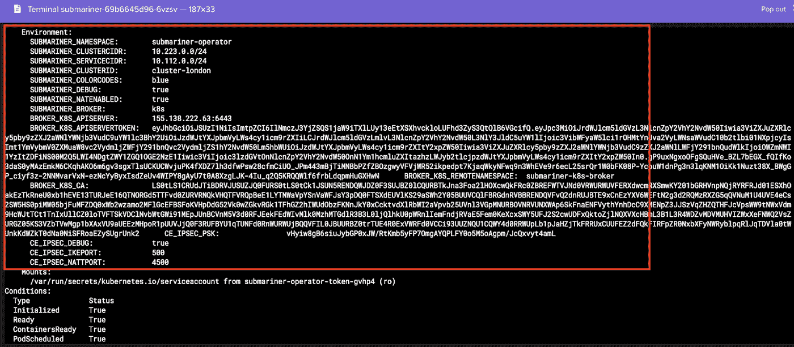

Submariner —网关引擎—代理

# 潜航员-航线-代理人

submariner-route-agent 被部署为 daemonset(在每个节点上运行),并且知道集群上当前活动的网关。在活动网关节点上运行的路由代理创建 VXLAN VTEP 接口，通过建立与活动网关节点的 VTEP 的 VXLAN 隧道，在其他工作节点上运行的 submariner-route-agent 实例连接到该接口。

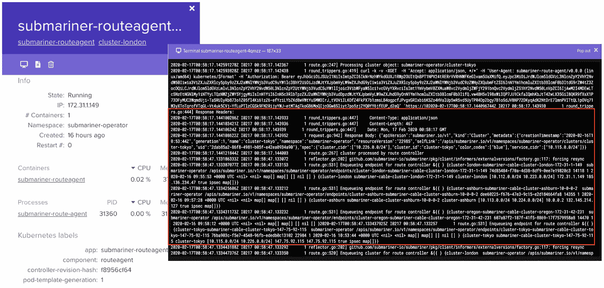

潜航员——航线代理人

Submariner-route-agent 还配置路由，并对必要的 iptable 规则进行编程，以实现与远程集群的完全连接。Submariner VXLAN 隧道的 MTU 是根据主机上默认接口的 MTU 减去 VXLAN 开销来配置的。

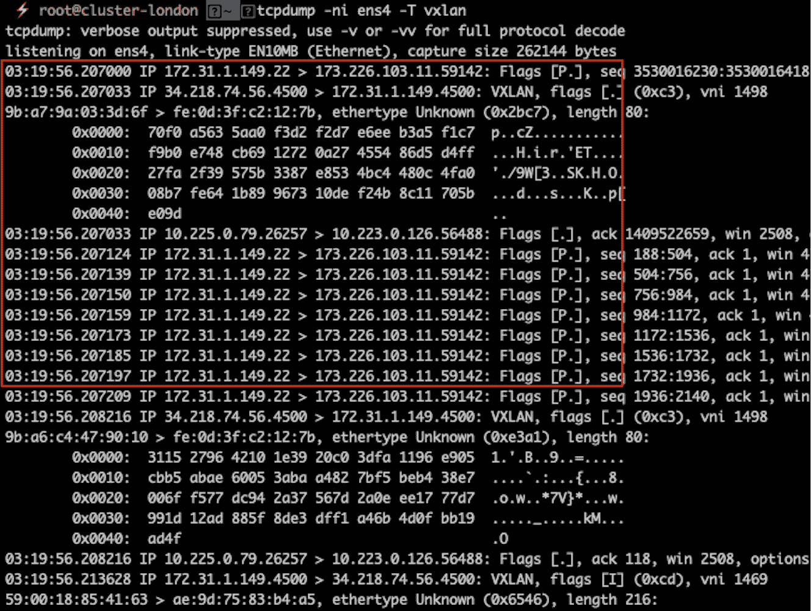

潜航员—航线代理— VXLAN

从这个场景中提取拓扑，所需的 iptables 由潜艇艇员编程。每个集群 pod 和子网 CIDR 的编程如下所示:

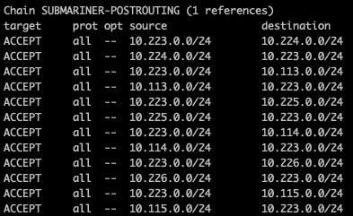

潜航员—编程 iptables

两个集群之间的所有流量都将通过 ip xfrm 规则在(每个集群中)选出的主网关节点之间传输。每个网关节点都有一个正在运行的 Charon 守护进程，它将执行 IPsec 密钥和策略管理。xfrm 是一个 IP 框架，用于转换数据包(比如加密它们的有效载荷)。该框架用于实现 IPsec 协议组(状态对象在安全关联数据库上操作，策略对象在安全策略数据库上操作)。

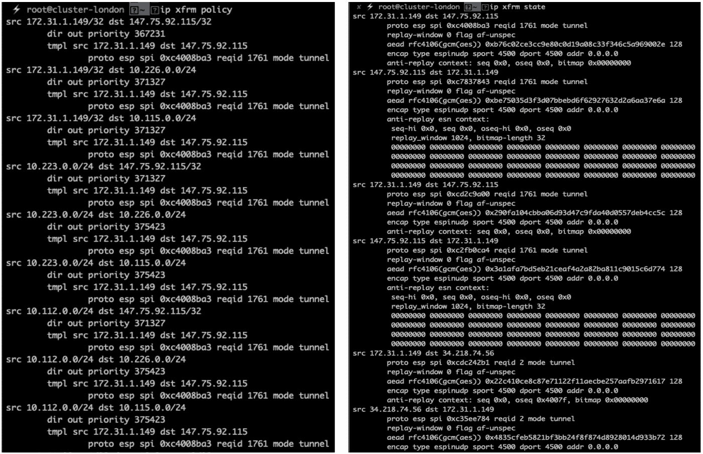

潜航员— xfrm

# 使用潜艇连接集群测试 CockroachDB 的地理分布/地理复制

通过在所有集群(London-Civo、Ashburn-Oracle、Oregon-AWS 和 Tokyo-Packet)上部署 Submariner，可以访问跨集群的所有 pod 和服务子网，并且流量通过互联网上的 IPsec 进行隧道传输。

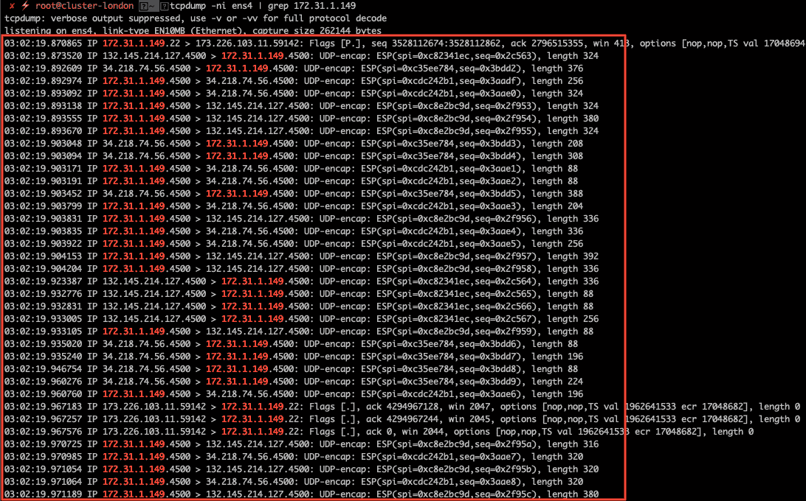

潜艇—跨集群连接— IPsec

CockroachDB 支持地理分区，这允许将用户数据保存在用户附近，从而减少数据需要传输的距离，从而减少延迟并改善用户体验。cocroach db 架构的复制层在节点之间复制数据，并确保这些副本之间的一致性，在这个场景中，跨上面指定的使用 Submariner 互连的 Kubernetes 集群部署多集群 cocroach db(一个集群化的 cocroach db)。

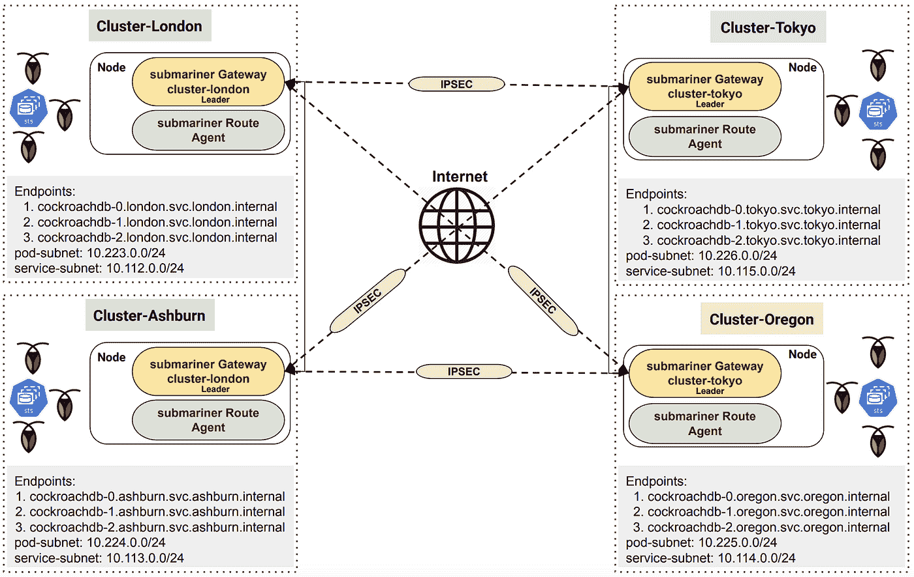

跨地区、跨云平台的 CockroachDB

拓扑中的每个集群都包含三个部署为 statefulset 的 CockroachDB 副本，具有不同的 Pod 和服务 IP，如上所示。

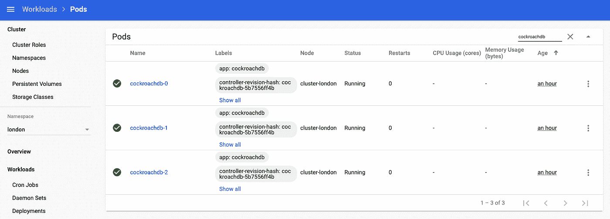

Kubernetes 集群上的 CockroachDB

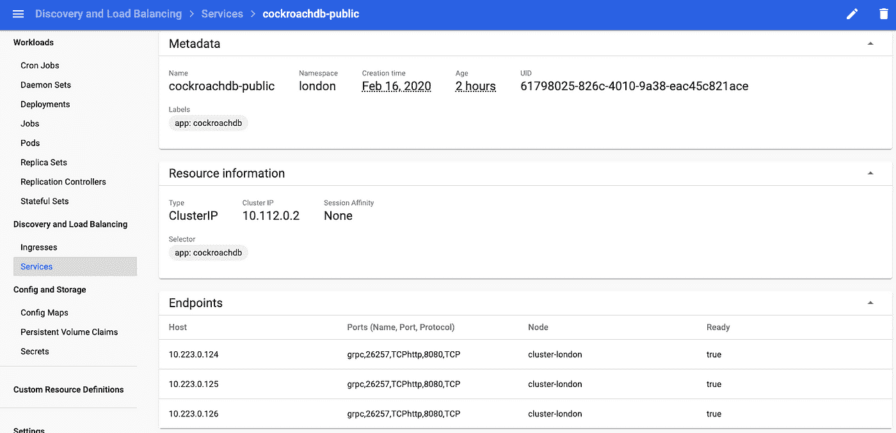

Kubernetes 集群上的 CockroachDB

集群智能 CockroachDB 寻址:

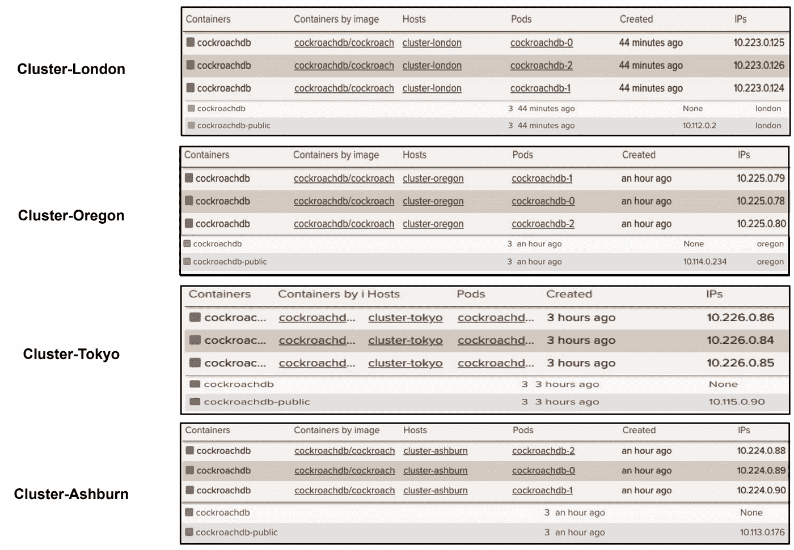

cocroach db—特定于群集的网络信息

由于所有集群都是使用 Submariner 相互连接的，CockroachDB 是全局集群化的，其中写入任何区域的数据都分布在各个集群中。所有数据库 pod 都通过 IPsec 互连。如下图所示，london-cluster 上的 cocroach db 与 Ashburn、Tokyo 和 Oregon 上的所有其他 CockroachDB pods 都有入站/出站连接。

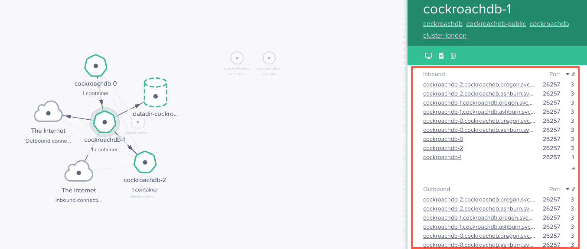

通过互联网与跨集群副本进行交互

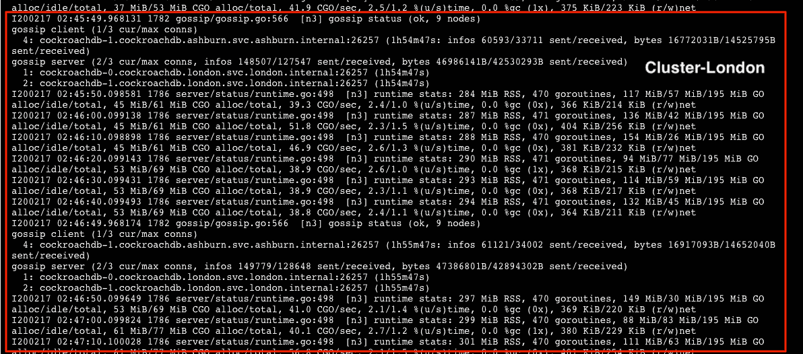

通过互联网与跨集群副本进行交互

# 跨集群服务的 DNS 解析

在这种情况下，可以通过多种方式启用服务解析。Submariner 计划使用 [Lighthouse](https://github.com/submariner-io/lighthouse) (仍在开发中):中央发现控制器，它从集群中收集信息，决定要共享哪些信息，并将信息作为新定义的 CRD 进行分发。在上面的场景中，这是使用 [CoreDNS-Forward](https://coredns.io/plugins/forward/) 插件完成的，该插件要求每个集群上的“CoreDNS”服务公开为负载平衡器或节点端口。由于集群之间的服务子网是可达的，用户也可以将转发配置直接发送到 coredns 服务 IP。

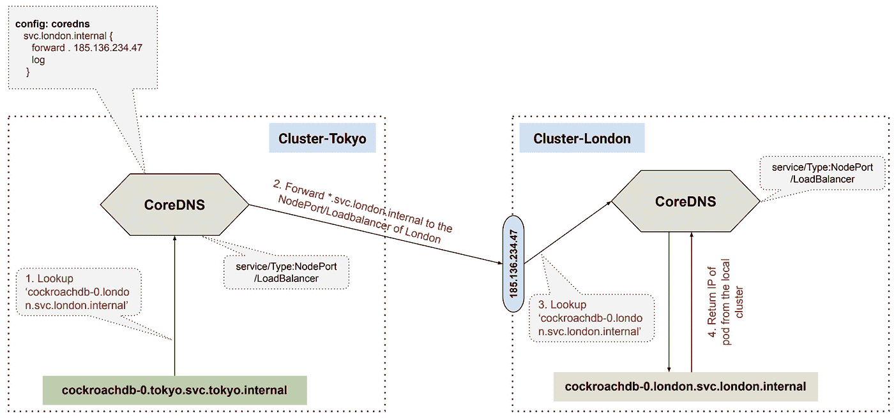

CoreDNS —用于跨集群 DNS 解析的转发插件

# 多集群、多云和地理复制 CockroachDB

集群之间的互连使 CockroachDB 能够通过互联网进行全球集群。如果用户提供 SQL 查询-读取，那么 CockroachDB 可以使用附近的副本承租人进行响应，并且任何写入都将在所有集群中复制。

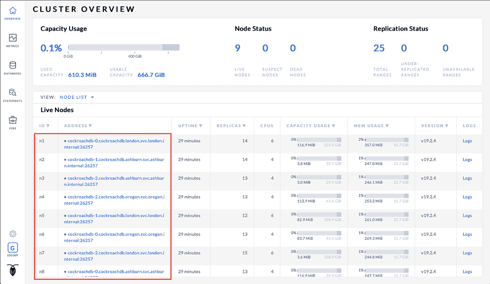

跨云平台的 CockroachDB 节点形成了一个地理分布式集群

如上所示，访问 dashboard 服务会显示来自跨云和跨区域的不同 Kubernetes 集群的集群节点。

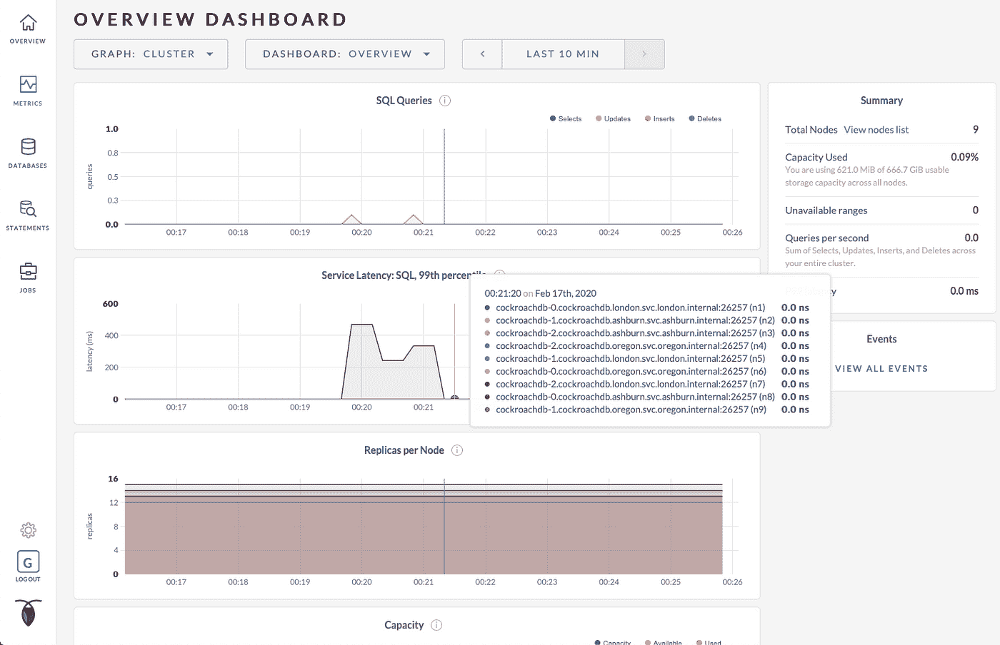

跨云平台的 CockroachDB 节点形成了一个地理分布式集群

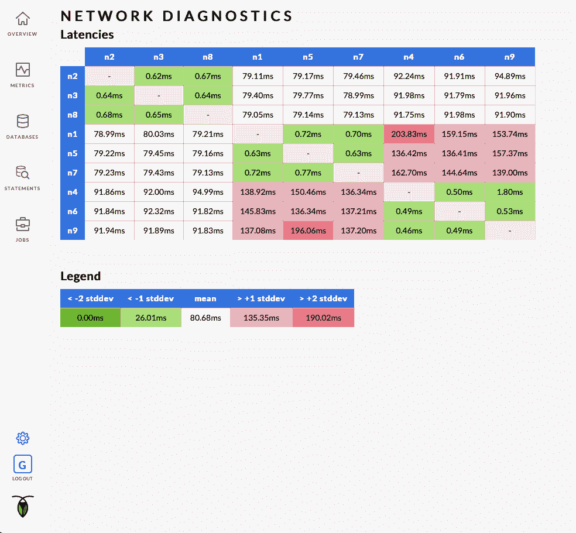

CockroachDB 节点—延迟信息

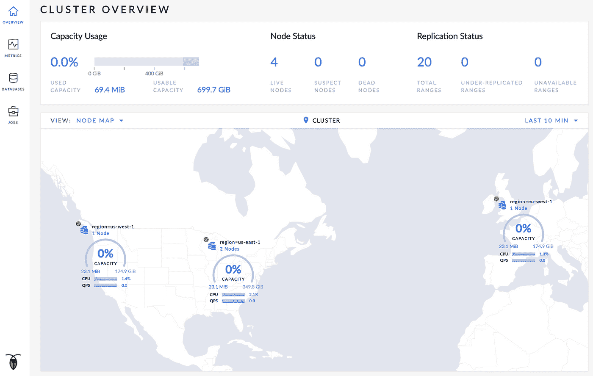

地理分布和地理复制的 CockroachDB

面向应用的多云和多集群架构是云计算的必然趋势。随着用户跨集群和云部署应用和服务，跨集群网络连接成为应用部署的基本要求。跨集群网络连接简化了应用部署，因为运营商不再需要在应用组件之间设置复杂的网络路由或负载平衡器规则。像 Submariner 这样的解决方案可以通过实现不同 Kubernetes 集群中的 pods 和服务之间的直接联网来简化跨集群联网，并且还可以在战略边缘计划中发挥重要作用。