# Kubernetes 多集群网络-纤毛集群网格

> 原文：<https://itnext.io/kubernetes-multi-cluster-networking-cilium-cluster-mesh-bca0f5367d84?source=collection_archive---------0----------------------->

Cilium 的多集群实现

在动态变化和非常复杂的微服务生态系统时代，传统的 IP 和端口管理可能会在管理和扩展方面带来问题。Cilium 使用 BPF，可用于在 Linux 内核中转发数据，并可通过代理注入用于服务网格，如 Kubernetes 基于服务的负载平衡或 istio。

BPF 和 Berkeley Packet Filter 一样，最初设想于 1992 年，目的是提供一种过滤包的方法，避免无用的包从内核复制到用户空间。扩展 BPF (eBPF)是对 BPF(现在称为 cBPF，代表经典 BPF)的增强，具有增强的资源，例如 10 个寄存器和 1–8 字节加载/存储指令。BPF 有向前跳转，而 eBPF 既有向后跳转又有向前跳转，所以可能会有一个循环，当然，内核会确保正确终止。

如今，诸如 x86_64、arm64、ppc64 和 s390 之类的架构已经能够从 eBPF 程序中编译出本机操作码映像，从而代替通过内核 eBPF 解释器的执行，所得到的映像可以像任何其他内核代码一样本机运行。然后，tc 将程序安装到内核的网络数据路径中，通过有能力的 NIC，程序也可以完全卸载到硬件中。

Kubernetes 使用 iptables 作为 CNI 的核心。iptables 存在重大问题，这在大量多样的流量条件下造成了问题。iptable 规则是按顺序匹配的，对 iptable 的更新必须通过在单个事务中重新创建和更新所有规则来完成，这可能不适合高度动态的容器空间。如果数据包经常遇到表中较低部分的规则，性能会受到影响。另一方面，BPF 与“最接近的”规则匹配，而不是通过迭代整个规则集，这使得它非常适合网络策略的实现。

Cilium 提供内置于层中的多集群功能(pod-ip 路由、服务发现和负载平衡等。)中，用户可以选择使用所有层，也可以根据需要仅选择和使用层。

# 纤毛 CNI 实施

Cilium 代理、Cilium CLI 客户端和 CNI 插件在集群中的每个节点上运行(部署为 daemonset)。Cilium CNI 插件执行所有与网络管道相关的任务，如创建链接设备(veth 对)，为容器分配 IP，配置 IP 地址，路由表，sysctl 参数等。Cilium agent 编译 BPF 程序，并使内核在网络栈的关键点运行这些程序。

Cilium 提供了两种网络模式:

1.  覆盖网络模式:最常用和默认的网络模式。使用基于 udp 的封装协议的隧道网状结构的群集中的所有节点:VXLAN(默认)或 Geneve。在这种模式下，Cilium 可以自动形成一个覆盖网络，无需用户使用 kube-controller-manager 中的“— allocate-node-cidrs”选项进行任何配置。
2.  直接/本地路由模式:在这种配置中，Cilium 将所有不是发往另一个本地端点的数据包移交给 linux 内核的路由子系统。这个设置需要一个额外的路由守护进程，如鸟，奎加，BGPD，斑马等。通过节点的 IP 向所有其他节点通告非本地节点分配前缀。与 VxLAN 覆盖相比，BGP 解决方案具有更好的性能，更重要的是，它使容器 IP 可路由，而无需任何额外的网格配置。

考虑到默认网络模式和 Kubernetes CNI 实施，Cilium 支持 VETH/IPVLAN 作为链接设备。

Cilium 在主机网络空间上创建三个虚拟接口:cilium_host、cilium_net 和 cilium_vxlan。Cilium agent 在启动时创建一个名为'*cilium_host←>cilium _ net '*的 veth 对，并将 CIDR 的第一个 IP 地址设置为 cilium_host，然后 cilium _ host 作为 CIDR 的网关。CNI 插件将生成 BPF 规则，编译它们并将其注入内核，以弥合 veth 对之间的差距。

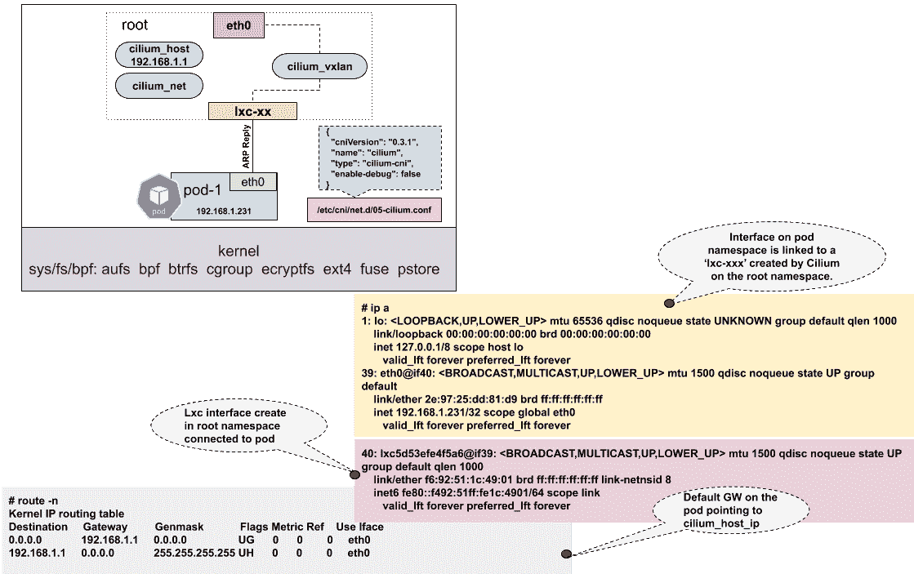

CNI 库伯内特纤毛——实施

如上所示，当创建一个 pod 时，在根名称空间上创建一个带有“lxc-xx”的 VETH 接口，另一端连接到 pod 名称空间。pod 的默认网关指向“cilium _ host”IP，Cilium 代理安装必需的 BPF 程序来回复 ARP 请求。LXC 接口 MAC 用于 ARP 回复。Pod 生成的流量的下一个 L3 跳是 cilium_host，Pod 生成的流量的下一个 L2 跳是 veth 对的主机端。

在多主机联网中如果使用 VxLAN，Cilium 会在每个主机中创建一个 cilium_vxlan 设备，并通过软件进行 VxLAN encap/decap。Cilium 在元数据模式下使用 VXLAN 设备，这意味着它可以在多个地址上发送和接收。Cilium 将使用它找到的第一个公共 IPv4 地址作为 VXLAN VTEP。Cilium 使用 [BPF](https://lwn.net/Articles/705609/) 进行 LWT(轻量级隧道)封装，pods 发出的所有网络数据包都封装在一个报头中，该报头可以由 VXLAN 或 Geneve 帧组成，这些帧通过标准 UDP 数据包报头传输。

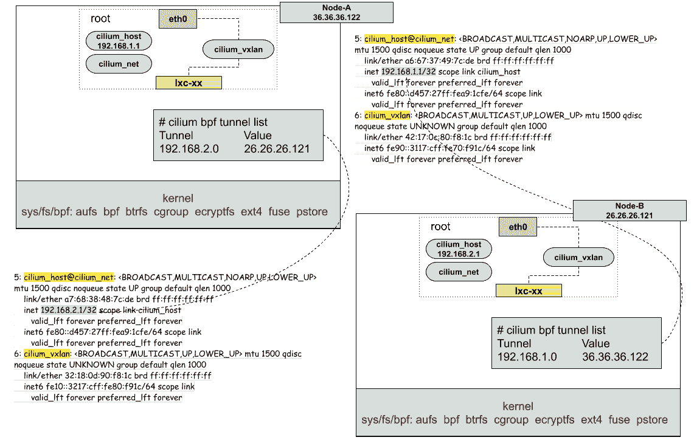

CNI 库伯内特纤毛——界面

如上所示，在多主机网络设置中，Cilim 在节点之间创建隧道，其中隧道端点映射由 Cilium 编程。

# 纤毛簇网

ClusterMesh 是 Cilium 的多集群实现。ClusterMesh 通过隧道或直接路由，以本机性能在多个 Kubernetes 集群之间实现 Pod IP 路由，无需任何网关或代理。

使用部署在 [Vultr](https://www.vultr.com/) 上的不同地区的三个不同的 AIO(主+工作)Kubernetes 集群尝试 ClusterMesh:

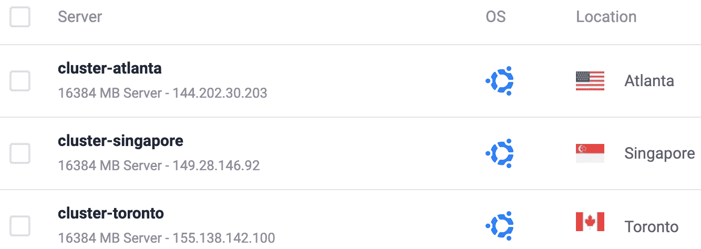

拓扑示例—多区域集群

纤毛 CNI 安装在每个堆栈上，具有独特的/非重叠的 Pod_CIDR，如下所示:

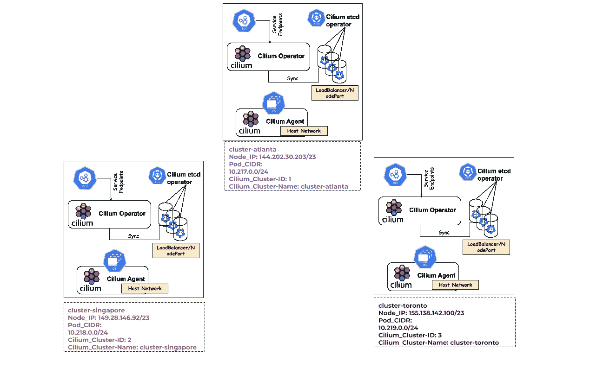

拓扑示例-具有唯一 Pod_CIDR 的多区域集群

每个集群中的 Cilium 堆栈包含一个部署为 daemonset 的 Cilium 代理，该代理监听 Kubernetes 集群中的事件以了解何时创建或删除容器，并且它创建定制的 BPF 程序，Linux 内核使用该程序来控制所有进出这些容器的网络访问。Cilium operator 管理一次性任务，如 Kubernetes 服务与集群网格 etcd 的同步，以及集群中逻辑上应为整个集群处理一次的其他任务。这使得纤毛能够扩展到超过 500 个节点。

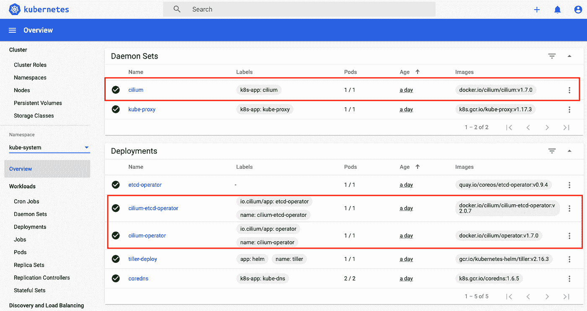

纤毛成分——Kubernetes

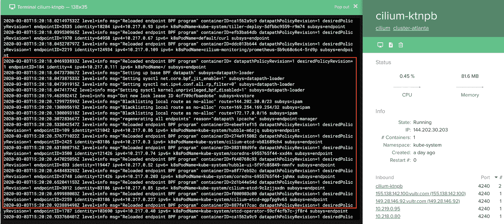

纤毛剂

Cilium 代理配置以 ConfigMap 的形式提供，包含所需的配置以及“群集 id”和“群集名称”，以便在多群集设置中唯一标识群集。

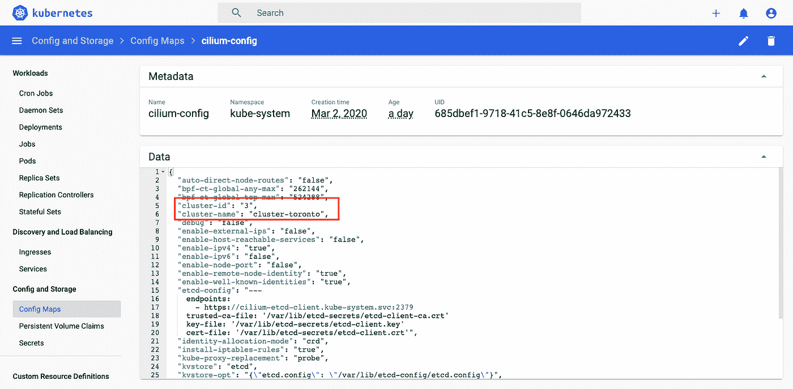

纤毛配置— Kubernetes 配置图

集群网格的先决条件之一是让 Cilium [管理](https://docs.cilium.io/en/v1.7/gettingstarted/k8s-install-etcd-operator/#k8s-install-etcd-operator) etcd，etcd-operator 用于保证仲裁、自动创建证书和管理压缩。可以用任何其他方式管理 etcd，但是集群网格需要某些方面，以便在集群之间进行状态传播。

cilium-etcd-operator 使用并扩展了 etcd-operator 来创建和管理集群上的 etcd。运营商将始终确保维持法定人数，并在法定人数出现故障时重新创建 etcd-cluster:

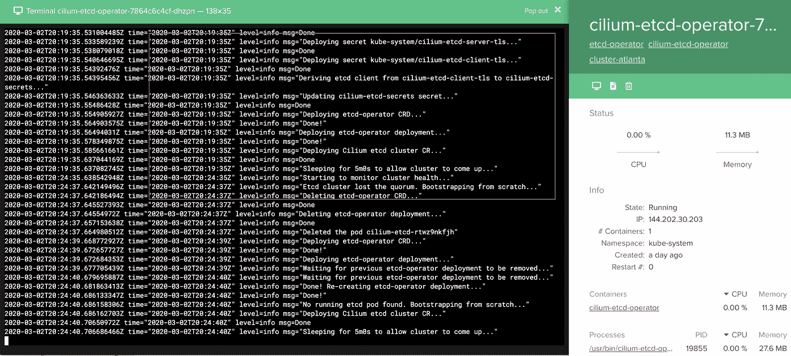

纤毛 etcd 算子

每个 Kubernetes 集群维护自己的 etcd 集群，其中包含该集群的状态。来自多个集群的状态不会在 etcd 本身中混合。在其他集群中运行的 Cilium 代理连接到 etcd 代理以观察变化，并将多集群相关状态复制到它们自己的集群中。集群网格中的 etcd 应作为负载平衡器或节点端口公开。这允许 Cilium 在集群之间同步状态，并提供跨集群连接和策略实施。

Cilium 代理将使用预定义的命名模式'*{ cluster name } . mesh . cilium . io '*'连接到远程集群中的 etcd。为了让 DNS 解析和 TLS 验证在这些虚拟主机名称上工作，使用 daemonset 规范中的*‘host aliases’*将名称静态映射到服务 IP。对于上面的拓扑，配置如下所示:

纤毛多簇连接信息

由于跨集群 etcd 使用 TLS，因此在包含多集群环境中所有其他 etcd 的证书和密钥的集群网格的所有集群部分上创建 Kubernetes 秘密。

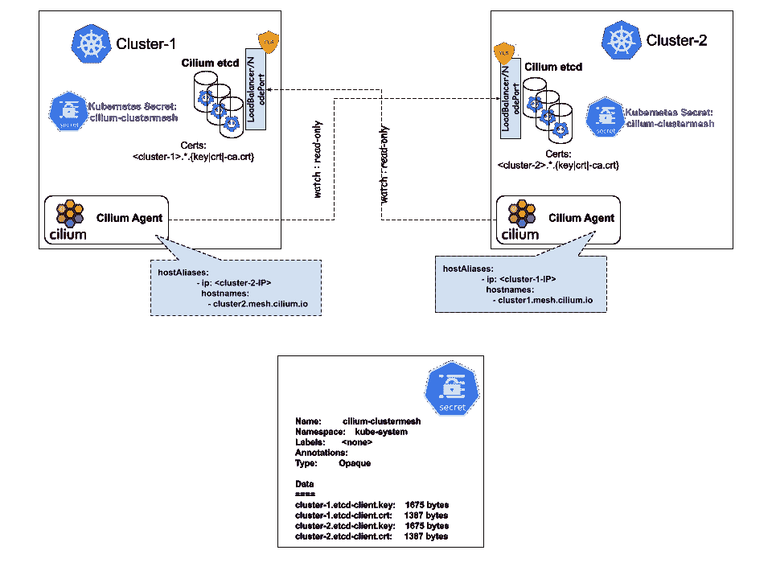

Cilium — etcd 集群之间的可达性和身份验证

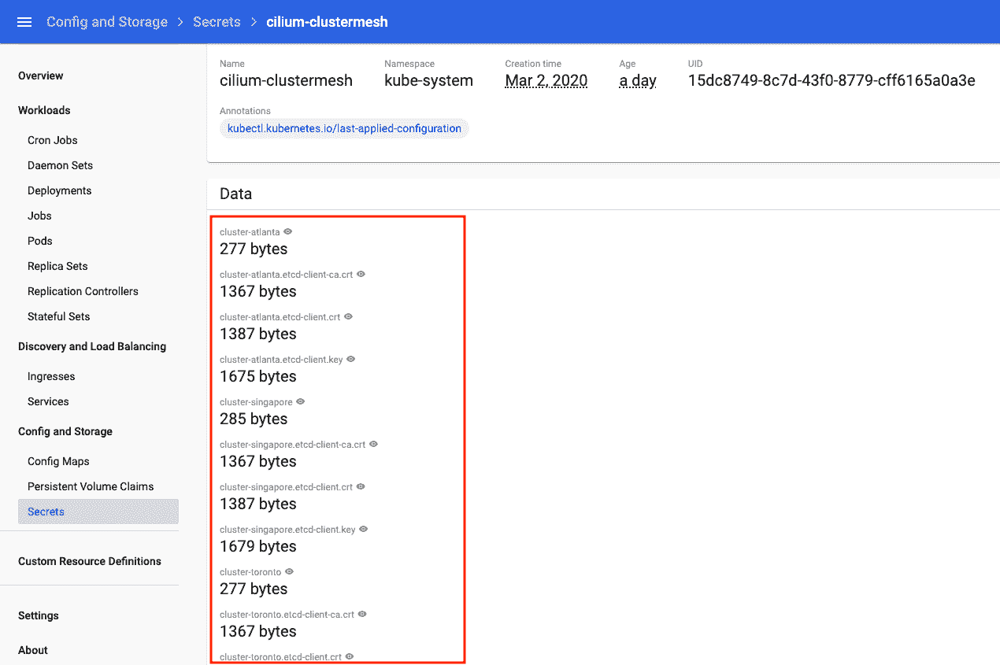

纤毛——多簇 etcd 秘密

使用上面显示的跨集群配置，纤毛代理在所有其他集群之间形成隧道。例如，上面拓扑中的 cluster-atlanta 创建了到 cluster-singapore 和 cluster-toronto 的隧道，如下所示:

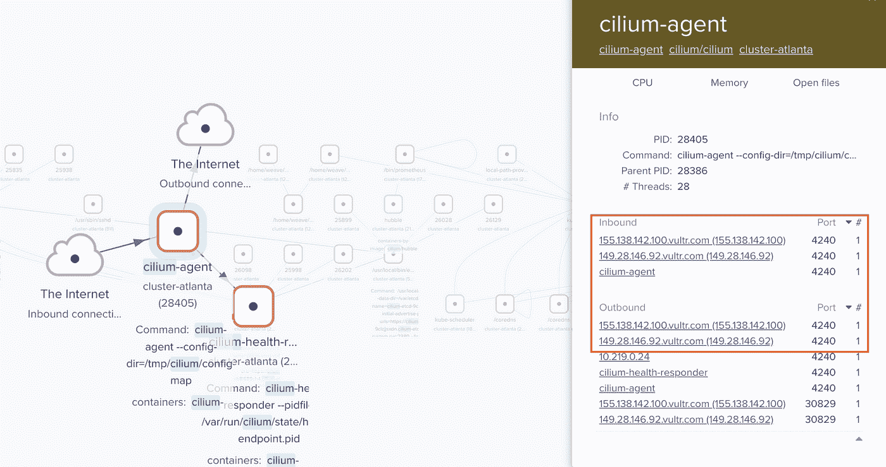

纤毛代理—入站/出站连接

群集上的 Cilum 代理-atlanta 在端口 4240(cilum 代理)上有来自其他群集(新加坡和多伦多)的 Public_IP 的入站和出站连接。

Cilium config 保存隧道模式，便于用户提供要使用的隧道方案，在上面的场景中，使用默认的 VXLAN:

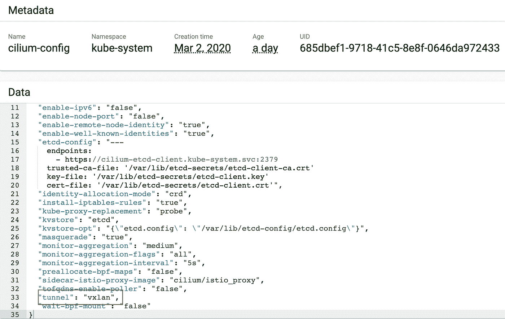

纤毛—隧道模式配置

Cilium 代理使用特定集群的 Pod_CIDR 和从节点列表(集群网格中所有节点的列表)导出的集群的 Public_IP(隧道端点)来制定隧道端点映射。例如，在隧道模式下，将在群集亚特兰大和群集新加坡之间创建一个隧道，如下所示:

纤毛 VxLAN 隧道

在其他支持的直接路由模式中，数据包被直接发送到网络。Cilium 有一个 [kube-router 集成](http://docs.cilium.io/en/stable/gettingstarted/kube-router/)来运行 BGP 路由守护进程以进行路由传播。在这种模式下，VXLAN 开销被消除({SrcPodIP}{DstPodIP}{Payload})。

Cilium 代理使用 Public_IP 和 cilium_host_IP 建立隧道，如下所示:

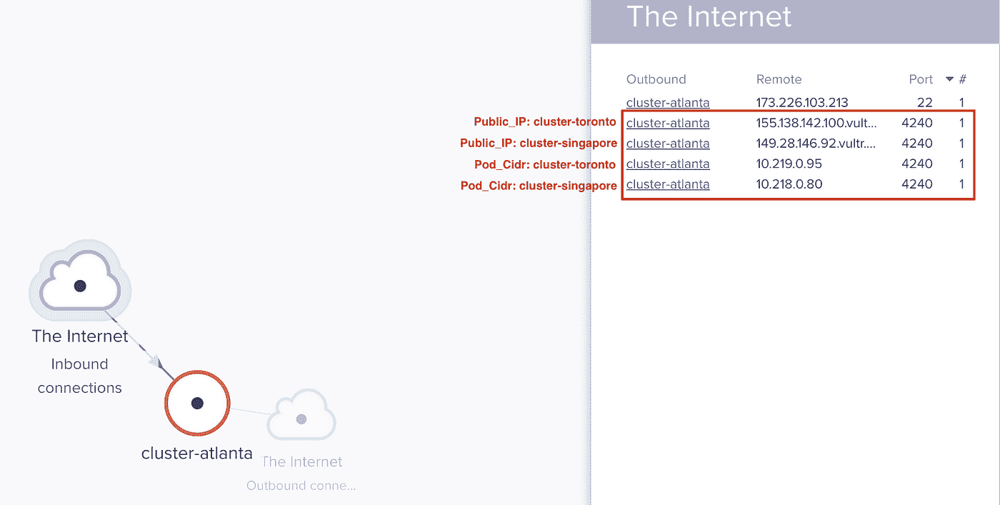

纤毛——多簇隧道

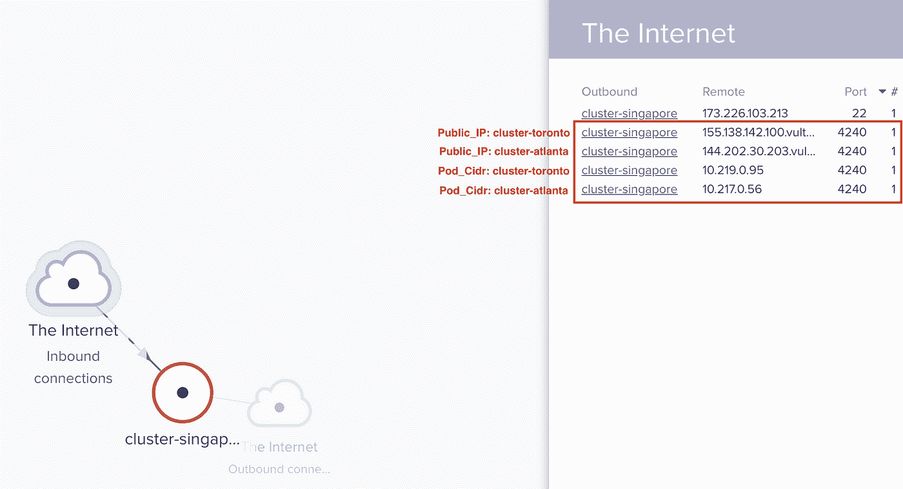

纤毛——多簇隧道

拓扑中三个集群的节点列表和端点如下所示:

纤毛—隧道图

# 多节点 Pod-Pod 数据包流

所有的 pod 流量在退出和进入节点之前都要通过“*纤毛 _vxlan* 接口。cilium_vxlan 设备执行 vxlan 封装/解封装。

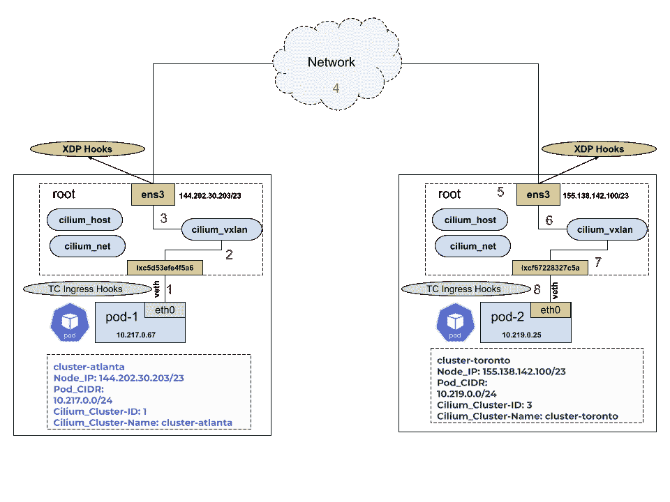

节点之间的 Pod-Pod 数据包流

BPF 程序由 Cilium 代理安装，用于回复 ARP 请求，LXC 接口 MAC 用于 ARP 回复。从群集亚特兰大(10.217.0.67)上的 pod ping 到群集多伦多(10.219.0.25):

底层主机接口上的 VXLAN 数据包— ens3:

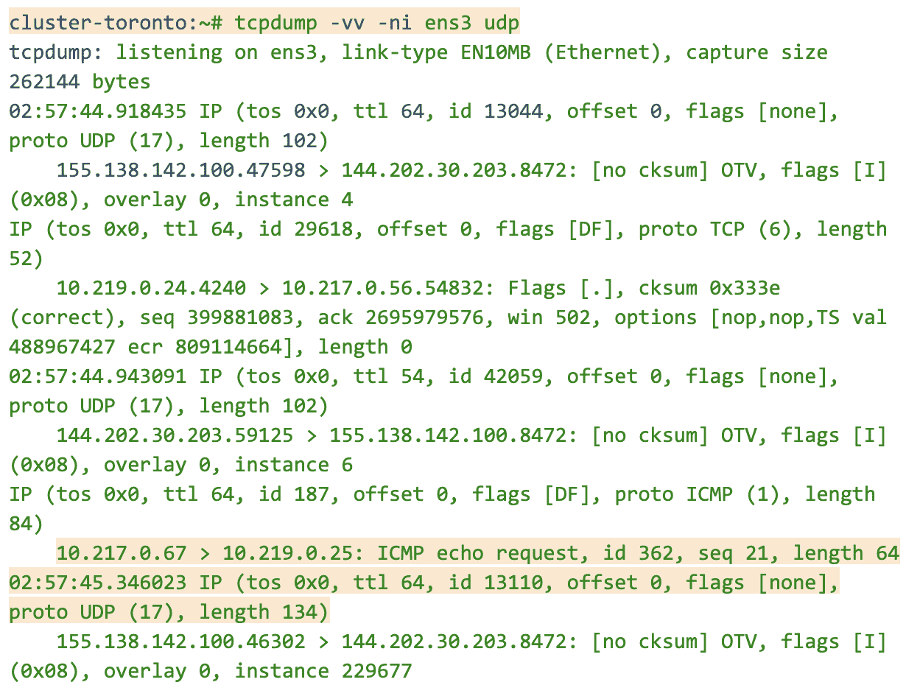

底层主机接口上的 Cilium-UDP 数据包

在' *cilium_vxlan* '接口上解包 VXLAN 数据包:

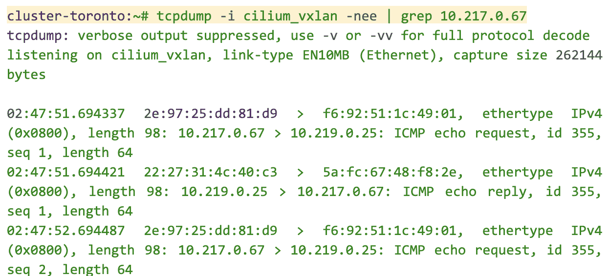

Cilium-VxLan 在 cilium_vxlan 接口上封装/解封装

连接到 pod 的根命名空间上的 LXC 接口回复 ARP 请求:

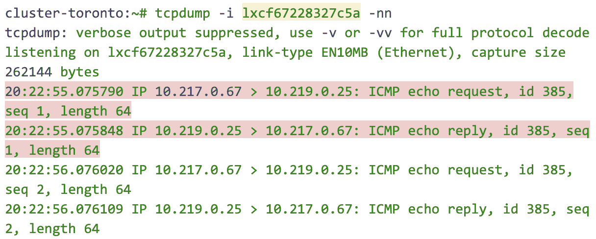

LXC 界面上纤毛-ARP 解析

# 使用 YugaByteDB 测试多集群 Pod 互连性

[yugabytdb](https://github.com/yugabyte/yugabyte-db)是一个分布式的符合 ACID 的数据库，它集合了云原生微服务的三个必备需求，即作为灵活查询语言的 SQL、低延迟读取性能和全球分布式写入可扩展性。

YugabyteDB 使用户能够通过同步或多主复制跨区域和跨云部署。在下面的拓扑中，来自 cluster-singapore 和 cluster-toronto 的 y B- server 与运行在 cluster-atlanta 上的 YB-Master 连接在一起。这只是为了测试 pod 互连性，而不是默认/支持的部署模式。

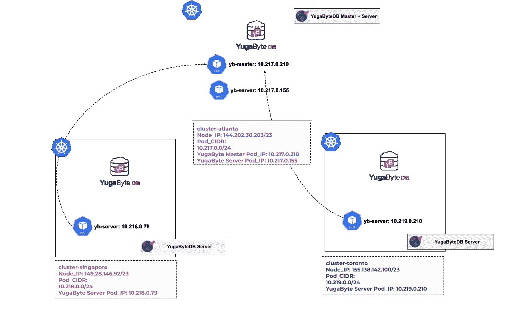

拓扑示例— YugaByteDB

YugabyteDB 主服务器部署在 cluster-atlanta 上，本地服务器位于同一个集群中:

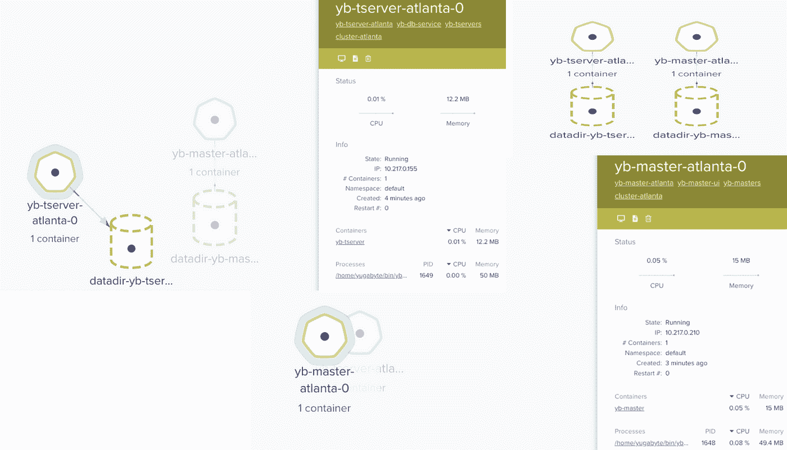

YugaByteDB 主机—集群 _ 亚特兰大

YugabyteDB 门户显示集群上的主服务器和本地服务器-atlanta:

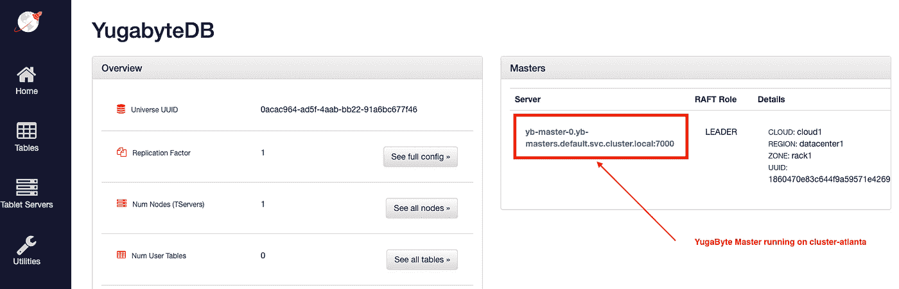

YugaByteDB 主机—集群 _ 亚特兰大

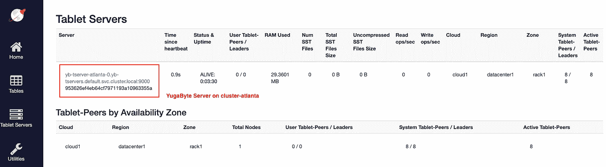

YugaByteDB 服务器—亚特兰大集群

yugabytdb 服务器部署在 cluster-singapore 和 cluster-toronto 上，这两个服务器都配置为加入 cluster-atlanta 上的 yugabytdb 主服务器。如下所示，不同子网(10.218.0.0/24 和 10.219.0.0/24)中的两台服务器都有到 cluster-atlanta (10.217.0.30)的出站连接。

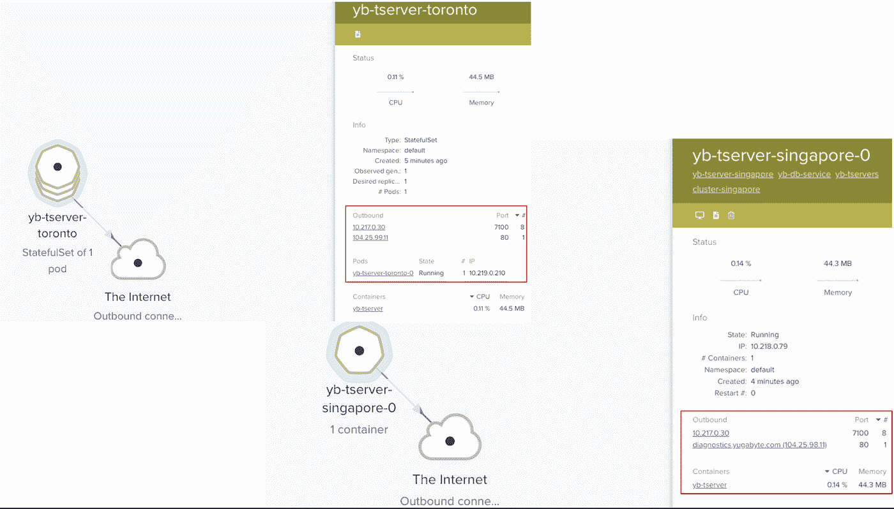

YugaByteDB 服务器—新加坡群集和多伦多群集

YugabyteDB 门户显示了来自不同 Kubernetes 集群的集群中的另外两个活动服务器:

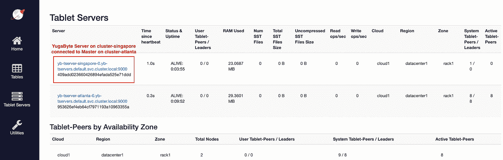

YugaByteDB 服务器—集群 _ 新加坡

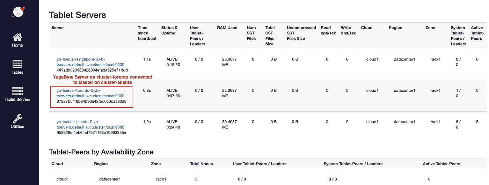

YugaByteDB 服务器—群集 _ 多伦多

# 多集群网络策略—限制集群之间的 Pod-Pod 通信

在每台主机上运行的 Cilium 代理不是管理 IP 表，而是将网络策略定义转换为 BPF 程序，这些程序加载到内核中并连接到容器的虚拟以太网设备。这些程序在每个发送或接收的数据包上执行。

在具有集群网格的多集群环境中，集群名称通过标签'*io . cilium . k8s . policy . cluster*公开，可用于将策略限制到特定集群。

允许从 cluster-atlanta 上的 YB-Master 到 cluster-singapore 和 cluster-toronto 上的 y b-server 的入站和出站流量。

出口允许规则匹配标签:应用和群集:群集名称:

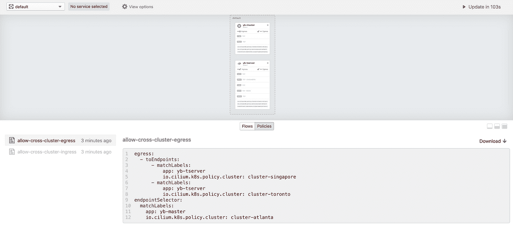

Cilium —网络策略—允许集群之间的出口

入口允许规则匹配标签:应用和群集:群集名称:

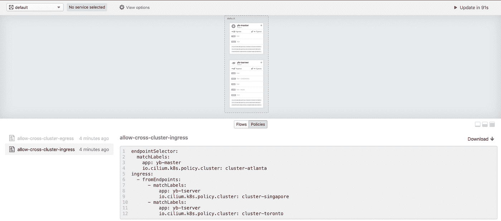

Cilium —网络策略—集群之间允许的入口

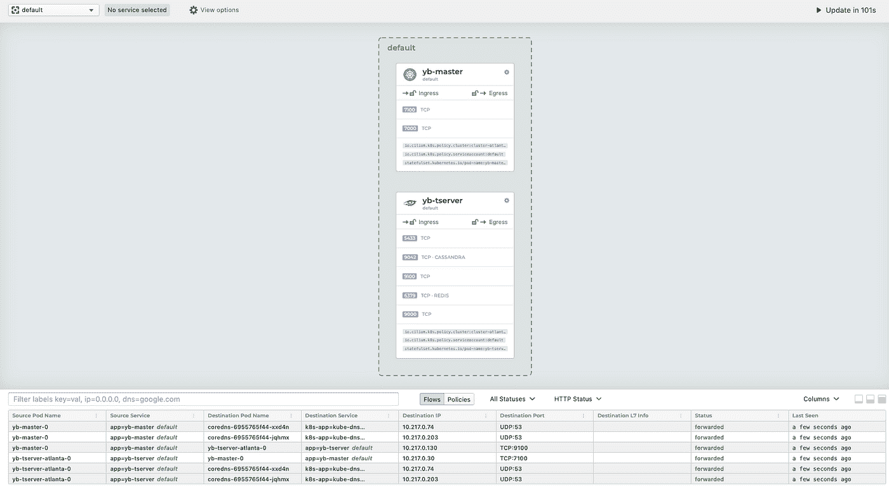

纤毛—哈勃界面

拒绝来自 cluster-singapore 上 YB-Server 的所有出口，这将导致主节点上的健康检查失败，从而将服务器节点标记为死节点，如下所示:

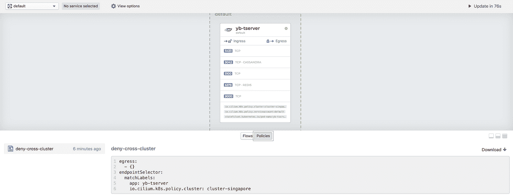

Cilium —网络策略出口拒绝集群新加坡

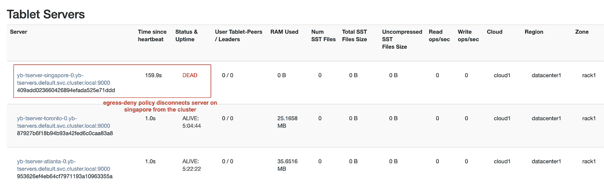

Cilium —网络策略出口拒绝集群新加坡

Cilium 1.7 提供了集群范围的 CNP，可以在集群级别实施策略。借助最新的 Hubble，用户可以使用多个过滤器可视化流的粒度信息，还可以通过添加注释获得 L7 可见性，从而消除为每个选定端点创建完整策略的负担。

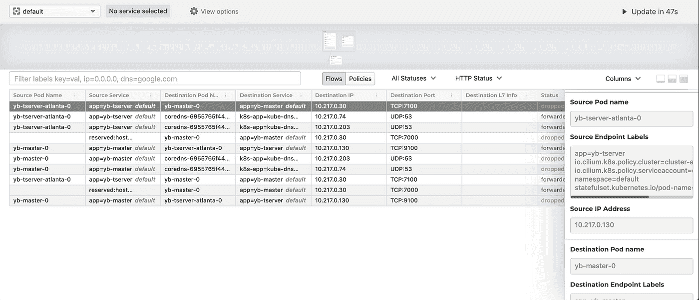

纤毛——哈勃界面可视化

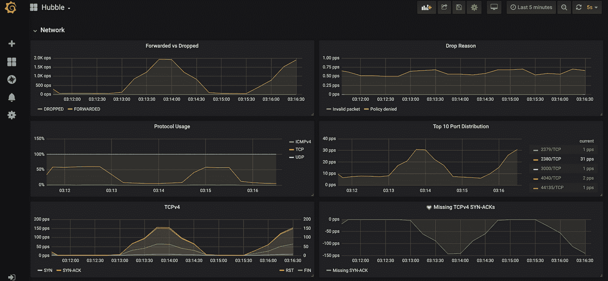

纤毛——哈勃度量

集群网格可以有效地处理各种用例，如高可用性:集群级负载平衡、共享服务:一组服务，如监控、日志记录等。可以在多个集群之间共享，等等。整体 Cilium Cluster Mesh 可以大大降低每个租户运行单个集群的操作复杂性，或者为不同类别的服务构建集群并实现它们之间的互连。