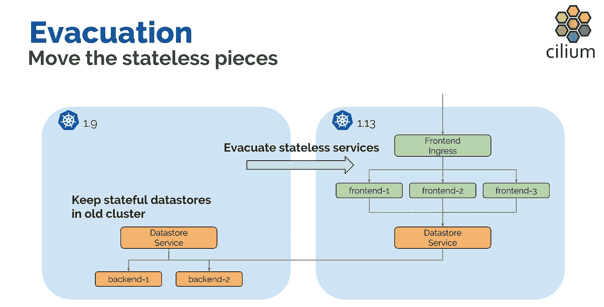
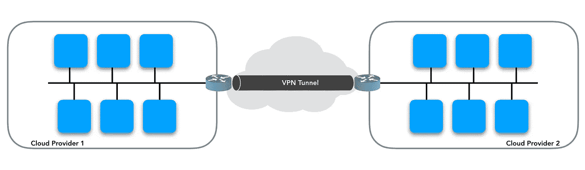
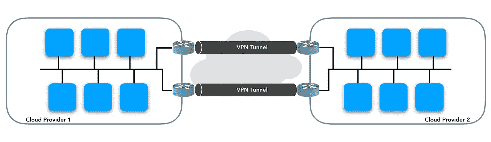
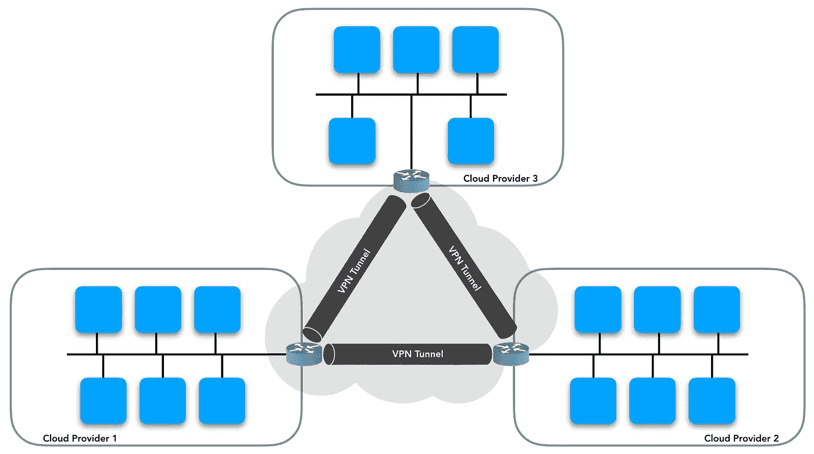
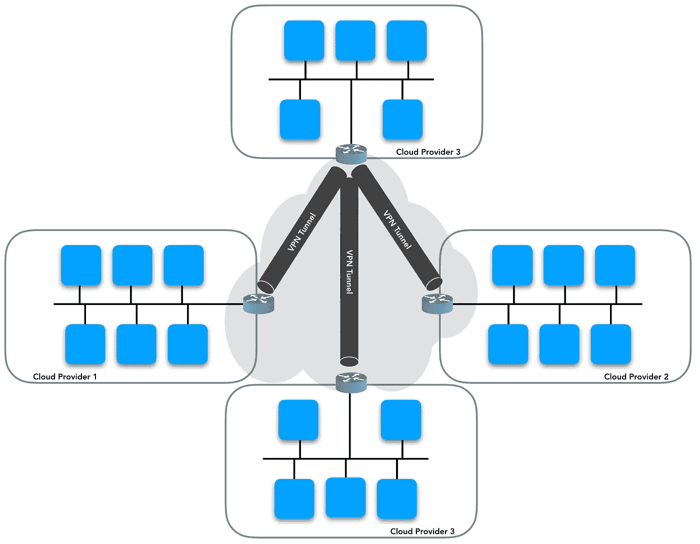
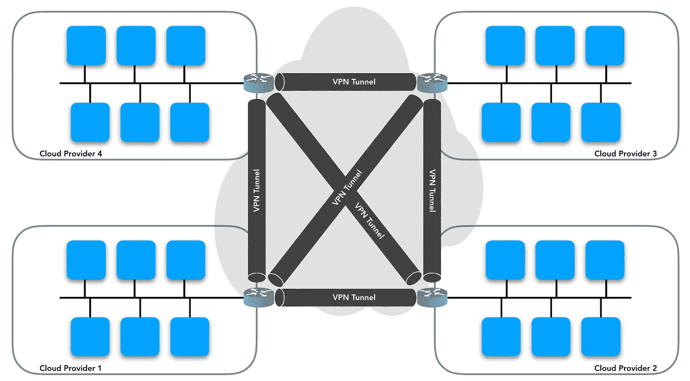
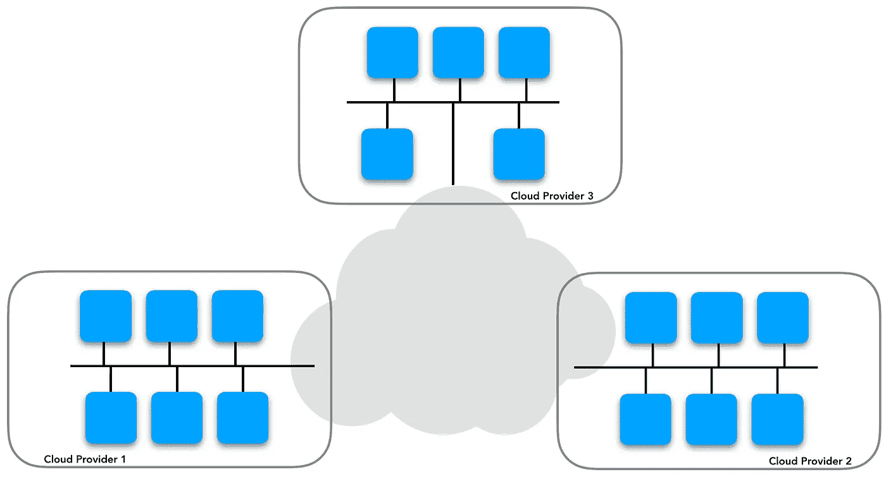
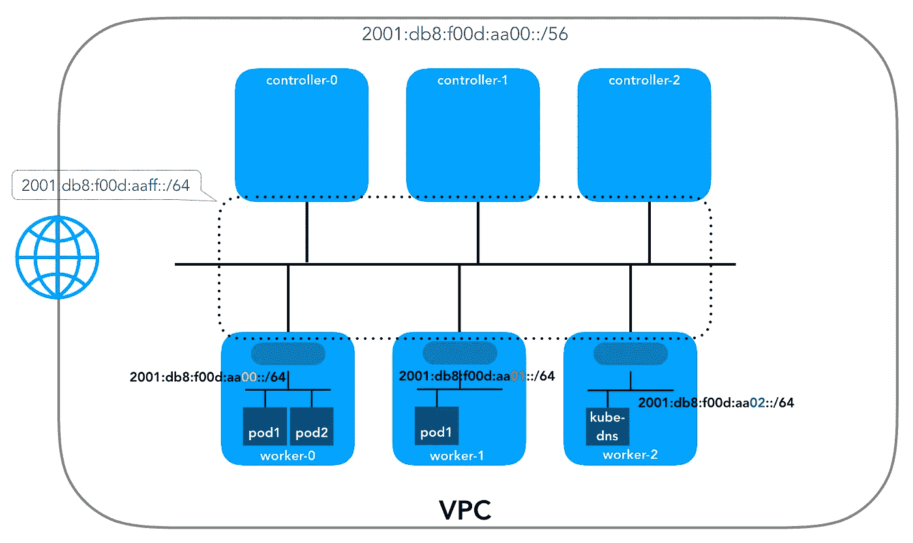

# Kubernetes 简化了多集群网络

> 原文：<https://itnext.io/kubernetes-multi-cluster-networking-made-simple-c8f26827813?source=collection_archive---------1----------------------->

**TL；DR:** 为了便于扩展，Kubernetes 多集群网络应该简单。如果您不想担心复杂的路由、覆盖网络、隧道或者必须加密集群之间的流量(假设您的应用程序已经在这样做)，那么透明地运行 IPv6 应该会有所帮助。

我刚从 [Kubecon NA 2018](https://events.linuxfoundation.org/events/kubecon-cloudnativecon-north-america-2018/) 回来，在那里我有机会参加了非常鼓舞人心的会议，从不同角度介绍了 Kubernetes 多集群网络。其中包括:

*   [使用 Istio Multicluster 在集群之间“爆发”工作负载](https://codelabs.developers.google.com/codelabs/istio-multi-burst/#0) ( [科林·尼尔森](https://twitter.com/colnels))
*   [一路向下的集群:疯狂的多集群拓扑](https://www.youtube.com/watch?v=-gPnYTI70FE) ( [马特·考尔菲尔德](https://www.oort.io/))
*   [跨 Kubernetes 集群运行分布式系统](https://www.youtube.com/watch?v=nNjWrAjzgr8) : ( [Alex Robinson](https://twitter.com/alexwritescode) )
*   [跨云提供商连接 Kubernetes 集群](https://www.youtube.com/watch?v=U34lQ8KbQow) ( [托马斯·格拉夫](https://twitter.com/tgraf__))

我无法停止思考 IPv6 将给多集群网络带来的好处。毕竟凯尔西在他的主题演讲中说过:

> 人们无视过去，一事无成。然后灯泡灭了，说；嘿，也许这是一个新问题，但也许旧的解决方案就是答案。这就是诀窍。
> 
> ―凯尔西·海塔尔

# **多集群网络(私有 IPv4 地址空间)**

如果你不熟悉 Kubernetes —单集群—联网，可以参考我之前的帖子； [Kubernetes 联网:幕后](https://medium.com/@nicolasleiva/kubernetes-networking-behind-the-scenes-39a1ab1792bb)或者查看这些 [Kubernetes 联网链接](https://github.com/nleiva/kubernetes-networking-links)。

现在，为什么要运行多个集群。嗯，我不打算在这里讨论这个问题，因为 Matt Caulfield 在他的演讲中很好地解释了原因，而 Thomas Graf 在他的演讲中展示了非常有说服力的使用案例；高可用性、共享服务、疏散(集群升级)等。



那么，怎样才能实现舱对舱的通信呢？首先，我们需要定义如何将`pod`网络路由到本地集群之外，这不是你的`CNI`插件通常会做的事情。您还需要制定一个寻址方案，因为您不希望在您的集群之间运行重叠的 IP 地址，否则这将不起作用…我们是在通过隧道传输流量吗？运行新的覆盖网络？加密流量以便在互联网上传输？这个清单还在继续。

听起来太复杂了，不是吗？然而，请记住，这主要是因为我们的`pod`网络使用了私有 IPv4 地址。为什么？因为根本没有足够的公共 IPv4 地址来应对微服务的激增。

让我们看看支持这一点的不同拓扑。

## 2 簇？

1 个 VPN 隧道，小菜一碟。可能是在两个云提供商之间，或者只是其中一个和您的本地集群之间。如果您在同一个云提供商中有两个集群，您通常**不需要这样做。**



可能有 2 个 VPN 隧道用于冗余。还是可控的。



## 3 簇？

也许你的分布式应用需要一个仲裁器？如果你还建立了冗余连接，你或许可以称之为“*成功的连体三角形*”。同样，不一定是三个不同的云提供商。



## 3+ ?

您的拓扑有不同的设计方案；轴辐式、全网状等。所有这些都各有利弊。

**轮毂和辐条**



**全网状**



在不成为运营噩梦的情况下，这个规模还能扩大多少？在这种情况下，一个完整的网格要求`N*(N-1)/2`与`N`的互连等于集群的数量。

有一些解决方案试图解决这个问题，比如`SD-WAN`。但是为了这篇文章，让我们看看如果我们只使用公共 IPv6 地址会是什么样子。

# **多集群联网(公共 IPv6 地址空间)**

为什么使用 IPv6？因为"*我们可以为地球表面的每一个原子分配一个公共 IPv6 地址，并且仍然有足够的地址来再分配 100 多个地球*"[[源](https://itknowledgeexchange.techtarget.com/whatis/ipv6-addresses-how-many-is-that-in-numbers/)

让我们看看这是什么样子，并讨论对特殊路由、加密或隧道以及冗余连接的需求。我们需要这些吗？有哪些弊端？客观地看，这是一个 3 集群设置的拓扑结构。



## 按指定路线发送

我们将跨地区联网移交给您的底层基础设施/互联网。不需要特殊的路由，不需要在集群之间建立冗余连接。它可能扩展到任意数量的集群…一切都是免费的；有什么条件？是时候谈谈安全问题了。

## 安全性

我知道你在想什么…我们正在把我们的内部基础设施暴露给互联网。⚠️

嗯，除非你正在设置类似于[私有集群](https://cloud.google.com/kubernetes-engine/docs/how-to/private-clusters)的东西，否则你的`pods`通常可以通过网络地址转换( [NAT](https://en.wikipedia.org/wiki/Network_address_translation) )访问互联网，而 [NAT](https://en.wikipedia.org/wiki/Network_address_translation) 并不会真正阻止数据包。NAT 根本不足以保护您的基础设施。然而，它确实隐藏了内部寻址，代价是将转换状态保存在其他地方。

让我们运行这里[描述的示例](https://kubernetes.io/docs/tasks/debug-application-cluster/get-shell-running-container/#getting-a-shell-to-a-container)来在托管的 Kubernetes 集群中创建一个`ngnix` pod。

```
kubectl create -f [https://k8s.io/examples/application/shell-demo.yaml](https://k8s.io/examples/application/shell-demo.yaml)
kubectl exec -it shell-demo -- /bin/bash
apt-get update
apt-get install iputils-ping iproute2 -y
```

现在尝试 ping 一个公共网站(`apt-get`那时已经接入互联网)

```
root@shell-demo:/# **ping azure.microsoft.com -c 1**
PING l-0007.l-msedge.net (13.107.42.16) 56(84) bytes of data.
64 bytes from 13.107.42.16 (13.107.42.16): icmp_seq=1 ttl=119 time=3.09 ms--- l-0007.l-msedge.net ping statistics ---
1 packets transmitted, 1 received, 0% packet loss, time 0ms
rtt min/avg/max/mdev = 3.094/3.094/3.094/0.000 ms
```

所以你在一定程度上与互联网相连。

另一方面，如果你担心有人通过 IPv6 从互联网访问你的`pods`，请记住你有多层安全措施来隔离他们。例如，在 AWS 中，您有 [ACL](https://docs.aws.amazon.com/vpc/latest/userguide/vpc-network-acls.html) 用于控制进出一个或多个子网的流量，因此您可以阻止任何不是来自您的另一个子网的流量进入您的子网。那么您的节点/虚拟机将有一个[安全组](https://docs.aws.amazon.com/vpc/latest/userguide/VPC_SecurityGroups.html)，因此您也可以在实例级别限制访问。最后，但同样重要的是，你还可以在 Kubernetes 中应用一个[网络策略](https://kubernetes.io/docs/concepts/services-networking/network-policies/)来在 pod 级别保护你。


AWS 将为您的`VPC`提供一个`/56` IPv6 子网。那相当于**256**IPv6 子网。例如，您的 [ACL](https://docs.aws.amazon.com/vpc/latest/userguide/vpc-network-acls.html) 可能只允许分配给不同`VPC`或 Kubernetes 集群的`/56`之间的流量。所以你的`pods`实际上只能被其他`pods`访问。然后可以使用[安全组](https://docs.aws.amazon.com/vpc/latest/userguide/VPC_SecurityGroups.html)和[网络策略](https://kubernetes.io/docs/concepts/services-networking/network-policies/)来应用更细粒度的策略。

至于隧道、VPN 连接、覆盖网络等。与 [NAT](https://en.wikipedia.org/wiki/Network_address_translation) 相同；它们隐藏您的端点，代价是 IPsec 的性能损失、数据包开销等。如果您可以接受在您的 pods 中使用公共 IPv6 地址(+ [ACL](https://docs.aws.amazon.com/vpc/latest/userguide/vpc-network-acls.html) )，那么前面的技术都不是严格必需的。我知道这可能不适用于所有人，没关系，这是一种交换。

## 处理 IPv6 地址

是啊，我知道。记住一个 IPv4 地址已经够难的了，所以 128 位长的 IPv6 地址听起来不太可能。

好吧，虽然每个`pod`都有自己的 IP 地址，但是这些 IP 地址并不稳定，因为`pods`死了也不会复活。由于这个原因，Kubernetes 有了一个`Service`的概念，它定义了一个由`Label Selector`决定的`pods`的逻辑集合。[ [Kubernetes 服务](https://kubernetes.io/docs/concepts/services-networking/service/) ]。此外，在 Kubernetes " *中，集群中定义的每个服务都被分配了一个 DNS 名称* " [ [服务的 DNS](https://kubernetes.io/docs/concepts/services-networking/dns-pod-service/#what-things-get-dns-names)]。

这意味着您的`pods`将通过他们的`Service` DNS 名称到达，因此您实际上不需要处理地址本身，这一切都发生在幕后。

在针对 Kubernetes 集群的 [IPv4/IPv6 双栈功能提案](https://github.com/leblancd/community/blob/fc4d40bac4ca76d9c46fa7335ea74a186388c313/keps/sig-network/0013-20180612-ipv4-ipv6-dual-stack.md#configuration-of-endpoint-ip-family-in-service-definitions)中，它们说明了如何为 Kubernetes `Service`指定地址族。

```
endpointFamily: <ipv4|ipv6|dual-stack>       [Default: dual-stack]
```

示例:

```
spec:
  selector:
    app: MyApp
  ports:
  - protocol: TCP
    port: 80
    targetPort: 9376
  endpointFamily: ipv6
```

# **当前挑战**

## Kubernetes IPv6 支持

好消息是他们在这一领域取得了非常好的进展，仅支持 IPv6 在 Kubernetes 版中是`Alpha`[[IPv6 支持增加了#508](https://github.com/kubernetes/enhancements/issues/508) ]并且应该在 K8s 1.13 中是`Beta`。【[评论](https://github.com/kubernetes/enhancements/issues/508#issuecomment-411178780)】。还有提案提出“[增加 IPv4/IPv6 双栈支持和感知# 62822](https://github.com/kubernetes/kubernetes/issues/62822)”[[PR](https://github.com/kubernetes/community/pull/2254)， [KEP](https://github.com/kubernetes/enhancements/blob/1a03c720c3426efb16a68942bc8db37ac2b957f7/keps/sig-network/0013-20180612-ipv4-ipv6-dual-stack.md) 。

为什么是双栈？不幸的是，现在已经快 2020 年了，但仍然有一些关键服务不支持 IPv6 就像您的`pods`可能需要访问的一些包、源代码和容器库。👎

从好的方面来看，目前有一些`CNI`插件已经能够在`pod`上配置双栈地址。然而，重要的是要记住，根据`PodStatus` V1 核心 API 的定义，Kubernetes 每个`pod`只知道一个地址。双栈提议称，他们将保留`PodIP`字段，但也会添加一个新数组`PodIPs`，用于存储额外的`pod`IP[[PR](https://github.com/kubernetes/kubernetes/pull/69029)]。

```
type PodStatus struct {
        ...
        HostIP     string
        PodIP      string
        PodIPs     []PodIPInfo
        ...    
}
```

和

```
type PodIPInfo struct {
        IP         string
        Properties map[string]string
    }
```

在过去，当使用双栈集群时，我所做的是使 IPv6 地址成为分配给`pod`的 IPv4 地址的散列函数，因此我只需要跟踪其中一个并自动导出另一个。这大概是不推荐的，但是如果你好奇的话，我在我的 Gophercon lightning talk 演示中是这么做的:[容器网络接口和 Go](https://www.youtube.com/watch?v=0SXPsLvB0UI) 。

最后，同样重要的是，Kube-proxy 将被修改为并行驱动`iptables`和`ip6tables`(如果不使用`eBPF`)。另一方面，`Service`集群内的访问将通过所有 IPv4 服务 IP 或所有 IPv6 服务 IP 来完成。确保您检查了建议书的[非目标](https://github.com/kubernetes/enhancements/blob/1a03c720c3426efb16a68942bc8db37ac2b957f7/keps/sig-network/0013-20180612-ipv4-ipv6-dual-stack.md#non-goals)。

## 云提供商 IPv6 支持

云服务提供商对虚拟机/实例的 IPv6 支持充其量也只是凤毛麟角。我希望能够进行 IPv6 子网路由，以便为每个虚拟机实例分配不同的 IPv6 子网。AWS 在 IPv6 支持方面走在了前面，但是它不会让你分解他们在 VPC 中分配给你的`/56`，分配给你实例的个人`/64`[[论坛](https://forums.aws.amazon.com/thread.jspa?messageID=799319#799319)。



AWS 支持团队帮助我完成了一个工作区，通过使用 [ENI](https://docs.aws.amazon.com/AWSEC2/latest/UserGuide/using-eni.html) 将虚拟机上的`/64`的较小块用作`pod`网络。虽然使用小于`/64`的子网不是推荐的做法，甚至可能无法与 [Docker](https://docs.docker.com/v17.09/engine/userguide/networking/default_network/ipv6/#how-ipv6-works-on-docker) 一起使用，因为"*Docker 容器的子网至少应该有* `*/80*` *的大小， 因此，IPv6 地址可以以容器的 MAC 地址结束，并且您可以防止 Docker 层*中的 NDP 邻居缓存无效问题”，这至少会让我在此期间做一些实验。 我将单独写一篇文章描述这是如何工作的➡️如何在 AWS 上运行支持 IPv6 的 Docker 容器。

另一方面，如果您正在运行一个托管的 Kubernetes 集群，那么 IPv6 可能需要更长的时间，因为它们运行的 Kubernetes 版本将只包含成熟的特性。比如 GCP 说:"*为确保稳定性和生产质量，普通 GKE 集群仅启用* `*beta*` *或更高版本的功能。* `*Alpha*` *功能无法在普通集群上启用，因为它们无法投入生产或升级*。GCP 文件。因此，IPv6 在 GCP 是一个禁忌，因为他们甚至不支持它。

# **结论**

虽然要实现这一点还需要做一些工作，但我相信这是值得的，并且有助于控制复杂性。IPv6 的好处不仅适用于单个集群，也适用于多集群 Kubernetes 系统。如果您知道一家支持 IPv6 的云提供商，请告诉我。

延伸阅读:

*   [Kubernetes 网络:幕后](/kubernetes-networking-behind-the-scenes-39a1ab1792bb?source=friends_link&sk=b5b666c68375f7c60f76faa8571baa21)
*   [如何在 AWS 上运行支持 IPv6 的 Docker 容器](https://medium.com/@nleiva/how-to-run-ipv6-enabled-docker-containers-on-aws-87e090ab0397?source=friends_link&sk=126bd9850d2fc46a2ff99bee89c735ca)
*   [我们需要 IPv6 的三个原因…在 Kubernetes](https://nleiva.medium.com/three-reasons-we-need-ipv6-in-kubernetes-69b6f3cbadb7)