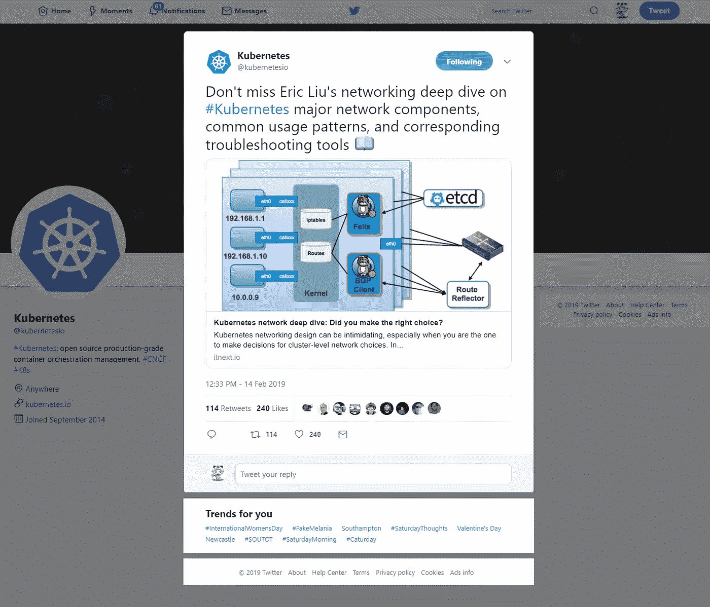
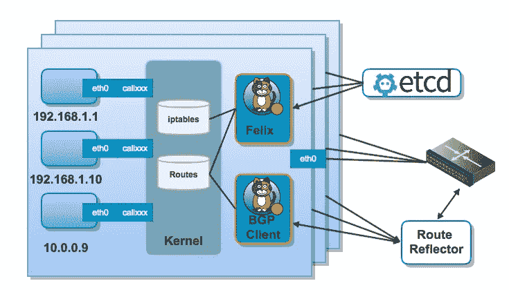
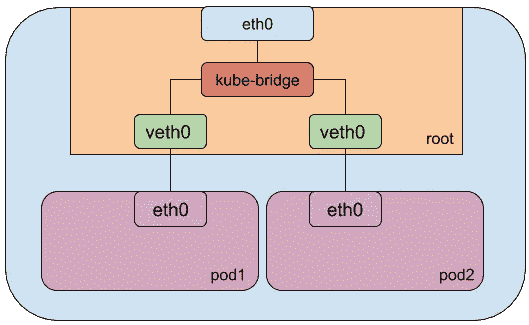

# Kubernetes 网络深潜:你做了正确的选择吗？

> 原文：<https://itnext.io/kubernetes-network-deep-dive-7492341e0ab5?source=collection_archive---------0----------------------->

## Kubernetes 的网络设计可能令人生畏，尤其是当您是集群级网络选择的决策者时。在本节中，我们将讨论这些选择将如何影响集群路由和负载平衡，重点是 KubeProxy 模式(iptables vs IPVS)和网络解决方案。

# 更新:

这是我在 Medium 上的第一个 Kubernetes 博客，我很高兴看到它得到了 Kubernetes 官方账户的认可，太令人鼓舞了！感谢[伊夫·辛克莱文](https://medium.com/u/11ff85587fd4?source=post_page-----7492341e0ab5--------------------------------)和[基亚拉什·伊朗人](https://medium.com/u/cb3f1b710e82?source=post_page-----7492341e0ab5--------------------------------)邀请我来到这个伟大的社区 [ITNEXT](https://medium.com/u/5db23d2304f9?source=post_page-----7492341e0ab5--------------------------------) 。



这个博客的主要目的是帮助 Kubernetes 用户熟悉 K8S 的主要网络组件、常见的使用模式和相应的故障排除工具。这将为您设计下一个集群或分析现有的集群网络问题并提出改进建议提供良好的基础。

第一个问题，KubeProxy 是所有 K8S 集群中关键且必需的组件，哪种模式最适合你？iptable 还是 IPVS？

接下来，如何选择最佳的 L2/L3 网络解决方案？KubeRouter，Calico，法兰绒还是其他？

部署集群并使网络正常运行后。我可以使用什么工具来验证路由和负载平衡的预期行为？

为了回答上述所有问题，我们提供了如下 3 种网络组合，试图涵盖最常见的场景。

## 网络插件和 KubeProxy 模式组合

*   集群 A: Calico(ipip 跨子网)+ KubeProxy(IPVS 模式)
*   集群 B:Calico(ipip always)+kube proxy(iptables 模式)
*   集群 C:Kube-router+Kube proxy(iptables 模式)

## 集群 A: Calico(ipip 跨子网)+ KubeProxy(IPVS 模式)

在该集群中，Calico 被选为网络插件，KubeProxy 启用了 IPVS 模式。

IP-in-IP 封装使用跨子网模式，这意味着它仅用于跨越子网边界的流量。这在 AWS 多 AZ 部署中提供了更好的性能。



让我们看一下工作节点路由表

Calico 跨子网模式路由表

*   tunel0 用于节点之间的跨子网通信
*   虚拟机 eth0 用于子网内节点通信。
*   请注意，这里有一个 10.0.7.0/24 黑洞，该子网由工作节点上的本地 pod 使用，使用 cali 接口进行通信

对于路由表中的所有 3 种接口类型，我们也可以在下面的`ip addr`结果中找到相应的匹配

**工作节点网络接口**
命令: *ip 地址*

Calico 跨子网模式网络接口

从上面的结果中，我们可以看到 IPVS 代理创建了一个虚拟接口 kube-ipvs0，并将服务 IP 地址绑定到这个接口。

请注意，kube-ipvs0 接口下的服务 IP 在 ipvs 负载均衡结果中将有一个相应的匹配记录，如下面的 ipvsadm 输出所示。

**基于 IPVS 的负载平衡**IPVS (IP 虚拟服务器)构建在 Netfilter 之上，作为 Linux 内核的一部分实现传输层负载平衡。
Kube-proxy 可以配置 IPVS 来处理虚拟服务 IP 到 pod IPs 的转换。从下面的片段中，我们可以发现匹配的服务集群 IPs 负载均衡在 pods IPs 之上。

ipvsadm -ln

*   10.1.0.1:443 是指 Kube-Controller-Manager 服务，pod ips 是主节点 IP
*   10.1.0.10:53 指的是 CoreDNS 服务，pods ips 指向 2 个 coredns pods

IPVS 支持比 iptables 模式更多的负载平衡算法(仅支持循环调度)，这些调度算法是作为内核模块实现的。Linux 虚拟服务器附带了 10 个。

## 集群 B:Calico(ipip always)+kube proxy(iptables 模式)

在此群集中，IP-in-IP 模式设置为 Always，Calico 将使用 IP-in-IP 将来自 Calico 启用节点的所有流量路由到所有 Calico 网络容器和节点。

请注意下面的路由表

*   calico 网络不使用虚拟机 eth0。
*   只有 tunl0 用于节点间通信。
*   对于虚拟机上的 pod，正在使用 cali 接口。

Calico ipip 始终模式路由表

**网络接口**
接口设置与路由表匹配，仅使用 eth0、tunl0 和 cali 接口。由于 Kube-proxy 使用 iptables 模式，因此不涉及 kube-ipvs0

K8S 服务和 pod 负载均衡怎么样？
让我们看看 K8S 入口控制器的 iptables 输出。

KUBE-SVC-3C2I2DNJ4VWZY5PF 指的是集群 IP 为 10.1.60.159 的入口控制器服务(在要点中向右滚动以查看更多信息)

*   SVC IP 以循环方式在 3 个 pod 上进行负载平衡
*   tcp dpt:30998 的 iptables 中的第一条记录代表 AWS ELB 使用的节点端口，它指向入口控制器服务。

KUBE-SEP-xxxxxxxxxxx 涉及入口控制器盒，其属于大小为 3 的副本集

*   KUBE-SEP-P6JNEFEXMECE2WS6，带 pod IP 10.0.11.27
*   KUBE-SEP-DX25GZBAXCASAQMI，带 pod IP 10.0.35.21
*   KUBE-SEP-HI43CU4ZL6YUQHDB，带 pod IP 10.0.11.26

k8s svc 和 pod 的 iptables

## 集群 C:Kube-router+Kube proxy(iptables 模式)

与 Calico 跨子网模式类似，kube-router 将 eth0 用于子网内流量，将隧道用于节点之间的子网间流量。

对于节点上的 pod，kube-bridge 用于容器流量，然后它们到达 eth0 或 tun 接口。

**网络接口**

从网络接口输出可以看出，有两种有趣的类型

*   kube-虚拟机 eth0 和 pod veth0 之间的桥梁
*   在每个机架和虚拟机之间创建 veth 对



## 更有用的工具

kubelet CRI 的 CLI。对于工作者节点上的 k8s 网络故障排除，crictl 比 docker 更 k8s 友好。与`docker ps`输出相比，
`crictl ps`不显示不相关的暂停容器或极长的容器名称。此外，它将输出容器所属的 pod ID。

crictl ps

在集群 B 中调试时，为了确认本地 pod 使用了 cali 接口和 10.0.104.0/24 黑洞，使用 crictl 命令获取本地 pod ips 非常方便。

**netshot**:Kubernetes 网络故障排除瑞士军队容器
在几种情况下，当您试图了解您的网络基础设施中正在发生什么时，安装缺失的工具不是一个选项。

*   当遵循不可变的基础设施时，不能在 VM 上安装任何工具。
*   当您没有足够的权限安装工具时
*   虚拟机磁盘不可写

`netshoot`容器有一套强大的网络调试工具，可以用来解决 Docker 和 Kubernetes 的网络问题

```
apache2-utils 
bash
bird 
bridge-utils 
busybox-extras 
calicoctl
conntrack-tools 
curl 
dhcping 
drill 
ethtool
file 
fping 
iftop 
iperf 
iproute2 
iptables 
iptraf-ng 
iputils 
ipvsadm
libc6-compat 
liboping 
mtr 
net-snmp-tools 
netcat-openbsd 
ngrep 
nmap 
nmap-nping 
nmap-nping 
py-crypto 
py2-virtualenv 
python2 
scapy 
socat 
strace 
tcpdump 
tcptraceroute 
util-linux 
vim
```

在下面的例子中，它使用特权模式和主机的网络名称空间，这将为您提供从容器内部所需的几乎所有访问权限。

```
docker run -it --privileged --net host nicolaka/netshoot
```

就这样，这应该为探索其他网络解决方案和故障排除工具提供了良好的基础。希望有帮助！