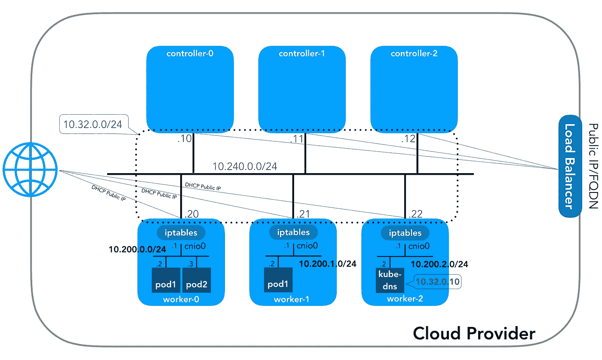
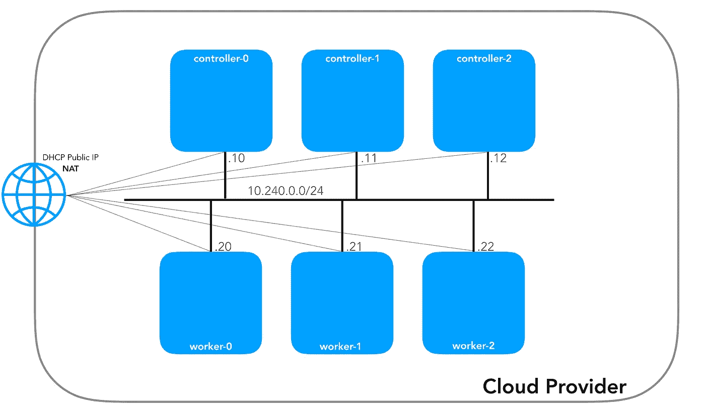
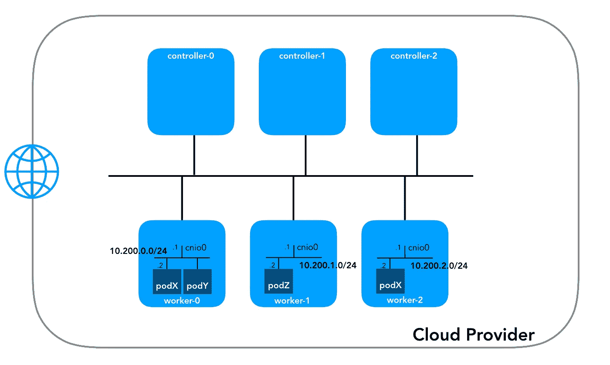
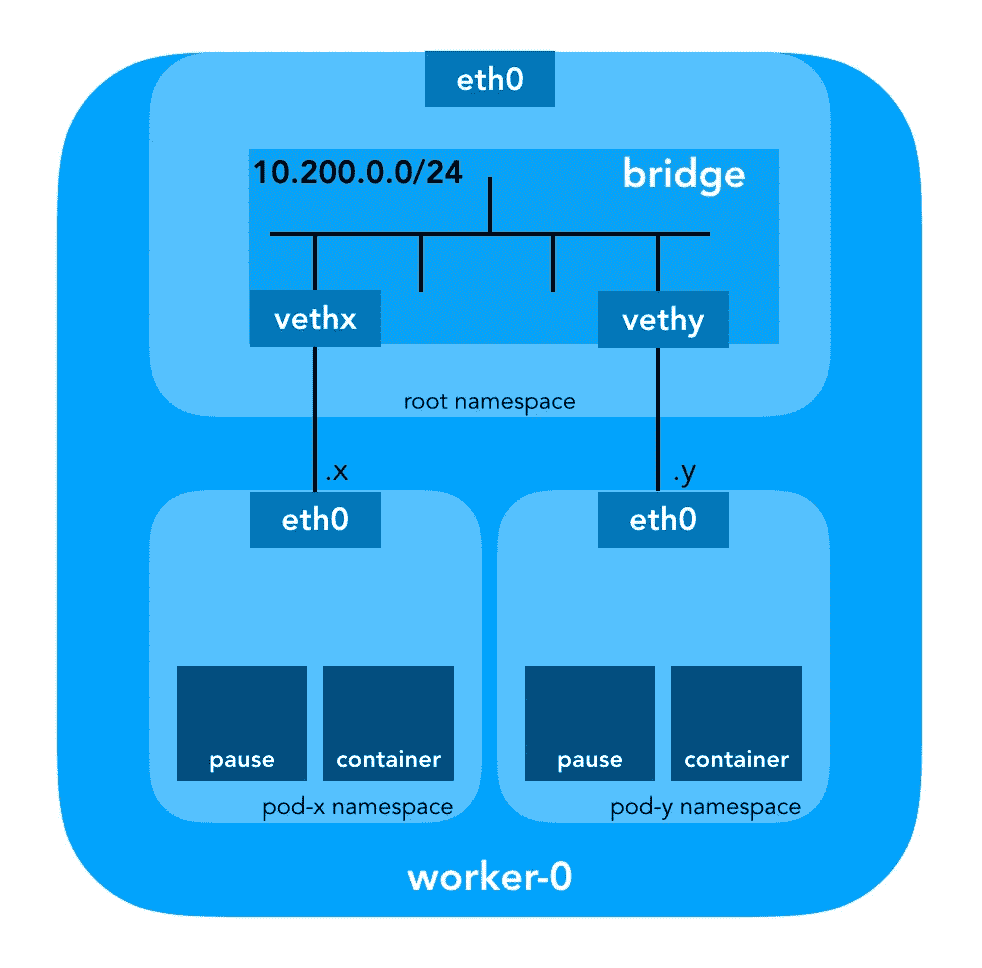
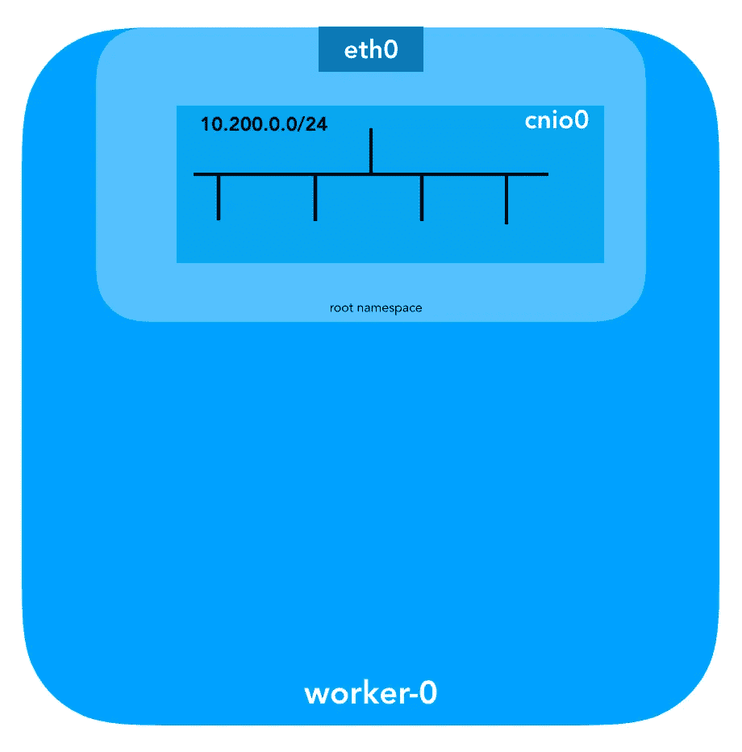
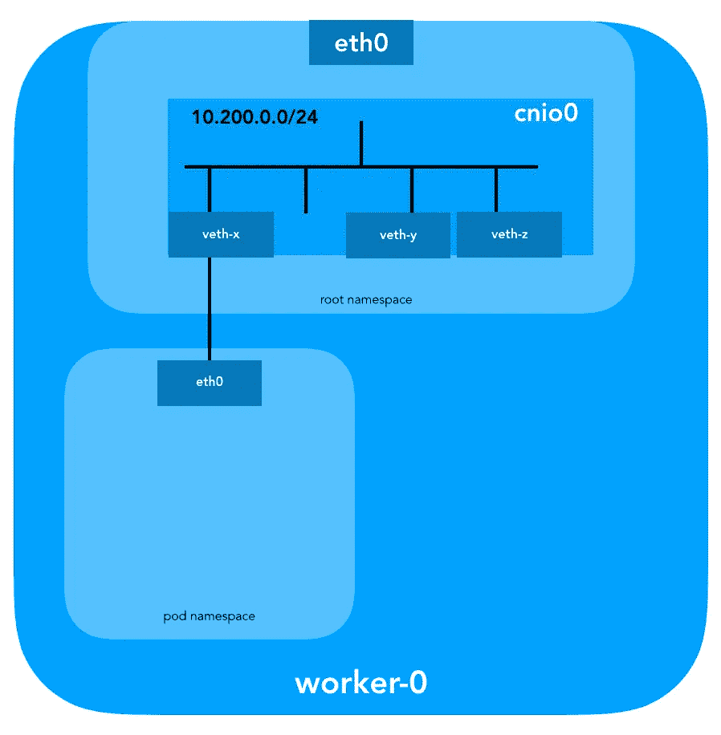
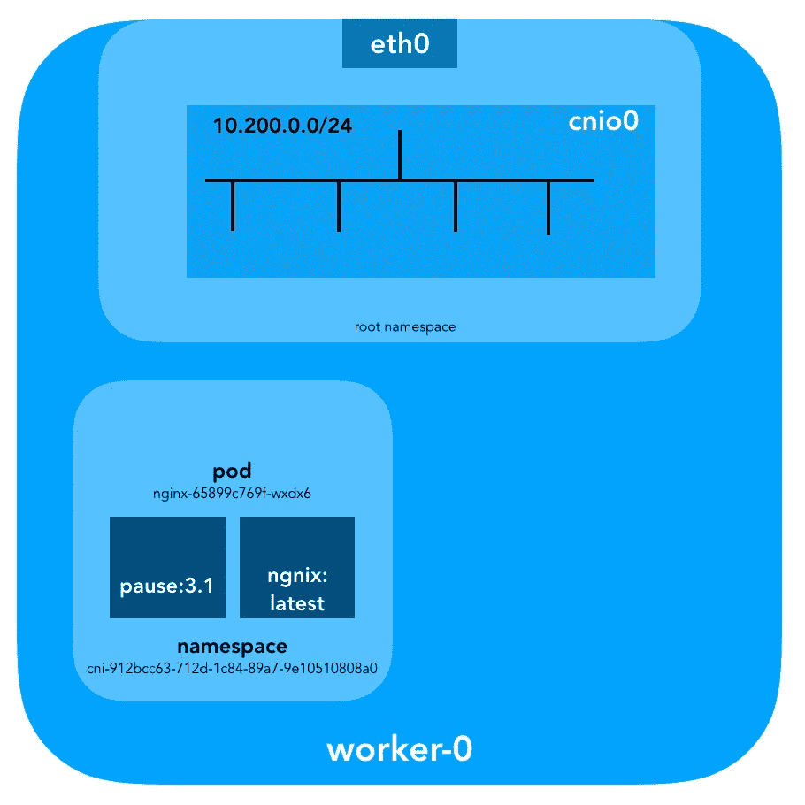
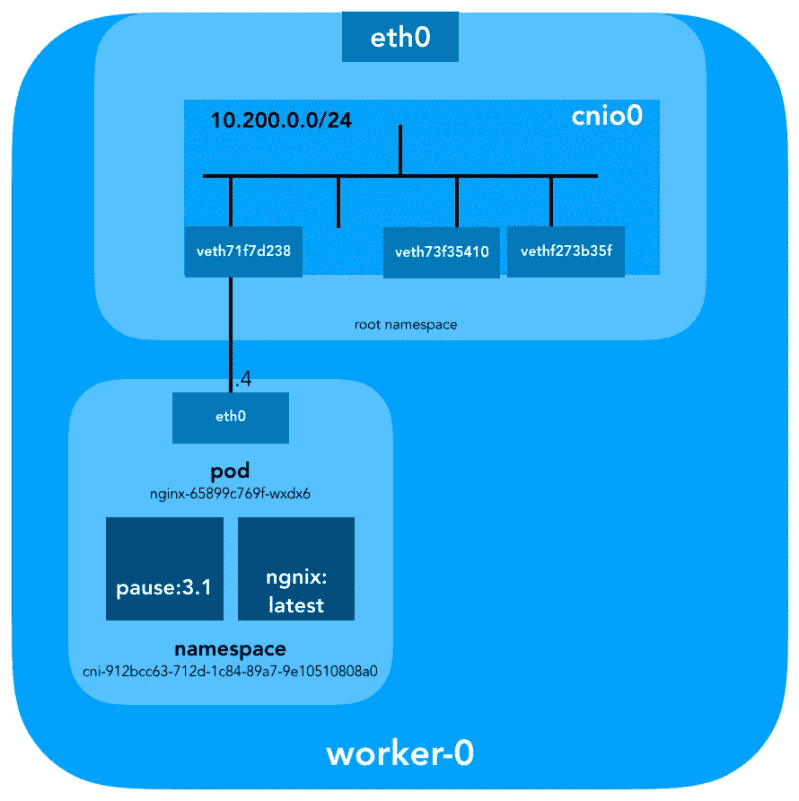
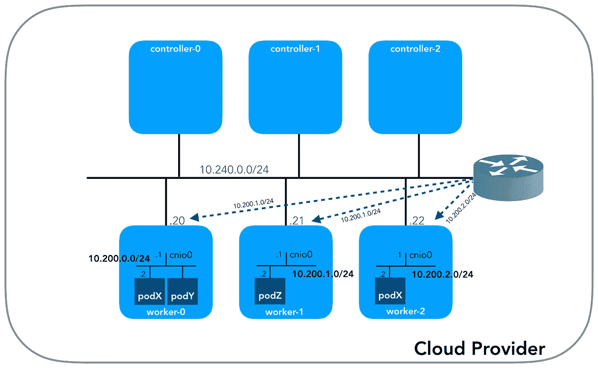

# 库本尼斯网络:幕后

> 原文：<https://itnext.io/kubernetes-networking-behind-the-scenes-39a1ab1792bb?source=collection_archive---------0----------------------->

凯尔西·海托华的《艰难之路》指南中，我最喜欢的一点是——除了它能在 AWS 上运行(T2)之外！)—它保持了网络的干净和简单；例如，这是了解集装箱网络接口( [CNI](https://github.com/containernetworking/cni/blob/master/SPEC.md) )作用的绝佳机会。话虽如此，Kubernetes 的网络并不十分直观，尤其是对于新手来说……不要忘记“[没有容器网络](https://www.youtube.com/watch?v=t98CX8Tberc)”

虽然关于这个主题有很好的资源(链接[在这里](https://github.com/nleiva/kubernetes-networking-links))，但是我找不到一个例子把所有的点和网络工程师喜欢和讨厌的命令输出联系起来，展示幕后实际发生的事情。所以，我决定从许多不同的来源收集这些信息，希望能帮助你更好地理解事物是如何联系在一起的。这不仅对于验证目的很重要，而且对于简化故障诊断也很重要。您可以在自己的 [Kubernetes The Hard Way](https://github.com/kelseyhightower/kubernetes-the-hard-way) 集群中遵循这个示例，因为所有的 IP 寻址和设置都是从该集群中获取的(2018 年 5 月提交，在 [Nabla Containers](https://nabla-containers.github.io/) 之前)。

让我们从头开始；我们有三个控制器和三个工作节点。



您可能会注意到，至少还有三个不同的专用网络子网！。请耐心等待，我们将探索它们。请记住，虽然我们指的是非常特定的 IP 前缀，但这些只是为《艰难之路》指南[Kubernetes](https://github.com/kelseyhightower/kubernetes-the-hard-way)选择的前缀，因此它们具有本地意义，您可以根据您的环境选择任何其他 [RFC 1918](https://tools.ietf.org/html/rfc1918) 地址块。我将为 IPv6 发布一篇单独的博客文章。

# **节点网络(10.240.0.0/24)**

这是内部网络，您的所有节点都是其中的一部分，当[配置计算资源](https://github.com/nleiva/kubernetes-the-hard-way/blob/master/docs/03-compute-resources.md#kubernetes-workers)时，用 [GCP](https://cloud.google.com/sdk/gcloud/reference/compute/instances/create) 中的标志`— private-network-ip`或 [AWS](https://docs.aws.amazon.com/cli/latest/reference/ec2/run-instances.html) 中的选项`— private-ip-address`指定。

**在 GCP 配置控制器节点**

**在 AWS 中配置控制器节点**



每个实例将有两个 IP 地址；一个来自节点网络的私有 IP 地址(控制器:`10.240.0.1${i}/24`，工人:`10.240.0.2${i}/24`)和一个由您的云提供商分配的公共 IP 地址，我们将在稍后到达`NodePorts`时讨论这个问题。

**GCP**

```
$ **gcloud compute instances list**NAME          ZONE        MACHINE_TYPE   PREEMPTIBLE  INTERNAL_IP  EXTERNAL_IP     STATUS
controller-0  us-west1-c  n1-standard-1               10.240.0.10  35.231.XXX.XXX  RUNNING
worker-1      us-west1-c  n1-standard-1               10.240.0.21  35.231.XX.XXX   RUNNING
...
```

**AWS**

```
$ **aws ec2 describe-instances --query 'Reservations[].Instances[].[Tags[?Key==`Name`].Value[],PrivateIpAddress,PublicIpAddress]' --output text | sed '$!N;s/\n/ /'**
10.240.0.10    34.228.XX.XXX controller-0
10.240.0.21    34.173.XXX.XX worker-1
...
```

如果[安全策略是正确的](https://github.com/nleiva/kubernetes-the-hard-way/blob/master/docs/03-compute-resources.md#firewall-rules)(…并且如果 ping 确实安装在主机中)，所有节点应该能够彼此 ping 通。

# **Pod 网络(10.200.0.0/16)**

这是豆荚生活的网络。每个工作节点运行该网络的一个子网。在我们为`worker-${i}`设置的`POD_CIDR=10.200.${i}.0/24`中。



为了理解这是如何设置的，我们需要后退一步，回顾一下 [Kubernetes 网络模型](https://kubernetes.io/docs/concepts/cluster-administration/networking/#kubernetes-model)，它要求:

*   所有容器都可以在没有 NAT 的情况下与所有其它容器通信
*   所有节点都可以在没有 NAT 的情况下与所有容器通信(反之亦然)
*   容器将自己视为的 IP 与其他容器视为的 IP 相同

考虑到可以有多种方式来满足这些，Kubernetes 通常会将网络设置交给一个 [CNI 插件](https://github.com/containernetworking/cni/blob/master/SPEC.md#overview-1)。

> CNI 插件负责将网络接口插入容器**网络名称空间**(例如 **veth 对**的一端)并在主机上进行任何必要的更改(例如将 veth 的另一端连接到网桥)。然后，它应该将 IP 分配给接口，并通过调用适当的 IPAM 插件*设置与 IP 地址管理部分一致的路由。【* [*CNI 插件概述*](https://github.com/containernetworking/cni/blob/master/SPEC.md#cni-plugin)*】*



## 网络命名空间

> 一个**命名空间**将一个全局系统资源封装在一个抽象中，使得命名空间中的进程看起来拥有自己的全局资源的独立实例。对全局资源的改变对于作为名称空间成员的其他进程是可见的，但是对于其他进程是不可见的*。**[*名称空间手册页*](http://man7.org/linux/man-pages/man7/namespaces.7.html)*

**Linux 提供了七种不同的名称空间(`Cgroup`、`IPC`、`Network`、`Mount`、`PID`、`User`和`UTS`)。网络名称空间(`CLONE_NEWNET`)决定了进程可用的网络资源，“*每个网络名称空间都有自己的网络设备、IP 地址、IP 路由表、* `*/proc/net*` *目录、端口号等等*”。[ [操作中的名称空间](https://lwn.net/Articles/531114/)**

## **虚拟以太网(Veth)设备**

> ****虚拟网络(veth)** 设备对提供类似管道的抽象，可用于在网络名称空间之间创建隧道，并可用于创建到另一个名称空间中的物理网络设备的桥。当一个名称空间被释放时，它包含的 veth 设备被销毁。*[*网络名称空间手册页*](http://man7.org/linux/man-pages/man7/network_namespaces.7.html)***

***让我们回到现实，看看这一切是如何应用到我们的集群。首先，Kubernetes 中的[网络插件](https://kubernetes.io/docs/concepts/extend-kubernetes/compute-storage-net/network-plugins/)有几种口味；CNI 插件是其中之一([为什么不是 CNM](https://kubernetes.io/blog/2016/01/why-kubernetes-doesnt-use-libnetwork/) ？).每个节点中的 [Kubelet](https://kubernetes.io/docs/reference/command-line-tools-reference/kubelet/#kubelet) 将告诉容器运行时使用什么[网络插件](https://kubernetes.io/docs/concepts/extend-kubernetes/compute-storage-net/network-plugins/)。容器网络接口( [CNI](https://github.com/containernetworking/cni/blob/master/SPEC.md) )位于容器运行时和网络实现之间。只有 CNI 插件配置网络。***

> ***通过向 Kubelet 传递命令行选项`— network-plugin=cni`来选择 CNI 插件。Kubelet 从`— cni-conf-dir`(默认为`/etc/cni/net.d`)读取一个文件，并使用该文件中的 CNI 配置来设置每个 pod 的网络。[ [网络插件需求](https://kubernetes.io/docs/concepts/extend-kubernetes/compute-storage-net/network-plugins/#network-plugin-requirements)***

***实际的 CNI 插件二进制文件位于`— cni-bin-dir`(默认为`/opt/cni/bin`)***

***注意我们的 [kubelet.service](https://github.com/nleiva/kubernetes-the-hard-way/blob/master/docs/09-bootstrapping-kubernetes-workers.md#configure-the-kubelet) 执行参数包括`network-plugin=cni`。***

```
***[Service]
ExecStart=/usr/local/bin/kubelet \\
  --config=/var/lib/kubelet/kubelet-config.yaml \\
  --**network-plugin=cni** \\
  ...***
```

***在调用任何插件之前，Kubernetes 首先为 pod 创建网络名称空间。这是通过创建一个`pause`容器来完成的，该容器“*充当 pod* 中所有容器的“父容器””[ [全能暂停容器](https://www.ianlewis.org/en/almighty-pause-container) ]。Kubernetes 然后调用 CNI 插件将`pause`容器加入网络。pod 中的所有容器都使用`pause`网络名称空间(`netns`)。***

```
***{
    "cniVersion": "0.3.1",
    "name": "bridge",
    "**type**": "**bridge**",
    "bridge": "**cnio0**",
    "isGateway": true,
    "ipMasq": true,
    "**ipam**": {
        "type": "**host-local**",
        "ranges": [
          [{"subnet": "${POD_CIDR}"}]
        ],
        "routes": [{"dst": "0.0.0.0/0"}]
    }
}***
```

***我们的 [CNI 配置](https://github.com/nleiva/kubernetes-the-hard-way/blob/master/docs/09-bootstrapping-kubernetes-workers.md#configure-cni-networking)指示我们使用`bridge`插件在根名称空间中配置一个名为`cnio0`([默认名称是 cni0](https://github.com/containernetworking/plugins/blob/v0.6.0/plugins/main/bridge/bridge.go#L38) )的 L2 Linux 软件桥，作为网关(`“isGateway”: true`)。***

******

***它还将[设置一个 veth 对](https://github.com/containernetworking/plugins/blob/v0.6.0/plugins/main/bridge/bridge.go#L335)将 pod 连接到刚刚创建的桥上。***

******

***为了分配 L3 信息，例如 IP 地址，调用 IPAM 插件(`ipam`)。在这种情况下，类型是`host-local`“*将状态本地存储在主机文件系统上，从而确保单个主机上 IP 地址的唯一性*”[[主机本地插件](https://github.com/containernetworking/plugins/tree/master/plugins/ipam/host-local#overview) ]。IPAM 插件将该信息返回给前一个插件(`bridge`)，因此可以配置配置中提供的任何路由(`“routes”: [{“dst”: “0.0.0.0/0”}]`)。如果没有提供`gw`，它将从子网派生[。在指向网桥的 pod 网络命名空间中也配置了默认路由(使用 pod 子网的第一个 IP 进行配置)。](https://github.com/containernetworking/plugins/blob/v0.6.0/pkg/ipam/ipam.go#L83-L89)***

***最后但同样重要的是，我们还请求伪装(`“ipMasq”: true`)来自 pod 网络的流量。我们在这里并不真的需要 NAT，但这是 Kubernetes 中的配置。因此，为了完整起见，我应该提到为这个特殊例子配置的`bridge`插件`iptables`中的条目；来自目的地不在范围`224.0.0.0/4` [内的 pod 的所有数据包都将被 NAT](https://github.com/containernetworking/plugins/blob/v0.6.0/pkg/ip/ipmasq.go#L26-L74)，这在某种程度上与“*所有容器无需 NAT 即可与所有其他容器通信*”不一致。嗯，我们会证明你不需要 NAT 简而言之。***

## ***Pod 路由***

***我们现在准备配置 pod。我们将查看一个 worker 节点中的所有网络名称空间，并在创建一个`nginx`部署后分析其中一个名称空间，如这里的[所述](https://github.com/kelseyhightower/kubernetes-the-hard-way/blob/master/docs/13-smoke-test.md#deployments)。我们将使用带有选项`-t`的`lsns` 来选择名称空间的类型(`net`)。***

```
***ubuntu@**worker-0**:~$ **sudo lsns -t net**
        NS TYPE NPROCS   PID USER COMMAND
4026532089 net     113     1 root /sbin/init
4026532280 net       2  8046 root /pause
4026532352 net       4 16455 root /pause
**4026532426** net       3 27255 root /**pause*****
```

***我们可以通过`ls`中的`-i`选项找出这些的`inode`号。***

```
***ubuntu@**worker-0**:~$ **ls -1i /var/run/netns**
4026532352 cni-1d85bb0c-7c61-fd9f-2adc-f6e98f7a58af
4026532280 cni-7cec0838-f50c-416a-3b45-628a4237c55c
**4026532426** **cni-912bcc63-712d-1c84-89a7-9e10510808a0*****
```

***也可以选择用`ip netns`列出所有的网络名称空间。***

```
***ubuntu@**worker-0**:~$ **ip netns**
**cni-912bcc63-712d-1c84-89a7-9e10510808a0** (id: 2)
cni-1d85bb0c-7c61-fd9f-2adc-f6e98f7a58af (id: 1)
cni-7cec0838-f50c-416a-3b45-628a4237c55c (id: 0)***
```

***为了查看在网络名称空间`cni-912bcc63–712d-1c84–89a7–9e10510808a0` ( `4026532426`)中运行的所有进程，您可以这样做:***

```
***ubuntu@**worker-0**:~$ **sudo ls -l /proc/[1-9]*/ns/net | grep 4026532426  | cut -f3 -d"/" | xargs ps -p**
  PID TTY      STAT   TIME COMMAND
**27255** ?        Ss     0:00 /**pause**
27331 ?        Ss     0:00 nginx: master process nginx -g daemon off;
27355 ?        S      0:00 nginx: worker process***
```

***这表明我们正在 pod 中运行`nginx`和`pause`。pod 中的`pause`容器和其余容器共享`net`和`ipc`名称空间。让我们将`pause` PID `27255`放在手边。***

***现在让我们看看`kubectl`能告诉我们关于这个吊舱的什么:***

```
***$ **kubectl get pods -o wide | grep nginx**
**nginx-65899c769f-wxdx6**   1/1       Running   0          5d        **10.200.0.4**   worker-0***
```

***更多细节:***

```
***$ **kubectl describe pods nginx-65899c769f-wxdx6**
Name:           nginx-65899c769f-wxdx6
Namespace:      default
Node:           worker-0/10.240.0.20
Start Time:     Thu, 05 Jul 2018 14:20:06 -0400
Labels:         pod-template-hash=2145573259
                run=nginx
Annotations:    <none>
Status:         Running
IP:             **10.200.0.4**
Controlled By:  ReplicaSet/nginx-65899c769f
Containers:
  nginx:
    Container ID:   containerd://**4c0bd2e2e5c0b17c637af83376879c38f2fb11852921b12413c54ba49d6983c7**
    Image:          nginx
...***
```

***我们有 pod 名称`nginx-65899c769f-wxdx6` 和其中一个容器的 ID(`ngnix`)，但是没有关于`pause`的任何信息。是时候深入挖掘 worker 节点来连接所有的点了。请记住 [Kubernetes 艰难地发现](https://github.com/kelseyhightower/kubernetes-the-hard-way)不使用 [Docker](https://www.docker.com/) ，因此我们将使用 [Containerd](https://github.com/containerd/containerd) CLI `ctr`来探索容器细节。***

```
***ubuntu@**worker-0**:~$ **sudo ctr namespaces ls**
NAME   LABELS
**k8s.i**o***
```

***使用[容器 ID](https://github.com/containerd/containerd)名称空间(`k8s.io`，我们可以获得`ngnix`的容器 ID:***

```
***ubuntu@**worker-0**:~$ **sudo ctr -n k8s.io containers ls | grep nginx**
**4c0bd2e2e5c0b17c637af83376879c38f2fb11852921b12413c54ba49d6983c7**    docker.io/library/**nginx**:latest                                 io.containerd.runtime.v1.linux***
```

***并暂停:***

```
***ubuntu@**worker-0**:~$ **sudo ctr -n k8s.io containers ls | grep pause**
0866803b612f2f55e7b6b83836bde09bd6530246239b7bde1e49c04c7038e43a    k8s.gcr.io/pause:3.1                                           io.containerd.runtime.v1.linux
21640aea0210b320fd637c22ff93b7e21473178de0073b05de83f3b116fc8834    k8s.gcr.io/pause:3.1                                           io.containerd.runtime.v1.linux
**d19b1b1c92f7cc90764d4f385e8935d121bca66ba8982bae65baff1bc2841da6**    k8s.gcr.io/**pause**:3.1                                           io.containerd.runtime.v1.linux***
```

***以`983c7`结尾的`ngnix`的容器 ID 与我们用`kubectl`得到的相匹配。让我们看看能否找出哪个`pause`容器属于`nginx`容器。***

```
***ubuntu@**worker-0**:~$ **sudo ctr -n k8s.io task ls**
TASK                                                                PID      STATUS
...
**d19b1b1c92f7cc90764d4f385e8935d121bca66ba8982bae65baff1bc2841da6**    27255    RUNNING
4c0bd2e2e5c0b17c637af83376879c38f2fb11852921b12413c54ba49d6983c7    27331    RUNNING***
```

***您还记得在网络名称空间`cni-912bcc63–712d-1c84–89a7–9e10510808a0`中运行的 PID`27331`和`27355`吗？***

```
***ubuntu@**worker-0**:~$ **sudo ctr -n k8s.io containers info d19b1b1c92f7cc90764d4f385e8935d121bca66ba8982bae65baff1bc2841da6**
{
    "ID": "**d19b1b1c92f7cc90764d4f385e8935d121bca66ba8982bae65baff1bc2841da6**",
    "Labels": {
        "io.cri-containerd.kind": "sandbox",
        "io.kubernetes.pod.name": "**nginx-65899c769f-wxdx6**",
        "io.kubernetes.pod.namespace": "default",
        "io.kubernetes.pod.uid": "0b35e956-8080-11e8-8aa9-0a12b8818382",
        "pod-template-hash": "2145573259",
        "run": "nginx"
    },
    "Image": "k8s.gcr.io/**pause**:3.1",
...***
```

***和***

```
***ubuntu@worker-0:~$ **sudo ctr -n k8s.io containers info 4c0bd2e2e5c0b17c637af83376879c38f2fb11852921b12413c54ba49d6983c7**
{
    "ID": "**4c0bd2e2e5c0b17c637af83376879c38f2fb11852921b12413c54ba49d6983c7**",
    "Labels": {
        "io.cri-containerd.kind": "container",
        "io.kubernetes.container.name": "nginx",
        "io.kubernetes.pod.name": "**nginx-65899c769f-wxdx6**",
        "io.kubernetes.pod.namespace": "default",
        "io.kubernetes.pod.uid": "0b35e956-8080-11e8-8aa9-0a12b8818382"
    },
    "Image": "docker.io/library/**nginx**:latest",
...***
```

***我们现在确切地知道哪些容器正在这个 pod ( `nginx-65899c769f-wxdx6`)和网络名称空间(`cni-912bcc63–712d-1c84–89a7–9e10510808a0`)中运行:***

*   ***nginx (ID: `4c0bd2e2e5c0b17c637af83376879c38f2fb11852921b12413c54ba49d6983c7`)***
*   ***暂停(ID: `d19b1b1c92f7cc90764d4f385e8935d121bca66ba8982bae65baff1bc2841da6`)***

******

***那么，这个 pod ( `nginx-65899c769f-wxdx6`)实际上是如何连接网络的呢？。让我们用之前得到的`pause` PID `27255`在它的网络名称空间(`cni-912bcc63–712d-1c84–89a7–9e10510808a0`)中运行命令。***

```
***ubuntu@**worker-0**:~$ **sudo ip netns identify 27255**
**cni-912bcc63-712d-1c84-89a7-9e10510808a0*****
```

***为此，我们将使用`nsenter`和选项`-t`来指定目标 pid，并提供不带文件的`-n`，以便输入目标进程的网络名称空间(`27255`)。让我们看看`ip link show`，***

```
***ubuntu@**worker-0**:~$ **sudo nsenter -t 27255 -n ip link show**
1: lo: <LOOPBACK,UP,LOWER_UP> mtu 65536 qdisc noqueue state UNKNOWN mode DEFAULT group default qlen 1000
    link/loopback 00:00:00:00:00:00 brd 00:00:00:00:00:00
3: **eth0**@if7: <BROADCAST,MULTICAST,UP,LOWER_UP> mtu 1500 qdisc noqueue state UP mode DEFAULT group default
    link/ether 0a:58:0a:c8:00:04 brd ff:ff:ff:ff:ff:ff link-netnsid 0***
```

***并且`ifconfig eth0`说:***

```
***ubuntu@**worker-0**:~$ **sudo nsenter -t 27255 -n ifconfig eth0**
**eth0**: flags=4163<UP,BROADCAST,RUNNING,MULTICAST>  mtu 1500
        inet **10.200.0.4**  netmask 255.255.255.0  broadcast 0.0.0.0
        inet6 fe80::2097:51ff:fe39:ec21  prefixlen 64  scopeid 0x20<link>
        ether 0a:58:0a:c8:00:04  txqueuelen 0  (Ethernet)
        RX packets 540  bytes 42247 (42.2 KB)
        RX errors 0  dropped 0  overruns 0  frame 0
        TX packets 177  bytes 16530 (16.5 KB)
        TX errors 0  dropped 0 overruns 0  carrier 0  collisions 0***
```

***我们确认之前从`kubectl get pod`获得的 IP 地址配置在 pod 的`eth0`接口上。该接口是 **veth 对**的一部分；一端在 pod 中，另一端在根命名空间中。为了找出另一端是什么接口，我们使用`ethtool`。***

```
***ubuntu@**worker-0**:~$ **sudo ip netns exec cni-912bcc63-712d-1c84-89a7-9e10510808a0 ethtool -S eth0**
NIC statistics:
     peer_ifindex: **7*****
```

***这告诉我们对等体`ifindex`是 7。我们现在可以检查根名称空间中的内容。我们可以用`ip link`做到这一点:***

```
***ubuntu@**worker-0**:~$ **ip link | grep '^7:'**
7: **veth71f7d238**@if3: <BROADCAST,MULTICAST,UP,LOWER_UP> mtu 1500 qdisc noqueue master cnio0 state UP mode DEFAULT group default***
```

***要复查，请参阅:***

```
***ubuntu@**worker-0**:~$ **sudo cat /sys/class/net/veth71f7d238/ifindex**
7***
```

***酷，虚拟链接现在清楚了。我们可以用`brctl`看看还有什么连接到我们的 Linux 桥:***

```
***ubuntu@**worker-0**:~$ **brctl show cnio0**
bridge name    bridge id        STP enabled    interfaces
cnio0        8000.0a580ac80001    no        veth71f7d238
                                            veth73f35410
                                            vethf273b35f***
```

***所以我们有这个:***

******

## ***验证路由***

***我们实际上是如何转发流量的？。让我们来看看 pod 的网络命名空间中的路由表:***

```
***ubuntu@**worker-0**:~$ **sudo ip netns exec cni-912bcc63-712d-1c84-89a7-9e10510808a0 ip route show**
**default via 10.200.0.1** dev eth0
10.200.0.0/24 dev eth0 proto kernel scope link src 10.200.0.4***
```

***因此，我们至少知道如何到达根名称空间(`default via 10.200.0.1`)。现在让我们检查主机的路由表:***

```
***ubuntu@**worker-0**:~$ **ip route list**
**default via 10.240.0.1** dev eth0 proto dhcp src 10.240.0.20 metric 100
10.200.0.0/24 dev cnio0 proto kernel scope link src 10.200.0.1
10.240.0.0/24 dev eth0 proto kernel scope link src 10.240.0.20
10.240.0.1 dev eth0 proto dhcp scope link src 10.240.0.20 metric 100***
```

***我们知道如何将数据包转发到 VPC 路由器([您的 VPC 有一个隐式路由器](https://docs.aws.amazon.com/AmazonVPC/latest/UserGuide/VPC_Route_Tables.html#RouteTables)、[，它通常具有子网](https://cloud.google.com/vpc/docs/vpc#reserved_ip_addresses_in_every_subnet)的主 IP 范围内的第二个地址)。现在，VPC 路由器知道如何到达每个 pod 网络吗？；不，它不会，所以你会期望 CNI 插件在那里安装路径，或者你只是手动(如指南中所示)。还没有检查，但是 [AWS CNI 插件](https://github.com/aws/amazon-vpc-cni-k8s)可能会在 AWS 中为我们处理这个问题。记住有大量的 [CNI 插件存在](https://kubernetes.io/docs/concepts/cluster-administration/networking/#how-to-implement-the-kubernetes-networking-model)，这个例子代表了**最简单的网络设置**。***

******

## ***NAT 深潜***

***让我们使用`kubectl create -f busybox.yaml`创建两个相同的带有复制控制器的`busybox`容器。***

***我们得到:***

```
***$ **kubectl get pods -o wide**
NAME                     READY     STATUS        RESTARTS   AGE       IP            NODE
busybox0-g6pww           1/1       Running       0          4s        **10.200.1.15**   worker-1
**busybox0-rw89s**           1/1       Running       0          4s        10.200.0.21   worker-0
...***
```

***从一个容器 Pings 另一个容器应该是成功的:***

```
***$ **kubectl exec -it busybox0-rw89s -- ping -c 2 10.200.1.15**
PING 10.200.1.15 (10.200.1.15): 56 data bytes
64 bytes from 10.200.1.15: seq=0 ttl=62 time=0.528 ms
64 bytes from 10.200.1.15: seq=1 ttl=62 time=0.440 ms--- 10.200.1.15 ping statistics ---
2 packets transmitted, 2 packets received, 0% packet loss
round-trip min/avg/max = 0.440/0.484/0.528 ms***
```

***要了解流量，您可以使用`tcpdump`或`conntrack`来捕获数据包。***

```
***ubuntu@**worker-0**:~$ **sudo conntrack -L | grep 10.200.1.15**
icmp     1 29 **src=10.200.0.21** dst=10.200.1.15 type=8 code=0 id=1280 src=10.200.1.15 **dst=10.240.0.20** type=0 code=0 id=1280 mark=0 use=1***
```

***pod 的源 IP 地址`10.200.0.21`被转换为节点 IP `10.240.0.20`。***

```
***ubuntu@**worker-1**:~$ **sudo conntrack -L | grep 10.200.1.15**
icmp     1 28 **src=10.240.0.20** dst=10.200.1.15 type=8 code=0 id=1280 src=10.200.1.15 **dst=10.240.0.20** type=0 code=0 id=1280 mark=0 use=1***
```

***您可以看到计数器在`iptables`中增加，如下所示:***

```
***ubuntu@**worker-0**:~$ **sudo iptables -t nat -Z POSTROUTING -L -v**
Chain POSTROUTING (policy ACCEPT 0 packets, 0 bytes)
 pkts bytes target     prot opt in     out     source               destination
...
    **5**   324 CNI-be726a77f15ea47ff32947a3  all  --  any    any     10.200.0.0/24        anywhere             /* name: "bridge" id: "631cab5de5565cc432a3beca0e2aece0cef9285482b11f3eb0b46c134e457854" */
Zeroing chain `POSTROUTING'***
```

***另一方面，如果我们从 CNI 插件配置中删除了`“ipMasq”: true`，我们会看到以下内容(我们不建议在运行的集群上更改此配置，这只是出于教育目的):***

```
***$ **kubectl get pods -o wide**
NAME                     READY     STATUS        RESTARTS   AGE       IP            NODE
**busybox0-2btxn**           1/1       Running       0          16s       10.200.0.15   worker-0
busybox0-dhpx8           1/1       Running       0          16s       **10.200.1.13**   worker-1
...***
```

***Ping 应该还管用:***

```
***$  **kubectl exec -it busybox0-2btxn -- ping -c 2 10.200.1.13**
PING 10.200.1.6 (10.200.1.6): 56 data bytes
64 bytes from 10.200.1.6: seq=0 ttl=62 time=0.515 ms
64 bytes from 10.200.1.6: seq=1 ttl=62 time=0.427 ms--- 10.200.1.6 ping statistics ---
2 packets transmitted, 2 packets received, 0% packet loss
round-trip min/avg/max = 0.427/0.471/0.515 ms***
```

***在没有 NAT 的情况下:***

```
***ubuntu@**worker-0**:~$ **sudo conntrack -L | grep 10.200.1.13**
icmp     1 29 **src=10.200.0.15** dst=10.200.1.13 type=8 code=0 id=1792 src=10.200.1.13 **dst=10.200.0.15** type=0 code=0 id=1792 mark=0 use=1***
```

***因此，我们刚刚验证了“所有容器都可以在没有 NAT 的情况下与所有其他容器进行通信”。***

```
***ubuntu@**worker-1**:~$ **sudo conntrack -L | grep 10.200.1.13**
icmp     1 27 **src=10.200.0.15** dst=10.200.1.13 type=8 code=0 id=1792 src=10.200.1.13 **dst=10.200.0.15** type=0 code=0 id=1792 mark=0 use=1***
```

# *****集群网络(10.32.0.0/24)*****

***你可能注意到在`busybox`的例子中，分配给`busybox` pod 的 IP 地址在每种情况下都是不同的。如果我们想让这些容器可用，这样其他的豆荚就可以到达呢？。你可以获取他们当前的 pod IP 地址，但这些最终会改变。因此，您希望配置一个服务资源，将请求代理到一组临时 pod。***

> ***“Kubernetes 中的服务是一种抽象，它定义了一组逻辑单元和访问它们的策略” *[* [*Kubernetes 服务*](https://kubernetes.io/docs/tutorials/kubernetes-basics/expose/expose-intro/) *]****

**公开服务有不同的方式；默认类型是`ClusterIP`，它将在集群 CIDR 之外设置一个 IP 地址(只能从集群内部访问)。一个例子是在 Kubernetes 中配置的 [DNS 集群插件。](https://github.com/kelseyhightower/kubernetes-the-hard-way)**

**`kubectl`显示服务跟踪端点，它会为你做翻译。**

```
**$ **kubectl -n kube-system describe services**
...
Selector:          k8s-app=kube-dns
Type:              **ClusterIP**
**IP:                10.32.0.10**
Port:              dns  53/UDP
TargetPort:        53/UDP
**Endpoints:         10.200.0.27:53**
Port:              dns-tcp  53/TCP
TargetPort:        53/TCP
Endpoints:         10.200.0.27:53
...**
```

**具体怎么做？… `iptables`又来了。让我们看一下为这个例子创建的规则。您可以使用`iptables-save`命令将它们全部列出。**

**由于数据包是由一个进程产生的(`OUTPUT`)或刚刚到达网络接口(`PREROUTING`)，它们由以下`iptables`链检查:**

```
**-A **PREROUTING** -m comment --comment "kubernetes service portals" -j **KUBE-SERVICES**
-A **OUTPUT** -m comment --comment "kubernetes service portals" -j **KUBE-SERVICES****
```

**以下目标匹配目的地为`10.32.0.10`端口`53`的`TCP`数据包，并将目的地址转换为`10.200.0.27`端口`53`。**

```
**-A **KUBE-SERVICES** **-d 10.32.0.10/32** **-p tcp** -m comment --comment "kube-system/kube-dns:dns-tcp cluster IP" -m tcp **--dport 53** -j **KUBE-SVC-ERIFXISQEP7F7OF4**
-A **KUBE-SVC-ERIFXISQEP7F7OF4** -m comment --comment "kube-system/kube-dns:dns-tcp" -j **KUBE-SEP-32LPCMGYG6ODGN3H**
-A **KUBE-SEP-32LPCMGYG6ODGN3H** -p tcp -m comment --comment "kube-system/kube-dns:dns-tcp" -m tcp **-j DNAT** **--to-destination 10.200.0.27:53****
```

**以下目标匹配目的地为`10.32.0.10`端口`53`的`UDP`数据包，并将目的地地址转换为`10.200.0.27`端口`53`。**

```
**-A **KUBE-SERVICES** **-d 10.32.0.10/32** **-p udp** -m comment --comment "kube-system/kube-dns:dns cluster IP" -m udp **--dport 53** -j **KUBE-SVC-TCOU7JCQXEZGVUNU**
-A **KUBE-SVC-TCOU7JCQXEZGVUNU** -m comment --comment "kube-system/kube-dns:dns" -j **KUBE-SEP-LRUTK6XRXU43VLIG**
-A **KUBE-SEP-LRUTK6XRXU43VLIG** -p udp -m comment --comment "kube-system/kube-dns:dns" -m udp **-j DNAT --to-destination 10.200.0.27:53****
```

**Kubernetes 还有其他类型的服务；`NodePort`特别是在[中也有涉及](https://github.com/kelseyhightower/kubernetes-the-hard-way)的敬酒不吃吃罚酒。参见[烟雾测试:服务](https://github.com/kelseyhightower/kubernetes-the-hard-way/blob/master/docs/13-smoke-test.md#services)。**

```
**kubectl expose deployment nginx --port 80 --type NodePort**
```

**`NodePort`在一个静态端口公开每个节点 IP 上的服务(即`NodePort`)。您可以从集群外部访问`NodePort`服务。您可以检查用`kubectl`(本例中为`31088`)分配的端口。**

```
**$ **kubectl describe services nginx**
...
Type:                     NodePort
**IP:                       10.32.0.53**
Port:                     <unset>  80/TCP
TargetPort:               80/TCP
**NodePort**:                 <unset>  **31088**/TCP
**Endpoints:                10.200.1.18:80**
...**
```

**现在可以在`[http://${EXTERNAL_IP}:31088/](http://${EXTERNAL_IP}:31088/.)`从互联网访问 pod。其中`EXTERNAL_IP`是**您的任何工作实例**的公共 IP 地址。在这个例子中，我使用了 **worker-0** 的公共 IP 地址。在具有私有 IP 的节点`10.240.0.20`中接收请求(云提供商处理面向公共的 NAT)，但是服务实际上在另一个节点中运行( **worker-1** ，您可以通过端点的 IP 地址`10.200.**1**.18`来判断)**

```
**ubuntu@**worker-0**:~$ **sudo conntrack -L | grep 31088**
tcp      6 86397 ESTABLISHED src=173.38.XXX.XXX dst=10.240.0.20 sport=30303 dport=31088 src=10.200.1.18 dst=10.240.0.20 sport=80 dport=30303 [ASSURED] mark=0 use=1**
```

**因此数据包从 **worker-0** 转发到 **worker-1** 到达目的地。**

```
**ubuntu@**worker-1**:~$ **sudo conntrack -L | grep 80**
tcp      6 86392 ESTABLISHED src=10.240.0.20 dst=10.200.1.18 sport=14802 dport=80 src=10.200.1.18 dst=10.240.0.20 sport=80 dport=14802 [ASSURED] mark=0 use=1**
```

**理想吗？。可能不会，但很管用。在这种情况下编程的`iptables`规则是:**

```
**-A KUBE-NODEPORTS -p tcp -m comment --comment "default/nginx:" -m tcp **--dport 31088** -j **KUBE-SVC-4N57TFCL4MD7ZTDA**
-A **KUBE-SVC-4N57TFCL4MD7ZTDA** -m comment --comment "default/nginx:" -j **KUBE-SEP-UGTFMET44DQG7H7H**
-A **KUBE-SEP-UGTFMET44DQG7H7H** -p tcp -m comment --comment "default/nginx:" -m tcp -j **DNAT --to-destination 10.200.1.18:80****
```

**换句话说，目的端口为`31088`的数据包的目的地址被转换为`10.200.1.18`。端口也从`31088`翻译成`80`。**

**我们没有讨论使用云提供商的负载均衡器对外公开服务的服务类型`LoadBalancer`，因为这篇文章已经够长了。**

# **结论**

**虽然这看起来很多，但我们只是触及了表面。我计划接下来介绍 IPv6、IPVS、eBPF 和一些有趣的 CNI 插件。**

**我希望这已经提供了信息。请让我知道，如果你认为我得到了一些错误或任何打字错误。**

**延伸阅读:**

*   **[Kubernetes 简化了多集群网络](/kubernetes-multi-cluster-networking-made-simple-c8f26827813?source=friends_link&sk=5cc1662ff502213d67aa49ab35ccf0c9)**
*   **[如何在 AWS 上运行支持 IPv6 的 Docker 容器](https://medium.com/@nleiva/how-to-run-ipv6-enabled-docker-containers-on-aws-87e090ab0397?source=friends_link&sk=126bd9850d2fc46a2ff99bee89c735ca)**
*   **[我们需要 IPv6 的三个原因…在 Kubernetes](https://nleiva.medium.com/three-reasons-we-need-ipv6-in-kubernetes-69b6f3cbadb7)**