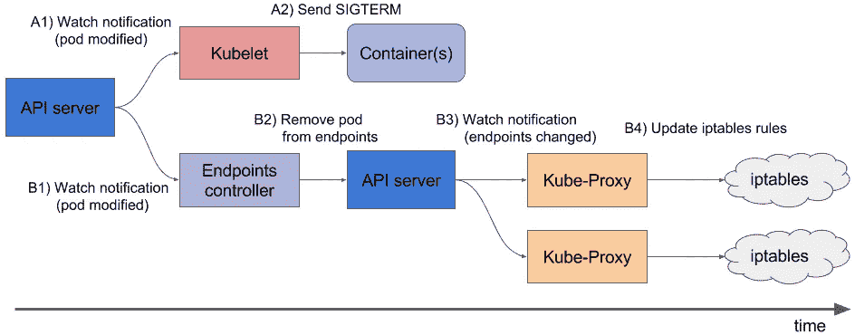
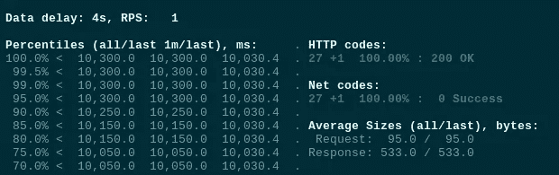
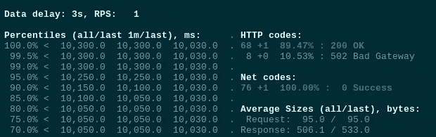
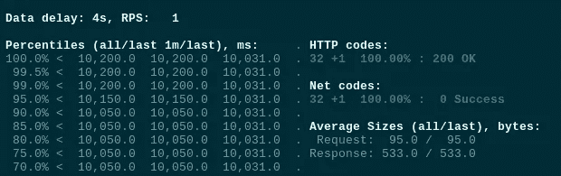
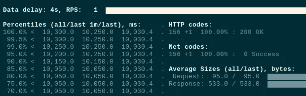
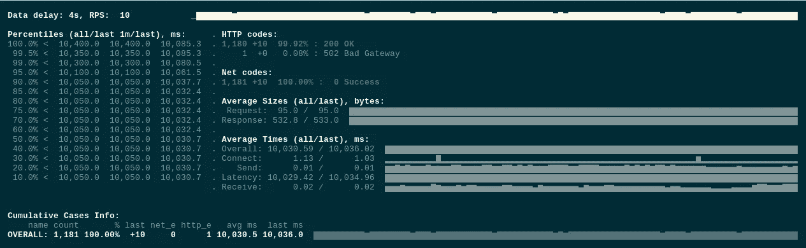

# Kubernetes: NGINX/PHP-FPM 正常关机和 502 错误

> 原文：<https://itnext.io/kubernetes-nginx-php-fpm-graceful-shutdown-and-502-errors-b2878cc3df5d?source=collection_archive---------2----------------------->


我们有一个 PHP 应用程序在带有两个专用容器的 pods 中与 Kubernetes 一起运行——NGINXиPHP-FPM。

问题是在缩减过程中，客户端得到 502 个错误。例如，当 pod 停止时，其容器不能正确关闭现有连接。

因此，在这篇文章中，我们将更仔细地看看 pods 的一般终止过程，特别是 NGINX 和 PHP-FPM 容器。

由 [Yandex 对 AWS Elastic Kubernetes 服务进行测试。坦克](https://rtfm.co.ua/en/yandex-tank-load-testing-tool-an-overview-configuration-and-examples/)实用。

入口资源将使用 [AWS ALB 入口控制器](https://rtfm.co.ua/en/aws-elastic-kubernetes-service-running-alb-ingress-controller/)创建一个 AWS 应用负载平衡器。

испольузется·道克尔。

# Pod 生命周期 Pod 的终止

因此，让我们来概述一下 pod 的停止和终止过程。

基本上，pod 是在 Kubernetes WorkerNode 上运行的一组进程，它们由标准 IPC ( [*进程间通信*](https://en.wikipedia.org/wiki/Inter-process_communication) ) [信号](https://en.wikipedia.org/wiki/Signal_(IPC))停止。

为了赋予 pod 完成其所有操作的能力，[容器运行时](https://kubernetes.io/docs/setup/production-environment/container-runtimes/)首先通过向该 pod 的每个容器中的 PID 1 发送`SIGTERM`信号来软停止它(*正常关闭*)(参见[停靠站停止](https://docs.docker.com/engine/reference/commandline/stop/))。此外，在通过发送一个`SIGKILL`信号强制杀死这个 pod 之前，一个集群开始计算一个*宽限期*。

可以通过在用于旋转容器的图像中使用`[STOPSIGNAL](https://docs.docker.com/engine/reference/builder/#stopsignal)`来覆盖`SIGTERM`。

因此，删除 pod 的整个流程是(实际上，下面的部分是对[官方文档](https://kubernetes.io/docs/concepts/workloads/pods/pod-lifecycle/#pod-termination)的一种复制):

1.  用户发出`kubectl delete pod`或`kubectl scale deployment`命令，触发流程和宽限期的集群开始倒计时，默认值设置为 30 秒
2.  集群的 API 服务器更新 pod 的状态—从*运行*状态，变为*终止*(参见[容器状态](https://kubernetes.io/docs/concepts/workloads/pods/pod-lifecycle/#container-states))。运行此 pod 的工作节点上的`kubelet`接收此状态更新并启动 pod 的终止过程:
3.  如果 pod 中的容器有一个`[preStop](https://kubernetes.io/docs/concepts/containers/container-lifecycle-hooks/#container-hooks)` [挂钩](https://kubernetes.io/docs/concepts/containers/container-lifecycle-hooks/#container-hooks) - `kubelet`将运行它。如果钩子仍然在默认的 30 秒宽限期内运行，那么将增加 2 秒。可以用`[terminationGracePeriodSeconds](https://kubernetes.io/docs/concepts/containers/container-lifecycle-hooks/#hook-handler-execution)`设置宽限期
4.  当一个`preStop`钩子完成时，一个`kubelet`将向 Docker 运行时发送通知，停止与 pod 相关的容器。Docker 守护进程将发送`SIGTERM`信号给每个容器中 PID 为 1 的进程。集装箱将以随机的顺序接收信号。
5.  **在**开始正常关机的同时，Kubernetes 控制平面(其`[kube-controller-manager](https://kubernetes.io/docs/concepts/overview/components/#kube-controller-manager)`)将从端点移除 pod(参见[Kubernetes–端点](https://theithollow.com/2019/02/04/kubernetes-endpoints/))，相应的服务将停止向该 pod 发送流量
6.  宽限期倒计时结束后，一个`kubelet`将启动*强制关机* - Docker 将发送`SIGKILL`信号给 pod 的所有容器中的所有剩余进程，这些进程将立即终止，不做任何更改，以正确完成它们的操作
7.  `kubelet`触发从 API 服务器删除 pod
8.  API 服务器从`etcd`中删除关于该 pod 的记录



实际上，有两个问题:

1.  NGINX 和 PHP-FPM 将`SIGTERM`信号视为一种力量как“残酷的谋杀”,并将立即完成它们的进程，而不考虑现有的连接(参见[控制 nginx](http://nginx.org/en/docs/control.html) 和 [php-fpm(8) - Linux 手册页)](https://linux.die.net/man/8/php-fpm)
2.  第 2 步和第 3 步——发送`SIGTERM`和端点删除——同时执行。此外，入口服务将不会立即更新其关于端点的数据，并且在入口停止向其发送流量之前，可以终止 pod，从而导致客户端的 502 错误，因为 pod 不能接受新的连接

例如，如果我们有一个到 nginx 服务器的连接，NGINX 主进程在快速关闭期间将会断开这个连接，我们的客户端将会收到 502 错误，参见[使用“STOPSIGNAL SIGQUIT”避免 NGINX 容器中的连接断开](https://ubuntu.com/blog/avoiding-dropped-connections-in-nginx-containers-with-stopsignal-sigquit)。

# NGINX `STOPSIGNAL`和 502

好了，现在我们对它的进展有了一些了解——让我们试着用 NGINX 重现第一个问题。

下面的例子摘自上面的帖子，并将被部署到 Kubernetes 集群。

准备 Dockerfile 文件:

```
FROM nginx

RUN echo 'server {\n\
    listen 80 default_server;\n\
    location / {\n\
      proxy_pass      [http://httpbin.org/delay/10;\n\](http://httpbin.org/delay/10;\n\)
    }\n\
}' > /etc/nginx/conf.d/default.conf

CMD ["nginx", "-g", "daemon off;"]
```

这里 NGINX 将`proxy_pass`向[http://httpbin.org](http://httpbin.org)发出一个请求，后者将以 10 秒的延迟做出响应，以模拟 PHP 后端。

构建映像并将其推送到存储库:

```
$ docker build -t setevoy/nginx-sigterm .
$ docker push setevoy/nginx-sigterm
```

现在，添加一个部署清单，从这个映像中旋转 10 个 pod。

这是包含名称空间、服务和入口的完整文件，在本文的后续部分，将只添加清单的更新部分:

```
---
apiVersion: v1
kind: Namespace
metadata:
  name: test-namespace
---
apiVersion: apps/v1
kind: Deployment
metadata:
  name: test-deployment
  namespace: test-namespace
  labels:
    app: test
spec:
  replicas: 10
  selector:
    matchLabels:
      app: test
  template:
    metadata:
      labels:
        app: test
    spec:
      containers:
      - name: web
        image: setevoy/nginx-sigterm
        ports:
        - containerPort: 80
        resources:
          requests:
            cpu: 100m
            memory: 100Mi
        readinessProbe:
          tcpSocket:
            port: 80
---
apiVersion: v1
kind: Service
metadata:
  name: test-svc
  namespace: test-namespace
spec:
  type: NodePort
  selector:
    app: test
  ports:
    - protocol: TCP
      port: 80
      targetPort: 80
---
apiVersion: extensions/v1beta1
kind: Ingress
metadata:
  name: test-ingress
  namespace: test-namespace
  annotations:
    kubernetes.io/ingress.class: alb
    alb.ingress.kubernetes.io/scheme: internet-facing
    alb.ingress.kubernetes.io/listen-ports: '[{"HTTP": 80}]'
spec:
  rules:
  - http:
      paths:
      - backend:
          serviceName: test-svc
          servicePort: 80
```

部署它:

```
$ kubectl apply -f test-deployment.yaml
namespace/test-namespace created
deployment.apps/test-deployment created
service/test-svc created
ingress.extensions/test-ingress created
```

检查入口:

```
$ curl -I aadca942-testnamespace-tes-5874–698012771.us-east-2.elb.amazonaws.com
HTTP/1.1 200 OK
```

我们有 10 个吊舱在运行:

```
$ kubectl -n test-namespace get pod
NAME READY STATUS RESTARTS AGE
test-deployment-ccb7ff8b6–2d6gn 1/1 Running 0 26s
test-deployment-ccb7ff8b6–4scxc 1/1 Running 0 35s
test-deployment-ccb7ff8b6–8b2cj 1/1 Running 0 35s
test-deployment-ccb7ff8b6-bvzgz 1/1 Running 0 35s
test-deployment-ccb7ff8b6-db6jj 1/1 Running 0 35s
test-deployment-ccb7ff8b6-h9zsm 1/1 Running 0 20s
test-deployment-ccb7ff8b6-n5rhz 1/1 Running 0 23s
test-deployment-ccb7ff8b6-smpjd 1/1 Running 0 23s
test-deployment-ccb7ff8b6-x5dc2 1/1 Running 0 35s
test-deployment-ccb7ff8b6-zlqxs 1/1 Running 0 25s
```

为 [Yandex 准备一个`load.yaml`。坦克](https://rtfm.co.ua/yandex-tank-nagruzochnoe-testirovanie/):

```
phantom:
  address: aadca942-testnamespace-tes-5874-698012771.us-east-2.elb.amazonaws.com
  header_http: "1.1"
  headers:
     - "[Host: aadca942-testnamespace-tes-5874-698012771.us-east-2.elb.amazonaws.com]"
  uris:
    - /    
  load_profile:
    load_type: rps
    schedule: const(100,30m)
  ssl: false
console:
  enabled: true
telegraf:
  enabled: false
  package: yandextank.plugins.Telegraf
  config: monitoring.xml
```

在这里，我们将对入口后面的 pod 每秒执行一次请求。

运行测试:



目前为止一切顺利。

现在，将部署规模缩小到只有一个单元:

```
$ kubectl -n test-namespace scale deploy test-deployment — replicas=1
deployment.apps/test-deployment scaled
```

豆荚变成了*终止*:

```
$ kubectl -n test-namespace get pod
NAME READY STATUS RESTARTS AGE
test-deployment-647ddf455–67gv8 1/1 Terminating 0 4m15s
test-deployment-647ddf455–6wmcq 1/1 Terminating 0 4m15s
test-deployment-647ddf455-cjvj6 1/1 Terminating 0 4m15s
test-deployment-647ddf455-dh7pc 1/1 Terminating 0 4m15s
test-deployment-647ddf455-dvh7g 1/1 Terminating 0 4m15s
test-deployment-647ddf455-gpwc6 1/1 Terminating 0 4m15s
test-deployment-647ddf455-nbgkn 1/1 Terminating 0 4m15s
test-deployment-647ddf455-tm27p 1/1 Running 0 26m
…
```

我们得到了 502 个错误:



接下来，更新 Dockerfile —添加`STOPSIGNAL SIGQUIT`:

```
FROM nginx

RUN echo 'server {\n\
    listen 80 default_server;\n\
    location / {\n\
      proxy_pass      [http://httpbin.org/delay/10;\n\](http://httpbin.org/delay/10;\n\)
    }\n\
}' > /etc/nginx/conf.d/default.conf

STOPSIGNAL SIGQUIT

CMD ["nginx", "-g", "daemon off;"]
```

构建、推送:

```
$ docker build -t setevoy/nginx-sigquit .
docker push setevoy/nginx-sigquit
```

使用新映像更新部署:

```
...
    spec:
      containers:
      - name: web
        image: setevoy/nginx-sigquit
        ports:
        - containerPort: 80
...
```

重新部署，并再次检查。

运行测试:



再次缩小部署规模:

```
$ kubectl -n test-namespace scale deploy test-deployment — replicas=1
deployment.apps/test-deployment scaled
```

这次没有错误:



太好了！

# 交通、`preStop`和`sleep`

但是，如果重复测试几次，我们仍然会得到一些 502 错误:



这一次我们很可能面临第二个问题——端点更新是在发送`SIGTERM`的同时执行的。

让我们添加一个带有`sleep`的`preStop`钩子，给一些时间来更新端点和入口，这样在集群接收到停止 pod 的请求后，WorkerNode 上的`kubelet`将等待 5 秒钟，然后发送`SIGTERM`:

```
...
    spec:
      containers:
      - name: web
        image: setevoy/nginx-sigquit
        ports:
        - containerPort: 80
        lifecycle:
          preStop:
            exec:
              command: ["/bin/sleep","5"]
...
```

重复测试——现在一切正常

我们的 PHP-FPM 没有这样的问题，因为它的[图像](https://hub.docker.com/layers/phpdockerio/php74-fpm/latest/images/sha256-bd812f269663fb369c4c7d810e99f52ae939e45412b600c88fabacb982de858d?context=explore)最初是用`STOPSIGNAL SIGQUIT`构建的。

# 其他可能的解决方案

当然，在调试期间，我尝试了一些其他方法来缓解这个问题。

见本文末尾的链接，这里我将用简短的术语来描述它们。

## `preStop`和`nginx -s quit`

其中一个解决方案是添加一个`preStop`钩子，将`QUIT`发送到 NGINX:

```
lifecycle:
  preStop:
    exec:
      command:
      - /usr/sbin/nginx
      - -s
      - quit
```

或者:

```
...
        lifecycle:
          preStop:
            exec:
              command:
              - /bin/sh
              - -SIGQUIT
              - 1
....
```

但无济于事。不知道为什么这个想法似乎是正确的——我们没有等待来自 Kubernetes/Docker 的`TERM`—而是通过发送`QUIT`优雅地停止了 NGINX 主进程。

您还可以运行`strace`实用程序来检查 NGINX 真正接收到了哪个信号。

## NGINX + PHP-FPM，`supervisord`和`stopsignal`

我们的应用程序在一个 pod 中的两个容器中运行，但在调试过程中，我也尝试过使用一个同时具有 NGINX 和 PHP-FPM 的容器，例如，[trafex/alpine-NGINX-PHP 7](https://hub.docker.com/r/trafex/alpine-nginx-php7)。

在那里，我试图用`QUIT`值给 NGINX 和 PHP-FPM 的`supervisor.conf`加上`[stopsignal](http://supervisord.org/configuration.html#program-x-section-values)`，但这也没有帮助，尽管这个想法似乎也是正确的。

尽管如此，人们还是可以试试这种方法。

## PHP-FPM，和`process_control_timeout`

在 Kubernetes 中的[优雅关闭并不总是微不足道的](https://medium.com/flant-com/kubernetes-graceful-shutdown-nginx-php-fpm-d5ab266963c2)和在 [Nginx / PHP FPM 优雅停止(SIGQUIT)中的 Stackoveflow:不那么优雅](https://stackoverflow.com/questions/36564074/nginx-php-fpm-graceful-stop-sigquit-not-so-graceful)问题是注意到 FPM 的主进程在其子进程之前被杀死，这也可能导致 502。

不是我们目前的情况，但请注意`[process_control_timeout](https://www.php.net/manual/ru/install.fpm.configuration.php)`。

## NGINX、HTTP 和保持活动会话

此外，使用`[Connection: close]`头也是一个好主意——客户端将在请求完成后立即关闭连接，这可以减少 502 错误计数。

但是不管怎样，如果 NGINX 在处理请求的过程中获得了`SIGTERM`，那么它们就会坚持下去。

参见 [HTTP 持久连接](https://en.wikipedia.org/wiki/HTTP_persistent_connection)。

# 有用的链接

*   [Kubernetes 的正常关机并不总是微不足道的](https://medium.com/flant-com/kubernetes-graceful-shutdown-nginx-php-fpm-d5ab266963c2)([переводнахабре](https://habr.com/ru/company/flant/blog/489994/))
*   [优雅地关闭 Kubernetes 集群中的 Pods](https://blog.gruntwork.io/gracefully-shutting-down-pods-in-a-kubernetes-cluster-328aecec90d)—`preStop`解决方案中的`nginx -s quit`也很好地描述了向终止的 Pods 发送流量的问题
*   [Kubernetes 最佳实践:优雅地终止](https://cloud.google.com/blog/products/containers-kubernetes/kubernetes-best-practices-terminating-with-grace)
*   [吊舱的终止](https://kubernetes.io/docs/concepts/workloads/pods/pod-lifecycle/#pod-termination)
*   [Kubernetes 的肮脏端点秘密和入口](https://philpearl.github.io/post/k8s_ingress/)
*   [用“STOPSIGNAL SIGQUIT”避免 nginx 容器中的掉线](https://ubuntu.com/blog/avoiding-dropped-connections-in-nginx-containers-with-stopsignal-sigquit)——实际上，在这里我找到了我们的解决方案，以及如何重现它的想法

*最初发布于* [*RTFM: Linux、DevOps 和系统管理*](https://rtfm.co.ua/en/kubernetes-nginx-php-fpm-graceful-shutdown-and-502-errors/) *。*