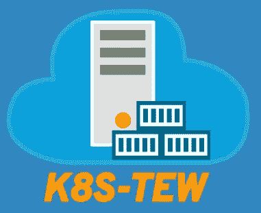

# k8s-tew 裸机“附带电池”上的 Kubernetes

> 原文：<https://itnext.io/kubernetes-on-bare-metal-batteries-included-with-k8s-tew-b7df7d661443?source=collection_archive---------1----------------------->

作为一名 kubernetes 管理员，我通常部署独立的 kubernetes 集群来测试一些特性、应用程序，甚至是 Kubernetes 工具。但在这种情况下，需要花费一些时间来部署 Kubernetes、CNI、存储解决方案、负载均衡器服务实施、入口控制器、监控、日志记录等。对于像 GKE 或 DigitalOcean 这样的 Kubernetes-ready 云分发，这相当简单，但如何用裸机做到这一点呢？当然，这可能包括您机器上的 linux 虚拟机…

**k8s-tew** 是用 GO 编写的单个二进制文件，没有外部依赖性，它将轻松地在裸机上部署 Kubernetes 集群(理解:不需要云提供商),甚至为您的 POCs 部署单节点测试平台。



k8s-tew 徽标

**k8s-tew** 将展开:

*   通过所有 CNCF 一致性测试的 HA 或非 HA 集群设置(Kubernetes [1.10](https://github.com/cncf/k8s-conformance/tree/master/v1.10/k8s-tew) 、 [1.11](https://github.com/cncf/k8s-conformance/tree/master/v1.11/k8s-tew) 、 [1.12](https://github.com/cncf/k8s-conformance/tree/master/v1.12/k8s-tew) & [1.13](https://github.com/cncf/k8s-conformance/tree/master/v1.13/k8s-tew) )
*   集装箱管理:[集装箱 id](https://containerd.io/)
*   联网:[印花布](https://www.projectcalico.org/)
*   Ingress: [NGINX Ingress](https://kubernetes.github.io/ingress-nginx/) 和 [cert-manager](http://docs.cert-manager.io/en/latest/) for [让我们加密](https://letsencrypt.org/)
*   存储: [Ceph/RBD](https://ceph.com/)
*   指标:[计量指标](https://github.com/kubernetes-incubator/metrics-server)和[堆集器](https://github.com/kubernetes/heapster)
*   监控:[普罗米修斯](https://prometheus.io/)和[格拉夫纳](https://grafana.com/)
*   测井:[流畅钻头](https://fluentbit.io/)、[弹性搜索](https://www.elastic.co/)、[基巴纳](https://www.elastic.co/products/kibana)和[脑波机](https://github.com/lmenezes/cerebro)
*   备份:[方舟](https://github.com/heptio/ark)、 [Restic](https://restic.net/) 和 [Minio](https://www.minio.io/)
*   控制器负载平衡: [gobetween](http://gobetween.io/)
*   包装经理:[掌舵人](https://helm.sh/)
*   仪表板: [Kubernetes 仪表板](https://github.com/kubernetes/dashboard)
*   使用和 [MySQL](https://www.mysql.com/) 来测试安装

即使 **k8s-tew** 能够在多个节点上部署 HA 集群，一个有趣的特性是能够在单个节点上部署完整的功能集群，从而促进 kubernetes 的自我培训。

[文档](https://darxkies.github.io/k8s-tew/)的快速入门部分是关于单节点设置的，而且非常简单:

```
*# Switch to user root*
sudo su -*# Download Binary*
wget https://github.com/darxkies/k8s-tew/releases/download/2.2.4/k8s-tew
chmod a+x k8s-tew

*# Everything is installed relative to the root directory*
export K8S_TEW_BASE_DIRECTORY=/

*# Create cluster data*
./k8s-tew initialize
./k8s-tew node-add -s # Only on Ubuntu 18.04 :
./k8s-tew configure --resolv-conf=/run/systemd/resolve/resolv.conf*# Prepare cluster* ./k8s-tew generate

*# Activate and start service*
systemctl daemon-reload
systemctl enable k8s-tew
systemctl start k8s-tew
```

然后，您可以在以下位置下载您的 *kubeconfig* 文件:

```
/etc/k8s-tew/k8s/kubeconfig/admin.kubeconfig
```

…几分钟后(Kubernetes 收敛到所有应用程序设置所需的状态所需的时间)，您就可以享受您的 Kubernetes 集群了:

```
# List of PODs by namespace
NAMESPACE     NAME
backup        ark-7bbcb7ff9b-t6jq5
backup        minio-85974b6ff-d8b58
backup        restic-rzfgh
default       elasticsearch-operator-sysctl-6tzfh
kube-system   coredns-74c648b76d-hf724
kube-system   coredns-74c648b76d-rczxk
kube-system   etcd-lab1
kube-system   gobetween-lab1
kube-system   heapster-heapster-849c47d8c9-wxznk
kube-system   kube-apiserver-lab1
kube-system   kube-controller-manager-lab1
kube-system   kube-proxy-lab1
kube-system   kube-scheduler-lab1
kube-system   kubernetes-dashboard-565db58d47-4v46w
kube-system   tiller-deploy-c8bfd74c4-525mc
logging       cerebro-elasticsearch-cluster-7785948b9d-85dd9
logging       elasticsearch-operator-5c597554d4-v5dpr
logging       es-client-elasticsearch-cluster-cb795d4b8-g6f9x
logging       es-data-elasticsearch-cluster-default-0
logging       es-master-elasticsearch-cluster-default-0
logging       fluent-bit-2d4nk
logging       kibana-elasticsearch-cluster-7fb7f88f55-5fk65
monitoring    alertmanager-kube-prometheus-0
monitoring    kube-prometheus-exporter-kube-state-6599774694-tkznb
monitoring    kube-prometheus-exporter-node-kx75d
monitoring    kube-prometheus-grafana-6cc9c9c96b-ntk2r
monitoring    metrics-server-5df85b997d-qwp5s
monitoring    prometheus-kube-prometheus-0
monitoring    prometheus-operator-7d9844f964-gx7mh
networking    calico-node-v6v6x
networking    cert-manager-58898b5d55-246mp
networking    metallb-controller-7444c5f7b5-5kthm
networking    metallb-speaker-pfrbp
networking    nginx-ingress-controller-v8nnd
networking    nginx-ingress-default-backend-7b84c755cc-88ncb
showcase      mysql-54d86bc8d-4vlsb
showcase      wordpress-65779ff967-sz8dc
storage       ceph-mds-lab1-688dc7dcd-549tx
storage       ceph-mgr-6fc4d984cd-k9hs2
storage       ceph-mon-lab1-6db48dc68d-vcpvn
storage       ceph-osd-lab1-5d8c7dc6bc-9548r
storage       ceph-rgw-6fcb67fd78-vlwg2
storage       csi-cephfsplugin-attacher-0
storage       csi-cephfsplugin-gdjvg
storage       csi-cephfsplugin-provisioner-0
storage       csi-rbdplugin-attacher-0
storage       csi-rbdplugin-provisioner-0
storage       csi-rbdplugin-vwr75
```

然后，您可以访问:

*   WordPress showcase:[http://[node-IP]:30100](http://[node-ip]:30100)
*   minio UI:[http://[node-IP]:30800](http://[node-ip]:30800)
*   grafana UI:[http://[node-IP]:30900](http://[node-ip]:30900)
*   基巴纳 UI:[https://[node-IP]:30980](https://[node-ip]:30980)
*   脑波强化器 UI:[http://[node-IP]:30990](http://[node-ip]:30990)
*   ceph UI:[https://[node-IP]:30700](https://[node-ip]:30700)

# **主观观点:**

我认为 **k8s-tew** 是一个非常好的工具，可以用来玩 Kubernetes 和管理“第二天”,而不仅仅是 k8s raw 设置。但我不建议在生产中使用 **k8s-tew** ，因为这个项目到目前为止只有一个人维护(达克斯·基斯/[https://github.com/darxkies](https://github.com/darxkies)，非常感谢他为社区提供了这个项目)，他于 2018 年 6 月开始了这个项目。这个项目确实应该得到更多人的支持。

在[https://darxkies.github.io/k8s-tew/](https://darxkies.github.io/k8s-tew/)上自己发现 **k8s-tew**

*编辑:更多设置选项，请参见:*[*https://github.com/darxkies/k8s-tew/tree/master/setup*](https://github.com/darxkies/k8s-tew/tree/master/setup)