# IBM Cloud 上的 Kubernetes:构建云原生应用程序

> 原文：<https://itnext.io/kubernetes-on-ibm-cloud-building-a-cloud-native-application-ba70439bd8d0?source=collection_archive---------7----------------------->

使用 Node.js、Express、MongoDB 和一些想象力

在这个代码模式中，我们将构建一个由一组相互通信的微服务组成的虚拟数字银行。我们将使用 Node.js、Express、MongoDB 和 IBM Cloud Container 服务。

被分解成一组[微服务](http://microservices.io/)的[云原生应用](https://www.cncf.io/blog/2017/05/15/developing-cloud-native-applications/)的开发被誉为软件开发方法中的最佳实践。像 [Kubernetes](https://kubernetes.io/) 这样支持云计算的软件栈因此受到了相当多的欢迎。

然而，尝试构建一个所谓的云原生应用比谈论一个更有趣。

所以这是我们的尝试:

我们将采用一个在现实世界中比较熟悉的用例——数字银行。自然受到 [Monzo](http://monzo.com/) 的启发。姑且称之为创新吧。

[在 IBM Cloud 的 kubernetes 集群上部署了一个实时版本，您可以在这里试用](http://ibm.biz/digibank)。要测试它，注册一个帐户。系统会定期运行一个进程来转储用户帐户的随机交易和账单，因此需要几分钟时间来刷新以查看您填写的个人资料。

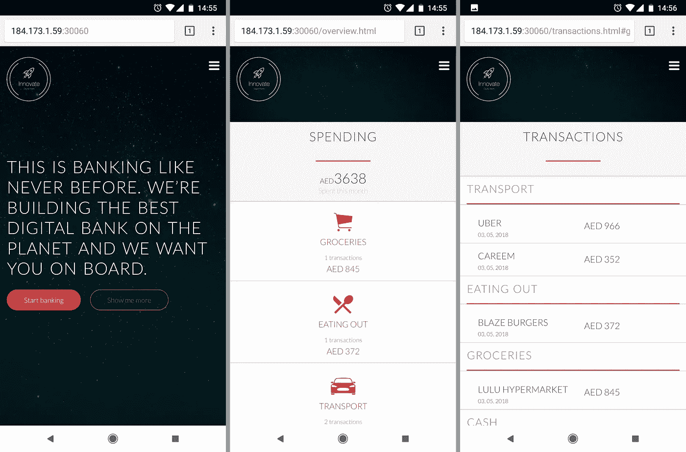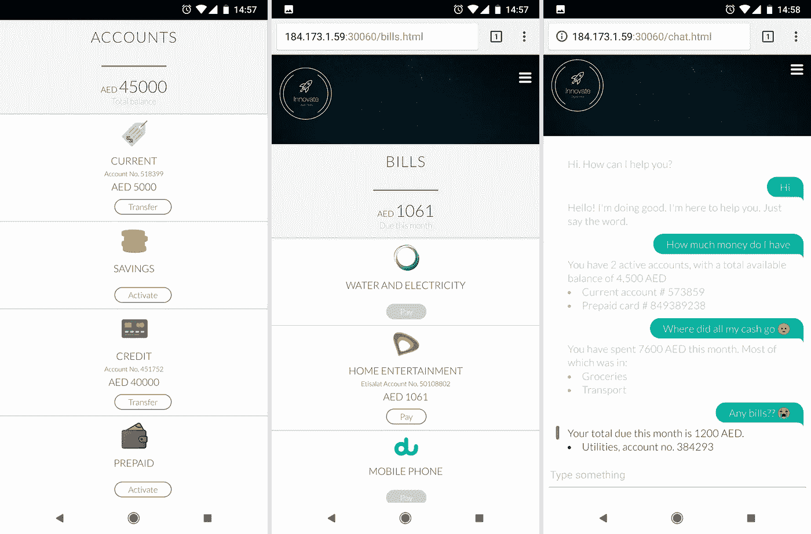

# 学习目标

完成此代码模式后，您将了解如何:

*   将应用程序分解为一组微服务
*   在 IBM Cloud 上创建和管理 Kubernetes 集群
*   部署到 IBM Cloud 上的 Kubernetes 集群
*   部署到 IBM 私有云

# 流动

当考虑业务能力时，我们想象中的银行将需要以下一组微服务:

1.  *门户:*加载 UI 并负责用户会话。核心功能依赖于所有其他微服务。
2.  *认证:*处理用户配置文件的创建，以及登录&注销。
3.  *帐户:*处理用户银行帐户的创建、管理和检索。
4.  *交易:*处理用户银行账户交易的创建和检索。
5.  *账单:*处理账单的创建、支付和检索。
6.  *支持:*处理与 Watson Assistant 的通信，以启用支持聊天功能。

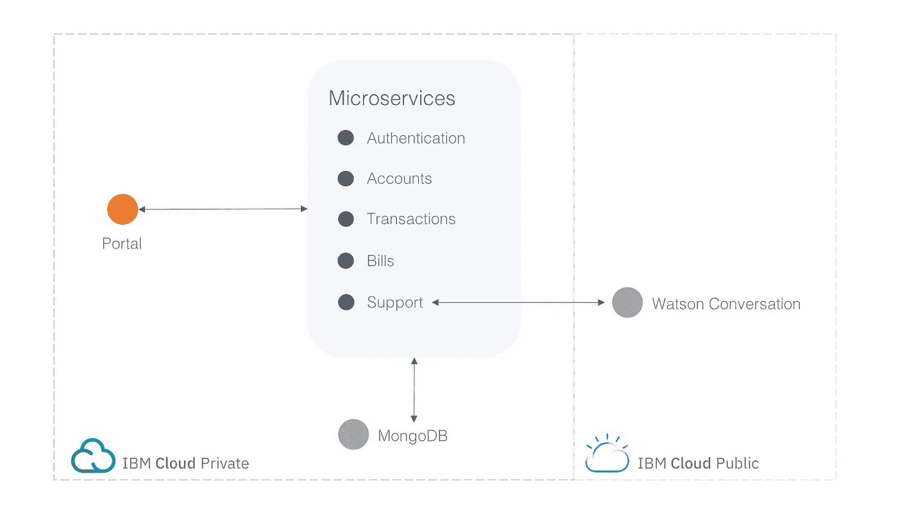

# 包括的组件

*   [IBM Cloud Container Service](https://console.bluemix.net/doc/source/images/containers/container_index.html):IBM Bluemix Container Service 管理 IBM Cloud 上 Docker containers 和 Kubernetes 集群内的高可用性应用。
*   [Kubernetes 集群](https://console.bluemix.net/doc/source/images/containers/container_index.html):创建和管理您自己的云基础设施，并将 Kubernetes 用作您的容器编排引擎。
*   [微服务构建器](https://developer.ibm.com/microservice-builder):在微服务框架中学习、构建、运行和管理应用。
*   沃森助手:用一个程序创建一个聊天机器人，通过听觉或文本方式进行对话。

# 特色技术

*   [微服务](https://www.ibm.com/developerworks/community/blogs/5things/entry/5_things_to_know_about_microservices?lang=en):细粒度、松散耦合的服务集合，使用轻量级协议在云中提供现代应用组合的构建块。
*   [Node.js](https://nodejs.org/) :用于执行服务器端 JavaScript 代码的开源 JavaScript 运行时环境。
*   [容器](https://www.ibm.com/cloud-computing/bluemix/containers):虚拟软件对象，包括一个应用程序运行所需的所有元素。
*   [数据库](https://en.wikipedia.org/wiki/IBM_Information_Management_System#.22Full_Function.22_databases):用于存储和管理数据集合的储存库。
*   [混合集成](https://www.ibm.com/cloud-computing/bluemix/hybrid-architecture):支持客户利用公共云服务提供商的能力，同时使用私有云部署敏感应用和数据。

# 观看视频

如果你想快速浏览最终结果，这里有一个视频

# 设置

您有多个选项来设置自己的实例:

*   [一键式部署到 IBM(通过工具链自动化)](https://github.com/amalamine/innovate-digital-bank#deploy-to-ibm-cloud)
*   [本地运行](https://github.com/amalamine/innovate-digital-bank#run-locally)
*   [艰难地部署到 IBM Cloud(手动、多阶段)](https://github.com/amalamine/innovate-digital-bank#deploy-to-ibm-cloud-the-hard-way)
*   [部署到 IBM 私有云](https://github.com/amalamine/innovate-digital-bank#deploy-to-ibm-cloud-private)

# 部署到 IBM 云

> *注意:这是一个自动设置&部署到您自己的托管在 IBM Cloud 上的 kubernetes 集群；它将所有 7 个微服务打包为一个 docker 映像、一个部署和一个多端口服务。为了更好地理解这个概念，您应该按照步骤来配置您的集群并独立部署每个微服务。*

您可以通过点击下面的部署链接，使用[工具链](https://www.ibm.com/cloud/garage/toolchains/)来部署该应用程序。请注意，您应该在开始之前准备好集群。要部署一个新的，在 IBM Cloud catalog[下的 Kubernetes 集群中找到*容器，然后单击 create。给它一些时间来展开。*](https://github.com/amalamine/innovate-digital-bank/blob/master/bluemix.net/catalog)

[***点击此链接，使用工具链一键部署到 IBM Cloud！***](https://console.bluemix.net/devops/setup/deploy/?repository=https://github.com/amalamine/innovate-digital-bank)

# 本地运行

## 1.克隆回购

在本地克隆`innovate-digital-bank`存储库。在终端中，运行:

```
$ git clone [https://github.com/amalamine/innovate-digital-bank.git](https://github.com/amalamine/innovate-digital-bank.git)
```

## 2.创建 MongoDB 的一个实例

这个演示非常依赖 mongo 作为会话和数据存储。

从 [IBM Cloud catalog](https://console.bluemix.net/catalog/) 中，找到 Compose for MongoDB 并点击 create。给它一个名称，选择一个地区，选择标准定价计划，然后单击创建。

获取您的 mongo 连接字符串。几乎你所有的微服务都需要它；保管好它！


## 3.配置您的环境变量

7 个微服务中的每一个都必须有一个*。存储所有凭证的 env* 文件。

每个文件夹中都提供了一个示例。从每个微服务的目录中，复制示例文件，将其重命名为*。env* ，并用适当的值填充它。

例如，从/innovate 文件夹中，导航到 accounts 文件夹

```
$ cd accounts
```

接下来，复制并重命名 *.env.example* 文件夹

```
$ cp .env.example .env
```

最后，编辑您的。env 文件夹并添加您的 Mongodb 连接字符串

对所有微服务重复这些步骤。除了您的 mongo url，大多数都需要您的 kubernetes 集群的公共 IP 地址，您可以在 IBM Cloud 上的集群概述中找到。

## 4.配置您的环境模式

在没有 kubernetes 的情况下本地运行应用程序时，微服务不会在我们的 helm 图表中指定的节点端口上运行，因此我们需要将我们的门户和用户基础微服务指向正确的端口。

如果您在 macOS 或任何基于 linux 的系统上运行，请在终端中从 git repo 的目录运行以下命令

```
$ export NODE_ENV=development
```

如果在 Windows 上运行，请编辑。将/portal 文件夹和/userbase 文件夹中的 env 文件复制到以下位置:

```
NODE_ENV=development
```

## 5.奔跑

最后，导航到每个微服务文件夹，并启动它。确保在 7 个独立的终端中运行 7 个微服务。

```
$ npm start
```

最后，导航到每个微服务文件夹，并启动它。确保在 7 个独立的终端中运行 7 个微服务。

```
$ npm start
```

# 艰难地部署到 IBM Cloud

> *注意:本指南需要 IBM Cloud 上的付费/升级帐户。您无法使用免费或简易帐户完成这些步骤*

1.  [拿工具](https://github.com/amalamine/innovate-digital-bank#1-get-the-tools)
2.  [克隆回购](https://github.com/amalamine/innovate-digital-bank#2-clone-the-repo)
3.  [登录 IBM Cloud](https://github.com/amalamine/innovate-digital-bank#3-login-to-ibm-cloud)
4.  [创建集群](https://github.com/amalamine/innovate-digital-bank#4-create-a-cluster-)
5.  [创建一个 MongoDB 的实例](https://github.com/amalamine/innovate-digital-bank#5-create-an-instance-of-mongodb)
6.  [配置您的部署目标](https://github.com/amalamine/innovate-digital-bank#6-configure-your-deploy-target)
7.  [配置您的环境变量](https://github.com/amalamine/innovate-digital-bank#7-configure-your-environment-variables)
8.  [配置 kubectl](https://github.com/amalamine/innovate-digital-bank#8-configure-kubectl)
9.  [初始化舵](https://github.com/amalamine/innovate-digital-bank#9-initialize-helm)
10.  [部署](https://github.com/amalamine/innovate-digital-bank#10-deploy)

## 1.去拿工具

您将需要以下每个先决条件:

*   [IBM 云开发者工具 CLI](https://console.bluemix.net/doc/source/images/cli/reference/bluemix_cli/get_started.html#getting-started)
*   Kubernetes CLI
*   容器服务插件

下载 IBM Cloud Developer Tools CLI 后，在终端中运行:

```
$ bx plugin install container-service -r Bluemix
```

*   容器注册表插件

在终端中，运行:

```
$ bx plugin install container-registry -r Bluemix
```

## 2.克隆回购

在本地克隆`innovate-digital-bank`存储库。在终端中，运行:

```
$ git clone [https://github.com/amalamine/innovate-digital-bank.git](https://github.com/amalamine/innovate-digital-bank.git)
```

## 3.登录 IBM Cloud

通过[控制台](https://console.bluemix.net/)和你的终端

> *注意:如果您需要指定您想要部署的区域，您可以通过在区域 url 后添加-a 标志来完成。*

```
$ bx login
```

## 4.创建一个集群

在目录中，找到 Kubernetes 集群中的容器，然后单击 create。选择区域和分类类型，并创建您的分类。给它一些时间来展开。

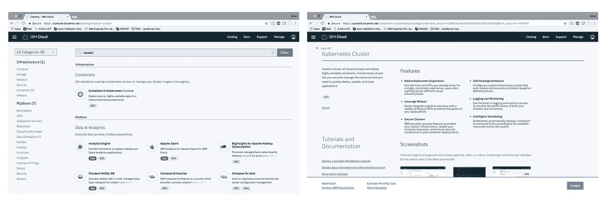

## 5.创建 MongoDB 的一个实例

这个演示非常依赖 mongo 作为会话和数据存储。

从[目录](https://console.bluemix.net/catalog/)中，找到 Compose for MongoDB 并点击 create。给它一个名称，选择一个地区，选择标准定价计划，然后单击创建。

获取您的 mongo 连接字符串。几乎你所有的微服务都需要它；保管好它！

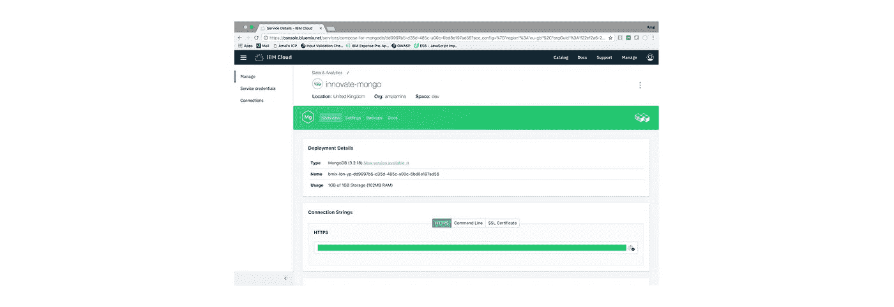

## 6.配置您的部署目标

7 个 docker 映像中的每一个都需要被推送到 IBM Cloud 上的 docker 映像注册中心。您需要设置正确的*部署目标*。根据您创建集群的地区，您的 url 将采用以下格式

```
registry.<REGION_ABBREVIATION>.bluemix.net/<YOUR_NAMESPACE>/<YOUR_IMAGE_NAME>
```

例如，要将 accounts 微服务部署到我在美国南部地区的 docker 映像注册中心，我的 deploy_target 将是:

```
registry.ng.bluemix.net/amalamine/innovate-accounts
```

如果您需要获取名称空间，请运行:

```
$ bx cr namespace-list
```

您还可以通过运行以下命令来添加新的命名空间:

```
$ bx cr namespace-add <NAME>
```

从每个微服务的目录中，将*/chart/innovate-<MICROSERVICE _ NAME>/values . YAML*中 *cli-config.yml* &中的部署目标替换为正确的目标

例如，从/innovate 文件夹中，导航到 accounts 文件夹

```
$ cd accounts
```

接下来，编辑 [cli-config.yaml](https://github.com/aamine0/innovate-digital-bank/blob/master/accounts/cli-config.yml) 文件的第 58 行。用正确的值替换*部署图像目标*。

```
deploy-image-target: "registry.ng.bluemix.net/amalamine/innovate-accounts"
```

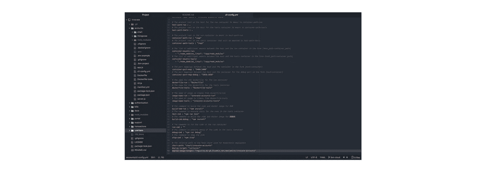

编辑 [values.yaml](https://github.com/aamine0/innovate-digital-bank/blob/master/accounts/chart/innovate-accounts/values.yaml) 文件的第 6 行。用正确的值替换*储存库*。

```
repository: registry.ng.bluemix.net/amalamine/innovate-accounts
```

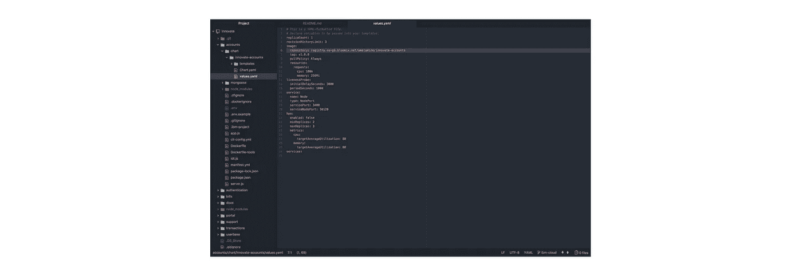

对所有 7 个微服务重复这些步骤。

## 7.配置您的环境变量

7 个微服务中的每一个都必须有一个*。存储所有凭证的 env* 文件。

每个文件夹中都提供了一个示例。从每个微服务的目录中，复制示例文件，将其重命名为*。env* ，并用适当的值填充它。

例如，从/innovate 文件夹中，导航到 accounts 文件夹

```
$ cd accounts
```

接下来，复制并重命名 *.env.example* 文件夹

```
$ cp .env.example .env
```

最后，编辑您的。env 文件夹并添加您的 Mongodb 连接字符串

*对所有微服务重复这些步骤。除了您的 mongo url，大多数都需要您的 kubernetes 集群的公共 IP 地址，您可以在 IBM Cloud 上的集群概述中找到。*

## 8.配置 kubectl

运行以下命令:

```
$ bx cs cluster-config <YOUR_CLUSTER_NAME>
```

然后复制输出并粘贴到您的终端中

## 9.初始化舵

```
$ helm init
```

## 10.部署

最后，导航到每个微服务文件夹，并运行以下命令

```
$ bx dev deploy
```

# 部署到 IBM 私有云

如果您有一个 IBM Cloud Private 运行的实例，您可以按照步骤来部署应用程序。如果您想部署自己的 ICP 实例，[您可以关注这篇精彩的文章](https://github.com/IBM/deploy-ibm-cloud-private)

1.  [创建永久卷](https://github.com/amalamine/innovate-digital-bank#1-create-a-persistent-volume)
2.  [创建永久卷索赔](https://github.com/amalamine/innovate-digital-bank#2-create-a-persistent-volume-claim)
3.  [创建一个 MongoDB 的实例](https://github.com/amalamine/innovate-digital-bank#3-create-an-instance-of-mongodb)
4.  [配置您的环境变量](https://github.com/amalamine/innovate-digital-bank#4-configure-your-environment-variables)
5.  [将您的 ICP 地址添加到您的主机文件中](https://github.com/amalamine/innovate-digital-bank#5-add-your-icps-address-to-your-hosts-file)
6.  [登录 docker](https://github.com/amalamine/innovate-digital-bank#6-login-to-docker)
7.  [配置 kubectl](https://github.com/amalamine/innovate-digital-bank#7-configure-kubectl)
8.  [部署](https://github.com/amalamine/innovate-digital-bank#9-initialize-helm)

## 1.创建永久卷

这个演示非常依赖 mongo 作为会话和数据存储。给它一个名称和一个容量，选择存储类型*主机路径*，并添加一个*路径参数*

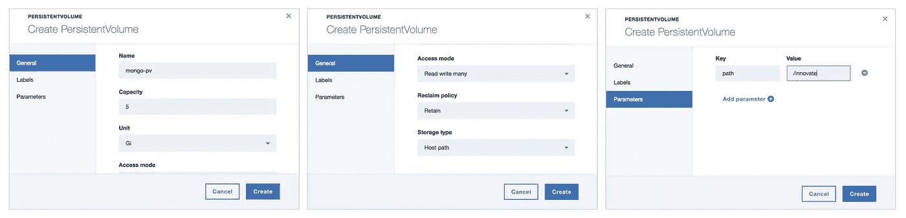

## 2.创建永久卷声明

给它一个名称和一个存储请求值


## 3.创建 MongoDB 的一个实例

从目录中选择 MongoDb。给它一个*名称*，指定*现有卷声明名称*，给它一个*密码*

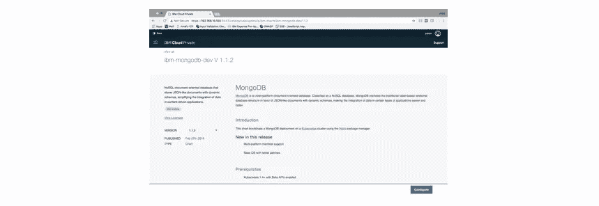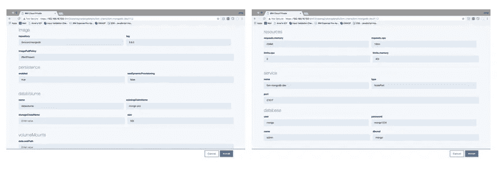

*获取您的 mongo 连接字符串；几乎你所有的微服务都需要它；保管好它！*

您的连接字符串将采用以下格式:

```
mongodb://<USERNAME>:<PASSWORD>@<HOST>:<PORT>/<DATABASE_NAME>
```

## 4.配置您的环境变量

7 个微服务都必须有一个*。env* 文件。

每个文件夹中都提供了一个示例。从每个微服务的目录中，复制示例文件，将其重命名为*。env* ，并用适当的值填充它。

例如，从/innovate 文件夹中，导航到 accounts 文件夹

```
$ cd accounts
```

接下来，复制并重命名 *.env.example* 文件夹

```
$ cp .env.example .env
```

最后，编辑您的。env 文件夹并添加您的 Mongodb 连接字符串

*对所有微服务重复这些步骤。除了您的 mongo url 之外，门户微服务还需要您的 ICP 的地址。*

## 5.将您的 ICP 地址添加到您的 hosts 文件中

向/etc/hosts 文件中添加一个条目，如下所示

```
<YOUR_ICP_IP_ADDRESS> mycluster.icp
```

## 6.登录 docker

```
$ docker login mycluster.icp:8500
```

## 7.配置 kubectl

从 ICP 的仪表板中，复制 admin > configure client 下的 kubectl 命令


## 8.部署

最后，导航到每个微服务，并运行以下命令

```
$ bx dev deploy
```

*如果您没有安装 IBM Cloud Developer Tools CLI，请先在此处* *获取*[](https://console.bluemix.net/doc/source/images/cli/reference/bluemix_cli/download_cli.html)

# *(可选)使用 Watson Assistant 添加支持*

*support 微服务连接到 IBM Cloud 上的 Watson Assistant 实例，以模拟与虚拟支持代理的聊天。*

> **注意:这是一个可选步骤。如果你想在应用程序上启用支持功能，你需要它。**

1.  *[创建沃森助手的实例](https://github.com/amalamine/innovate-digital-bank#1-create-an-instance-of-watson-assistant)*
2.  *[导入支持工作区](https://github.com/amalamine/innovate-digital-bank#2-import-the-support-workspace)*
3.  *[拿到你的证件](https://github.com/amalamine/innovate-digital-bank#3-get-your-credentials)*
4.  *[配置您的环境变量](https://github.com/amalamine/innovate-digital-bank#4-configure-your-environment-variables)*
5.  *[展开](https://github.com/amalamine/innovate-digital-bank#5-deploy)*

## *1.创建沃森助手的实例*

*从 [IBM 云目录](https://github.com/amalamine/innovate-digital-bank/blob/master/bluemix.net)中，选择 Watson Conversation，然后点击 create。*

## *2.导入支持工作区*

*将[支持工作区](https://github.com/amalamine/innovate-digital-bank/blob/master/support/conversation-workspace.json)导入到您新创建的 Watson Assistant 实例中*

*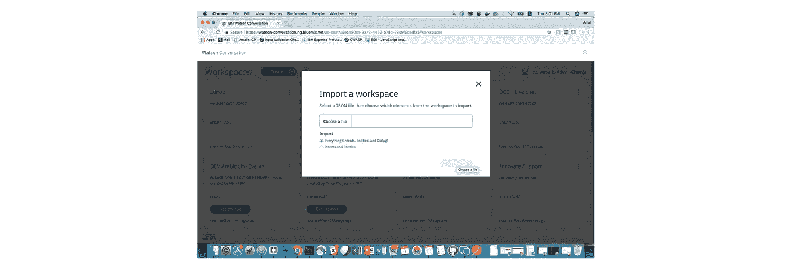*

## *3.获取您的证书*

*导航到 deploy 选项卡，复制您的用户名、密码和工作区 ID*

*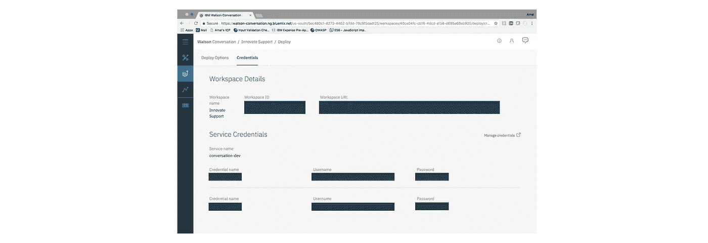*

## *4.配置您的环境变量*

*在支持文件夹中，编辑您的。env 以包含您新获得的凭证*

## *5.部署*

*重新部署支持微服务，现在应该可以通过门户访问支持功能。*

```
*$ bx dev deploy*
```

# *下一步是什么？*

*现在，您应该有自己的实例在您选择的平台上运行了。你可以尝试在 [Minikube](https://github.com/kubernetes/minikube) 、 [Google Kubernetes 引擎](https://cloud.google.com/kubernetes-engine/)、 [kops](https://github.com/kubernetes/kops) — *任何地方*，真的。*

*如果你足够好奇，可以去看看[文档](https://github.com/aamine0/innovate-digital-bank#docs)，更好地了解每个微服务所公开的端点。*

## *了解更多信息*

*   *人工智能代码模式:喜欢这种代码模式吗？检查我们的其他[人工智能代码模式](https://developer.ibm.com/code/technologies/artificial-intelligence/)。*
*   *数据分析代码模式:喜欢这种代码模式吗？查看我们的其他[数据分析代码模式](https://developer.ibm.com/code/technologies/data-science/)*
*   *AI 和数据代码模式播放列表:用我们所有的代码模式视频为我们的[播放列表](https://www.youtube.com/playlist?list=PLzUbsvIyrNfknNewObx5N7uGZ5FKH0Fde)添加书签*
*   *使用 Watson:想让您的 Watson 应用更上一层楼吗？希望利用沃森品牌资产？[加入 Watson 计划](https://www.ibm.com/watson/with-watson/)利用独家品牌、营销和技术资源来扩大和加速您的 Watson 嵌入式商业解决方案。*
*   *数据科学经验:通过 IBM 的[数据科学经验](https://datascience.ibm.com/)掌握数据科学的艺术*
*   *IBM Cloud 上的 Kubernetes:结合 IBM Cloud 上的 [Kubernetes 和 Docker 的强大功能来交付您的应用](https://www.ibm.com/cloud-computing/bluemix/containers)*

## *还有很大的改进空间*

*当然。我想把这个应用定义为一个有多个[子部分](https://github.com/kubernetes/helm/blob/master/docs/chart_template_guide/subcharts_and_globals.md)的图表。或者让我们目前不太有用的聊天机器人访问 MongoDB 和一些超级大国。*

*但我会保持简单，现在。[立功&拉请求](https://github.com/aamine0/innovate-digital-bank)可是受欢迎的！*