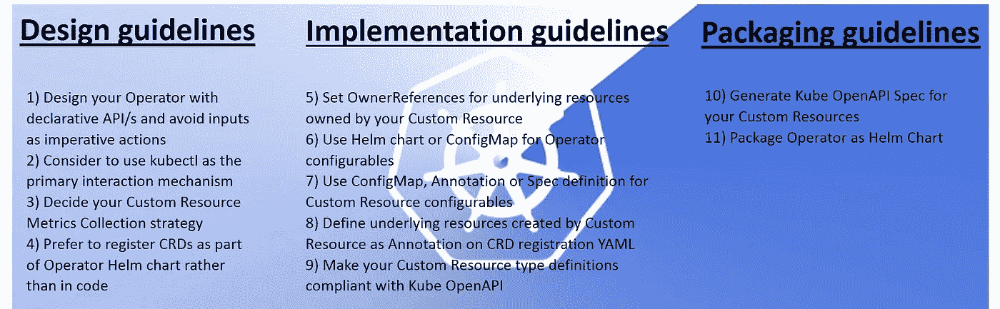

# 提高可用性的 Kubernetes 操作员开发指南

> 原文：<https://itnext.io/kubernetes-operator-development-guidelines-for-improved-usability-222390b00dc4?source=collection_archive---------2----------------------->



注意:关于代码示例的更多细节可以在 [guidelines Github 页面](https://github.com/cloud-ark/kubeplus/blob/master/Guidelines.md)上找到。

Kubernetes 运营商扩展了 Kubernetes API，将第三方软件作为本地 Kubernetes 对象进行管理。正在为平台元素(如数据库、队列、记录器等)构建大量操作符。我们看到越来越多的适合特定用途的应用平台通过将多个运营商组合在一起而被创建。

在为客户开发定制平台的过程中，我们观察到了在同时使用多个运营商时出现的挑战。在构建像 [discovery](https://github.com/cloud-ark/kubediscovery) 这样的工具时，我们更多地考虑了操作符的可用性。这种可用性挑战的例子有:

*   一些运营商引入了新的 CLI。当最终用户必须学习多个 CLI 才能在一个集群中使用多个操作员时，可用性就成了一个问题。
*   一些操作符类型定义不符合 Kube OpenAPI 规范。

我们从这个角度对现有的社区运营商进行了研究，这使我们提出了运营商开发指南，这将提高运营商的整体可用性。这些指南的主要目标是:集群管理员应该能够轻松地将多个操作符组合在一起，形成一个平台栈；应用程序开发人员应该能够毫不费力地发现和使用运营商。

我们在下面展示这些指南(也可以在 [GitHub](https://github.com/cloud-ark/kubeplus/blob/master/Guidelines.md) 上获得)。这些指南补充了现有的操作员开发工具，如 [Kubebuilder](https://github.com/kubernetes-sigs/kubebuilder) 、[操作员 SDK](https://github.com/operator-framework/operator-sdk) 或[样本控制器](https://github.com/kubernetes/sample-controller)。

## **设计指南**

**1)使用声明性 API 设计您的操作器，避免将输入作为命令性动作**

声明式 API 允许您*声明*或指定自定义资源的期望状态。在自定义资源规范类型定义中，声明性状态优先于任何命令性操作。定制控制器代码应通过执行当前状态与期望状态的差异，使当前状态与期望状态一致。这使得最终用户可以像使用任何其他 Kubernetes 资源一样，通过基于声明性状态的输入来使用您的定制资源。例如，当编写一个 [Postgres 操作符](https://github.com/cloud-ark/kubeplus/tree/master/postgres-crd-v2)时，定制控制器应该被编写为基于[接收到的期望状态](https://github.com/cloud-ark/kubeplus/blob/master/postgres-crd-v2/artifacts/examples/add-user.yaml)执行现有值“用户”与期望值“用户”的 diff，并执行所需的动作(例如添加新用户、删除当前用户等。).

**2)考虑使用 kubectl 作为主要交互机制**

在设计您的操作符时，您应该尝试通过 kubectl 支持它的大部分操作。Kubernetes 包含各种机制，比如定制资源定义、聚合 API 服务器、定制子资源。在考虑为您的运营商引入新的 CLI 之前，请验证您是否可以使用这些机制。参考这篇[博客文章](https://medium.com/@cloudark/comparing-kubernetes-api-extension-mechanisms-of-custom-resource-definition-and-aggregated-api-64f4ca6d0966)来了解更多关于他们的信息。

**3)决定您的定制资源指标收集策略**

规划由您的运营商管理的定制资源的指标收集。这些信息有助于理解随着时间推移各种操作对您的定制资源的影响，并提高可追溯性。一种选择是在您的定制控制器中收集指标，然后用 Prometheus 之类的解决方案公开它们。另一方面，如果您决定不将它包含在您的定制控制器代码中，那么替代方法是利用 Kubernetes 审计日志。您也可以使用外部工具，如 [kubeprovenance](https://github.com/cloud-ark/kubeprovenance) ，它与 Kubernetes 审计日志一起工作。

**4)将 CRDs 注册为操作员舵图的一部分，而不是代码**

更倾向于将 CRDs 注册为操作员舵表的一部分，而不是在[代码](https://github.com/coreos/etcd-operator/blob/master/pkg/controller/backup-operator/operator.go#L76)中注册。这具有以下优点:

*   所有安装工件和依赖项都将在一个地方——操作员的舵图。
*   通过舵图可以很容易地修改和/或发展 CRD。

**5)使操作员 ETCD 相关性可配置**

如果您的操作员需要 ETCD 作为其存储，那么最好通过您的操作员舵图来配置这种依赖性。这将允许平台工程师与其他运营商一起安装您的运营商，以决定使用 ETCD 的最佳方式。如果有多个运营商需要 ETCD，那么通过使其可配置，您将允许平台工程师决定他们是希望为每个运营商提供单独的 ETCD 实例，还是在所有运营商之间使用共享的 ETCD 实例。平台工程师可能会使用 ETCD 运营商来提供 ETCD 实例。您的操作符代码不应该依赖于如何使 ETCD 实例对它可用。

## **实施指南**

**6)为您的自定义资源所拥有的底层资源设置 OwnerReferences】**

自定义资源实例通常会创建一个或多个其他 Kubernetes 资源实例，例如部署、服务、机密等。，作为其实例化的一部分。在这里，这个定制资源是它所管理的底层资源的所有者。应该编写自定义控制器来设置此类托管 Kubernetes 资源的 OwnerReference。它们是自定义资源正确垃圾收集的关键。OwnerReferences 还有助于查找定制资源实例的合成树。使用 OwnerReferences 的操作符的例子有: [Etcd 操作符](https://github.com/coreos/etcd-operator/blob/master/pkg/cluster/cluster.go#L351)、 [MySQL 操作符](https://github.com/oracle/mysql-operator/blob/master/pkg/resources/services/service.go#L34)和 [CloudARK Sample Postgres 操作符](https://github.com/cloud-ark/kubeplus/blob/master/postgres-crd-v2/controller.go#L508)。

**7)使用舵图或配置图进行操作员配置**

通常，运营商需要支持某种形式的定制。例如，[这个 MySQL 操作符](https://github.com/oracle/mysql-operator/blob/master/docs/tutorial.md#configuration)支持定制，比如是在集群范围内还是在特定的名称空间内部署操作符，应该安装哪个版本的 MySQL，等等。使用 Helm's values YAML 文件指定此类参数，或使用 ConfigMap 实现此目的。该指南确保 Kubernetes 管理员可以使用 Kubernetes 的本地界面与操作员交互和使用操作员。

**8)使用配置图、注释或规格定义来定制资源配置**

操作员通常需要接受定制资源配置参数的输入。我们已经在社区中看到了三种不同的方法，基于您的运营商设计，任何人都应该可以使用。它们是—配置映射、注释或规范定义本身。该指南确保应用程序开发人员可以使用 Kubernetes 的本地接口来交互和使用定制资源。比如 [Nginx 自定义控制器](https://github.com/nginxinc/kubernetes-ingress/tree/master/examples/customization)同时支持 ConfigMap 和 Annotation。 [Oracle MySQL 运营商](https://github.com/oracle/mysql-operator/blob/master/docs/user/clusters.md)使用 ConfigMap。 [PressLabs MySQL 操作员](https://github.com/presslabs/mysql-operator)使用自定义资源[规范定义](https://github.com/presslabs/mysql-operator/blob/master/examples/example-cluster.yaml#L22)。

**9)将自定义资源创建的基础资源定义为 CRD 注册 YAML 的注释**

使用定制资源定义上的注释来指定将由定制资源创建和管理的底层 Kubernetes 资源。下面的示例 Postgres 资源中可以看到这样的例子:

```
kind: CustomResourceDefinition
metadata:
  name: postgreses.postgrescontroller
  annotations:
    composition: Deployment, Service
```

否则，该组成信息将仅在定制控制器代码中可用，并对最终用户隐藏，以防他们出于可追溯性或任何其他原因需要它。还可以构建像 [kubediscovery](https://github.com/cloud-ark/kubediscovery) 这样的工具，通过使用这些信息来显示定制资源实例的对象组合树。

**10)使您的自定义资源类型定义符合 Kube OpenAPI**

Kubernetes API 细节使用 Swagger v1.2 和 OpenAPI 进行文档化。 [Kube OpenAPI](https://github.com/kubernetes/kube-openapi) 支持 OpenAPI 特性的子集，以满足 kubernetes 用例。随着运营商扩展 Kubernetes API，遵循 Kube OpenAPI 特性以提供一致的用户体验非常重要。遵循 Kube OpenAPI 需要采取以下措施。

*   添加关于类型定义及其各个字段的文档。
*   需要使用以下模式定义字段名:

Kube OpenAPI 名称验证规则期望 Go 代码中的字段名和 JSON 中的字段名完全相同，只是首字母大小写不同(Go 代码需要 CamelCase，JSON 需要 camelCase)。

*   当定义与您的定制资源相对应的类型时，您应该在类型定义中使用 kube-openapi 注释—“+k8s:openapi-gen = true”，以便能够为您的定制资源生成 open API 规范文档。在 CloudARK 示例 Postgres 定制资源中可以看到这种类型定义注释的一个例子。

```
// +k8s:openapi-gen=true
type Postgres struct {
:
}
```

**11)定义自定义资源规格验证规则，作为自定义资源定义的一部分**

您的自定义资源规范定义将包含不同的属性，并且它们可能有一些特定于域的验证要求。从 Kubernetes 1.13 开始，您将能够使用 OpenAPI v3 模式为您的定制资源规范定义验证需求。例如，下面是为我们的示例 Postgres CRD 添加验证规则的示例。这些规则定义了“数据库”和“用户”的 Postgres 自定义资源规范属性应该是数组类型，并且该数组的每个元素都应该是字符串类型。一旦定义了这样的验证规则，Kubernetes 将拒绝任何不满足规范中这些要求的定制资源实例创建。

**12)自定义资源需要使用的文档命名约定和标签**

对于命名自定义资源实例或它们的一些规范属性，您可能有特殊的要求。同样，您可能有与需要添加到标签上的标签相关的需求。用您将为您的类型定义定义的 OpenAPI Spec 注释来记录这些信息。这样，当应用程序开发人员试图将您的自定义资源与来自其他运营商的自定义资源进行组合/使用时，这些信息将有助于他们。

## **包装指南**

**13)为您的定制资源生成 Kube OpenAPI 规范**

我们开发了一个[工具](https://github.com/cloud-ark/kubeplus/tree/master/openapi-spec-generator)，您可以使用它为您的定制资源生成 Kube OpenAPI 规范。它用一个易于使用的脚本包装了 kube-openapi 仓库中可用的代码。为示例 Postgres 自定义资源生成的 Kube OpenAPI 规范文档在这里是。

**14)将操作员打包为舵手图**

为您的操作员创建舵图。图表应该包括两件事:

*   由运营商管理的所有定制资源的注册。这方面的例子可以在 CloudARK sample [Postgres 操作符](https://github.com/cloud-ark/kubeplus/blob/master/postgres-crd-v2/postgres-crd-v2-chart/templates/deployment.yaml)和这个 [MySQL 操作符](https://github.com/oracle/mysql-operator/blob/master/mysql-operator/templates/01-resources.yaml)中看到。
*   Kube 为您的自定义资源开放 API 规范。该规范作为参考文档非常有用，可以被不同的工具利用。

我们根据这些指南[在这里](https://github.com/cloud-ark/kubeplus/blob/master/Guidelines.md#evaluation-with-example-operators)对一些社区运营商进行了评估。如果您是 Kubernetes 集群管理员或应用程序开发人员，并且有兴趣根据这些指南评估任何现有的运营商，[请联系我们](https://github.com/cloud-ark/kubeplus/issues)。

我们希望这些指南将引发社区范围内的讨论，围绕如何建设运营商，同时牢记其对最终用户的可用性。

[www.cloudark.io](http://www.cloudark.io)