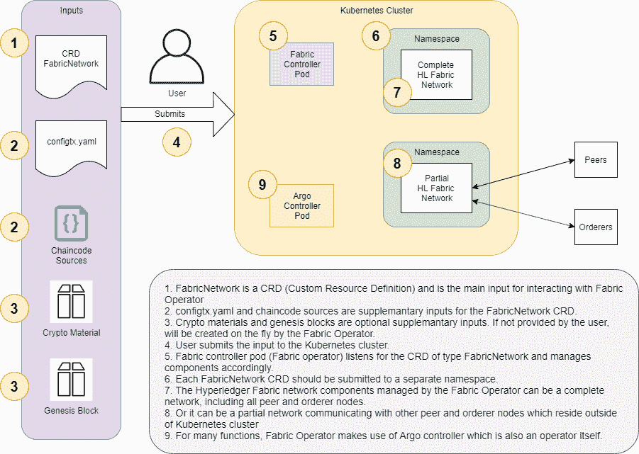
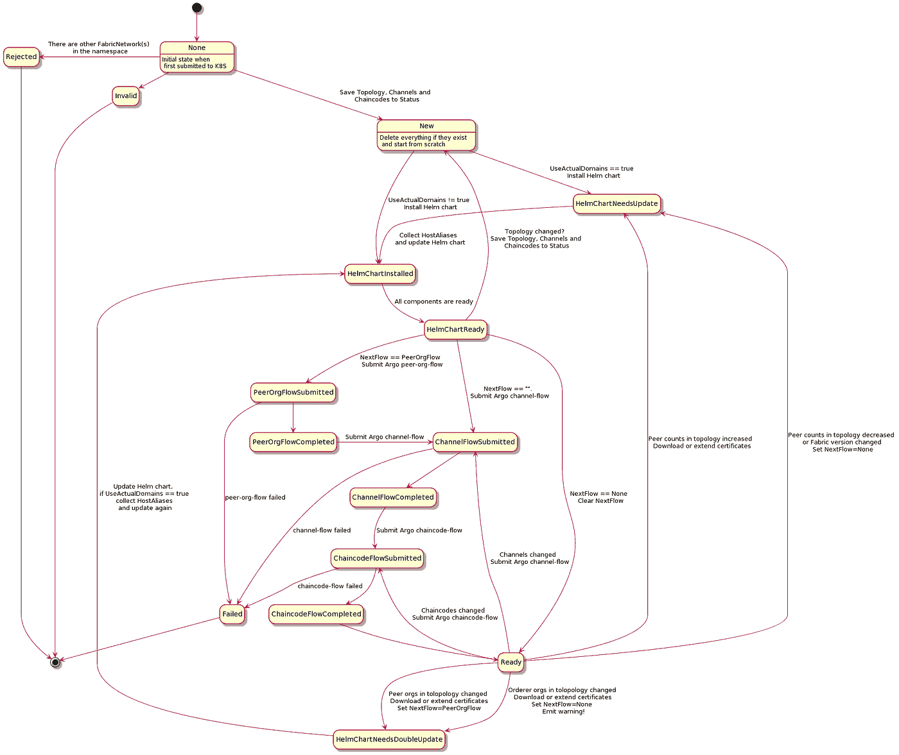

# 超分类帐结构的 Kubernetes 运算符

> 原文：<https://itnext.io/kubernetes-operator-for-hyperledger-fabric-8bd13fa20a2a?source=collection_archive---------5----------------------->


# 摘要

我来介绍一下 Hyperledger Fabric 的 Kubernetes 算子:【https://github.com/raftAtGit/hl-fabric-operator】T5

它是我们之前工作 [PIVT Helm charts](https://github.com/hyfen-nl/PIVT) 的包装，使在 Kubernetes 中运行和操作 Hyperledger Fabric 更加容易。

它允许通过*光纤网络* CRD(自定义资源定义)以声明方式管理整个或部分 HL 光纤网络。

特别是，它允许:

*   配置和启动整个 HL 结构网络或其一部分
*   创建信道、将对等体加入信道、更新锚定对等体的信道
*   安装/实例化所有链码，或其中一些，或将其升级到较新的版本
*   将新的对等组织添加到已经运行的网络中

这项工作最初是我自己的一个实验性/概念验证爱好项目，但后来证明相当完整和实用。

# 内容

*   动机
*   概观
*   CRD 的 FabricNetwork
*   硬币指示器 （coin-levelindicator 的缩写）命令行界面（Command Line Interface for batch scripting）
*   用法示例
*   状态机
*   结论

# 动机

将 HL Fabric 正确地配置和部署到 Kubernetes 并不是一项简单的任务。这也只是谜题的一部分。关于信道和链码填充结构网络与启动结构网络同样重要。感觉上，这第二部分被高度忽视了。

我们之前的工作，在行业中仍然是无与伦比的，极大地简化和自动化了上述任务，甚至更多。

然而，它仍然需要一定程度的专业知识。

因此，我们的目标是将一切都打包到 Kubernetes 操作器中，以实现更进一步的自动化，并尽可能消除对专业知识的需求。

# 概观

以下是 HL 织物操作员的示意图:



1. *FabricNetwork* 是一个 CRD(自定义资源定义),是与 Fabric Operator 交互的主要输入

2.`configtx.yaml`和`chaincode sources`是 FabricNetwork CRD 的补充输入。

3.`Crypto materials`和`genesis block`是可选的辅助输入。如果用户未提供，将由结构操作员动态创建。

4.用户向 Kubernetes 集群提交输入。

5.Fabric controller pod(Fabric operator)监听类型为 *FabricNetwork* 的 CRD，并相应地管理组件。

6.每个 *FabricNetwork* CRD 应该提交到一个单独的名称空间。

7.由结构运营商管理的 Hyperledger 结构网络组件可以是完整的网络，包括所有对等节点和订购者节点。

8.或者它可以是与位于 Kubernetes 集群之外的其他对等节点和订购节点通信的部分网络

9.对于许多功能，Fabric Operator 使用 Argo 控制器，该控制器本身也是一个运算符。

# CRD 纺织网络公司

*FabricNetwork* CRD(自定义资源定义)规范由四部分组成:

## 最高级的

这里定义了`configtx`、`chaincode`、`genesis block`和`crypto material`的来源。它们可以是 Kubernetes `Secrets`和/或`ConfigMaps`或者是对本地文件系统的引用。只有在使用 CLI 工具时，才能引用本地文件系统。

`hostAliases`用于与外部同行/订购者沟通。如果`useActualDomains`为真，Fabric Operator 仍然会创建内部`hostAliases`并附加到这个。

```
# source of the configtx.yaml file. either a Kubernetes Secret or a file.
  configtx:
    file: configtx.yaml # see CLI for usage
    # secret: hlf-configtx.yaml chaincode:
    version: "1.0"
    language: node
    folder: ../chaincode # see CLI for usage
    # configMaps: implied list # source of the genesis block. either a Kubernetes Secret or a file.
  # if none provided Fabric Operator will create the genesis block
  genesis: {}
    # file: # see CLI for usage
    # secret: hlf-genesis.block # source of the crypto materials. either a Kubernetes Secret or a folder.
  # if none provided Fabric Operator will create the crypto materials via cryptogen tool.
  # the secret contains TAR archived crypto material
  crypto-config: {}
    # folder: ./crypto-config
    # secret: hlf-crypto-config # adds additional DNS entries to /etc/hosts files of pods
  # this is provided for communication with external peers/orderers
  # if useActualDomains is true, Fabric Operator will still create internal hostAliases and append to this one
  hostAliases: 

  # forces Fabric Operator to set the the state of FabricNetwork to given state and continue. 
  # use with caution. see troubleshooting section for how to use.
  forceState:
```

## 拓扑学

由结构运营商管理的结构网络的拓扑。这一部分还包含一些适用于整个网络的顶级属性。`crypto-config.yaml`就是从这部分衍生出来的。

```
# topology of the Fabric network managed by Fabric Operator
# also contains some top level properties which is applied to whole network
  topology:
    # Hyperledger Fabric Version
    version: 1.4.9  
    # TLS enabled?
    tlsEnabled: true
    # use actual domain names like peer0.atlantis.com instead of internal service names
    useActualDomains: true # Orderer and Peer organizations topology
    # crypto-config.yaml will be derived from this part
    ordererOrgs:
      - name: Pivt
        domain: pivt.nl
        hosts:
          - orderer0
    peerOrgs:
      - name: Karga
        domain: aptalkarga.tr
        peerCount: 1
      - name: Nevergreen
        domain: nevergreen.nl
        peerCount: 1
      - name: Atlantis
        domain: atlantis.com
        peerCount: 1
```

## 网络

本部分定义了如何根据信道和链码填充网络。该部分与 PIVT 舵图中的 [network.yaml](https://github.com/hyfen-nl/PIVT#networkyaml) 相同。

```
network:
    # used to create genesis block and by peer-org-flow to parse consortiums
    genesisProfile: OrdererGenesis
    # used to create genesis block 
    systemChannelID: testchainid # defines which organizations will join to which channels
    channels:
      - name: common
        # all peers in these organizations will join the channel
        orgs: [Karga, Nevergreen, Atlantis]
      - name: private-karga-atlantis
        # all peers in these organizations will join the channel
        orgs: [Karga, Atlantis] # defines which chaincodes will be installed to which organizations
    chaincodes:
      - name: very-simple
        # if defined, this will override the global chaincode.version value
        # version: # "2.0" 
        # chaincode will be installed to all peers in these organizations
        orgs: [Karga, Nevergreen, Atlantis]
        # at which channels are we instantiating/upgrading chaincode?
        channels:
        - name: common
          # chaincode will be instantiated/upgraded using the first peer in the first organization
          # chaincode will be invoked on all peers in these organizations
          orgs: [Karga, Nevergreen, Atlantis]
          policy: OR('KargaMSP.member','NevergreenMSP.member','AtlantisMSP.member')

      - name: even-simpler
        # if defined, this will override the global chaincode.language value
        language: golang
        orgs: [Karga, Atlantis]
        channels:
        - name: private-karga-atlantis
          orgs: [Karga, Atlantis]
          policy: OR('KargaMSP.member','AtlantisMSP.member')
```

## 附加设置

此部分包含传递到相关 PIVT 舵图表的附加设置。详情见各图表的`values.yaml`文件。

```
hlf-kube: 
  peer:
    docker:
      dind: 
        # use a side car docker in docker container? 
        # required for Kubernetes versions 1.19+ 
        enabled: true
channel-flow: {}
chaincode-flow: {}
peer-org-flow: {}
```

## 样品

有关完整样品，请参见 Fabric Operator 储存库中的[样品](https://github.com/raftAtGit/hl-fabric-operator/tree/master/samples)。

[阅读自述文件中的样本](https://github.com/raftAtGit/hl-fabric-operator#go-over-samples)部分包含运行样本的完整说明。

# 硬币指示器 （coin-levelindicator 的缩写）命令行界面（Command Line Interface for batch scripting）

Fabric Operator CLI 是用于与 Fabric Operator 交互的辅助工具。

这不是织物操作员正常操作所必需的，而是为了方便而提供的一种工具。

它执行客户端验证，并在 Kubernetes 中动态创建必要的资源。

通过使用 CLI，可以将补充输入指定为对本地文件系统的引用。例如，如果`chaincode.folder`在如下的 *FabricNetwork* CRD 中提供，CLI 将在提交 *FabricNetwork* 给 Kubernetes 之前创建链码`ConfigMaps`。

```
chaincode:
  folder: ../chaincode
```

CLI 使用本地`kubectl`设置:如果设置了`KUBECONFIG`环境变量，则使用该变量，否则使用`~/.kube/config`。

许多 CLI 命令使用与`kubectl`相同的语义。例如:

```
-n, --namespace string
-A, --all-namespaces
```

# 用法示例

假设使用 CLI，以下命令将启动并配置一个组织 Raft 订购者网络，每个组织有一个对等点:

```
rfabric create samples/simple-raft-tls/fabric-network.yaml
```

输出:

```
created configtx Secret hlf-configtx.yaml
created chaincode ConfigMap hlf-chaincode—-very-simple
created chaincode ConfigMap hlf-chaincode—-even-simpler
created new FabricNetwork simple-raft-tls in namespace default
```

发生了什么事？CLI 注意到对 configtx 和 chaincodes 的引用是本地文件系统引用，它创建了相关的`Secret`和`ConfigMaps`，更新了`FabricNetwork`以使用创建的 Secret/ConfigMaps 并提交给 Kubernetes。

织物操作员现在将为 [hlf-kube](https://github.com/hyfen-nl/PIVT/tree/master/fabric-kube/hlf-kube) 创建一个舵释放，等到它准备好，然后将启动[通道 Argo 流](https://github.com/hyfen-nl/PIVT/tree/master/fabric-kube/channel-flow)，等到它完成，然后将启动[链码 Argo 流](https://github.com/hyfen-nl/PIVT/tree/master/fabric-kube/chaincode-flow)，等到它完成，然后*织物网络*将准备好。

在这个过程中， *FabricNetwork* 将经历几个状态:

```
New
HelmChartInstalled
HelmChartNeedsUpdate
HelmChartReady
ChannelFlowSubmitted
ChannelFlowCompleted
ChaincodeFlowSubmitted
ChaincodeFlowCompleted
Ready
```

该过程可遵循以下任一步骤:

```
kubectl get FabricNetwork simple-raft-tls -o yaml --watch
```

或者

```
watch rfabric list
```

## 更新链码

让我们假设您已经更新了链码源代码。无论如何，你都可以更新它们。

将顶级链码版本更新为`2.0`。

```
chaincode:
  version: "2.0"
```

然后用 CLI 更新 *FabricNetwork* :

```
rfabric update samples/simple-raft-tls/fabric-network.yaml
```

Fabric 操作员将启动链码 Argo 流程，两个链码都将更新至版本`2.0`。

您也可以更新个人链码。例如，以下更改将仅将链码`very-simple`更新为版本`3.0`。

```
chaincodes:
  - name: very-simple
    version: "3.0"
```

## 更新频道

让我们创建另一个名为`common-2`的通道。

将以下配置文件添加到`configtx.yaml`:

```
common-2:
  Consortium: TheConsortium
  <<: *ChannelDefaults
  Application:
     <<: *ApplicationDefaults
     Organizations:
       - *Karga
       - *Nevergreen
       - *Atlantis
```

下面来看 CRD*fabric network*的`channels`部分:

```
channels:
  - name: common-2
    # all peers in these organizations will join the channel
    orgs: [Karga, Nevergreen, Atlantis]
```

然后用 CLI 更新 *FabricNetwork* :

```
rfabric update samples/simple-raft-tls/fabric-network.yaml
```

Fabric Operator 将启动通道 Argo 流，该流将创建通道`common-2`并将上述组织中的所有对等体添加到通道`common-2`。

## 添加新的对等组织

相应地更新您的`configtx.yaml`和 *FabricNetwork* CRD。所提供的样本已经在`extended`文件夹中进行了配置。

然后用 CLI 更新 *FabricNetwork* :

```
rfabric update samples/simple-raft-tls/extended/fabric-network.yaml
```

Fabric Operator 将首先更新 Helm 图表，然后启动 peer-org Argo 流程，将缺失的组织添加到联合体，并将缺失的组织添加到现有渠道，如`network`部分所述。那么通道 Argo 流将被启动并创建丢失的通道。最后将运行链码 Argo 流。

详情请参见 PIVT Helm charts repo 中的[添加新的同级组织](https://github.com/hyfen-nl/PIVT#adding-new-peer-organizations)部分。

请注意，如果您没有运行多数组织，并且策略要求多数，则添加新的对等组织将会失败。但是，您仍然可以使用 Fabric Operator 来完成繁重的工作:

*   您可以让 Fabric Operator 为用户和订购者通道准备和签署配置更新，但防止将更新发送到订购者节点(因此，您可以将配置更新发送到其他方，他们可以继续)
*   您可以让 Fabric Operator 从提供的签名配置更新开始
*   或者你可以两者都做

**注意:**您需要启用`persistence` 来扩展 Raft 订购者网络，(更准确地说，如果`useActualDomains`为真)。由于`hostAliases`的更新，pod 将重新启动，如果`persistence`未启用，它们将丢失所有数据。

# 状态机

下图显示了 HL Fabric Operator 的状态机:



# 结论

祝 Kubernetes 区块链快乐:)

别忘了区块链俱乐部的第一条规则:

**“除非绝对必要，否则不要使用区块链！”**

*哈坎·埃里亚吉*