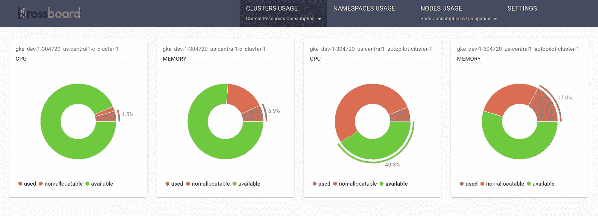
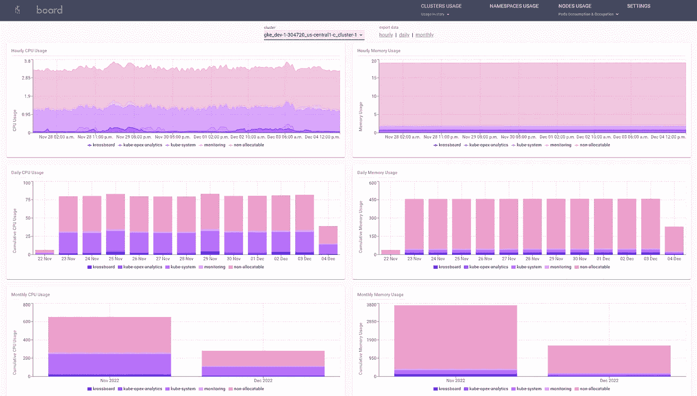
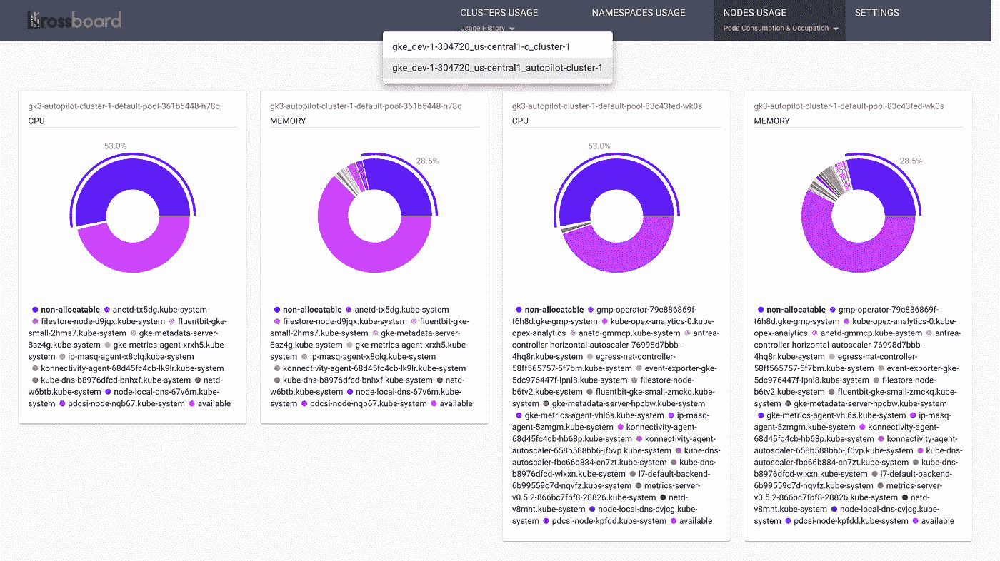
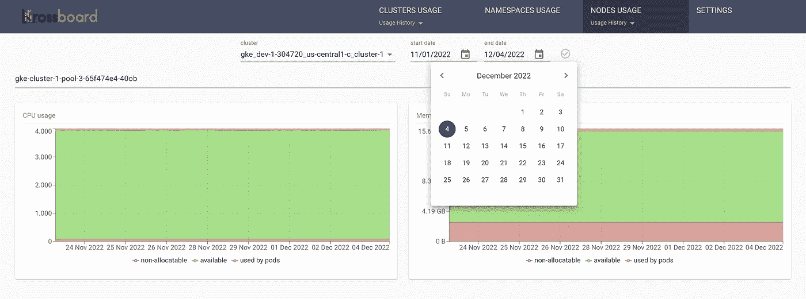

# 用于多集群使用跟踪、分析和记账的 Kubernetes 运营商

> 原文：<https://itnext.io/kubernetes-operator-for-multi-clusters-usage-tracking-analytics-and-accounting-dd69c14bdd38?source=collection_archive---------0----------------------->

## 一种开源的资源使用跟踪方法

**TL；近**这个故事介绍了[Krossboard Kubernetes Operator](https://github.com/2-alchemists/krossboard-kubernetes-operator)，这是一个开源的 Kubernetes Operator，可以快速设置和操作一个系统，用于多集群、交叉分布&跨站点使用情况跟踪、分析和记账(GKE、AKS、EKS、OpenShift 和其他分布；内部或云中)。

> [GitHub 页面](https://github.com/2-alchemists/krossboard-kubernetes-operator)



Krossboard —每个群集和每个资源类型(CPU/RAM)最近 5 分钟的整合使用情况

本故事的其余部分讨论了多 Kubernetes 使用跟踪的优势和挑战、Krossboard Operator 的建议、功能和截图，以及一个简短的入门程序。

# 多 Kubernetes 使用跟踪的优势和挑战

无需进一步证明相关的*使用情况跟踪是 Kubernetes 采用*的有效方法中的一项必需功能。如果您还不清楚这一点，让我们强调一下它的几个好处:*成本效益*通过跟踪您的 Kubernetes 集群在一段时间内的使用情况；*成本分摊* 通过核算您的不同应用、业务部门或合作伙伴如何使用您的 Kubernetes 资源；*通过分析每个 Kubernetes 集群资源随时间的消耗情况，跟踪资源的扩展/缩减*。

有一些工具，如 [kube-opex-analytics](https://github.com/rchakode/kube-opex-analytics) ，可以跟踪单个 Kubernetes 集群上的资源使用情况。当我们有几个 Kubernetes 集群时，事情就变得复杂了。事实上，浏览不同的集群以获得洞察力是非常困难的；不用说解决跨集群报告的困难。

# Krossboard Kubernetes 运营商简介

[Krossboard Kubernetes 操作员](https://github.com/2-alchemists/krossboard-kubernetes-operator)是一名操作员，能够在不到 15 分钟的时间内设置一个系统( *Krossboard)* 来跟踪、整合和记录您的多个 Kubernetes 集群的使用情况。Krossboard 在其管理的不同集群之上提供了一个跨分布和跨站点的分析和会计平台，具有以下优势:

*   ***每个命名空间和每个集群的长期(12 个月以上)分析和核算*** ，具有每小时整合趋势，以及自动每日和每月核算。
*   ***每集群跨命名空间整合使用情况跟踪和核算*** 内置图表和数据导出功能(CSV)。
*   ***跨集群整合使用情况跟踪和核算*** 内置图表内置图表和数据导出功能(CSV)。
*   ***每个集群和资源类型*** (例如 CPU、RAM)的 5 分钟最近整合使用情况。
*   ***跨分布和跨站点的 Kubernetes 实例*** 在本地和云中对 GKE、AKS、EKS、OpenShift、Rancher 和 vanilla Kubernetes 进行持续集成测试。

# Krossboard —分析和会计图表

Krossboard 具有以下主要的分析和会计功能(请查看它们的描述和截图):

*   每集群 5 分钟的最近整合利用率
*   每集群跨命名空间使用趋势、分析和核算
*   每节点 5 分钟最近占用
*   每个集群的整合利用率趋势

## 每集群 5 分钟的最近整合利用率

*每个群集和资源类型(CPU、RAM)每 5 分钟更新一次*，这些分析跟踪最后五分钟的整合利用率、空闲和保留/ *不可分配的*容量。


## 每集群跨命名空间分析

*基于每小时的趋势以及每日和每月的统计*，这些在每个 Kubernetes 集群范围内跟踪的分析跟踪了不同名称空间的资源利用情况。分析数据和图表还突出显示了预留的/ *不可分配的*容量。



## 每节点 5 分钟最近占用

对于每个群集和资源类型(CPU 和 RAM)，这些分析跟踪每个节点的资源利用率，同时突出显示每个 pod 的资源消耗以及预留的/ *不可分配的*容量。



## 一段时间内每个群集的整合利用率

对于每个群集和资源类型(例如 CPU 和 RAM)，这些分析会跟踪一段时间(长达 12 个月的历史)的整合利用率、可用容量和保留容量。

Krossboard 用户界面允许设置数据选择时间范围(参见下面截图上的*开始日期*和*结束日期*)。



# **入门**

开始使用很简单，只需进行以下三个步骤:

*   使用这一行命令部署操作员。

```
kubectl apply -f https://raw.githubusercontent.com/2-alchemists/krossboard-kubernetes-operator/main/config/releases/latest/krossboard/krossboard-kubernetes-operator.yaml
```

*   创建一个包含 KUBECONFIG 的秘密，该秘密有权访问您的 Kubernetes 集群并*读取*原始指标(参见如何[为 Krossboard](https://github.com/2-alchemists/krossboard-kubernetes-operator/blob/main/docs/create-kubeconfig-with-minimal-permissions.md) 设置具有最小权限的 KUBECONFIG)。

```
# replace /path/to/kubeconfig with path towards your KUBECONFIG
kubectl -n krossboard \
    create secret --type=Opaque generic krossboard-secrets \
    --from-file=kubeconfig=/path/to/kubeconfig
```

*   创建一个 Krossboard CR(自定义资源)实例

```
kubectl -n krossboard apply -f https://raw.githubusercontent.com/2-alchemists/krossboard-kubernetes-operator/main/config/releases/latest/krossboard/krossboard-deployment.yaml
```

更多详情，请查看我们在 GitHub 的官方文档:[https://GitHub . com/2-alchems/kross board-kubernetes-operator](https://github.com/2-alchemists/krossboard-kubernetes-operator)

# 结论

这个故事介绍了一个开源的 Kubernetes 运营商，它有助于解决多个 Kubernetes 集群之间的使用跟踪、分析和会计需求。Kubernetes 集群可以是任何发行版(GKE、AKS、EKS、OpenShift、vanilla Kubernetes 或其他)并且位于任何地方(内部或云中)；Krossboard 在一个中央位置以透明的方式处理使用情况跟踪、分析和会计。

试试看，不要犹豫，通过在 GitHub 打开一个拉请求来分享您的反馈或做出贡献:[https://GitHub . com/2-alchems/kross board-kubernetes-operator](https://github.com/2-alchemists/krossboard-kubernetes-operator)。