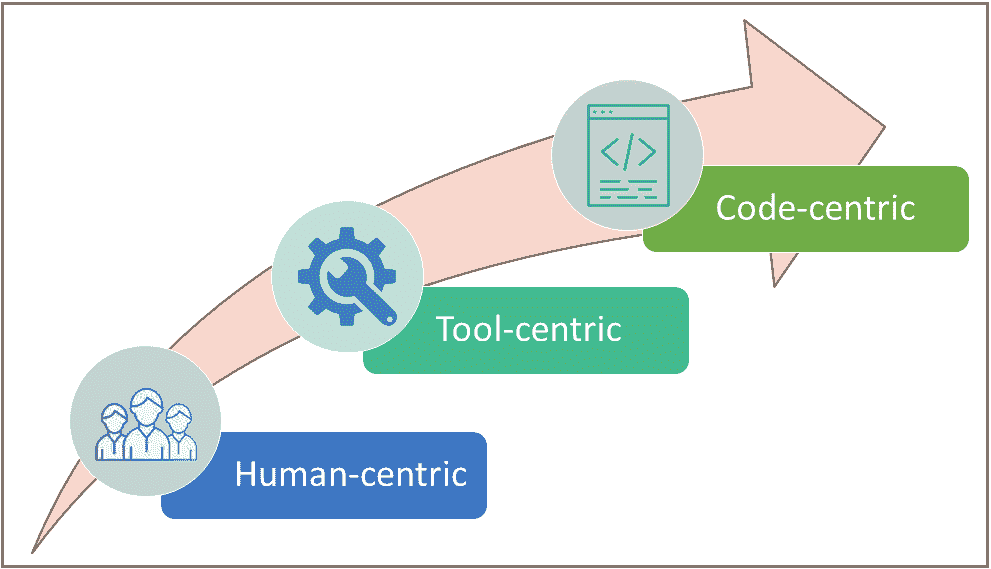
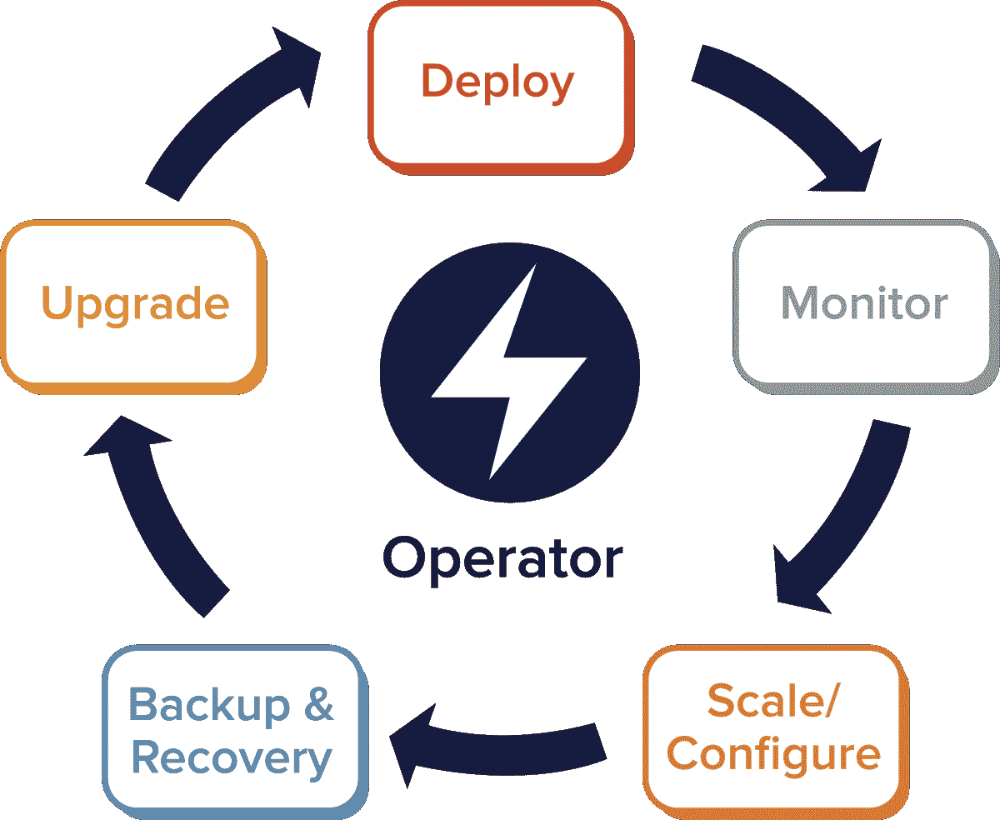
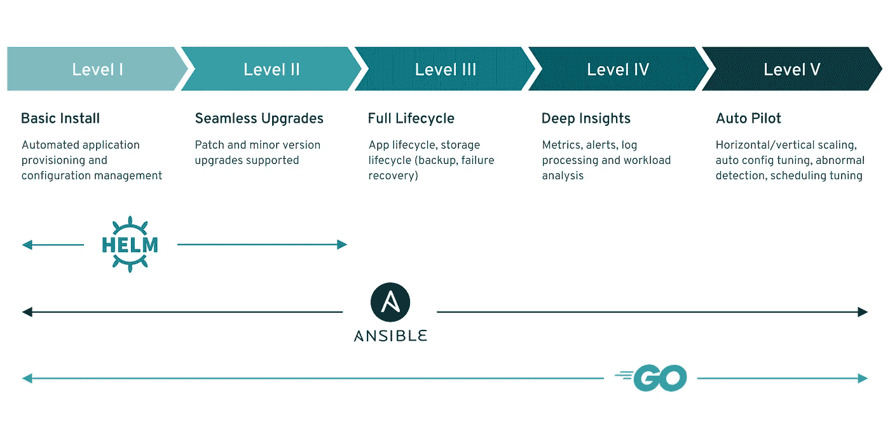
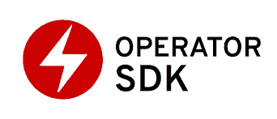

# Kubernetes 运营商:用于管理云原生应用的巡航控制

> 原文：<https://itnext.io/kubernetes-operators-cruise-control-for-managing-cloud-native-apps-db328ef8e345?source=collection_archive---------2----------------------->

# 简介:

管理生产中的应用程序一直是以人为中心的事情。大型运营团队的任务是管理正在运行的应用程序的日常运营。这些团队的专家对应用程序及其基础设施有着深刻的领域和功能知识，并且经常依靠英雄来拯救发生中断的一天。

当应用程序的数量及其复杂性开始增加时，效率低下和成本超支的情况就出现了。IT 组织求助于自动化工具来应对这些挑战。因此，运营团队变得更加以工具为中心，依赖工具、自动化和脚本来完成监控、警报、修补、备份/恢复等任务。

# 以代码为中心的应用管理:

在适当的时候，组织开始采用云原生应用程序和基础架构。设计和构建应用的基本方法发生了变化:云、容器和微服务占据了中心舞台，用户开始认为弹性、可伸缩性和弹性是理所当然的。这一趋势带来了新的挑战，并为广泛采用 DevOps 和 SRE 方法来提高运营效率铺平了道路。仅仅依靠人和工具来管理云原生应用程序于事无补。

答案是以代码为中心的方法来管理生产中的云原生应用。在以代码为中心的方法中，运营团队将自己转变为一组软件工程师，目标是整理管理云原生应用所需的所有领域知识和运营任务。代码成为管理应用程序的基本资产，随着人和工具在需要的地方增加。这种编码资产能够执行管理应用程序的所有操作任务。让我们将这种编码资产称为 Ops-App。一个 Ops-App 通常由 SREs 使用其管理的 App 所使用的相同语言、框架和构造来构建。Ops-App 处理 App 的所有操作活动，即。部署、升级、修补、备份/恢复、监控、警报、扩展等。

# 什么是 Kubernetes 操作员？

Kubernetes 允许我们从一组物理和虚拟服务器中汇集计算资源，并按需将这些资源提供给容器化的应用程序。它管理容器的生命周期，并提供各种关键功能:自动化、自我修复、持久卷、RBAC、自动伸缩等。

来源:谷歌图片

简单来说，Kubernetes 运营商是一个运行在 Kubernetes 上的容器化云原生应用的 Ops-App。Kubernetes 对一些基本的应用程序管理任务有内在的支持，如自我修复、扩展、监控等。Kubernetes 运营商将这些基本功能“放大”到一个完全成熟的 Ops-App 中，其中嵌入了该 App 的整个领域知识。它通过简单地扩展或增强托管应用程序的 Kubernetes 集群的功能来做到这一点(Kubernetes 允许用户通过一个称为自定义资源定义(CRD)的功能来添加新的 API 资源)。然后，用户可以使用本地 Kubernetes 命令行工具(kubectl)或 API 与 Ops-App 进行交互，就像用户与 Kubernetes 控制平面进行交互一样。此外，您可以在同一个 Kubernetes 集群中运行 App 和 Ops-App，从而允许您使用现有的 CI/CD 管道来管理 App 及其相应的 Ops-App 的发布。按照 Kubernetes 的说法，Ops-App 被称为运营商。

让我们假设开发团队已经编写了一个 Java Spring boot 应用程序，并将该应用程序封装到一个容器映像中。运营团队必须将该应用部署到生产 Kubernetes 集群中，并管理应用的生命周期。运营团队不会直接部署这个应用程序，而是为这个应用程序编写一个操作符。操作员“知道”如何以编程方式将应用部署到集群中，并提供正确的配置、资源要求等。运营商也可以采用比部署应用程序“更多”的方式编写:它知道如何应用补丁、部署升级、备份应用程序的数据、监控应用程序的指标、启动扩展、恢复备份等。只有在操作员无法完成任务时，才需要人工干预。因此，管理应用程序变得非常高效且成本优化。这是在 Kubernetes 中管理云原生应用的强大模式。

# 操作员能力水平

运营商对于其管理的应用或工作负载的生命周期管理能力有不同的成熟度级别。能力模型旨在提供术语方面的指导，以表达用户可以从运营商那里期望的功能。

操作员能力水平(来源:sdk.operatorframework.io)

每个能力级别都与运营商针对受管工作负载提供的一组特定管理功能相关联。不管理工作负载和/或委托集群外协调服务的运营商将保持在 1 级。能力级别是累积的，即 3 级能力需要 1 级和 2 级的所有能力。

# 操作员框架

来源:sdk.operatorframework.io

Kubernetes 运营商带来了管理容器化应用程序所需的效率。太棒了。然而，今天编写操作符可能很困难，因为存在一些挑战，比如使用低级 API、编写样板代码，以及缺乏导致重复的模块化。操作符框架消除了编写 Kubernetes 操作符的痛苦。它是一个开源的工具包，以一种有效的、自动化的、可扩展的方式管理操作员。它提供了一个可以下载的 SDK。参考这个[博客](https://medium.com/faun/writing-your-first-kubernetes-operator-8f3df4453234)来深入了解如何使用 Operator SDK 编写操作符。

如果你正在寻找预先构建的、随时可用的操作符，那么在 [operatorhub.io](https://operatorhub.io/) 中就可以找到。这是一个流行应用程序的开源操作符集合。您可以按原样使用它们，也可以下载源代码并根据您的用例进行修改。截至本文撰写之时，该知识库拥有从 Akka 到 Wildfly 等应用程序的 209 个运营商。你可以[提交](https://operatorhub.io/contribute)你的操作员到 operatorhub.io 让其他人发现和使用它。

# 结论:

Kubernetes 运营商在管理 Kubernetes 中的云原生应用程序方面非常有价值。如果您能够用编写和维护操作符的正确技能建立一组 sre，您将受益匪浅。我相信这篇文章有助于全面了解 Kubernetes 运营商及其优势。在评论区分享你的反馈。

👉我定期在 Kubernetes 和云原生技术上发微博。 *跟我上* [*推特*](https://twitter.com/senthilrch) *和* [*中*](https://medium.com/@senthilrch)

👉*查看*[*kube-edged*](https://github.com/senthilrch/kube-fledged)*，这是一个 kubernetes 操作器，用于直接在集群工作节点上创建和管理容器映像的缓存，因此应用程序 pods 几乎可以立即启动*