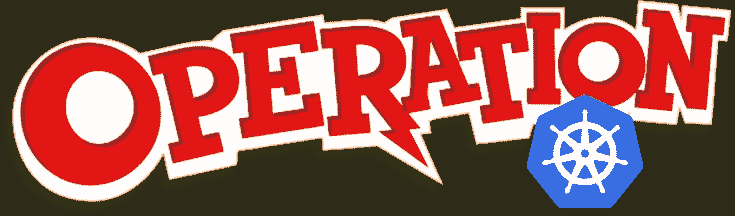
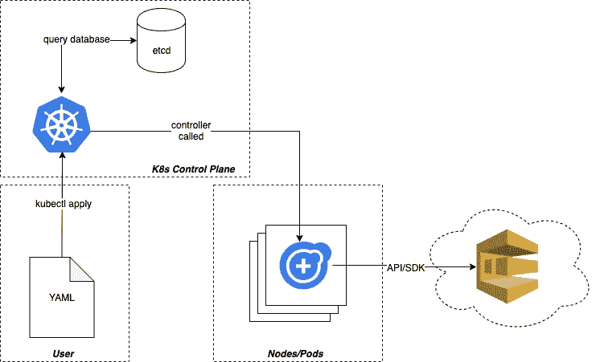
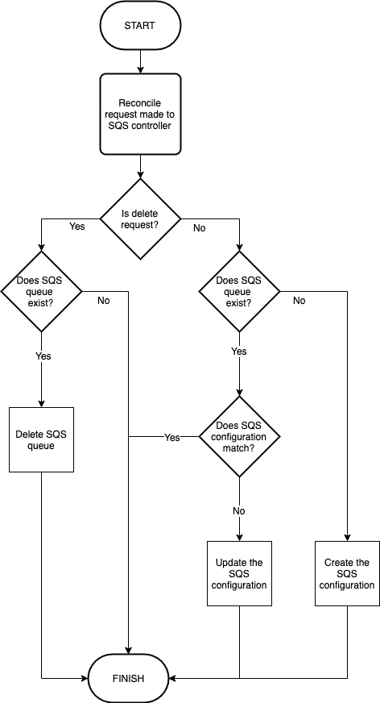

# Kubernetes 运营商…进入正题(逻辑)

> 原文：<https://itnext.io/kubernetes-operators-getting-down-to-business-logic-93d6f5303813?source=collection_archive---------1----------------------->

上个月，我写了一篇文章,讲述了我在理解用于在 Kubernetes 中构建定制状态管理组件的操作框架时所经历的挣扎。在这篇文章中，我想进一步阐述这些概念和发现，并深入一点技术细节。

**请注意:**我不打算在这里讨论“如何编写自定义操作符”，我将在以后的博客文章中讨论。这篇文章旨在更深入地探究什么是操作符以及它们是如何工作的。

# 快速回顾一下

所以首先让我们来看看我在之前的博文中介绍的一些基本概念:

*   操作符允许我们在 Kubernetes 生态系统中定义和封装定制的业务逻辑单元。
*   操作员允许我们定义、监控和恢复通常被认为是 Kubernetes 和/或容器外部的定制组件。
*   运营商让我们更接近我们的乌托邦梦想，即真正的 DevOps，我们的服务部署只不过是一个配置文件，我们的待命警报/电话永远不会 ping，因为我们的服务可以自我修复和扩展

现在我知道这一切似乎好得不像是真的；这很像一家软件公司的推销词，承诺世界但从不兑现，然而，如果你愿意做必要的跑腿工作，Kubernetes 可以让这成为现实。

# 我从哪里开始？

好了，在我们开始举例之前，我们需要先了解一些简单的“基础知识”。

*   Kubernetes 的核心只不过是一个监控系统；本质上是一个无限循环，不断监控它所知道的一切。
*   Kubernetes 监控的东西可以称为感知状态，与现实相比较，称为实际状态。
*   当 Kubernetes 检测到感知状态和实际状态之间的差异时，它会计算采取何种措施来使这两种状态匹配。

Kubernetes 在对账过程中可能采取的措施包括:

*   部署了应用程序的新版本；这意味着一旦新的 pod 稳定下来，就需要创建新的实例并删除旧的实例。
*   由于正在运行的 pod 变得不正常，正在创建服务的新 pod/实例。
*   因为用户发出了缩减或删除服务的请求而删除 pod。

这个列表*并不详尽*，只是让我们开始的几个例子。

# 是时候调和我们的分歧了

所以现在我们从状态的角度来思考。当 Kubernetes 决定某些东西不同步时会发生什么？

当检测到状态差异时，K8s 启动我们称之为**“协调”**的东西。当这种情况发生时，K8s 试图从本质上使现实与它被告知的现实应该是什么样子相匹配。请记住，当我们部署服务时，我们的 YAML 文件实际上是在告诉 Kubernetes“我希望世界是这样的”，一旦它实现了这一点，并且状态同步，它将返回到监控状态，等待状态差异出现。

在很大程度上，和解非常简单；旋转新的东西或拆除不想要的东西。但是 K8s 能做的不仅仅是启动和停止东西。所以让我们再深入一点，好吗？

# 真实世界的例子

好，让我们举一个高级场景的例子。假设我们想让 kubernetes 部署并监控 AWS SQS 的实例。这将允许我们部署新的 SQS 实例，作为我们在 YAML 的服务部署的一部分，然后让 kubernetes 为我们做所有的配置、维护和繁重的工作。

我讨厌陈述显而易见的事实，但是 **SQS 并不是在一个容器中运行**；它运行在 AWS 云平台中，那么 Kubernetes(一个容器编排平台)究竟如何帮助我们呢？

现在我要告诉你的是:

***不是所有我们需要通过 Kubernetes 管理的东西都需要在容器中运行。有时我们需要跳出传统的框框***

我知道没错…太棒了！

相反，我们需要的是在一个容器中运行的东西，这将允许我们与 SQS 互动。

# 运营商框架来救援！

没错，所以我们需要 K8s 能够处理有状态的东西，但是不管那个“有状态的东西”是什么，可能会也可能不会在 Kubernetes 生态系统中运行。太好了！

但是我们如何做到这一点呢？？？幸运的是，有一个叫做 Kubernetes 操作框架的东西可以帮助我们。最初由 CoreOS [开发的框架在 2018 年高调宣布](https://coreos.com/blog/introducing-operator-framework)。该框架为我们提供了所有需要的工具和指导，我们可以尝试在 Kubernetes 中构建名为 Operators 的扩展。但是它们到底是什么呢？

## 我的 TL；DR；运算符的定义:

> 操作符可以简单地看作是一个 RESTful API，它运行在 K8s 上的一个容器中。它们有控制器和动作(和所有 RESTful 服务一样)，每当需要进行协调时，K8s 就会调用它们。

## 但是，Kubernetes 如何知道调用哪个控制器呢？

当我们编写我们的操作符时，我们将创建定制的控制器，然后我们将使用 K8s 控制平面安装或注册我们的控制器。我们通过将我们的控制器挂接到一个叫做**控制器管理器**的东西来实现这一点。

但是即使注册了控制器，Kubernetes 如何知道哪个控制器做什么呢？所以还有最后一块拼图我们还没有看，Kubernetes 的一个关键概念/术语，它让操作框架完成它的工作；这就是 CRD 或自定义资源定义。

# CRD 不是垃圾

自定义资源是 Kubernetes API 的扩展，允许我们定义自己的复杂类型。就其本身而言，除了允许我们在 K8s 中存储和检索结构化数据之外，它们并不允许我们做更多的事情。

回想一下您的 YAML 文件，您在其中定义了您希望在集群中包含的内容。你总是定义你想要的东西的**种类**，这实质上是它的‘资源定义’。你可能已经遇到过一些了。想想豆荚、服务、秘密或部署；都是资源定义。它们只是碰巧是预装的默认设置。

现在我们了解了 CRD 的，我们可以看到，当我们通过 K8s 的控制器管理器组件将自定义资源与自定义控制器结合/绑定时，我们就可以真正开始创造奇迹了。

好，让我们来看一个非常简单的流程:

简化的 K8s CRD 控制器调节回路流量

那么在上面的简图中发生了什么呢:

*   用户使用“kubectl”通过 yaml 文件请求一个自定义资源的新实例(例如:SQS)。
*   这个请求通过 Kubernetes 控制平面进入 Kubernetes 系统，控制平面是 Kubernetes 实例的大脑和中枢。
*   Kubernetes 然后执行内部逻辑，查询它的 etcd 实例以确定是否需要任何动作。
*   Kubernetes 将当前状态与期望状态进行比较。
*   在这种情况下，我们想要一个新的 SQS，因此 Kubernetes 向我们的控制器发布了一条消息，注册为能够处理 SQS 类型的 CRD；说“嘿，我们需要和解”
*   我们的定制控制器就像节点内 pod 上的任何其他服务/应用程序一样运行。
*   当控制器被调用时，动作中的逻辑被执行，成功/失败被报告回控制平面。

# 把所有的放在一起

对，所以我们现在有了一个非常简单的想法，所有这些部分是如何在库伯内特土地上结合在一起的。但是让我们快速回顾一下:

*   一个 **CRD** (定制资源类型)允许我们通过 YAML 或 kubectl 请求新的定制资源。
*   一个**控制器**本质上是一个 RESTful 服务，它在一个节点上的容器内运行，并响应来自 K8s 控制平面的控制请求。
*   一个 **CRD 通过 K8s 内部的** **控制器管理器**绑定到一个控制器
*   **当感知状态(我们拥有的)和期望状态(我们想要的)之间存在差异时，K8s 将执行**协调循环**以尝试将状态恢复同步。**

## **当我们的控制器被调用时会发生什么？**

**坦白说，不管我们想让它做什么。这就是操作符的魅力所在，因为一旦你的控制器动作被调用，你就可以做任何你想做的事情。我不想让这篇文章在技术实现上陷入困境，所以为了简单起见，这里有一个简单的流程图来解释这段代码的结构:**

****

**一旦我执行了我需要的任何操作，并且我的业务逻辑得到了满足，我就可以向 Kubernetes 报告我的控制器已经完成了协调，然后 K8s 将继续监视。**

# **我们在下沉！还是应该同步？！？！**

**没错，我们有自己的控制器，它就在外面，我们可以通过使用 YAML 或 kubectl 来请求新资源、更改现有资源和删除资源。一切都很完美！我们离乌托邦式的开发运营梦想又近了一步！**

## **但是等等…如果有人来删除我们在 AWS 中的 SQS 队列会发生什么？！**

****

**恐慌的时候到了？！？！**

**幸运的是，由于 Operator 框架，我们还可以安排手动协调循环。是的，你没看错人；我们可以告诉 K8s，我们希望它在状态差异范围之外执行一个协调循环。您的用例可能不需要这样做，但是完全有可能编写业务逻辑来说“嘿，Kubernetes，我们现在都很好，但是在 *x 秒*之后回来再检查一次，好吗？-谢谢。**

**请记住，Kubernetes 对外部世界一无所知，因此如果我们希望能够对外部事件(SQS 删除等)做出反应，我们将需要在正常的状态更改流之外处理这些场景。现在就像变魔术一样，如果有人要删除我们的 SQS，它会神奇地在下一个调和循环中重新出现！**

****

**唷…那是一次惊险的经历**

# **提醒一句**

**你已经看到了操作符是如何让我们封装复杂的业务逻辑的。您还看到了我们如何通过协调循环维护外部状态。但是记住人们:**

*   **协调循环需要是非阻塞的。实现在几秒钟内阻塞 pod 资源的协调代码是一个糟糕的设计决策**
*   **想想你的上游依赖，不要 DDOS 他们。**
*   **考虑一下您的控制平面，如果您正在安排手动协调循环，并且您预计会有很多组件，请保守一些，因为您可能会削弱实例节点。**
*   **好好设计您的操作符，考虑向后兼容性，以防止在推出新版本时发生重大变化**

# **最后一点**

**我相信我们都看过著名的米老鼠场景，魔法师学徒，米老鼠找到了一种方法来自动化他的艰苦工作，但没有学会如何正确地控制它，导致混乱和失控的过程。我们以同样的方式考虑操作符。是的，它们非常强大，但是，仔细想想设计和结构；因为你最不希望的就是你的自动化失去控制**

****