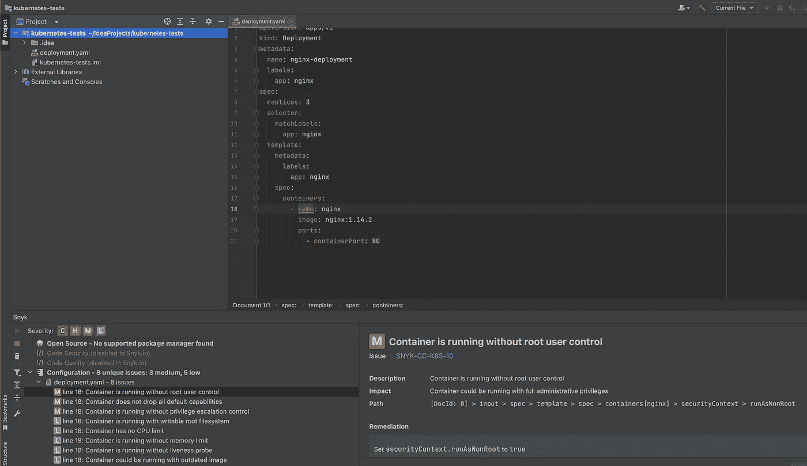

# Kubernetes OWASP 十大:集中政策执行

> 原文：<https://itnext.io/kubernetes-owasp-top-10-centralised-policy-enforcement-9adc53438e22?source=collection_archive---------1----------------------->

继我关于[不安全的工作负载配置](/kubernetes-owasp-top-10-insecure-workload-configurations-60818f0c68db)的文章之后，使用内置安全上下文也就到此为止了，开发人员和操作人员需要一定的信任来确保遵循策略。安全最薄弱的环节是人。无论是代码中的错误，测试中安全设置的删除，还是恶意的意图，人类都将系统置于风险之中，不管是有意还是无意。为了减轻这些风险，更安全的流程是使用自动化和工具来确保遵守策略。在库伯内特和 CNCF 地区，现有的工具能够帮助执行政策，或者可以扩展所采用的流程，以确保政策得到执行。

[摄德鲁港](https://unsplash.com/@drew_harbour?utm_source=medium&utm_medium=referral)在 [Unsplash](https://unsplash.com?utm_source=medium&utm_medium=referral)

## 现有流程:CI/CD

利用现有 CI/CD 管道中的测试和关口可以确保工作负载不会被部署到不符合策略的活动系统中。通过使用测试脚本作为 PR (pull request)步骤，确保策略所期望的任何安全上下文或任何其他 pardigm 在合并到分支或发送出去进行部署之前存在，并作为 CI/CD 系统的内置安全控制中的一个步骤来实施。

这样做的缺点是，所有检查都必须用代码手工编写，以便对 yaml 部署文件执行静态代码分析。它是可扩展的，但是管理开销很大，每个 Kubernetes 版本都会更新值和设置，在部署中使用其他工具时需要额外的工作，例如 helm 需要额外的步骤来确保提前生成 yaml 部署文件(例如 helm 模板),并且脚本需要单独更新和管理，这增加了出错的可能性。

利用现有 CI/CD 管道和基础设施的另一种方式是通过使用工具。像 KubeSec 或 T2 Snyk 的 IAC 插件(付费服务)这样的工具允许使用 gates，而不需要编写和管理脚本。这些工具利用针对不安全工作负载配置的内置检查，并输出分数或列出错误或不安全值。如果分数或特定设置不符合策略阈值，这有助于可视化所需的改进，甚至阻止部署。使用这种方法的问题可能是策略的特定目标可能很困难，例如对特定名称空间应用更严格的规则，或者基于您或您的组织认为是可接受风险的单个建议而使整个构建失败。

当然，为了能够利用这些流程，您需要首先使用 CI/CD 部署管道，这也是我强烈推荐的，因为存在人工操作员风险以及版本化的源代码控制，以便了解已经部署了什么、何时部署以及由谁部署。另一个要求是 Kubernetes 集群被充分锁定，只允许从 CI/CD 流程进行部署。如果没有这一点，操作员或威胁参与者可以通过使用 kubectl、helm 甚至 direct 从集群内的运行 pod 针对 API 直接部署到集群来绕过控制。

## Kubernetes 许可控制器

Kubernetes 准入控制器是一种直接在 Kubernetes 内部构建部署入口的方式。这些基本上是在进行添加、修改或删除时 Kubernetes API 调用的 webhooks。有两种类型的准入控制器，变异和验证。变异将获取试图部署到集群的清单，查找特定的值或设置，如果找到，则修改它们。验证准入控制器搜索部署，以确保满足特定的标准，并响应 Kubernetes API，无论它是否通过验证。

内置准入控制器的一个例子是 DefaultStorageClass。当一个群集中存在多个存储类别时，总会有一个默认类别。如果在尝试在工作负载中使用 PVC 时未定义 storageClass，则变异准入控制器将修改清单，以将默认 storageClass 的设置注入部署中。

库伯内特承认由[阿兰·斯科特](https://medium.com/u/cf043e176f4e?source=post_page-----9adc53438e22--------------------------------)

## Kubernetes 安全入场

在撰写本文时，Kubernetes 的 v1.25 有一个稳定的内置[准入控制器](https://kubernetes.io/docs/concepts/security/pod-security-admission)，它根据放置在名称空间上的标签利用不同的安全级别。Kubernetes 对哪些设置属于哪个类别发表了意见。定义的类别有:

*   特权—不提供任何限制。
*   基线—这是设置限制最少的基线安全配置。
*   Restricted —最严格的设置，遵循当前容器强化的最佳实践。

除了可以对工作负载设置的级别之外，还可以应用不同的审计级别。

*   审核—任何违规都将触发审核日志中的事件，但将被允许。
*   Warn —添加向用户显示的警告，但将被允许。
*   强制—任何违规都将导致工作负载被拒绝部署。

## OPA 和看门人

开放策略代理(OPA)项目是一个 CNCF 项目，作为声明性策略创建，使用一种通用语言用于多个生态系统，而不仅仅是 Kubernetes。这允许跨安全策略的标准化，无论工作负载部署在哪里或部署到什么类型的系统。

Gatekeeper 是 Kubernetes 准入控制器，它根据定义的策略及其结果与 OPA 和 gates 部署清单进行交互。

OPA 是可扩展的，因此不仅仅可以用于 securityContext 验证。例如，可以有一个允许部署映像的存储库列表，可以编写一个策略，以便这些存储库之外的任何映像都将失败，并且不会部署到集群中。

我不会介绍如何在集群中安装 OPA，这里有一些很棒的演示，也有帮助您快速启动和运行的导航图，但请给出一个示例，说明策略是如何应用于工作负载的，从约束模板开始。

约束模板列出了一个定制的资源定义规范，即稍后可以引用的 Kube API 对象，包括它可以采用的名称和参数，以及 rego 策略本身。这可以应用于集群并很好地设置准入规则。接下来，我们需要针对工作负载应用策略，在本例中是所有 pod。

从现在开始，一旦应用此选项，部署的没有以“https://scotta01.com”开头的 spec.container.image 的 pod 将被拒绝进入集群。

随着 OPA 针对多个系统进行标准化，它使用一种共同的语言，即减压阀语，因此在投资工具时需要考虑技能因素。然而，如果 OPA 可以在您的环境中被采用，而不仅仅是在 Kubernetes 中，那么考虑到 OPA 可以提供的广泛范围，投资成本应该会很快增加。

## IDE 林挺和插件

尽管技术上不是集中执行，ide 中利用的特性允许快速反馈给开发人员，以允许在开发生命周期的早期进行更改。这有助于培养安全的设计，并确保预先考虑安全的开发标准，而不是等到生命周期的后期，这可能需要很长时间来修复。

JetBains IDE 中的 Snyk 代码插件

## 摘要

对于如何实施安全策略，没有一种方法是万能的，但是，通过利用这些功能的组合，可以通过快速的开发人员/运营商反馈循环进行适当的控制部署，以确保安全部署，而不会对工作效率产生任何影响。