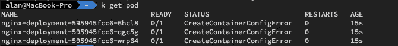
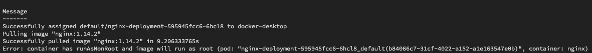

# Kubernetes OWASP 十大:不安全的工作负载配置

> 原文：<https://itnext.io/kubernetes-owasp-top-10-insecure-workload-configurations-60818f0c68db?source=collection_archive---------1----------------------->

继[关于前 10 位](https://medium.com/@scotta01/kubernetes-owasp-top-10-intro-73943be7add2)的概述之后，这是该系列的第一篇，深入探讨了所带来的风险以及减轻风险的方法的一些细节。


安托万·佩蒂特维尔在 [Unsplash](https://unsplash.com?utm_source=medium&utm_medium=referral) 上拍摄的照片

# 不安全的工作负载配置

首先，不安全的工作负载配置意味着什么？Kubernetes 具有极强的可扩展性，在拟定清单时可以设置许多设置。

示例部署清单

在这个例子中，连同许多教程和开源项目，它没有解决一些与运行容器相关的更常见的安全风险。securityContext 类型，可以在 pod 级别设置(并应用于 pod 中的所有容器)，也可以在单个容器级别设置(包括 Init 和临时容器)。

# 安全上下文

正如您在这个代码示例中看到的，有许多安全设置可以在 pod 和 contaier 级别设置。值得注意的是，同时在 PodSecurityContext 和 SecurityContext(容器级别)上设置的值，如果在两个地方都设置，则容器级别将优先，但是，如果在一个地方设置一个设置，而在另一个地方设置另一个设置，则它们都将生效。

我不会介绍每一种设置，但会介绍一些更常见的设置，并解释每种设置试图解决的风险。

## 特许的

为了理解这个设置，我们应该先快速入门/提醒一下 [Linux 功能](https://man7.org/linux/man-pages/man7/capabilities.7.html)。这些是用户可以对 Linux 主机的内核采取的特权操作的列表。传统上，root (UID 0)是超级用户，能够运行任何命令，而无需检查权限。这些权限被划分到一个功能列表中，这样就可以向非 root 用户授予更细粒度的访问权限，从而减少了以 root 用户身份运行进程的需要。特权允许访问主机上的这些内核功能。

简而言之，拥有特权的容器可以访问底层主机资源和内核，这打破了容器隔离。一个进程实际上很少需要完全特权访问，并且通常不需要特权能力。同样值得注意的是，特权的使用规避了其他安全控制，比如 seccomp 和 apparmor 提供的安全控制，或者内置的容器运行时限制。

```
privileged: false
```

## 能力

如果您确定一个容器确实需要一个特定的 syscall，那么您可以设置一个特定的能力，而不是授予完全的特权。

nginx web 服务器就是一个很好的例子。默认情况下，此映像以 root 身份运行，因为它需要 NET_BIND 功能才能绑定到低于 1024 的端口，即 80 和 443。然而，这使得容器运行在一个超特权状态，能够在容器环境中执行系统调用。我们可以使用 capabilities 标记来删除所有功能，只授予绝对需要的功能。

具有功能集的 nginx 部署

## allowPrivilegeEscalation

为了继续使用 nginx 示例，我们可以进一步改进它。当一个容器启动时，它由一个父进程产生，该父进程具有在部署时授予的权限。在运行时，可以提升子进程的特权，使其比父进程的特权更高。

我将使用 sudo 的 linux 命令来实际说明这意味着什么，这是过于简化了，但只是为了说明。

当我们打开一个终端时，我们会产生一个进程，通常是一个 shell，比如 sh、bash、zsh 等等。这成为父进程，当我们与外壳交互时，执行二进制文件，如 ls、cat、cp 等。这些是从父进程派生出来的 chid 进程，拥有第一个打开外壳的用户的特权。如果用户需要比正常情况下更多的访问权限，通常会利用 sudo(**s**super**u**ser**do**)的便利在短时间内将权限提升到 root 用户。当用户在运行 sudo 之后在 shell 中运行一个命令时，他们现在拥有的特权比从中派生命令的父进程更大。

设置 allowprivilegescalation:false，阻止这类行为在我们的容器中发生，给它们分配可预测的权限，而不是更多。

## **运行用户/运行组**

这和罐头上说的差不多。您正在做出决策，以确保容器流程使用的是什么用户或组，并且在部署之前已经定义。如果我们从头开始构建映像，这是一个简单的过程，因为我们可以完全控制堆栈，并且知道哪个用户被配置为运行以及在哪个组中运行。UID 和 GID 可以在安全策略中定义，确保容器不能作为不同的用户或组启动。

```
runAsUser: 1000
runAsGroup: 1001
```

但是，更有可能的是，将使用源自第三方 repo(如 Docker Hub)的基本映像。理解你所依赖的任何软件，确保它是安全的，并且如你所期望的那样运行，这是一个很好的实践，但是对于容器，这种努力的一部分是知道容器被配置为以什么用户的身份运行。以下是我们可以检查的方法。

**Dockerfile —用户指令**

**Dockerfile —命令**

**从容器内**

有时这并不明显，所以通常执行图像并运行 whoami、id 或查看/etc/passwd 来获得线索，这取决于图像中的可用内容。

使用来自基于阿尔卑斯山的图像的 id 作为例子。

```
$ id
uid=101(nginx) gid=101(nginx) groups=101(nginx)
```

值得注意的是，映像用户在特定映像中可能因标签而异，这通常是由于基本的操作系统约定，因此值得检查。

## runAsNonRoot

与 runAsUser 结合使用，runAsNonRoot 可以确保容器不能以 Root 用户的身份执行。随着映像提供商强化他们提供的基础映像，使用 root 的理由越来越少。这有助于防止对 Dockerfile 文件进行任何试图提升权限的修改，因为如果设置了此设置并且容器以 root 用户身份执行，容器将无法启动。

## readOnlyRootFileSystem 文件系统

容器存在的一个威胁是攻击者能够改变容器中运行的内容，改变设置和配置文件。通过在数据库或外部安装的卷中使用无状态容器和宿主状态，允许容器文件系统是只读的，以确保正在运行的容器不会被篡改。需要对每种映像类型进行测试，以确保没有任何意外写入尝试导致故障。我以前遇到过这种情况，容器试图写入一个设置文件，而不是在启动时，所以错误被记录下来，所以要确保有一个全面的测试机制。

## 影响

如果这些安全上下文设置中的大部分被违反，则后果是 Pod 将抛出错误并且无法启动，或者错误将在应用程序中开始记录，其中它不能执行预期的功能。

这里，当我启动 nginx 部署时，容器无法创建



如果我在一个失败的 pod 上运行 describe，我们可以看到原因，当安全上下文被设置为以非 root 身份运行时，容器试图以 root 身份运行



```
kubelet Error: container has runAsNonRoot and image will run as root
```

## 摘要

这绝不是可用于强化的安全环境的详尽列表，更重要的是，防止安全错误配置的门户部署，但是应该提供一个良好的起点。如果你想更深入地了解，请查看 [Kubernetes 关于安全环境的文档](https://medium.com/@scotta01/kubernetes-owasp-top-10-insecure-workload-configurations-60818f0c68db)或查看 [OWASP Top 10](https://owasp.org/www-project-kubernetes-top-ten/) 的其余部分。