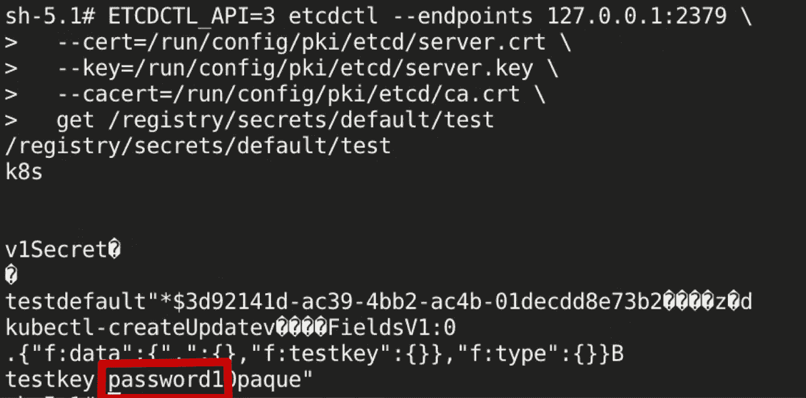
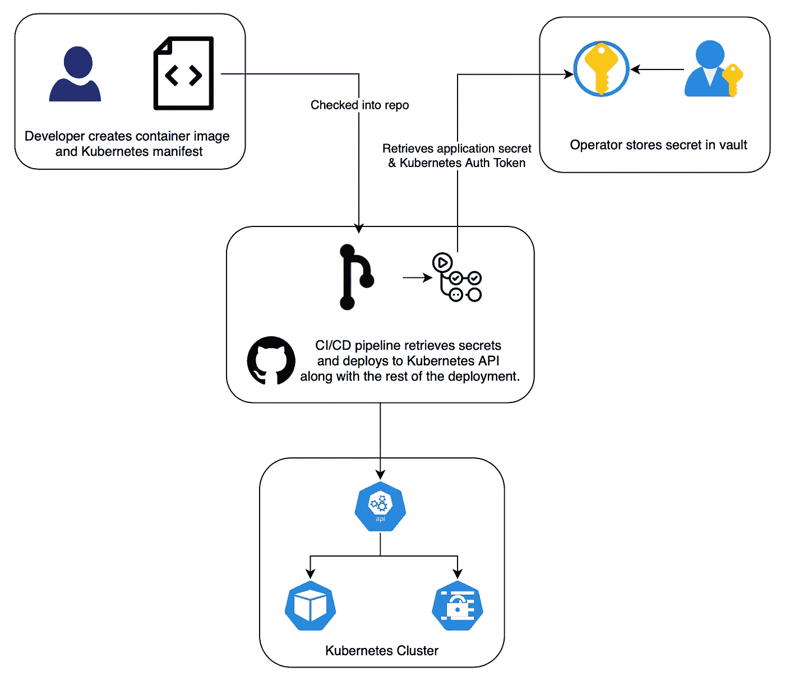
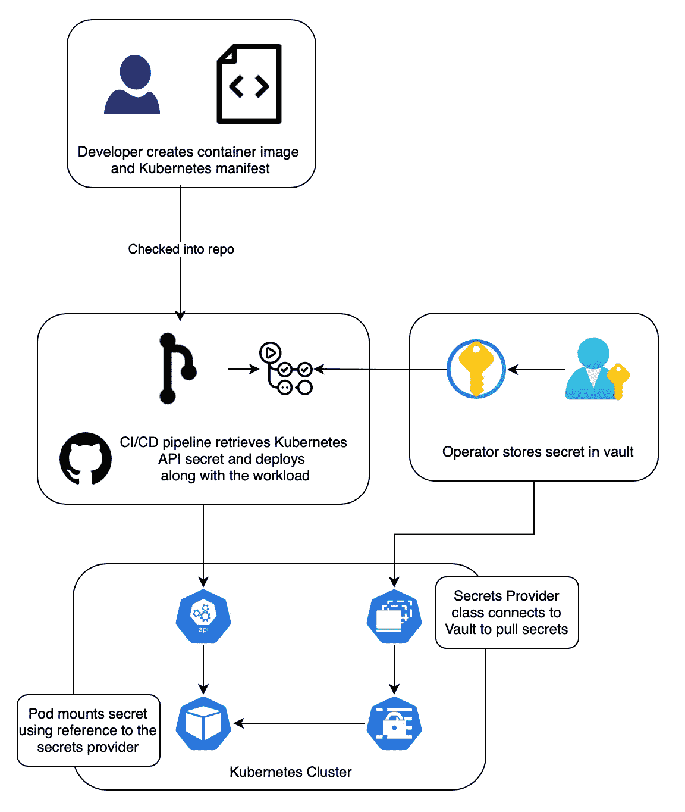

# Kubernetes OWASP 十大:秘密管理

> 原文：<https://itnext.io/kubernetes-owasp-top-10-secrets-management-c996faa87b47?source=collection_archive---------1----------------------->

在我的 [Kubernetes OWASP 前 10 名](https://owasp.org/www-project-kubernetes-top-ten/)摘要的最新条目中，我将重点介绍秘密管理。可以说，秘密管理，不仅在 Kubernetes 的环境中，而且在整个行业中，都是正确处理安全问题的最重要的方面之一。无论是用于证明身份的 API 密钥，还是用于确保传输中或静态加密的证书和密钥，如果管理不当，机密都会对任何给定服务的整体机密性、完整性和可用性造成灾难性后果。

在我深入 Kubernetes 中秘密的技术细节之前，有一些秘密管理的基础知识应该有助于将秘密泄露的风险保持在尽可能低的水平。

*   机密应该允许对相关系统进行足够的访问。这确保了不会出现一个秘密暴露整个庄园的“王国之钥”场景。
*   秘密的范围应该是有限的。
*   RBAC 对秘密商店的严格控制。
*   职责分离，例如，管理密钥存储控制平面的人不应该使用同一组凭证来访问数据平面(即秘密本身)
*   PKI(**Private**Key infra structure)应该就是那个，Private。限制私钥的任何移动和共享。

## 库伯内特的秘密

Kubernetes 有一个本地秘密类型，这允许识别和分离应该是秘密的配置。它只是一种类型，为了便于识别而被分开，并且要求存储在其中的数据是 base64 编码的。注意它们是经过编码的**而不是**加密的。



查看 etcd Kubernetes 数据存储，默认情况下，这些是不加密的。

Kubernetes 需要配置为加密所有秘密。这可以通过使用一个*encryption configuration*Kubernetes 对象来实现，API 可以在与 etcd 数据存储通信时使用该对象。

Kubernetes 加密配置示例

Kubernetes 支持多个加密提供商，其强度和速度因需求而异。

加密提供商

*   身份—默认提供者，不加密静态对象，但仅限于允许的用户(即非匿名、公共访问)
*   secretbox —利用 XSalsa20 和 Poly1305 的新型加密标准
*   AES GCM—AES-GCM—建议每 20 万次写入进行一次密钥轮换
*   aescbc — AES-CBC —由于已知的缺点，不再推荐使用。
*   KMS——外部密钥管理服务，具有利用 HSM 能力的额外好处。
    —[Azure key vault](https://learn.microsoft.com/en-us/azure/aks/use-kms-etcd-encryption)
    —[AWS KMS](https://docs.aws.amazon.com/eks/latest/userguide/enable-kms.html)
    —[GCP 云 KMS](https://cloud.google.com/kubernetes-engine/docs/how-to/encrypting-secrets#existing-cluster)

一旦创建了加密配置，就需要配置 Kubernetes API 服务器来使用它。

*   向 API 服务器添加 encryption-provider-config 开关。
*   创建一个包含加密配置清单的卷
*   在 API pod 中挂载卷，确保它以只读方式挂载在为传递给 API 的 encryption-provider-config 开关提供的路径中。
*   重新启动 API 服务器。

**重要提示:现有机密不会被加密，只有添加配置后的新机密才会被加密。为了能够在加密之前加密机密，必须删除并重新创建它们。**

# 管理 Kubernetes 的秘密

有几种方法可以让秘密进入 Kubernetes，最少的人类互动的方法是首选，减少社会工程或泄漏的风险。

*   通过 CLI 输入密码。
*   使用 CI/CD 管道。
*   Kubernetes Secrets Store 容器存储接口(CSI)

## 手动秘密创建

通常通过 kubectl CLI 接口使用 Kubernetes REST API 是获取 Kubernetes 秘密的常见方式。

使用 kubectl 可以创建 3 种类型的秘密

*   通用/不透明—标准密钥/值成对机密
*   docker-registry —提取容器图像的凭证
*   TLS —证书和相关密钥

除了使用 kubectl 的不同类型的秘密之外，还有不同的方法来获取 API 服务器的秘密。

**kubectl 创建秘密类属**

*   — from-literal:逐字键入密钥

```
kubectl create secret generic secretname --from-literal=password=password1 --from-literal=username=user1
```

*   — from-file(或— from-env-file):使用一个存储文件，其中的凭据以明文形式存储

```
kubectl create secret generic secretname --from-file=password=./password.txt --from-file=username=./user.txt
```

**使用清单**

*   在 yaml 或 json 清单中创建一个 Kubernetes 秘密对象
*   用 base64 编码秘密

*   将清单应用到 API 服务器

```
kubectl apply -f ./secret.yaml
```

请注意，所有手动创建的机密是如何向创建或更新机密的操作员/开发人员公开的。这增加了一个风险，即每个开发人员都可以访问这个秘密以便能够使用它。更好的方法是安全地存储秘密，并自动创建秘密。

## CI/CD 管道中的秘密

自动化是帮助确保秘密保密的关键。手动交互引入了不必要地知道秘密的风险。



CI/CD 管道流程示例

通过使用自动化过程，允许秘密保护的附加方法

*   开发者不必要求获得生产系统的秘密。在秘密创建/管理和开发者之间分离角色。
*   可以将对秘密存储的访问限制为管道帐户。
*   减少签入源代码库的秘密的发生率。

使用自动化管道时的注意事项。

*   确保秘密不被记录在日志中，大多数管道软件能够标记秘密以在日志中排除或屏蔽。
*   确保在生成代理上清除缓存，并且在运行后无法检索缓存。

## Kubernetes Secrets Store 容器存储接口(CSI)

Secrets Store CSI 是 Kubernetes API 的一个扩展，它将第三方 secret store/vault 直接连接到需要秘密并作为存储安装的 pod。

这种方法允许需要访问机密的工作负载直接访问机密。这样做的好处是，Kubernetes 的秘密将只在使用时生成，因此只在需要它的工作负载期间存在。



秘密存储 CSI 直接连接到保险库，为 pod 提供秘密

支持的机密存储

*   自动警报系统
*   蔚蓝的
*   GCP
*   哈希公司金库

# 摘要

正如您所看到的，秘密管理是一个广泛的主题，值得进一步的文章来深入探讨。应该在开发生命周期的设计阶段考虑机密管理，确保机密被正确传递，并降低泄露敏感数据的风险。

## 参考

[Kubernetes —加密静态秘密](https://kubernetes.io/docs/tasks/administer-cluster/encrypt-data/)

[秘密商店老何司机](https://secrets-store-csi-driver.sigs.k8s.io/introduction.html)

[库伯内特的秘密](https://kubernetes.io/docs/concepts/configuration/secret/)