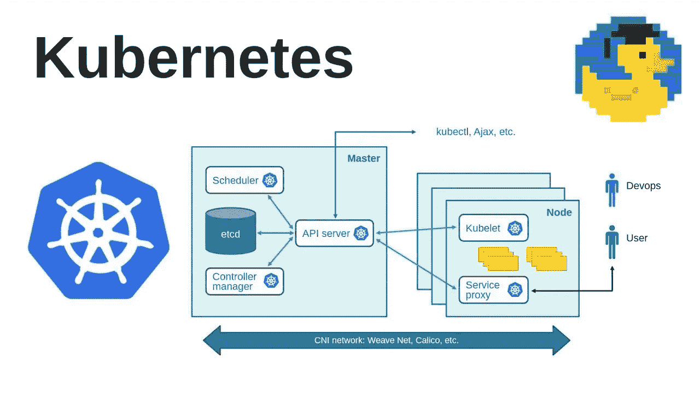
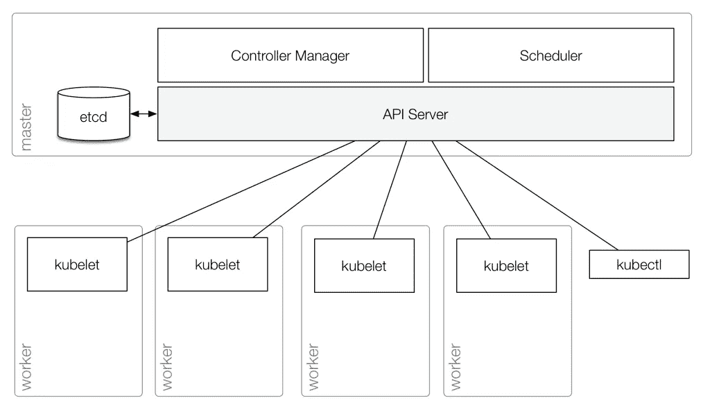
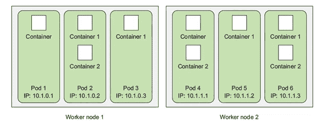
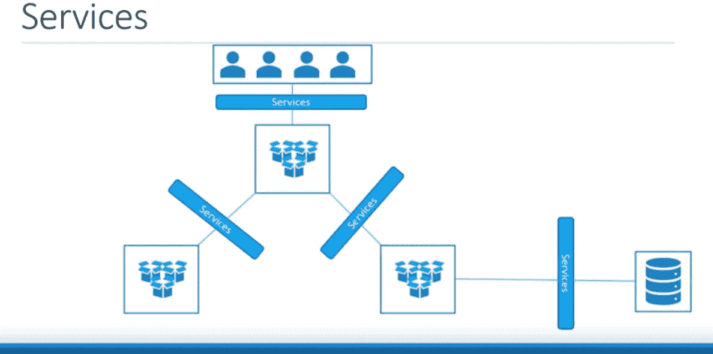
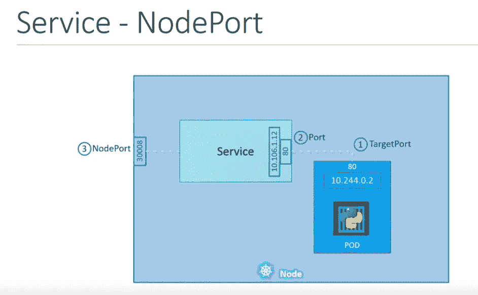
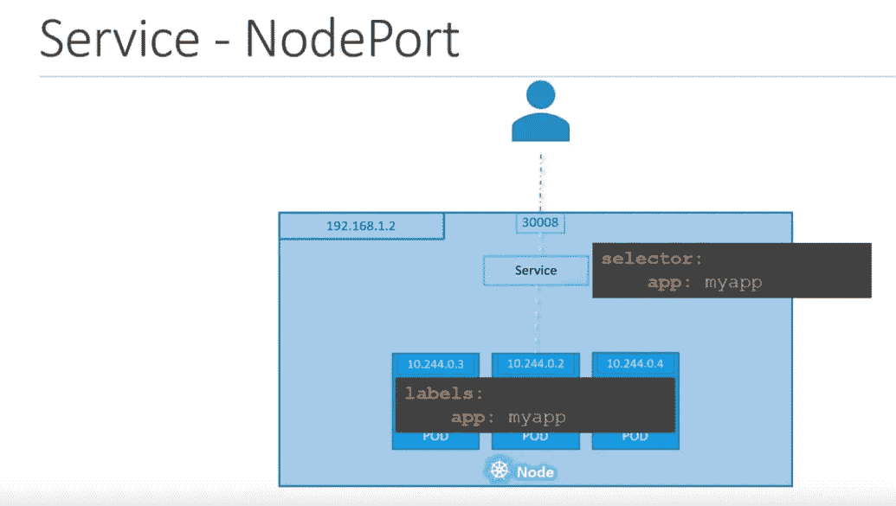
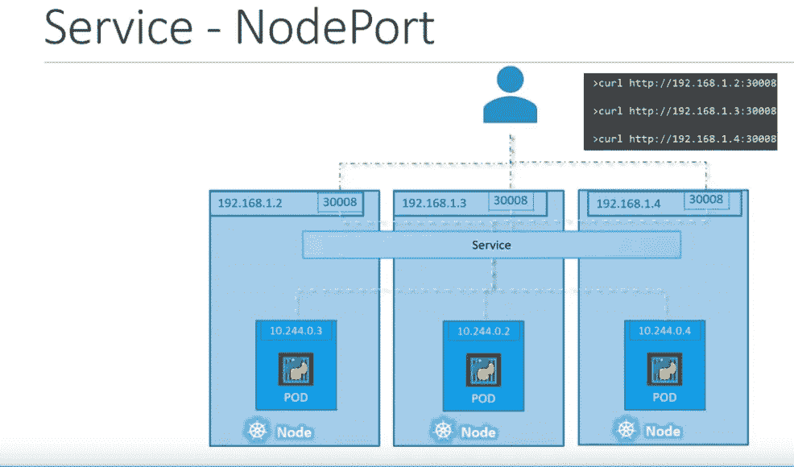

# Kubernetes:第 1 部分—架构和主要组件概述

> 原文：<https://itnext.io/kubernetes-part-1-architecture-and-main-components-overview-a9ce97264a74?source=collection_archive---------7----------------------->


在我目前的移动应用项目中，我们在 Yii PHP-framework 上有一个 API-backend，它现在工作在一个普通的 LEMP 堆栈上——Linux/NGINX/PHP-FPM/MySQL(AWS EC2+Maria db RDS)。

最终，是时候将这个庞然大物分解成微服务了，这些微服务将由 Kubernetes 精心编排，并在 EKS 的服务上运行。

在这篇文章中，我们将简要概述 Kubernetes 的主要组件及其架构，在接下来的文章中，我们将更深入地了解它的配置和使用，以及 AWS EKS 的例子。

在这篇文章中有很多有用的链接，但是请记住一个事实，Kubernetes 发展非常快，所以任何例子都可能在几个月内过时。

下一个帖子:

*   [Kubernetes:第 2 部分—利用 AWS 云提供商和 AWS 负载平衡器在 AWS 上建立集群](https://rtfm.co.ua/en/kubernetes-part-2-a-cluster-set-up-on-aws-with-aws-cloud-provider-and-aws-loadbalancer/)
*   [Kubernetes:第 3 部分— AWS EKS 概述和手动 EKS 集群设置](https://rtfm.co.ua/en/kubernetes-part-3-aws-eks-overview-and-manual-eks-cluster-set-up/)

*   [架构——概述](#4bcd)
*   [主节点](#a8a6)
*   [工人节点](#24b2)
*   [组件交互](#23d0)
*   [Kubernetes 抽象概念](#6d08)
*   [Pod](#a6ad)
*   [服务](#de1d)
*   [卷](#b95b)
*   [名称空间](#dabb)
*   [控制器](#cfb7)

## 建筑——概述

一般来说，Kubernetes 集群组件如下所示:



或者更简单一点:



集群本身由一个或多个*主节点*和一个或多个*工作节点*组成。

## 主网点

运行在主节点上的服务称为“[*”Kubernetes 控制平面*](https://kubernetes.io/docs/concepts/#kubernetes-control-plane) ”(不包括`etcd`)，主节点仅用于管理任务，而包含您的服务的容器将在工作节点上创建。

Kubernetes 核心服务又称 Kubernetes 控制平面

*   [Kubernetes 主组件:Etcd、API 服务器、控制器管理器和调度器](https://medium.com/jorgeacetozi/kubernetes-master-components-etcd-api-server-controller-manager-and-scheduler-3a0179fc8186)

在主节点上，有三个主要的 Kubernetes 组件使整个集群工作:

*   `[kube-apiserver](https://kubernetes.io/docs/reference/command-line-tools-reference/kube-apiserver/)`
*   对集群的所有请求的主入口点，例如`kubectl`命令将作为 API 请求发送到主节点上的`[kube-apiserver](https://kubernetes.io/docs/reference/command-line-tools-reference/kube-apiserver/)`
*   API 服务器为所有 REST 请求提供服务，验证它们并将其发送给`etcd` (API 服务器是唯一一个与`etcd`对话的服务——所有其他组件将与 API 本身对话，API 服务器将依次更新`etcd`中的数据，参见*组件交互*)
*   API 服务器还负责认证和授权
*   `[kube-scheduler](https://kubernetes.io/docs/reference/command-line-tools-reference/kube-scheduler/)`
*   决定哪个工作节点 w 将用于新的 Pod 创建(请参见。 [*Pod*](https://rtfm.co.ua/en/?p=21104#Pod) )取决于请求的资源和节点使用情况
*   `[kube-controller-manager](https://kubernetes.io/docs/reference/command-line-tools-reference/kube-controller-manager/)`
*   用于[控制器](https://kubernetes.io/docs/concepts/overview/components/#kube-controller-manager)的守护程序，例如*复制控制器*、*端点控制器、*和*名称空间控制器*
*   通过 API 服务器定期比较集群状态，并应用必要的更改
*   也用于 Linux 名称空间(参见[什么是:Linux 名称空间，примеры PID и网络名称空间](https://rtfm.co.ua/what-is-linux-namespaces-primery-na-c-clone-pid-i-net-namespaces/)， *Rus* )的创建和管理以及垃圾收集

`etcd`

*   [etcd.io](https://etcd.io/)

是 Kubernetes 用于[服务发现](https://en.wikipedia.org/wiki/Service_discovery)和配置管理的*键:值*存储。

此外，它保持集群的*当前*和*期望*状态:如果 K8s 将发现这些状态之间的区别，它将应用*期望*状态，使其成为*当前*状态。

## 工作节点

Worker Node(以前称为 *minion* ) —一个虚拟或裸机服务器，带有 Kuberners 组件来创建和管理 Pod(参见 [*Pod*](https://rtfm.co.ua/en/?p=21104#Pod) )。

这些组成部分是:

*   `[kubelet](https://kubernetes.io/docs/reference/command-line-tools-reference/kubelet/)`:每个集群节点上的主 Kubernetes 组件，它与 API 服务器对话，以检查当前 Worker 节点上是否有要创建的新 Pods
*   它通过 API 与 Docker 守护进程(或其他容器系统，如`[rkt](https://coreos.com/rkt/)`或`[containerd](https://containerd.io/)`)通信，以创建和管理容器
*   在节点上的 Pod 中发生任何更改后，会将它们发送到 API 服务器，然后 API 服务器会将它们保存到`etcd`数据库中
*   执行容器监控
*   `[kube-proxy](https://kubernetes.io/docs/reference/command-line-tools-reference/kube-proxy/)`:类似于一个反向代理服务，将请求转发到 Kubernetes 私有网络中的适当服务或应用程序
*   默认使用 [IPTABLES](https://rtfm.co.ua/linux-iptables-rukovodstvo-chast-1-osnovy-iptables/) (您可以通过`kubectl -n kube-system exec -ti kube-proxy-5ctt2 -- iptables --table nat --list`命令检查现有规则)
*   看吧。[了解 Kubernetes Kube-Proxy](https://supergiant.io/blog/understanding-kubernetes-kube-proxy/)

## 组件交互

创建新 Pod 时的示例:

1.  `kubectl`将向 API 服务器发送请求
2.  API 服务器将对其进行验证，并发送给`etcd`
3.  `etcd`将回复 API，请求被接受并保存在数据库中
4.  API 服务器将与`kube-scheduler`对话
5.  `kube-scheduler`将选择一个工人节点来创建一个新的 Pod 并将该信息发送回 API 服务器
6.  API 服务器会将此信息发送给`etcd`
7.  `etcd`会回复它已接受并保存的数据
8.  API 服务器与所选工作节点上的`kubelet`对话
9.  `kubelet`将通过其 API 与 Docker 守护进程(或另一个使用的[容器运行时](https://kubernetes.io/docs/setup/production-environment/container-runtimes/)对话，以创建一个新的容器
10.  `kubelet`将把关于新 Pod 的信息发送回 API 服务器
11.  API 服务器将更新`etcd`中的信息

## Kubernetes 抽象

上面我们谈到了或多或少“可触摸”的东西，如虚拟机、网络、IP 地址等等。

但是 Kubernetes 本身只是一大块…抽象:-)放置在物理或虚拟基础设施上。

因此，Kubernetes 有许多自己的对象，这些对象是 Kubernetes 的抽象或逻辑组件。

## 豆荚

Pod—Kubernetes 集群中的主要逻辑单元。

本质上，Pod 是 Kubernetes 集群中的一种虚拟机:它有自己的私有 IP、主机名、共享卷等(参见。 [*卷*](https://rtfm.co.ua/en/?p=21104#Volumes) )。

Pod 是一个部署单元(参见 [*部署*](https://rtfm.co.ua/en/?p=21104#Deployment) ),在这个“虚拟机”内部将创建一个或多个容器，这些容器由一个共同的目标联系在一起，并且是一个运行一个或多个进程的逻辑应用程序。

每个这样的 pod 都被指定为运行和服务一个应用程序的唯一副本:如果您想要进行水平扩展，您需要为每个工作节点使用一个专用的 Pod。



这样一个被称为*的节点组复制了 pod*并由一个专用控制器管理(见 [*控制器*](https://rtfm.co.ua/?p=21053#Conrtollers) )。

在这样做的时候，容器本身不是 Kubernetes 集群对象，它们不是由 Kubernetes 直接管理的，而是——Kubernetes 管理 Pod，而这个 Pod 内部的容器共享其名称空间，包括 IP 地址和端口，并且可以通过 *localhost* 相互通信(因为 Pod 就像一个 VM)。

Pod 的模板示例:

```
apiVersion: v1
kind: Pod
metadata:
  name: my-pod
  labels:
    app: my-app
    type: front-app

spec:
  containers:
  - name: nginx-container
    image: nginx
```

## 服务

链接:

*   [服务](https://kubernetes.io/docs/concepts/services-networking/service/)
*   [Kubernetes 服务:初学者指南](https://www.bmc.com/blogs/kubernetes-services/)
*   [Kubernetes —服务说明](https://www.youtube.com/watch?v=5lzUpDtmWgM)

首先，服务是 Kubernetes 集群中关于网络的一切。

它们用于应用程序内部和外部组件之间的通信。

基本上，服务是与 [*Pod*](https://rtfm.co.ua/?p=21053#Pod) ， [*ReplicaSets*](https://rtfm.co.ua/?p=21053#ReplicaSet) ， [*DaemonSet*](https://rtfm.co.ua/?p=21053#DaemonSet) 相同的 Kubernetes 对象，您可以将服务想象成集群节点内的专用虚拟机。

它们可以显示为下一个:



这里有一个用户通过一个服务连接到一个前端应用程序，然后这个前端使用两个附加服务与两个后端应用程序对话，后端通过另一个服务与一个数据库服务通信。

`ClusterIP`

将通过群集的内部 IP 开放对应用程序的访问，因此可以从群集内部访问。

是默认的服务类型。

`NodePort`

此服务类型将使用工作节点的静态 IP 开放对应用程序的访问。

此外，automatically 将为应用程序创建一个`ClusterIP`服务来路由来自`NodePort`的流量。



这里:

*   *30008* —工作节点上可用于连接到`NodePort`服务的外部端口必须在 30000 - 32767 端口范围内
*   `NodePort`服务于`ClusterIP`、自身端口(*端口*)和来自`serviceSubnet`模块的 IP
*   内部有应用程序的 Pod—Pod 将接受到其端口 80 ( *目标端口*)的新连接，并拥有来自`podSubnet`块的 IP

使用`kubeadm config view`命令可以找到这些网络:

```
root@k8s-master:~# kubeadm config view
apiServer:
extraArgs:
authorization-mode: Node,RBAC
timeoutForControlPlane: 4m0s
apiVersion: kubeadm.k8s.io/v1beta2
certificatesDir: /etc/kubernetes/pki
clusterName: kubernetes
controllerManager: {}
dns:
type: CoreDNS
etcd:
local:
dataDir: /var/lib/etcd
imageRepository: k8s.gcr.io
kind: ClusterConfiguration
kubernetesVersion: v1.15.0
networking:
dnsDomain: cluster.local
podSubnet: 10.244.0.0/16
serviceSubnet: 10.96.0.0/12
scheduler: {}
```

同样，您可以想象一个服务，就像您的 Worker 节点中的另一个 VM，就像 Pods 一样。

一个`NodePort`服务的模板示例:

```
apiVersion: v1
kind: Service
metadata:
  name: my-svc

spec:
  type: NodePort
  ports:
    - targetPort: 80
      port: 80
      nodePort: 30008
  selector:
    app: my-app
    type: front-app
```

**服务、Pod、标签、选择器**

*   [标签和选择器](https://kubernetes.io/docs/concepts/overview/working-with-objects/labels/)

为了让服务区分必须使用哪个 Pod 来路由流量，使用了`Labels` и `Selectors`。

在上面的 pod 模板示例中，我们为应用程序添加了标签:

```
apiVersion: v1
kind: Pod
metadata:
  name: my-pod
  labels:
    app: my-app
    type: front-app

spec:
  containers:
  - name: nginx-container
    image: nginx
```

在这里—标签*标签*:

```
...
  labels: 
    app: my-app
```

然后在服务的描述中—我们使用了*选择器*:

```
...
  selector:
    app: my-app
```

因此，如果一个集群有多个带有此类标签的 pod，则服务会尝试将流量路由到所有这些 pod:



如果一个应用程序被放置在多个工作节点上，那么一个`NodePort`服务将在所有这些节点之间传播，并且 *30008* 端口将在每个这样的节点上打开。

因此，您可以使用任何工作节点的公共 IP 通过`NodePort`服务访问应用程序:



`LoadBalancer`

*   [型负载平衡器](https://kubernetes.io/docs/concepts/services-networking/#loadbalancer)
*   [云提供商](https://kubernetes.io/docs/concepts/cluster-administration/cloud-providers/)
*   [在 AWS 上使用 Kubernetes 负载平衡器服务](https://blog.giantswarm.io/load-balancer-service-use-cases-on-aws/)

将创建一个云提供商的负载均衡器，例如— [AWS ALB](https://docs.aws.amazon.com/elasticloadbalancing/latest/application/introduction.html) 。

工作节点将连接到这个负载平衡器，流量将通过内部的`LoadBalancer`服务路由到一个节点的`NodePort`服务。

`NodePort`和`ClusterIP`将被自动创建。

`ExternalName`

将服务绑定到其`externalName`字段值，以返回其 CNAME 值。

一个`ExternalName`服务模板示例:

```
apiVersion: v1
kind: Service
metadata:
  name: my-google-svc
spec:
  type: ExternalName
  externalName: google.com
```

创建后，您可以通过此服务名从任何 Pod 访问它，例如，根据上面的模板示例， *my-google-svc* :

```
root@k8s-master:~# kubectl exec -it my-pod --dig my-google-svc.default.svc.cluster.local +short
google.com.
74.125.193.101
…
```

## 卷

*   [卷](https://kubernetes.io/docs/concepts/storage/volumes)
*   [持久卷](https://kubernetes.io/docs/concepts/storage/persistent-volumes/)
*   [Kubernetes 卷指南](https://matthewpalmer.net/kubernetes-app-developer/articles/kubernetes-volumes-example-nfs-persistent-volume.html)

容器中的数据是短暂的，也就是说，如果容器被`kubelet`重新创建，那么旧容器中的所有数据都将丢失。

此外，同一个 Pod 中的多个容器可以使用共享数据。

Kubernetes 中的`Volumes`概念类似于 Docker 的解决方案，只是功能更多。

例如，Kubernete 的 Volumes 支持各种驱动程序将卷挂载到 pod，如 [awsElasticBlockStore](https://kubernetes.io/docs/concepts/storage/volumes/#awselasticblockstore) 、 [hostPath](https://kubernetes.io/docs/concepts/storage/volumes/#hostpath) 、 [nfs](https://kubernetes.io/docs/concepts/storage/volumes/#nfs) 等。

## 名称空间

*   [名称空间](https://kubernetes.io/docs/concepts/overview/working-with-objects/namespaces/)
*   [用名称空间共享一个集群](https://kubernetes.io/docs/tasks/administer-cluster/namespaces/)
*   [什么是:Linux 名称空间，примеры PID и网络名称空间](https://rtfm.co.ua/what-is-linux-namespaces-primery-na-c-clone-pid-i-net-namespaces/)

Kubernetes 中的*命名空间*是您现有集群中的一种专用集群，具有自己的一组命名空间，用于网络、磁盘/卷、进程等。

名称空间背后的主要思想是专用于工作环境、用户，并可用于设置资源使用限制— CPU、内存等。参见 [*资源配额*](https://kubernetes.io/docs/concepts/policy/resource-quotas/) 。

在 Kubernetes DNS 服务中也使用了这个名称空间来创建一个 *<服务名>中的 URL。<名称空间名称> .svc.cluster.local* 视图。

大多数 Kubernetes 资源都存在于这样的名称空间中，您可以通过以下方式列出它们:

```
$ kubectl api-resources --namespaced=true
```

要列出位于任何命名空间之外的资源，请使用下一个命令:

```
$ kubectl api-resources --namespaced=false
```

## 控制器

Kubernetes 中的*控制器*是一些持续工作的进程，它与 API 服务器通信并检查集群的当前状态，并进行必要的更改以使*当前*状态等于*期望的*状态。

除了标准控制器之外——您可以创建自己的控制器，参见[如何使用 client-go](/how-to-create-a-kubernetes-custom-controller-using-client-go-f36a7a7536cc) 创建 Kubernetes 定制控制器。

`**ReplicaSet**`

*   [复制集](https://kubernetes.io/docs/concepts/workloads/controllers/replicaset/)
*   [关键的 Kubernetes 概念](https://towardsdatascience.com/key-kubernetes-concepts-62939f4bc08e)
*   [Kubernetes 专有技术—使用复制集](https://dzone.com/articles/kubernetes-knowhow-working-with-replicaset)
*   [знакомствосKubernetes。часть4:реплики](https://ealebed.github.io/posts/2018/%D0%B7%D0%BD%D0%B0%D0%BA%D0%BE%D0%BC%D1%81%D1%82%D0%B2%D0%BE-%D1%81-kubernetes-%D1%87%D0%B0%D1%81%D1%82%D1%8C-4-replicaset/)(*RUS*)

`ReplicaSet`由`Deployment`创建，`ReplicaSet`的主要目标是创建和缩放豆荚。

`ReplicaSet`是`[ReplicationController](https://kubernetes.io/docs/concepts/workloads/controllers/replicationcontroller/)`的下一代，可以使用多个选择器(参见[服务、Pod、标签、选择器](https://rtfm.co.ua/en/?p=21104#Service_Pod_labels_selectors))。

建议使用`Deployment`而不是直接创建`ReplicaSet`对象。

一个`ReplicaSet`模板示例:

```
apiVersion: apps/v1
kind: ReplicaSet
metadata:
  name: my-nginx-rc
  labels:
    app: my-nginx-rc-app
spec:
  replicas: 3
  selector:
    matchLabels:
      app: my-nginx-rc-app
  template: # PODs template
    metadata:
      labels: 
        app: my-nginx-rc-app
    spec:
      containers:
      - name: nginx-container
        image: nginx
```

`**Deployment**`

*   [部署](https://kubernetes.io/docs/concepts/workloads/controllers/deployment/)
*   [знакомствосKubernetes。часть5 号:развертывания(部署)](https://ealebed.github.io/posts/2018/%D0%B7%D0%BD%D0%B0%D0%BA%D0%BE%D0%BC%D1%81%D1%82%D0%B2%D0%BE-%D1%81-kubernetes-%D1%87%D0%B0%D1%81%D1%82%D1%8C-5-deployments/)
*   [Kubernetes 部署:终极指南](https://semaphoreci.com/blog/kubernetes-deployment/)
*   [部署策略](https://www.weave.works/blog/kubernetes-deployment-strategies)
*   [Kubernetes 初学者部署教程](https://devopscube.com/kubernetes-deployment-tutorial/)
*   [管理 Kubernetes 部署](https://supergiant.io/blog/managing-kubernetes-deployments/)
*   [K8s:部署 vs 状态集 vs 守护集](https://medium.com/stakater/k8s-deployments-vs-statefulsets-vs-daemonsets-60582f0c62d4)

*部署*控制器将应用对 Pods 和`RelicaSets`的更改，目前是 Kubernetes 中部署应用程序使用最多的资源。

它主要用于*无状态*应用，但是你可以附加一个 [*持久卷*](https://kubernetes.io/docs/concepts/storage/persistent-volumes/) 并作为*有状态*应用使用。

参见[有状态](https://whatis.techtarget.com/definition/stateful-app) vs [无状态](https://whatis.techtarget.com/definition/stateless-app)。

在一个`Deployment`创建过程中——它将创建一个`ReplicaSet`对象，该对象将依次为这个`Deployment`创建和管理 pod。

`Deployment`习惯于:

*   update Pods — `Deployment`将创建一个新的`ReplicaSet`并将更新一个部署的修订号(`deployment.kubernetes.io/revision: ""`由`ReplicaSet`使用)
*   如果部署不成功，使用修订回滚部署
*   可以使用部署(`kubectl scale` и `kubectl autoscale`，参见 [kubectl 备忘单](https://kubernetes.io/docs/reference/kubectl/cheatsheet/))来完成 Pods 扩展和自动扩展
*   可用于金丝雀部署(参见[部署策略介绍:蓝绿色、金丝雀等](https://dev.to/mostlyjason/intro-to-deployment-strategies-blue-green-canary-and-more-3a3))


除了`Deployments`之外，还可以使用 [kubectl 滚动更新](https://kubernetes.io/docs/reference/generated/kubectl/kubectl-commands#rolling-update)，尽管推荐使用`Deployments`。

`**StatefulSet**`

*   [状态集](https://kubernetes.io/docs/concepts/workloads/controllers/statefulset/)
*   [更新状态集](https://kubernetes.io/docs/tutorials/stateful-application/basic-stateful-set/#updating-statefulsets)

`StatefulSet`用于管理有状态的应用程序。

它将直接创建一个具有唯一名称的 Pod，而不是`ReplicaSet`。因此，当使用`StatefulSet`时，您无法运行部署回滚。相反，您可以删除资源或对其进行缩放。

在`StatefulSet`更新期间，一个[滚动更新](https://kubernetes.io/docs/tutorials/stateful-application/basic-stateful-set/#updating-statefulsets)将被应用于所有节点。

`**DaemonSet**`

*   [达蒙塞特](https://kubernetes.io/docs/concepts/workloads/controllers/daemonset/)

当您需要在集群中的所有节点上运行应用程序时使用`DaemonSet`,而不仅仅是在工作节点上。如果在`DaemonSet`之后创建一个新的 Pod，那么这个新的 Pod 上也会部署一个应用程序。

`DaemonSet`是运行必须存在于每个节点上的应用程序的完美设计，例如监控、日志收集器等。

在此期间，一些节点将拒绝在其上创建 pod，例如主节点，因为它具有`node-role.kubernetes.io/master:NoSchedule`集合(参见[污点和容忍](https://kubernetes.io/docs/concepts/configuration/taint-and-toleration/)):

```
$ kubectl describe node k8s-master | grep Taint
Taints: node-role.kubernetes.io/master:NoSchedule
```

当创建一个也必须在主节点上创建 pod 的`DaemonSet`时，您必须指定`tolerations`。

这样一个`DaemonSet`模板示例:

```
apiVersion: apps/v1
kind: DaemonSet
metadata:
  name: my-nginx-ds
spec:
  selector:
    matchLabels:
      app: my-nginx-pod
  template: 
    metadata:
      labels: 
        app: my-nginx-pod
    spec:
      tolerations:
      - effect: NoSchedule
        operator: Exists
      containers:
      - name: nginx-container
        image: nginx
        ports:
        - containerPort: 80
```

在`DaemonSet`更新期间——将应用所有 pod 的[滚动更新](https://kubernetes.io/docs/tutorials/stateful-application/basic-stateful-set/#updating-statefulsets)。

`**Job**`

*   [作业—运行至完成](https://kubernetes.io/docs/concepts/workloads/controllers/jobs-run-to-completion/)
*   [однократныезадачивkubernetes](https://dotsandbrackets.com/one-off-kubernetes-jobs-ru/)
*   [与 Kubernetes Jobs 合作](https://medium.com/coryodaniel/working-with-kubernetes-jobs-848914418)

`Job`在 Kubernetes 中缩进用来创建一个将只执行一个任务的 Pod，一旦它将完成一个任务的执行——这个 Pod 将被停止。

这样的`Job`可以创建一个或多个 Pods，可以并行运行你的任务，执行这个任务指定的尝试次数。

一个`Job`模板的例子:

```
apiVersion: batch/v1
kind: Job
metadata:
  name: job-example
spec:
  completions: 2
  parallelism: 2
  template:
    metadata:
      name: counter
    spec:
      containers:
      - name: counter
        image: ubuntu
        command: ["bash"]
        args: ["-c",  "for i in {1..10}; do echo $i; done"]
      restartPolicy: Never
```

`**CronJob**`

与`Job`类似，但旨在按计划运行任务——检查下面的`schedule`参数:

```
apiVersion: batch/v1beta1
kind: CronJob
metadata:
  name: cronjob-example
spec:
  schedule: "*/1 * * * *"
  jobTemplate:
    spec:
      completions: 2
      parallelism: 2     
      template:
        metadata:
          name: counter
        spec:
          containers:
          - name: counter
            image: ubuntu
            command: ["bash"]
            args: ["-c",  "for i in {1..10}; do echo $i; done"]
          restartPolicy: Never
```

## 有用的链接

## 普通的

*   [概念](https://kubernetes.io/docs/concepts/?origin_team=T08E6NNJJ)
*   [Kubernetes 的关键概念](https://towardsdatascience.com/key-kubernetes-concepts-62939f4bc08e)
*   [Kubernetes 主组件:Etcd、API 服务器、控制器管理器和调度器](https://medium.com/jorgeacetozi/kubernetes-master-components-etcd-api-server-controller-manager-and-scheduler-3a0179fc8186)
*   [资源配额](https://kubernetes.io/docs/concepts/policy/resource-quotas/?origin_team=T08E6NNJJ)
*   库伯内特斯 ( *все посты по тегу，интересный блог у человека* )
*   [kubectl 小抄](https://kubernetes.io/docs/reference/kubectl/cheatsheet/?origin_team=T08E6NNJJ)
*   [污点和宽容](https://kubernetes.io/docs/concepts/configuration/taint-and-toleration/?origin_team=T08E6NNJJ)

## 建立工作关系网

*   [服务](https://kubernetes.io/docs/concepts/services-networking/service/?origin_team=T08E6NNJJ)
*   [云提供商](https://kubernetes.io/docs/concepts/cluster-administration/cloud-providers/?origin_team=T08E6NNJJ)
*   [了解 Kubernetes Kube-Proxy](https://supergiant.io/blog/understanding-kubernetes-kube-proxy/)
*   [Kubernetes 服务:初学者指南](https://www.bmc.com/blogs/kubernetes-services/)
*   [Kubernetes —服务说明](https://www.youtube.com/watch?v=5lzUpDtmWgM)
*   [在 AWS 上使用 Kubernetes 负载平衡器服务](https://blog.giantswarm.io/load-balancer-service-use-cases-on-aws/)

## 部署

*   [Kubernetes 部署策略](https://www.weave.works/blog/kubernetes-deployment-strategies)
*   [Kubernetes 部署:终极指南](https://semaphoreci.com/blog/kubernetes-deployment/)
*   [Kubernetes 初学者部署教程](https://devopscube.com/kubernetes-deployment-tutorial/)
*   [管理 Kubernetes 部署](https://supergiant.io/blog/managing-kubernetes-deployments/)
*   [K8s:部署 vs 状态集 vs 守护集](https://medium.com/stakater/k8s-deployments-vs-statefulsets-vs-daemonsets-60582f0c62d4)

## 乔布斯

*   [与 Kubernetes Jobs 合作](https://medium.com/coryodaniel/working-with-kubernetes-jobs-848914418)
*   [однократныезадачив库伯内特](https://dotsandbrackets.com/one-off-kubernetes-jobs-ru/)

## 混杂的

*   [如何使用 client-go 创建 Kubernetes 定制控制器](/how-to-create-a-kubernetes-custom-controller-using-client-go-f36a7a7536cc)
*   [Kubernetes 技术诀窍—使用复制集](https://dzone.com/articles/kubernetes-knowhow-working-with-replicaset)
*   [部署策略介绍:蓝绿色、淡黄色等](https://dev.to/mostlyjason/intro-to-deployment-strategies-blue-green-canary-and-more-3a3)

*最初发布于* [*RTFM: Linux、DevOps 和系统管理*](https://rtfm.co.ua/en/kubernetes-part-1-architecture-and-main-components-overview/) *。*