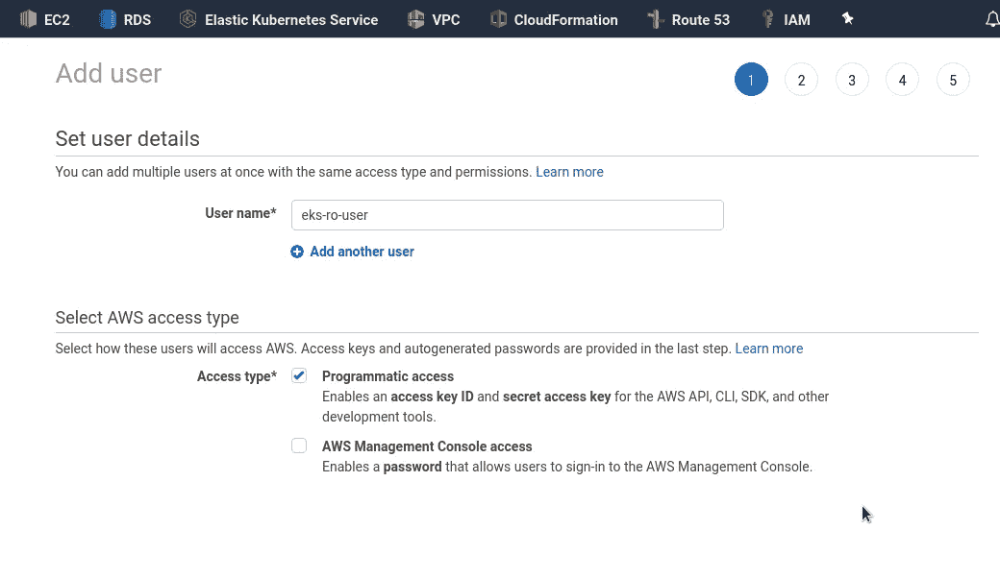
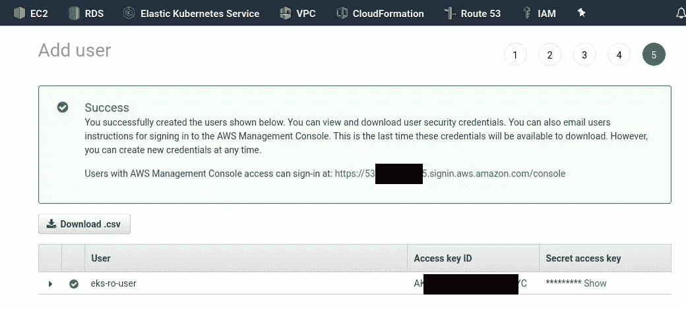
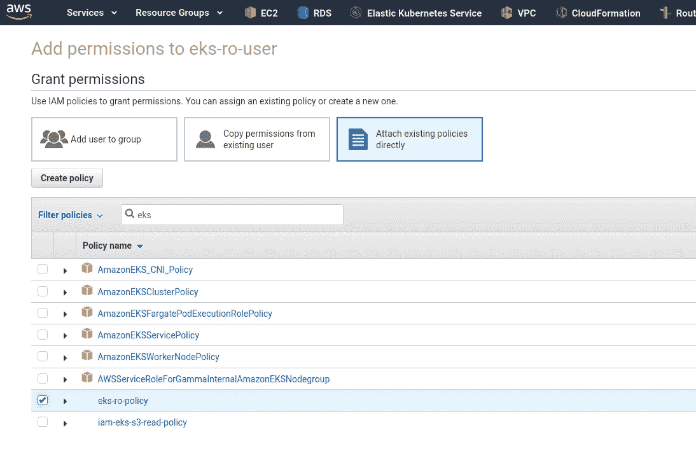

# Kubernetes:第 5 部分—带有角色和角色绑定示例的 RBAC 授权

> 原文：<https://itnext.io/kubernetes-part-5-rbac-authorization-with-a-role-and-rolebinding-example-765718e94f5a?source=collection_archive---------2----------------------->


下一个任务是添加一个新用户，该用户将有权检查 pods 状态和查看日志—必须禁止任何其他操作。

AWS EKS 在 Kubernetes 集群中使用 AWS IAM 进行身份验证(查看 [Kubernetes:第 4 部分— AWS EKS 身份验证、aws-iam-authenticator 和 AWS IAM post 了解详细信息](https://rtfm.co.ua/en/kubernetes-part-4-aws-eks-authentification-aws-iam-authenticator-and-aws-iam/))，而在授权方面，例如确定用户是否拥有特定操作的权限— Kubernetes 使用自己的基于角色的授权控制机制。

本系列的前几部分:

*   [Kubernetes:第 1 部分—架构和主要组件概述](https://rtfm.co.ua/en/kubernetes-part-1-architecture-and-main-components-overview/)
*   [Kubernetes:第 2 部分—使用 AWS 云提供商和 AWS 负载平衡器在 AWS 上建立集群](https://rtfm.co.ua/en/kubernetes-part-2-a-cluster-set-up-on-aws-with-aws-cloud-provider-and-aws-loadbalancer/)
*   [Kubernetes:第 3 部分— AWS EKS 概述和手动 EKS 集群设置](https://rtfm.co.ua/en/kubernetes-part-3-aws-eks-overview-and-manual-eks-cluster-set-up/)
*   [Kubernetes:第 4 部分— AWS EKS 认证、aws-iam-authenticator 和 AWS IAM post 了解详情](https://rtfm.co.ua/en/kubernetes-part-4-aws-eks-authentification-aws-iam-authenticator-and-aws-iam/)

让我们首先对 RBAC 做一个大致的概述，然后创建一个拥有必要权限的新用户。

## Kubernetes RBAC 概述

文档— [授权概述](https://kubernetes.io/docs/reference/access-authn-authz/authorization/)和[使用 RBAC 授权](https://kubernetes.io/docs/reference/access-authn-authz/rbac/)。

Kubernetes 的 RBAC 模型由三个主要部分组成:

*   角色:定义权限边界
*   主题:*用户*(人或应用程序)，或用户组
*   RoleBingdings:指定哪些*主题*拥有哪些*角色*

## RBAC `Role`

一个名为 *example-role* 的角色示例，它允许通过`get`、`watch`和`list`操作访问 *mynamespace* :

```
kind: Role
apiVersion: rbac.authorization.k8s.io/v1
metadata:
  namespace: mynamespace
  name: example-role
rules:
- apiGroups: [""]
  resources: ["pods"]
  verbs: ["get", "watch", "list"]
```

要获得 Kubernetes `[apiGroups](https://kubernetes.io/docs/reference/using-api/api-overview/#api-groups)`，可以使用`kubectl api-resources`:

```
$ kubectl api-resources -o wide
NAME SHORTNAMES APIGROUP NAMESPACED KIND VERBS
…
pods po true Pod [create delete deletecollection get list patch update watch]
…
```

在`rules`上面我们:

1.  `apiGroups: [""]` -设置*核心 API 组*
2.  `resources: ["pods"]` -允许访问哪些资源
3.  `["get", "watch", "list"]` -上面的资源允许哪些操作

## RBAC `RoleBingding`

为了将这些权限“映射”到用户，我们使用了 Kubernetes `RoleBingding`，它为*示例-用户*用户设置了 *mynamespace* 中的*示例-角色*:

```
kind: RoleBinding
apiVersion: rbac.authorization.k8s.io/v1
metadata:
  name: example-rolebinding
  namespace: mynamespace
subjects:
- kind: User
  name: example-user
  apiGroup: rbac.authorization.k8s.io
roleRef:
  kind: Role
  name: example-role
  apiGroup: rbac.authorization.k8s.io
```

我们在这里设定:

*   `subjects`:
*   `kind: User` -拥有访问权限的对象类型，在我们的例子中，这是一个普通用户
*   `name: example-user` -设置权限的用户名
*   `roleRef`:
*   `kind: Role` -到底什么将被附加到用户，在这种情况下，它是`Role`对象类型
*   `name: example-role` -以及上例中`name: example-role`中设置的角色名称

## `Role` vs `ClusterRole`

除了描述权限的规则集`Role`和`ClusterRole`之外，Kubernetes 还有`RoleBinding`和`ClusterRoleBinding`对象。

不同之处在于，`Role`用于名称空间内部，而`ClusterRole`是集群范围的权限，没有名称空间边界，例如:

*   允许访问群集节点
*   所有命名空间中的资源
*   允许访问端点，如`/healthz`

一个`ClusterRole`看起来类似于一个角色，唯一的区别是我们必须将它的`kind`设置为`ClusterRole`:

```
kind: ClusterRole
apiVersion: rbac.authorization.k8s.io/v1
metadata:
  name: example-clusterrole
rules:
- apiGroups: [""]
  resources: ["pods"]
  verbs: ["get", "watch", "list"]
```

还有一个`ClusterRoleBinding`例子:

```
kind: ClusterRoleBinding
apiVersion: rbac.authorization.k8s.io/v1
metadata:
  name: example-clusterrolebinding
subjects:
- kind: User
  name: example-user
  apiGroup: rbac.authorization.k8s.io
roleRef:
  kind: ClusterRole
  name: example-clusterrole
  apiGroup: rbac.authorization.k8s.io
```

请记住，一旦你创建了一个绑定，你将不能编辑它的`roleRef`值——相反，你必须删除一个绑定，然后重新创建

## EKS 认证和授权

简而言之，身份验证和授权流程如下:

1.  **认证**
2.  一个客户机向 Kubernetes 集群发出请求，传递带有用户 ID 的客户机令牌
3.  Kubernetes 使用`aws-iam-authenticator`请求 AWS IAM 检查这样一个用户是否真的存在，以及他是否真的是他所声称的那个人
4.  **授权**
5.  如果用户通过了身份验证步骤——Kubernetes 通过 RBAC 机制向他发送所有用户的数据和操作请求
6.  Kubernetes 寻找一个将用户与角色对应起来的`RoleBinding`
7.  通过 Rolу name，Kubernetes 将检查用户的权限
8.  最后，Kubernreteds 将允许或拒绝用户的请求


接下来，我们将:

1.  创建 IAM 用户
2.  配置 AWS CLI
3.  向窗格添加具有只读权限的 RBAC 角色
4.  添加一个 RBAC 角色绑定来连接我们的用户和角色

## IAM 用户

让我们从创建一个 IAM 用户开始。

添加一个新的唯一的*编程访问*:



保存其密钥:



## IAM 策略

例如，如果用户需要访问 AWS API 以获取集群列表，则需要为他添加 IAM 策略。

转到*策略—添加策略*:

```
{
    "Version": "2012-10-17",
    "Statement": [
        {
            "Effect": "Allow",
            "Action": [
                "eks:DescribeCluster",
                "eks:ListClusters"
            ],
            "Resource": "*"
        }
    ]
}
```

在这里，我们只允许两个 API 调用— `[eks:DescribeCluster](https://docs.aws.amazon.com/eks/latest/APIReference/API_DescribeCluster.html)`和`[eks:ListClusters](https://docs.aws.amazon.com/eks/latest/APIReference/API_ListClusters.html)`，用于所有 EKS 集群的所有区域。

保存它并附加到用户:



## AWS CLI 配置

要配置`kubectl`，首先我们需要配置我们的 AWS CLI，我们可以在专用 CLI 配置文件中完成，查看 [AWS: CLI 命名配置文件](https://rtfm.co.ua/en/aws-cli-named-profiles/)帖子:

```
$ aws configure — profile eks-ro-user
AWS Access Key ID [None]: AKI***FYC
AWS Secret Access Key [None]: SzH***VGi
Default region name [None]: eu-north-1
Default output format [None]: json
```

检查您现在使用的用户 ID:

```
$ aws — profile eks-ro-user sts get-caller-identity
{
“UserId”: “AID***XGK”,
“Account”: “534***385”,
“Arn”: “arn:aws:iam::534***385:user/eks-ro-user”
}
```

并检查对 EKS 集群的访问(最好说是对 AWS API 的访问):

```
$ aws — profile eks-ro-user eks list-clusters — output text
CLUSTERS eks-alb-testing-3
CLUSTERS eks-alb-testing-2
```

## 库伯内特 RBAC —一个例子

## `Role`

现在，让我们创建一个真实的用户和角色。

我们将从创建一个角色开始，该角色允许访问 pod 及其日志，并创建一个端口转发，并且仅用于`get`、`list`、`create`操作:

```
kind: Role
apiVersion: rbac.authorization.k8s.io/v1
metadata:
  name: eks-ro-role
rules:
- apiGroups: [""]
  resources: ["pods", "pods/log", "pods/portforward"]
  verbs: ["get", "list", "create"]
```

应用它:

```
$ kubectl apply -f rbac-role.yml
role.rbac.authorization.k8s.io/eks-ro-role created
```

并检查:

```
$ kubectl get roles -o yaml
apiVersion: v1
items:
- apiVersion: rbac.authorization.k8s.io/v1
kind: Role
metadata:
annotations:
kubectl.kubernetes.io/last-applied-configuration: |
{“apiVersion”:”rbac.authorization.k8s.io/v1",”kind”:”Role”,”metadata”:{“annotations”:{},”name”:”eks-ro-role”,”namespace”:”default”},”rules”:[{“apiGroups”:[“”],”resources”:[“pods”,”pods/log”],”verbs”:[“get”,”list”]}]}
creationTimestamp: “2020–03–24T10:34:27Z”
name: eks-ro-role
namespace: default
resourceVersion: “681997”
selfLink: /apis/rbac.authorization.k8s.io/v1/namespaces/default/roles/eks-ro-role
uid: 09a78b6f-6dbb-11ea-827f-0a9eb3e1782e
rules:
- apiGroups:
- “”
resources:
- pods
- pods/log
verbs:
- get
- list
kind: List
metadata:
resourceVersion: “”
selfLink: “”
```

## `RoleBinding`

接下来要添加一个 RoleBinding 来映射我们的用户名和上面创建的角色:

```
apiVersion: rbac.authorization.k8s.io/v1
kind: RoleBinding
metadata:
  name: eks-ro-role-binding
subjects:
- kind: User
  name: eks-ro-user
  apiGroup: rbac.authorization.k8s.io
roleRef:
  kind: Role
  name: eks-ro-role
  apiGroup: rbac.authorization.k8s.io
```

应用:

```
$ kubectl apply -f rbac-rolebinding.yml
rolebinding.rbac.authorization.k8s.io/eks-ro-role-binding created
```

## aws-auth `ConfigMap`

由于我们正在使用 AWS —需要更新 *aws-auth* `ConfigMap`(参见 [AWS EKS aws-auth ConfigMap](https://rtfm.co.ua/en/kubernetes-part-4-aws-eks-authentification-aws-iam-authenticator-and-aws-iam/#AWS_EKS_aws-auth_ConfigMap) ):

kubectl 编辑配置映射 aws-auth -n kube-system

添加`mapUsers`并指定用户的 ARN、姓名及其群组:

```
apiVersion: v1
data:
  mapRoles: |
    - groups:
      - system:bootstrappers
      - system:nodes
      rolearn: arn:aws:iam::534***385:role/eksctl-eks-alb-testing-2-nodegrou-NodeInstanceRole-M6BS1WV48RLR
      username: system:node:{{EC2PrivateDNSName}}
  mapUsers: |
    - userarn: arn:aws:iam::534***385:user/eks-ro-user
      username: eks-ro-user
      groups: eks-ro-role
```

保存并检查它:

```
$ kubectl get pods — as eks-ro-user
NAME READY STATUS RESTARTS AGE
nginx-7db9fccd9b-7d4rq 1/1 Running 0 58m
```

尝试获取工作节点—我们不允许访问此资源:

```
$ kubectl get nodes — as eks-ro-user
Error from server (Forbidden): nodes is forbidden: User “eks-ro-user” cannot list resource “nodes” in API group “” at the cluster scope
```

太好了！

现在，让我们来看看 pod 的日志——使用 NGINX 运行到测试 pod 的端口转发:

```
$ kubectl — as eks-ro-user port-forward nginx-7db9fccd9b-7d4rq 8000:80
Forwarding from 127.0.0.1:8000 -> 80
Forwarding from [::1]:8000 -> 80
```

向 pod 发出请求:

```
$ curl -I localhost:8000
HTTP/1.1 200 OK
```

并检查其日志:

```
$ kubectl — as eks-ro-user logs -f nginx-7db9fccd9b-7d4rq
127.0.0.1 — — [25/Mar/2020:07:29:06 +0000] “GET / HTTP/1.1” 200 612 “-” “curl/7.69.1” “-”
```

完成了。

## 有用的链接

*   [Kubernetes 中的认证和授权](https://www.sovsystems.com/blog/authentication-and-authorization-in-kubernetes)
*   [通过创建 pod 提升权限](https://kubernetes.io/docs/reference/access-authn-authz/authorization/#privilege-escalation-via-pod-creation)
*   [使用 kubeconfig 进行跨集群认证](https://unofficial-kubernetes.readthedocs.io/en/latest/concepts/cluster-administration/authenticate-across-clusters-kubeconfig/)
*   [授予用户访问您的 Kubernetes 集群的权限](https://www.openlogic.com/blog/granting-user-access-your-kubernetes-cluster)
*   [如何将受限访问 IAM 用户添加到 EKS 集群](https://www.freecodecamp.org/news/adding-limited-access-iam-user-to-eks-cluster/)
*   [管理集群的用户或 IAM 角色](https://docs.aws.amazon.com/eks/latest/userguide/add-user-role.html)
*   [Kubernetes 授权](https://www.magalix.com/blog/kubernetes-authorization)
*   [在亚马逊 EKS 创建集群后，我如何向其他用户和角色提供访问权限？](https://aws.amazon.com/ru/premiumsupport/knowledge-center/amazon-eks-cluster-access/)
*   如何在亚马逊 EKS 集群中为我的 IAM 用户管理跨名称空间的权限？
*   [亚马逊 EKS 基于身份的政策示例](https://docs.aws.amazon.com/eks/latest/userguide/security_iam_id-based-policy-examples.html)
*   [Kubernetes RBAC —授予登录和端口转发权限](https://medium.com/@ManagedKube/kubernetes-rbac-giving-permissions-for-logging-and-port-forwarding-882694c91927)
*   [添加新用户管理 AWS EKS](https://medium.com/faun/add-new-user-to-manage-aws-eks-e487c5d10ee3)
*   [用 RBAC 在 Kubernetes 中配置权限](https://medium.com/containerum/configuring-permissions-in-kubernetes-with-rbac-a456a9717d5d)

*最初发布于* [*RTFM: Linux、DevOps 和系统管理*](https://rtfm.co.ua/en/kubernetes-part-5-rbac-authorization-with-a-role-and-rolebinding-example/) *。*