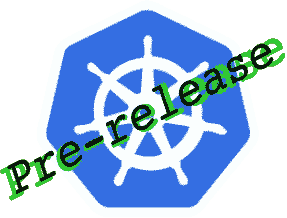

# Kubernetes 预稳定版本现已随 MicroK8s 推出

> 原文：<https://itnext.io/kubernetes-pre-stable-releases-now-available-with-microk8s-363d05998eff?source=collection_archive---------6----------------------->

如果你用`snap info microk8s`查看 MicroK8s 的频道信息，你会看到所有可用的 Kubernetes 版本:

```
channels:
  stable:         v1.14.1         2019-04-18 (522) 214MB classic
  candidate:      v1.14.1         2019-04-15 (522) 214MB classic
  beta:           v1.14.1         2019-04-15 (522) 214MB classic
  edge:           v1.14.1         2019-05-10 (587) 217MB classic
  1.15/stable:    –                                      
  1.15/candidate: –                                      
  1.15/beta:      –                                      
  1.15/edge:      v1.15.0-alpha.3 2019-05-08 (578) 215MB classic
  1.14/stable:    v1.14.1         2019-04-18 (521) 214MB classic
  1.14/candidate: v1.14.1         2019-04-15 (521) 214MB classic
  1.14/beta:      v1.14.1         2019-04-15 (521) 214MB classic
  1.14/edge:      v1.14.1         2019-05-11 (590) 217MB classic
  1.13/stable:    v1.13.5         2019-04-22 (526) 237MB classic
  1.13/candidate: v1.13.6         2019-05-09 (581) 237MB classic
  1.13/beta:      v1.13.6         2019-05-09 (581) 237MB classic
  1.13/edge:      v1.13.6         2019-05-08 (581) 237MB classic
  1.12/stable:    v1.12.8         2019-05-02 (547) 259MB classic
  1.12/candidate: v1.12.8         2019-05-01 (547) 259MB classic
  1.12/beta:      v1.12.8         2019-05-01 (547) 259MB classic
  1.12/edge:      v1.12.8         2019-04-24 (547) 259MB classic
  1.11/stable:    v1.11.10        2019-05-10 (557) 258MB classic
  1.11/candidate: v1.11.10        2019-05-02 (557) 258MB classic
  1.11/beta:      v1.11.10        2019-05-02 (557) 258MB classic
  1.11/edge:      v1.11.10        2019-05-01 (557) 258MB classic
  1.10/stable:    v1.10.13        2019-04-22 (546) 222MB classic
  1.10/candidate: v1.10.13        2019-04-22 (546) 222MB classic
  1.10/beta:      v1.10.13        2019-04-22 (546) 222MB classic
  1.10/edge:      v1.10.13        2019-04-22 (546) 222MB classic
```

如果您想遵循 1.14 Kubernetes 版本，您应该:

```
sudo snap install microk8s --classic --channel=1.14/stable
```

然而，如果您总是希望获得最新的稳定版本，您应该:

```
sudo snap install microk8s --classic
```

上面的频道列表中的新内容是 1.15 版本下的预稳定版本(在撰写本文时，最新的稳定版本是 1.14)。



## 在预稳定版本之后

我们承诺按照以下计划发布带有预稳定版本的 MicroK8s。

*   边缘通道(例如 1.15/边缘)容纳 alpha 上游释放。
*   beta 通道(例如 1.15/beta)保存 beta 上游版本。
*   候选通道(例如 1.15/candidate)保存上游发布的发布候选。

预稳定版本将在上游发布的同一天可用。

如果您想在 alpha 1.15 版本中测试您的工作，只需:

```
sudo snap install microk8s --classic --channel=1.15/edge
```

但是，请注意，预稳定版本可能会在稳定版本之前发生变化。一旦稳定版本可用，一定要对其进行测试。

## 具有稳定版本的跟踪

曲目旨在服务于特定的 Kubernetes 版本。例如，1.15 轨道及其四个通道(1.15/edge、1.15/beta、1.15/candidate、1.15/stable)服务于 v1.15 K8s 版本。一旦新的 K8s 稳定版本发布，相应音轨的所有通道都会更新。在我们的示例中，1.15 版稳定版一发布，相应的轨道通道就会以下列方式更新:

*   1.15/edge 通道在与 v1.15 稳定 K8s 版本配对的 [MicroK8s 储存库](https://github.com/ubuntu/microk8s)上合并的每次提交时更新。
*   1.15/beta 和 1.15/candidate 通道会在每个上游补丁发布时更新。他们持有 1.15/edge 通道在补丁发布时拥有的任何内容。
*   在 1.15/candidate 中加入新版本一周后，1.15/stable 频道会更新 1.15/candidate 的内容。

## 我很困惑。哪个频道适合我？

您需要回答的一个问题是，在下面的渠道参数中输入什么:

```
sudo snap install microk8s --classic --channel=<What_to_use_here?>
```

以下是根据您的需求为渠道提供的一些建议:

*   我想一直在最新的稳定 Kubernetes 上。
    使用`--channel=latest`
*   我想总是在一个特定的上游 K8s 版本的最新版本。
    使用`--channel=<release>/stable`例如`--channel=1.14/stable.`
*   我想测试一个预稳定的版本。
    使用`--channel=<next_release>/edge`发布 alpha 版本
    使用`--channel=<next_release>/beta`发布 beta 版本
    使用`--channel=<next_release>/candidate`发布候选版本
*   我在等 MicroK8s 的一个 bug 修复:
    用`--channel=<release>/edge`
*   我正在等待上游 Kubernetes 的一个错误修复:
    使用`--channel=<release>/candidate`

## 用 MicroK8s 开发 K8s 核心服务

预稳定版本的目的之一是帮助 K8s 核心服务开发者完成他们的任务。让我们看看如何将 kubelet 的本地构建与 MicroK8s 部署挂钩。

按照 Kubernetes 的[构建说明](https://github.com/kubernetes/kubernetes/blob/master/README.md)我们:

```
git clone [https://github.com/kubernetes/kubernetes](https://github.com/kubernetes/kubernetes)
cd kubernetes
build/run.sh make kubelet
```

kubelet 二进制文件应该可以在以下位置获得:

```
_output/dockerized/bin/linux/amd64/kubelet
```

让我们来看一个 MicroK8s 部署:

```
sudo snap install microk8s --classic --channel=1.15/edge
```

为了查看 kubelet 运行的参数，我们:

```
> ps -ef | grep kubelet
root     24184     1  2 17:28 ?        00:00:54 /snap/microk8s/578/kubelet 
--kubeconfig=/snap/microk8s/578/configs/kubelet.config 
--cert-dir=/var/snap/microk8s/578/certs 
--client-ca-file=/var/snap/microk8s/578/certs/ca.crt 
--anonymous-auth=false 
--network-plugin=kubenet 
--root-dir=/var/snap/microk8s/common/var/lib/kubelet 
--fail-swap-on=false 
--pod-cidr=10.1.1.0/24 
--non-masquerade-cidr=10.152.183.0/24 
--cni-bin-dir=/snap/microk8s/578/opt/cni/bin/ 
--feature-gates=DevicePlugins=true 
--eviction-hard=memory.available<100Mi,nodefs.available<1Gi,imagefs.available<1Gi 
--container-runtime=remote 
--container-runtime-endpoint=/var/snap/microk8s/common/run/containerd.sock 
--node-labels=microk8s.io/cluster=true
```

我们现在需要停止 MicroK8s 附带的 kubelet，开始我们自己的构建:

```
sudo systemctl stop snap.microk8s.daemon-kubelet.servicesudo _output/dockerized/bin/linux/amd64/kubelet 
--kubeconfig=/snap/microk8s/578/configs/kubelet.config  
--cert-dir=/var/snap/microk8s/578/certs 
--clit-ca-file=/var/snap/microk8s/578/certs/ca.crt   
--anonymous-auth=false --network-plugin=kubenet  
--root-dir=/var/snap/microk8s/common/var/lib/kubelet  
--fail-swap-on=false --pod-cidr=10.1.1.0/24  
--container-runtime=remote 
--container-runtime-endpoint=/var/snap/microk8s/common/run/containerd.sock 
--node-labels=microk8s.io/cluster=true  --eviction-hard='memory.available<100Mi,nodefs.available<1Gi,imagefs.available<1Gi'
```

就是这样！你的 kubelet 现在代替了 MicroK8s 中的 kube let！你必须承认这很简单。

你应该知道的是，一些`microk8s`命令会通过 systemd 重启服务。例如，`microk8s.enable dns`将启动一个服务重启，包括 MicroK8s 附带的 kubelet。

编码快乐！

## 进一步阅读

*   [Kubernetes 回购](https://github.com/kubernetes/kubernetes)
*   [MicroK8s 回购](https://github.com/ubuntu/microk8s)
*   [捕捉通道](https://docs.snapcraft.io/channels)